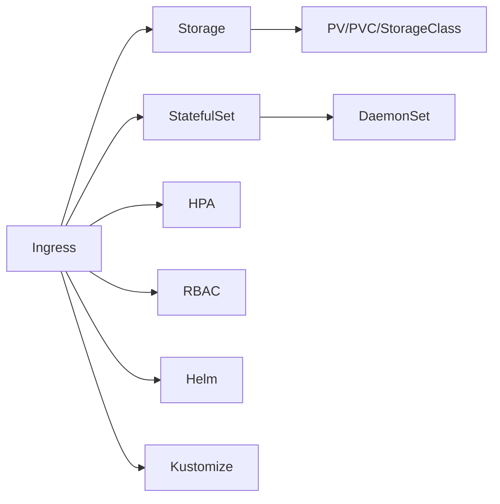

# Chapter 8: Kubernetes Advanced

> **Previous:** [Infrastructure as Code (IaC)](./07-infrastructure-as-code.md) | **Next:** [Configuration Management with Ansible](./08-configuration-management.md)

## Learning Objectives


By the end of this chapter, students will be able to:

1. Configure Ingress controllers for HTTP-based routing and TLS termination
2. Implement persistent storage with PersistentVolumes, PersistentVolumeClaims, and StorageClasses
3. Deploy stateful applications using StatefulSets with stable identities
4. Configure autoscaling with Horizontal Pod Autoscaler
5. Apply RBAC for fine-grained access control
6. Package and deploy applications with Helm and Kustomize


## Chapter at a Glance

| Topic | Key Insight | Practical Takeaway |
|-------|-------------|-------------------|
| Ingress | HTTP/HTTPS routing with TLS termination | Use Ingress controller annotations for advanced routing |
| Persistent Storage | PV, PVC, StorageClass for stateful workloads | Use CSI drivers for cloud provider storage integration |
| StatefulSet | Stable identities for stateful applications | Use for databases requiring ordered deployment |
| HPA | Automatic scaling based on CPU/memory/custom metrics | Set min/max replicas with target utilization |
| RBAC | Fine-grained API access control | Use ClusterRole for cluster-wide permissions sparingly |
| Helm & Kustomize | Package management and configuration customization | Helm for templating; Kustomize for overlays |

## Chapter Roadmap



## Theory

### 8.1 Ingress

> **Pro Tip:** Use Helm and Kustomize together: Helm for generic chart distribution, Kustomize for environment-specific overlays.

Ingress exposes HTTP and HTTPS routes from outside the cluster to Services within the cluster. An Ingress controller (NGINX, Traefik, HAProxy, AWS ALB Ingress Controller) implements the Ingress specification.

```yaml
apiVersion: networking.k8s.io/v1
kind: Ingress
metadata:
  name: main-ingress
  annotations:
    nginx.ingress.kubernetes.io/rewrite-target: /
spec:
  ingressClassName: nginx
  tls:
    - hosts:
        - app.example.com
      secretName: app-tls
  rules:
    - host: app.example.com
      http:
        paths:
          - path: /api
            pathType: Prefix
            backend:
              service:
                name: api-service
                port:
                  number: 80
          - path: /
            pathType: Prefix
            backend:
              service:
                name: web-service
                port:
                  number: 80
```

Ingress supports path-based routing, host-based routing, TLS termination, sticky sessions, rate limiting, and custom error pages via annotations.

### 8.2 Storage

> **Warning:** StatefulSet rolling updates are ordered (N-1 to 0). This is slower than Deployment updates but maintains data integrity.

Persistent storage in Kubernetes follows a three-layer model:

**PersistentVolume (PV)** — Cluster resource provisioned by an administrator or dynamically provisioned via StorageClass. Represents a storage unit (NFS share, EBS volume, GCE PD).

**PersistentVolumeClaim (PVC)** — Request for storage by a user. PVCs specify size, access mode (ReadWriteOnce, ReadOnlyMany, ReadWriteMany), and StorageClass.

**StorageClass** — Defines storage provisioner parameters. Enables dynamic provisioning.

```yaml
apiVersion: storage.k8s.io/v1
kind: StorageClass
metadata:
  name: fast-ssd
provisioner: ebs.csi.aws.com
parameters:
  type: io1
  iopsPerGB: "10"
---
apiVersion: v1
kind: PersistentVolumeClaim
metadata:
  name: data-pvc
spec:
  accessModes:
    - ReadWriteOnce
  resources:
    requests:
      storage: 100Gi
  storageClassName: fast-ssd
```

Container Storage Interface (CSI) drivers standardize storage plugin development. Major cloud providers and storage vendors provide CSI drivers.

### 8.3 StatefulSet

> **Remember:** NetworkPolicy is deny-by-default when applied. Always ensure essential traffic is explicitly allowed.

StatefulSet manages stateful applications that require stable, unique network identities and persistent storage. Unlike Deployments, StatefulSet Pods are created and deleted in order, and each Pod gets a stable identity (`podname-0`, `podname-1`, etc.).

```yaml
apiVersion: apps/v1
kind: StatefulSet
metadata:
  name: postgres
spec:
  serviceName: postgres
  replicas: 3
  selector:
    matchLabels:
      app: postgres
  template:
    metadata:
      labels:
        app: postgres
    spec:
      containers:
        - name: postgres
          image: postgres:16
          volumeMounts:
            - name: data
              mountPath: /var/lib/postgresql/data
  volumeClaimTemplates:
    - metadata:
        name: data
      spec:
        storageClassName: fast-ssd
        accessModes: [ReadWriteOnce]
        resources:
          requests:
            storage: 50Gi
```

Use StatefulSet for databases, message queues, key-value stores, and any workload requiring stable network identity or ordered deployment.

### 8.4 DaemonSet

DaemonSet ensures that every node (or a subset) runs a copy of a Pod. Used for node-level infrastructure: log collectors (Fluentd), monitoring agents (Prometheus Node Exporter), service mesh proxies (Envoy), and CNI plugins.

### 8.5 Job and CronJob

Job manages pods that run to completion. CronJob creates Jobs on a schedule.

```yaml
apiVersion: batch/v1
kind: CronJob
metadata:
  name: db-backup
spec:
  schedule: "0 2 * * *"
  jobTemplate:
    spec:
      template:
        spec:
          containers:
            - name: backup
              image: backup-tool:1.0
              command: ["backup", "--database=prod"]
          restartPolicy: OnFailure
```

### 8.6 Horizontal Pod Autoscaler

HPA automatically scales Pod replicas based on observed CPU, memory, or custom metrics.

```yaml
apiVersion: autoscaling/v2
kind: HorizontalPodAutoscaler
metadata:
  name: api-hpa
spec:
  scaleTargetRef:
    apiVersion: apps/v1
    kind: Deployment
    name: api
  minReplicas: 3
  maxReplicas: 20
  metrics:
    - type: Resource
      resource:
        name: cpu
        target:
          type: Utilization
          averageUtilization: 70
```

HPA requires a metrics source: metrics-server (resource metrics), Prometheus Adapter (custom metrics), or Kubernetes Events API.

### 8.7 PodDisruptionBudget

PDB limits the number of Pods that can be unavailable simultaneously during voluntary disruptions (node maintenance, cluster upgrades).

```yaml
apiVersion: policy/v1
kind: PodDisruptionBudget
metadata:
  name: api-pdb
spec:
  minAvailable: 2
  selector:
    matchLabels:
      app: api
```

### 8.8 NetworkPolicy

NetworkPolicy controls traffic flow to and from Pods. By default, Pods accept all traffic. A NetworkPolicy applied to a Pod restricts its traffic.

```yaml
apiVersion: networking.k8s.io/v1
kind: NetworkPolicy
metadata:
  name: api-policy
spec:
  podSelector:
    matchLabels:
      app: api
  policyTypes:
    - Ingress
    - Egress
  ingress:
    - from:
        - podSelector:
            matchLabels:
              app: web
      ports:
        - port: 8080
  egress:
    - to:
        - podSelector:
            matchLabels:
              app: database
```

### 8.9 RBAC

RBAC controls access to Kubernetes API resources.

```yaml
apiVersion: v1
kind: ServiceAccount
metadata:
  name: app-sa
  namespace: production
---
apiVersion: rbac.authorization.k8s.io/v1
kind: Role
metadata:
  namespace: production
  name: pod-reader
rules:
  - apiGroups: [""]
    resources: ["pods", "pods/log"]
    verbs: ["get", "list", "watch"]
---
apiVersion: rbac.authorization.k8s.io/v1
kind: RoleBinding
metadata:
  name: read-pods
  namespace: production
subjects:
  - kind: ServiceAccount
    name: app-sa
    namespace: production
roleRef:
  kind: Role
  name: pod-reader
  apiGroup: rbac.authorization.k8s.io
```

ClusterRole and ClusterRoleBinding apply across all namespaces for cluster-wide permissions.

### 8.10 Helm

Helm is the Kubernetes package manager. Charts package Kubernetes manifests with templates and default values.

```bash
# Install a chart
helm install release-name ./chart

# Create a chart skeleton
helm create mychart

# Template rendering (dry run)
helm template ./mychart

# Upgrade with values
helm upgrade release-name ./chart -f values-prod.yaml
```

Helm templates use Go templating with Sprig function library. Charts support dependencies, hooks, subcharts, and testing.

### 8.11 Kustomize

Kustomize provides native Kubernetes configuration customization without templating. It overlays patches on base configurations.

```yaml
# kustomization.yaml
apiVersion: kustomize.config.k8s.io/v1beta1
kind: Kustomization
resources:
  - deployment.yaml
  - service.yaml
patches:
  - path: prod-patch.yaml
    target:
      kind: Deployment
      name: api
```

### 8.12 Operators and CRDs

Operators extend Kubernetes with application-specific operational knowledge. A Custom Resource Definition (CRD) defines new resource types. An operator controller reconciles desired state with actual state for the custom resource.

Popular operators: Prometheus Operator, PostgreSQL Operator (Crunchy, Zalando), Cert-Manager, External Secrets Operator.

## Summary

## Concept Comparison Table

| Concept | Description |
|---------|-------------|
| Ingress | HTTP/HTTPS external routing controller |
| StatefulSet | Ordered, stable Pods for stateful apps |
| DaemonSet | One Pod per node for infrastructure agents |
| HPA | Automatic Pod scaling based on metrics |
| RBAC | Role-based API access control |

## Quick Reference

| Topic | Key Points |
|-------|------------|
| Ingress | Path/host routing, TLS, annotations |
| Storage | PV(cluster), PVC(request), StorageClass(dynamic) |
| Controllers | StatefulSet, DaemonSet, Job, CronJob |
| HPA | CPU/memory target, min/max replicas |
| RBAC | Role, RoleBinding, ClusterRole, ClusterRoleBinding |

## Cross-Application Matrix

| Domain | Application |
|--------|-------------|
| Web | TLS ingress for multiple web services |
| Cloud | Cloud-specific CSI storage drivers |
| Enterprise | RBAC for multi-team cluster access |
| ML | GPU nodes via DaemonSet drivers |

## Chapter Quiz

<details><summary>Question 1: What does HPA stand for?</summary>**A)** High Performance Architecture<br>**B)** Horizontal Pod Autoscaler<br>**C)** Host Process Allocator<br>**D)** Hierarchical Pod Automation<br><br>**Answer: B)** Horizontal Pod Autoscaler</details>

<details><summary>Question 2: Why use StatefulSet instead of Deployment for databases?</summary>**A)** StatefulSets are faster<br>**B)** StatefulSets provide stable network identities<br>**C)** Deployments cannot run databases<br>**D)** StatefulSets use less memory<br><br>**Answer: B)** StatefulSets provide stable network identities</details>

<details><summary>Question 3: What does a RoleBinding grant?</summary>**A)** Network access to Pods<br>**B)** API permissions within a namespace<br>**C)** Storage access<br>**D)** Image pull access<br><br>**Answer: B)** API permissions within a namespace</details>


## Summary

Advanced Kubernetes topics address production requirements. Ingress provides sophisticated HTTP routing and TLS termination. Persistent storage is managed through PV/PVC/StorageClass abstractions. StatefulSets handle stateful workloads with stable identities. HPA enables dynamic scaling. RBAC secures API access. Helm and Kustomize package and customize deployments. Operators and CRDs extend Kubernetes for domain-specific automation. Together, these capabilities make Kubernetes suitable for production-grade workloads.

## Exercises

### Review Questions

1. How does StatefulSet ordering differ from Deployment ordering during scaling and updates?
2. What conditions would cause a Horizontal Pod Autoscaler to scale down?
3. Compare Helm and Kustomize: what problem does each solve, and when would you use one over the other?
4. How does a NetworkPolicy affect traffic to pods that are not matched by the policy selector?
5. What components must a custom operator implement to manage a CRD?

### Application Problems

1. Deploy a StatefulSet running PostgreSQL with persistent storage, a headless Service, and a ClusterIP Service for read replicas. Configure probes and resource limits.
2. Create an NGINX Ingress controller deployment. Configure an Ingress resource that routes /api/* to one Service and /* to another, with TLS termination using a self-signed certificate stored as a Secret.
3. Package the PostgreSQL StatefulSet as a Helm chart with configurable values for storage size, replica count, and image tag.

### Challenge Problem

Design a production-ready database platform on Kubernetes for a SaaS application with the following requirements: PostgreSQL with automated backups (hourly snapshots, daily full), point-in-time recovery, automated failover (primary replica), monitoring with Prometheus, rotation of TLS certificates, and zero-downtime major version upgrades. Use Operators where appropriate. Define the architecture, CRDs, Helm chart structure, backup schedule, monitoring integration, and disaster recovery procedure. Include applicable YAML for the operator configuration and backup CronJob.
