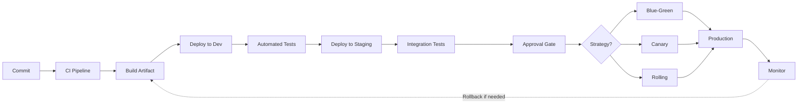
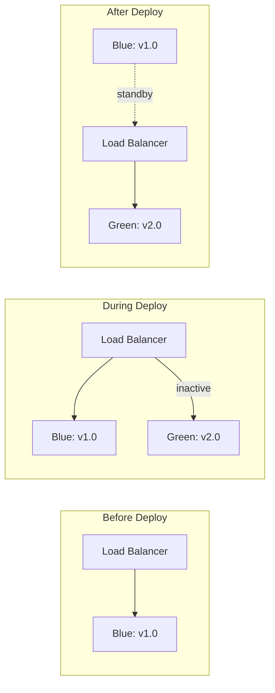
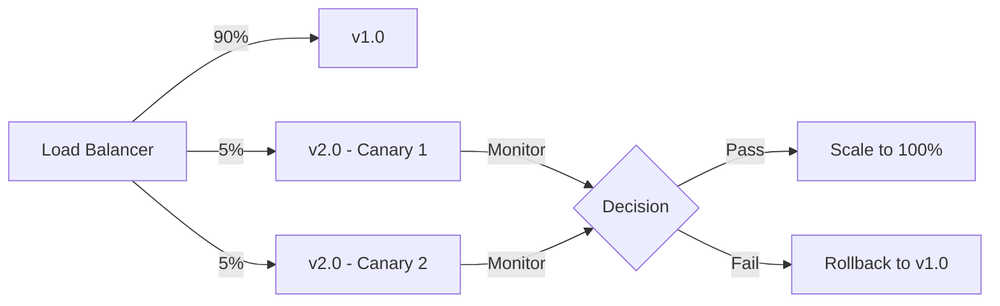
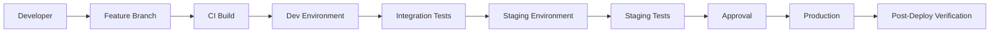

# Chapter 9: Continuous Delivery

> **Prev:** [Advanced Kubernetes](./08-k8s-advanced.md)
> **Next:** [Terraform & IaC](./09-iac.md)

---

## Learning Objectives

- Understand Continuous Delivery principles and the deployment pipeline.
- Differentiate between release strategies: blue-green, canary, rolling, feature flags.
- Implement deployment automation with approval gates and rollback mechanisms.
- Manage environment promotion from development to production.
- Apply deployment strategies for zero-downtime releases.
- Implement release governance and compliance.

---

## Chapter at a Glance

| Topic | Key Insight | Practical Takeaway |
|-------|-------------|-------------------|
| CD Principles | Every commit is potentially deployable | Automation and testing make this possible |
| Blue-Green | Two identical environments | Instant switchover with zero downtime |
| Canary | Gradual traffic shifting | Reduced blast radius for bad releases |
| Rolling | Incremental pod replacement | Standard for Kubernetes deployments |
| Feature Flags | Toggle features at runtime | Decouple deploy from release |
| Deployment Pipeline | Automated promotion flow | Same artifact through all environments |
| Rollback | Revert to previous version | Automate on health check failure |
| Release Governance | Approval gates and compliance | Audit trail for regulatory requirements |

## Chapter Roadmap



## Theory

### CD vs CI vs Continuous Deployment

| Aspect | Continuous Delivery | Continuous Deployment |
|--------|-------------------|----------------------|
| Automation | Automated to staging | Automated to production |
| Production gate | Manual approval | Fully automated |
| Risk tolerance | Higher | Lower |
| Team maturity | Medium | High |
| Compliance needs | Can include manual steps | Requires full automation |

### Deployment Strategies

**Blue-Green Deployment:**



**Advantages:** Instant switch, immediate rollback (switch back), full environment separation.
**Disadvantages:** Double infrastructure cost, database compatibility challenges.

**Canary Deployment:**



**Advantages:** Reduced blast radius, real traffic testing, metrics-driven promotion.
**Disadvantages:** Slower rollout, requires sophisticated traffic routing, monitoring overhead.

**Rolling Update:**

```text
Initial:    [v1] [v1] [v1] [v1] [v1]
Step 1:     [v2] [v1] [v1] [v1] [v1]   (1 new, 4 old)
Step 2:     [v2] [v2] [v1] [v1] [v1]   (2 new, 3 old)
Step 3:     [v2] [v2] [v2] [v1] [v1]   (3 new, 2 old)
Step 4:     [v2] [v2] [v2] [v2] [v1]   (4 new, 1 old)
Step 5:     [v2] [v2] [v2] [v2] [v2]   (5 new, 0 old)
```

**Advantages:** No additional infrastructure, standard Kubernetes strategy, progressive.
**Disadvantages:** Slower rollback, exposes multiple versions simultaneously.

### Feature Flags

Feature flags decouple deployment from release. Code can be deployed to production but remain inactive until the flag is toggled:

```typescript
class FeatureFlagService {
  private flags: Map<string, boolean> = new Map();

  constructor() {
    this.flags.set('new-checkout-flow', false);
    this.flags.set('dark-mode', true);
    this.flags.set('ai-recommendations', false);
  }

  isEnabled(flag: string, userContext?: { id: string; tier: string }): boolean {
    // Global flag
    if (this.flags.has(flag)) return this.flags.get(flag)!;

    // User-targeted rollout
    if (userContext && flag === 'new-checkout-flow') {
      return this.targetedRollout(userContext.id, 25); // 25% rollout
    }

    return false;
  }

  private targetedRollout(userId: string, percentage: number): boolean {
    // Consistent hashing for stable flags
    const hash = this.hashCode(userId) % 100;
    return hash < percentage;
  }

  private hashCode(str: string): number {
    let hash = 0;
    for (let i = 0; i < str.length; i++) {
      hash = ((hash << 5) - hash) + str.charCodeAt(i);
    }
    return Math.abs(hash);
  }
}

const features = new FeatureFlagService();
console.log('Dark mode enabled:', features.isEnabled('dark-mode'));
console.log('New checkout for user_42:', features.isEnabled('new-checkout-flow', { id: 'user_42', tier: 'beta' }));
```

**Feature flag categories:**
- **Release toggles:** Control new feature rollout
- **Experiment toggles:** A/B testing
- **Ops toggles:** Kill switches for production issues
- **Permission toggles:** Tier-based feature access

### Environment Promotion



**Promotion criteria:**
- All CI checks pass (lint, type check, unit tests)
- Integration tests pass
- Security scan passes (no critical/high vulnerabilities)
- Performance benchmarks meet thresholds
- Manual approval (for CD, not Continuous Deployment)

### Rollback Strategies

**Automatic rollback triggers:**
- Health check failure after deploy
- Increased error rate (e.g., 5xx > 1%)
- Increased latency (e.g., p99 > 500ms)
- Decreased throughput

**Rollback mechanisms:**
- **Redeploy previous version:** Simplest, most reliable
- **Git revert:** Revert the commit and deploy
- **Traffic switch:** For blue-green, switch load balancer back
- **Feature flag off:** Disable the feature at runtime

### Deployment Pipeline Implementation

```yaml
# deploy-pipeline.yaml
stages:
  - name: Build
    steps:
      - npm ci
      - npm run build
      - docker build -t myapp:$COMMIT_SHA .
      - docker push myapp:$COMMIT_SHA

  - name: Deploy to Dev
    steps:
      - kubectl set image deployment/myapp myapp=myapp:$COMMIT_SHA
      - kubectl rollout status deployment/myapp

  - name: Integration Tests
    steps:
      - npm run test:integration
      - npm run test:e2e

  - name: Deploy to Staging
    environment: staging
    approval: automatic
    steps:
      - kubectl set image deployment/myapp myapp=$COMMIT_SHA
      - kubectl rollout status deployment/myapp
      - verify-health

  - name: Deploy to Production
    environment: production
    approval: manual
    strategy: canary
    steps:
      - deploy-canary 10%
      - verify-metrics
      - scale-to-100%

  - name: Smoke Tests
    steps:
      - verify-health
      - verify-features
```

---

## Examples

### Example 1: Canary Deployment Controller

```typescript
interface CanaryConfig {
  name: string;
  namespace: string;
  image: string;
  stableReplicas: number;
  canaryReplicas: number;
  steps: CanaryStep[];
  metrics: CanaryMetric[];
}

interface CanaryStep {
  weight: number;
  pause: number; // seconds
}

interface CanaryMetric {
  name: string;
  threshold: number;
  query: string;
}

class CanaryController {
  private config: CanaryConfig;

  constructor(config: CanaryConfig) {
    this.config = config;
  }

  async execute(): Promise<boolean> {
    console.log(`🚀 Starting canary deployment for ${this.config.name}\n`);

    // Deploy canary instances
    await this.deployCanary();
    console.log(`✅ Canary deployed: ${this.config.canaryReplicas} replicas\n`);

    // Progress through traffic weight steps
    for (const step of this.config.steps) {
      console.log(`Setting traffic weight to ${step.weight}%...`);
      await this.updateTrafficWeight(step.weight);

      console.log(`Waiting ${step.pause}s for metrics collection...`);
      await this.sleep(step.pause * 1000);

      // Check metrics
      for (const metric of this.config.metrics) {
        const passed = await this.checkMetric(metric);
        if (!passed) {
          console.log(`❌ Metric "${metric.name}" exceeded threshold (${metric.threshold})`);
          await this.rollback();
          return false;
        }
        console.log(`✅ ${metric.name}: within threshold`);
      }
    }

    // Promote to full rollout
    await this.promote();
    console.log('🎉 Canary promotion complete');
    return true;
  }

  private async deployCanary(): Promise<void> {
    console.log('Creating canary instances...');
  }

  private async updateTrafficWeight(weight: number): Promise<void> {
    console.log(`Traffic distribution: ${weight}% canary, ${100 - weight}% stable`);
  }

  private async checkMetric(metric: CanaryMetric): Promise<boolean> {
    const currentValue = Math.random() * 5; // Simulated metric
    console.log(`  Metric "${metric.name}": ${currentValue.toFixed(2)} (threshold: ${metric.threshold})`);
    return currentValue <= metric.threshold;
  }

  private async promote(): Promise<void> {
    console.log('Scaling canary to 100%...');
    console.log('Removing stable instances...');
    console.log('Canary promoted to stable.');
  }

  private async rollback(): Promise<void> {
    console.log('⚠️  Rolling back canary...');
    console.log('Removing canary instances...');
    console.log('Restoring full stable traffic.');
  }

  private sleep(ms: number): Promise<void> {
    return new Promise(resolve => setTimeout(resolve, ms));
  }
}

const controller = new CanaryController({
  name: 'api-service',
  namespace: 'production',
  image: 'myapp:2.0.0',
  stableReplicas: 10,
  canaryReplicas: 2,
  steps: [
    { weight: 10, pause: 60 },
    { weight: 25, pause: 120 },
    { weight: 50, pause: 180 },
    { weight: 75, pause: 120 },
    { weight: 100, pause: 60 },
  ],
  metrics: [
    { name: 'error_rate', threshold: 1.0, query: 'rate(http_requests_total{status=~"5.."}[5m])' },
    { name: 'latency_p99', threshold: 500, query: 'histogram_quantile(0.99, ...)' },
  ],
});

controller.execute();
```

### Example 2: Release Orchestrator

```typescript
interface Release {
  version: string;
  artifact: string;
  changelog: string[];
  author: string;
}

interface Environment {
  name: string;
  approvalRequired: boolean;
  approvers: string[];
  tests: string[];
}

class ReleaseOrchestrator {
  private releases: Release[] = [];
  private currentRelease?: Release;

  async promote(release: Release, from: string, to: string): Promise<boolean> {
    console.log(`\n🚀 Promoting ${release.version} from ${from} to ${to}`);
    this.currentRelease = release;

    const passed = await this.runEnvironmentTests(to);
    if (!passed) {
      console.log(`❌ Tests failed in ${to}, halting promotion`);
      return false;
    }

    console.log(`✅ ${release.version} promoted to ${to}`);
    return true;
  }

  private async runEnvironmentTests(env: string): Promise<boolean> {
    const testSuites: Record<string, string[]> = {
      dev: ['unit', 'lint', 'type-check'],
      staging: ['integration', 'security-scan', 'performance'],
      production: ['smoke', 'health-check'],
    };

    const tests = testSuites[env] || ['health-check'];
    for (const test of tests) {
      console.log(`  Running ${test}...`);
      await this.sleep(500);
    }
    return true;
  }

  async rollback(environment: string, targetVersion: string): Promise<void> {
    console.log(`\n⚠️  Rolling back ${environment} to ${targetVersion}`);
    this.releases.push(this.currentRelease!);
    console.log(`✅ Rollback complete`);
  }

  getReleaseHistory(): string {
    let history = '# Release History\n\n';
    this.releases.forEach((r, i) => {
      history += `## ${r.version} (${r.author})\n`;
      r.changelog.forEach(c => history += `- ${c}\n`);
      history += '\n';
    });
    return history;
  }

  private sleep(ms: number): Promise<void> {
    return new Promise(resolve => setTimeout(resolve, ms));
  }
}

const orchestrator = new ReleaseOrchestrator();
const release: Release = {
  version: '2.1.0',
  artifact: 'myapp:2.1.0',
  changelog: ['feat: Add OAuth2 login', 'fix: Fix memory leak', 'chore: Update dependencies'],
  author: 'dev-team',
};

orchestrator.promote(release, 'dev', 'staging');
```

---

## Practical Takeaways

1. **Use feature flags to decouple deploy from release.** Deploy often, release when ready.
2. **Implement blue-green or canary for production.** Zero-downtime deployments reduce risk.
3. **Automate rollback triggers.** Health check failures should automatically revert.
4. **Promote the same artifact.** Build once, deploy everywhere — no rebuilding.
5. **Monitor every deployment.** Error rates, latency, and throughput are key signals.
6. **Keep deployments small.** Smaller changes are easier to test and roll back.

---

## Chapter Quiz

<details><summary>Question 1: What is the main advantage of blue-green deployment?</summary>**A)** Lower infrastructure cost<br>**B)** Instant switchover and immediate rollback<br>**C)** No monitoring required<br>**D)** Faster build times<br><br>**Answer: B)** Instant switchover and immediate rollback</details>

<details><summary>Question 2: What does a canary deployment do?</summary>**A)** Deploys all at once<br>**B)** Gradually shifts traffic to the new version<br>**C)** Deploys to a separate environment<br>**D)** Uses feature flags<br><br>**Answer: B)** Gradually shifts traffic to the new version</details>

<details><summary>Question 3: Feature flags decouple what two activities?</summary>**A)** Build and test<br>**B)** Deploy and release<br>**C)** Code and review<br>**D)** Plan and execute<br><br>**Answer: B)** Deploy and release</details>

<details><summary>Question 4: What is a valid automatic rollback trigger?</summary>**A)** Build takes too long<br>**B)** Error rate exceeds 1% after deployment<br>**C)** Developer pushes new code<br>**D)** Approval is delayed<br><br>**Answer: B)** Error rate exceeds 1% after deployment</details>

<details><summary>Question 5: What does "build once, deploy everywhere" mean?</summary>**A)** The same build artifact is promoted through all environments<br>**B)** Each environment builds its own version<br>**C)** Use multiple CI servers<br>**D)** Deploy to production directly from feature branches<br><br>**Answer: A)** The same build artifact is promoted through all environments</details>

---

## Summary

- Continuous Delivery ensures every commit is potentially deployable through automated pipelines and testing.
- Deployment strategies include blue-green (instant switch), canary (gradual rollout), and rolling (incremental replacement).
- Feature flags decouple deployment from release, enabling safe, gradual feature exposure.
- Environment promotion moves artifacts through dev → staging → production with gates.
- Automatic rollback triggers (error rate, latency, health checks) revert bad deployments.
- The same immutable artifact should be promoted through all environments.
- Release governance includes approval gates, audit trails, and compliance checks.

---

## Exercises

### Review Questions
1. What is the difference between continuous delivery and continuous deployment?
2. How does blue-green deployment achieve zero downtime?
3. What are the advantages of canary deployments over blue-green?
4. How do feature flags reduce deployment risk?
5. What metrics should trigger an automatic rollback?

### Application Problems
1. Design a canary deployment pipeline that shifts traffic in 10% increments with 5-minute pauses.
2. Implement a feature flag system with targeted rollout based on user ID hashing.
3. Create an environment promotion strategy for dev, staging, and production with gates.
4. Write a deployment script that automatically rolls back if the error rate exceeds 1%.

### Challenge Problem
1. Design a complete release management system including: deployment pipeline with environment promotion (dev → staging → prod) with automated gates, canary deployment strategy with 5-step traffic shifting (10%, 25%, 50%, 75%, 100%) with 5-minute observation periods, rollback automation triggered by error rate > 1%, latency p99 > 500ms, or health check failure, feature flag management with gradual rollout and kill switches, automated release notes generated from conventional commits, and a deployment dashboard showing current versions per environment, deployment history, and rollback status.
