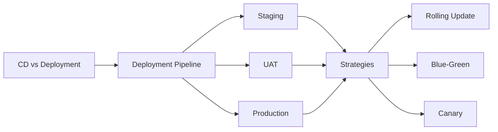

# Chapter 9: Continuous Delivery & Deployment (CD)

> **Previous:** [Configuration Management](./08-configuration-management.md) | **Next:** [Infrastructure as Code (Terraform)](./09-iac.md)

---

## Learning Objectives


- Distinguish between Continuous Delivery (CD) and Continuous Deployment.
- Understand the importance of the Deployment Pipeline in the software lifecycle.
- Explain advanced deployment strategies: Blue-Green, Canary, and Rolling Updates.
- Implement a basic CD workflow using automated tools.
- Discuss the role of manual approvals vs. full automation in enterprise environments.

---


## Chapter at a Glance

| Topic | Key Insight | Practical Takeaway |
|-------|-------------|-------------------|
| Delivery vs Deployment | Manual approval vs fully automated | Match approach to compliance requirements |
| Deployment Pipeline | Version control to production automation | Staging environment mirrors production for validation |
| Rolling Updates | Gradual instance replacement with new version | Choose appropriate maxSurge and maxUnavailable |
| Blue-Green | Two identical environments with traffic switch | Instant rollback by switching traffic back |
| Canary Deployments | New version to subset of users first | Start with 1-5% traffic and monitor metrics |

## Chapter Roadmap



## Theory

### Delivery vs. Deployment

> **Pro Tip:** Combine canary releases with feature flags for fine-grained control over feature exposure.
- **Continuous Delivery:** An extension of CI where code is always in a state that *could* be deployed to production. Deployment to production requires a manual "push of a button."
- **Continuous Deployment:** Every change that passes the automated tests is *automatically* deployed to production. This requires a high level of confidence in the testing suite.

### The Deployment Pipeline

> **Remember:** The goal of CD is to make software releases a non-event--routine, reliable, and frequent.
The pipeline is an automated manifestation of the process for getting software from version control into the hands of users. It typically includes:
1.  **Staging Environment:** A replica of production used for final validation and performance testing.
2.  **UAT (User Acceptance Testing):** Ensuring the software meets business requirements.
3.  **Production:** The live environment serving real users.

### Advanced Deployment Strategies

> **Warning:** Database schema changes require special care with blue-green deployments. Ensure backward compatibility.
1.  **Rolling Update:** Gradually replacing instances of the old version with the new version.
2.  **Blue-Green Deployment:** Maintaining two identical environments. "Blue" is live, while the "Green" is the new version. Once verified, traffic is switched from Blue to Green.
3.  **Canary Deployment:** Releasing the new version to a small subset of users (e.g., 5%) before rolling it out to everyone.

---

## Examples

> **One-Sentence Takeaway:** Continuous Delivery requires manual approval; Continuous Deployment is fully automated to production.

### Example 1: Blue-Green Switching with Nginx
Manually switching traffic between two app versions.
- **Step-by-step:**
  1. Version 1 is running on Port 8081 (Blue).
  2. Version 2 is deployed to Port 8082 (Green).
  3. Update Nginx config:
     ```nginx
     upstream myapp {
         server 127.0.0.1:8082; # Switch from 8081 to 8082
     }
     ```
  4. Reload Nginx: `nginx -s reload`
- **Expected output:** Users are now seeing the new version of the application instantly.
- **What the example demonstrates:** Minimizing downtime during releases.

### Example 2: Canary Deployment in Kubernetes
Routing a portion of traffic to a new version.
- **Step-by-step:**
  1. Create a Deployment for `v1` with label `track: stable`.
  2. Create a Deployment for `v2` with label `track: canary` (only 1 replica).
  3. Create a Service that selects both labels:
     ```yaml
     selector:
       app: myapp # Both deployments share this label
     ```
- **Expected output:** Approximately 1 in every X requests (depending on replica ratio) goes to the canary version.
- **What the example demonstrates:** Testing new features on a small percentage of live traffic.

---

## Summary

## Concept Comparison Table

| Concept | Description |
|---------|-------------|
| Continuous Delivery | Deployable state always, manual approval to prod |
| Continuous Deployment | Fully automated deployment to production |
| Rolling Update | Gradual replacement with new version |
| Blue-Green | Two environments, switch traffic instantly |
| Canary | Traffic subset testing before full rollout |

## Quick Reference

| Topic | Key Points |
|-------|------------|
| CD Pipeline | Staging, UAT, Production with promotion |
| Rolling Update | Gradual replacement, maxSurge/maxUnavailable |
| Blue-Green | Two envs, instant switch, instant rollback |
| Canary | Subset traffic, metric monitoring, gradual rollout |
| Key Goal | Releases are routine, reliable, frequent |

## Cross-Application Matrix

| Domain | Application |
|--------|-------------|
| Web | Blue-green deployment for zero-downtime releases |
| Cloud | Canary analysis with cloud load balancers |
| Enterprise | Approval-gated CD for compliance |
| Mobile | Staged rollout via app stores |

## Chapter Quiz

<details><summary>Question 1: What differentiates CD from Continuous Deployment?</summary>**A)** CD is manual; Continuous Deployment is automated to prod<br>**B)** There is no difference<br>**C)** CD is for databases<br>**D)** Continuous Deployment requires QA approval<br><br>**Answer: A)** CD is manual; Continuous Deployment is automated to prod</details>

<details><summary>Question 2: How does blue-green deployment enable instant rollback?</summary>**A)** By reverting code changes<br>**B)** By switching traffic to the old environment<br>**C)** By rebuilding containers<br>**D)** By using feature flags<br><br>**Answer: B)** By switching traffic to the old environment</details>

<details><summary>Question 3: What percentage of traffic typically goes to a canary initially?</summary>**A)** 50%<br>**B)** 100%<br>**C)** 1-5%<br>**D)** 25%<br><br>**Answer: C)** 1-5%</details>


## Summary

- CD ensures that software can be released to production at any time.
- Continuous Deployment represents the highest level of DevOps maturity.
- Deployment strategies like Blue-Green and Canary reduce the risk of introducing bugs to all users at once.
- Automated rollbacks are essential for maintaining high availability during failed deployments.
- The goal of CD is to make software releases a "non-event" — routine, reliable, and frequent.

---

## Exercises

### Review Questions
1. What is the main difference between Continuous Delivery and Continuous Deployment?
2. Why is a Staging environment important?
3. Explain the benefits of a Canary deployment.
4. How does a Rolling Update handle failures?

### Application Problems
1. Draw a diagram of a deployment pipeline for a mobile application.
2. Propose a rollback strategy for a database schema change that goes wrong during deployment.
3. Your Canary deployment shows a 10% increase in error rates. What are your next steps?

### Challenge Problem
1. Discuss the cultural and technical challenges an organization might face when transitioning from manual quarterly releases to Continuous Deployment.
