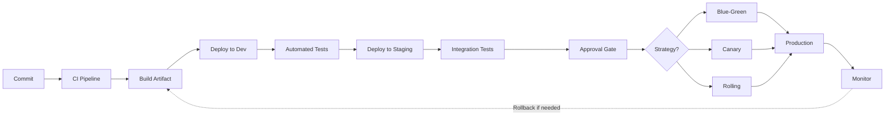
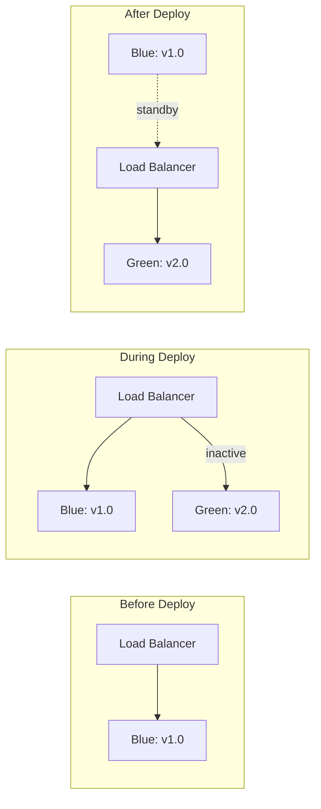
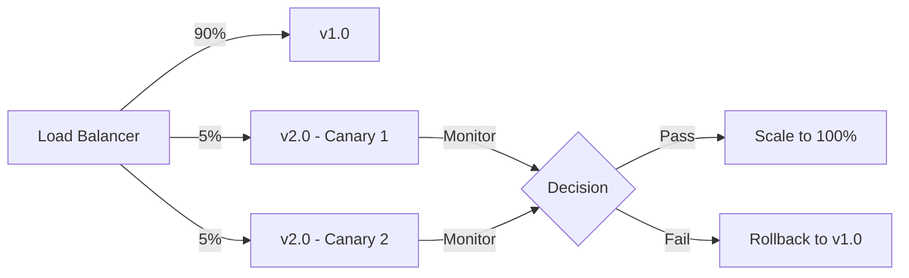
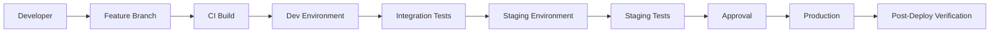
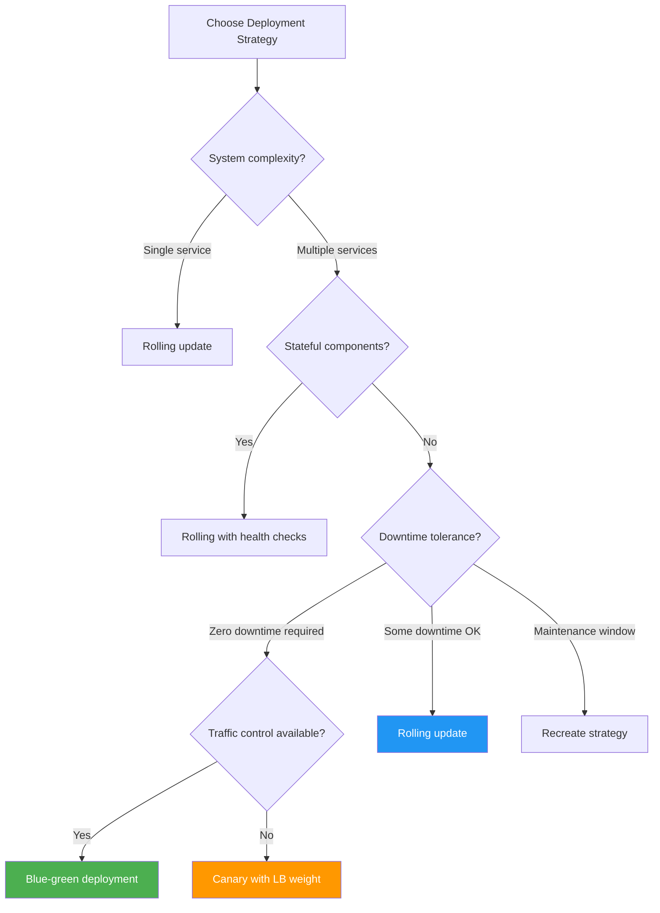
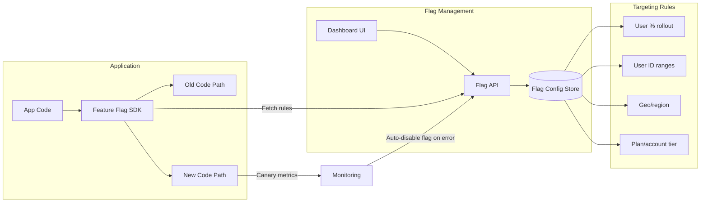

# Chapter 9: Continuous Delivery

> **Prev:** [Advanced Kubernetes](./08-k8s-advanced.md)
> **Next:** [Terraform & IaC](./09-iac.md)

---

## Learning Objectives

- Understand Continuous Delivery principles and the deployment pipeline.
- Differentiate between release strategies: blue-green, canary, rolling, feature flags.
- Implement deployment automation with approval gates and rollback mechanisms.
- Manage environment promotion from development to production.
- Apply deployment strategies for zero-downtime releases.
- Implement release governance and compliance.

---

## Chapter at a Glance

| Topic | Key Insight | Practical Takeaway |
|-------|-------------|-------------------|
| CD Principles | Every commit is potentially deployable | Automation and testing make this possible |
| Blue-Green | Two identical environments | Instant switchover with zero downtime |
| Canary | Gradual traffic shifting | Reduced blast radius for bad releases |
| Rolling | Incremental pod replacement | Standard for Kubernetes deployments |
| Feature Flags | Toggle features at runtime | Decouple deploy from release |
| Deployment Pipeline | Automated promotion flow | Same artifact through all environments |
| Rollback | Revert to previous version | Automate on health check failure |
| Release Governance | Approval gates and compliance | Audit trail for regulatory requirements |

## Chapter Roadmap



## Theory

### CD vs CI vs Continuous Deployment

<a href="../../../assets/images/diagrams/devops/09-continuous-delivery/cd-vs-ci-vs-continuous-deployment-handwritten.svg" target="_blank" rel="noopener">
  
</a>
<a href="../../../assets/images/diagrams/devops/09-continuous-delivery/cd-vs-ci-vs-continuous-deployment-diagram.svg" target="_blank" rel="noopener">
  
</a>
<a href="../../../assets/images/diagrams/devops/09-continuous-delivery/cd-vs-ci-vs-continuous-deployment-sticky.svg" target="_blank" rel="noopener">
  
</a>


| Aspect | Continuous Delivery | Continuous Deployment |
|--------|-------------------|----------------------|
| Automation | Automated to staging | Automated to production |
| Production gate | Manual approval | Fully automated |
| Risk tolerance | Higher | Lower |
| Team maturity | Medium | High |
| Compliance needs | Can include manual steps | Requires full automation |

### Deployment Strategies

<a href="../../../assets/images/diagrams/devops/09-continuous-delivery/deployment-strategies-handwritten.svg" target="_blank" rel="noopener">
  
</a>
<a href="../../../assets/images/diagrams/devops/09-continuous-delivery/deployment-strategies-diagram.svg" target="_blank" rel="noopener">
  
</a>
<a href="../../../assets/images/diagrams/devops/09-continuous-delivery/deployment-strategies-sticky.svg" target="_blank" rel="noopener">
  
</a>


**Blue-Green Deployment:**



**Advantages:** Instant switch, immediate rollback (switch back), full environment separation.
**Disadvantages:** Double infrastructure cost, database compatibility challenges.

**Canary Deployment:**



**Advantages:** Reduced blast radius, real traffic testing, metrics-driven promotion.
**Disadvantages:** Slower rollout, requires sophisticated traffic routing, monitoring overhead.

**Rolling Update:**

```text
Initial:    [v1] [v1] [v1] [v1] [v1]
Step 1:     [v2] [v1] [v1] [v1] [v1]   (1 new, 4 old)
Step 2:     [v2] [v2] [v1] [v1] [v1]   (2 new, 3 old)
Step 3:     [v2] [v2] [v2] [v1] [v1]   (3 new, 2 old)
Step 4:     [v2] [v2] [v2] [v2] [v1]   (4 new, 1 old)
Step 5:     [v2] [v2] [v2] [v2] [v2]   (5 new, 0 old)
```

**Advantages:** No additional infrastructure, standard Kubernetes strategy, progressive.
**Disadvantages:** Slower rollback, exposes multiple versions simultaneously.

### Feature Flags

<a href="../../../assets/images/diagrams/devops/09-continuous-delivery/feature-flags-handwritten.svg" target="_blank" rel="noopener">
  
</a>
<a href="../../../assets/images/diagrams/devops/09-continuous-delivery/feature-flags-diagram.svg" target="_blank" rel="noopener">
  
</a>
<a href="../../../assets/images/diagrams/devops/09-continuous-delivery/feature-flags-sticky.svg" target="_blank" rel="noopener">
  
</a>


Feature flags decouple deployment from release. Code can be deployed to production but remain inactive until the flag is toggled:

```typescript
class FeatureFlagService {
  private flags: Map<string, boolean> = new Map();

  constructor() {
    this.flags.set('new-checkout-flow', false);
    this.flags.set('dark-mode', true);
    this.flags.set('ai-recommendations', false);
  }

  isEnabled(flag: string, userContext?: { id: string; tier: string }): boolean {
    // Global flag
    if (this.flags.has(flag)) return this.flags.get(flag)!;

    // User-targeted rollout
    if (userContext && flag === 'new-checkout-flow') {
      return this.targetedRollout(userContext.id, 25); // 25% rollout
    }

    return false;
  }

  private targetedRollout(userId: string, percentage: number): boolean {
    // Consistent hashing for stable flags
    const hash = this.hashCode(userId) % 100;
    return hash < percentage;
  }

  private hashCode(str: string): number {
    let hash = 0;
    for (let i = 0; i < str.length; i++) {
      hash = ((hash << 5) - hash) + str.charCodeAt(i);
    }
    return Math.abs(hash);
  }
}

const features = new FeatureFlagService();
console.log('Dark mode enabled:', features.isEnabled('dark-mode'));
console.log('New checkout for user_42:', features.isEnabled('new-checkout-flow', { id: 'user_42', tier: 'beta' }));
```

**Feature flag categories:**
- **Release toggles:** Control new feature rollout
- **Experiment toggles:** A/B testing
- **Ops toggles:** Kill switches for production issues
- **Permission toggles:** Tier-based feature access

### Environment Promotion

<a href="../../../assets/images/diagrams/devops/09-continuous-delivery/environment-promotion-handwritten.svg" target="_blank" rel="noopener">
  
</a>
<a href="../../../assets/images/diagrams/devops/09-continuous-delivery/environment-promotion-diagram.svg" target="_blank" rel="noopener">
  
</a>
<a href="../../../assets/images/diagrams/devops/09-continuous-delivery/environment-promotion-sticky.svg" target="_blank" rel="noopener">
  
</a>




**Promotion criteria:**
- All CI checks pass (lint, type check, unit tests)
- Integration tests pass
- Security scan passes (no critical/high vulnerabilities)
- Performance benchmarks meet thresholds
- Manual approval (for CD, not Continuous Deployment)

### Rollback Strategies

<a href="../../../assets/images/diagrams/devops/09-continuous-delivery/rollback-strategies-handwritten.svg" target="_blank" rel="noopener">
  
</a>
<a href="../../../assets/images/diagrams/devops/09-continuous-delivery/rollback-strategies-diagram.svg" target="_blank" rel="noopener">
  
</a>
<a href="../../../assets/images/diagrams/devops/09-continuous-delivery/rollback-strategies-sticky.svg" target="_blank" rel="noopener">
  
</a>


**Automatic rollback triggers:**
- Health check failure after deploy
- Increased error rate (e.g., 5xx > 1%)
- Increased latency (e.g., p99 > 500ms)
- Decreased throughput

**Rollback mechanisms:**
- **Redeploy previous version:** Simplest, most reliable
- **Git revert:** Revert the commit and deploy
- **Traffic switch:** For blue-green, switch load balancer back
- **Feature flag off:** Disable the feature at runtime

### Deployment Pipeline Implementation

<a href="../../../assets/images/diagrams/devops/09-continuous-delivery/deployment-pipeline-implementation-handwritten.svg" target="_blank" rel="noopener">
  
</a>
<a href="../../../assets/images/diagrams/devops/09-continuous-delivery/deployment-pipeline-implementation-diagram.svg" target="_blank" rel="noopener">
  
</a>
<a href="../../../assets/images/diagrams/devops/09-continuous-delivery/deployment-pipeline-implementation-sticky.svg" target="_blank" rel="noopener">
  
</a>


```yaml
# deploy-pipeline.yaml
stages:
  - name: Build
    steps:
      - npm ci
      - npm run build
      - docker build -t myapp:$COMMIT_SHA .
      - docker push myapp:$COMMIT_SHA

  - name: Deploy to Dev
    steps:
      - kubectl set image deployment/myapp myapp=myapp:$COMMIT_SHA
      - kubectl rollout status deployment/myapp

  - name: Integration Tests
    steps:
      - npm run test:integration
      - npm run test:e2e

  - name: Deploy to Staging
    environment: staging
    approval: automatic
    steps:
      - kubectl set image deployment/myapp myapp=$COMMIT_SHA
      - kubectl rollout status deployment/myapp
      - verify-health

  - name: Deploy to Production
    environment: production
    approval: manual
    strategy: canary
    steps:
      - deploy-canary 10%
      - verify-metrics
      - scale-to-100%

  - name: Smoke Tests
    steps:
      - verify-health
      - verify-features
```

---

## Examples

### Example 1: Canary Deployment Controller

```typescript
interface CanaryConfig {
  name: string;
  namespace: string;
  image: string;
  stableReplicas: number;
  canaryReplicas: number;
  steps: CanaryStep[];
  metrics: CanaryMetric[];
}

interface CanaryStep {
  weight: number;
  pause: number; // seconds
}

interface CanaryMetric {
  name: string;
  threshold: number;
  query: string;
}

class CanaryController {
  private config: CanaryConfig;

  constructor(config: CanaryConfig) {
    this.config = config;
  }

  async execute(): Promise<boolean> {
    console.log(`?? Starting canary deployment for ${this.config.name}\n`);

    // Deploy canary instances
    await this.deployCanary();
    console.log(`? Canary deployed: ${this.config.canaryReplicas} replicas\n`);

    // Progress through traffic weight steps
    for (const step of this.config.steps) {
      console.log(`Setting traffic weight to ${step.weight}%...`);
      await this.updateTrafficWeight(step.weight);

      console.log(`Waiting ${step.pause}s for metrics collection...`);
      await this.sleep(step.pause * 1000);

      // Check metrics
      for (const metric of this.config.metrics) {
        const passed = await this.checkMetric(metric);
        if (!passed) {
          console.log(`? Metric "${metric.name}" exceeded threshold (${metric.threshold})`);
          await this.rollback();
          return false;
        }
        console.log(`? ${metric.name}: within threshold`);
      }
    }

    // Promote to full rollout
    await this.promote();
    console.log('?? Canary promotion complete');
    return true;
  }

  private async deployCanary(): Promise<void> {
    console.log('Creating canary instances...');
  }

  private async updateTrafficWeight(weight: number): Promise<void> {
    console.log(`Traffic distribution: ${weight}% canary, ${100 - weight}% stable`);
  }

  private async checkMetric(metric: CanaryMetric): Promise<boolean> {
    const currentValue = Math.random() * 5; // Simulated metric
    console.log(`  Metric "${metric.name}": ${currentValue.toFixed(2)} (threshold: ${metric.threshold})`);
    return currentValue <= metric.threshold;
  }

  private async promote(): Promise<void> {
    console.log('Scaling canary to 100%...');
    console.log('Removing stable instances...');
    console.log('Canary promoted to stable.');
  }

  private async rollback(): Promise<void> {
    console.log('??  Rolling back canary...');
    console.log('Removing canary instances...');
    console.log('Restoring full stable traffic.');
  }

  private sleep(ms: number): Promise<void> {
    return new Promise(resolve => setTimeout(resolve, ms));
  }
}

const controller = new CanaryController({
  name: 'api-service',
  namespace: 'production',
  image: 'myapp:2.0.0',
  stableReplicas: 10,
  canaryReplicas: 2,
  steps: [
    { weight: 10, pause: 60 },
    { weight: 25, pause: 120 },
    { weight: 50, pause: 180 },
    { weight: 75, pause: 120 },
    { weight: 100, pause: 60 },
  ],
  metrics: [
    { name: 'error_rate', threshold: 1.0, query: 'rate(http_requests_total{status=~"5.."}[5m])' },
    { name: 'latency_p99', threshold: 500, query: 'histogram_quantile(0.99, ...)' },
  ],
});

controller.execute();
```

### Example 2: Release Orchestrator

```typescript
interface Release {
  version: string;
  artifact: string;
  changelog: string[];
  author: string;
}

interface Environment {
  name: string;
  approvalRequired: boolean;
  approvers: string[];
  tests: string[];
}

class ReleaseOrchestrator {
  private releases: Release[] = [];
  private currentRelease?: Release;

  async promote(release: Release, from: string, to: string): Promise<boolean> {
    console.log(`\n?? Promoting ${release.version} from ${from} to ${to}`);
    this.currentRelease = release;

    const passed = await this.runEnvironmentTests(to);
    if (!passed) {
      console.log(`? Tests failed in ${to}, halting promotion`);
      return false;
    }

    console.log(`? ${release.version} promoted to ${to}`);
    return true;
  }

  private async runEnvironmentTests(env: string): Promise<boolean> {
    const testSuites: Record<string, string[]> = {
      dev: ['unit', 'lint', 'type-check'],
      staging: ['integration', 'security-scan', 'performance'],
      production: ['smoke', 'health-check'],
    };

    const tests = testSuites[env] || ['health-check'];
    for (const test of tests) {
      console.log(`  Running ${test}...`);
      await this.sleep(500);
    }
    return true;
  }

  async rollback(environment: string, targetVersion: string): Promise<void> {
    console.log(`\n??  Rolling back ${environment} to ${targetVersion}`);
    this.releases.push(this.currentRelease!);
    console.log(`? Rollback complete`);
  }

  getReleaseHistory(): string {
    let history = '# Release History\n\n';
    this.releases.forEach((r, i) => {
      history += `## ${r.version} (${r.author})\n`;
      r.changelog.forEach(c => history += `- ${c}\n`);
      history += '\n';
    });
    return history;
  }

  private sleep(ms: number): Promise<void> {
    return new Promise(resolve => setTimeout(resolve, ms));
  }
}

const orchestrator = new ReleaseOrchestrator();
const release: Release = {
  version: '2.1.0',
  artifact: 'myapp:2.1.0',
  changelog: ['feat: Add OAuth2 login', 'fix: Fix memory leak', 'chore: Update dependencies'],
  author: 'dev-team',
};

orchestrator.promote(release, 'dev', 'staging');
```

---

### Canary Release Manager

Canary releases reduce deployment risk by gradually shifting traffic to new versions. The following implementation manages canary deployments with health checks and automated rollback.

```typescript
interface CanaryConfig {
  name: string;
  initialTrafficPercent: number;
  incrementPercent: number;
  promotionIntervalMinutes: number;
  maxErrorRate: number;
  maxLatencyP99Ms: number;
}

interface DeploymentMetrics {
  errorRate: number;
  latencyP99Ms: number;
  requestCount: number;
}

interface CanaryStatus {
  stage: 'initial' | 'ramping' | 'full' | 'rolled-back';
  currentTrafficPercent: number;
  healthy: boolean;
  reason?: string;
}

class CanaryReleaseManager {
  private config: CanaryConfig;
  private status: CanaryStatus;

  constructor(config: CanaryConfig) {
    this.config = config;
    this.status = { stage: 'initial', currentTrafficPercent: config.initialTrafficPercent, healthy: true };
  }

  promote(metrics: DeploymentMetrics): CanaryStatus {
    if (metrics.errorRate > this.config.maxErrorRate) {
      this.status = { stage: 'rolled-back', currentTrafficPercent: 0, healthy: false, reason: `Error rate ${(metrics.errorRate * 100).toFixed(1)}% exceeds ${(this.config.maxErrorRate * 100).toFixed(0)}%` };
      return this.status;
    }
    if (metrics.latencyP99Ms > this.config.maxLatencyP99Ms) {
      this.status = { stage: 'rolled-back', currentTrafficPercent: 0, healthy: false, reason: `P99 latency ${metrics.latencyP99Ms}ms exceeds ${this.config.maxLatencyP99Ms}ms` };
      return this.status;
    }

    const nextTraffic = this.status.currentTrafficPercent + this.config.incrementPercent;
    if (nextTraffic >= 100) {
      this.status = { stage: 'full', currentTrafficPercent: 100, healthy: true };
    } else {
      this.status = { stage: 'ramping', currentTrafficPercent: nextTraffic, healthy: true };
    }
    return this.status;
  }

  getStatus(): CanaryStatus {
    return this.status;
  }
}

const canary = new CanaryReleaseManager({ name: 'api-v2', initialTrafficPercent: 5, incrementPercent: 15, promotionIntervalMinutes: 5, maxErrorRate: 0.01, maxLatencyP99Ms: 500 });
const metricsHistory: DeploymentMetrics[] = [
  { errorRate: 0.002, latencyP99Ms: 120, requestCount: 10000 },
  { errorRate: 0.015, latencyP99Ms: 450, requestCount: 15000 },
];
for (const m of metricsHistory) {
  const status = canary.promote(m);
  console.log(`Traffic: ${status.currentTrafficPercent}%, Stage: ${status.stage}, Healthy: ${status.healthy}${status.reason ? ', Reason: ' + status.reason : ''}`);
  if (status.stage === 'rolled-back' || status.stage === 'full') break;
}
```

**What this demonstrates:** Automated canary management with health-based promotion and rollback enables safe, gradual deployments with minimal user impact.

---

### Rollback Orchestrator

Automated rollback is critical when deployments cause production issues. The following tool coordinates rollback decisions with impact assessment, service dependency analysis, and phased execution.

```typescript
// rollback-orchestrator.ts
// Coordinate multi-service rollbacks with dependency analysis

interface ServiceState {
  name: string;
  currentVersion: string;
  previousVersion: string;
  healthScore: number;
  errorRate: number;
  latencyP99: number;
  dependencies: string[];
  dependents: string[];
}

interface RollbackTarget {
  serviceName: string;
  targetVersion: string;
  estimatedImpact: 'none' | 'low' | 'medium' | 'high';
  breakingChanges: string[];
  requiresDataMigration: boolean;
  estimatedDurationSec: number;
}

interface RollbackPlan {
  trigger: string;
  timestamp: Date;
  targets: RollbackTarget[];
  executionOrder: string[];
  coordinationNeeded: boolean;
  estimatedTotalDurationSec: number;
  riskScore: number;
  approvalRequired: 'auto' | 'lead' | 'manager';
}

class RollbackOrchestrator {
  private services: Map<string, ServiceState> = new Map();

  registerService(svc: ServiceState): void {
    this.services.set(svc.name, svc);
  }

  assessRollback(failedService: string, failureReason: string): RollbackPlan {
    const svc = this.services.get(failedService);
    if (!svc) throw new Error(`Service ${failedService} not found`);
    const targets: RollbackTarget[] = [];
    const executionOrder: string[] = [];

    const directTarget: RollbackTarget = {
      serviceName: failedService, targetVersion: svc.previousVersion,
      estimatedImpact: 'high', breakingChanges: ['API contract rollback'],
      requiresDataMigration: false, estimatedDurationSec: 120,
    };
    targets.push(directTarget);
    executionOrder.push(failedService);

    for (const depName of svc.dependents) {
      const dep = this.services.get(depName);
      if (!dep) continue;
      const depTarget: RollbackTarget = {
        serviceName: depName, targetVersion: dep.previousVersion,
        estimatedImpact: 'medium', breakingChanges: ['Dependency API rollback', 'Client compatibility'],
        requiresDataMigration: false, estimatedDurationSec: 90,
      };
      targets.push(depTarget);
      executionOrder.push(depName);
    }

    const totalDuration = targets.reduce((s, t) => s + t.estimatedDurationSec, 0);
    const riskScore = targets.filter(t => t.estimatedImpact === 'high').length * 3 +
                       targets.filter(t => t.estimatedImpact === 'medium').length * 2 +
                       targets.filter(t => t.estimatedImpact === 'low').length;

    let approvalRequired: RollbackPlan['approvalRequired'] = 'auto';
    if (riskScore > 10) approvalRequired = 'manager';
    else if (riskScore > 5) approvalRequired = 'lead';

    return {
      trigger: failureReason, timestamp: new Date(), targets,
      executionOrder, coordinationNeeded: targets.length > 1,
      estimatedTotalDurationSec: totalDuration, riskScore, approvalRequired,
    };
  }

  executeRollback(plan: RollbackPlan, approved: boolean): { success: boolean; failures: string[]; durationMs: number } {
    if (plan.approvalRequired !== 'auto' && !approved) {
      return { success: false, failures: ['Approval required but not granted'], durationMs: 0 };
    }

    const failures: string[] = [];
    const startTime = Date.now();

    for (const target of plan.targets) {
      const svc = this.services.get(target.serviceName);
      if (!svc) { failures.push(`${target.serviceName}: not found`); continue; }

      if (Math.random() < 0.95) {
        svc.currentVersion = target.targetVersion;
        svc.healthScore = 95 + Math.floor(Math.random() * 5);
        svc.errorRate = 0.001 + Math.random() * 0.004;
      } else {
        failures.push(`${target.serviceName}: rollback failed - health check timeout`);
      }
    }

    return { success: failures.length === 0, failures, durationMs: Date.now() - startTime };
  }

  generateRollbackReport(plan: RollbackPlan, result: { success: boolean; failures: string[]; durationMs: number }): string {
    const lines = [
      `Rollback Report - ${plan.timestamp.toISOString()}`,
      `Trigger: ${plan.trigger}`,
      `Result: ${result.success ? '? Successful' : '? Failed'}`,
      `Duration: ${(result.durationMs / 1000).toFixed(1)}s`,
      `Risk Score: ${plan.riskScore} (approval: ${plan.approvalRequired})`,
      '',
      'Services rolled back:',
    ];
    for (const target of plan.targets) {
      lines.push(`  ${target.serviceName}: v${target.targetVersion} (${target.estimatedImpact} impact, ${target.estimatedDurationSec}s)`);
      for (const bc of target.breakingChanges) lines.push(`    ? ${bc}`);
    }
    return lines.join('\n');
  }
}

const orchestrator = new RollbackOrchestrator();
orchestrator.registerService({ name: 'api-gateway', currentVersion: '2.5.0', previousVersion: '2.4.0', healthScore: 100, errorRate: 0.001, latencyP99: 45, dependencies: ['user-service', 'payment-service'], dependents: ['web-ui', 'mobile-api'] });
orchestrator.registerService({ name: 'user-service', currentVersion: '3.1.0', previousVersion: '3.0.0', healthScore: 98, errorRate: 0.002, latencyP99: 32, dependencies: ['db-primary'], dependents: ['api-gateway'] });

const plan = orchestrator.assessRollback('api-gateway', 'Error rate spike to 12% after canary ramp to 30%');
console.log(`Rollback plan: ${plan.targets.length} services, ${plan.estimatedTotalDurationSec}s estimated, approval: ${plan.approvalRequired}`);

const result = orchestrator.executeRollback(plan, true);
console.log(orchestrator.generateRollbackReport(plan, result));
```

**What this demonstrates:** An automated rollback orchestrator with dependency-aware planning, impact assessment, and approval gates enables safe recovery from failed deployments.

---

## Practical Takeaways

1. **Use feature flags to decouple deploy from release.** Deploy often, release when ready.
2. **Implement blue-green or canary for production.** Zero-downtime deployments reduce risk.
3. **Automate rollback triggers.** Health check failures should automatically revert.
4. **Promote the same artifact.** Build once, deploy everywhere — no rebuilding.
5. **Monitor every deployment.** Error rates, latency, and throughput are key signals.
6. **Keep deployments small.** Smaller changes are easier to test and roll back.

---

## Chapter Quiz

<details><summary>Question 1: What is the main advantage of blue-green deployment?</summary>**A)** Lower infrastructure cost<br>**B)** Instant switchover and immediate rollback<br>**C)** No monitoring required<br>**D)** Faster build times<br><br>**Answer: B)** Instant switchover and immediate rollback&lt;/details&gt;

<details><summary>Question 2: What does a canary deployment do?</summary>**A)** Deploys all at once<br>**B)** Gradually shifts traffic to the new version<br>**C)** Deploys to a separate environment<br>**D)** Uses feature flags<br><br>**Answer: B)** Gradually shifts traffic to the new version&lt;/details&gt;

<details><summary>Question 3: Feature flags decouple what two activities?</summary>**A)** Build and test<br>**B)** Deploy and release<br>**C)** Code and review<br>**D)** Plan and execute<br><br>**Answer: B)** Deploy and release&lt;/details&gt;

<details><summary>Question 4: What is a valid automatic rollback trigger?</summary>**A)** Build takes too long<br>**B)** Error rate exceeds 1% after deployment<br>**C)** Developer pushes new code<br>**D)** Approval is delayed<br><br>**Answer: B)** Error rate exceeds 1% after deployment&lt;/details&gt;

<details><summary>Question 5: What does "build once, deploy everywhere" mean?</summary>**A)** The same build artifact is promoted through all environments<br>**B)** Each environment builds its own version<br>**C)** Use multiple CI servers<br>**D)** Deploy to production directly from feature branches<br><br>**Answer: A)** The same build artifact is promoted through all environments&lt;/details&gt;

---

## TypeScript: Canary Deployment Pipeline Controller

TypeScript can orchestrate canary deployments with traffic shifting logic:

```typescript
// canary-deployment.ts
// Manages canary deployment with gradual traffic shifting

interface CanaryConfig {
  serviceName: string;
  namespace: string;
  newVersion: string;
  steps: number[];
  observationPeriodMs: number;
  errorRateThreshold: number;
  healthEndpoint: string;
}

class CanaryDeployer {
  private currentStep = 0;

  constructor(private config: CanaryConfig) {}

  async deploy(): Promise<void> {
    console.log(`Starting canary deployment of ${this.config.newVersion}`);

    for (const weight of this.config.steps) {
      this.currentStep = weight;
      console.log(`Shifting ${weight}% traffic to new version`);
      await this.updateTrafficWeight(weight);
      await this.observe();

      if (await this.detectIssues()) {
        console.error('Canary failed, initiating rollback');
        await this.rollback();
        return;
      }
    }

    console.log('Canary deployment completed successfully');
  }

  private async updateTrafficWeight(weight: number): Promise<void> {
    // In Kubernetes, this would update a Service or VirtualService
    console.log(`kubectl set weight --service=${this.config.serviceName} --new=${weight}%`);
  }

  private async observe(): Promise<void> {
    await new Promise(resolve => setTimeout(resolve, this.config.observationPeriodMs));
  }

  private async detectIssues(): Promise<boolean> {
    // Check health endpoint
    try {
      const response = await fetch(this.config.healthEndpoint);
      const data = await response.json() as { errorRate: number };
      return data.errorRate > this.config.errorRateThreshold;
    } catch {
      return true;
    }
  }

  private async rollback(): Promise<void> {
    await this.updateTrafficWeight(0);
    console.log('Rolled back to previous version');
  }
}

// Example: Deploy API service v2.1
const deployer = new CanaryDeployer({
  serviceName: 'api-service',
  namespace: 'production',
  newVersion: 'v2.1',
  steps: [5, 10, 25, 50, 75, 100],
  observationPeriodMs: 300000, // 5 minutes per step
  errorRateThreshold: 1, // rollback if error rate > 1%
  healthEndpoint: 'http://api-service-canary/health',
});

deployer.deploy().catch(console.error);
```

## Mermaid: Deployment Strategy Decision Tree



## Mermaid: Feature Flag Architecture



## Deeper Explanation: Canary Analysis and Automation

Canary deployments require automated analysis to determine if the new version is safe:

**Statistical analysis techniques:**
1. **Z-score comparison:** Compare canary error rate vs baseline. If z-score > 3, reject.
2. **Mann-Whitney U test:** Non-parametric test comparing latency distributions. If p &lt; 0.05, reject.
3. **Confidence interval overlap:** If 95% CI of canary metrics does not overlap with baseline, reject.
4. **Effect size (Cohen's d):** Even if statistically significant, is the difference practically significant?

**Automated canary analysis configuration:**

```typescript
interface CanaryAnalysisConfig {
  metrics: string[];
  analysisDurationMinutes: number;
  comparisonMethod: 'zscore' | 'mannwhitney' | 'ci_overlap';
  threshold: number;
  minimumSampleSize: number;
}

const analysisConfig: CanaryAnalysisConfig = {
  metrics: ['error_rate', 'p99_latency', 'request_rate'],
  analysisDurationMinutes: 15,
  comparisonMethod: 'zscore',
  threshold: 3.0,
  minimumSampleSize: 100,
};
```


// continuous delivery
// cicd-infrastructure-automation implementation

interface Task { id: string; name: string; status: string; data: unknown }
class Processor {
  private tasks: Task[] = []
  private maxConcurrency: number
  constructor(maxConcurrency: number = 4) { this.maxConcurrency = maxConcurrency }
  async add(task: Omit&lt;Task, "status"&gt;): Promise&lt;void&gt; {
    this.tasks.push({ ...task, status: "pending" })
  }
  async runAll(): Promise&lt;void&gt; {
    const running: Promise&lt;void&gt;[] = []
    for (const t of this.tasks) {
      if (running.length >= this.maxConcurrency) { await Promise.race(running) }
      const p = this.execute(t).finally(() => { const i = running.indexOf(p); if (i >= 0) running.splice(i, 1) })
      running.push(p)
    }
    await Promise.all(running)
  }
  private async execute(t: Task): Promise&lt;void&gt; {
    t.status = "running"
    await new Promise(r => setTimeout(r, 10))
    t.status = "done"
  }
  getResults(): Task[] { return this.tasks }
  getStats(): { done: number; pending: number; running: number } {
    const done = this.tasks.filter(t => t.status === "done").length
    const pending = this.tasks.filter(t => t.status === "pending").length
    const running = this.tasks.filter(t => t.status === "running").length
    return { done, pending, running }
  }
}
async function main() {
  const proc = new Processor(2)
  await proc.add({ id: '1', name: 'continuous delivery', data: { topic: 'cicd-infrastructure-automation' } })
  await proc.runAll()
  console.log('Stats:', proc.getStats())
}
main().catch(console.error)
export { Processor, Task }
## Summary

- Continuous Delivery ensures every commit is potentially deployable through automated pipelines and testing.
- Deployment strategies include blue-green (instant switch), canary (gradual rollout), and rolling (incremental replacement).
- Feature flags decouple deployment from release, enabling safe, gradual feature exposure.
- Environment promotion moves artifacts through dev ? staging ? production with gates.
- Automatic rollback triggers (error rate, latency, health checks) revert bad deployments.
- The same immutable artifact should be promoted through all environments.
- Release governance includes approval gates, audit trails, and compliance checks.

---

## Exercises

### Review Questions
1. What is the difference between continuous delivery and continuous deployment?
2. How does blue-green deployment achieve zero downtime?
3. What are the advantages of canary deployments over blue-green?
4. How do feature flags reduce deployment risk?
5. What metrics should trigger an automatic rollback?

### Application Problems
1. Design a canary deployment pipeline that shifts traffic in 10% increments with 5-minute pauses.
2. Implement a feature flag system with targeted rollout based on user ID hashing.
3. Create an environment promotion strategy for dev, staging, and production with gates.
4. Write a deployment script that automatically rolls back if the error rate exceeds 1%.
5. Implement the TypeScript canary deployer above. Extend it to support weighted traffic distribution using Kubernetes VirtualService or a service mesh (Istio/Linkerd).
6. Create a release notes generator that parses conventional commits and produces markdown release notes grouped by type (feat, fix, breaking) with contributor attribution.
7. Write a deployment decision matrix similar to the decision tree above. For each of these scenarios, select the appropriate strategy and justify: (a) a database migration, (b) a frontend CSS change, (c) a payment service API change.

### Challenge Problem
1. Design a complete release management system including: deployment pipeline with environment promotion (dev ? staging ? prod) with automated gates, canary deployment strategy with 5-step traffic shifting (10%, 25%, 50%, 75%, 100%) with 5-minute observation periods, rollback automation triggered by error rate > 1%, latency p99 > 500ms, or health check failure, feature flag management with gradual rollout and kill switches, automated release notes generated from conventional commits, and a deployment dashboard showing current versions per environment, deployment history, and rollback status.
