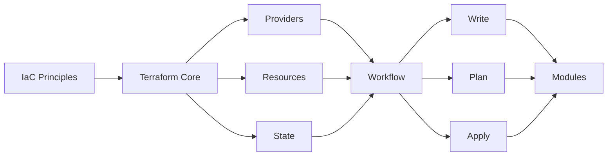

# Chapter 9: Infrastructure as Code (Terraform)

> **Previous:** [Continuous Delivery](./09-cicd.md) | **Next:** [Configuration Management](./10-configuration-mgmt.md)

## Learning Objectives


By the end of this chapter, students will be able to:

1. Explain IaC principles: declarative, idempotent, version-controlled
2. Author Terraform configurations using providers, resources, data sources, and variables
3. Manage Terraform state, including remote state backends and state locking
4. Structure configurations with modules for reusability
5. Apply Terraform in CI/CD pipelines with plan and apply workflows
6. Compare Terraform with Pulumi, CloudFormation, and ARM


## Chapter at a Glance

| Topic | Key Insight | Practical Takeaway |
|-------|-------------|-------------------|
| IaC Principles | Declarative, idempotent, version-controlled infrastructure | Store infra definitions in Git with app code |
| Terraform Core | Providers, resources, data sources, variables, state | Remote state with locking enables team collaboration |
| Terraform Workflow | Write, Plan, Apply cycle | Always plan before apply for production changes |
| Modules | Reusable configuration containers from Registry | Version modules for predictable deployments |
| State Management | Remote backends with state locking | S3+DynamoDB for AWS; Terraform Cloud for teams |

## Chapter Roadmap



## Theory

### 9.1 Infrastructure as Code Principles

> **Pro Tip:** Use 	erraform fmt -recursive to keep all configurations consistently formatted across your team.

Infrastructure as Code (IaC) is the practice of managing infrastructure through machine-readable definition files rather than manual processes. The core principles are:

**Declarative vs Imperative** — Declarative IaC specifies the desired end state; the tool determines the steps to reach it. Imperative IaC specifies the exact commands to execute. Terraform and CloudFormation are declarative. Ansible and Chef support both modes. Declarative configurations are more predictable and idempotent.

**Idempotency** — Applying the same configuration multiple times produces the same result. Idempotency eliminates configuration drift and enables safe repeated execution.

**Version Control** — Infrastructure definitions are stored in Git with the application code. Changes undergo code review, automated testing, and approval workflows. Version control provides audit trails, rollback capability, and change history.

**Immutability** — Rather than modifying existing infrastructure, replace it with new instances running the updated configuration. Immutable infrastructure eliminates configuration drift and simplifies rollback.

### 9.2 Terraform Core Concepts

> **Warning:** Terraform state may contain sensitive values. Always use remote backends with encryption.

**Providers** — Plugins that interact with cloud APIs. Each provider exposes resources and data sources. Common providers: AWS, Azure, GCP, Kubernetes, Helm, GitHub.

**Resources** — Infrastructure components managed by Terraform: `aws_instance`, `google_storage_bucket`, `azurerm_resource_group`. Resources have attributes, arguments, and lifecycle rules.

**Data Sources** — Read-only queries to existing infrastructure. Data sources retrieve information without creating or modifying resources.

**Variables and Outputs** — Variables parameterize configurations. Outputs expose resource attributes for use by other configurations or modules.

**State** — Terraform maps real-world infrastructure to configuration through state files. State tracks resource metadata, dependencies, and attribute values. State can be stored locally or remotely (S3, Terraform Cloud, Azure Storage).

### 9.3 Terraform Workflow

> **Remember:** Always use 	erraform plan before 	erraform apply in CI/CD pipelines.

The core Terraform workflow has three steps:

1. **Write** — Author configuration files
2. **Plan** — `terraform plan` compares the configuration with state and shows what will change
3. **Apply** — `terraform apply` executes the planned changes

```bash
terraform init          # Initialize providers and modules
terraform fmt           # Format configuration files
terraform validate      # Validate syntax and configuration
terraform plan          # Preview changes
terraform apply         # Execute changes
terraform destroy       # Remove managed infrastructure
```

### 9.4 State Management

State management is critical for team use.

**Remote State** — Store state in a shared backend: S3 + DynamoDB (locking), Terraform Cloud, Azure Storage, or GCS. Remote state enables team collaboration and prevents conflicts.

**State Locking** — Prevents concurrent modifications that could corrupt state. DynamoDB provides locking for S3 backends. Terraform Cloud provides built-in locking.

**Sensitive Data** — State may contain sensitive values (database passwords, access keys). Remote backends should encrypt state at rest. Access to state stores must be controlled.

```hcl
terraform {
  backend "s3" {
    bucket         = "org-terraform-state"
    key            = "production/network/terraform.tfstate"
    region         = "us-east-1"
    encrypt        = true
    dynamodb_table = "terraform-state-lock"
  }
}
```

### 9.5 Modules

Modules are reusable configuration containers. Root modules are the working directory. Child modules are called from within configurations.

```hcl
module "vpc" {
  source = "terraform-aws-modules/vpc/aws"
  version = "5.0.0"

  name = "production"
  cidr = "10.0.0.0/16"
  azs  = ["us-east-1a", "us-east-1b", "us-east-1c"]

  private_subnets = ["10.0.1.0/24", "10.0.2.0/24", "10.0.3.0/24"]
  public_subnets  = ["10.0.101.0/24", "10.0.102.0/24", "10.0.103.0/24"]

  enable_nat_gateway = true
  enable_vpn_gateway = true
  tags = {
    Environment = "production"
  }
}
```

Module sources include: local paths, Terraform Registry, Git repositories, HTTP URLs, and S3/GCS buckets.

### 9.6 Workspaces

Workspaces manage multiple environments from the same configuration. Each workspace has its own state file.

```bash
terraform workspace new dev
terraform workspace new staging
terraform workspace select production
terraform plan
```

Workspaces are suitable for environment separation within a single configuration. For more complex scenarios, directory structure with separate root modules is preferred.

### 9.7 Terraform vs Alternatives

**Pulumi** — Uses general-purpose programming languages (TypeScript, Python, Go, C#) instead of HCL. Provides real programming constructs (loops, conditionals, classes). State management is similar to Terraform. Better suited for teams that prefer programming languages over DSL.

**AWS CloudFormation** — Native AWS IaC solution. Uses JSON or YAML templates. Supports StackSets for multi-account deployments. Change sets are the equivalent of Terraform plans. Drift detection identifies manual changes. Tighter AWS integration but AWS-only.

**Azure ARM/Bicep** — ARM templates are JSON-based Azure IaC. Bicep is a domain-specific language that compiles to ARM templates. Azure-native with deep integration. Azure-only.

**Terragrunt** — A thin wrapper around Terraform that provides DRY configuration, state management, and remote execution. Handles module versioning, dependency management, and environment configuration through YAML files.

### 9.8 Immutable Infrastructure

Immutable infrastructure means replacing rather than modifying servers. When a configuration change is needed, new infrastructure is provisioned with the new configuration and the old infrastructure is decommissioned.

Benefits include: elimination of configuration drift, predictable rollback (revert to previous AMI/image), simplified debugging (clean state), and consistent environments.

Terraform supports immutable patterns through:
- Launch templates with AMI versioning
- Autoscaling groups with instance refresh
- Blue-green deployment with weighted target groups
- `create_before_destroy` lifecycle rules

## Examples

> **One-Sentence Takeaway:** Terraform is declarative--you define the desired end state, and it determines the steps to reach it.

### Example 9.1: Complete AWS Infrastructure

```hcl
provider "aws" {
  region = var.aws_region
}

resource "aws_vpc" "main" {
  cidr_block           = "10.0.0.0/16"
  enable_dns_hostnames = true
  tags = { Name = "main" }
}

resource "aws_subnet" "private" {
  count             = 3
  vpc_id            = aws_vpc.main.id
  cidr_block        = "10.0.${count.index}.0/24"
  availability_zone = data.aws_availability_zones.available.names[count.index]
}
```

## Summary

## Concept Comparison Table

| Concept | Description |
|---------|-------------|
| Terraform | Declarative, HCL-based, multi-cloud IaC |
| Pulumi | Programming language-based IaC (TS, Python, Go) |
| CloudFormation | AWS-native JSON/YAML IaC |
| Bicep | Azure-native DSL that compiles to ARM |
| Terragrunt | DRY wrapper around Terraform |

## Quick Reference

| Topic | Key Points |
|-------|------------|
| Commands | init, fmt, validate, plan, apply, destroy |
| State | S3+DynamoDB, Terraform Cloud, Azure Storage |
| Modules | Local, Registry, Git, HTTP sources |
| Variables | var, locals, tfvars files, environment vars |
| Workspaces | Environment separation within config |

## Cross-Application Matrix

| Domain | Application |
|--------|-------------|
| Web | Provision web infrastructure and CDN |
| Cloud | Multi-cloud resource management |
| Enterprise | Compliance-controlled infrastructure |
| Container | Kubernetes cluster provisioning |

## Chapter Quiz

<details><summary>Question 1: What does 'terraform plan' show?</summary>**A)** Applied resources<br>**B)** Changes that will be made<br>**C)** Error logs<br>**D)** Provider versions<br><br>**Answer: B)** Changes that will be made</details>

<details><summary>Question 2: Why use remote state with locking?</summary>**A)** Faster apply times<br>**B)** Prevents concurrent modifications<br>**C)** Reduces configuration size<br>**D)** Automates code review<br><br>**Answer: B)** Prevents concurrent modifications</details>

<details><summary>Question 3: What is a Terraform module?</summary>**A)** A single resource<br>**B)** A reusable configuration container<br>**C)** A state file<br>**D)** A provider plugin<br><br>**Answer: B)** A reusable configuration container</details>


## Summary

Infrastructure as Code transforms infrastructure management from manual operations to software engineering. Terraform provides declarative, idempotent infrastructure provisioning with state management, modules, and multi-cloud support. Remote state with locking enables team collaboration. Workspaces manage environment separation. Alternatives include Pulumi (programming-language-based), CloudFormation (AWS-native), and Bicep (Azure-native). Immutable infrastructure patterns reduce drift and improve reliability.

## Exercises

### Review Questions

1. What is the difference between declarative and imperative IaC? Which approach does Terraform use?
2. Why is Terraform state necessary? What happens if state is lost?
3. How does Terraform determine the order of resource creation and destruction?
4. When would you use Terraform workspaces instead of separate directories?
5. Compare Terraform providers and provisioners. What is the appropriate use case for each?

### Application Problems

1. Write a Terraform configuration that provisions an AWS EC2 instance with a security group, an S3 bucket, and an IAM role. Use variables for configuration and outputs for instance IP.
2. Create a reusable Terraform module for an auto-scaling group with an application load balancer. Parameterize the instance type, min/max sizes, and VPC ID. Publish the module in a Git repository and use it from another configuration.
3. Configure remote state storage in S3 with DynamoDB locking. Migrate local state to the remote backend. Demonstrate state locking by running concurrent plan operations.

### Challenge Problem

Design a complete IaC strategy for a multi-account AWS organization with 3 environments (dev, staging, production) and 50 microservices. Define the directory structure, state backend configuration, module organization, CI/CD pipeline for Terraform, approval gates for production, and secrets management. Address: state isolation per environment, module versioning, workspace vs directory approach, integration with service catalog, and compliance validation (OPA/Sentinel policies). Produce the directory layout, key Terraform configurations, and the pipeline workflow.
