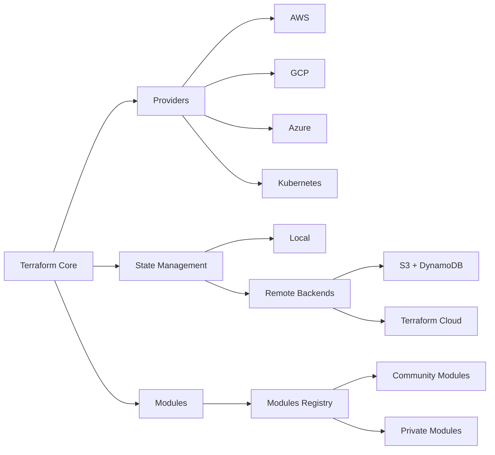

# Chapter 9: Terraform & Infrastructure as Code

> **Prev:** [Continuous Delivery](./09-continuous-delivery.md)
> **Next:** [Advanced Configuration Mgmt](./10-configuration-mgmt.md)

---

## Learning Objectives

- Master Terraform for multi-cloud infrastructure provisioning.
- Implement Terraform workspaces, backends, and state management.
- Design Terraform modules for reusable infrastructure components.
- Manage secrets, variables, and remote execution in Terraform Cloud.
- Apply Terraform best practices for production-grade infrastructure.
- Integrate Terraform with CI/CD pipelines for automated provisioning.

---

## Chapter at a Glance

| Topic | Key Insight | Practical Takeaway |
|-------|-------------|-------------------|
| Terraform Advanced | Workspaces, data sources, provisioners | Separate state per environment with workspaces |
| Modules | Composable infrastructure | Reusable patterns for VPC, ECS, RDS |
| State Management | Remote backends, locking | S3 + DynamoDB for team collaboration |
| Terraform Cloud | Remote execution, VCS integration | Collaborate with policy-as-code |
| Pulumi | TypeScript-native IaC | Use familiar programming languages |
| Cross-Cloud | Multi-provider orchestration | Terraform manages AWS + GCP + Azure + K8s |

## Chapter Roadmap



## Theory

### Terraform Workspaces

Workspaces provide isolated state for different environments using the same configuration:

```hcl
terraform {
  backend "s3" {
    bucket = "myorg-terraform-state"
    key    = "network/terraform.tfstate"
    region = "us-east-1"
  }
}

variable "environment" {
  type    = string
  default = "development"
}

resource "aws_vpc" "main" {
  cidr_block = var.environment == "production" ? "10.0.0.0/16" : "10.1.0.0/16"

  tags = {
    Name        = "${var.environment}-vpc"
    Environment = var.environment
  }
}
```

```text
terraform workspace new dev
terraform workspace new staging
terraform workspace new prod
terraform workspace select dev
terraform apply
```

### Data Sources

Data sources fetch information from existing infrastructure:

```hcl
# Fetch existing VPC data
data "aws_vpc" "selected" {
  tags = {
    Environment = var.environment
  }
}

data "aws_subnets" "private" {
  filter {
    name   = "vpc-id"
    values = [data.aws_vpc.selected.id]
  }
  tags = {
    Tier = "private"
  }
}

resource "aws_ecs_service" "app" {
  network_configuration {
    subnets = data.aws_subnets.private.ids
  }
}
```

### Terraform Provisioners

Provisioners execute scripts on resources after creation (use sparingly — prefer user_data or configuration management):

```hcl
resource "aws_instance" "web" {
  ami           = "ami-0c55b159cbfafe1f0"
  instance_type = "t3.micro"

  # Preferred: cloud-init
  user_data = <<-EOF
    #!/bin/bash
    apt-get update
    apt-get install -y nginx
    systemctl start nginx
  EOF

  # Alternative provisioners (last resort)
  provisioner "remote-exec" {
    inline = [
      "sudo apt-get update",
      "sudo apt-get install -y nginx",
    ]
  }
}
```

### Terraform Modules from Registry

```hcl
# VPC module from Terraform Registry
module "vpc" {
  source  = "terraform-aws-modules/vpc/aws"
  version = "5.0.0"

  name = "myapp-vpc"
  cidr = "10.0.0.0/16"

  azs             = ["us-east-1a", "us-east-1b", "us-east-1c"]
  private_subnets = ["10.0.1.0/24", "10.0.2.0/24", "10.0.3.0/24"]
  public_subnets  = ["10.0.101.0/24", "10.0.102.0/24", "10.0.103.0/24"]

  enable_nat_gateway = true
  enable_vpn_gateway = false
  enable_dns_hostnames = true

  tags = {
    Environment = var.environment
  }
}
```

### Terraform Cloud

Terraform Cloud provides remote execution, state management, and policy enforcement:

```hcl
terraform {
  cloud {
    organization = "myorg"

    workspaces {
      name = "production-infrastructure"
    }
  }
}
```

**Features:**
- Remote state storage with encryption
- Remote execution (no local credentials needed)
- VCS-driven runs (PR plan, merge apply)
- Sentinel policy-as-code enforcement
- Cost estimation for changes
- Team collaboration with run queues

### Pulumi (TypeScript IaC)

Pulumi allows infrastructure provisioning using familiar languages:

```typescript
import * as aws from '@pulumi/aws';
import * as pulumi from '@pulumi/pulumi';

const config = new pulumi.Config();
const environment = config.require('environment');

// Create VPC
const vpc = new aws.ec2.Vpc('main', {
  cidrBlock: '10.0.0.0/16',
  enableDnsHostnames: true,
  tags: { Name: `${environment}-vpc`, Environment: environment },
});

// Create subnets
const subnet = new aws.ec2.Subnet('public', {
  vpcId: vpc.id,
  cidrBlock: '10.0.1.0/24',
  availabilityZone: 'us-east-1a',
  mapPublicIpOnLaunch: true,
});

// Create ECS cluster
const cluster = new aws.ecs.Cluster('main', {
  name: `${environment}-cluster`,
});

// Outputs
export const vpcId = vpc.id;
export const clusterName = cluster.name;
```

### Cross-Cloud Infrastructure

```hcl
# Multi-cloud configuration
provider "aws" {
  region = "us-east-1"
}

provider "google" {
  project = "my-gcp-project"
  region  = "us-central1"
}

provider "azurerm" {
  features {}
}

# Deploy DNS in Route53 pointing to GCP
resource "aws_route53_record" "app" {
  zone_id = aws_route53_zone.main.zone_id
  name    = "app.example.com"
  type    = "A"
  alias {
    name                   = google_compute_global_address.app.address
    zone_id                = google_compute_global_address.app.id
    evaluate_target_health = true
  }
}
```

### Terraform Best Practices

1. **Use remote state with locking.** Never share local state files.
2. **Pin provider versions.** `required_providers` with version constraints.
3. **Use modules from the registry.** Don't reinvent common patterns.
4. **Separate state per component.** Network state, cluster state, app state.
5. **Use workspaces or directory structure for environments.**
6. **Run `terraform plan` in PRs, `apply` on merge.**
7. **Use `prevent_destroy` for critical resources.**
8. **Tag everything.** Costs, ownership, environment, automation.

### Terragrunt

Terragrunt reduces duplication across Terraform configurations:

```hcl
# terragrunt.hcl
remote_state {
  backend = "s3"
  config = {
    bucket         = "myorg-terraform-state"
    key            = "${path_relative_to_include()}/terraform.tfstate"
    region         = "us-east-1"
    encrypt        = true
    dynamodb_table = "terraform-locks"
  }
}

# child terragrunt.hcl for VPC
terraform {
  source = "tfr:///terraform-aws-modules/vpc/aws//?version=5.0.0"
}

inputs = {
  name = "myapp-vpc"
  cidr = "10.0.0.0/16"
  azs  = ["us-east-1a", "us-east-1b"]
}
```

---

## Examples

### Example 1: Terraform State Manager

```typescript
interface StateResource {
  address: string;
  type: string;
  name: string;
  provider: string;
}

interface StateFile {
  version: number;
  terraform_version: string;
  serial: number;
  lineage: string;
  resources: StateResource[];
}

class StateManager {
  private currentSerial: number = 0;
  private resources: Map<string, StateResource> = new Map();

  constructor(initialState?: StateFile) {
    if (initialState) {
      this.currentSerial = initialState.serial;
      for (const r of initialState.resources) {
        this.resources.set(r.address, r);
      }
    }
  }

  addResource(address: string, type: string, name: string, provider: string): void {
    this.resources.set(address, { address, type, name, provider });
    this.currentSerial++;
  }

  removeResource(address: string): boolean {
    const existed = this.resources.delete(address);
    if (existed) this.currentSerial++;
    return existed;
  }

  findResource(address: string): StateResource | undefined {
    return this.resources.get(address);
  }

  findByType(type: string): StateResource[] {
    return [...this.resources.values()].filter(r => r.type === type);
  }

  findByProvider(provider: string): StateResource[] {
    return [...this.resources.values()].filter(r => r.provider === provider);
  }

  exportState(): StateFile {
    return {
      version: 4,
      terraform_version: '1.6.0',
      serial: this.currentSerial,
      lineage: crypto.randomUUID?.() || 'abc-123',
      resources: [...this.resources.values()],
    };
  }

  count(): number {
    return this.resources.size;
  }

  generateReport(): string {
    let report = '# Terraform State Report\n\n';
    report += `## Overview\n\n`;
    report += `- **Total resources:** ${this.resources.size}\n`;
    report += `- **Serial number:** ${this.currentSerial}\n\n`;

    const byType = new Map<string, number>();
    for (const r of this.resources.values()) {
      byType.set(r.type, (byType.get(r.type) || 0) + 1);
    }

    report += `## Resources by Type\n\n`;
    for (const [type, count] of byType) {
      report += `- ${type}: ${count}\n`;
    }

    return report;
  }
}

const state = new StateManager();
state.addResource('aws_vpc.main', 'aws_vpc', 'main', 'provider.aws');
state.addResource('aws_subnet.public', 'aws_subnet', 'public', 'provider.aws');
state.addResource('aws_security_group.web', 'aws_security_group', 'web', 'provider.aws');
console.log(state.generateReport());
```

### Example 2: Terraform to Pulumi Converter

```typescript
interface TerraformResource {
  type: string;
  name: string;
  args: Record<string, any>;
}

class TerraformToPulumi {
  convert(resources: TerraformResource[]): string {
    const imports: Set<string> = new Set();
    const blocks: string[] = [];

    for (const resource of resources) {
      const provider = this.getProvider(resource.type);
      const tsType = this.toPulumiType(resource.type);
      const tsName = resource.name.replace(/-/g, '_');

      imports.add(`import * as ${provider} from "@pulumi/${provider}";`);

      const argsStr = this.formatArgs(resource.args, 2);
      blocks.push(`const ${tsName} = new ${tsType}("${resource.name}", {\n${argsStr}\n});`);
    }

    return [...imports, '', ...blocks].join('\n');
  }

  private getProvider(type: string): string {
    const parts = type.split('_');
    return parts[0]; // aws, azurerm, google, etc.
  }

  private toPulumiType(type: string): string {
    const parts = type.split('_');
    const provider = parts[0];
    const resourceParts = parts.slice(1).map(p =>
      p.charAt(0).toUpperCase() + p.slice(1)
    );
    return `${provider}.${resourceParts.join('')}`;
  }

  private formatArgs(args: Record<string, any>, indent: number): string {
    const pad = ' '.repeat(indent);
    return Object.entries(args)
      .map(([key, value]) => {
        const tsKey = key.replace(/_([a-z])/g, (_, c) => c.toUpperCase());
        if (typeof value === 'string') return `${pad}${tsKey}: "${value}"`;
        if (typeof value === 'number' || typeof value === 'boolean') return `${pad}${tsKey}: ${value}`;
        return `${pad}${tsKey}: ${JSON.stringify(value)}`;
      })
      .join(',\n');
  }
}

const converter = new TerraformToPulumi();
const ts = converter.convert([
  { type: 'aws_vpc', name: 'main', args: { cidr_block: '10.0.0.0/16', enable_dns_hostnames: true } },
  { type: 'aws_subnet', name: 'public', args: { vpc_id: '${aws_vpc.main.id}', cidr_block: '10.0.1.0/24', map_public_ip_on_launch: true } },
]);
console.log(ts);
```

---

## Practical Takeaways

1. **Always use remote state.** S3 + DynamoDB for locking is the standard.
2. **Modularize everything.** Break infrastructure into reusable modules.
3. **Use workspaces or directories for environments.** Isolate state per environment.
4. **Run plan in PRs.** `terraform plan` output should be part of code review.
5. **Tag all resources.** Every resource should have environment, project, and owner tags.
6. **Use `prevent_destroy` on critical resources.** RDS databases, S3 buckets with data.

---

## Chapter Quiz

<details><summary>Question 1: What is the purpose of Terraform workspaces?</summary>**A)** Manage multiple cloud providers<br>**B)** Isolate state for different environments with the same configuration<br>**C)** Share state across teams<br>**D)** Speed up Terraform execution<br><br>**Answer: B)** Isolate state for different environments with the same configuration</details>

<details><summary>Question 2: What is a Terraform data source used for?</summary>**A)** Define new resources<br>**B)** Fetch information about existing infrastructure<br>**C)** Store secrets<br>**D)** Deploy applications<br><br>**Answer: B)** Fetch information about existing infrastructure</details>

<details><summary>Question 3: What does `prevent_destroy` do?</summary>**A)** Prevents accidental deletion of resources<br>**B)** Blocks terraform apply<br>**C)** Creates a backup before deletion<br>**D)** Locks the state file<br><br>**Answer: A)** Prevents accidental deletion of resources</details>

<details><summary>Question 4: What advantage does Pulumi have over Terraform?</summary>**A)** It supports more providers<br>**B)** It uses familiar programming languages instead of HCL<br>**C)** It is faster<br>**D)** It has better state management<br><br>**Answer: B)** It uses familiar programming languages instead of HCL</details>

<details><summary>Question 5: How does Terragrunt help with Terraform configurations?</summary>**A)** It adds new providers<br>**B)** It reduces duplication across multiple Terraform modules<br>**C)** It speeds up terraform apply<br>**D)** It provides a GUI<br><br>**Answer: B)** It reduces duplication across multiple Terraform modules</details>

---

## Summary

- Terraform workspaces isolate state for different environments using the same configuration.
- Data sources fetch existing infrastructure attributes for use in configurations.
- Provisioners execute scripts on resources (use sparingly; prefer user_data or config management).
- The Terraform Registry provides reusable community modules for common infrastructure patterns.
- Terraform Cloud adds remote execution, VCS integration, and policy-as-code enforcement.
- Pulumi enables IaC using TypeScript, Python, Go, and other general-purpose languages.
- Terragrunt reduces boilerplate across multiple Terraform configurations.
- Terraform best practices include remote state, modules, tagging, and CI/CD integration.

---

## Exercises

### Review Questions
1. How do Terraform workspaces differ from using separate directories for each environment?
2. What are the tradeoffs between Terraform modules and the Terraform Registry?
3. When should you use a data source versus hardcoding values?
4. What are the benefits of Terraform Cloud over open-source Terraform?
5. How does Pulumi differ from Terraform in terms of programming model?

### Application Problems
1. Create a Terraform module for an ECS Fargate service with ALB and auto-scaling.
2. Configure a remote backend with S3 and DynamoDB with state locking.
3. Write a Terraform configuration that deploys resources across AWS and GCP.
4. Implement a CI/CD pipeline that runs `terraform plan` in PRs and `apply` on merge to main.

### Challenge Problem
1. Design a complete multi-cloud infrastructure provisioning system using Terraform including: reusable modules for VPC (with public/private subnets, NAT gateway), ECS Fargate cluster with auto-scaling, RDS PostgreSQL with read replicas and backups, S3 buckets with lifecycle policies and encryption, IAM roles with least privilege, Route53 DNS with health checks, CloudFront CDN distribution, separate workspaces for dev, staging, prod, remote state with locking and encryption, a CI/CD pipeline with plan in PRs, apply on merge, and policy-as-code checks, and cost estimation and tagging for resource tracking.
