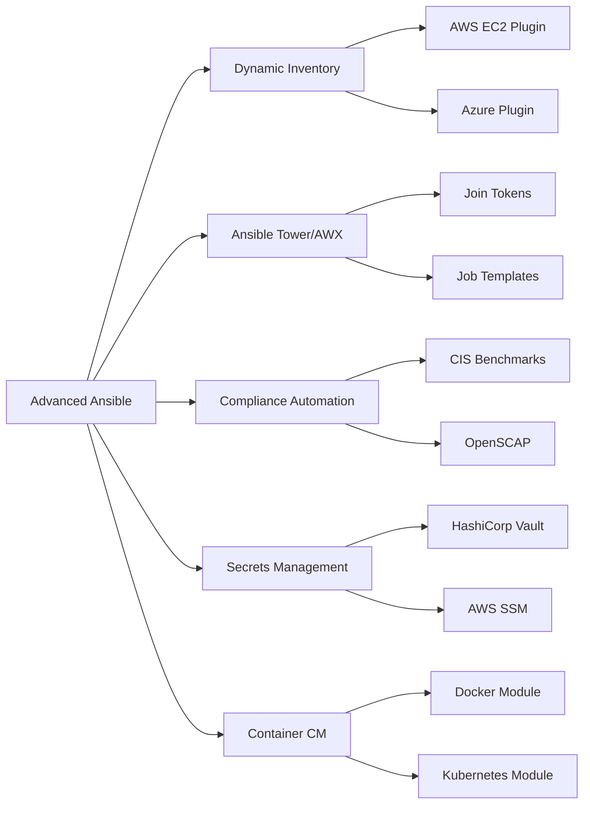

# Chapter 10: Advanced Configuration Management

> **Prev:** [Terraform & IaC](./09-iac.md)
> **Next:** [Monitoring Basics](./10-monitoring.md)

---

## Learning Objectives

- Master advanced Ansible patterns: dynamic inventories, delegation, async tasks.
- Implement Ansible Tower/AWX for enterprise configuration management.
- Use configuration management for compliance and security hardening.
- Implement configuration management for containers and Kubernetes.
- Apply change management and auditing through configuration automation.
- Integrate configuration management with CI/CD and secrets management.

---

## Chapter at a Glance

| Topic | Key Insight | Practical Takeaway |
|-------|-------------|-------------------|
| Dynamic Inventory | Cloud API sources inventory | Auto-discover EC2 instances by tags |
| Ansible Tower | Enterprise CM with RBAC | Scheduling, approvals, logging |
| Compliance | CIS benchmarks automation | Automate hardening and verify continuously |
| Container CM | Build images with playbooks | Ansible inside containers for provisioning |
| Secrets Integration | Vault, AWS SSM, Azure KV | Dynamic secrets at playbook runtime |
| Delegation | Run tasks on behalf of other hosts | Local execution for API calls |
| Pull Mode | Ansible-pull for fleet management | Nodes pull config from Git |
| CI/CD Integration | Git-driven playbook execution | Run playbooks from CI pipeline |

## Chapter Roadmap



## Theory

### Dynamic Inventories

Static inventory files don't scale. Dynamic inventories query cloud APIs:

```ini
# inventory/aws_ec2.yaml
plugin: aws_ec2
regions:
  - us-east-1
  - us-west-2
filters:
  tag:Environment:
    - production
  instance-state-name: running
hostnames:
  - dns-name
keyed_groups:
  - key: tags.Role
    prefix: role
  - key: placement.region
    prefix: region
compose:
  ansible_host: public_dns_name
```

```yaml
# Using dynamic groups
- name: Configure web servers
  hosts: role_web
  tasks:
    - name: Install nginx
      apt:
        name: nginx
        state: present
```

### Ansible Tower / AWX

Ansible Tower (Red Hat) / AWX (upstream open-source) provides:

- **User interface:** Manage inventories, credentials, and playbooks
- **RBAC:** Team-based access control for playbook execution
- **Scheduling:** Cron-based playbook execution
- **Approvals:** Workflow approval gates
- **Logging:** Centralized audit trail
- **REST API:** Programmatic playbook triggering
- **Notifications:** Slack, email, webhook on status changes

```yaml
# AWX job template via API
- name: Trigger AWX job
  uri:
    url: "https://awx.example.com/api/v2/job_templates/10/launch/"
    method: POST
    headers:
      Authorization: "Bearer {{ awx_token }}"
      Content-Type: application/json
    body_format: json
    body:
      extra_vars:
        environment: production
        version: "{{ lookup('env', 'CI_COMMIT_SHA') }}"
```

### Compliance Automation

Automated security hardening and compliance verification:

```yaml
# CIS benchmark compliance checks
- name: CIS Benchmark - SSH Hardening
  hosts: all
  vars:
    cis_rules:
      - rule: "1.1.1.1 Disable unused filesystems"
        check: "modprobe -n -v cramfs"
      - rule: "5.2.1 Ensure permissions on /etc/ssh/sshd_config"
        check: "stat /etc/ssh/sshd_config"
  tasks:
    - name: Check SSH permissions are 600
      stat:
        path: /etc/ssh/sshd_config
      register: ssh_config

    - name: Remediate SSH permissions
      file:
        path: /etc/ssh/sshd_config
        mode: "0600"
        owner: root
        group: root
      when: ssh_config.stat.mode != "0600"

    - name: Verify no root SSH login
      lineinfile:
        path: /etc/ssh/sshd_config
        regexp: "^PermitRootLogin"
        line: "PermitRootLogin no"
      notify: restart sshd
      check_mode: yes
```

### Ansible and Container Configuration

**Building Docker images with Ansible:**

```yaml
- name: Build application image
  hosts: localhost
  tasks:
    - name: Create Dockerfile
      copy:
        dest: /tmp/Dockerfile
        content: |
          FROM node:20-alpine
          WORKDIR /app
          COPY package*.json ./
          RUN npm ci
          COPY dist/ ./
          EXPOSE 3000
          CMD ["node", "server.js"]

    - name: Build Docker image
      docker_image:
        name: myapp
        tag: "{{ version }}"
        build:
          path: /tmp
          pull: yes
        source: build
        push: yes
```

**Managing Kubernetes with Ansible:**

```yaml
- name: Deploy to Kubernetes
  hosts: localhost
  tasks:
    - name: Create namespace
      kubernetes.core.k8s:
        name: "{{ environment }}"
        api_version: v1
        kind: Namespace
        state: present

    - name: Deploy application
      kubernetes.core.k8s:
        state: present
        definition:
          apiVersion: apps/v1
          kind: Deployment
          metadata:
            name: myapp
            namespace: "{{ environment }}"
          spec:
            replicas: 3
            selector:
              matchLabels:
                app: myapp
            template:
              metadata:
                labels:
                  app: myapp
              spec:
                containers:
                  - name: myapp
                    image: "myapp:{{ version }}"
                    ports:
                      - containerPort: 3000
```

### Secrets Integration

Inject secrets at runtime without storing them in playbooks:

```yaml
# HashiCorp Vault lookup
- name: Get database password from Vault
  debug:
    msg: "{{ lookup('community.hashi_vault.hashi_vault', 'secret/data/db', url='https://vault.example.com') }}"

# AWS SSM Parameter Store lookup
- name: Get DB password from SSM
  set_fact:
    db_password: "{{ lookup('amazon.aws.ssm_parameter', '/prod/db/password', decrypt=True) }}"

# Azure Key Vault lookup
- name: Get API key from Azure KV
  set_fact:
    api_key: "{{ lookup('azure.azcollection.azure_keyvault_secret', 'api-key', vault_url='https://myvault.vault.azure.net') }}"
```

### Ansible Pull Mode

In pull mode, nodes fetch configuration from Git and apply locally:

```text
# Cron job on each node
*/15 * * * * ansible-pull -o -U https://github.com/org/config-repo.git -d /etc/ansible/pull -i localhost
```

**Use cases:**
- Infrastructure at scale (thousands of nodes)
- Nodes without direct SSH access from control node
- IoT and edge devices
- Ephemeral instances that self-configure on boot

### Delegation and Local Actions

Delegate tasks to specific hosts:

```yaml
- name: Register instance with load balancer
  hosts: webservers
  tasks:
    - name: Add instance to ELB
      elb_instance:
        instance_id: "{{ ansible_ec2_instance_id }}"
        ec2_elbs:
          - myapp-elb
        state: present
      delegate_to: localhost

- name: Run database migration
  hosts: app_servers
  serial: 1
  tasks:
    - name: Run migrations
      command: npm run migrate
      run_once: true
      delegate_to: "{{ groups.app_servers[0] }}"
```

### Ansible in CI/CD

```yaml
# .gitlab-ci.yml
stages:
  - deploy

deploy:
  stage: deploy
  script:
    - ansible-galaxy install -r requirements.yml
    - ansible-playbook -i inventory/production site.yml \
        --extra-vars "version=$CI_COMMIT_TAG" \
        --vault-password-file .vault_pass
  only:
    - tags
  environment:
    name: production
```

---

## Examples

### Example 1: Compliance Scanner

```typescript
interface ComplianceRule {
  id: string;
  description: string;
  category: string;
  severity: 'critical' | 'high' | 'medium' | 'low';
  check: () => Promise<boolean>;
  remediate: () => Promise<void>;
}

class ComplianceScanner {
  private rules: ComplianceRule[] = [];
  private results: Array<{ rule: string; passed: boolean; error?: string }> = [];

  addRule(rule: ComplianceRule): void {
    this.rules.push(rule);
  }

  async runScan(): Promise<void> {
    console.log('🔍 Starting compliance scan...\n');

    for (const rule of this.rules) {
      try {
        const passed = await rule.check();
        this.results.push({ rule: rule.id, passed });
        const icon = passed ? '✅' : '❌';
        console.log(`${icon} ${rule.id}: ${rule.description}`);
        if (!passed) {
          console.log(`   Severity: ${rule.severity}`);
        }
      } catch (error) {
        this.results.push({ rule: rule.id, passed: false, error: String(error) });
        console.log(`❌ ${rule.id}: Error - ${error}`);
      }
    }

    this.printSummary();
  }

  private printSummary(): void {
    const passed = this.results.filter(r => r.passed).length;
    const failed = this.results.filter(r => !r.passed).length;
    const critical = this.results.filter(r => !r.passed && this.rules.find(rule => rule.id === r.rule)?.severity === 'critical').length;
    const high = this.results.filter(r => !r.passed && this.rules.find(rule => rule.id === r.rule)?.severity === 'high').length;

    console.log(`\n=== Compliance Summary ===`);
    console.log(`Passed: ${passed}/${this.results.length}`);
    console.log(`Failed: ${failed}`);
    console.log(`Critical: ${critical}, High: ${high}`);

    if (failed > 0) {
      console.log(`\n❌ Compliance score: ${((passed / this.results.length) * 100).toFixed(0)}%`);
    } else {
      console.log(`\n✅ Fully compliant`);
    }
  }

  generateReport(): string {
    let report = '# Compliance Scan Report\n\n';
    report += `| Rule | Status | Severity |\n`;
    report += `|------|--------|----------|\n`;

    for (const result of this.results) {
      const rule = this.rules.find(r => r.id === result.rule);
      const status = result.passed ? '✅ Passed' : '❌ Failed';
      report += `| ${rule?.id} | ${status} | ${rule?.severity} |\n`;
    }

    return report;
  }
}

const scanner = new ComplianceScanner();
scanner.addRule({
  id: 'CIS-1.1.1', description: 'Disable unused filesystems', category: 'system', severity: 'high',
  check: async () => true,
  remediate: async () => {},
});
scanner.addRule({
  id: 'CIS-5.2.1', description: 'SSH config permissions', category: 'ssh', severity: 'critical',
  check: async () => false,
  remediate: async () => {},
});
scanner.runScan();
```

### Example 2: Ansible Vault Manager

```typescript
interface VaultEntry {
  name: string;
  path: string;
  data: Record<string, string>;
}

class AnsibleVaultManager {
  private entries: VaultEntry[] = [];

  addEntry(path: string, name: string, data: Record<string, string>): void {
    const existing = this.entries.findIndex(e => e.path === path);
    if (existing >= 0) {
      this.entries[existing] = { name, path, data };
    } else {
      this.entries.push({ name, path, data });
    }
  }

  generateVaultFile(path: string): string {
    const entries = this.entries.filter(e => e.path === path);
    if (entries.length === 0) throw new Error(`No entries for path: ${path}`);

    return entries.map(entry =>
      Object.entries(entry.data)
        .map(([key, value]) => `${key}: "${value}"`)
        .join('\n')
    ).join('\n');
  }

  auditHardcodedSecrets(playbookPath: string): string[] {
    const issues: string[] = [];
    for (const entry of this.entries) {
      for (const [key, value] of Object.entries(entry.data)) {
        if (value.length > 4 && /^[a-zA-Z0-9!@#$%^&*()_+\-=\[\]{};':"\\|,.<>\/?]{8,}$/.test(value)) {
          issues.push(`Potential secret "${key}" in ${entry.path} — should be vault-encrypted`);
        }
      }
    }
    return issues;
  }

  generateSecretsPlaybook(path: string): string {
    const entries = this.entries.filter(e => e.path === path);

    return `---
- name: Deploy secrets from vault
  hosts: all
  become: yes
  vars_files:
    - vault.yml
  tasks:
${entries.map(entry =>
      Object.keys(entry.data).map(key =>
        `    - name: Set ${key}
      set_fact:
        ${key}: "{{ ${key} }}"
      no_log: true`
      ).join('\n')
    ).join('\n')}
    - name: Write .env file
      template:
        src: .env.j2
        dest: /opt/app/.env
        owner: appuser
        mode: "0600"`;
  }
}

const vault = new AnsibleVaultManager();
vault.addEntry('vault.yml', 'production', {
  DB_PASSWORD: 'p@ssw0rd123!',
  API_KEY: 'sk-abc123def456',
  JWT_SECRET: 'super-secret-key-2024',
});
vault.addEntry('vault.yml', 'staging', {
  DB_PASSWORD: 'staging-pass',
  API_KEY: 'sk-test-key',
  JWT_SECRET: 'test-secret',
});

console.log('Vault file:\n', vault.generateVaultFile('vault.yml'));
console.log('\nHardcoded secrets audit:\n', vault.auditHardcodedSecrets('site.yml').join('\n'));
```

---

## Practical Takeaways

1. **Use dynamic inventories for cloud environments.** Don't maintain static host lists.
2. **Integrate with a secrets manager.** Use Vault, SSM, or Azure Key Vault for runtime secrets.
3. **Run compliance checks as regular playbooks.** Automate CIS benchmark verification.
4. **Use pull mode for large fleets.** ansible-pull scales better than push for 1000+ nodes.
5. **Run Ansible Tower/AWX for enterprise teams.** Web UI, RBAC, scheduling, auditing.
6. **Use check mode first.** Always preview changes with `--check` before applying.

---

## Chapter Quiz

<details><summary>Question 1: What is a dynamic inventory in Ansible?</summary>**A)** A static host list<br>**B)** An inventory that queries cloud APIs for host information<br>**C)** A manually maintained host file<br>**D)** A YAML file with hostnames<br><br>**Answer: B)** An inventory that queries cloud APIs for host information</details>

<details><summary>Question 2: What is the purpose of Ansible Tower/AWX?</summary>**A)** A code editor<br>**B)** Enterprise Ansible management with UI, RBAC, and scheduling<br>**C)** An alternative to Docker<br>**D)** A monitoring tool<br><br>**Answer: B)** Enterprise Ansible management with UI, RBAC, and scheduling</details>

<details><summary>Question 3: How does ansible-pull differ from default Ansible?</summary>**A)** It pushes configuration to nodes<br>**B)** Nodes pull configuration from Git and apply locally<br>**C)** It requires a control node<br>**D)** It only works with Windows<br><br>**Answer: B)** Nodes pull configuration from Git and apply locally</details>

<details><summary>Question 4: What is the benefit of using delegate_to in Ansible?</summary>**A)** It speeds up playbook execution<br>**B)** It runs tasks on a specific host (like localhost) while targeting others<br>**C)** It delegates to another playbook<br>**D)** It creates new users<br><br>**Answer: B)** It runs tasks on a specific host (like localhost) while targeting others</details>

<details><summary>Question 5: How should secrets be handled in Ansible playbooks?</summary>**A)** Stored in plaintext in variables<br>**B)** Loaded from a secrets manager or Ansible Vault at runtime<br>**C)** Hardcoded in tasks<br>**D)** Passed via command-line arguments<br><br>**Answer: B)** Loaded from a secrets manager or Ansible Vault at runtime</details>

---

## Summary

- Dynamic inventories query cloud APIs (AWS, Azure, GCP) to discover hosts automatically.
- Ansible Tower/AWX provides enterprise features: RBAC, scheduling, approvals, and auditing.
- Compliance automation uses Ansible to enforce CIS benchmarks and security hardening.
- Secrets should be injected from HashiCorp Vault, AWS SSM, or Azure Key Vault at runtime.
- ansible-pull enables nodes to fetch configuration from Git and apply it locally.
- Delegation runs tasks on specific hosts while targeting others (e.g., API calls from localhost).
- Ansible modules for Docker and Kubernetes extend configuration management to containers.
- CI/CD integration automates playbook execution on infrastructure changes.

---

## Exercises

### Review Questions
1. How does a dynamic inventory differ from a static inventory?
2. What are the advantages of pull mode over push mode for large deployments?
3. How does Ansible Tower improve team collaboration on playbooks?
4. What is the purpose of delegate_to and when should you use it?
5. How can you integrate HashiCorp Vault with Ansible?

### Application Problems
1. Create a dynamic inventory configuration for AWS EC2 instances tagged with `Role=web` and `Environment=production`.
2. Write a compliance playbook that checks and remediates SSH hardening settings.
3. Configure an Ansible workflow that deploys a Docker container with Kubernetes integration.
4. Implement a secrets management pattern that loads database credentials from Vault at runtime.

### Challenge Problem
1. Design a complete enterprise configuration management system using Ansible including: dynamic inventory for 500+ AWS EC2 instances across 3 environments, Ansible Tower/AWX with RBAC (developers can deploy to dev/staging, operators approve prod), compliance automation running CIS benchmarks daily with email reports for violations, secrets integration with HashiCorp Vault for dynamic database credentials, pull-mode configuration for auto-scaling instances using ansible-pull, CI/CD integration running playbooks from GitHub Actions on infrastructure changes, and a self-service portal (via Tower API) allowing developers to trigger common playbooks.
