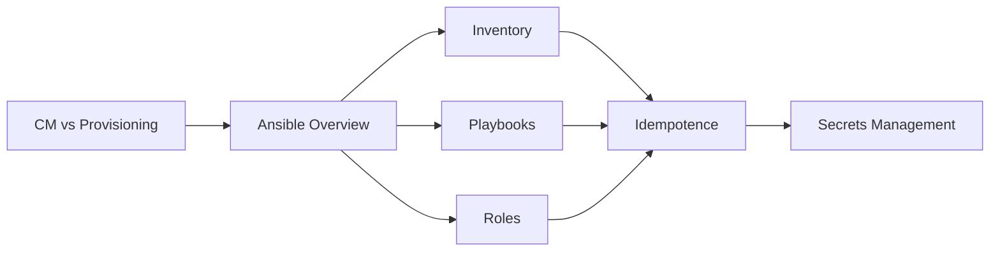

# Chapter 10: Configuration Management

> **Previous:** [Infrastructure as Code (Terraform)](./09-iac.md) | **Next:** [SRE and Monitoring](./10-monitoring.md)

## Learning Objectives


By the end of this chapter, students will be able to:

1. Distinguish configuration management from infrastructure provisioning
2. Write Ansible playbooks, inventory files, and roles for configuration automation
3. Explain idempotence and desired state configuration principles
4. Compare agent-based and agentless configuration management approaches
5. Integrate secrets management with Vault, SOPS, and sealed secrets


## Chapter at a Glance

| Topic | Key Insight | Practical Takeaway |
|-------|-------------|-------------------|
| CM vs Provisioning | CM configures software; Provisioning creates resources | Terraform for infra, Ansible for OS config |
| Ansible Inventory | Static files or dynamic cloud queries | Use dynamic inventory for auto-scaling environments |
| Playbooks | YAML execution units with tasks and handlers | Use handlers for service restarts only when config changes |
| Idempotence | Check current state before making changes | Modules report 'changed' or 'ok' for visibility |
| Secrets Management | Ansible Vault, Vault, SOPS, Sealed Secrets | Vault for dynamic secrets; SOPS for Git workflow |

## Chapter Roadmap



## Theory

### 10.1 Configuration Management vs Infrastructure Provisioning

> **Pro Tip:** Use nsible-playbook --syntax-check to validate playbook syntax before running.

Configuration management and Infrastructure as Code serve different but complementary purposes:

**Infrastructure Provisioning (Terraform, CloudFormation)** — Creates and manages infrastructure resources: VPCs, subnets, load balancers, database instances. Focuses on the cloud resource layer.

**Configuration Management (Ansible, Puppet, Chef)** — Installs and configures software on servers: packages, services, configuration files, users, application settings. Focuses on the operating system and application layer.

The boundary can blur. Ansible and Terraform overlap in provisioning capabilities, but the general recommendation is: Terraform for cloud resources, Ansible for OS configuration. Ansible can invoke Terraform; Terraform can use Ansible provisioners.

### 10.2 Ansible

> **Remember:** Terraform for cloud resources, Ansible for OS configuration is the recommended division.

Ansible is an agentless, push-based configuration management tool. It connects to managed nodes via SSH (Linux) or WinRM (Windows), executes modules, and disconnects. No agent software is required on managed nodes.

**Key Concepts**:
- **Control Node** — The machine where Ansible is installed. Any machine with Python.
- **Managed Nodes** — Target servers configured by Ansible.
- **Inventory** — List of managed nodes in INI or YAML format.
- **Modules** — Discrete units of work (package installation, file management, service control).
- **Tasks** — A module invoked with specific arguments.
- **Playbooks** — YAML files containing ordered lists of tasks.
- **Roles** — Structured packaging of tasks, handlers, variables, and templates.

### 10.3 Inventory

> **Warning:** Never store plaintext secrets in playbooks. Use Ansible Vault, SOPS, or HashiCorp Vault.

Inventory defines which hosts Ansible manages and groups them:

```yaml
all:
  children:
    webservers:
      hosts:
        web01:
          ansible_host: 192.168.1.10
        web02:
          ansible_host: 192.168.1.11
    databases:
      hosts:
        db01:
          ansible_host: 192.168.1.20
  vars:
    ansible_user: ubuntu
    ansible_python_interpreter: /usr/bin/python3
```

Inventories can be static files or dynamic scripts that query cloud providers, CMDB, or other sources.

### 10.4 Playbooks

Playbooks are the execution units of Ansible. They define hosts, tasks, variables, and execution order:

```yaml
---
- name: Configure web servers
  hosts: webservers
  become: yes
  vars:
    nginx_port: 8080
  tasks:
    - name: Install Nginx
      apt:
        name: nginx
        state: present
        update_cache: yes

    - name: Deploy configuration
      template:
        src: nginx.conf.j2
        dest: /etc/nginx/nginx.conf
      notify: restart nginx

    - name: Ensure Nginx is running
      service:
        name: nginx
        state: started
        enabled: yes

  handlers:
    - name: restart nginx
      service:
        name: nginx
        state: restarted
```

### 10.5 Idempotence

Ansible modules are designed to be idempotent. Running the same playbook multiple times produces the same result. Modules check current state before making changes:

- `apt: name=nginx state=present` checks if nginx is installed before installing
- `file: path=/data state=directory` creates the directory only if it does not exist
- `template: src=... dest=...` copies the file only if the template has changed

The `changed_when` directive customizes idempotence detection. The `check_mode` flag (dry-run) previews changes without executing.

### 10.6 Roles

Roles organize playbooks into reusable components:

```
roles/
  common/
    tasks/main.yml
    handlers/main.yml
    templates/
    files/
    vars/main.yml
    defaults/main.yml
    meta/main.yml
  nginx/
    tasks/main.yml
    templates/nginx.conf.j2
```

```yaml
---
- hosts: webservers
  roles:
    - common
    - nginx
```

Community roles are shared via Ansible Galaxy (`ansible-galaxy install geerlingguy.nginx`).

### 10.7 Agent vs Agentless

**Agentless (Ansible, Salt SSH)** — No agent required. SSH-based execution. Simpler setup, lower resource overhead, but potentially higher SSH connection overhead for large fleets.

**Agent-Based (Puppet, Chef, Salt)** — Agent runs continuously on managed nodes, pulls configuration from a master or applies cached state. Better scalability for large fleets, real-time enforcement, and offline operation.

### 10.8 Desired State vs Imperative

**Desired State (Puppet, Ansible declarative modules)** — Define the desired end state; the tool determines the steps. Example: "ensure nginx is installed and running."

**Imperative (Shell scripts, Chef recipes)** — Define the exact steps. Example: "run apt-get install nginx, then run systemctl start nginx."

Desired state configurations are idempotent, self-documenting, and more predictable at scale.

### 10.9 Secrets Management

Configuration management requires accessing secrets (database passwords, API keys, certificates). Several approaches exist:

**Ansible Vault** — Built-in encryption for variables and files. `ansible-vault create`, `ansible-vault encrypt`, `ansible-vault edit`. Decrypted at runtime with `--ask-vault-pass` or vault password file.

**HashiCorp Vault** — External secrets management with dynamic secrets, leasing, and audit logging. Ansible integrates via the `community.hashi_vault` collection.

**SOPS (Secrets OPerationS)** — Encrypts specific values in YAML/JSON files using AWS KMS, GCP KMS, or age. Works well with Git workflows.

```yaml
# secrets.yaml (encrypted with SOPS)
db_password: ENC[AES256_GCM,data:abc123...,iv:def456...,tag:ghi789...]
```

**Sealed Secrets (Kubernetes)** — Encrypts Kubernetes Secrets into SealedSecrets that can be stored in Git safely. Only the controller in the cluster can decrypt them.

## Examples

> **One-Sentence Takeaway:** Configuration management installs and configures software; IaC provisions cloud resources.

### Example 10.1: Complete Ansible Role

```yaml
# roles/postgres/tasks/main.yml
---
- name: Add PostgreSQL repository
  apt_repository:
    repo: "deb http://apt.postgresql.org/pub/repos/apt {{ ansible_distribution_release }}-pgdg main"
    state: present

- name: Install PostgreSQL
  apt:
    name: "postgresql-{{ postgres_version }}"
    state: present

- name: Configure postgresql.conf
  template:
    src: postgresql.conf.j2
    dest: "/etc/postgresql/{{ postgres_version }}/main/postgresql.conf"
  notify: restart postgresql
```

### Example 10.2: Ansible-Vault Usage

```bash
# Create encrypted variable file
ansible-vault create group_vars/production/vault.yml

# Edit encrypted file
ansible-vault edit group_vars/production/vault.yml

# Run playbook with vault
ansible-playbook site.yml --ask-vault-pass

# Encrypt existing file
ansible-vault encrypt secrets.yml
```

## Summary

## Concept Comparison Table

| Concept | Description |
|---------|-------------|
| Infra Provisioning | Creates VPCs, subnets, load balancers, databases |
| Config Management | Installs packages, configures files, manages services |
| Agentless | SSH-based (Ansible), simpler setup |
| Agent-Based | Continuous agent (Puppet, Chef), better scalability |
| Desired State | Declare end state, tool determines steps |

## Quick Reference

| Topic | Key Points |
|-------|------------|
| Ansible Key | Control Node, Inventory, Modules, Playbooks, Roles |
| Idempotence | Check current state before changing |
| Secrets | Ansible Vault, Vault, SOPS, Sealed Secrets |
| Templates | Jinja2 with variables, facts, filters |
| Best Practice | --check, diff mode, tags, --limit |

## Cross-Application Matrix

| Domain | Application |
|--------|-------------|
| Web | Web server farm configuration management |
| Cloud | Post-provision OS configuration |
| Enterprise | Compliance baseline enforcement |
| Container | Container host OS hardening |

## Chapter Quiz

<details><summary>Question 1: What distinguishes CM from IaC?</summary>**A)** CM is faster<br>**B)** IaC provisions resources; CM configures software<br>**C)** There is no difference<br>**D)** CM is cloud-only<br><br>**Answer: B)** IaC provisions resources; CM configures software</details>

<details><summary>Question 2: What does Ansible's check_mode do?</summary>**A)** Runs playbook for real<br>**B)** Dry-run preview without changes<br>**C)** Validates YAML syntax<br>**D)** Tests network connectivity<br><br>**Answer: B)** Dry-run preview without changes</details>

<details><summary>Question 3: Which tool encrypts specific values in YAML for Git?</summary>**A)** Ansible Vault<br>**B)** SOPS<br>**C)** Sealed Secrets<br>**D)** HashiCorp Vault<br><br>**Answer: B)** SOPS</details>


## Summary

Configuration management automates software installation and configuration on servers. Ansible provides agentless, push-based automation through playbooks and roles. Idempotence ensures safe repeated execution. Puppet and Chef offer agent-based models for larger deployments. Secrets management is critical: Ansible Vault, HashiCorp Vault, SOPS, and Sealed Secrets each address specific use cases. Desired state configuration is preferred for its predictability and self-documentation.

## Exercises

### Review Questions

1. How does configuration management differ from infrastructure provisioning? Provide examples of each.
2. What makes an Ansible module idempotent? How does a module report that no change was needed?
3. Compare agentless and agent-based configuration management. What factors determine the appropriate choice?
4. How does Ansible Vault protect secrets at rest? How are secrets decrypted during playbook execution?
5. What is the difference between Ansible variables in `vars/main.yml` and `defaults/main.yml`?

### Application Problems

1. Write an Ansible playbook that installs and configures Nginx on a remote Ubuntu server. Include a template for the virtual host configuration, firewall rules (ufw), and service management. Use handlers for service restarts.
2. Create an Ansible role for deploying a Node.js application. The role should: install Node.js from the official repository, copy application files, install npm dependencies, configure a systemd service, and start the application. Parameterize the Node.js version, application name, and port.
3. Set up Ansible Vault to encrypt database credentials. Create an encrypted variable file, reference it in a playbook, and execute the playbook with the vault password.

### Challenge Problem

Design a configuration management strategy for an organization running 200 servers across three environments (dev, staging, production) in a hybrid cloud (AWS + on-premises). Compare Ansible and Puppet approaches. Define the inventory structure, role hierarchy, secret management approach, deployment workflow, change management process, and compliance auditing. Address: rolling updates to minimize downtime, configuration validation before production application, integration with Terraform-provisioned infrastructure, and secrets rotation strategy. Justify the tool selection with specific advantages for the stated constraints.
