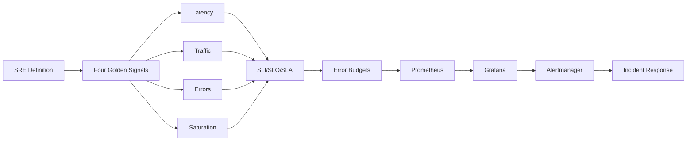

# Chapter 10: Site Reliability Engineering (SRE) and Monitoring

> **Previous:** [Configuration Management](./10-configuration-mgmt.md) | **Next:** [Cloud Platforms](./11-cloud-platforms.md)

---

## Learning Objectives

- Define Site Reliability Engineering (SRE) and its relationship with DevOps.
- Understand the "Four Golden Signals" of monitoring.
- Differentiate between SLIs, SLOs, and SLAs.
- Use Prometheus and Grafana for metrics collection and visualization.
- Explain the importance of Log Management and Error Tracking.
- Implement error budgets to balance reliability and feature velocity.
- Design monitoring dashboards that provide actionable insights.

---

## Chapter at a Glance

| Topic | Key Insight | Practical Takeaway |
|-------|-------------|-------------------|
| SRE Definition | Applying software engineering to operations | SRE makes reliability a quantifiable metric |
| Four Golden Signals | Latency, Traffic, Errors, Saturation | These signals indicate system health at a glance |
| SLI/SLO/SLA | Indicators, Objectives, Agreements | Internal SLOs should be tighter than external SLAs |
| Prometheus | Pull-based metrics with time-series DB | Use exporters to collect infrastructure metrics |
| Grafana | Multi-source visualization dashboards | Use PromQL for metric queries and alert rules |
| Error Budgets | Allowed unreliability = 1 - SLO | Gate releases when budget is exhausted |
| Toil Automation | Manual work elimination | SRE teams spend <50% on operations |
| Incident Response | Severity-based response | Blameless postmortems improve systems |

## Chapter Roadmap



## Theory

### What is Site Reliability Engineering (SRE)?

SRE is a discipline that incorporates aspects of software engineering and applies them to infrastructure and operations problems. The main goals are to create scalable and highly reliable software systems. SRE is often described as "what happens when you ask a software engineer to design an operations function."

**Origins:** Google developed SRE internally, formalized by Ben Treynor Sloss in 2003. The practice has since been adopted by technology companies worldwide. The core insight is that operations problems are engineering problems and should be solved with engineering rigor.

**SRE vs DevOps:**

| Dimension | DevOps | SRE |
|-----------|--------|-----|
| Origin | Community movement | Google engineering practice |
| Focus | Culture, automation, flow | Reliability, capacity, toil |
| Measurement | DORA metrics | SLOs, error budgets |
| Implementation | Principles | Defined engineering role |
| Toil limit | None | 50% maximum |
| Release gating | No equivalent | Error budgets |

### Reliability Metrics

- **SLI (Service Level Indicator):** A quantitative measure of some aspect of the level of service that is provided (e.g., Latency, Throughput).
- **SLO (Service Level Objective):** A target value or range of values for a service level that is measured by an SLI (e.g., "99.9% of requests must finish in less than 200ms").
- **SLA (Service Level Agreement):** A legal contract between a service provider and a customer that includes consequences (usually financial) if SLOs are not met.

### The Four Golden Signals

1. **Latency:** The time it takes to service a request. Distinguish between successful requests and failed requests—a failing service might return errors very quickly, masking the latency problem.
2. **Traffic:** A measure of how much demand is being placed on the system (requests per second, active users, throughput).
3. **Errors:** The rate of requests that fail explicitly (5xx) or implicitly (success with wrong content, slow responses).
4. **Saturation:** How "full" your service is (CPU usage, memory utilization, queue depth). The most overloaded component determines the system's saturation point.

### Error Budgets

The error budget is the acceptable amount of unreliability. For a 99.9% SLO over 30 days:

```
Error Budget = (1 - SLO) × Time Window
             = 0.001 × (30 × 24 × 60 × 60)
             = 2,592 seconds ≈ 43 minutes
```

**Error Budget Mechanics:**
- Budget is consumed by events that violate the SLO
- Budget is replenished as the measurement window rolls forward
- If budget is exhausted, releases are halted until it recovers
- Burn-rate alerts fire before full depletion
- Error budgets create a shared vocabulary between developers and operators

### Toil Elimination

Toil is operational work that is manual, repetitive, automatable, tactical, and devoid of enduring value.

**Examples of toil:**
- Manually restarting crashed processes
- Rotating credentials by hand
- Responding to non-actionable alerts
- Hand-configuring monitoring dashboards
- Manually provisioning infrastructure

**The 50% Rule:** SRE teams should spend no more than 50% of their time on operational work. The remaining time must be invested in engineering projects.

### Incident Management

| Severity | Description | Response Time | Example |
|----------|-------------|---------------|---------|
| SEV-1 | Critical service outage | 15 min | Complete service unavailable |
| SEV-2 | Major component degraded | 30 min | Checkout flow failing |
| SEV-3 | Minor issue, no customer impact | 4 hours | Non-critical API errors |
| SEV-4 | Cosmetic or informational | 24 hours | Dashboard labeling issue |

**Incident Response Flow:**
1. Detection → Alert fires or user reports issue
2. Triage → Determine severity, declare incident, assemble response team
3. Mitigation → Stabilize the system (rollback, redirect, scale up)
4. Resolution → Apply permanent fix
5. Follow-up → Blameless postmortem, preventive actions

### Monitoring Stack

- **Prometheus:** A time-series database and monitoring system that pulls metrics from applications via HTTP. Features a powerful query language (PromQL), built-in alerting, and service discovery.
- **Grafana:** A visualization tool that connects to Prometheus (and other sources) to create interactive dashboards. Supports alerting, annotations, and team collaboration.
- **Alertmanager:** Handles alerts sent by Prometheus with deduplication, grouping, routing, silencing, and notification to channels (Slack, PagerDuty, email).

**Prometheus Data Model:**
- Metrics identified by name and key-value label pairs
- Four metric types: Counter (monotonically increasing), Gauge (up/down), Histogram (bucketed observations), Summary (quantile-based observations)
- Recording rules precompute expensive queries for faster dashboards

---

## Examples

### Example 1: Exposing Metrics in Prometheus Format

```typescript
import express from 'express';
import prometheus from 'prom-client';

const app = express();
const register = new prometheus.Registry();

prometheus.collectDefaultMetrics({ register });

const httpRequestDuration = new prometheus.Histogram({
  name: 'http_request_duration_seconds',
  help: 'Duration of HTTP requests in seconds',
  labelNames: ['method', 'route', 'status'],
  buckets: [0.01, 0.05, 0.1, 0.5, 1, 2, 5, 10],
  registers: [register],
});

const httpRequestsTotal = new prometheus.Counter({
  name: 'http_requests_total',
  help: 'Total number of HTTP requests',
  labelNames: ['method', 'route', 'status'],
  registers: [register],
});

app.use((req, res, next) => {
  const end = httpRequestDuration.startTimer();
  res.on('finish', () => {
    const labels = { method: req.method, route: req.route?.path || req.path, status: String(res.statusCode) };
    httpRequestsTotal.inc(labels);
    end(labels);
  });
  next();
});

app.get('/metrics', async (_req, res) => {
  res.set('Content-Type', register.contentType);
  res.send(await register.metrics());
});

app.get('/api/users', (_req, res) => {
  res.json([{ id: 1, name: 'Alice' }]);
});

app.listen(3000, () => console.log('Server on :3000'));
```

### Example 2: Creating a Grafana Dashboard with PromQL

```typescript
interface DashboardPanel {
  title: string;
  query: string;
  type: 'graph' | 'stat' | 'table' | 'gauge';
  unit?: string;
}

interface GrafanaDashboard {
  title: string;
  panels: DashboardPanel[];
  refreshInterval: string;
}

function generateDashboard(dashboard: GrafanaDashboard): string {
  const panels = dashboard.panels.map((panel, i) => ({
    id: i + 1,
    title: panel.title,
    type: panel.type,
    targets: [{ expr: panel.query, legendFormat: '{{service}}' }],
    gridPos: { h: 8, w: 8, x: (i % 3) * 8, y: Math.floor(i / 3) * 8 },
    fieldConfig: {
      defaults: { unit: panel.unit || 'none' },
    },
  }));

  return JSON.stringify({
    title: dashboard.title,
    panels,
    refresh: dashboard.refreshInterval,
    time: { from: 'now-6h', to: 'now' },
    schemaVersion: 36,
  }, null, 2);
}

const sreDashboard: GrafanaDashboard = {
  title: 'SRE Golden Signals',
  refreshInterval: '30s',
  panels: [
    {
      title: 'Request Latency (p95)',
      query: 'histogram_quantile(0.95, sum(rate(http_request_duration_seconds_bucket[5m])) by (le, service))',
      type: 'graph',
      unit: 's',
    },
    {
      title: 'Requests per Second',
      query: 'sum(rate(http_requests_total[5m])) by (service)',
      type: 'graph',
      unit: 'rps',
    },
    {
      title: 'Error Rate',
      query: 'sum(rate(http_requests_total{status=~"5.."}[5m])) / sum(rate(http_requests_total[5m]))',
      type: 'stat',
      unit: 'percentunit',
    },
    {
      title: 'CPU Saturation',
      query: '100 - (avg by(instance) (rate(node_cpu_seconds_total{mode="idle"}[5m])) * 100)',
      type: 'gauge',
      unit: 'percent',
    },
  ],
};

console.log(generateDashboard(sreDashboard));
```

### Example 3: Error Budget Calculator

```typescript
interface SLOConfig {
  name: string;
  target: number; // 99.9 = 99.9%
  windowDays: number;
  currentUptime: number; // seconds of uptime in the window
}

interface ErrorBudget {
  total: number; // seconds
  consumed: number; // seconds
  remaining: number; // seconds
  remainingPercent: number;
  exhausted: boolean;
}

class ErrorBudgetCalculator {
  calculate(config: SLOConfig): ErrorBudget {
    const totalSeconds = config.windowDays * 24 * 60 * 60;
    const allowedDowntime = totalSeconds * (1 - config.target / 100);
    const consumed = totalSeconds - config.currentUptime;
    const remaining = allowedDowntime - consumed;
    const remainingPercent = (remaining / allowedDowntime) * 100;

    return {
      total: Math.round(allowedDowntime),
      consumed: Math.max(0, Math.round(consumed)),
      remaining: Math.round(remaining),
      remainingPercent: Math.round(remainingPercent * 100) / 100,
      exhausted: remaining <= 0,
    };
  }

  alertStatus(budget: ErrorBudget): 'healthy' | 'warning' | 'critical' | 'exhausted' {
    if (budget.exhausted) return 'exhausted';
    if (budget.remainingPercent < 10) return 'critical';
    if (budget.remainingPercent < 30) return 'warning';
    return 'healthy';
  }

  generateReport(configs: SLOConfig[]): string {
    let report = '# Error Budget Report\n\n';
    report += '| SLO | Target | Window | Total Budget | Consumed | Remaining | Status |\n';
    report += '|-----|--------|--------|--------------|----------|-----------|--------|\n';

    for (const config of configs) {
      const budget = this.calculate(config);
      const status = this.alertStatus(budget);
      report += `| ${config.name} | ${config.target}% | ${config.windowDays}d | ${budget.total}s | ${budget.consumed}s | ${budget.remaining}s | ${status} |\n`;
    }

    return report;
  }
}

const calc = new ErrorBudgetCalculator();
const budgets = [
  { name: 'api-availability', target: 99.9, windowDays: 30, currentUptime: 2591000 },
  { name: 'api-latency', target: 99.5, windowDays: 30, currentUptime: 2590000 },
  { name: 'db-availability', target: 99.99, windowDays: 30, currentUptime: 2591900 },
];

console.log(calc.generateReport(budgets));
const apiBudget = calc.calculate(budgets[0]);
console.log(`API budget remaining: ${apiBudget.remainingPercent}% - ${calc.alertStatus(apiBudget)}`);
```

---

## Concept Comparison Table

| Concept | Description |
|---------|-------------|
| SLI | Quantitative measure of service aspect (latency, availability) |
| SLO | Target value for SLI (99.9% requests under 200ms) |
| SLA | Contractual commitment with consequences |
| Prometheus | Pull-based time-series monitoring |
| Grafana | Visualization with multi-source dashboards |
| Error Budget | Allowed unreliability = (1 - SLO) × window |
| Toil | Manual, repetitive, automatable operational work |
| Alertmanager | Deduplication, grouping, routing, silencing |

## Quick Reference

| Topic | Key Points |
|-------|------------|
| Golden Signals | Latency, Traffic, Errors, Saturation |
| SRE Goal | Quantified reliability with error budgets |
| Prometheus | Pull metrics, time-series DB, PromQL |
| Alertmanager | Grouping, silencing, routing, notification |
| Grafana | Panels, dashboards, data sources, alerts |
| Error Budget | 43 min/month for 99.9% SLO |
| Toil | Manual, repetitive, no enduring value |

## Cross-Application Matrix

| Domain | Application |
|--------|-------------|
| Web | Web application latency monitoring |
| Cloud | Cloud resource utilization tracking |
| Enterprise | SLA compliance dashboards |
| Container | Kubernetes cluster monitoring |

## Chapter Quiz

<details><summary>Question 1: What are the Four Golden Signals?</summary>**A)** CPU, Memory, Disk, Network<br>**B)** Latency, Traffic, Errors, Saturation<br>**C)** Build, Test, Deploy, Monitor<br>**D)** Dev, Staging, QA, Production<br><br>**Answer: B)** Latency, Traffic, Errors, Saturation</details>

<details><summary>Question 2: What is an error budget?</summary>**A)** Budget for fixing errors<br>**B)** Allowed amount of unreliability<br>**C)** Cost of incidents<br>**D)** Team training budget<br><br>**Answer: B)** Allowed amount of unreliability</details>

<details><summary>Question 3: How does Prometheus collect metrics?</summary>**A)** Push model from applications<br>**B)** Pull model by scraping HTTP endpoints<br>**C)** Log file parsing<br>**D)** Database queries<br><br>**Answer: B)** Pull model by scraping HTTP endpoints</details>

<details><summary>Question 4: What is the 50% rule in SRE?</summary>**A)** 50% test coverage<br>**B)** Max 50% of time on operational work<br>**C)** 50% budget for monitoring<br>**D)** 50% of team on-call<br><br>**Answer: B)** Max 50% of time on operational work</details>

<details><summary>Question 5: What distinguishes toil from valuable work?</summary>**A)** It is difficult<br>**B)** It is manual, repetitive, automatable, and has no enduring value<br>**C)** It requires senior engineers<br>**D)** It happens infrequently<br><br>**Answer: B)** It is manual, repetitive, automatable, and has no enduring value</details>

---

## Practical Takeaways

1. **Monitoring should focus on user-visible symptoms**, not internal system states. Alert on customer-impacting conditions.
2. **Start with one SLO** for your most critical service and expand from there. Don't try to SLO everything at once.
3. **Error budgets create a shared language** between developers and operators for when reliability trumps features.
4. **Use recording rules** in Prometheus to precompute expensive queries and speed up dashboard loading.
5. **Implement burn-rate alerts** to detect error budget consumption before it's too late.

---

## Summary

- SRE applies engineering principles to system operations to ensure high reliability.
- SLIs and SLOs are the foundation of data-driven reliability management.
- Error budgets quantify allowed unreliability and gate release velocity.
- Monitoring should focus on the Four Golden Signals: Latency, Traffic, Errors, and Saturation.
- Prometheus and Grafana are the industry standard for cloud-native monitoring.
- Alerting should be actionable and focused on symptoms that affect users.
- Toil elimination ensures SRE teams invest in automation rather than manual operations.
- Blameless postmortems drive systemic improvement after incidents.

---

## Exercises

### Review Questions
1. How does SRE differ from traditional Systems Administration?
2. What is an "Error Budget" and how is it calculated?
3. Explain the difference between an SLI and an SLO.
4. Why is "Saturation" an important metric to monitor?
5. What is the difference between toil and valuable operational work?

### Application Problems
1. Design an SLO for a messaging application that focuses on "Message Delivery Latency." Calculate the error budget for a 99.95% SLO over a 28-day window.
2. Write a PromQL query to find the average CPU usage across all nodes in a cluster over the last hour.
3. Identify three sources of "Toil" in an operations team and propose how an SRE would automate them.
4. Create a burn-rate alert rule that fires when 5% of a 30-day error budget is consumed in 1 hour.

### Challenge Problem
1. You are tasked with setting up monitoring for a new microservices-based application. Describe the full stack you would choose and the first five alerts you would configure to ensure system health. Define SLOs for each service, calculate error budgets, and specify the monitoring dashboard layout using the Four Golden Signals framework. Include a toil reduction plan that would bring operational work below 50% of team time.
