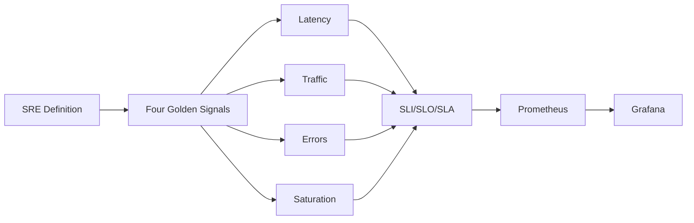

# Chapter 10: Site Reliability Engineering (SRE) and Monitoring

> **Previous:** [Configuration Management](./10-configuration-mgmt.md) | **Next:** [Cloud Platforms](./11-cloud-platforms.md)

---

## Learning Objectives

- Define Site Reliability Engineering (SRE) and its relationship with DevOps.
- Understand the "Four Golden Signals" of monitoring.
- Differentiate between SLIs, SLOs, and SLAs.
- Use Prometheus and Grafana for metrics collection and visualization.
- Explain the importance of Log Management and Error Tracking.

---


## Chapter at a Glance

| Topic | Key Insight | Practical Takeaway |
|-------|-------------|-------------------|
| SRE Definition | Applying software engineering to operations | SRE makes reliability a quantifiable metric |
| Four Golden Signals | Latency, Traffic, Errors, Saturation | These signals indicate system health at a glance |
| SLI/SLO/SLA | Indicators, Objectives, Agreements | Internal SLOs should be tighter than external SLAs |
| Prometheus | Pull-based metrics with time-series DB | Use exporters to collect infrastructure metrics |
| Grafana | Multi-source visualization dashboards | Use PromQL for metric queries and alert rules |

## Chapter Roadmap



## Theory


### What is Site Reliability Engineering (SRE)?

> **Pro Tip:** Use recording rules in Prometheus to precompute expensive queries and speed up dashboard loading.
SRE is a discipline that incorporates aspects of software engineering and applies them to infrastructure and operations problems. The main goals are to create scalable and highly reliable software systems. SRE is often described as "what happens when you ask a software engineer to design an operations function."

### Reliability Metrics

> **Remember:** Alertmanager handles alert deduplication, grouping, routing, and silencing.
- **SLI (Service Level Indicator):** A quantitative measure of some aspect of the level of service that is provided (e.g., Latency, Throughput).
- **SLO (Service Level Objective):** A target value or range of values for a service level that is measured by an SLI (e.g., "99.9% of requests must finish in less than 200ms").
- **SLA (Service Level Agreement):** A legal contract between a service provider and a customer that includes consequences (usually financial) if SLOs are not met.

### The Four Golden Signals

> **Warning:** Alerting should focus on symptoms that affect users, not internal system states.
1.  **Latency:** The time it takes to service a request.
2.  **Traffic:** A measure of how much demand is being placed on the system.
3.  **Errors:** The rate of requests that fail.
4.  **Saturation:** How "full" your service is (e.g., CPU usage, memory utilization).

### Monitoring Stack
- **Prometheus:** A time-series database and monitoring system that pulls metrics from applications via HTTP.
- **Grafana:** A visualization tool that connects to Prometheus (and other sources) to create interactive dashboards.
- **Alertmanager:** Handles alerts sent by client applications such as the Prometheus server.

---

## Examples

> **One-Sentence Takeaway:** SRE applies software engineering to operations to create scalable, highly reliable systems.

### Example 1: Exposing Metrics in Prometheus Format
Using a client library to export application data.
- **Step-by-step:**
  1. Add a metrics endpoint to a Python app:
     ```python
     from prometheus_client import start_http_server, Summary
     import random
     import time
     
     REQUEST_TIME = Summary('request_processing_seconds', 'Time spent processing request')
     
     @REQUEST_TIME.time()
     def process_request(t):
         time.sleep(t)
     
     if __name__ == '__main__':
         start_http_server(8000)
         while True:
             process_request(random.random())
     ```
  2. Configure Prometheus to scrape `localhost:8000`.
- **Expected output:** Prometheus stores the timing data, which can then be queried using PromQL.
- **What the example demonstrates:** Instrumented code providing real-time telemetry.

### Example 2: Creating a Grafana Dashboard
Visualizing the error rate of a service.
- **Step-by-step:**
  1. Add Prometheus as a Data Source in Grafana.
  2. Create a new Panel.
  3. Enter the PromQL query:
     ```promql
     sum(rate(http_requests_total{status=~"5.."}[5m])) / sum(rate(http_requests_total[5m]))
     ```
  4. Set the visualization type to "Graph."
- **Expected output:** A line chart showing the percentage of failed requests over time.
- **What the example demonstrates:** Turning raw metrics into actionable insights for engineers.

---

## Summary

## Concept Comparison Table

| Concept | Description |
|---------|-------------|
| SLI | Quantitative measure of service aspect (latency, availability) |
| SLO | Target value for SLI (99.9% requests under 200ms) |
| SLA | Contractual commitment with consequences |
| Prometheus | Pull-based time-series monitoring |
| Grafana | Visualization with multi-source dashboards |

## Quick Reference

| Topic | Key Points |
|-------|------------|
| Golden Signals | Latency, Traffic, Errors, Saturation |
| SRE Goal | Quantified reliability with error budgets |
| Prometheus | Pull metrics, time-series DB, PromQL |
| Alertmanager | Grouping, silencing, routing, notification |
| Grafana | Panels, dashboards, data sources, alerts |

## Cross-Application Matrix

| Domain | Application |
|--------|-------------|
| Web | Web application latency monitoring |
| Cloud | Cloud resource utilization tracking |
| Enterprise | SLA compliance dashboards |
| Container | Kubernetes cluster monitoring |

## Chapter Quiz

<details><summary>Question 1: What are the Four Golden Signals?</summary>**A)** CPU, Memory, Disk, Network<br>**B)** Latency, Traffic, Errors, Saturation<br>**C)** Build, Test, Deploy, Monitor<br>**D)** Dev, Staging, QA, Production<br><br>**Answer: B)** Latency, Traffic, Errors, Saturation</details>

<details><summary>Question 2: What is an error budget?</summary>**A)** Budget for fixing errors<br>**B)** Allowed amount of unreliability<br>**C)** Cost of incidents<br>**D)** Team training budget<br><br>**Answer: B)** Allowed amount of unreliability</details>

<details><summary>Question 3: How does Prometheus collect metrics?</summary>**A)** Push model from applications<br>**B)** Pull model by scraping HTTP endpoints<br>**C)** Log file parsing<br>**D)** Database queries<br><br>**Answer: B)** Pull model by scraping HTTP endpoints</details>


## Summary

- SRE applies engineering principles to system operations to ensure high reliability.
- SLIs and SLOs are the foundation of data-driven reliability management.
- Monitoring should focus on the "Four Golden Signals": Latency, Traffic, Errors, and Saturation.
- Prometheus and Grafana are the industry standard for cloud-native monitoring.
- Alerting should be actionable and focused on symptoms that affect users, not just internal system states.

---

## Exercises

### Review Questions
1. How does SRE differ from traditional Systems Administration?
2. What is an "Error Budget" and how is it calculated?
3. Explain the difference between an SLI and an SLO.
4. Why is "Saturation" an important metric to monitor?

### Application Problems
1. Design an SLO for a messaging application that focuses on "Message Delivery Latency."
2. Write a PromQL query to find the average CPU usage across all nodes in a cluster over the last hour.
3. Identify three sources of "Toil" in an operations team and propose how an SRE would automate them.

### Challenge Problem
1. You are tasked with setting up monitoring for a new microservices-based application. Describe the full stack you would choose and the first five alerts you would configure to ensure the system's health.
