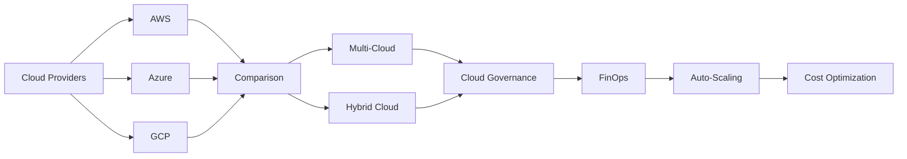

# Chapter 11: Cloud Platforms

> **Previous:** [SRE and Monitoring](./10-monitoring.md) | **Next:** [Monitoring and Logging](./12-monitoring-logging.md)

## Learning Objectives

By the end of this chapter, students will be able to:

1. Describe the core compute, storage, networking, and identity services of AWS, Azure, and GCP
2. Compare cloud providers across service models, pricing, and capabilities
3. Design multi-cloud and hybrid cloud architectures
4. Apply FinOps principles for cloud cost optimization
5. Configure auto-scaling, reserved instances, and spot instances for cost efficiency
6. Implement cloud governance with tagging, budgets, and compliance controls

## Chapter at a Glance

| Topic | Key Insight | Practical Takeaway |
|-------|-------------|-------------------|
| AWS | 200+ services, largest market share, broadest catalog | Best for comprehensive cloud strategy |
| Azure | Deep enterprise integration with Microsoft ecosystem | Best for Microsoft-centric organizations |
| GCP | Data analytics, ML, and container-native services | Best for data-driven and container-first orgs |
| Multi-Cloud | Using multiple providers to avoid lock-in | Adds complexity; use only when necessary |
| FinOps | Cloud cost optimization through accountability | Tag resources, right-size, use reserved instances |
| Cloud Governance | Policies, compliance, and cost controls | Automate with policy-as-code and budget alerts |
| Auto-Scaling | Dynamic resource adjustment | Scale horizontally for stateless workloads |

## Chapter Roadmap



## Theory

### 11.1 Amazon Web Services (AWS)

AWS is the largest and most mature public cloud provider, offering over 200 services across 30+ global regions.

**Compute:**
- **EC2 (Elastic Compute Cloud)** — Virtual machines optimized for general purpose (t3, m6i), compute (c6i), memory (r6i), storage (i3), and GPU (p4). Supports spot instances (60-90% discount), reserved instances (up to 72% discount), and dedicated hosts.
- **Lambda** — Serverless function execution supporting Node.js, Python, Java, Go, Ruby, .NET, and custom runtimes. Scales automatically. Billed per invocation and duration (rounded to 1ms).
- **ECS (Elastic Container Service)** — Docker container orchestration with Fargate (serverless) and EC2 launch types.
- **EKS (Elastic Kubernetes Service)** — Managed Kubernetes control plane with automated upgrades and IAM integration.

**Storage:**
- **S3 (Simple Storage Service)** — Object storage with 99.999999999% durability. Storage classes: Standard, Intelligent-Tiering, Infrequent Access, Glacier, Deep Archive. Lifecycle policies automate tier transitions.
- **EBS (Elastic Block Store)** — Block storage with gp3 (general purpose), io2 (provisioned IOPS up to 256K), st1 (throughput), sc1 (cold). Snapshots are incremental and stored in S3.
- **RDS (Relational Database Service)** — Managed MySQL, PostgreSQL, Oracle, SQL Server, MariaDB, Aurora. Multi-AZ for high availability, Read Replicas for read scaling.

**Networking:**
- **VPC (Virtual Private Cloud)** — Isolated network environment with subnets, route tables, internet/NAT gateways, security groups, network ACLs, VPC peering, Transit Gateway.
- **CloudFront** — CDN with 400+ edge locations. Supports Lambda@Edge for custom logic at the edge.
- **Route 53** — DNS with routing policies: simple, weighted, latency-based, geolocation, geonear, failover, multi-value.

**IAM (Identity and Access Management)** — Fine-grained access control with users, groups, roles, policies, and identity federation. Supports SCIM, SAML 2.0, and OIDC. IAM Roles Anywhere for on-premises workloads.

### 11.2 Microsoft Azure

Azure is the second-largest cloud provider with deep enterprise and Microsoft ecosystem integration across 60+ regions.

**Compute:**
- **Virtual Machines** — Windows and Linux VMs with flexible sizing. Availability sets (99.95% SLA) and availability zones (99.99% SLA) for high availability. Supports spot VMs and reserved instances.
- **Azure Functions** — Serverless compute supporting C#, JavaScript, Python, Java, PowerShell. Consumption, Premium, and Dedicated plans.
- **AKS (Azure Kubernetes Service)** — Managed Kubernetes with Azure AD integration, managed identity, and Azure Policy for governance.
- **App Service** — Managed platform for web apps and APIs. Supports Windows and Linux, auto-scale, staging slots, and integrated CI/CD.

**Storage:**
- **Blob Storage** — Object storage with hot, cool, cold, and archive tiers. Supports lifecycle management and immutable storage for compliance.
- **Azure SQL Database** — Managed SQL Server with built-in HA, auto-tuning, serverless compute, and geo-replication.
- **Cosmos DB** — Globally distributed NoSQL database with turnkey distribution, multi-master, and five consistency models (strong, bounded staleness, session, consistent prefix, eventual).

**Networking:**
- **Virtual Network (VNet)** — Network isolation with subnets, peering, VPN gateways, ExpressRoute for dedicated private connections.
- **Azure DNS** — Domain hosting with 100% SLA.
- **Azure Front Door** — Global load balancing and CDN with WAF, SSL termination, and URL-based routing.

**Identity:**
- **Microsoft Entra ID (formerly Azure AD)** — Identity and access management with SSO, MFA, conditional access, identity protection, and privileged identity management (PIM).

### 11.3 Google Cloud Platform (GCP)

GCP excels in data analytics, machine learning, and container-native services across 35+ global regions.

**Compute:**
- **Compute Engine** — Virtual machines with live migration, custom machine types, sustained-use discounts (automatic 30% for full month), and committed use discounts (up to 57% for 1-3 year commitments).
- **Cloud Functions** — Serverless functions (Node.js, Python, Go, Java, .NET, Ruby, PHP). 1st gen and 2nd gen (Cloud Run-based).
- **GKE (Google Kubernetes Engine)** — Managed Kubernetes with Autopilot mode (serverless), integrated Cloud NAT, workload identity, and GKE Sandbox for extra isolation.
- **Cloud Run** — Serverless container execution. Runs any containerized application with automatic scale-to-zero. Billed per 100ms of CPU and memory usage.

**Storage:**
- **Cloud Storage** — Object storage with standard, nearline, coldline, and archive classes. Uniform and fine-grained access control through IAM and ACLs. Object lifecycle management.
- **Cloud SQL** — Managed MySQL, PostgreSQL, SQL Server with automatic replication, backups, and failover.
- **Cloud Spanner** — Horizontally scalable relational database with strong consistency and 99.999% SLA. Supports SQL queries and transactions.

**Networking:**
- **VPC** — Global virtual network (not regional like AWS). Subnets, firewall rules, Cloud NAT, Cloud VPN, Dedicated Interconnect.
- **Cloud CDN** — Content delivery with global edge caching using Google's global fiber network.
- **Cloud DNS** — Managed DNS with 100% SLA.

### 11.4 Cloud Provider Comparison

| Aspect | AWS | Azure | GCP |
|--------|-----|-------|-----|
| Market share | Largest | Second | Third |
| Services count | 200+ | 200+ | 120+ |
| Global regions | 30+ | 60+ | 35+ |
| Kubernetes | EKS | AKS | GKE |
| Serverless functions | Lambda | Functions | Cloud Functions |
| Serverless containers | Fargate | Container Instances | Cloud Run |
| Managed K8s cost | Control plane billed | Control plane free | Control plane free (Autopilot has fee) |
| Networking | VPC (regional) | VNet (regional) | VPC (global) |
| Identity | IAM | Entra ID | Cloud IAM |
| AI/ML | SageMaker | Azure AI | Vertex AI |
| Global network | 400+ CloudFront PoPs | 160+ edge nodes | 140+ edge nodes (fastest fiber) |

### 11.5 Multi-Cloud and Hybrid Cloud

**Multi-Cloud** — Using multiple cloud providers to avoid vendor lock-in, optimize costs, leverage best-of-breed services, or meet regulatory requirements.

**Challenges:**
- Increased operational complexity and skill requirements
- Data transfer costs between providers (egress fees)
- Inconsistent security models and tooling
- Latency between services on different providers

**Hybrid Cloud** — Connecting on-premises infrastructure with cloud resources.

**Use cases:**
- Legacy application migration (lift-and-shift, re-platform)
- Data residency compliance (keep sensitive data on-premises)
- Burst capacity for peak workloads (cloud bursting)
- Disaster recovery (on-premises primary, cloud secondary)

**Hybrid management platforms:**
- **AWS Outposts** — AWS infrastructure on-premises
- **Azure Arc** — Manage multi-cloud and on-prem from Azure
- **Google Anthos** — Multi-cloud and on-prem Kubernetes management

### 11.6 Cloud Governance

Cloud governance ensures security, compliance, and cost control across cloud environments:

**Identity and Access Management:**
- Implement least-privilege access with IAM roles and policies
- Use identity federation with existing identity providers (Okta, Azure AD)
- Enable MFA for all human users
- Use temporary credentials (STS) for automation

**Policy as Code:**
- **AWS Service Control Policies (SCPs)** — Guardrails for accounts in AWS Organizations
- **Azure Policy** — Enforce compliance rules across subscriptions
- **GCP Organization Policies** — Constraints at the organization level

**Compliance Automation:**
- Automated compliance scanning (AWS Config, Azure Policy, GCP Security Command Center)
- Continuous monitoring with CIS benchmarks
- Automated remediation for common violations
- Audit logging with CloudTrail, Azure Monitor, Cloud Audit Logs

### 11.7 Cloud Cost Optimization (FinOps)

FinOps is the practice of managing cloud costs through cultural change, financial accountability, and engineering excellence.

**Key Practices:**
- **Right-sizing** — Match instance types to workload requirements. Use AWS Compute Optimizer, Azure Advisor, GCP Rightsizing Recommendations.
- **Reserved Instances and Savings Plans** — Commit to 1-year or 3-year terms for 30-72% discount over on-demand.
- **Spot Instances** — Use spare compute capacity at 60-90% discount. Suitable for fault-tolerant workloads.
- **Auto-scaling** — Scale resources to match demand. Scale down during low-traffic periods.
- **Storage Lifecycle Policies** — Move data to cheaper storage tiers as it ages (automate with lifecycle rules).
- **Tagging and Cost Allocation** — Tag resources by team, project, environment. Track spending with cost allocation reports.
- **Budget Alerts** — Configure budgets with alert thresholds at 50%, 80%, 90%, 100%.

### 11.8 Auto-Scaling Strategies

Auto-scaling adjusts compute resources dynamically based on demand:

- **Horizontal Scaling** — Add/remove instances. Preferred for stateless applications. Near-infinite scaling.
- **Vertical Scaling** — Increase/decrease instance size. Limited by maximum instance size. Requires restart.
- **Predictive Scaling** — ML-based scaling based on historical patterns. Available in AWS Predictive Scaling.
- **Scheduled Scaling** — Scale based on known traffic patterns (scale up at 8 AM, scale down at 8 PM).

**Auto-scaling configuration considerations:**
- Cooldown periods between scaling activities
- Warm-up time for new instances (affects aggressive scaling)
- Scale-in protection to prevent terminating instances with active connections
- Metrics selection (CPU, memory, request count, custom metrics)

---

## Examples

### Example 1: Multi-Cloud Cost Comparison

```typescript
interface CloudPricing {
  provider: string;
  compute: { instance: string; hourly: number; monthly: number };
  storage: { tier: string; perGB: number };
  network: { egressPerGB: number };
  support: string;
}

class CostEstimator {
  estimateMonthly(pricing: CloudPricing, instances: number, storageGB: number, egressGB: number): string {
    const computeCost = pricing.compute.monthly * instances;
    const storageCost = pricing.storage.perGB * storageGB;
    const egressCost = pricing.network.egressPerGB * egressGB;
    const total = computeCost + storageCost + egressCost;

    return JSON.stringify({
      provider: pricing.provider,
      breakdown: { compute: computeCost, storage: storageCost, egress: egressCost },
      total: Math.round(total * 100) / 100,
      currency: 'USD',
    }, null, 2);
  }
}

const estimator = new CostEstimator();
const aws = {
  provider: 'AWS', compute: { instance: 'm6i.large', hourly: 0.096, monthly: 70.08 },
  storage: { perGB: 0.023 }, network: { egressPerGB: 0.09 }, support: 'Developer',
};
const azure = {
  provider: 'Azure', compute: { instance: 'D2s v3', hourly: 0.096, monthly: 70.08 },
  storage: { perGB: 0.0208 }, network: { egressPerGB: 0.087 }, support: 'Developer',
};
const gcp = {
  provider: 'GCP', compute: { instance: 'e2-standard-2', hourly: 0.067, monthly: 48.91 },
  storage: { perGB: 0.020 }, network: { egressPerGB: 0.12 }, support: 'Developer',
};

console.log(estimator.estimateMonthly(aws, 10, 500, 1000));
console.log(estimator.estimateMonthly(azure, 10, 500, 1000));
console.log(estimator.estimateMonthly(gcp, 10, 500, 1000));
```

### Example 2: Tagging Strategy and Cost Allocation

```typescript
interface Tag {
  key: string;
  value: string;
}

interface Resource {
  id: string;
  type: string;
  tags: Tag[];
  monthlyCost: number;
}

class CostAllocator {
  private resources: Resource[] = [];

  addResource(resource: Resource): void {
    this.resources.push(resource);
  }

  getCostByTag(tagKey: string): Record<string, number> {
    const costs: Record<string, number> = {};

    for (const resource of this.resources) {
      const tag = resource.tags.find(t => t.key === tagKey);
      const group = tag ? tag.value : 'untagged';
      costs[group] = (costs[group] || 0) + resource.monthlyCost;
    }

    return costs;
  }

  findUntaggedResources(): Resource[] {
    return this.resources.filter(r => r.tags.length === 0);
  }

  enforceTaggingPolicy(requiredTags: string[]): string[] {
    const violations: string[] = [];

    for (const resource of this.resources) {
      const resourceKeys = resource.tags.map(t => t.key);
      const missing = requiredTags.filter(k => !resourceKeys.includes(k));
      if (missing.length > 0) {
        violations.push(`${resource.id} missing tags: ${missing.join(', ')}`);
      }
    }

    return violations;
  }

  generateReport(): string {
    let report = '# Cloud Cost Allocation Report\n\n';
    report += '## Cost by Team\n';

    const byTeam = this.getCostByTag('team');
    for (const [team, cost] of Object.entries(byTeam)) {
      report += `- ${team}: $${cost.toFixed(2)}/month\n`;
    }

    report += '\n## Cost by Environment\n';
    const byEnv = this.getCostByTag('environment');
    for (const [env, cost] of Object.entries(byEnv)) {
      report += `- ${env}: $${cost.toFixed(2)}/month\n`;
    }

    report += '\n## Untagged Resources\n';
    const untagged = this.findUntaggedResources();
    report += untagged.length === 0 ? 'None\n' : untagged.map(r => `- ${r.id}\n`).join('');

    report += '\n## Policy Violations\n';
    const violations = this.enforceTaggingPolicy(['team', 'environment', 'project']);
    report += violations.length === 0 ? 'None\n' : violations.map(v => `- ${v}\n`).join('');

    return report;
  }
}

const allocator = new CostAllocator();
allocator.addResource({ id: 'ec2-web-01', type: 'EC2', tags: [{ key: 'team', value: 'frontend' }, { key: 'environment', value: 'production' }, { key: 'project', value: 'web-app' }], monthlyCost: 70.08 });
allocator.addResource({ id: 'rds-db-01', type: 'RDS', tags: [{ key: 'team', value: 'backend' }, { key: 'environment', value: 'production' }, { key: 'project', value: 'web-app' }], monthlyCost: 120.00 });
allocator.addResource({ id: 's3-data-01', type: 'S3', tags: [], monthlyCost: 15.50 });
allocator.addResource({ id: 'elb-prod', type: 'ELB', tags: [{ key: 'team', value: 'platform' }, { key: 'environment', value: 'production' }], monthlyCost: 22.30 });

console.log(allocator.generateReport());
```

### Example 3: Auto-Scaling Policy Simulator

```typescript
interface ScalingPolicy {
  metric: string;
  targetValue: number;
  minInstances: number;
  maxInstances: number;
  cooldownSeconds: number;
  scaleUpBy: number;
  scaleDownBy: number;
}

interface AutoScalerState {
  currentInstances: number;
  lastScalingAction: number; // timestamp
  metricValues: number[]; // recent metric values
}

class AutoScalerSimulator {
  private state: AutoScalerState;

  constructor(private policy: ScalingPolicy) {
    this.state = {
      currentInstances: policy.minInstances,
      lastScalingAction: Date.now(),
      metricValues: [],
    };
  }

  ingestMetric(value: number): string | null {
    this.state.metricValues.push(value);
    if (this.state.metricValues.length > 5) this.state.metricValues.shift();

    return this.evaluate();
  }

  private evaluate(): string | null {
    const now = Date.now();
    if (now - this.state.lastScalingAction < this.policy.cooldownSeconds * 1000) return null;

    const avg = this.state.metricValues.reduce((a, b) => a + b, 0) / this.state.metricValues.length;
    const { currentInstances } = this.state;
    const { targetValue, minInstances, maxInstances } = this.policy;

    if (avg > targetValue * 1.2 && currentInstances < maxInstances) {
      const newCount = Math.min(currentInstances + this.policy.scaleUpBy, maxInstances);
      this.state.currentInstances = newCount;
      this.state.lastScalingAction = now;
      return `SCALE_UP: ${currentInstances} → ${newCount} (avg: ${avg.toFixed(1)} > ${targetValue})`;
    }

    if (avg < targetValue * 0.6 && currentInstances > minInstances) {
      const newCount = Math.max(currentInstances - this.policy.scaleDownBy, minInstances);
      this.state.currentInstances = newCount;
      this.state.lastScalingAction = now;
      return `SCALE_DOWN: ${currentInstances} → ${newCount} (avg: ${avg.toFixed(1)} < ${targetValue})`;
    }

    return null;
  }

  simulate(metrics: number[]): string[] {
    const actions: string[] = [];
    for (const m of metrics) {
      const action = this.ingestMetric(m);
      if (action) actions.push(action);
    }
    return actions;
  }
}

const policy: ScalingPolicy = {
  metric: 'cpu', targetValue: 70, minInstances: 2, maxInstances: 10,
  cooldownSeconds: 120, scaleUpBy: 2, scaleDownBy: 1,
};

const simulator = new AutoScalerSimulator(policy);
const cpuMetrics = [45, 50, 55, 60, 75, 85, 90, 95, 30, 25, 20, 35, 40, 45, 50];
console.log('Auto-scaling decisions:', simulator.simulate(cpuMetrics));
```

---

## Concept Comparison Table

| Concept | Description |
|---------|-------------|
| AWS | Broadest service catalog, largest market share |
| Azure | Deep Microsoft integration, enterprise focus |
| GCP | Data/ML leadership, container-native, global network |
| Multi-Cloud | Multiple providers, complex operations |
| Hybrid Cloud | On-prem + cloud integration |
| FinOps | Right-size, Reserved/Spot, Auto-scale, Tagging |
| Cloud Governance | IAM, policies, compliance, budget controls |

## Quick Reference

| Topic | Key Points |
|-------|------------|
| AWS Services | EC2, Lambda, S3, RDS, EKS, IAM |
| Azure Services | VMs, Functions, Blob, SQL, AKS, Entra ID |
| GCP Services | Compute Engine, Functions, Storage, Cloud SQL, GKE |
| FinOps | Right-size, Reserved/Spot, Auto-scaling, Tagging |
| Comparison | 200+ services each, K8s (EKS/AKS/GKE) |
| Governance | SCPs, Azure Policy, Org Policies, Config rules |

## Cross-Application Matrix

| Domain | Application |
|--------|-------------|
| Web | Global CDN and web hosting |
| Cloud | Multi-cloud workload orchestration |
| Enterprise | Hybrid cloud with on-prem integration |
| ML | Vertex AI vs SageMaker for ML pipelines |

## Chapter Quiz

<details><summary>Question 1: Which provider has the most global regions?</summary>**A)** AWS<br>**B)** Azure<br>**C)** GCP<br>**D)** DigitalOcean<br><br>**Answer: B)** Azure with 60+ regions</details>

<details><summary>Question 2: What is FinOps?</summary>**A)** A cloud provider<br>**B)** Cloud cost management practice<br>**C)** A monitoring tool<br>**D)** A deployment strategy<br><br>**Answer: B)** Cloud cost management practice</details>

<details><summary>Question 3: Which GCP service excels at serverless containers?</summary>**A)** Compute Engine<br>**B)** Cloud Functions<br>**C)** Cloud Run<br>**D)** GKE<br><br>**Answer: C)** Cloud Run</details>

<details><summary>Question 4: What is the primary benefit of spot instances?</summary>**A)** Higher performance<br>**B)** 60-90% cost discount<br>**C)** Better security<br>**D)** Guaranteed availability<br><br>**Answer: B)** 60-90% cost discount</details>

<details><summary>Question 5: Which AWS service provides DNS with routing policies?</summary>**A)** CloudFront<br>**B)** Route 53<br>**C)** ELB<br>**D)** VPC<br><br>**Answer: B)** Route 53</details>

---

## Summary

Each major cloud provider offers comprehensive compute, storage, networking, and identity services. AWS provides the broadest service catalog. Azure excels in enterprise integration and Microsoft ecosystem. GCP leads in data analytics, ML, and container-native services. Multi-cloud and hybrid cloud strategies address specific business needs but add operational complexity. Cloud governance ensures security, compliance, and cost control. FinOps practices optimize cloud costs through right-sizing, reservation models, spot instances, and budget governance. Auto-scaling ensures cost-efficient capacity management for variable workloads.

---

## Exercises

### Review Questions

1. Compare EC2, Lambda, and ECS in terms of management overhead, scaling characteristics, and billing model.
2. How does GCP's global VPC differ from AWS's regional VPC model?
3. What are the primary cost drivers in cloud computing? How does FinOps address each?
4. Under what circumstances would you choose multi-cloud over single-cloud architecture?
5. Compare spot instances across AWS, Azure, and GCP. What workloads are suitable each?

### Application Problems

1. Create an AWS architecture diagram for a three-tier web application (web, API, database) using VPC, ALB, EC2 auto-scaling group, RDS Multi-AZ, ElastiCache, and S3 for static assets. Justify each service choice.
2. Calculate the cost comparison for a workload running 24/7: on-demand vs 1-year reserved vs 3-year reserved vs spot instances using public pricing.
3. Set up budget alerts on a cloud provider. Create a tagging strategy that allocates costs by project, environment, and team.

### Challenge Problem

Design a multi-cloud architecture for a global SaaS platform with the following requirements: primary workload on AWS for compute, secondary on GCP for data analytics, disaster recovery across providers, data residency compliance (EU data stays in EU, US data stays in US), global CDN for static assets, managed Kubernetes for container orchestration, and a monthly cloud budget not exceeding $50,000. Define the architecture, provider service mapping, networking topology, data replication strategy, cost allocation model, and governance policies with estimated cost breakdown.
