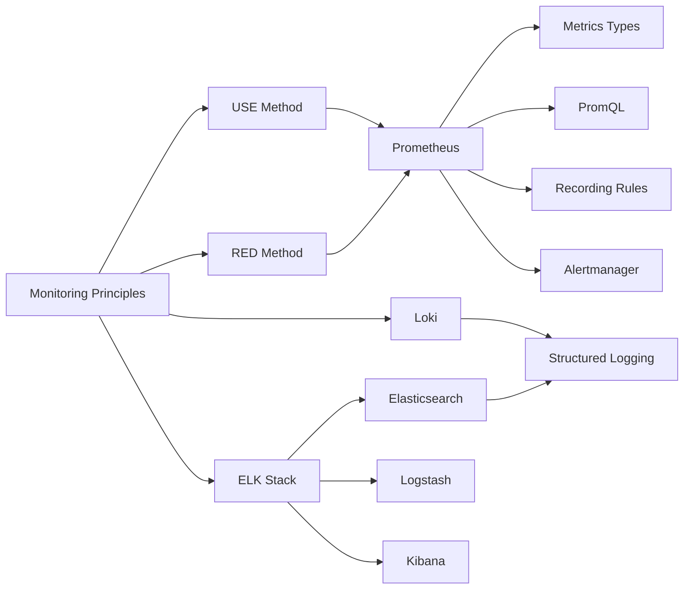

# Chapter 12: Monitoring and Logging

> **Previous:** [Cloud Platforms](./11-cloud-platforms.md) | **Next:** [Observability](./13-observability.md)

## Learning Objectives

By the end of this chapter, students will be able to:

<!-- Image Gallery -->
<section class="lesson-visuals" aria-label="Visual learning resources">
  <header><span>VISUAL LEARNING</span><h2>See it. Review it. Remember it.</h2></header>
  <a class="lesson-visual-card" href="../../../assets/images/lessons/devops/12-monitoring-logging/handwritten-notes.svg" target="_blank" rel="noopener">
    
    <span><strong>Handwritten notes</strong>Condensed notes for deliberate review.</span>
  </a>
  <a class="lesson-visual-card" href="../../../assets/images/lessons/devops/12-monitoring-logging/sticky-notes.svg" target="_blank" rel="noopener">
    
    <span><strong>Sticky-note revision</strong>Fast recall prompts for revision.</span>
  </a>
  <a class="lesson-visual-card" href="../../../assets/images/lessons/devops/12-monitoring-logging/visual-explanation.svg" target="_blank" rel="noopener">
    
    <span><strong>Visual concept guide</strong>A connected explanation of the key ideas.</span>
  </a>
</section>
<!-- End Image Gallery -->


1. Deploy and configure Prometheus for metrics collection and alerting
2. Design Grafana dashboards for operational visibility
3. Configure Loki for log aggregation and querying with LogQL
4. Deploy the ELK stack (Elasticsearch, Logstash, Kibana) for centralized logging
5. Implement structured logging with JSON and appropriate log levels
6. Configure Alertmanager for deduplication, grouping, and notification
7. Design monitoring strategies using USE and RED methods

## Chapter at a Glance

| Topic | Key Insight | Practical Takeaway |
|-------|-------------|-------------------|
| Monitoring Principles | Detection, dashboarding, analysis, diagnostics | Effective monitoring answers four key questions |
| Prometheus | Pull-based metrics with four metric types | Use recording rules for expensive queries |
| Alertmanager | Deduplication, grouping, routing, silencing | Configure correct group_wait and repeat_interval |
| Grafana | Multi-source visualization and alerting | Design dashboard hierarchy from global to detailed |
| Loki | Label-indexed log aggregation | Cheaper than ELK at scale; uses LogQL |
| ELK Stack | Full-text search with Elasticsearch | Best for advanced log analytics and search |
| Structured Logging | JSON output with correlation IDs | Enables machine parsing and cross-service tracing |

## Chapter Roadmap



## Theory

### 12.1 Monitoring Principles


Monitoring is the systematic collection, analysis, and visualization of system data to understand behavior, detect anomalies, and support decision making. Effective monitoring answers four questions:

1. **What is broken right now?** (Alerting) — Immediate notification of service degradation
2. **What is trending in the wrong direction?** (Dashboards) — Visual indicators of approaching problems
3. **What happened during the incident last night?** (Temporal analysis) — Historical data for root cause
4. **Why did the system behave that way?** (Diagnostics) — Detailed investigation capabilities

**The USE Method** (Utilization, Saturation, Errors) — For resource-level monitoring:
- **Utilization** — Percentage of resource being used (CPU %, memory %, disk space %)
- **Saturation** — Degree of resource contention (queue length, run queue depth)
- **Errors** — Error counts (disk I/O errors, network interface drops)

**The RED Method** (Rate, Errors, Duration) — For service-level monitoring:
- **Rate** — Requests per second or transactions per second
- **Errors** — Number of failed requests (explicit 5xx, implicit failures like wrong results)
- **Duration** — Latency distributions (average, p50, p90, p95, p99)

### 12.2 Prometheus Architecture


Prometheus is a metrics-based monitoring system designed for reliability and operational simplicity.

**Architecture Components:**
- **Prometheus Server** — Scrapes metrics from targets at configured intervals, stores data in a time-series database. Default scrape interval is 15s.
- **Exporters** — Agents that expose metrics in Prometheus format:
  - `node_exporter` — Host-level metrics (CPU, memory, disk, network)
  - `kube-state-metrics` — Kubernetes object metrics
  - `blackbox_exporter` — Probes endpoints (HTTP, HTTPS, TCP, ICMP)
  - Custom application exporters using client libraries
- **Pushgateway** — Accepts metrics from short-lived jobs that cannot be scraped (batch jobs, scheduled tasks). Used carefully to avoid single points of failure.
- **Alertmanager** — Handles alerts: deduplication, grouping, routing, silencing, and notification to channels (Slack, PagerDuty, email).

**Data Model:**
Metrics are identified by a metric name and key-value label pairs. Prometheus stores data as a time series — a stream of timestamped values belonging to the same metric and label set.

**Four Metric Types:**
1. **Counter** — Monotonically increasing value (requests total, errors total). Cannot decrease, only reset on restart.
2. **Gauge** — Can go up or down (CPU temperature, memory usage, queue depth).
3. **Histogram** — Samples observations into configurable buckets. Counts observations in each bucket and provides total count and sum. Use for latency, request sizes.
4. **Summary** — Similar to histogram but calculates configurable quantiles over a sliding time window on the client side.

### 12.3 PromQL (Prometheus Query Language)


PromQL is a powerful functional query language for metric aggregation:

```promql
# Instant vector query (current value)
node_cpu_seconds_total{mode="idle"}

# Range vector query (values over time)
node_cpu_seconds_total{mode="idle"}[5m]

# Rate calculation (per-second average rate of increase)
rate(node_cpu_seconds_total{mode="idle"}[5m])

# CPU utilization per instance
100 - (avg by(instance) (rate(node_cpu_seconds_total{mode="idle"}[5m])) * 100)

# Request error rate
sum(rate(http_requests_total{status=~"5.."}[5m])) / sum(rate(http_requests_total[5m]))

# 95th percentile request latency
histogram_quantile(0.95, sum(rate(http_request_duration_seconds_bucket[5m])) by (le, service))

# Aggregation operators: sum, avg, min, max, count, quantile
# Binary operators: +, -, *, /, %, ^
# Comparison operators: ==, !=, >, <, >=, <=
```

### 12.4 Recording Rules


Recording rules precompute frequently used or expensive queries for faster dashboard loading:

```yaml
groups:
  - name: instance.rules
    rules:
      - record: instance:node_cpu_utilization:rate5m
        expr: 100 - (avg by(instance) (rate(node_cpu_seconds_total{mode="idle"}[5m])) * 100)
      - record: instance:node_memory_utilization:ratio
        expr: 1 - (node_memory_MemAvailable_bytes / node_memory_MemTotal_bytes)
```

### 12.5 Alerting Rules


Alerting rules define conditions that trigger alerts:

```yaml
groups:
  - name: instance.alerts
    rules:
      - alert: HighCPUUsage
        expr: instance:node_cpu_utilization:rate5m > 80
        for: 5m
        labels:
          severity: warning
        annotations:
          summary: "Instance {{ $labels.instance }} CPU usage above 80%"
          description: "CPU at {{ $value | humanizePercentage }} for 5 minutes"

      - alert: InstanceDown
        expr: up == 0
        for: 1m
        labels:
          severity: critical
        annotations:
          summary: "Instance {{ $labels.instance }} is down"
```

### 12.6 Alertmanager Configuration


Alertmanager processes alerts before sending notifications:

```yaml
route:
  receiver: team-pager
  group_by: [alertname, cluster]
  group_wait: 30s
  group_interval: 5m
  repeat_interval: 4h
  routes:
    - receiver: team-pager
      matchers:
        - severity = critical
    - receiver: team-chat
      matchers:
        - severity = warning

receivers:
  - name: team-pager
    pagerduty_configs:
      - service_key: <key>
  - name: team-chat
    slack_configs:
      - channel: "#alerts"
        title: "{{ .GroupLabels.alertname }}"
        text: "{{ .CommonAnnotations.description }}"
```

### 12.7 Grafana Dashboard Design


Grafana visualizes metrics from multiple data sources (Prometheus, Loki, Elasticsearch, CloudWatch, etc.).

**Dashboard Hierarchy:**
- **Top row:** Global status (service availability, overall error rate, SLO burn rate)
- **Second row:** Resource utilization by service (CPU, memory, disk, network)
- **Third row:** Application-specific panels (request rate, latency distributions, error count)
- **Bottom row:** Detailed debugging views (per-instance metrics, logs correlation)

**Grafana Alerting:**
- Supports rule-based alerting from any data source
- Multiple conditions per rule (e.g., CPU > 80% AND memory > 90%)
- Evaluation intervals and notification channels
- Alert rule evaluation in Grafana or through Prometheus/Alertmanager

### 12.8 Loki for Log Aggregation


Loki is a log aggregation system designed for cost-effective, scalable log storage. Unlike the ELK stack, Loki does not index log content — it indexes only metadata labels.

**Architecture:**
- **Loki** — Log storage and query engine
- **Promtail** — Log shipping agent that discovers targets and attaches labels
- **Grafana** — Query and visualization interface

**LogQL** — Loki's query language combines log stream selection with PromQL-like aggregation:

```logql
# Count errors by service
sum by (service) (count_over_time({job="api"} |= "ERROR" [5m]))

# Extract JSON fields and filter
{job="api"} | json | level = "error" | line_format "{{.message}}"

# Rate of error logs per second
rate({job="api"} |= "ERROR" [5m])

# Top 5 services by log volume
topk(5, sum by (service) (count_over_time({job="api"}[1h])))
```

### 12.9 ELK Stack (Elastic Stack)


**Elasticsearch** — Distributed search and analytics engine. Stores logs as JSON documents. Provides full-text search, aggregations, and high availability through sharding and replication. Supports near-real-time indexing (refresh interval defaults to 1s).

**Logstash** — Server-side data processing pipeline. Ingests logs from multiple sources, transforms them (grok parsing, date manipulation, enrichment), and sends to Elasticsearch. Supports plugins for input, filter, and output stages.

**Kibana** — Visualization and management interface. Provides log exploration (Discover), dashboard creation, alerting, machine learning anomaly detection, and system management.

**Beats** — Lightweight data shippers:
- **Filebeat** — Log files (tail, multiline, container logs)
- **Metricbeat** — System metrics (CPU, memory, disk, network)
- **Heartbeat** — Uptime monitoring (HTTP, TCP, ICMP)
- **Winlogbeat** — Windows event logs

### 12.10 Structured Logging


Structured logging outputs logs as machine-parseable structured data (JSON) rather than unstructured text:

```json
{
  "timestamp": "2026-06-09T14:30:00.123Z",
  "level": "ERROR",
  "logger": "payment-service",
  "message": "Payment processing failed",
  "service": "payment-api",
  "trace_id": "abc123def456",
  "user_id": "user_789",
  "payment_id": "pay_123456",
  "error": {
    "type": "CardDeclined",
    "code": "declined_insufficient_funds",
    "amount": 4999,
    "currency": "USD"
  },
  "duration_ms": 342,
  "environment": "production"
}
```

### 12.11 Log Levels


| Level | Usage | Example |
|-------|-------|---------|
| TRACE | Detailed debugging, development only | Function entry/exit, variable values |
| DEBUG | Diagnostic info, non-production | SQL queries, external API call details |
| INFO | Normal application events | Request started, payment processed, user registered |
| WARN | Unexpected but non-fatal | Deprecated API usage, retry attempts, slow query |
| ERROR | Failed operations needing attention | DB connection failure, payment processing error |
| FATAL | Catastrophic, immediate intervention | Application crash, data corruption |

### 12.12 Monitoring as Code


Define monitoring configuration declaratively, version-controlled alongside application code:

```yaml
# monitoring-as-code.yml
prometheus:
  rules:
    - record: "service:error_ratio:rate5m"
      expr: "sum(rate(http_requests_total{status=~\"5..\"}[5m])) / sum(rate(http_requests_total[5m]))"
  alerts:
    - name: "HighErrorRate"
      expr: "service:error_ratio:rate5m > 0.01"
      severity: "critical"
      annotations:
        runbook: "https://runbooks.example.com/high-error-rate"

grafana:
  dashboards:
    - name: "Service Overview"
      panels:
        - title: "Request Rate"
          metric: "sum(rate(http_requests_total[5m]))"
        - title: "P99 Latency"
          metric: "histogram_quantile(0.99, rate(http_request_duration_seconds_bucket[5m]))"
```

**Benefits of monitoring as code:**
- Version-controlled dashboards and alerts
- Code review for monitoring changes
- Automated deployment across environments
- Reproducible dashboards from scratch
- Audit trail for monitoring changes

**Tools:** Grafana (provisioning via YAML), Prometheus (config reload), Jsonnet (grafonnet) for dashboard generation, Terraform Grafana provider.

### 12.13 Log Sampling and Cost Management


At scale, storing every log entry becomes cost-prohibitive:

| Strategy | Description | Savings |
|----------|-------------|---------|
| **Head-based sampling** | Keep first N logs per time window | Simple but may miss rare errors |
| **Tail-based sampling** | Keep last N logs, drop rest | Loses some context |
| **Importance sampling** | Keep all ERROR/FATAL, 50% WARN, 10% INFO, 0% DEBUG | High signal, controlled cost |
| **Rule-based sampling** | Downsample high-volume paths, keep low-volume full | Best balance |
| **Adaptive sampling** | Adjust rates based on error rate and volume | Optimal but complex |

```typescript
interface SamplingConfig {
  level: string;
  keepRate: number; // 0.0 to 1.0
  maxPerSecond: number;
}

class LogSampler {
  private configs: SamplingConfig[] = [
    { level: 'ERROR', keepRate: 1.0, maxPerSecond: 1000 },
    { level: 'WARN', keepRate: 0.5, maxPerSecond: 500 },
    { level: 'INFO', keepRate: 0.1, maxPerSecond: 200 },
    { level: 'DEBUG', keepRate: 0.0, maxPerSecond: 0 },
  ];

  shouldSample(level: string): boolean {
    const config = this.configs.find(c => c.level === level);
    if (!config) return false;
    return Math.random() < config.keepRate;
  }
}
```

### 12.14 Observability Maturity Model


| Level | Metrics | Logs | Traces | Alerting | Automation |
|-------|---------|------|--------|----------|------------|
| 1 - Initial | Basic CPU/mem | Unstructured files | None | Manual checks | None |
| 2 - Reactive | Service-level dashboards | Centralized ELK | Manual trace injection | Basic email alerts | Runbooks |
| 3 - Proactive | RED metrics, SLOs | Structured JSON | Distributed tracing | PagerDuty, on-call | Auto-remediation |
| 4 - Predictive | ML anomaly detection | Log pattern analysis | Trace sampling | Severity-based routing | Self-healing |
| 5 - Autonomous | AI-driven optimization | Automated root cause | Full trace fidelity | Predict-before-break | Auto-scaling, chaos |

### 12.15 Logging Best Practices


- Log in JSON format for machine parsing
- Include correlation IDs (trace_id, request_id) for request tracing
- Use consistent field names across all services
- Log at the appropriate level; never log PII, passwords, or tokens
- Implement log rotation and retention policies (30 days typical for production)
- Use structured context fields, not string interpolation in messages
- Ensure logging is asynchronous and non-blocking
- Configure sampling for high-volume debug/trace logs
- Use stderr for error/fatal logs, stdout for info/debug

---

## Examples

### Example 1: Structured Logger Implementation

```typescript
type LogLevel = 'TRACE' | 'DEBUG' | 'INFO' | 'WARN' | 'ERROR' | 'FATAL';

interface LogEntry {
  timestamp: string;
  level: LogLevel;
  service: string;
  message: string;
  trace_id?: string;
  [key: string]: unknown;
}

class StructuredLogger {
  private service: string;
  private minLevel: number;

  private static LEVELS: Record<LogLevel, number> = {
    TRACE: 0, DEBUG: 1, INFO: 2, WARN: 3, ERROR: 4, FATAL: 5,
  };

  constructor(service: string, level: LogLevel = 'INFO') {
    this.service = service;
    this.minLevel = StructuredLogger.LEVELS[level];
  }

  private log(level: LogLevel, message: string, context?: Record<string, unknown>): void {
    if (StructuredLogger.LEVELS[level] < this.minLevel) return;

    const entry: LogEntry = {
      timestamp: new Date().toISOString(),
      level,
      service: this.service,
      message,
      ...context,
    };

    const output = JSON.stringify(entry) + '\n';
    if (level === 'ERROR' || level === 'FATAL') {
      process.stderr.write(output);
    } else {
      process.stdout.write(output);
    }
  }

  trace(message: string, context?: Record<string, unknown>): void { this.log('TRACE', message, context); }
  debug(message: string, context?: Record<string, unknown>): void { this.log('DEBUG', message, context); }
  info(message: string, context?: Record<string, unknown>): void { this.log('INFO', message, context); }
  warn(message: string, context?: Record<string, unknown>): void { this.log('WARN', message, context); }
  error(message: string, context?: Record<string, unknown>): void { this.log('ERROR', message, context); }
  fatal(message: string, context?: Record<string, unknown>): void { this.log('FATAL', message, context); }

  child(service: string): StructuredLogger {
    return new StructuredLogger(`${this.service}.${service}`);
  }
}

const logger = new StructuredLogger('payment-service', 'INFO');
logger.info('Payment request received', { payment_id: 'pay_123', amount: 4999, currency: 'USD' });
logger.warn('Payment retry attempted', { payment_id: 'pay_123', attempt: 2, retry_delay_ms: 1000 });
logger.error('Payment processing failed', { payment_id: 'pay_123', error_code: 'CARD_DECLINED', duration_ms: 342 });
```

### Example 2: Prometheus Alert Rule Generation

```typescript
interface AlertRule {
  name: string;
  expr: string;
  duration: string;
  severity: 'critical' | 'warning' | 'info';
  summary: string;
  description: string;
}

class AlertRuleGenerator {
  generate(rule: AlertRule): string {
    return `  - alert: ${rule.name}
    expr: ${rule.expr}
    for: ${rule.duration}
    labels:
      severity: ${rule.severity}
    annotations:
      summary: "${rule.summary}"
      description: "${rule.description}"`;
  }

  generateAll(rules: AlertRule[]): string {
    return `groups:
  - name: custom-alerts
    rules:
${rules.map(r => this.generate(r)).join('\n\n')}
`;
  }
}

const generator = new AlertRuleGenerator();
const rules: AlertRule[] = [
  { name: 'HighErrorRate', expr: 'sum(rate(http_requests_total{status=~"5.."}[5m])) / sum(rate(http_requests_total[5m])) > 0.01', duration: '5m', severity: 'critical', summary: 'Error rate above 1%', description: 'Service error rate is {{ $value | humanizePercentage }}' },
  { name: 'HighLatency', expr: 'histogram_quantile(0.95, sum(rate(http_request_duration_seconds_bucket[5m])) by (le)) > 1', duration: '5m', severity: 'warning', summary: 'P95 latency above 1s', description: 'P95 latency is {{ $value }}s' },
  { name: 'LowDiskSpace', expr: 'node_filesystem_avail_bytes{mountpoint="/"} / node_filesystem_size_bytes{mountpoint="/"} < 0.1', duration: '5m', severity: 'critical', summary: 'Disk space below 10%', description: 'Root filesystem has {{ $value | humanizePercentage }} free' },
  { name: 'InstanceDown', expr: 'up == 0', duration: '1m', severity: 'critical', summary: 'Instance {{ $labels.instance }} down', description: 'Instance {{ $labels.instance }} of job {{ $labels.job }} has been down for more than 1 minute' },
  { name: 'HighMemoryUsage', expr: 'node_memory_MemAvailable_bytes / node_memory_MemTotal_bytes < 0.2', duration: '10m', severity: 'warning', summary: 'Memory below 20% available', description: 'Memory available is {{ $value | humanizePercentage }}' },
];

console.log(generator.generateAll(rules));
```

### Example 3: Log Aggregation Pipeline Config Generator

```typescript
interface LogPipelineConfig {
  name: string;
  input: { type: string; path: string };
  filters: Array<{ type: string; config: Record<string, string> }>;
  output: { host: string; index: string };
}

class LogPipelineGenerator {
  generatePromtail(config: LogPipelineConfig): string {
    const filters = config.filters.map(f => {
      if (f.type === 'json') return '    - json:';
      if (f.type === 'drop') return `    - drop:\n        ${f.config.reason}: "${f.config.value}"`;
      if (f.type === 'template') return `    - template:\n        source: message\n        template: "${f.config.template}"`;
      return '';
    }).join('\n');

    return `scrape_configs:
  - job_name: ${config.name}
    static_configs:
      - targets:
          - localhost
        labels:
          job: ${config.name}
          __path__: ${config.input.path}
    pipeline_stages:
${filters}`;
  }

  generateFilebeat(config: LogPipelineConfig): string {
    return `filebeat.inputs:
  - type: ${config.input.type}
    enabled: true
    paths:
      - ${config.input.path}
    json:
      keys_under_root: true
      add_error_key: true

output.elasticsearch:
  hosts: ["${config.output.host}"]
  index: "${config.output.index}"

processors:
${config.filters.map(f => `  - ${f.type}: ${JSON.stringify(f.config)}`).join('\n')}`;
  }
}

const pipeline = new LogPipelineGenerator();
const config: LogPipelineConfig = {
  name: 'api-logs',
  input: { type: 'log', path: '/var/log/api/*.json' },
  filters: [
    { type: 'json', config: {} },
    { type: 'drop', config: { reason: 'level', value: 'DEBUG' } },
    { type: 'template', config: { template: '{{ .message }}' } },
  ],
  output: { host: 'http://elasticsearch:9200', index: 'api-logs-%{+yyyy.MM.dd}' },
};

console.log('=== Promtail Config ===');
console.log(pipeline.generatePromtail(config));
console.log('\n=== Filebeat Config ===');
console.log(pipeline.generateFilebeat(config));
```

---

## Concept Comparison Table

| Concept | Description |
|---------|-------------|
| Prometheus | Pull metric collection, time-series DB, PromQL |
| Loki | Label-indexed log aggregation, LogQL |
| ELK Stack | Elasticsearch search, Logstash pipeline, Kibana viz |
| Grafana | Multi-source dashboards and alerting |
| Alertmanager | Dedup, grouping, routing, silencing |
| USE Method | Utilization, Saturation, Errors for resources |
| RED Method | Rate, Errors, Duration for services |

## Quick Reference

| Topic | Key Points |
|-------|------------|
| Prometheus Types | Counter, Gauge, Histogram, Summary |
| Log Levels | TRACE, DEBUG, INFO, WARN, ERROR, FATAL |
| Loki vs ELK | Loki cheaper but no full-text search |
| Best Practice | Structured JSON, correlation IDs, log rotation |
| Alertmanager | group_wait, group_interval, repeat_interval |
| PromQL | rate(), sum(), histogram_quantile(), avg() |

## Cross-Application Matrix

| Domain | Application |
|--------|-------------|
| Web | Web server metrics and access logs |
| Cloud | Cloud service metrics and audit logs |
| Enterprise | Centralized logging compliance |
| Container | Pod metrics and container logs |

### Structured Log Parser

Structured logging enables automated analysis and alerting. The following parser extracts structured data from log streams, detects anomalies, and generates metric summaries.

```typescript
interface LogEntry {
  timestamp: string;
  level: string;
  service: string;
  message: string;
  metadata: Record<string, unknown>;
}

interface LogQuery {
  timeRange: [Date, Date];
  levels?: string[];
  services?: string[];
  search?: string;
}

interface LogAnalysis {
  totalEntries: number;
  errorRate: number;
  topErrors: { message: string; count: number }[];
  serviceBreakdown: Record<string, number>;
  timeSeries: { time: string; count: number; errors: number }[];
}

class StructuredLogParser {
  parse(rawLine: string): LogEntry | null {
    try {
      const parsed = JSON.parse(rawLine);
      return {
        timestamp: parsed.timestamp || new Date().toISOString(),
        level: parsed.level || 'INFO',
        service: parsed.service || 'unknown',
        message: parsed.message || '',
        metadata: parsed.metadata || {},
      };
    } catch {
      const regex = /^(\S+)\s+(\S+)\s+(\S+)\s+(.+)$/;
      const match = rawLine.match(regex);
      if (!match) return null;
      return {
        timestamp: match[1],
        level: match[2],
        service: match[3],
        message: match[4],
        metadata: {},
      };
    }
  }

  analyze(entries: LogEntry[], query: LogQuery): LogAnalysis {
    const filtered = entries.filter(e => {
      const t = new Date(e.timestamp);
      if (t < query.timeRange[0] || t > query.timeRange[1]) return false;
      if (query.levels && !query.levels.includes(e.level)) return false;
      if (query.services && !query.services.includes(e.service)) return false;
      if (query.search && !e.message.toLowerCase().includes(query.search.toLowerCase())) return false;
      return true;
    });

    const errorEntries = filtered.filter(e => e.level === 'ERROR' || e.level === 'CRITICAL');
    const errorMap = new Map<string, number>();
    errorEntries.forEach(e => errorMap.set(e.message, (errorMap.get(e.message) || 0) + 1));
    const topErrors = [...errorMap.entries()].sort((a, b) => b[1] - a[1]).slice(0, 10).map(([message, count]) => ({ message, count }));

    const serviceBreakdown: Record<string, number> = {};
    filtered.forEach(e => { serviceBreakdown[e.service] = (serviceBreakdown[e.service] || 0) + 1; });

    const timeSlots: Record<string, { count: number; errors: number }> = {};
    filtered.forEach(e => {
      const slot = e.timestamp.substring(0, 13);
      if (!timeSlots[slot]) timeSlots[slot] = { count: 0, errors: 0 };
      timeSlots[slot].count++;
      if (e.level === 'ERROR') timeSlots[slot].errors++;
    });

    return {
      totalEntries: filtered.length,
      errorRate: filtered.length > 0 ? errorEntries.length / filtered.length : 0,
      topErrors,
      serviceBreakdown,
      timeSeries: Object.entries(timeSlots).map(([time, data]) => ({ time, ...data })),
    };
  }
}

const parser = new StructuredLogParser();
const rawLogs = [
  '{"timestamp":"2025-06-25T10:00:00Z","level":"ERROR","service":"api-gateway","message":"timeout upstream","metadata":{"status":504}}',
  '{"timestamp":"2025-06-25T10:01:00Z","level":"INFO","service":"auth","message":"login successful","metadata":{"user":"admin"}}',
];
const parsed = rawLogs.map(l => parser.parse(l)!).filter(Boolean);
const analysis = parser.analyze(parsed, { timeRange: [new Date('2025-01-01'), new Date('2025-12-31')] });
console.log(`Parsed ${analysis.totalEntries} entries, Error rate: ${(analysis.errorRate * 100).toFixed(1)}%`);
```

**What this demonstrates:** Structured log parsing enables automated extraction of error rates, service-level breakdowns, and time-series analysis from raw log streams.

---

## Chapter Quiz

<details><summary>Question 1: What are Prometheus's four metric types?</summary>**A)** String, Int, Float, Boolean<br>**B)** Counter, Gauge, Histogram, Summary<br>**C)** Log, Metric, Trace, Event<br>**D)** Hot, Warm, Cold, Archive<br><br>**Answer: B)** Counter, Gauge, Histogram, Summary&lt;/details&gt;

<details><summary>Question 2: How does Loki differ from Elasticsearch?</summary>**A)** Loki indexes only labels, not content<br>**B)** Loki is slower<br>**C)** Loki has full-text search<br>**D)** Loki uses SQL<br><br>**Answer: A)** Loki indexes only labels, not content&lt;/details&gt;

<details><summary>Question 3: What log level should be used for failed operations needing attention?</summary>**A)** TRACE<br>**B)** DEBUG<br>**C)** INFO<br>**D)** ERROR<br><br>**Answer: D)** ERROR&lt;/details&gt;

<details><summary>Question 4: What does the RED method stand for?</summary>**A)** Resource, Error, Debug<br>**B)** Rate, Errors, Duration<br>**C)** Reliable, Efficient, Durable<br>**D)** Request, Execute, Deliver<br><br>**Answer: B)** Rate, Errors, Duration&lt;/details&gt;

<details><summary>Question 5: What is the purpose of recording rules in Prometheus?</summary>**A)** Record all metric values permanently<br>**B)** Precompute expensive queries for faster dashboards<br>**C)** Record alert history<br>**D)** Log Prometheus server metrics<br><br>**Answer: B)** Precompute expensive queries for faster dashboards&lt;/details&gt;

---


// monitoring logging
// cicd-infrastructure-automation implementation

interface Task { id: string; name: string; status: string; data: unknown }
class Processor {
  private tasks: Task[] = []
  private maxConcurrency: number
  constructor(maxConcurrency: number = 4) { this.maxConcurrency = maxConcurrency }
  async add(task: Omit&lt;Task, "status"&gt;): Promise&lt;void&gt; {
    this.tasks.push({ ...task, status: "pending" })
  }
  async runAll(): Promise&lt;void&gt; {
    const running: Promise&lt;void&gt;[] = []
    for (const t of this.tasks) {
      if (running.length >= this.maxConcurrency) { await Promise.race(running) }
      const p = this.execute(t).finally(() => { const i = running.indexOf(p); if (i >= 0) running.splice(i, 1) })
      running.push(p)
    }
    await Promise.all(running)
  }
  private async execute(t: Task): Promise&lt;void&gt; {
    t.status = "running"
    await new Promise(r => setTimeout(r, 10))
    t.status = "done"
  }
  getResults(): Task[] { return this.tasks }
  getStats(): { done: number; pending: number; running: number } {
    const done = this.tasks.filter(t => t.status === "done").length
    const pending = this.tasks.filter(t => t.status === "pending").length
    const running = this.tasks.filter(t => t.status === "running").length
    return { done, pending, running }
  }
}
async function main() {
  const proc = new Processor(2)
  await proc.add({ id: '1', name: 'monitoring logging', data: { topic: 'cicd-infrastructure-automation' } })
  await proc.runAll()
  console.log('Stats:', proc.getStats())
}
main().catch(console.error)
export { Processor, Task }
## Summary

Monitoring and logging provide visibility into system behavior. Prometheus collects and stores metrics with a powerful query language (PromQL) and integrated alerting. Grafana visualizes metrics from multiple data sources. Loki provides cost-effective log aggregation indexed by labels. The ELK stack offers full-text search and advanced log analytics. Structured logging with JSON enables machine parsing and cross-service correlation. Proper log levels and best practices ensure logs are useful without overwhelming storage or operators. The USE method and RED method provide structured approaches for resource and service monitoring respectively.

---

## Exercises

### Review Questions

1. How does Prometheus's pull model differ from push-based monitoring systems?
2. What is the purpose of recording rules in Prometheus? When should they be used?
3. Compare Loki and Elasticsearch for log storage. What trade-offs does each make?
4. Why is structured logging preferred over unstructured logging in production systems?
5. How does Alertmanager handle alert grouping and inhibition?

### Application Problems

1. Deploy Prometheus and node_exporter on a Linux host. Configure targets in prometheus.yml. Monitor CPU, memory, disk, and network metrics. Create a Grafana dashboard with panels for each metric.
2. Write recording rules for CPU utilization, memory utilization, and disk space usage. Create alerting rules that fire when any resource exceeds 80% utilization for 5 minutes. Configure Alertmanager to send alerts to a webhook endpoint.
3. Implement structured logging in a Node.js application using Pino or Winston. Output JSON logs with levels, timestamps, service name, correlation ID, and contextual fields. Ship logs to Loki using Promtail.

### Application Problems (continued)
4. Extend the `StructuredLogger` class to support: child loggers that inherit parent context, a sampling rate configuration (only log N% of INFO messages), structured error serialization (capture stack traces as JSON), and LogQL-formatted output that Loki can parse directly.
5. Using the `AlertRuleGenerator` class, create a complete alerting strategy for a payment service that fires alerts at these thresholds: error rate > 0.5% for 5 minutes (critical), P99 latency > 2s for 10 minutes (warning), success rate &lt; 99.9% over 1 hour (critical SLA breach), and queue depth &gt; 1000 for 2 minutes (warning pending capacity).

### Challenge Problem

Design a complete monitoring and logging strategy for a microservices platform with 30 services running on Kubernetes. Include: Prometheus metric collection strategy (what to scrape, scrape intervals, retention), Grafana dashboard hierarchy (service-level, system-level, business-level), Loki log pipeline (log shipper, retention, label strategy), alerting philosophy (grouping, severity levels, notification channels), and integration with incident management (PagerDuty). The system must handle 10,000 metric samples/second and 50 GB of logs daily. Define retention periods, storage sizing, and estimated infrastructure costs.
