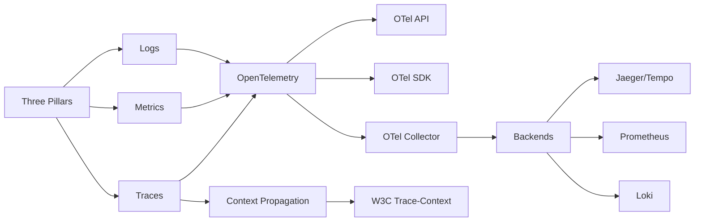
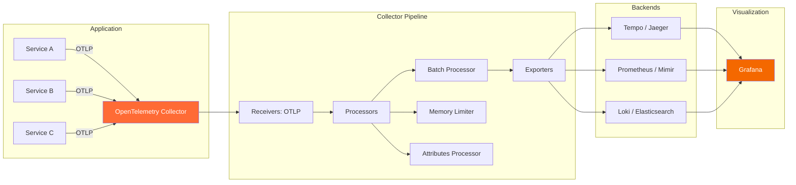
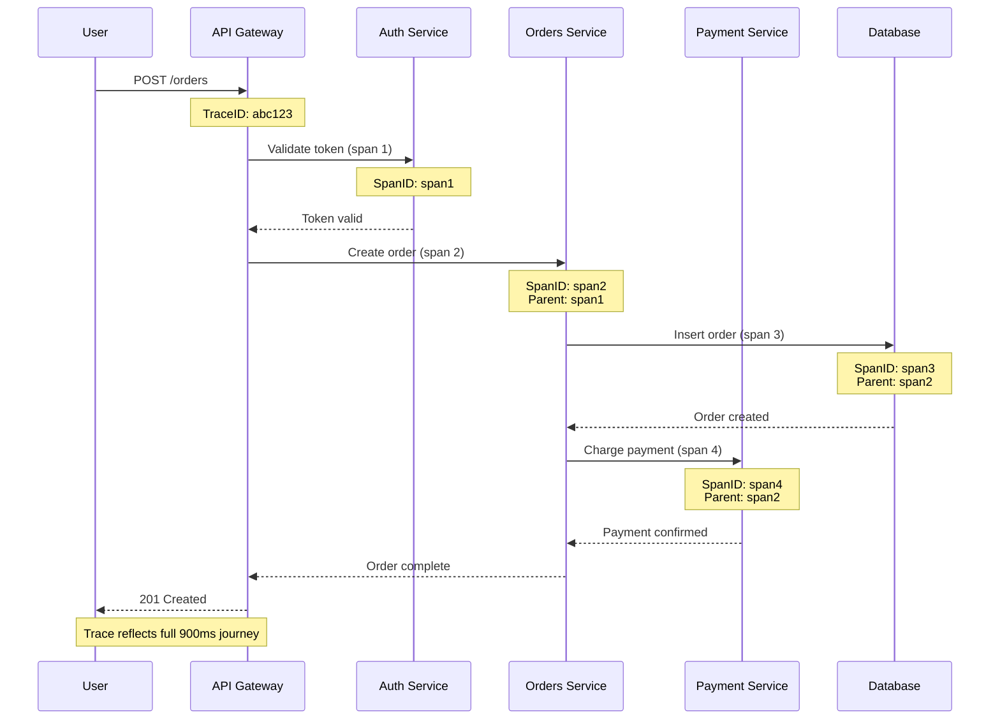

# Chapter 13: Observability

> **Previous:** [Monitoring and Logging](./12-monitoring-logging.md) | **Next:** [DevSecOps](./14-devsecops.md)

## Learning Objectives

By the end of this chapter, students will be able to:

<!-- Image Gallery -->
<section class="lesson-visuals" aria-label="Visual learning resources">
  <header><span>VISUAL LEARNING</span><h2>See it. Review it. Remember it.</h2></header>
  <a class="lesson-visual-card" href="../../../assets/images/lessons/devops/13-observability/handwritten-notes.svg" target="_blank" rel="noopener">
    
    <span><strong>Handwritten notes</strong>Condensed notes for deliberate review.</span>
  </a>
  <a class="lesson-visual-card" href="../../../assets/images/lessons/devops/13-observability/sticky-notes.svg" target="_blank" rel="noopener">
    
    <span><strong>Sticky-note revision</strong>Fast recall prompts for revision.</span>
  </a>
  <a class="lesson-visual-card" href="../../../assets/images/lessons/devops/13-observability/visual-explanation.svg" target="_blank" rel="noopener">
    
    <span><strong>Visual concept guide</strong>A connected explanation of the key ideas.</span>
  </a>
</section>
<!-- End Image Gallery -->


1. Explain the three pillars of observability: logs, metrics, and traces
2. Deploy OpenTelemetry instrumentation for traces, metrics, and logs
3. Configure distributed tracing with Jaeger, Zipkin, or Grafana Tempo
4. Apply RED metrics and the USE method for service monitoring
5. Define and use SLOs with error budgets for reliability management
6. Analyze observability running costs and optimize instrumentation
7. Implement context propagation for end-to-end request tracking

## Chapter at a Glance

| Topic | Key Insight | Practical Takeaway |
|-------|-------------|-------------------|
| Three Pillars | Logs, Metrics, Traces provide complementary views | All three needed for full system understanding |
| OpenTelemetry | Industry standard for instrumentation | Use OTel Collector for vendor-agnostic processing |
| Distributed Tracing | End-to-end request flow across services | Jaeger, Zipkin, and Tempo are common backends |
| RED Method | Rate, Errors, Duration for service monitoring | Every service should have RED metrics |
| USE Method | Utilization, Saturation, Errors for resources | Apply to every system resource (CPU, memory, disk) |
| SLOs & Error Budgets | Quantify reliability and gate releases | Burn-rate alerts prevent budget exhaustion |
| Context Propagation | W3C Trace-Context for distributed correlation | Automatic trace parent-child relationships |

## Chapter Roadmap



## Theory

### 13.1 The Three Pillars of Observability


Observability is the ability to understand a system's internal state by examining its outputs. The three pillars provide complementary views:

**Logs** — Discrete, timestamped records of events. Provide detailed context for specific occurrences. High cardinality but high storage cost. Best for debugging specific errors and tracing request lifecycles.

**Metrics** — Numeric aggregations over time. Provide system health at a glance. Low cardinality, efficient storage. Best for alerting, dashboards, and trend analysis.

**Traces** — End-to-end request flow across distributed services. Show causality and timing. Best for understanding latency bottlenecks and service dependencies.

The pillars are interconnected. A metric alert leads to a dashboard, which reveals a trace with a slow span, which links to error logs containing the root cause. Modern observability platforms correlate these signals automatically.

### 13.2 OpenTelemetry


OpenTelemetry (OTel) is the industry standard for observability instrumentation. It provides APIs, SDKs, and collectors for generating, collecting, and exporting telemetry data.

**Core Components:**

- **API** — Standard interfaces for creating traces, metrics, and logs. Language-specific (TypeScript, Java, Python, Go, etc.).
- **SDK** — Language-specific implementations with configuration, batching, sampling, and exporting. Pluggable processors and exporters.
- **Collector** — Vendor-agnostic telemetry processing pipeline. Receives telemetry in OTLP format, processes (filter, transform, sample), and exports to one or more backends.
- **Instrumentation Libraries** — Automatic instrumentation for popular frameworks: Express, gRPC, database clients (PostgreSQL, MySQL, MongoDB), message queues (Kafka, RabbitMQ), HTTP clients, and more.
- **Exporter** — Sends data to backends (Jaeger, Prometheus, Datadog, New Relic, AWS X-Ray, Azure Monitor).

**Context Propagation:**
OpenTelemetry propagates trace context across service boundaries via W3C Trace-Context headers:

```
traceparent: 00-0af7651916cd43dd8448eb211c80319c-b7ad6b7169203331-01
```

This header is automatically injected into outgoing HTTP requests and extracted from incoming requests by OTel instrumentation libraries, enabling distributed trace reconstruction across service boundaries.

### 13.3 Distributed Tracing


Distributed tracing tracks a single request as it traverses multiple services.

**Core Concepts:**
- **Trace** — The full path of a request through the system. Identified by a Trace ID. A trace is a tree of spans.
- **Span** — A single unit of work within a trace. Has a start time, duration, status (OK/ERROR), and attributes (key-value metadata). A span represents one operation in one service.
- **Span Context** — Trace ID, Span ID, and propagation metadata (W3C Trace-Context).
- **Parent-Child Relationship** — Spans form a tree structure. The root span represents the initial request entry point. Child spans represent downstream operations.

**Instrumentation Example:**

```typescript
import { trace, SpanStatusCode } from '@opentelemetry/api';

const tracer = trace.getTracer('payment-service');

async function processPayment(paymentId: string, amount: number) {
  const span = tracer.startSpan('process-payment', {
    attributes: {
      'payment.id': paymentId,
      'payment.amount': amount,
      'payment.currency': 'USD',
    },
  });

  try {
    const result = await paymentGateway.authorize(paymentId, amount);
    span.setAttribute('payment.auth_code', result.authCode);
    span.addEvent('payment.authorized', { authCode: result.authCode });
    return result;
  } catch (error) {
    span.recordException(error);
    span.setStatus({ code: SpanStatusCode.ERROR, message: String(error) });
    throw error;
  } finally {
    span.end();
  }
}
```

**Tracing Backends:**

| Backend | Storage | Search | Query | Cost Profile |
|---------|---------|--------|-------|--------------|
| Jaeger | Elasticsearch, Cassandra, Badger | Trace ID, service, operation, tags | UI, gRPC API | Index-based |
| Zipkin | Cassandra, Elasticsearch, MySQL | Trace ID, service, annotations | UI, JSON API | Columnar |
| Grafana Tempo | Object store (S3, GCS) | Time range + service + operation | TraceQL | Cheap at scale (no content indexing) |

**Sampling Strategies:**
- **Head-based sampling** — Decision made at the root span. Simple but cannot prioritize by interestingness.
- **Tail-based sampling** — Decision made after the trace is complete. Can keep traces with errors or high latency. More complex and resource-intensive.

### 13.4 Service Maps and Dependency Analysis


Observability platforms generate service maps that visualize inter-service communication:

- Node size indicates request volume or resource consumption
- Edge thickness indicates traffic volume between services
- Edge color indicates latency or error rate (green = healthy, red = failing)
- Failed connections are highlighted for immediate attention

Service maps reveal unknown dependencies, single points of failure, unexpected traffic patterns, and orphan services that no longer serve traffic.

### 13.5 RED Metrics and the USE Method


**RED Method** (Rate, Errors, Duration) — For service-level monitoring:
- **Rate** — Requests per second. Indicates traffic patterns and load.
- **Errors** — Failed requests per second (explicit 5xx, implicit failures like wrong results or slow responses).
- **Duration** — Latency distributions (average, p50, p90, p95, p99). Distinguish between successful and failed request latency.

RED applies to each service in the architecture. Every service should have RED metrics instrumented and dashboarded.

**USE Method** (Utilization, Saturation, Errors) — For resource-level monitoring:
- **Utilization** — Percentage of resource being used (CPU %, memory %, disk space %, network bandwidth %)
- **Saturation** — Degree of resource contention (CPU run queue length, disk I/O queue depth, memory swap usage)
- **Errors** — Error counts or rates (disk I/O errors, network interface errors/drops, memory allocation failures)

USE applies to every resource in the system: CPU, memory, disk, network, and system limits (file descriptors, connection pools, thread pools).

### 13.6 SLOs and Error Budgets


**Service Level Objective (SLO)** — Target level of reliability for a service. Example: 99.9% availability over a 30-day rolling window.

**Service Level Indicator (SLI)** — The actual measurement of reliability. Example: fraction of HTTP requests that complete successfully in under 500ms.

**Service Level Agreement (SLA)** — Contractual commitment to a customer. SLAs must be less stringent than internal SLOs.

**Error Budget** — The allowed amount of unreliability. For a 99.9% SLO over 30 days:

```
Error Budget = (1 - SLO) × Time Window
             = 0.001 × (30 × 24 × 60 × 60)
             = 2,592 seconds ˜ 43 minutes
```

**Error Budget Mechanics:**
- Budget is consumed by events that violate the SLO
- Budget replenishes as the measurement window rolls past violations
- If budget is exhausted, releases are halted until it recovers
- Burn-rate alerts notify when budget consumption exceeds expected rates

**Burn-rate alert example:**
```yaml
# Multi-window burn-rate alert: 2% of 30-day budget consumed in 1 hour
groups:
  - name: slo-alerts
    rules:
      - alert: ErrorBudgetBurn
        expr: |
          (1 - (sum(rate(http_requests_total{status=~"5.."}[1h]))
                / sum(rate(http_requests_total[1h]))))
          < 0.99
        for: 1h
        labels:
          severity: critical
```

### 13.7 Observability Cost Optimization


Observability infrastructure can become a significant cost driver. Optimization strategies:

- **Sampling** — Head-based or tail-based trace sampling. Start with 10% sampling for high-volume services.
- **Retention Tiers** — Raw data at short retention (7 days), aggregated data longer (90 days), summaries for archive (1 year+).
- **Aggregation** — Precompute and store aggregations rather than raw data. Recording rules reduce Prometheus query costs.
- **Cardinality Control** — Limit label cardinality to prevent metric explosion. A label with 10000 unique values creates 10000 time series. Monitor cardinality with `prometheus_tsdb_head_series`.
- **Log Levels** — Store INFO+ in production; DEBUG rotated quickly (24-48 hours).
- **Log Content** — Avoid logging large payloads or sensitive data. Use sampling for high-volume debug logs.
- **Efficient Exporters** — Batch telemetry before export. Configure appropriate batch size and export interval.

---

## Examples

### Example 1: OpenTelemetry Instrumentation

```typescript
import { NodeSDK } from '@opentelemetry/sdk-node';
import { ConsoleSpanExporter } from '@opentelemetry/sdk-trace-node';
import { PeriodicExportingMetricReader } from '@opentelemetry/sdk-metrics';
import { OTLPTraceExporter } from '@opentelemetry/exporter-trace-otlp-proto';
import { OTLPMetricExporter } from '@opentelemetry/exporter-metrics-otlp-proto';
import { HttpInstrumentation } from '@opentelemetry/instrumentation-http';
import { ExpressInstrumentation } from '@opentelemetry/instrumentation-express';
import { PinoInstrumentation } from '@opentelemetry/instrumentation-pino';
import { diag, DiagConsoleLogger, DiagLogLevel } from '@opentelemetry/api';

diag.setLogger(new DiagConsoleLogger(), DiagLogLevel.INFO);

const sdk = new NodeSDK({
  serviceName: 'payment-service',
  traceExporter: new OTLPTraceExporter({ url: 'http://otel-collector:4318/v1/traces' }),
  metricReader: new PeriodicExportingMetricReader({
    exporter: new OTLPMetricExporter({ url: 'http://otel-collector:4318/v1/metrics' }),
    exportIntervalMillis: 10000,
  }),
  instrumentations: [
    new HttpInstrumentation(),
    new ExpressInstrumentation(),
    new PinoInstrumentation(),
  ],
});

sdk.start();

process.on('SIGTERM', () => {
  sdk.shutdown().then(() => process.exit(0));
});
```

### Example 2: Trace Context Propagation Simulation

```typescript
interface Span {
  traceId: string;
  spanId: string;
  parentSpanId?: string;
  operationName: string;
  startTime: number;
  endTime?: number;
  attributes: Record<string, string>;
  status: 'OK' | 'ERROR';
}

interface Trace {
  traceId: string;
  spans: Span[];
  rootService: string;
}

class TraceSimulator {
  private traces: Trace[] = [];

  generateTrace(services: string[], baseDuration: number): Trace {
    const traceId = crypto.randomUUID().replace(/-/g, '').substring(0, 16);
    const spans: Span[] = [];
    const startTime = Date.now();
    let currentParentId = '';

    for (let i = 0; i < services.length; i++) {
      const spanId = crypto.randomUUID().replace(/-/g, '').substring(0, 16);
      const duration = baseDuration * (1 + Math.random());

      const span: Span = {
        traceId,
        spanId,
        parentSpanId: i === 0 ? undefined : currentParentId,
        operationName: `${services[i]}.process`,
        startTime: startTime + spans.reduce((sum, s) => sum + (s.endTime || 0) - s.startTime, 0),
        endTime: startTime + i * baseDuration + duration,
        attributes: {
          'service.name': services[i],
          'http.method': 'POST',
        },
        status: Math.random() > 0.1 ? 'OK' : 'ERROR',
      };

      currentParentId = spanId;
      spans.push(span);
    }

    const trace: Trace = { traceId, spans, rootService: services[0] };
    this.traces.push(trace);
    return trace;
  }

  findSlowTraces(threshold: number): Trace[] {
    return this.traces.filter(t => {
      const totalDuration = Math.max(...t.spans.map(s => s.endTime || 0)) - Math.min(...t.spans.map(s => s.startTime));
      return totalDuration > threshold;
    });
  }

  findErrorTraces(): Trace[] {
    return this.traces.filter(t => t.spans.some(s => s.status === 'ERROR'));
  }

  buildServiceGraph(): Record<string, string[]> {
    const graph: Record<string, string[]> = {};

    for (const trace of this.traces) {
      for (let i = 0; i < trace.spans.length; i++) {
        const service = trace.spans[i].attributes['service.name'];
        if (!graph[service]) graph[service] = [];
        if (i + 1 < trace.spans.length) {
          const next = trace.spans[i + 1].attributes['service.name'];
          if (!graph[service].includes(next)) graph[service].push(next);
        }
      }
    }

    return graph;
  }

  generateReport(): string {
    let report = '# Trace Analysis Report\n\n';
    report += `Total traces: ${this.traces.length}\n`;
    report += `Error traces: ${this.findErrorTraces().length}\n`;
    report += `Slow traces (>500ms): ${this.findSlowTraces(500).length}\n\n`;

    report += '## Dependency Graph\n';
    const graph = this.buildServiceGraph();
    for (const [service, deps] of Object.entries(graph)) {
      report += `- ${service} ? ${deps.join(', ') || '(leaf)'}\n`;
    }

    return report;
  }
}

const simulator = new TraceSimulator();
simulator.generateTrace(['frontend', 'api-gateway', 'user-service', 'database'], 100);
simulator.generateTrace(['frontend', 'api-gateway', 'payment-service', 'bank-api'], 200);
simulator.generateTrace(['frontend', 'api-gateway', 'notification-service'], 50);

console.log(simulator.generateReport());
```

### Example 3: SLO Compliance Dashboard Generator

```typescript
interface SLODefinition {
  name: string;
  target: number; // 99.9
  windowDays: number;
  sliQuery: string;
  goodEventsQuery: string;
  validEventsQuery: string;
}

interface SLOStatus {
  name: string;
  target: number;
  compliance: number;
  budgetRemaining: number;
  budgetTotal: number;
  status: 'healthy' | 'warning' | 'critical' | 'exhausted';
}

class SLOCalculator {
  calculate(slo: SLODefinition, goodEvents: number, validEvents: number): SLOStatus {
    const compliance = validEvents > 0 ? (goodEvents / validEvents) * 100 : 100;
    const totalSeconds = slo.windowDays * 24 * 60 * 60;
    const budgetTotal = totalSeconds * (1 - slo.target / 100);
    const consumed = totalSeconds * (1 - compliance / 100);
    const budgetRemaining = budgetTotal - consumed;
    const remainingPercent = (budgetRemaining / budgetTotal) * 100;

    let status: SLOStatus['status'] = 'healthy';
    if (compliance < slo.target) status = 'exhausted';
    else if (remainingPercent < 10) status = 'critical';
    else if (remainingPercent < 30) status = 'warning';

    return {
      name: slo.name,
      target: slo.target,
      compliance: Math.round(compliance * 1000) / 1000,
      budgetRemaining: Math.round(budgetRemaining),
      budgetTotal: Math.round(budgetTotal),
      status,
    };
  }

  generateDashboard(slos: SLODefinition[], goodEvents: number[], validEvents: number[]): string {
    let report = '# SLO Compliance Dashboard\n\n';
    report += '| SLO | Target | Current | Budget Remaining | Status |\n';
    report += '|-----|--------|---------|-----------------|--------|\n';

    for (let i = 0; i < slos.length; i++) {
      const status = this.calculate(slos[i], goodEvents[i], validEvents[i]);
      const icon = status.status === 'healthy' ? '?' : status.status === 'exhausted' ? '??' : '??';
      report += `| ${status.name} | ${status.target}% | ${status.compliance}% | ${status.budgetRemaining}s / ${status.budgetTotal}s | ${icon} ${status.status} |\n`;
    }

    return report;
  }
}

const calculator = new SLOCalculator();
const slos: SLODefinition[] = [
  { name: 'api-availability', target: 99.9, windowDays: 30, sliQuery: '', goodEventsQuery: '', validEventsQuery: '' },
  { name: 'api-latency', target: 99.5, windowDays: 30, sliQuery: '', goodEventsQuery: '', validEventsQuery: '' },
  { name: 'payment-success', target: 99.99, windowDays: 30, sliQuery: '', goodEventsQuery: '', validEventsQuery: '' },
];

console.log(calculator.generateDashboard(slos, [999000, 994000, 999800], [1000000, 1000000, 1000000]));
```

---

## Concept Comparison Table

| Concept | Description |
|---------|-------------|
| Logs | Discrete timestamped events, high cardinality |
| Metrics | Numeric aggregations, efficient storage |
| Traces | End-to-end request flow with causality |
| OpenTelemetry | Standard API/SDK/Collector for telemetry |
| Jaeger/Tempo | Distributed tracing backends |
| SLO | Target reliability level for a service |
| Error Budget | Allowed unreliability = (1 - SLO) × window |

## Quick Reference

| Topic | Key Points |
|-------|------------|
| Three Pillars | Logs, Metrics, Traces |
| RED Method | Rate, Errors, Duration for services |
| USE Method | Utilization, Saturation, Errors for resources |
| OpenTelemetry | API, SDK, Collector, Exporters |
| SLO | target=99.9, window=30d, burn-rate alerts |
| Context Propagation | W3C Trace-Context, traceparent header |
| Sampling | Head-based (simple), Tail-based (accurate) |

## Cross-Application Matrix

| Domain | Application |
|--------|-------------|
| Web | Full-stack request tracing |
| Cloud | Multi-service observability |
| Enterprise | Compliance-focused monitoring |
| Microservices | Distributed tracing for service mesh |

### Trace Analyzer

Distributed tracing is essential for understanding request flows across microservices. The following analyzer processes trace spans, detects anomalies, and visualizes service interactions.

```typescript
interface Span {
  traceId: string;
  spanId: string;
  parentSpanId: string | null;
  serviceName: string;
  operation: string;
  startTime: number;
  endTime: number;
  tags: Record<string, string>;
  status: 'ok' | 'error';
}

interface Trace {
  traceId: string;
  spans: Span[];
  rootService: string;
  totalDuration: number;
  errorSpans: number;
}

class TraceAnalyzer {
  buildTrace(spans: Span[]): Trace | null {
    if (spans.length === 0) return null;
    const root = spans.find(s => !s.parentSpanId);
    if (!root) return null;
    const traceId = root.traceId;
    const totalDuration = Math.max(...spans.map(s => s.endTime)) - Math.min(...spans.map(s => s.startTime));
    const errorSpans = spans.filter(s => s.status === 'error').length;
    return { traceId, spans, rootService: root.serviceName, totalDuration, errorSpans };
  }

  findSlowPaths(trace: Trace, thresholdMs: number): Span[] {
    return trace.spans.filter(s => (s.endTime - s.startTime) > thresholdMs);
  }

  detectAnomalies(traces: Trace[]): string[] {
    const anomalies: string[] = [];
    const durations = traces.map(t => t.totalDuration);
    const avg = durations.reduce((s, d) => s + d, 0) / durations.length;
    const stdDev = Math.sqrt(durations.reduce((s, d) => s + (d - avg) ** 2, 0) / durations.length);

    for (const trace of traces) {
      if (trace.totalDuration > avg + 3 * stdDev) {
        anomalies.push(`Trace ${trace.traceId.substring(0, 8)}: ${(trace.totalDuration).toFixed(0)}ms exceeds 3s threshold (${(avg + 3 * stdDev).toFixed(0)}ms)`);
      }
      if (trace.errorSpans > 0) anomalies.push(`Trace ${trace.traceId.substring(0, 8)}: ${trace.errorSpans} error spans`);
    }
    return anomalies;
  }

  buildServiceGraph(traces: Trace[]): Map<string, string[]> {
    const graph = new Map<string, Set<string>>();
    for (const trace of traces) {
      for (const span of trace.spans) {
        if (!graph.has(span.serviceName)) graph.set(span.serviceName, new Set());
        const parent = trace.spans.find(s => s.spanId === span.parentSpanId);
        if (parent && parent.serviceName !== span.serviceName) graph.get(parent.serviceName)!.add(span.serviceName);
      }
    }
    return new Map([...graph.entries()].map(([k, v]) => [k, [...v]]));
  }
}

const analyzer = new TraceAnalyzer();
const spans: Span[] = [
  { traceId: 'abc123', spanId: 's1', parentSpanId: null, serviceName: 'api-gateway', operation: 'GET /users', startTime: 1000, endTime: 2500, tags: {}, status: 'ok' },
  { traceId: 'abc123', spanId: 's2', parentSpanId: 's1', serviceName: 'user-service', operation: 'getUser', startTime: 1200, endTime: 2200, tags: {}, status: 'ok' },
  { traceId: 'abc123', spanId: 's3', parentSpanId: 's2', serviceName: 'database', operation: 'SELECT', startTime: 1300, endTime: 2100, tags: {}, status: 'error' },
];
const trace = analyzer.buildTrace(spans);
if (trace) {
  console.log(`Root: ${trace.rootService}, Duration: ${trace.totalDuration}ms, Errors: ${trace.errorSpans}`);
  console.log('Slow paths:', analyzer.findSlowPaths(trace, 300).map(s => s.operation));
  console.log('Service graph:', JSON.stringify([...analyzer.buildServiceGraph([trace])]));
}
```

**What this demonstrates:** Trace analysis enables root cause identification by correlating spans across services, detecting performance anomalies, and mapping service dependencies.

---

## Chapter Quiz

<details><summary>Question 1: What are the three pillars of observability?</summary>**A)** Build, Test, Deploy<br>**B)** Logs, Metrics, Traces<br>**C)** CPU, Memory, Disk<br>**D)** Dev, Staging, Prod<br><br>**Answer: B)** Logs, Metrics, Traces&lt;/details&gt;

<details><summary>Question 2: What does RED stand for?</summary>**A)** Resource, Error, Debug<br>**B)** Rate, Errors, Duration<br>**C)** Reliable, Efficient, Durable<br>**D)** Request, Execute, Deliver<br><br>**Answer: B)** Rate, Errors, Duration&lt;/details&gt;

<details><summary>Question 3: What happens when error budget is exhausted?</summary>**A)** System shuts down<br>**B)** Releases are halted until budget recovers<br>**C)** SLA penalties apply automatically<br>**D)** Monitoring is disabled<br><br>**Answer: B)** Releases are halted until budget recovers&lt;/details&gt;

<details><summary>Question 4: What protocol does OpenTelemetry use for context propagation?</summary>**A)** HTTP headers<br>**B)** W3C Trace-Context<br>**C)** gRPC metadata<br>**D)** Custom headers<br><br>**Answer: B)** W3C Trace-Context&lt;/details&gt;

<details><summary>Question 5: What is the difference between head-based and tail-based sampling?</summary>**A)** Head-based samples at root span; tail-based after trace completes<br>**B)** Head-based is faster but less selective<br>**C)** Tail-based keeps interesting traces (errors, high latency)<br>**D)** All of the above<br><br>**Answer: D)** All of the above&lt;/details&gt;

---

## TypeScript: OpenTelemetry Instrumentation Setup

Below is a TypeScript example that configures OpenTelemetry for a microservice with traces, metrics, and logs:

```typescript
// instrumentation.ts
// Configure OpenTelemetry for a Node.js/TypeScript microservice

import { NodeSDK } from '@opentelemetry/sdk-node';
import { OTLPTraceExporter } from '@opentelemetry/exporter-trace-otlp-http';
import { OTLPMetricExporter } from '@opentelemetry/exporter-metrics-otlp-http';
import { OTLPLogExporter } from '@opentelemetry/exporter-logs-otlp-http';
import { HttpInstrumentation } from '@opentelemetry/instrumentation-http';
import { ExpressInstrumentation } from '@opentelemetry/instrumentation-express';

interface ObservabilityConfig {
  serviceName: string;
  serviceVersion: string;
  environment: string;
  otlpEndpoint: string;
  samplingRatio: number;
  enableMetrics: boolean;
  enableTracing: boolean;
  enableLogging: boolean;
}

class ObservabilitySetup {
  private sdk: NodeSDK | null = null;

  initialize(config: ObservabilityConfig): void {
    const exporters = [];

    if (config.enableTracing) {
      exporters.push(new OTLPTraceExporter({
        url: `${config.otlpEndpoint}/v1/traces`,
      }));
    }

    if (config.enableMetrics) {
      exporters.push(new OTLPMetricExporter({
        url: `${config.otlpEndpoint}/v1/metrics`,
      }));
    }

    if (config.enableLogging) {
      exporters.push(new OTLPLogExporter({
        url: `${config.otlpEndpoint}/v1/logs`,
      }));
    }

    this.sdk = new NodeSDK({
      serviceName: config.serviceName,
      instrumentations: [
        new HttpInstrumentation(),
        new ExpressInstrumentation(),
      ],
      traceExporter: exporters[0],
      metricExporter: exporters[1],
      logExporter: exporters[2],
      sampler: {
        shouldSample: () => ({ decision: Math.random() < config.samplingRatio ? 1 : 0 }),
        toString: () => `ProbabilitySampler_${config.samplingRatio}`,
      },
    });

    this.sdk.start();
    console.log(`OpenTelemetry initialized for ${config.serviceName} (env: ${config.environment})`);
  }

  async shutdown(): Promise<void> {
    await this.sdk?.shutdown();
  }
}

// Example usage
const telemetry = new ObservabilitySetup();
telemetry.initialize({
  serviceName: 'payment-api',
  serviceVersion: '2.1.0',
  environment: 'production',
  otlpEndpoint: 'http://otel-collector:4318',
  samplingRatio: 0.1, // 10% trace sampling
  enableMetrics: true,
  enableTracing: true,
  enableLogging: true,
});
```

## Mermaid: OpenTelemetry Collector Pipeline



## Mermaid: Distributed Tracing Flow



## Deeper Explanation: Trace Sampling Strategies

**When to use each sampling strategy:**

| Strategy | Approach | Best For | Cost |
|----------|----------|----------|------|
| Head-based | Decide at root span | General observability, dashboards | Low |
| Tail-based | Decide after trace completes | Error analysis, debugging | Medium |
| Probabilistic | Random % of traces | High-volume services | Lowest |
| Rate-limited | Max spans/second | Cost control with burst protection | Low |
| Health-based | Always sample errors + slow | SRE, reliability monitoring | Medium |

**Adaptive sampling configuration:**

```typescript
interface SamplingConfig {
  defaultRatio: number;
  errorSampleRatio: number; // always sample errors
  slowTraceThresholdMs: number;
  slowTraceRatio: number;
  maxSpansPerSecond: number;
}

const samplerConfig: SamplingConfig = {
  defaultRatio: 0.05,     // 5% of all traces
  errorSampleRatio: 1.0,  // 100% of error traces
  slowTraceThresholdMs: 1000,
  slowTraceRatio: 0.5,    // 50% of slow traces
  maxSpansPerSecond: 100,
};
```


// observability
// cicd-infrastructure-automation implementation

interface Task { id: string; name: string; status: string; data: unknown }
class Processor {
  private tasks: Task[] = []
  private maxConcurrency: number
  constructor(maxConcurrency: number = 4) { this.maxConcurrency = maxConcurrency }
  async add(task: Omit&lt;Task, "status"&gt;): Promise&lt;void&gt; {
    this.tasks.push({ ...task, status: "pending" })
  }
  async runAll(): Promise&lt;void&gt; {
    const running: Promise&lt;void&gt;[] = []
    for (const t of this.tasks) {
      if (running.length >= this.maxConcurrency) { await Promise.race(running) }
      const p = this.execute(t).finally(() => { const i = running.indexOf(p); if (i >= 0) running.splice(i, 1) })
      running.push(p)
    }
    await Promise.all(running)
  }
  private async execute(t: Task): Promise&lt;void&gt; {
    t.status = "running"
    await new Promise(r => setTimeout(r, 10))
    t.status = "done"
  }
  getResults(): Task[] { return this.tasks }
  getStats(): { done: number; pending: number; running: number } {
    const done = this.tasks.filter(t => t.status === "done").length
    const pending = this.tasks.filter(t => t.status === "pending").length
    const running = this.tasks.filter(t => t.status === "running").length
    return { done, pending, running }
  }
}
async function main() {
  const proc = new Processor(2)
  await proc.add({ id: '1', name: 'observability', data: { topic: 'cicd-infrastructure-automation' } })
  await proc.runAll()
  console.log('Stats:', proc.getStats())
}
main().catch(console.error)
export { Processor, Task }
## Summary

Observability enables understanding complex distributed systems. The three pillars (logs, metrics, traces) provide complementary perspectives. OpenTelemetry standardizes instrumentation across languages and backends with API, SDK, and Collector components. Distributed tracing reveals request flows across service boundaries with parent-child span relationships and W3C context propagation. RED metrics (Rate, Errors, Duration) and the USE method (Utilization, Saturation, Errors) provide structured monitoring approaches for services and resources respectively. SLOs and error budgets quantify reliability, gate release decisions, and inform operational priorities. Cost optimization through sampling, aggregation, retention management, and cardinality control prevents observability costs from growing unbounded.

---

## Exercises

### Review Questions

1. How does a trace differ from a log? What information does each provide that the other cannot?
2. What is the role of the OpenTelemetry Collector in the observability pipeline?
3. Explain the RED method. For what type of component is it designed?
4. How does an error budget gate release velocity? What happens when the budget is exhausted?
5. What factors contribute most to observability infrastructure costs? How can each be optimized?

### Application Problems

1. Instrument a simple microservice application (two services communicating via HTTP) with OpenTelemetry. Generate a trace that spans both services. Export to Jaeger or Tempo. Visualize the trace showing parent-child span relationships.
2. Implement RED metrics for a REST API service. Instrument request counters, error counters, and latency histograms. Create a Grafana dashboard showing rate, error rate, and latency distributions (p50, p95, p99).
3. Define SLOs for an API service: latency SLO (95% of requests under 300ms) and availability SLO (99.9%). Calculate the error budgets. Implement an SLO burn-rate alert that fires when error budget is consumed too quickly.
4. Configure the OpenTelemetry Collector pipeline from the TypeScript example. Set up batch processing, memory limiting, and attribute enrichment. Export traces to Tempo, metrics to Prometheus, and logs to Loki.
5. Implement custom span attributes and events in a sample application. Add business context (user ID, order ID) as span attributes and record meaningful events (cache hit/miss, retry attempt) as span events.
6. Calculate the cost of running observability for a 20-service microservice architecture generating 500 spans/sec per service. Compare head-based sampling at 10% vs tail-based sampling that keeps all error and slow traces. Assume storage costs of $0.02/GB for traces and $0.01/GB for logs.

### Challenge Problem

Design a comprehensive observability strategy for a 50-microservice platform processing 10,000 requests per second. The system uses Kubernetes, Kafka for messaging, PostgreSQL, Redis, and communicates via HTTP and gRPC. Define: OpenTelemetry instrumentation approach (manual vs auto, trace sampling strategy), backend selection (Tempo vs Jaeger, Prometheus vs Mimir, Loki vs Elasticsearch), retention policies per data type, SLO framework (which services, what targets, burn-rate alerting), cost budget allocation (5% of total infrastructure cost), and dashboard hierarchy. Justify trade-offs between completeness and cost.
