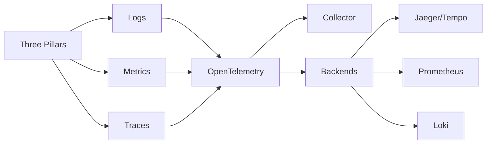

# Chapter 13: Observability

> **Previous:** [Monitoring and Logging](./12-monitoring-logging.md) | **Next:** [DevSecOps](./14-devsecops.md)

## Learning Objectives


By the end of this chapter, students will be able to:

1. Explain the three pillars of observability: logs, metrics, and traces
2. Deploy OpenTelemetry instrumentation for traces, metrics, and logs
3. Configure distributed tracing with Jaeger, Zipkin, or Grafana Tempo
4. Apply RED metrics and the USE method for service monitoring
5. Define and use SLOs with error budgets for reliability management
6. Analyze observability running costs and optimize instrumentation


## Chapter at a Glance

| Topic | Key Insight | Practical Takeaway |
|-------|-------------|-------------------|
| Three Pillars | Logs, Metrics, Traces provide complementary views | All three needed for full system understanding |
| OpenTelemetry | Industry standard for instrumentation | Use OTel Collector for vendor-agnostic processing |
| Distributed Tracing | End-to-end request flow across services | Jaeger, Zipkin, and Tempo are common backends |
| RED Method | Rate, Errors, Duration for service monitoring | Every service should have RED metrics |
| USE Method | Utilization, Saturation, Errors for resources | Apply to every system resource (CPU, memory, disk) |
| SLOs & Error Budgets | Quantify reliability and gate releases | Burn-rate alerts prevent budget exhaustion |

## Chapter Roadmap



## Theory

### 13.1 The Three Pillars of Observability

> **Pro Tip:** Use tail-based sampling to keep the most interesting traces (high latency, errors) while reducing storage costs.

Observability is the ability to understand a system's internal state by examining its outputs. The three pillars provide complementary views:

**Logs** — Discrete, timestamped records of events. Provide detailed context for specific occurrences. High cardinality but high storage cost. Best for debugging specific errors and tracing request lifecycles.

**Metrics** — Numeric aggregations over time. Provide system health at a glance. Low cardinality, efficient storage. Best for alerting, dashboards, and trend analysis.

**Traces** — End-to-end request flow across distributed services. Show causality and timing. Best for understanding latency bottlenecks and service dependencies.

The pillars are interconnected. A metric alert leads to a dashboard, which reveals a trace with a slow span, which links to error logs. Modern observability platforms correlate these signals automatically.

### 13.2 OpenTelemetry

> **Remember:** RED for services (Rate, Errors, Duration); USE for resources (Utilization, Saturation, Errors).

OpenTelemetry (OTel) is the industry standard for observability instrumentation. It provides APIs, SDKs, and collectors for generating, collecting, and exporting telemetry data.

**Components**:
- **API** — Standard interfaces for creating traces, metrics, and logs
- **SDK** — Language-specific implementations with configuration, batching, and exporting
- **Collector** — Vendor-agnostic telemetry processing pipeline. Receives, processes, and exports data.
- **Instrumentation Libraries** — Automatic instrumentation for popular frameworks (HTTP servers, gRPC, database clients, message queues)
- **Exporter** — Sends data to backends (Jaeger, Prometheus, Datadog, New Relic)

**Context Propagation** — OTel propagates trace context across service boundaries via W3C Trace-Context headers:

```text
traceparent: 00-0af7651916cd43dd8448eb211c80319c-b7ad6b7169203331-01
```

This enables distributed trace reconstruction across services.

### 13.3 Distributed Tracing

> **Warning:** Observability infrastructure can become a significant cost driver. Plan sampling and retention strategies.

Distributed tracing tracks a single request as it traverses multiple services.

**Concepts**:
- **Trace** — The full path of a request through the system. Identified by a Trace ID.
- **Span** — A single unit of work within a trace. Has a start time, duration, status, and attributes.
- **Span Context** — Trace ID, Span ID, and propagation metadata.
- **Parent-Child Relationship** — Spans form a tree; the root span represents the initial request.

```python
# Python OpenTelemetry instrumentation example
from opentelemetry import trace
tracer = trace.get_tracer(__name__)

with tracer.start_as_current_span("process_payment") as span:
    span.set_attribute("payment.amount", 4999)
    span.set_attribute("payment.currency", "USD")
    span.add_event("payment.authorized", {"auth_code": "A12345"})
    result = process_payment_gateway()
    if not result.success:
        span.set_status(trace.Status(trace.StatusCode.ERROR))
```

**Backends**:
- **Jaeger** — Open-source distributed tracing platform. Features: UI for trace search and comparison, service dependency graph, sampling strategies. Stores traces in Elasticsearch, Cassandra, or Badger.
- **Zipkin** — Open-source distributed tracing with similar capabilities to Jaeger. Uses columnar storage backends.
- **Grafana Tempo** — Cost-effective tracing backend. Does not index by trace content; queries traces by time range and service/operation labels. Integrates natively with Grafana.

### 13.4 Service Maps and Dependency Analysis

Observability platforms generate service maps that visualize inter-service communication:

- Node size indicates request volume or resource consumption
- Edge thickness indicates traffic volume
- Edge color indicates latency or error rate
- Failed connections are highlighted

Service maps reveal unknown dependencies, single points of failure, and unexpected traffic patterns.

### 13.5 RED Metrics and the USE Method

**RED Method** (Rate, Errors, Duration) — For service-level monitoring:
- **Rate** — Requests per second
- **Errors** — Failed requests per second (explicit 5xx, implicit failures)
- **Duration** — Latency distributions (average, p50, p90, p95, p99)

RED applies to each service in the architecture. Every service should have RED metrics instrumented.

**USE Method** (Utilization, Saturation, Errors) — For resource-level monitoring:
- **Utilization** — Percentage of resource being used (CPU %, memory %, disk space %)
- **Saturation** — Degree of resource contention (queue length, run queue depth)
- **Errors** — Error counts (disk I/O errors, network interface errors)

USE applies to every resource in the system: CPU, memory, disk, network, and system limits.

### 13.6 SLOs and Error Budgets

**Service Level Objective (SLO)** — Target level of reliability for a service. Example: 99.9% availability over a 30-day rolling window.

**Service Level Indicator (SLI)** — The actual measurement of reliability. Example: fraction of HTTP requests that complete successfully in under 500ms.

**Service Level Agreement (SLA)** — Contractual commitment to a customer. SLAs must be less stringent than internal SLOs.

**Error Budget** — The allowed amount of unreliability. For a 99.9% SLO over 30 days, the error budget is 43 minutes of downtime. Error budgets:
- Measure how much unreliability is remaining
- Inform release decisions: if budget is exhausted, stop releasing
- Gate innovation velocity: teams trade reliability for feature velocity

```yaml
# Example SLO configuration
slo:
  name: api-availability
  target: 99.9
  window: 30d
  sli:
    type: latency
    threshold_ms: 500
    valid_events: http_requests_total
    good_events: http_requests_duration_seconds_bucket{le="0.5"}
```

### 13.7 Running Cost Analysis

Observability infrastructure can become a significant cost driver. Optimization strategies:

- **Sampling** — Trace head-based or tail-based sampling to reduce ingestion volume
- **Retention Tiers** — Raw data at short retention (7 days), aggregated data longer (90 days), summaries for archive
- **Aggregation** — Precompute and store aggregations rather than raw data
- **Cardinality Control** — Limit label cardinality in metrics to prevent metric explosion
- **Log Levels** — Store INFO+ in production; DEBUG rotated quickly

## Summary

## Concept Comparison Table

| Concept | Description |
|---------|-------------|
| Logs | Discrete timestamped events, high cardinality |
| Metrics | Numeric aggregations, efficient storage |
| Traces | End-to-end request flow with causality |
| OpenTelemetry | Standard API/SDK/Collector for telemetry |
| Jaeger/Tempo | Distributed tracing backends |

## Quick Reference

| Topic | Key Points |
|-------|------------|
| Three Pillars | Logs, Metrics, Traces |
| RED Method | Rate, Errors, Duration for services |
| USE Method | Utilization, Saturation, Errors for resources |
| OpenTelemetry | API, SDK, Collector, Exporters |
| SLO | target=99.9, window=30d, burn-rate alerts |

## Cross-Application Matrix

| Domain | Application |
|--------|-------------|
| Web | Full-stack request tracing |
| Cloud | Multi-service observability |
| Enterprise | Compliance-focused monitoring |
| Microservices | Distributed tracing for service mesh |

## Chapter Quiz

<details><summary>Question 1: What are the three pillars of observability?</summary>**A)** Build, Test, Deploy<br>**B)** Logs, Metrics, Traces<br>**C)** CPU, Memory, Disk<br>**D)** Dev, Staging, Prod<br><br>**Answer: B)** Logs, Metrics, Traces</details>

<details><summary>Question 2: What does RED stand for?</summary>**A)** Resource, Error, Debug<br>**B)** Rate, Errors, Duration<br>**C)** Reliable, Efficient, Durable<br>**D)** Request, Execute, Deliver<br><br>**Answer: B)** Rate, Errors, Duration</details>

<details><summary>Question 3: What happens when error budget is exhausted?</summary>**A)** System shuts down<br>**B)** Releases are halted until budget recovers<br>**C)** SLA penalties apply automatically<br>**D)** Monitoring is disabled<br><br>**Answer: B)** Releases are halted until budget recovers</details>


## Summary

Observability enables understanding complex distributed systems. The three pillars (logs, metrics, traces) provide complementary perspectives. OpenTelemetry standardizes instrumentation across languages and backends. Distributed tracing reveals request flows across service boundaries. RED metrics and the USE method provide structured monitoring approaches. SLOs and error budgets quantify reliability and inform release decisions. Cost optimization through sampling, aggregation, and retention management prevents observability costs from growing unbounded.

## Exercises

### Review Questions

1. How does a trace differ from a log? What information does each provide that the other cannot?
2. What is the role of the OpenTelemetry Collector in the observability pipeline?
3. Explain the RED method. For what type of component is it designed?
4. How does an error budget gate release velocity? What happens when the budget is exhausted?
5. What factors contribute most to observability infrastructure costs? How can each be optimized?

### Application Problems

1. Instrument a simple microservice application (two services communicating via HTTP) with OpenTelemetry. Generate a trace that spans both services. Export to Jaeger or Tempo. Visualize the trace showing parent-child span relationships.
2. Implement RED metrics for a REST API service. Instrument request counters, error counters, and latency histograms. Create a Grafana dashboard showing rate, error rate, and latency distributions (p50, p95, p99).
3. Define SLOs for the API service: latency SLO (95% of requests under 300ms) and availability SLO (99.9%). Calculate the error budgets. Implement an SLO burn-rate alert that fires when error budget is consumed too quickly.

### Challenge Problem

Design a comprehensive observability strategy for a 50-microservice platform processing 10,000 requests per second. The system uses Kubernetes, Kafka for messaging, PostgreSQL, Redis, and communicates via HTTP and gRPC. Define: OpenTelemetry instrumentation approach (manual vs auto, trace sampling strategy), backend selection (Tempo vs Jaeger, Prometheus vs Mimir, Loki vs Elasticsearch), retention policies per data type, SLO framework (which services, what targets, burn-rate alerting), cost budget allocation, and dashboard hierarchy. The observability budget is 5% of total infrastructure cost. Justify trade-offs between completeness and cost.
