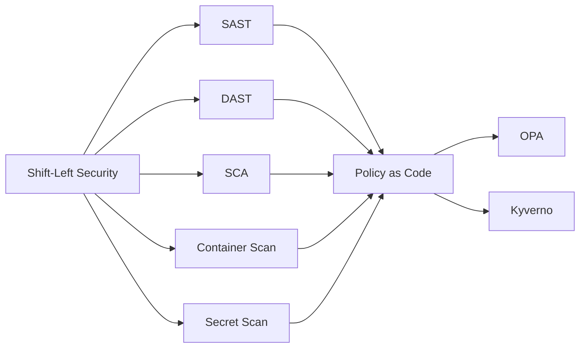

# Chapter 14: DevSecOps

> **Previous:** [Observability](./13-observability.md) | **Next:** [Database DevOps](./15-database-devops.md)

## Learning Objectives


By the end of this chapter, students will be able to:

1. Explain the shift-left security principle and its impact on software development
2. Integrate SAST tools (SonarQube, Semgrep, CodeQL) into CI/CD pipelines
3. Configure DAST scanning using OWASP ZAP and Burp Suite
4. Implement software composition analysis with Snyk, Dependabot, Trivy, and Grype
5. Scan container images for vulnerabilities using Trivy, Clair, and Docker Scout
6. Detect secrets in source code with GitLeaks and TruffleHog
7. Enforce security policies using OPA and Kyverno


## Chapter at a Glance

| Topic | Key Insight | Practical Takeaway |
|-------|-------------|-------------------|
| Shift-Left Security | Integrate security earlier in development | 10-100x cost difference finding vulns in design vs production |
| SAST Tools | Source code analysis without execution | SonarQube, Semgrep, CodeQL for CI/CD integration |
| DAST Tools | Running application attack simulation | OWASP ZAP, Burp Suite for dynamic testing |
| SCA Tools | Open-source dependency vulnerability scanning | Snyk, Dependabot, Trivy, Grype for supply chain |
| Container Scanning | Image vulnerability detection | Scan images before push and in registries |
| Policy as Code | OPA/Kyverno for policy enforcement | Decouple policy from application logic |

## Chapter Roadmap



## Theory

### 14.1 Shift-Left Security

> **Pro Tip:** Run SAST and secret scanning on every push, not just on PRs, to catch issues immediately.

Shift-left security integrates security practices earlier in the software development lifecycle. Traditional security performed a penetration test shortly before release, discovering vulnerabilities that were expensive to fix. Shift-left makes security a continuous concern throughout development.

**Key Benefits**:
- Earlier detection reduces remediation cost (10-100x cost difference between finding a vulnerability in design vs production)
- Developers own security outcomes rather than delegating to security teams
- Security automation scales better than manual review
- Continuous compliance through policy-as-code

### 14.2 SAST (Static Application Security Testing)

> **Warning:** Secrets committed to Git are compromised forever. Use pre-commit hooks with GitLeaks or TruffleHog.

SAST analyzes source code for security vulnerabilities without executing the application.

**SonarQube** — Continuous code quality and security inspection. Analyzes 30+ languages. Reports bugs, vulnerabilities, code smells, and security hotspots. Provides quality gates that fail pipelines.

**Semgrep** — Lightweight static analysis using pattern-based rules. Supports custom rules in a simple syntax. Community rule registry covers OWASP Top 10, CWE Top 25, and framework-specific vulnerabilities.

```yaml
# Semgrep rule: detect hardcoded passwords
rules:
  - id: hardcoded-password
    patterns:
      - pattern: |
          $PASSWORD = "..."
      - metavariable-regex:
          metavariable: $PASSWORD
          regex: (password|passwd|pwd)
    message: "Hardcoded password detected"
    languages: [python, javascript, go]
    severity: ERROR
```

**CodeQL** — Semantic code analysis by GitHub. Treats code as data for query-based security analysis. Deep analysis of CodeQL databases identifies complex vulnerabilities including injection, XSS, and path traversal. Integrated with GitHub Advanced Security.

### 14.3 DAST (Dynamic Application Security Testing)

> **Remember:** Shift-left means finding security issues during development, not during a pre-release pen test.

DAST tests running applications for vulnerabilities by simulating attacks.

**OWASP ZAP** — Open-source web application scanner. Supports automated scanning, passive scanning, active scanning, and API scanning (OpenAPI, GraphQL, SOAP). Integrates into CI/CD pipelines via Docker.

```bash
# Run ZAP full scan against a target
docker run -v $(pwd):/zap/wrk owasp/zap2docker-stable \
  zap-full-scan.py -t https://staging.example.com \
  -r zap_report.html
```

**Burp Suite** — Professional web security testing tool. Burp Enterprise automates scanning in CI/CD pipelines. Burp's scanning engine identifies vulnerabilities including SQL injection, XSS, SSRF, and authentication bypass.

### 14.4 SCA (Software Composition Analysis)

SCA analyzes open-source dependencies for known vulnerabilities, license compliance, and outdated versions.

**Snyk** — Developer-first security platform. Scans dependencies, container images, and IaC configurations. Provides fix suggestions and automated pull requests. Monitors projects continuously.

**Dependabot** — GitHub-native dependency update tool. Creates pull requests for vulnerable dependencies. Configurable update schedule and version constraints.

```yaml
# Dependabot configuration
version: 2
updates:
  - package-ecosystem: "npm"
    directory: "/"
    schedule:
      interval: "weekly"
    open-pull-requests-limit: 10
    labels:
      - "dependencies"
      - "security"
```

**Trivy** — Comprehensive vulnerability scanner. Scans filesystems, container images, Git repositories, and Kubernetes. Fast, with no database required for installation. Reports CVSS scores and fix versions.

**Grype** — Vulnerability scanner focused on accuracy. Uses multiple vulnerability databases (NVD, GitHub Advisory, RedHat, Alpine). Generates CycloneDX SBOM output.

### 14.5 Container Scanning

Container images must be scanned for operating system packages and application dependencies with known vulnerabilities.

**Trivy** scans container images in CI/CD and continuously:

```bash
# Scan image before push
trivy image myapp:latest --severity HIGH,CRITICAL --exit-code 1

# Scan in registry
trivy image registry.example.com/myapp:latest

# Scan filesystem
trivy fs --severity HIGH,CRITICAL .
```

**Clair** — Open-source container vulnerability scanner. Static analysis of layers. API-driven, integrates with registries.

**Docker Scout** — Docker-native vulnerability scanning. Provides policy evaluation, remediation guidance, and SBOM generation.

### 14.6 Secret Scanning

Secrets (API keys, passwords, tokens, certificates) committed to source code represent immediate security risks.

**GitLeaks** — Detects secrets in Git repositories. Supports scanning commits, diffs, and directories. Customizable rule sets.

```bash
# Scan entire repository history
gitleaks detect --source . --verbose

# Scan pre-commit
gitleaks protect --staged

# Scan CI pipeline
gitleaks detect --source . --report-path gitleaks-report.json
```

**TruffleHog** — Scans Git repositories for secrets with entropy detection and regex matching. Supports custom detectors and structured data scanning.

### 14.7 SBOM Generation and Verification

Software Bill of Materials provides inventory of all components:

```bash
# Generate SBOM with Syft
syft packages myapp:latest -o cyclonedx-json > sbom.json

# Verify vulnerabilities against SBOM
grype sbom:sbom.json

# Create signed attestation
cosign attest --predicate sbom.json --key cosign.key myapp:latest
```

SBOMs enable known vulnerability correlation, supply chain risk assessment, and regulatory compliance.

### 14.8 Policy as Code

**Open Policy Agent (OPA)** — General-purpose policy engine. Decouples policy from software. Policies are written in Rego, a declarative language. Enforces policies on JSON data.

```rego
# OPA policy: containers must not run as root
package kubernetes.admission

deny[msg] {
  input.request.kind.kind == "Pod"
  container := input.request.object.spec.containers[_]
  not container.securityContext.runAsNonRoot
  msg := sprintf("Container %v must set runAsNonRoot=true", [container.name])
}
```

**Kyverno** — Kubernetes-native policy engine. Policies are Kubernetes Custom Resources. Supports validate, mutate, generate, and verify patterns.

```yaml
apiVersion: kyverno.io/v1
kind: ClusterPolicy
metadata:
  name: require-labels
spec:
  validationFailureAction: enforce
  rules:
    - name: check-team-label
      match:
        any:
          - resources:
              kinds: ["Pod", "Deployment"]
      validate:
        message: "Label 'team' is required"
        pattern:
          metadata:
            labels:
              team: "?*"
```

## Summary

## Concept Comparison Table

| Concept | Description |
|---------|-------------|
| SAST | Static source code analysis (SonarQube, Semgrep) |
| DAST | Dynamic app testing (OWASP ZAP, Burp Suite) |
| SCA | Dependency vulnerability scanning (Snyk, Trivy) |
| Container Scan | Image vulnerability detection (Trivy, Clair) |
| Policy as Code | OPA (Rego), Kyverno (K8s-native) |

## Quick Reference

| Topic | Key Points |
|-------|------------|
| SAST Tools | SonarQube, Semgrep, CodeQL |
| DAST Tools | OWASP ZAP, Burp Suite |
| SCA Tools | Snyk, Dependabot, Trivy, Grype |
| Secret Scan | GitLeaks, TruffleHog |
| Policy as Code | OPA/Rego, Kyverno |

## Cross-Application Matrix

| Domain | Application |
|--------|-------------|
| Web | Web app vulnerability scanning |
| Cloud | Cloud config security scanning |
| Enterprise | Compliance policy enforcement |
| Container | Container image CVE scanning |

## Chapter Quiz

<details><summary>Question 1: What is shift-left security?</summary>**A)** Moving security testing to the right<br>**B)** Integrating security earlier in development<br>**C)** Outsourcing security<br>**D)** Removing security gates<br><br>**Answer: B)** Integrating security earlier in development</details>

<details><summary>Question 2: What does SAST analyze?</summary>**A)** Running applications<br>**B)** Source code without execution<br>**C)** Network traffic<br>**D)** User behavior<br><br>**Answer: B)** Source code without execution</details>

<details><summary>Question 3: Which tool detects secrets in Git history?</summary>**A)** SonarQube<br>**B)** GitLeaks<br>**C)** OWASP ZAP<br>**D)** Prometheus<br><br>**Answer: B)** GitLeaks</details>


## Summary

DevSecOps integrates security throughout the development lifecycle. SAST tools analyze source code for vulnerabilities. DAST tools test running applications. SCA tools identify vulnerable dependencies. Container scanners detect vulnerabilities in images. Secret scanners prevent credential leakage. Policy-as-code tools enforce security and compliance requirements automatically. Each tool type fits into specific pipeline stages for comprehensive security coverage.

## Exercises

### Review Questions

1. What is the shift-left security principle? Why does it reduce remediation costs?
2. Compare SAST and DAST: what vulnerabilities does each detect that the other might miss?
3. How does SCA identify vulnerabilities in transitive dependencies?
4. What differentiates container image scanning from dependency scanning?
5. How does OPA enforce policy differently from Kyverno?

### Application Problems

1. Create a GitHub Actions workflow that integrates Semgrep for SAST, Trivy for container scanning, and GitLeaks for secret scanning. The pipeline should fail on any HIGH or CRITICAL finding.
2. Set up OPA to enforce a policy that all containers must have CPU and memory limits specified. Test the policy against valid and invalid Kubernetes Pod manifests.
3. Generate an SBOM for a container image using Syft. Scan the SBOM with Grype. Identify the top 5 vulnerabilities by CVSS score and determine whether fix versions exist.

### Challenge Problem

Design a DevSecOps pipeline for a financial services organization subject to PCI DSS and SOC 2 compliance. The organization has 20 microservices in four languages (Java, Go, Node.js, Python), private npm and Maven registries, and Kubernetes production clusters. Define the complete security toolchain: SAST integration point, DAST schedule, SCA policy (CVSS thresholds, license restrictions), container image scanning policy, secret scanning for code and Dockerfiles, admission controller policies for Kubernetes, SBOM generation and storage, and the CI/CD pipeline stages where each tool executes. Address false positive management, developer workflow impact, and compliance evidence collection.
