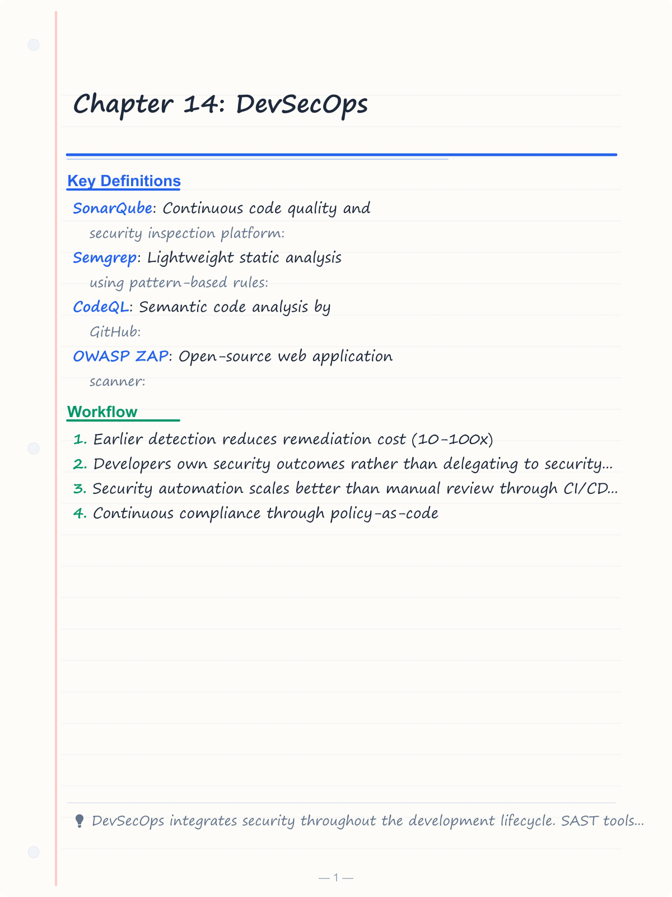
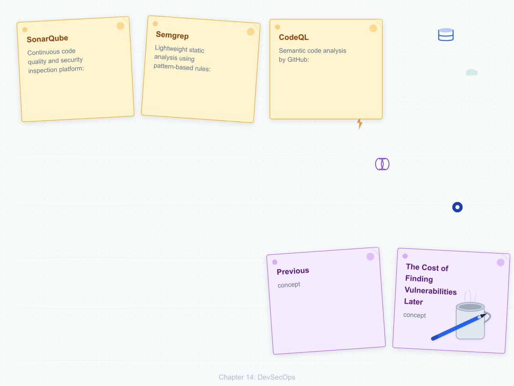
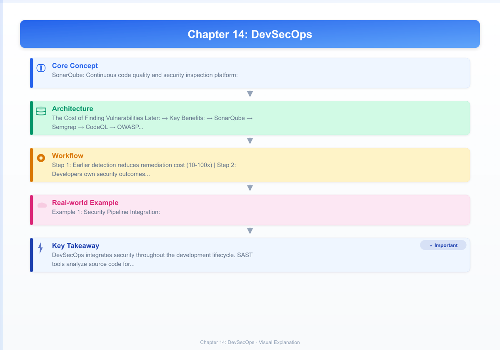
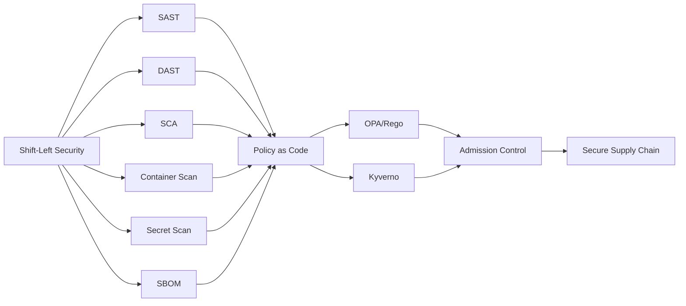

# Chapter 14: DevSecOps

> **Previous:** [Observability](./13-observability.md) | **Next:** [Database DevOps](./15-database-devops.md)

## Learning Objectives

By the end of this chapter, students will be able to:

<!-- Image Gallery -->
<section class="lesson-visuals" aria-label="Visual learning resources">
  <header><span>VISUAL LEARNING</span><h2>See it. Review it. Remember it.</h2></header>
  <a class="lesson-visual-card" href="../../assets/images/lessons/devops/14-devsecops/handwritten-notes.png" target="_blank" rel="noopener">
    
    <span><strong>Handwritten notes</strong>Condensed notes for deliberate review.</span>
  </a>
  <a class="lesson-visual-card" href="../../assets/images/lessons/devops/14-devsecops/sticky-notes.png" target="_blank" rel="noopener">
    
    <span><strong>Sticky-note revision</strong>Fast recall prompts for revision.</span>
  </a>
  <a class="lesson-visual-card" href="../../assets/images/lessons/devops/14-devsecops/visual-explanation.png" target="_blank" rel="noopener">
    
    <span><strong>Visual concept guide</strong>A connected explanation of the key ideas.</span>
  </a>
</section>
<!-- End Image Gallery -->


1. Explain the shift-left security principle and its impact on software development
2. Integrate SAST tools (SonarQube, Semgrep, CodeQL) into CI/CD pipelines
3. Configure DAST scanning using OWASP ZAP and Burp Suite
4. Implement software composition analysis with Snyk, Dependabot, Trivy, and Grype
5. Scan container images for vulnerabilities using Trivy, Clair, and Docker Scout
6. Detect secrets in source code with GitLeaks and TruffleHog
7. Enforce security policies using OPA and Kyverno
8. Generate and verify SBOMs for software supply chain security

## Chapter at a Glance

| Topic | Key Insight | Practical Takeaway |
|-------|-------------|-------------------|
| Shift-Left Security | Integrate security earlier in development | 10-100x cost difference finding vulns in design vs production |
| SAST Tools | Source code analysis without execution | SonarQube, Semgrep, CodeQL for CI/CD integration |
| DAST Tools | Running application attack simulation | OWASP ZAP, Burp Suite for dynamic testing |
| SCA Tools | Open-source dependency vulnerability scanning | Snyk, Dependabot, Trivy, Grype for supply chain |
| Container Scanning | Image vulnerability detection | Scan images before push and in registries |
| Secret Scanning | Prevent credential leakage in code | GitLeaks, TruffleHog for pre-commit hooks |
| Policy as Code | OPA/Kyverno for policy enforcement | Decouple policy from application logic |
| SBOM | Software Bill of Materials inventory | Generate with Syft, verify with Cosign |

## Chapter Roadmap



## Theory

### 14.1 Shift-Left Security


Shift-left security integrates security practices earlier in the software development lifecycle. Traditional security performed a penetration test shortly before release, discovering vulnerabilities that were expensive to fix. Shift-left makes security a continuous concern throughout development.

**The Cost of Finding Vulnerabilities Later:**

| Phase Found | Relative Fix Cost |
|-------------|-------------------|
| Design | 1x |
| Development | 6x |
| Testing | 15x |
| Staging | 40x |
| Production | 100x+ |

**Key Benefits:**
- Earlier detection reduces remediation cost (10-100x)
- Developers own security outcomes rather than delegating to security teams
- Security automation scales better than manual review through CI/CD integration
- Continuous compliance through policy-as-code
- Faster feedback loops for security issues

### 14.2 SAST (Static Application Security Testing)


SAST analyzes source code for security vulnerabilities without executing the application. It scans at the code level, identifying potential vulnerabilities before the code runs.

**SonarQube** — Continuous code quality and security inspection platform:
- Analyzes 30+ programming languages
- Reports bugs, vulnerabilities, code smells, security hotspots
- Quality gates that fail CI/CD pipelines
- Built-in rules for OWASP Top 10, CWE Top 25
- Supports custom rules and quality profiles

**Semgrep** — Lightweight static analysis using pattern-based rules:
- Custom rules in a simple, readable syntax
- Community rule registry (Semgrep Registry) with 2000+ rules
- OWASP Top 10, CWE Top 25, and framework-specific vulnerabilities
- Fast execution (typically seconds per scan)
- Supports 30+ languages

```yaml
# Semgrep rule: detect hardcoded passwords
rules:
  - id: hardcoded-password
    patterns:
      - pattern: |
          $PASSWORD = "..."
      - metavariable-regex:
          metavariable: $PASSWORD
          regex: (password|passwd|pwd)
    message: "Hardcoded password detected"
    languages: [python, javascript, go]
    severity: ERROR
```

**CodeQL** — Semantic code analysis by GitHub:
- Treats code as data for query-based security analysis
- Deep analysis identifies complex vulnerabilities (injection, XSS, path traversal)
- Integrated with GitHub Advanced Security
- Supports C, C++, C#, Go, Java, JavaScript/TypeScript, Python, Ruby

### 14.3 DAST (Dynamic Application Security Testing)


DAST tests running applications for vulnerabilities by simulating attacks from the outside. Unlike SAST, DAST tests the application in its running state with all components active.

**OWASP ZAP** — Open-source web application scanner:
- Automated scanning, passive scanning, active scanning
- API scanning (OpenAPI, GraphQL, SOAP)
- CI/CD integration via Docker
- Spidering and AJAX spider for crawling applications
- Authentication handling for testing authenticated areas

```bash
# Run ZAP full scan against a target
docker run -v $(pwd):/zap/wrk owasp/zap2docker-stable \
  zap-full-scan.py -t https://staging.example.com \
  -r zap_report.html
```

**Burp Suite** — Professional web security testing tool:
- Burp Enterprise automates scanning in CI/CD
- Scanning engine identifies SQL injection, XSS, SSRF, authentication bypass
- Extensible through BApps (community and pro extensions)
- Repeater and Intruder for manual testing

### 14.4 SCA (Software Composition Analysis)


SCA analyzes open-source dependencies for known vulnerabilities, license compliance, and outdated versions. Modern applications consist of 80-90% open-source code, making SCA critical.

**Snyk** — Developer-first security platform:
- Scans dependencies, container images, and IaC configurations
- Provides fix suggestions and automated pull requests
- Monitors projects continuously between scans
- Supports multiple languages and package managers
- Policy engine for custom vulnerability thresholds

**Dependabot** — GitHub-native dependency update tool:
- Creates pull requests for vulnerable dependencies
- Configurable update schedule and version constraints
- Groups related updates together
- Native GitHub integration

```yaml
# Dependabot configuration
version: 2
updates:
  - package-ecosystem: "npm"
    directory: "/"
    schedule:
      interval: "weekly"
    open-pull-requests-limit: 10
    labels:
      - "dependencies"
      - "security"
```

**Trivy** — Comprehensive vulnerability scanner:
- Scans filesystems, container images, Git repos, Kubernetes
- Fast execution, no database required
- Reports CVSS scores and fix versions
- Supports multiple vulnerability databases (NVD, GitHub Advisory, RedHat, Alpine)

**Grype** — Vulnerability scanner focused on accuracy:
- Multiple vulnerability database sources
- Generates CycloneDX SBOM output
- Cataloger-based package discovery
- Matches packages against vulnerability databases

### 14.5 Container Scanning


Container images must be scanned for OS packages and application dependencies with known vulnerabilities.

**Scanning Locations:**
1. **Pre-build** — Scan Dockerfile for misconfigurations and base image vulnerabilities
2. **Post-build** — Scan the built image before pushing to registry
3. **Registry** — Continuous scanning of stored images
4. **Runtime** — Monitor running containers for new vulnerability disclosures

```bash
# Scan image before push
trivy image myapp:latest --severity HIGH,CRITICAL --exit-code 1

# Scan in registry
trivy image registry.example.com/myapp:latest

# Scan filesystem
trivy fs --severity HIGH,CRITICAL .
```

**Docker Scout** — Docker-native vulnerability scanning:
- Policy evaluation with customizable rules
- Remediation guidance with step-by-step fixes
- SBOM generation and comparison
- Integrated with Docker Desktop and Docker Hub

### 14.6 Secret Scanning


Secrets (API keys, passwords, tokens, certificates) committed to source code represent immediate security risks.

**GitLeaks** — Detects secrets in Git repositories:
- Scans commits, diffs, and directories
- Customizable rule sets
- Pre-commit hooks for local scanning

```bash
# Scan entire repository history
gitleaks detect --source . --verbose

# Scan pre-commit
gitleaks protect --staged

# Scan CI pipeline
gitleaks detect --source . --report-path gitleaks-report.json
```

**TruffleHog** — Scans Git repositories for secrets:
- Entropy detection finds high-entropy strings
- Regex matching for known patterns
- Custom detectors for specific secrets
- Structured data scanning for JSON, YAML, .env files

### 14.7 SBOM Generation and Verification


A Software Bill of Materials provides an inventory of all components in a software artifact. SBOMs enable known vulnerability correlation, supply chain risk assessment, and regulatory compliance (Executive Order 14028).

```bash
# Generate SBOM with Syft
syft packages myapp:latest -o cyclonedx-json > sbom.json

# Verify vulnerabilities against SBOM
grype sbom:sbom.json

# Create signed attestation
cosign attest --predicate sbom.json --key cosign.key myapp:latest
```

**SBOM Formats:**
- **CycloneDX** — OWASP standard, most commonly used for security
- **SPDX** — ISO standard, commonly used for license compliance
- **SWID** — ISO standard for software identification tags

**SBOM Use Cases:**
- Vulnerability scanning against known CVEs
- License compliance auditing
- Supply chain risk assessment
- Rapid incident response (Log4Shell, Heartbleed)
- Regulatory compliance

### 14.8 Policy as Code


**Open Policy Agent (OPA)** — General-purpose policy engine:
- Decouples policy from software
- Policies in Rego, a declarative language
- Enforces policies on arbitrary JSON data
- Integrates with Kubernetes as an admission controller

```rego
# OPA policy: containers must not run as root
package kubernetes.admission

deny[msg] {
  input.request.kind.kind == "Pod"
  container := input.request.object.spec.containers[_]
  not container.securityContext.runAsNonRoot
  msg := sprintf("Container %v must set runAsNonRoot=true", [container.name])
}
```

**Kyverno** — Kubernetes-native policy engine:
- Policies are Kubernetes Custom Resources
- Supports validate, mutate, generate, and verify patterns
- Built-in 200+ policy library
- Policy reports for compliance evidence

```yaml
apiVersion: kyverno.io/v1
kind: ClusterPolicy
metadata:
  name: require-labels
spec:
  validationFailureAction: enforce
  rules:
    - name: check-team-label
      match:
        any:
          - resources:
              kinds: ["Pod", "Deployment"]
      validate:
        message: "Label 'team' is required"
        pattern:
          metadata:
            labels:
              team: "?*"
```

### 14.9 Supply Chain Security


Supply chain security protects the software development and delivery pipeline from compromise:

**Key Practices:**
- **Dependency pinning** — Lock dependency versions to prevent unexpected updates
- **Signed commits** — GPG or SSH signing for commit authenticity
- **Image signing** — Cosign for container image signatures
- **SLSA levels** — Supply-chain Levels for Software Artifacts
- **Admission control** — OPA/Kyverno verifying image signatures before deployment
- **Provenance** — SLSA provenance attestations for build process integrity

---

## Examples

### Example 1: Security Pipeline Integration

```typescript
interface SecurityTool {
  name: string;
  category: 'sast' | 'dast' | 'sca' | 'container' | 'secret' | 'sbom';
  run: () => Promise<ScanResult>;
}

interface ScanResult {
  tool: string;
  passed: boolean;
  critical: number;
  high: number;
  medium: number;
  low: number;
  findings: Array<{ id: string; severity: string; message: string }>;
}

class SecurityPipeline {
  private tools: SecurityTool[] = [];
  private results: ScanResult[] = [];

  addTool(tool: SecurityTool): void {
    this.tools.push(tool);
  }

  async runAll(): Promise<boolean> {
    console.log('Starting security pipeline...\n');

    for (const tool of this.tools) {
      try {
        const result = await tool.run();
        this.results.push(result);
        const icon = result.passed ? '?' : '?';
        console.log(`${icon} ${result.tool}: ${result.critical + result.high} HIGH/CRITICAL findings`);
      } catch (error) {
        this.results.push({
          tool: tool.name, passed: false, critical: 0, high: 0, medium: 0, low: 0,
          findings: [{ id: 'ERROR', severity: 'critical', message: String(error) }],
        });
        console.log(`? ${tool.name}: ERROR - ${error}`);
      }
    }

    return this.evaluateGates();
  }

  private evaluateGates(): boolean {
    const failed = this.results.filter(r => !r.passed);
    if (failed.length > 0) {
      console.log('\n? Pipeline blocked: Security gates failed');
      for (const f of failed) {
        console.log(`   - ${f.tool}: ${f.critical} critical, ${f.high} high findings`);
      }
      return false;
    }

    console.log('\n? All security gates passed');
    return true;
  }

  generateReport(): string {
    let report = '# Security Scan Report\n\n';
    report += '| Tool | Category | Status | Critical | High | Medium | Low |\n';
    report += '|------|----------|--------|----------|------|--------|-----|\n';

    for (const r of this.results) {
      const status = r.passed ? '? Pass' : '? Fail';
      report += `| ${r.tool} | ${r.tool} | ${status} | ${r.critical} | ${r.high} | ${r.medium} | ${r.low} |\n`;
    }

    return report;
  }
}

const pipeline = new SecurityPipeline();
pipeline.addTool({ name: 'Semgrep', category: 'sast', run: async () => ({ tool: 'Semgrep', passed: true, critical: 0, high: 2, medium: 5, low: 10, findings: [] }) });
pipeline.addTool({ name: 'Trivy', category: 'container', run: async () => ({ tool: 'Trivy', passed: true, critical: 0, high: 1, medium: 3, low: 8, findings: [] }) });
pipeline.addTool({ name: 'GitLeaks', category: 'secret', run: async () => ({ tool: 'GitLeaks', passed: true, critical: 0, high: 0, medium: 0, low: 0, findings: [] }) });

pipeline.runAll().then(console.log);
```

### Example 2: OPA Policy Validator

```typescript
interface AdmissionRequest {
  kind: { kind: string; apiVersion: string };
  object: Record<string, unknown>;
}

interface PolicyRule {
  id: string;
  description: string;
  evaluate: (request: AdmissionRequest) => { allowed: boolean; message?: string };
}

class OPAAdmissionController {
  private policies: PolicyRule[] = [];

  addPolicy(policy: PolicyRule): void {
    this.policies.push(policy);
  }

  validate(request: AdmissionRequest): { allowed: boolean; messages: string[] } {
    const messages: string[] = [];
    let allowed = true;

    for (const policy of this.policies) {
      const result = policy.evaluate(request);
      if (!result.allowed) {
        allowed = false;
        messages.push(result.message || `Policy "${policy.id}" rejected request`);
      }
    }

    return { allowed, messages };
  }
}

const controller = new OPAAdmissionController();

controller.addPolicy({
  id: 'run-as-non-root',
  description: 'Containers must run as non-root',
  evaluate: (req) => {
    if (req.kind.kind !== 'Pod') return { allowed: true };
    const spec = req.object as { spec?: { containers?: Array<{ securityContext?: { runAsNonRoot?: boolean } }> } };
    const container = spec.spec?.containers?.[0];
    if (!container?.securityContext?.runAsNonRoot) {
      return { allowed: false, message: 'Container must set runAsNonRoot=true' };
    }
    return { allowed: true };
  },
});

controller.addPolicy({
  id: 'require-resource-limits',
  description: 'Containers must have CPU and memory limits',
  evaluate: (req) => {
    if (req.kind.kind !== 'Pod') return { allowed: true };
    const spec = req.object as { spec?: { containers?: Array<{ resources?: { limits?: Record<string, string> } }> } };
    const container = spec.spec?.containers?.[0];
    if (!container?.resources?.limits) {
      return { allowed: false, message: 'Container must have resource limits' };
    }
    return { allowed: true };
  },
});

const validPod: AdmissionRequest = {
  kind: { kind: 'Pod', apiVersion: 'v1' },
  object: {
    spec: {
      containers: [{
        securityContext: { runAsNonRoot: true },
        resources: { limits: { cpu: '500m', memory: '512Mi' } },
      }],
    },
  },
};

const invalidPod: AdmissionRequest = {
  kind: { kind: 'Pod', apiVersion: 'v1' },
  object: { spec: { containers: [{}] } },
};

console.log('Valid pod:', controller.validate(validPod));
console.log('Invalid pod:', controller.validate(invalidPod));
```

### Example 3: SBOM Analyzer

```typescript
interface Package {
  name: string;
  version: string;
  type: 'npm' | 'maven' | 'pip' | 'docker' | 'golang';
  licenses: string[];
  vulnerabilities: Array<{ id: string; severity: 'CRITICAL' | 'HIGH' | 'MEDIUM' | 'LOW'; fixVersion?: string }>;
}

class SBOMAnalyzer {
  private packages: Package[] = [];

  addPackage(pkg: Package): void {
    this.packages.push(pkg);
  }

  getCriticalVulnerabilities(): Package[] {
    return this.packages.filter(p => p.vulnerabilities.some(v => v.severity === 'CRITICAL'));
  }

  getUnlicensedPackages(): Package[] {
    return this.packages.filter(p => p.licenses.length === 0);
  }

  generateReport(): string {
    let report = '# SBOM Analysis Report\n\n';
    report += `Total packages: ${this.packages.length}\n`;
    report += `Critical vulnerabilities: ${this.getCriticalVulnerabilities().length}\n`;
    report += `High vulnerabilities: ${this.packages.filter(p => p.vulnerabilities.some(v => v.severity === 'HIGH')).length}\n`;
    report += `Unlicensed packages: ${this.getUnlicensedPackages().length}\n\n`;

    report += '## Critical Vulnerability Details\n\n';
    for (const pkg of this.getCriticalVulnerabilities()) {
      for (const vuln of pkg.vulnerabilities.filter(v => v.severity === 'CRITICAL')) {
        const fix = vuln.fixVersion ? ` (fix: ${vuln.fixVersion})` : ' (no fix available)';
        report += `- ${pkg.name}@${pkg.version}: ${vuln.id}${fix}\n`;
      }
    }

    report += '\n## License Summary\n\n';
    const licenseCounts: Record<string, number> = {};
    for (const pkg of this.packages) {
      for (const license of pkg.licenses) {
        licenseCounts[license] = (licenseCounts[license] || 0) + 1;
      }
    }
    for (const [license, count] of Object.entries(licenseCounts)) {
      report += `- ${license}: ${count} packages\n`;
    }

    const riskScore = this.packages.reduce((score, pkg) => {
      return score + pkg.vulnerabilities.reduce((s, v) => {
        const weights = { CRITICAL: 10, HIGH: 5, MEDIUM: 2, LOW: 1 };
        return s + (weights[v.severity] || 0);
      }, 0);
    }, 0);

    report += `\n## Overall Risk Score: ${riskScore}\n`;
    report += riskScore > 50 ? '?? High risk — immediate action required\n' : riskScore > 20 ? '?? Moderate risk\n' : '? Low risk\n';

    return report;
  }
}

const analyzer = new SBOMAnalyzer();
analyzer.addPackage({ name: 'express', version: '4.18.2', type: 'npm', licenses: ['MIT'], vulnerabilities: [] });
analyzer.addPackage({ name: 'lodash', version: '4.17.20', type: 'npm', licenses: ['MIT'], vulnerabilities: [{ id: 'CVE-2021-23337', severity: 'HIGH', fixVersion: '4.17.21' }] });
analyzer.addPackage({ name: 'axios', version: '0.21.1', type: 'npm', licenses: ['MIT'], vulnerabilities: [{ id: 'CVE-2021-3749', severity: 'CRITICAL', fixVersion: '0.21.2' }] });
analyzer.addPackage({ name: 'internal-lib', version: '1.0.0', type: 'npm', licenses: [], vulnerabilities: [] });

console.log(analyzer.generateReport());
```

---

## Concept Comparison Table

| Concept | Description |
|---------|-------------|
| SAST | Static source code analysis (SonarQube, Semgrep) |
| DAST | Dynamic app testing (OWASP ZAP, Burp Suite) |
| SCA | Dependency vulnerability scanning (Snyk, Trivy) |
| Container Scan | Image vulnerability detection (Trivy, Clair) |
| Secret Scan | Credential detection (GitLeaks, TruffleHog) |
| Policy as Code | OPA (Rego), Kyverno (K8s-native) |
| SBOM | Component inventory (CycloneDX, SPDX) |

## Quick Reference

| Topic | Key Points |
|-------|------------|
| SAST Tools | SonarQube, Semgrep, CodeQL |
| DAST Tools | OWASP ZAP, Burp Suite |
| SCA Tools | Snyk, Dependabot, Trivy, Grype |
| Secret Scan | GitLeaks, TruffleHog |
| Policy as Code | OPA/Rego, Kyverno |
| SBOM | Syft(generate), Grype(scan), Cosign(sign) |
| Shift-Left | Earlier = 10-100x cheaper |

## Cross-Application Matrix

| Domain | Application |
|--------|-------------|
| Web | Web app vulnerability scanning |
| Cloud | Cloud config security scanning |
| Enterprise | Compliance policy enforcement |
| Container | Container image CVE scanning |

### SAST/DAST Scanner Wrapper

Integrating security scanning into CI/CD pipelines requires consistent interfaces across scanning tools. The following wrapper unifies static and dynamic analysis results.

```typescript
interface ScanIssue {
  id: string;
  severity: 'critical' | 'high' | 'medium' | 'low' | 'info';
  type: string;
  file: string;
  line: number;
  description: string;
  remediation: string;
  cve?: string;
}

interface ScanResult {
  scanner: 'sast' | 'dast' | 'sca' | 'container';
  issues: ScanIssue[];
  duration: number;
  passed: boolean;
}

interface SecurityGateResult {
  passed: boolean;
  criticalCount: number;
  highCount: number;
  mediumCount: number;
  failedGates: string[];
}

class ScannerWrapper {
  runSAST(code: string): ScanResult {
    const issues: ScanIssue[] = [];
    const lines = code.split('\n');
    for (let i = 0; i < lines.length; i++) {
      if (lines[i].includes('eval(') || lines[i].includes('exec(')) {
        issues.push({ id: `SAST-${issues.length + 1}`, severity: 'high', type: 'Code Injection', file: 'src/app.ts', line: i + 1, description: 'Dangerous function usage', remediation: 'Avoid eval/exec, use safe alternatives' });
      }
      if (lines[i].includes('innerHTML') || lines[i].includes('document.write')) {
        issues.push({ id: `SAST-${issues.length + 1}`, severity: 'medium', type: 'XSS', file: 'src/app.ts', line: i + 1, description: 'Potential XSS vulnerability', remediation: 'Use textContent or sanitize input' });
      }
    }
    return { scanner: 'sast', issues, duration: 12, passed: issues.filter(i => i.severity === 'critical' || i.severity === 'high').length === 0 };
  }

  runDAST(endpoints: string[]): ScanResult {
    const issues: ScanIssue[] = [];
    for (const ep of endpoints) {
      if (ep.includes('/api/')) {
        issues.push({ id: `DAST-${issues.length + 1}`, severity: 'medium', type: 'Missing Auth', file: ep, line: 0, description: 'Endpoint missing authentication header', remediation: 'Add authorization middleware' });
      }
    }
    return { scanner: 'dast', issues, duration: 45, passed: issues.length === 0 };
  }

  evaluateGates(results: ScanResult[]): SecurityGateResult {
    const allIssues = results.flatMap(r => r.issues);
    const criticalCount = allIssues.filter(i => i.severity === 'critical').length;
    const highCount = allIssues.filter(i => i.severity === 'high').length;
    const mediumCount = allIssues.filter(i => i.severity === 'medium').length;
    const failedGates: string[] = [];

    if (criticalCount > 0) failedGates.push('Blocking: Critical vulnerabilities found');
    if (highCount > 2) failedGates.push('Blocking: More than 2 high severity issues');
    if (mediumCount > 10) failedGates.push('Warning: More than 10 medium severity issues');

    return { passed: failedGates.filter(g => g.startsWith('Blocking')).length === 0, criticalCount, highCount, mediumCount, failedGates };
  }
}

const wrapper = new ScannerWrapper();
const code = `const data = eval(userInput); document.getElementById('output').innerHTML = data;`;
const sastResult = wrapper.runSAST(code);
const dastResult = wrapper.runDAST(['https://app.com/api/users', 'https://app.com/about']);
const gateResult = wrapper.evaluateGates([sastResult, dastResult]);
console.log(`SAST: ${sastResult.issues.length} issues, ${sastResult.passed ? 'PASSED' : 'FAILED'}`);
console.log(`DAST: ${dastResult.issues.length} issues, ${dastResult.passed ? 'PASSED' : 'FAILED'}`);
console.log(`Gate: ${gateResult.passed ? 'PASSED' : 'FAILED'}, Critical: ${gateResult.criticalCount}, High: ${gateResult.highCount}`);
```

**What this demonstrates:** A unified security scanner wrapper standardizes SAST/DAST results, enables consistent gate evaluation, and enforces security policies across CI/CD pipelines.

---

## Chapter Quiz

<details><summary>Question 1: What is shift-left security?</summary>**A)** Moving security testing to the right<br>**B)** Integrating security earlier in development<br>**C)** Outsourcing security<br>**D)** Removing security gates<br><br>**Answer: B)** Integrating security earlier in development&lt;/details&gt;

<details><summary>Question 2: What does SAST analyze?</summary>**A)** Running applications<br>**B)** Source code without execution<br>**C)** Network traffic<br>**D)** User behavior<br><br>**Answer: B)** Source code without execution&lt;/details&gt;

<details><summary>Question 3: Which tool detects secrets in Git history?</summary>**A)** SonarQube<br>**B)** GitLeaks<br>**C)** OWASP ZAP<br>**D)** Prometheus<br><br>**Answer: B)** GitLeaks&lt;/details&gt;

<details><summary>Question 4: What is an SBOM?</summary>**A)** A security tool<br>**B)** Software Bill of Materials — inventory of components<br>**C)** A deployment strategy<br>**D)** A monitoring tool<br><br>**Answer: B)** Software Bill of Materials — inventory of components&lt;/details&gt;

<details><summary>Question 5: What language does OPA use for policies?</summary>**A)** YAML<br>**B)** Rego<br>**C)** JSON<br>**D)** Python<br><br>**Answer: B)** Rego&lt;/details&gt;

---


// devsecops
// cicd-infrastructure-automation implementation

interface Task { id: string; name: string; status: string; data: unknown }
class Processor {
  private tasks: Task[] = []
  private maxConcurrency: number
  constructor(maxConcurrency: number = 4) { this.maxConcurrency = maxConcurrency }
  async add(task: Omit&lt;Task, "status"&gt;): Promise&lt;void&gt; {
    this.tasks.push({ ...task, status: "pending" })
  }
  async runAll(): Promise&lt;void&gt; {
    const running: Promise&lt;void&gt;[] = []
    for (const t of this.tasks) {
      if (running.length >= this.maxConcurrency) { await Promise.race(running) }
      const p = this.execute(t).finally(() => { const i = running.indexOf(p); if (i >= 0) running.splice(i, 1) })
      running.push(p)
    }
    await Promise.all(running)
  }
  private async execute(t: Task): Promise&lt;void&gt; {
    t.status = "running"
    await new Promise(r => setTimeout(r, 10))
    t.status = "done"
  }
  getResults(): Task[] { return this.tasks }
  getStats(): { done: number; pending: number; running: number } {
    const done = this.tasks.filter(t => t.status === "done").length
    const pending = this.tasks.filter(t => t.status === "pending").length
    const running = this.tasks.filter(t => t.status === "running").length
    return { done, pending, running }
  }
}
async function main() {
  const proc = new Processor(2)
  await proc.add({ id: '1', name: 'devsecops', data: { topic: 'cicd-infrastructure-automation' } })
  await proc.runAll()
  console.log('Stats:', proc.getStats())
}
main().catch(console.error)
export { Processor, Task }
## Summary

DevSecOps integrates security throughout the development lifecycle. SAST tools analyze source code for vulnerabilities before execution. DAST tools test running applications with simulated attacks. SCA tools identify vulnerable dependencies in the supply chain. Container scanners detect vulnerabilities in images before deployment. Secret scanners prevent credential leakage through pre-commit hooks and CI checks. Policy-as-code tools (OPA, Kyverno) enforce security and compliance requirements automatically. SBOMs provide component inventory for vulnerability correlation and supply chain risk assessment. Together, these tools create a comprehensive security posture that prevents vulnerabilities from reaching production and enables rapid response when new vulnerabilities are disclosed.

---

## Exercises

### Review Questions

1. What is the shift-left security principle? Why does it reduce remediation costs?
2. Compare SAST and DAST: what vulnerabilities does each detect that the other might miss?
3. How does SCA identify vulnerabilities in transitive dependencies?
4. What differentiates container image scanning from dependency scanning?
5. How does OPA enforce policy differently from Kyverno?

### Application Problems

1. Create a GitHub Actions workflow that integrates Semgrep for SAST, Trivy for container scanning, and GitLeaks for secret scanning. The pipeline should fail on any HIGH or CRITICAL finding.
2. Set up OPA to enforce a policy that all containers must have CPU and memory limits specified. Test against valid and invalid Kubernetes Pod manifests.
3. Generate an SBOM for a container image using Syft. Scan the SBOM with Grype. Identify the top 5 vulnerabilities by CVSS score and determine whether fix versions exist.

### Challenge Problem

Design a DevSecOps pipeline for a financial services organization subject to PCI DSS and SOC 2 compliance. The organization has 20 microservices in four languages (Java, Go, Node.js, Python), private npm and Maven registries, and Kubernetes production clusters. Define the complete security toolchain: SAST integration point, DAST schedule, SCA policy (CVSS thresholds, license restrictions), container image scanning policy, secret scanning for code and Dockerfiles, admission controller policies for Kubernetes, SBOM generation and storage, and the CI/CD pipeline stages where each tool executes. Address false positive management, developer workflow impact, and compliance evidence collection.
