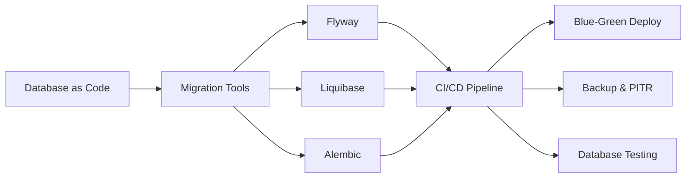

# Chapter 15: Database DevOps

> **Previous:** [DevSecOps](./14-devsecops.md) | **Next:** [Container Networking](./16-networking.md)

## Learning Objectives


By the end of this chapter, students will be able to:

1. Manage database schema migrations using Flyway, Liquibase, and Alembic
2. Design CI/CD pipelines that include database changes
3. Implement blue-green and rolling database deployment strategies
4. Configure backup, restore, and point-in-time recovery procedures
5. Develop database testing strategies including integration, unit, and performance tests


## Chapter at a Glance

| Topic | Key Insight | Practical Takeaway |
|-------|-------------|-------------------|
| Database as Code | Schema changes version-controlled in Git | Apply engineering discipline to database management |
| Schema Migration Tools | Flyway, Liquibase, Alembic | Choose based on language (Alembic for Python, Flyway for SQL) |
| Database CI/CD | Validate, test, stage, production pipeline | Always test migrations on a production-like database copy |
| Blue-Green DB Deployments | Backward-compatible changes enable zero-downtime | Three-phase approach for column renames |
| Backup & PITR | Full backup, WAL shipping, point-in-time recovery | Test backups regularly--untested backups are useless |
| Database Testing | Unit, integration, performance, transaction tests | Test query performance before and after schema changes |

## Chapter Roadmap



## Theory

### 15.1 Database as Code

> **Pro Tip:** Always create rollback migrations and test them before deploying forward migrations to production.

Database as Code applies version control, CI/CD, and automation principles to database schemas. Historically, database changes were manual, scripted by DBAs, and applied outside the application release process. This created a bottleneck and introduced errors.

Database as Code stores schema definitions, migrations, and configuration in Git. Changes undergo code review, automated testing, and pipeline-based deployment alongside application changes.

### 15.2 Schema Migration Tools

> **Warning:** Destructive operations like DROP COLUMN require multi-phase deployments for zero-downtime.

**Flyway** — Open-source database migration tool. Migrations are SQL files named with versioned or repeatable conventions.

```
V1__create_users.sql
V2__add_email_column.sql
V3__create_orders.sql
R__create_admin_user.sql
```

```bash
# Apply pending migrations
flyway migrate

# Check migration status
flyway info

# Rollback (Flyway Pro/Teams only)
flyway undo
```

Flyway records applied migrations in a schema history table. It calculates which migrations are pending by comparing available migration files against the history table.

**Liquibase** — More feature-rich than Flyway. Supports SQL and XML/JSON/YAML changelog formats. Provides rollback, context-aware execution, and preconditions.

```xml
<databaseChangeLog>
  <changeSet id="1" author="dev">
    <createTable tableName="users">
      <column name="id" type="bigint" autoIncrement="true">
        <constraints primaryKey="true"/>
      </column>
      <column name="email" type="varchar(255)">
        <constraints unique="true" nullable="false"/>
      </column>
    </createTable>
  </changeSet>
</databaseChangeLog>
```

```bash
# Apply changes
liquibase update

# Rollback last 3 changesets
liquibase rollbackCount 3

# Generate rollback SQL
liquibase rollbackSQL --tag v2.0.0
```

**Alembic** — Python-specific migration tool for SQLAlchemy. Auto-generates migrations from model changes.

```python
"""empty message

Revision ID: 2a1b3c4d5e6f
Revises: 1a2b3c4d5e6f
Create Date: 2026-06-09 14:30:00
"""
def upgrade():
    op.create_table('users',
        sa.Column('id', sa.Integer(), nullable=False),
        sa.Column('email', sa.String(length=255), nullable=False),
        sa.PrimaryKeyConstraint('id'),
        sa.UniqueConstraint('email')
    )

def downgrade():
    op.drop_table('users')
```

### 15.3 Database CI/CD

> **Remember:** A backup that hasn't been restored is not a backup. Test restore procedures regularly.

Integrating database changes into CI/CD requires careful design:

**Principles**:
- Database changes are version-controlled alongside application code
- Migrations are tested automatically before production application
- Forward migrations are additive when possible (add column, add table)
- Destructive operations (DROP, TRUNCATE) require explicit approval
- Rollback migrations are prepared and tested

**Pipeline Stages**:
1. **Validate** — Check migration file naming, syntax, and history consistency
2. **Test** — Apply migrations to a test database, run integration tests
3. **Stage** — Apply migrations to staging environment
4. **Production** — Apply with monitoring and automatic rollback on failure

### 15.4 Blue-Green Database Deployments

Database changes that are backward-compatible enable zero-downtime deployments:

- **Add Column** — Safe. Old code ignores the new column.
- **Remove Column** — Two-phase: first deploy code that stops using the column, then deploy migration to drop it.
- **Rename Column** — Three-phase: add new column with new name, deploy code that writes to both and reads from new, deploy code that removes old references, remove old column.
- **Modify Column** — Complex. Requires views, application-level transformation, or scheduled downtime.

### 15.5 Backup and Restore

Backup strategies:

**Full Backup** — Complete copy of the database. Slowest to create, fastest to restore. Typical nightly schedule.

**Incremental Backup** — Only changes since last backup. Fast to create, complex to restore (requires base + all increments).

**Continuous Archiving (WAL shipping)** — Streams transaction logs to archive. Enables point-in-time recovery.

**Restore Testing** — The most commonly violated best practice: backups must be tested. Automated restore testing validates that backups are usable.

```bash
# PostgreSQL: pg_dump
pg_dump -h prod-host -U app -d mydb > backup.sql

# PostgreSQL: pg_basebackup (physical backup)
pg_basebackup -h prod-host -U replicator -D /backup/$(date +%Y%m%d) -X stream

# MySQL: mysqldump
mysqldump -h prod-host -u app -p mydb > backup.sql

# MongoDB: mongodump
mongodump --uri="mongodb://prod-host:27017/mydb" --out /backup/$(date +%Y%m%d)
```

### 15.6 Point-in-Time Recovery (PITR)

PITR restores a database to a specific moment, not just the last backup. Required for recovering from data corruption, accidental deletion, or logical errors.

**Requirements**:
- Full base backup
- All WAL (Write-Ahead Log) segments since the backup
- The target timestamp or transaction ID

```bash
# PostgreSQL PITR
# 1. Restore base backup to data directory
# 2. Restore WAL archive to pg_wal directory
# 3. Create recovery.signal and postgresql.conf with:
#    restore_command = 'cp /wal_archive/%f %p'
#    recovery_target_time = '2026-06-09 14:30:00 UTC'
# 4. Start PostgreSQL
```

### 15.7 Database Testing

**Unit Tests** — Test database functions, stored procedures, and triggers in isolation.

**Integration Tests** — Test application code with a real database:
- Use migration tools to create the schema from scratch
- Seed test data
- Run application tests against the database
- Teardown after each test run

**Transaction Tests** — Test concurrent access, isolation levels, deadlock handling, and rollback behavior.

**Performance Tests** — Query performance regression detection. Capture query plans before and after schema changes.

```yaml
# Testcontainers-based integration test
services:
  test:
    image: test-runner
    depends_on:
      db:
        condition: service_healthy
  db:
    image: postgres:16
    environment:
      POSTGRES_DB: test
    healthcheck:
      test: ["CMD-SHELL", "pg_isready -U postgres"]
```

### 15.8 Migration Validation

Validate migrations before production application:

- **Syntax check** — Parse SQL for syntax errors
- **Empty database test** — Apply to a clean database, verify schema matches expectations
- **Production-like test** — Apply to a copy of production data, measure execution time
- **Rollback test** — Verify downgrade works correctly
- **Data preservation** — Verify no data loss occurs during migration

### 15.9 Rollback Strategies

Rollbacks for database changes depend on migration type:

- **Variant A: Forward-only** — Applies migration; rollback is a new forward migration that reverses the change. Example: `V2__add_column.sql` followed by `V3__remove_column.sql`.
- **Variant B: With rollback** — Flyway Pro and Liquibase support versioned rollbacks. Down migration reverses the up migration.
- **Variant C: Blue-green schema** — Maintain two schema versions simultaneously. Traffic switches after rollback capability is verified.

## Summary

## Concept Comparison Table

| Concept | Description |
|---------|-------------|
| Flyway | Versioned SQL migrations, schema history table |
| Liquibase | XML/JSON/YAML changelogs, rollback, contexts |
| Alembic | Python/SQLAlchemy, auto-generation from models |
| PITR | Full backup + WAL stream to any point in time |
| Blue-Green DB | Backward-compat changes for zero-downtime |

## Quick Reference

| Topic | Key Points |
|-------|------------|
| Flyway | V1__description.sql, migrate, info, undo |
| Liquibase | changelog.xml, update, rollbackCount, rollbackSQL |
| Alembic | revision --autogenerate, upgrade, downgrade |
| Backup | pg_dump, pg_basebackup, mysqldump, mongodump |
| PITR | Base backup + WAL archive + recovery.conf |

## Cross-Application Matrix

| Domain | Application |
|--------|-------------|
| Web | E-commerce database schema management |
| Cloud | Managed database migration pipelines |
| Enterprise | Compliance-aligned database changes |
| ML | Feature store schema evolution |

## Chapter Quiz

<details><summary>Question 1: How does Flyway track applied migrations?</summary>**A)** Git tags<br>**B)** Schema history table<br>**C)** File timestamps<br>**D)** Manual tracking<br><br>**Answer: B)** Schema history table</details>

<details><summary>Question 2: What backup method enables PITR?</summary>**A)** Full backup only<br>**B)** Full backup + WAL archiving<br>**C)** Incremental backup only<br>**D)** Snapshot backup only<br><br>**Answer: B)** Full backup + WAL archiving</details>

<details><summary>Question 3: How many phases for a column rename with zero-downtime?</summary>**A)** One<br>**B)** Two<br>**C)** Three<br>**D)** Four<br><br>**Answer: C)** Three (add new, update dual-write, drop old)</details>


## Summary

Database DevOps applies engineering discipline to schema management. Migration tools (Flyway, Liquibase, Alembic) version database changes and apply them programmatically. CI/CD integration requires careful pipeline design with validation and testing stages. Backward-compatible changes enable zero-downtime deployments. Backup and PITR strategies protect against data loss. Database testing validates correctness and performance. Migration validation and prepared rollback plans reduce deployment risk.

## Exercises

### Review Questions

1. Compare Flyway and Liquibase: how does each track migration state?
2. Why is a three-phase approach required for renaming a database column in a zero-downtime deployment?
3. What is WAL shipping and how does it enable point-in-time recovery?
4. Why should rollback migrations be tested before production deployment?
5. How does Testcontainers facilitate database integration testing?

### Application Problems

1. Create a Flyway migration set for an e-commerce database: V1 creates users and products tables, V2 adds an orders table with foreign keys, V3 adds an inventory_count column to products. Write the corresponding rollback scripts. Apply migrations to a PostgreSQL instance and verify the schema.
2. Set up an automated database CI/CD pipeline: when a migration is committed, apply it to a test database, run five integration tests that validate schema correctness and data integrity, and fail the pipeline if any test fails.
3. Configure PostgreSQL continuous archiving. Take a base backup, simulate a database failure, and perform point-in-time recovery to a specific timestamp. Verify data consistency after recovery.

### Challenge Problem

Design a zero-downtime database deployment strategy for a high-traffic e-commerce platform (20,000 requests/second, PostgreSQL, 200 GB database) that requires weekly deployments. The application has 50 tables and uses Flyway for migrations. Design a blue-green schema deployment process that handles: adding a NOT NULL column (requires backfilling), removing an indexed column, changing a column type from INTEGER to BIGINT, and adding a unique constraint on an existing column with duplicate values. For each change type, specify the migration order, code deployment phases, rollback procedure, and data integrity verification steps.
