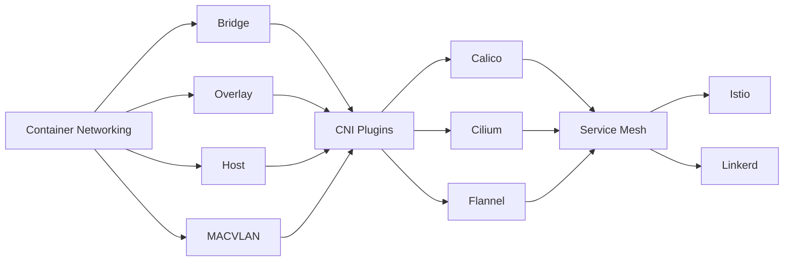

# Chapter 16: Container Networking

> **Previous:** [Database DevOps](./15-database-devops.md) | **Next:** [SRE Principles](./17-sre.md)

## Learning Objectives


By the end of this chapter, students will be able to:

1. Explain container networking models: CNI, bridge, overlay, and their implementations
2. Compare CNI plugins: Flannel, Calico, Weave, and Cilium
3. Deploy and configure a service mesh (Istio, Linkerd) for traffic management and security
4. Configure ingress controllers including NGINX, Traefik, HAProxy, and Envoy
5. Implement network policies, mTLS, egress controls, and API gateways


## Chapter at a Glance

| Topic | Key Insight | Practical Takeaway |
|-------|-------------|-------------------|
| Container Networking Models | Bridge, overlay, host, MACVLAN | Choose based on isolation and performance needs |
| CNI Plugins | Flannel, Calico, Weave, Cilium | Calico for policy; Cilium for eBPF performance |
| Service Mesh | Istio, Linkerd for traffic management | Sidecar proxies enable mTLS without code changes |
| Ingress Controllers | NGINX, Traefik, HAProxy, Envoy | NGINX is most widely adopted; Envoy powers Istio |
| mTLS | Mutual TLS for service-to-service security | Service meshes implement mTLS transparently |

## Chapter Roadmap



## Theory

### 16.1 Container Networking Models

> **Pro Tip:** Cilium's eBPF-based approach can replace kube-proxy for better performance and security observability.

Container networking enables communication between containers on the same host and across hosts. Multiple networking models exist:

**Bridge Networking** — Default Docker networking. Creates a virtual bridge on the host, assigns IP addresses to containers from a private subnet. NAT enables outbound connectivity. Containers communicate via IP or DNS names.

**Overlay Networking** — Encapsulates container traffic across hosts using VXLAN or similar tunneling. Enables multi-host container communication without modifying physical network infrastructure. Docker overlay, Flannel VXLAN, and Calico IPIP use this model.

**Host Networking** — Container uses the host's network stack directly. No network isolation, no NAT overhead. Higher performance, but ports cannot be remapped.

**MACVLAN/IPVLAN** — Assigns MAC or IP addresses directly from the physical network. Containers appear as separate hosts on the network. Provides better performance than bridge or overlay but requires physical network configuration changes.

### 16.2 CNI (Container Network Interface)

> **Remember:** By default, all Pods can communicate freely. NetworkPolicy restricts this--it's deny-by-default when applied.

CNI is a specification and library for configuring network interfaces in Linux containers. Kubernetes uses CNI plugins for pod networking. The CNI specification defines:

- **ADD** — Add container to network (allocate IP, create interface)
- **DEL** — Remove container from network
- **CHECK** — Verify container network is correctly configured
- **VERSION** — Report CNI specification version

**CNI Plugin Types**:
- **Main plugins** — Bridge, VLAN, MACVLAN, IPVLAN, IPvlan
- **IPAM plugins** — host-local, dhcp, static
- **Meta plugins** — tuning, portmap, bandwidth, firewall
- **Third-party plugins** — Flannel, Calico, Weave, Cilium

### 16.3 CNI Plugins Compared

> **Warning:** Service meshes add operational complexity. Start without one and adopt only when needed.

**Flannel** — Simplest overlay network. Uses VXLAN encapsulation. No network policy support. Suitable for basic connectivity requirements. Configuration via etcd or Kubernetes API.

**Calico** — Full-featured CNI plugin with advanced network policy capabilities. Uses BGP for routing instead of overlay in pure Layer 3 mode. Supports eBPF for improved performance. Provides fine-grained network policies, ServiceGraph, and IPAM. Best for security-conscious environments.

**Weave Net** — Mesh-based overlay network with built-in DNS and encryption. Supports partial connectivity and firewall traversal. Encrypts traffic by default (NaCl cryptography). Simpler setup than Calico but less performant.

**Cilium** — eBPF-based networking and security. Replaces kube-proxy with eBPF for high-performance service handling. Provides L3-L7 network policies, transparent encryption, and observability (Hubble). Best for performance-sensitive and security-conscious environments.

### 16.4 Service Mesh

A service mesh manages inter-service communication in a microservice architecture. It adds observability, traffic management, and security without modifying application code.

**Architecture**:
- **Data Plane** — Sidecar proxies (Envoy) deployed alongside each service. Handle all traffic in/out of the service.
- **Control Plane** — Manages proxy configuration, certificate issuance, and policy distribution.

**Istio** — Most feature-rich service mesh. Control plane components: Pilot (traffic management), Citadel (security, mTLS), Galley (config validation). Uses Envoy as the default proxy.

```yaml
# Istio VirtualService for traffic splitting
apiVersion: networking.istio.io/v1beta1
kind: VirtualService
metadata:
  name: api-routes
spec:
  hosts:
    - api
  http:
    - match:
        - headers:
            version:
              exact: v2
      route:
        - destination:
            host: api
            subset: v2
    - route:
        - destination:
            host: api
            subset: v1
          weight: 90
        - destination:
            host: api
            subset: v2
          weight: 10
```

**Linkerd** — Lighter-weight service mesh than Istio. Uses its own Rust-based proxy (linkerd-proxy) instead of Envoy. Simpler to install and operate. Supports mTLS, HTTP/gRPC load balancing, retries, timeouts, and metrics.

**Consul Connect** — Service mesh from HashiCorp. Integrates with Consul service discovery. Supports intentions for service-to-service authorization. Uses Envoy or built-in proxy.

### 16.5 Ingress Controllers

Ingress controllers implement the Kubernetes Ingress specification and provide HTTP routing, TLS termination, and traffic management.

**NGINX Ingress Controller** — Most widely adopted. Uses NGINX as the reverse proxy. Supports path-based routing, host-based routing, TLS termination, annotations for custom behavior (rate limiting, cors, rewrite). High performance and extensive community.

**Traefik** — Dynamic, auto-discovering reverse proxy. Automatically detects services from Kubernetes, Docker, Consul, and other providers. Built-in dashboard, metrics, and circuit breakers. Supports automatic HTTPS with Let's Encrypt.

**HAProxy Ingress** — High-performance ingress based on HAProxy. Supports advanced load balancing algorithms, health checks, rate limiting, and connection queuing.

**Envoy** — High-performance proxy used as the foundation for Istio and other service meshes. Can be used as a standalone ingress controller. Feature-rich but complex to configure manually.

### 16.6 DNS in Kubernetes

CoreDNS is the default DNS service for Kubernetes. It provides service discovery within the cluster.

**DNS Naming**:
- `service.namespace.svc.cluster.local` — Full DNS name
- `service.namespace` — Within cluster
- `service` — Within the same namespace

CoreDNS configuration is stored in a ConfigMap. Custom DNS entries, stub domains, and upstream DNS can be configured.

### 16.7 Network Policies

Network policies enforce firewall rules for Kubernetes pods. They control ingress and egress traffic based on pod selectors, namespace selectors, and IP blocks.

Pod-to-pod communication is restricted by applying policies that select specific pods. By default, all pods can communicate freely. A policy applied to a pod restricts its traffic to only what the policy allows.

### 16.8 mTLS

Mutual TLS (mTLS) encrypts and authenticates service-to-service communication:

- Both client and server present certificates
- Communication is encrypted in transit
- Identity is verified at both ends
- Certificates rotate automatically (in service meshes or cert-manager)

Service meshes implement mTLS transparently to applications. The proxy handles certificate exchange and encryption.

### 16.9 Egress Controls

Egress controls restrict outbound traffic from the cluster:

- **NetworkPolicy egress rules** — Kubernetes-native egress restrictions
- **Egress gateway** — Istio egress gateways for controlled external traffic
- **NAT gateway** — Cloud provider NAT for controlled outbound access
- **Proxy/Firewall** — Explicit proxy for external access logging and control

### 16.10 API Gateways

API gateways provide a single entry point for external API traffic:

- **Kong** — Built on OpenResty/Lua. Plugin ecosystem (authentication, rate limiting, caching, logging).
- **APIgee (GCP)** — Full-featured API management platform.
- **AWS API Gateway** — AWS-managed gateway with Lambda integration, caching, throttling.
- **Azure API Management** — Enterprise API gateway with developer portal and policy engine.

## Summary

## Concept Comparison Table

| Concept | Description |
|---------|-------------|
| Bridge | Default Docker networking, NAT-based, single host |
| Overlay | VXLAN tunneling for multi-host communication |
| Service Mesh | Sidecar proxies for traffic mgmt and security |
| Ingress | HTTP/HTTPS external routing controller |
| mTLS | Mutual certificate-based service authentication |

## Quick Reference

| Topic | Key Points |
|-------|------------|
| CNI Plugins | Flannel(simple), Calico(policy), Cilium(eBPF) |
| Service Mesh | Istio(feature-rich), Linkerd(lightweight) |
| Ingress | NGINX, Traefik, HAProxy, Envoy |
| DNS | CoreDNS, service.namespace.svc.cluster.local |
| mTLS | Mutual TLS with automatic cert rotation |

## Cross-Application Matrix

| Domain | Application |
|--------|-------------|
| Web | HTTP ingress routing for web apps |
| Cloud | Multi-cloud networking via overlays |
| Enterprise | mTLS for zero-trust compliance |
| Microservices | Service mesh traffic management |

## Chapter Quiz

<details><summary>Question 1: Which CNI plugin uses eBPF?</summary>**A)** Flannel<br>**B)** Calico<br>**C)** Cilium<br>**D)** Weave<br><br>**Answer: C)** Cilium</details>

<details><summary>Question 2: How does a service mesh proxy intercept traffic?</summary>**A)** DNS redirection<br>**B)** Sidecar proxy intercepts all in/out traffic<br>**C)** Application code modification<br>**D)** Virtual IP addresses<br><br>**Answer: B)** Sidecar proxy intercepts all in/out traffic</details>

<details><summary>Question 3: What does mTLS provide beyond TLS?</summary>**A)** Faster encryption<br>**B)** Mutual client and server authentication<br>**C)** Lower latency<br>**D)** Compression<br><br>**Answer: B)** Mutual client and server authentication</details>


## Summary

Container networking spans multiple models and implementation options. CNI plugins provide standardized network configuration for Kubernetes. Service meshes (Istio, Linkerd) add traffic management, security, and observability to inter-service communication. Ingress controllers manage external traffic into the cluster. mTLS secures service-to-service communication. Network policies enforce traffic rules. API gateways manage external API access. The choice of networking technologies depends on security requirements, performance needs, and operational maturity.

## Exercises

### Review Questions

1. How does VXLAN overlay networking enable multi-host container communication?
2. Compare Calico and Flannel: what capabilities does Calico provide beyond Flannel?
3. How does a service mesh sidecar proxy intercept traffic without application modification?
4. What is the difference between an ingress controller and a service mesh?
5. How does mTLS establish trust between two services without a pre-shared secret?

### Application Problems

1. Deploy a Kubernetes cluster with Calico as the CNI plugin. Create NetworkPolicies that allow web-tier pods to access API-tier pods on port 8080, but deny all other traffic to the API tier. Verify connectivity with test pods.
2. Install Istio on a Kubernetes cluster. Enable automatic sidecar injection. Deploy a microservice application and enable mTLS. Verify encrypted communication using tcpdump or Hubble.
3. Configure an NGINX ingress controller with TLS termination. Route traffic to two different services based on host headers (api.example.com -> api-service, app.example.com -> web-service).

### Challenge Problem

Design a complete network architecture for a multi-tenant Kubernetes platform hosting 50 microservices for 10 teams. Requirements: each team operates in isolated namespaces with strict egress controls (only approved external endpoints), inter-service communication uses mTLS, traffic shaping enables 10% canary deployments, network policies enforce least-privilege communication, and ingress is handled through a shared gateway with per-service TLS. Select and justify: CNI plugin, service mesh, ingress controller, certificate management approach, and DNS strategy. Provide the network topology diagram and key configuration examples.
