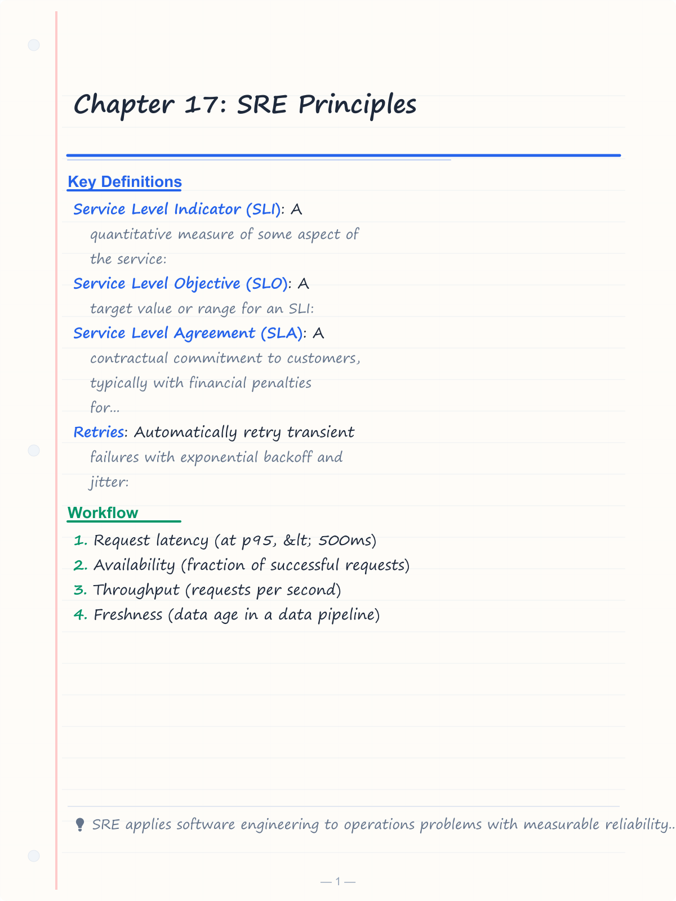
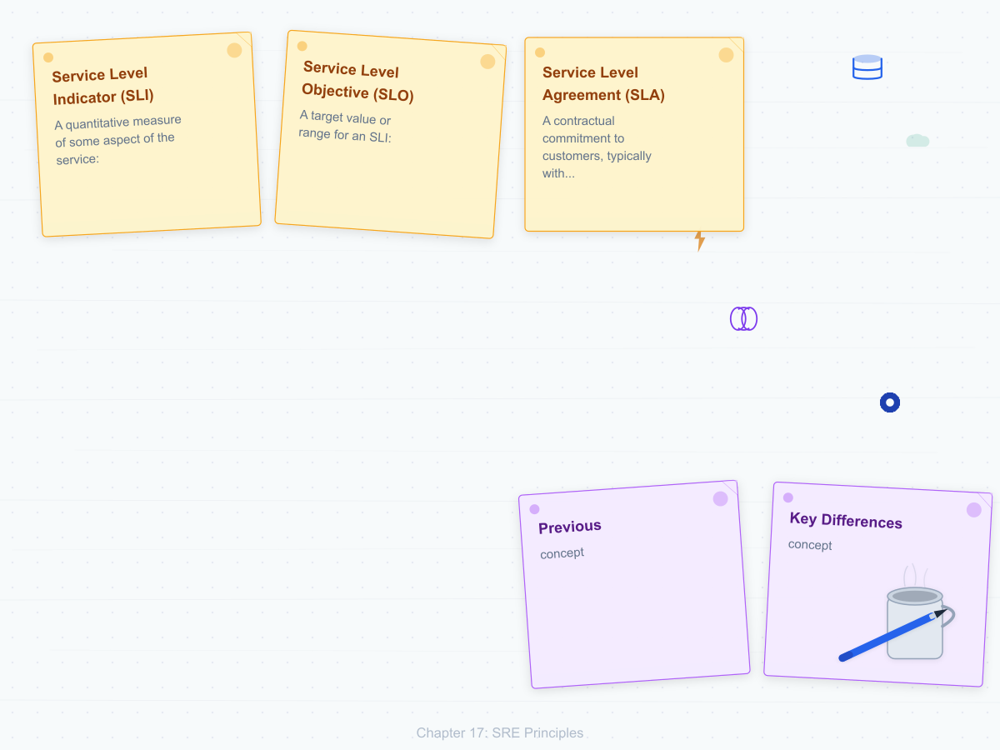
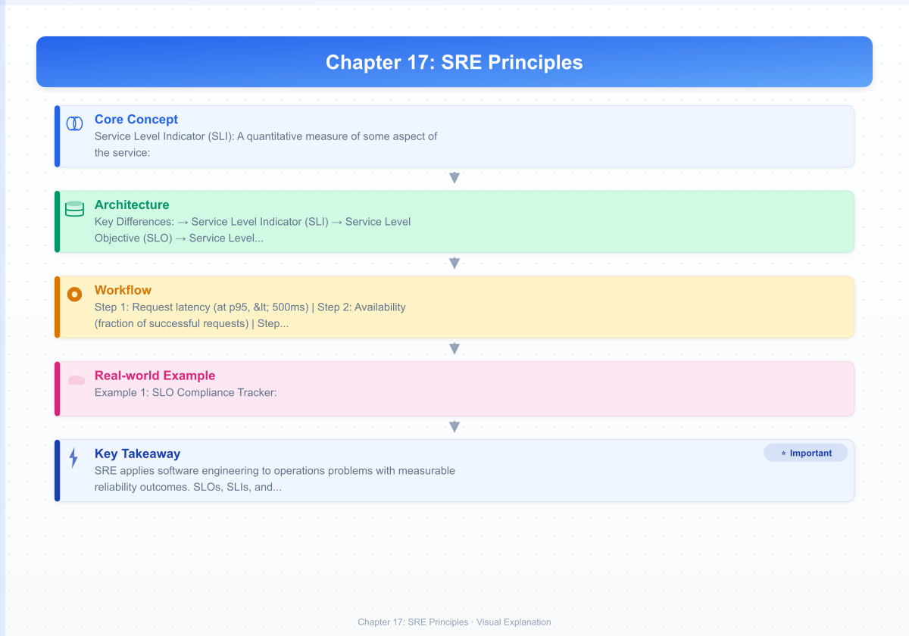
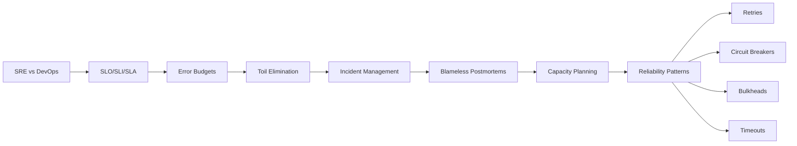

# Chapter 17: SRE Principles

> **Previous:** [Container Networking](./16-networking.md) | **Next:** [Capstone Project](./18-capstone.md)

## Learning Objectives

By the end of this chapter, students will be able to:

<!-- Image Gallery -->
<section class="lesson-visuals" aria-label="Visual learning resources">
  <header><span>VISUAL LEARNING</span><h2>See it. Review it. Remember it.</h2></header>
  <a class="lesson-visual-card" href="../../assets/images/lessons/devops/17-sre/handwritten-notes.png" target="_blank" rel="noopener">
    
    <span><strong>Handwritten notes</strong>Condensed notes for deliberate review.</span>
  </a>
  <a class="lesson-visual-card" href="../../assets/images/lessons/devops/17-sre/sticky-notes.png" target="_blank" rel="noopener">
    
    <span><strong>Sticky-note revision</strong>Fast recall prompts for revision.</span>
  </a>
  <a class="lesson-visual-card" href="../../assets/images/lessons/devops/17-sre/visual-explanation.png" target="_blank" rel="noopener">
    
    <span><strong>Visual concept guide</strong>A connected explanation of the key ideas.</span>
  </a>
</section>
<!-- End Image Gallery -->


1. Differentiate SRE from DevOps and describe the SRE model of reliability engineering
2. Define and implement Service Level Objectives, Indicators, and Agreements
3. Calculate and use error budgets to balance reliability and feature velocity
4. Identify and systematically eliminate toil through automation
5. Implement incident management processes with severity classification and response procedures
6. Design on-call rotations, escalation policies, and pager duty practices
7. Conduct blameless postmortems with systemic root cause analysis
8. Apply capacity planning and reliability patterns (retries, circuit breakers, bulkheads, timeouts)

## Chapter at a Glance

| Topic | Key Insight | Practical Takeaway |
|-------|-------------|-------------------|
| SRE vs DevOps | SRE is Google's engineering practice; DevOps is a cultural movement | SRE operationalizes DevOps with measurable reliability |
| SLO/SLI/SLA | Indicators measure; Objectives target; Agreements contract | Internal SLOs tighter than external SLAs |
| Error Budgets | Allowed unreliability = 1 - SLO | Release gating when budget exhausted |
| Toil Elimination | Manual, repetitive, automatable work | SRE teams spend &lt;50% on operations |
| Incident Management | Severity-based response with clear roles | Blameless postmortems find system causes |
| Reliability Patterns | Retries, circuit breakers, bulkheads, timeouts | Build resilience into service design |
| Capacity Planning | Demand forecasting and resource modeling | Proactive scaling prevents incidents |

## Chapter Roadmap



## Theory

### 17.1 SRE vs DevOps


SRE (Site Reliability Engineering) originates from Google, formalized by Ben Treynor Sloss in 2003. While DevOps is a cultural movement emphasizing collaboration between development and operations, SRE is a specific engineering practice with measurable outcomes.

**Key Differences:**

| Dimension | DevOps | SRE |
|-----------|--------|-----|
| Origin | Community movement | Google engineering practice |
| Focus | Culture, automation, flow | Reliability, capacity, toil |
| Measurement | DORA metrics (deploy frequency, lead time, MTTR, change failure rate) | SLOs, error budgets, availability |
| Implementation | Principles and practices | Specific engineering role with defined responsibilities |
| Operating model | Cross-functional teams | SRE team with explicit reliability ownership |
| Key constraint | No equivalent | Error budget gates release velocity |
| Toil limit | No explicit limit | 50% maximum operational work |

SRE operationalizes DevOps principles with engineering rigor. Many organizations implement SRE practices within a DevOps culture.

### 17.2 Service Level Objectives (SLO, SLI, SLA)


**Service Level Indicator (SLI)** — A quantitative measure of some aspect of the service:
- Request latency (at p95, &lt; 500ms)
- Availability (fraction of successful requests)
- Throughput (requests per second)
- Freshness (data age in a data pipeline)
- Correctness (fraction of correct responses)

**Service Level Objective (SLO)** — A target value or range for an SLI:
- "P95 request latency is less than 500ms over a 28-day rolling window"
- "99.9% of requests are successful over a 30-day window"

**Service Level Agreement (SLA)** — A contractual commitment to customers, typically with financial penalties for breach. Internal SLOs should be more stringent than customer SLAs to provide a detection and response buffer.

**SLO Design Principles:**
- Define SLOs for user-facing services first (they have the most direct business impact)
- Use a few carefully chosen SLOs rather than many (5 or fewer per service)
- Specify the measurement window (28 days, 30 days, rolling window)
- Define both target and measurement methodology explicitly
- Review SLOs regularly as the service and usage patterns evolve

### 17.3 Error Budgets


An error budget is the acceptable amount of unreliability. For a 99.9% SLO over 28 days:

```
Error Budget = (1 - SLO) × Time Window
             = 0.001 × (28 × 24 × 60 × 60)
             = 0.001 × 2,419,200 seconds
             = 2,419 seconds ˜ 40 minutes
```

**Error Budget for Common SLO Targets (30-day window):**

| SLO Target | Error Budget | Daily Allowable Error | Monthly Allowable Downtime |
|------------|-------------|----------------------|--------------------------|
| 99% | 1% | 14.4 minutes | 7.2 hours |
| 99.9% | 0.1% | 86.4 seconds | 43 minutes |
| 99.95% | 0.05% | 43.2 seconds | 21.6 minutes |
| 99.99% | 0.01% | 8.6 seconds | 4.3 minutes |
| 99.999% | 0.001% | 0.86 seconds | 25.9 seconds |

**Error Budget Mechanics:**
- Each SLO defines a budget
- Budget is consumed by events that violate the SLO
- Budget is replenished when the measurement window shifts past the violation
- If budget is fully consumed, releases are halted until budget recovers
- Error budget alerts trigger before full depletion (burn-rate alerts)

**Burn-rate alerts** notify operators when error budget consumption exceeds expected rates:

```yaml
# Multi-window burn-rate alert: 2% of 30-day budget in 1 hour
groups:
  - name: slo-alerts
    rules:
      - alert: ErrorBudgetBurn
        expr: |
          (1 - (sum(rate(http_requests_total{status=~"5.."}[1h]))
                / sum(rate(http_requests_total[1h]))))
          < 0.99
        for: 1h
        labels:
          severity: critical
```

### 17.4 Toil Elimination


Toil is operational work that is manual, repetitive, automatable, tactical, and devoid of enduring value.

**Toil Characteristics:**
1. **Manual** — Requires human intervention; no automation
2. **Repetitive** — Occurs frequently with the same pattern
3. **Automatable** — Could be automated with appropriate engineering effort
4. **Tactical** — Reactive rather than strategic
5. **No enduring value** — Service does not improve when this work is done

**Examples of Toil vs Valuable Work:**

| Toil | Valuable Engineering |
|------|---------------------|
| Manually restarting crashed processes | Building auto-restart mechanisms |
| Rotating credentials by hand | Automating credential rotation |
| Responding to non-actionable alerts | Tuning alert thresholds and routing |
| Hand-configuring monitoring dashboards | Automating dashboard provisioning |
| Manually provisioning infrastructure | Writing Infrastructure as Code |
| Resolving repeated support tickets | Building self-service tooling |
| Applying security patches manually | Automating patch management |

**The 50% Rule:** SRE teams should spend no more than 50% of their time on operational work. The remaining time must be invested in engineering projects that reduce future operational load. This is a ceiling, not a target — aim for less toil.

**Toil Elimination Approach:**
1. Measure current toil percentage (time tracking, ticket analysis)
2. Identify top toil contributors (alerts, tickets, manual procedures)
3. Prioritize automation projects with clear time-to-value calculations
4. Automate, test, and iterate
5. Track toil reduction over time with dashboards

### 17.5 Incident Management


**Incident Severity Classification:**

| Severity | Description | Response Time | Example |
|----------|-------------|---------------|---------|
| SEV-1 | Critical service outage | 15 min | Complete service unavailable |
| SEV-2 | Major component degradation | 30 min | Checkout flow failing for some users |
| SEV-3 | Minor issue, no customer impact | 4 hours | Non-critical API returning high latency |
| SEV-4 | Cosmetic or informational | 24 hours | Dashboard labeling issue, typo in docs |

**Incident Response Process:**
1. **Detection** — Alert fires or user reports issue
2. **Triage** — Determine severity, declare incident, assemble response team with incident commander
3. **Mitigation** — Stabilize the system (rollback deployment, redirect traffic, scale up resources)
4. **Resolution** — Apply permanent fix to address root cause
5. **Follow-up** — Conduct blameless postmortem, implement preventive measures

**Communication During Incidents:**
- Incident commander coordinates the response (single decision-maker)
- Dedicated communication channel (Slack, Teams)
- Regular status updates to stakeholders (every 30 minutes for SEV-1)
- Status page updates for customer-facing incidents
- Clear handoff between responders during shift changes

### 17.6 On-Call Practices


**On-Call Rotation Patterns:**
- **Follow-the-sun** — Primary in each time zone during business hours. Coverage across global teams.
- **Weekly rotation** — Primary handles incidents for one full week. Simple and predictable.
- **Escalation tiers** — Primary ? secondary ? engineering manager. Ensures incidents don't fall through cracks.

**On-Call Best Practices:**
- Limit on-call frequency to one week per rotation minimum (recovery time)
- Provide adequate time-off after intense on-call periods (especially after SEV-1s)
- Maintain clear runbooks for common incident types
- Ensure escalation paths are well-defined and tested
- Automate incident response as much as possible
- Monitor on-call load and adjust rotation schedules

### 17.7 Blameless Postmortems


Postmortems are written analyses of incidents. The goal is to understand what happened, why it happened, and how to prevent recurrence.

**Postmortem Structure:**
1. **Summary** — One-paragraph overview of the incident
2. **Timeline** — Chronological sequence of events with timestamps
3. **Impact** — User impact, duration, affected users, financial cost
4. **Root Cause** — Technical and systemic causes
5. **Trigger** — What initiated the incident
6. **Detection** — How was the incident discovered? (alert, user report, monitoring)
7. **Response** — Actions taken during mitigation, including what worked and what didn't
8. **Contributing Factors** — Conditions that enabled the incident to occur or worsen
9. **Action Items** — Concrete, assigned, tracked remediation steps with deadlines
10. **Lessons Learned** — Insights for future improvement

**The Blame-Free Principle:** If a human could make a mistake, the system enabled it. Postmortems find system weaknesses, not human failures. Blaming individuals discourages reporting and prevents learning.

**Postmortem Cadence:**
- SEV-1: Postmortem within 5 business days
- SEV-2: Postmortem within 10 business days
- SEV-3/4: Optional, lightweight review

### 17.8 Capacity Planning


Capacity planning ensures the system has sufficient resources for current and projected demand.

**Approach:**
1. **Demand Forecasting** — Predict future usage based on historical trends, business plans, marketing campaigns, seasonal patterns
2. **Resource Modeling** — Map demand to resource requirements (CPU, memory, storage, bandwidth, database connections)
3. **Provisioning** — Acquire resources before they are needed (allow lead time for hardware procurement)
4. **Monitoring** — Track utilization trends against projections and adjust plans

**Autoscaling** reduces the need for manual capacity planning for variable workloads. However, proactive planning is still required for:
- Predictable growth (new users, feature adoption)
- Large-scale events (product launches, marketing campaigns)
- Hardware procurement lead times (especially on-premises)
- Budget planning and approval cycles

### 17.9 Reliability Patterns


**Retries** — Automatically retry transient failures with exponential backoff and jitter:
```typescript
async function retryWithBackoff<T>(
  fn: () => Promise<T>,
  maxRetries: number = 3,
  baseDelayMs: number = 100,
): Promise<T> {
  for (let attempt = 0; attempt < maxRetries; attempt++) {
    try {
      return await fn();
    } catch (error) {
      if (attempt === maxRetries - 1) throw error;
      const delay = baseDelayMs * Math.pow(2, attempt);
      const jitter = Math.random() * delay;
      await new Promise(resolve => setTimeout(resolve, delay + jitter));
    }
  }
  throw new Error('Unreachable');
}
```

**Circuit Breaker** — Stop making requests to a failing service to prevent cascade failures:
- **CLOSED** — Normal operation. Requests pass through.
- **OPEN** — Requests fail immediately. No calls to downstream service.
- **HALF-OPEN** — Limited requests allowed through to test recovery.

**Bulkhead** — Isolate components so failure in one does not cascade:
- Separate thread pools for different service dependencies
- Separate connection pools per downstream service
- Separate process boundaries for critical vs non-critical features
- Based on ship design: compartments isolate flooding

**Timeouts** — Prevent operations from hanging indefinitely:
- **Connect timeout** — Time to establish TCP connection (5s typical)
- **Request timeout** — Time for complete request/response (30s typical)
- **Read timeout** — Time between data packets (10s typical)
- **Write timeout** — Time to send request data (10s typical)
- Always configure timeouts for every network call

**Graceful Degradation** — When dependencies fail, degrade rather than fail completely:
- Display cached data when database is unavailable
- Disable non-critical features during overload (feature flags)
- Return degraded responses with clear status indicators
- Prioritize core functionality over peripheral features

---

## Examples

### Example 1: SLO Compliance Tracker

```typescript
interface SLO {
  name: string;
  targetPercent: number;
  windowDays: number;
  goodEvents: number;
  totalEvents: number;
}

interface ErrorBudgetState {
  totalBudgetSeconds: number;
  consumedSeconds: number;
  remainingPercent: number;
  burnRatePerHour: number;
  status: 'healthy' | 'warning' | 'critical' | 'exhausted';
}

class SLOTracker {
  calculateErrorBudget(slo: SLO): ErrorBudgetState {
    const windowSeconds = slo.windowDays * 86400;
    const totalBudgetSeconds = windowSeconds * (1 - slo.targetPercent / 100);
    const currentReliability = slo.totalEvents > 0 ? slo.goodEvents / slo.totalEvents : 1;
    const consumedSeconds = windowSeconds * Math.max(0, (1 - slo.targetPercent / 100) - (currentReliability));
    const remainingPercent = totalBudgetSeconds > 0 ? ((totalBudgetSeconds - consumedSeconds) / totalBudgetSeconds) * 100 : 0;

    let status: ErrorBudgetState['status'] = 'healthy';
    if (remainingPercent <= 0) status = 'exhausted';
    else if (remainingPercent < 10) status = 'critical';
    else if (remainingPercent < 30) status = 'warning';

    return {
      totalBudgetSeconds: Math.round(totalBudgetSeconds),
      consumedSeconds: Math.max(0, Math.round(consumedSeconds)),
      remainingPercent: Math.round(remainingPercent * 100) / 100,
      burnRatePerHour: Math.round((consumedSeconds / (windowSeconds / 3600)) * 100) / 100,
      status,
    };
  }

  generateDashboardReport(slos: SLO[]): string {
    let report = '# SLO Dashboard Report\n\n';
    report += '| SLO | Target | Current | Budget Remaining | Status |\n';
    report += '|-----|--------|---------|-----------------|--------|\n';

    for (const slo of slos) {
      const budget = this.calculateErrorBudget(slo);
      const icons = { healthy: '?', warning: '??', critical: '??', exhausted: '??' };
      const current = slo.totalEvents > 0
        ? `${((slo.goodEvents / slo.totalEvents) * 100).toFixed(3)}%`
        : 'N/A (no data)';
      report += `| ${slo.name} | ${slo.targetPercent}% | ${current} | ${budget.remainingPercent}% | ${icons[budget.status]} ${budget.status} |\n`;
    }

    return report;
  }
}

const tracker = new SLOTracker();
const slos: SLO[] = [
  { name: 'api-availability', targetPercent: 99.9, windowDays: 30, goodEvents: 998500, totalEvents: 1000000 },
  { name: 'api-latency', targetPercent: 99.5, windowDays: 30, goodEvents: 995500, totalEvents: 1000000 },
  { name: 'payment-success', targetPercent: 99.99, windowDays: 30, goodEvents: 999800, totalEvents: 1000000 },
];
console.log(tracker.generateDashboardReport(slos));
```

### Example 2: Circuit Breaker Implementation

```typescript
type CircuitState = 'CLOSED' | 'OPEN' | 'HALF_OPEN';

class CircuitBreaker {
  private state: CircuitState = 'CLOSED';
  private failureCount = 0;
  private lastFailureTime = 0;
  private readonly threshold: number;
  private readonly recoveryTimeoutMs: number;
  private readonly halfOpenMaxRequests: number;
  private halfOpenRequests = 0;

  constructor(
    private readonly name: string,
    options: { threshold?: number; recoveryTimeoutMs?: number; halfOpenMaxRequests?: number } = {},
  ) {
    this.threshold = options.threshold ?? 5;
    this.recoveryTimeoutMs = options.recoveryTimeoutMs ?? 30000;
    this.halfOpenMaxRequests = options.halfOpenMaxRequests ?? 3;
  }

  async call<T>(fn: () => Promise<T>): Promise<T> {
    if (this.state === 'OPEN') {
      if (Date.now() - this.lastFailureTime > this.recoveryTimeoutMs) {
        console.log(`[${this.name}] Circuit ? HALF_OPEN`);
        this.state = 'HALF_OPEN';
        this.halfOpenRequests = 0;
      } else {
        throw new Error(`Circuit breaker OPEN for ${this.name}`);
      }
    }

    if (this.state === 'HALF_OPEN') {
      this.halfOpenRequests++;
      if (this.halfOpenRequests > this.halfOpenMaxRequests) {
        throw new Error(`Circuit breaker OPEN for ${this.name} (half-open limit)`);
      }
    }

    try {
      const result = await fn();
      this.onSuccess();
      return result;
    } catch (error) {
      this.onFailure();
      throw error;
    }
  }

  private onSuccess(): void {
    if (this.state === 'HALF_OPEN') {
      console.log(`[${this.name}] Circuit ? CLOSED (recovered)`);
    }
    this.state = 'CLOSED';
    this.failureCount = 0;
  }

  private onFailure(): void {
    this.failureCount++;
    this.lastFailureTime = Date.now();

    if (this.state === 'HALF_OPEN' || this.failureCount >= this.threshold) {
      console.log(`[${this.name}] Circuit ? OPEN (${this.failureCount} failures)`);
      this.state = 'OPEN';
    }
  }

  getState(): CircuitState { return this.state; }
}

async function simulateRequest(success: boolean, delayMs: number): Promise<string> {
  await new Promise(r => setTimeout(r, delayMs));
  if (!success) throw new Error('Request failed');
  return 'success';
}

async function demoCircuitBreaker(): Promise<void> {
  const cb = new CircuitBreaker('payment-service', { threshold: 3, recoveryTimeoutMs: 2000 });

  for (let i = 0; i < 12; i++) {
    try {
      const result = await cb.call(() => simulateRequest(i < 4, 50));
      console.log(`[${i}] ? ${result}`);
    } catch (error) {
      console.log(`[${i}] ? ${(error as Error).message}`);
    }
    await new Promise(r => setTimeout(r, 100));
  }
}

demoCircuitBreaker();
```

### Example 3: On-Call Schedule Generator

```typescript
interface Engineer {
  name: string;
  timezone: string;
  senior: boolean;
}

interface Shift {
  primary: string;
  secondary: string;
  startDate: Date;
  durationDays: number;
}

class OnCallScheduler {
  generateRotation(engineers: Engineer[], durationDays: number, startDate: Date): Shift[] {
    const shifts: Shift[] = [];
    const primaries = [...engineers];
    const secondaries = [...engineers].reverse();
    let currentDate = new Date(startDate);
    const totalDays = 90; // Generate 90 days of schedule

    while (currentDate < new Date(startDate.getTime() + totalDays * 86400000)) {
      for (let i = 0; i < primaries.length; i++) {
        const primary = primaries[i];
        const secondary = secondaries[i];

        shifts.push({
          primary: primary.name,
          secondary: secondary.name,
          startDate: new Date(currentDate),
          durationDays,
        });

        currentDate = new Date(currentDate.getTime() + durationDays * 86400000);
        if (currentDate > new Date(startDate.getTime() + totalDays * 86400000)) break;
      }

      // Rotate for next cycle
      primaries.push(primaries.shift()!);
      secondaries.push(secondaries.shift()!);
    }

    return shifts;
  }

  generateScheduleReport(engineers: Engineer[], durationDays: number): string {
    const shifts = this.generateRotation(engineers, durationDays, new Date());
    let report = '# On-Call Rotation Schedule\n\n';
    report += '| Week | Primary | Secondary | Start Date |\n';
    report += '|------|---------|-----------|------------|\n';

    shifts.forEach((shift, i) => {
      report += `| ${i + 1} | ${shift.primary} | ${shift.secondary} | ${shift.startDate.toISOString().split('T')[0]} |\n`;
    });

    // Calculate fairness metrics
    const primaryCounts = new Map<string, number>();
    shifts.forEach(s => primaryCounts.set(s.primary, (primaryCounts.get(s.primary) || 0) + 1));

    report += '\n## Fairness Metrics\n\n';
    report += '| Engineer | Primary Shifts |\n';
    report += '|----------|----------------|\n';
    const maxShifts = Math.max(...primaryCounts.values());
    const minShifts = Math.min(...primaryCounts.values());
    for (const [name, count] of primaryCounts) {
      report += `| ${name} | ${count} |\n`;
    }
    report += `\nMax difference: ${maxShifts - minShifts} shifts\n`;
    report += maxShifts - minShifts <= 1 ? '? Schedule is fair\n' : '?? Schedule imbalance detected\n';

    return report;
  }
}

const scheduler = new OnCallScheduler();
const team: Engineer[] = [
  { name: 'Alice', timezone: 'America/New_York', senior: true },
  { name: 'Bob', timezone: 'America/Chicago', senior: false },
  { name: 'Carol', timezone: 'America/Denver', senior: true },
  { name: 'Dave', timezone: 'America/Los_Angeles', senior: false },
  { name: 'Eve', timezone: 'Europe/London', senior: true },
  { name: 'Frank', timezone: 'Asia/Tokyo', senior: false },
];

console.log(scheduler.generateScheduleReport(team, 7));
```

---

## Concept Comparison Table

| Concept | Description |
|---------|-------------|
| SLO | Target reliability for a service (99.9% availability) |
| SLI | Actual measurement of reliability (request success rate) |
| SLA | Contractual commitment with financial penalties |
| Error Budget | Allowed unreliability = (1 - SLO) × window |
| Toil | Manual, repetitive, automatable operational work |
| Circuit Breaker | Fail-fast when downstream service degrades |
| Retry | Exponential backoff with jitter for transient failures |
| Blameless Postmortem | Systemic analysis, not individual blame |

## Quick Reference

| Topic | Key Points |
|-------|------------|
| SRE vs DevOps | DevOps=culture, SRE=engineering practice |
| SLO/SLI | Measure and target reliability quantitatively |
| Error Budget | 40 min/month for 99.9% SLO |
| Toil | Manual, repetitive, automatable, no enduring value |
| Incidents | SEV-1 to SEV-4 with response SLAs |
| Circuit Breaker | CLOSED ? OPEN ? HALF-OPEN |
| On-Call | Weekly rotation, follow-the-sun, escalation tiers |
| Postmortem | Summary, timeline, root cause, action items |

## Cross-Application Matrix

| Domain | Application |
|--------|-------------|
| Web | Web service reliability SLOs |
| Cloud | Cloud infrastructure capacity planning |
| Enterprise | Enterprise incident management |
| Microservices | Resilience patterns for distributed systems |

### Error Budget Tracker

Error budgets bridge the gap between reliability and velocity. The following implementation tracks SLO compliance, calculates burn rate, and triggers alerts when the error budget is at risk.

```typescript
interface SLOConfig {
  name: string;
  target: number; // e.g., 0.999 for 99.9%
  windowDays: number;
}

interface SLIMeasurement {
  timestamp: Date;
  totalRequests: number;
  successfulRequests: number;
  latencyP99Ms: number;
  latencyThresholdMs: number;
}

interface ErrorBudgetState {
  sloName: string;
  budgetRemaining: number; // percentage
  burnRate: number; // per hour
  daysUntilExhaustion: number;
  status: 'healthy' | 'warning' | 'critical' | 'exhausted';
}

class ErrorBudgetTracker {
  private measurements: SLIMeasurement[] = [];

  addMeasurement(m: SLIMeasurement): void {
    this.measurements.push(m);
  }

  calculate(config: SLOConfig): ErrorBudgetState {
    const windowStart = new Date();
    windowStart.setDate(windowStart.getDate() - config.windowDays);

    const windowMeasurements = this.measurements.filter(m => m.timestamp >= windowStart);
    const totalGood = windowMeasurements.reduce((s, m) => s + m.successfulRequests, 0);
    const total = windowMeasurements.reduce((s, m) => s + m.totalRequests, 0);
    const actualAvailability = total > 0 ? totalGood / total : 1;

    const errorBudgetTotal = 1 - config.target;
    const errorBudgetConsumed = Math.max(0, 1 - actualAvailability);
    const budgetRemaining = Math.max(0, (errorBudgetTotal - errorBudgetConsumed) / errorBudgetTotal * 100);

    const recent = this.measurements.slice(-24);
    const recentGood = recent.reduce((s, m) => s + m.successfulRequests, 0);
    const recentTotal = recent.reduce((s, m) => s + m.totalRequests, 0);
    const recentFailureRate = recentTotal > 0 ? 1 - recentGood / recentTotal : 0;
    const burnRate = recentFailureRate / errorBudgetTotal * 24;

    const remainingBudget = errorBudgetTotal - errorBudgetConsumed;
    const daysUntilExhaustion = recentFailureRate > 0
      ? Math.round(remainingBudget / (recentFailureRate / 24) / 24)
      : Infinity;

    let status: ErrorBudgetState['status'] = 'healthy';
    if (budgetRemaining <= 0) status = 'exhausted';
    else if (budgetRemaining < 25) status = 'critical';
    else if (budgetRemaining < 50) status = 'warning';

    return {
      sloName: config.name,
      budgetRemaining: Math.round(budgetRemaining * 100) / 100,
      burnRate: Math.round(burnRate * 100) / 100,
      daysUntilExhaustion: daysUntilExhaustion === Infinity ? 999 : daysUntilExhaustion,
      status,
    };
  }
}

const tracker = new ErrorBudgetTracker();
tracker.addMeasurement({ timestamp: new Date(), totalRequests: 10000, successfulRequests: 9980, latencyP99Ms: 120, latencyThresholdMs: 200 });
tracker.addMeasurement({ timestamp: new Date(Date.now() - 3600000), totalRequests: 9500, successfulRequests: 9200, latencyP99Ms: 350, latencyThresholdMs: 200 });

const budget = tracker.calculate({ name: 'API Latency', target: 0.995, windowDays: 30 });
console.log(`SLO: ${budget.sloName}, Budget: ${budget.budgetRemaining}%, Status: ${budget.status}`);
console.log(`Burn Rate: ${budget.burnRate}/hr, Days Until Exhaustion: ${budget.daysUntilExhaustion}`);
```

**What this demonstrates:** Error budget tracking provides a quantitative framework for balancing feature velocity against reliability, enabling data-driven release decisions.

---

## Chapter Quiz

<details><summary>Question 1: What is the 50% rule in SRE?</summary>**A)** 50% test coverage target<br>**B)** Max 50% of time on operational work<br>**C)** 50% budget for tools<br>**D)** 50% of team must be on-call<br><br>**Answer: B)** Max 50% of time on operational work&lt;/details&gt;

<details><summary>Question 2: What does a circuit breaker do when OPEN?</summary>**A)** Allow all requests<br>**B)** Fail fast without calling the service<br>**C)** Log errors<br>**D)** Retry immediately<br><br>**Answer: B)** Fail fast without calling the service&lt;/details&gt;

<details><summary>Question 3: Why are postmortems blameless?</summary>**A)** To find who to blame<br>**B)** To focus on systemic causes, not individual mistakes<br>**C)** To avoid documentation<br>**D)** To reduce incident response time<br><br>**Answer: B)** To focus on systemic causes, not individual mistakes&lt;/details&gt;

<details><summary>Question 4: What is the error budget for 99.99% SLO over 30 days?</summary>**A)** 43 minutes<br>**B)** 4.3 minutes<br>**C)** 7.2 hours<br>**D)** 86.4 seconds<br><br>**Answer: B)** 4.3 minutes (30 × 24 × 60 × 60 × 0.0001 = 259.2 seconds ˜ 4.3 minutes)&lt;/details&gt;

<details><summary>Question 5: Which on-call pattern distributes responsibility across time zones?</summary>**A)** Weekly rotation<br>**B)** Follow-the-sun<br>**C)** Escalation tiers<br>**D)** Random rotation<br><br>**Answer: B)** Follow-the-sun&lt;/details&gt;

---


// sre
// cicd-infrastructure-automation implementation

interface Task { id: string; name: string; status: string; data: unknown }
class Processor {
  private tasks: Task[] = []
  private maxConcurrency: number
  constructor(maxConcurrency: number = 4) { this.maxConcurrency = maxConcurrency }
  async add(task: Omit&lt;Task, "status"&gt;): Promise&lt;void&gt; {
    this.tasks.push({ ...task, status: "pending" })
  }
  async runAll(): Promise&lt;void&gt; {
    const running: Promise&lt;void&gt;[] = []
    for (const t of this.tasks) {
      if (running.length >= this.maxConcurrency) { await Promise.race(running) }
      const p = this.execute(t).finally(() => { const i = running.indexOf(p); if (i >= 0) running.splice(i, 1) })
      running.push(p)
    }
    await Promise.all(running)
  }
  private async execute(t: Task): Promise&lt;void&gt; {
    t.status = "running"
    await new Promise(r => setTimeout(r, 10))
    t.status = "done"
  }
  getResults(): Task[] { return this.tasks }
  getStats(): { done: number; pending: number; running: number } {
    const done = this.tasks.filter(t => t.status === "done").length
    const pending = this.tasks.filter(t => t.status === "pending").length
    const running = this.tasks.filter(t => t.status === "running").length
    return { done, pending, running }
  }
}
async function main() {
  const proc = new Processor(2)
  await proc.add({ id: '1', name: 'sre', data: { topic: 'cicd-infrastructure-automation' } })
  await proc.runAll()
  console.log('Stats:', proc.getStats())
}
main().catch(console.error)
export { Processor, Task }
## Summary

SRE applies software engineering to operations problems with measurable reliability outcomes. SLOs, SLIs, and error budgets quantify reliability and gate release velocity, creating a shared vocabulary between developers and operators. Toil elimination ensures SRE teams invest at least 50% of their time in engineering projects rather than manual operations. Incident management with severity classification, clear roles (incident commander), and blameless postmortems drives continuous improvement through systemic analysis. On-call rotations distribute operational load fairly with follow-the-sun, weekly, or escalation-tier patterns. Capacity planning proactively ensures resources match demand through forecasting and modeling. Reliability patterns (retries with exponential backoff and jitter, circuit breakers with three states, bulkheads with isolated resources, timeouts, and graceful degradation) build resilience into service design and prevent cascading failures.

---

## Exercises

### Review Questions

1. How does an error budget balance reliability and feature velocity? What happens when the budget is exhausted?
2. What distinguishes toil from valuable operational work? Provide three examples of each.
3. What is the purpose of blameless postmortems? Why does blaming individuals undermine reliability improvement?
4. How does a circuit breaker prevent cascading failures in a microservice architecture?
5. What is the difference between an SLO and an SLA? Can they be equal?

### Application Problems

1. Define SLOs for a REST API service: latency (95% of requests under 300ms), availability (99.95%), and correctness (99.99% error-free). Calculate error budgets for each over a 28-day window. Create burn-rate alert rules for 2-hour and 6-hour consumption windows.
2. Measure operational toil in a production environment for one week. Categorize activities as toil or valuable. Calculate toil percentage. Propose automation projects that would reduce toil by 50%.
3. Write a blameless postmortem for a fictional incident: database connection pool exhaustion caused by a traffic spike from a marketing campaign. Include timeline, root cause, contributing factors, action items, and lessons learned.

### Challenge Problem

Design a complete SRE framework for a SaaS platform with 99.99% customer SLA. The platform comprises 20 microservices, handles 50,000 requests per second, and has a team of 6 SREs supporting 50 developers. Define: SLOs for each service tier (critical, important, best-effort), error budget policy (consumption thresholds, release gating, budget recovery), incident severity matrix with response SLAs, on-call rotation schedule (6-person team, 24/7 coverage), toil measurement and reduction targets, capacity planning process (quarterly, trigger-based), and postmortem cadence and review process. Include an error budget report template and explain how the error budget policy is communicated to development teams.
