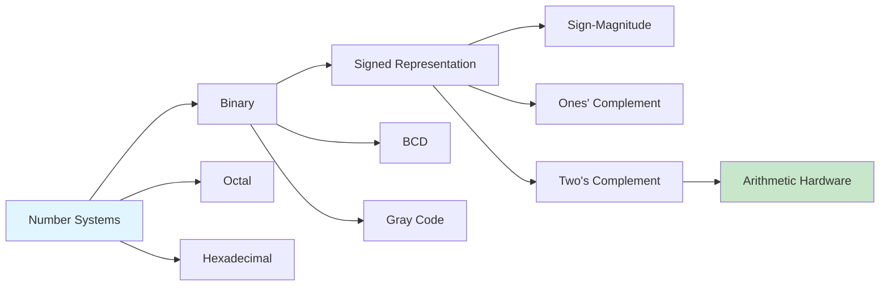

# Chapter 1: Number Systems

> **Prereq:** Basic arithmetic (decimal operations).
> **Next:** Chapter 2 (Boolean Algebra & Logic Gates) — number systems provide the arithmetic basis for Boolean logic.

## Learning Objectives

By the conclusion of this chapter, the student shall be able to:

1. Differentiate between positional and non-positional number systems
2. Convert numbers among decimal, binary, octal, and hexadecimal bases
3. Perform arithmetic operations in non-decimal bases
4. Represent signed integers using sign-magnitude, ones' complement, and two's complement notation
5. Encode decimal digits using binary-coded decimal (BCD)
6. Construct and interpret Gray code sequences

### Chapter at a Glance

| Section | Key Concept | Why It Matters |
|---------|-------------|----------------|
| Positional Number Systems | Digits weighted by powers of base | Foundation for all digital representation |
| Base Conversion | Convert between radices | Translating human ↔ machine representation |
| Signed Representations | Sign-magnitude, ones' comp, two's comp | Negative numbers in binary hardware |
| BCD | 4-bit per decimal digit | Precision-critical financial computation |
| Gray Code | Single-bit transitions | Error reduction in encoders and state machines |

## Theory

### 1.1 Positional Number Systems

A positional number system represents quantities using an ordered set of digits, wherein each digit position carries a weight equal to a power of the base *r*. The general form of a number in base *r* is:

N = d_{n-1} * r^{n-1} + d_{n-2} * r^{n-2} + ... + d_0 * r^0 + d_{-1} * r^{-1} + ... + d_{-m} * r^{-m}

where each digit *d_i* satisfies 0 ≤ *d_i* ≤ *r* - 1.

#### 1.1.1 Decimal System (Base 10)

The decimal system employs ten digits {0, 1, 2, 3, 4, 5, 6, 7, 8, 9} with positional weights that are powers of ten. It is the native system of human arithmetic.

#### 1.1.2 Binary System (Base 2)

The binary system employs two digits {0, 1}, termed bits (binary digits). Positional weights are powers of two. This is the fundamental number system of all digital electronic computers because two stable states (on/off, high/low voltage) map naturally to 0 and 1.

| Power of 2 | 2^7 | 2^6 | 2^5 | 2^4 | 2^3 | 2^2 | 2^1 | 2^0 |
|------------|-----|-----|-----|-----|-----|-----|-----|-----|
| Decimal Value | 128 | 64 | 32 | 16 | 8 | 4 | 2 | 1 |

#### 1.1.3 Octal System (Base 8)

The octal system employs eight digits {0, 1, 2, 3, 4, 5, 6, 7}. It serves as a compact representation of binary data, wherein three binary bits map to one octal digit.

#### 1.1.4 Hexadecimal System (Base 16)

The hexadecimal system employs sixteen digits {0, 1, 2, 3, 4, 5, 6, 7, 8, 9, A, B, C, D, E, F}, where A through F represent decimal values 10 through 15 respectively. Each hexadecimal digit maps to four binary bits.

### 1.2 Base Conversion

#### 1.2.1 Conversion to Decimal

To convert a number from any base to decimal, expand the number using the positional weight formula and sum.

**Algorithm**: For each digit *d_i* at position *i* (where position 0 is the least significant digit), compute *d_i* × *r^i* and accumulate the sum.

#### 1.2.2 Conversion from Decimal

**Integer part**: Repeatedly divide the integer by the target base *r*. Collect the remainders in reverse order (the first remainder is the least significant digit).

**Fractional part**: Repeatedly multiply the fractional part by *r*. Collect the integer parts in forward order.

#### 1.2.3 Shortcut Conversions

Binary to octal: Group binary bits in sets of three, starting from the radix point, and replace each group with the equivalent octal digit.

Binary to hexadecimal: Group binary bits in sets of four and replace each group with the equivalent hexadecimal digit.

### 1.3 Signed Number Representations

Digital systems require methods for representing negative integers. Four principal representations exist.

#### 1.3.1 Sign-Magnitude

The most significant bit (MSB) indicates sign: 0 for positive, 1 for negative. The remaining bits represent the magnitude. For an *n*-bit word, the range is −(2^{n-1} − 1) to +(2^{n-1} − 1). Two representations for zero exist: +0 and −0.

#### 1.3.2 Ones' Complement

Negative numbers are formed by complementing every bit of the positive representation. The range is −(2^{n-1} − 1) to +(2^{n-1} − 1). Two representations for zero persist.

#### 1.3.3 Two's Complement

Negative numbers are formed by taking the ones' complement and adding 1. The range is −2^{n-1} to +(2^{n-1} − 1). A unique representation for zero exists. Two's complement is the dominant signed representation in modern computers because addition hardware need not distinguish signed from unsigned operands.

> **One-Sentence Takeaway:** Two's complement dominates digital design because a single adder circuit handles both signed and unsigned addition — the same XOR gates that add positive numbers also handle negatives without modification.

| Decimal | 4-Bit Two's Complement |
|---------|----------------------|
| +7 | 0111 |
| +6 | 0110 |
| +5 | 0101 |
| +4 | 0100 |
| +3 | 0011 |
| +2 | 0010 |
| +1 | 0001 |
| 0 | 0000 |
| −1 | 1111 |
| −2 | 1110 |
| −3 | 1101 |
| −4 | 1100 |
| −5 | 1011 |
| −6 | 1010 |
| −7 | 1001 |
| −8 | 1000 |

#### 1.3.4 Sign Extension

To widen a two's complement number from *m* bits to *n* bits (*n* > *m*), copy the sign bit into all added higher-order bit positions. This operation preserves the numeric value.

### 1.4 Binary-Coded Decimal (BCD)

BCD encodes each decimal digit as a 4-bit binary sequence. The weighted codes use bits with weights 8, 4, 2, 1 (natural BCD). Only the ten codes 0000 through 1001 are valid; codes 1010 through 1111 are invalid.

| Decimal | BCD |
|---------|-----|
| 0 | 0000 |
| 1 | 0001 |
| 2 | 0010 |
| 3 | 0011 |
| 4 | 0100 |
| 5 | 0101 |
| 6 | 0110 |
| 7 | 0111 |
| 8 | 1000 |
| 9 | 1001 |

BCD is used in applications requiring precise decimal representation, such as financial calculators and digital displays. BCD addition requires correction when the sum exceeds 9: add 6 to the result.

> **Pro Tip:** Gray code is essential in hardware design for crossing clock domains — a multi-bit counter transitioning from 0111 → 1000 could produce arbitrary intermediate values on parallel wires. Gray code guarantees single-bit transitions, eliminating the race condition.

### 1.5 Gray Code

Gray code (reflected binary code) is a binary sequence wherein successive values differ in exactly one bit position. This property is valuable for reducing switching errors in mechanical encoders and for state machines where single-bit transitions prevent glitches.

**Construction**: The *n*-bit Gray code is recursively generated from the (*n* − 1)-bit Gray code by prefixing 0 to the existing sequence and then 1 to the reversed sequence.

| Decimal | Binary | Gray Code |
|---------|--------|-----------|
| 0 | 0000 | 0000 |
| 1 | 0001 | 0001 |
| 2 | 0010 | 0011 |
| 3 | 0011 | 0010 |
| 4 | 0100 | 0110 |
| 5 | 0101 | 0111 |
| 6 | 0110 | 0101 |
| 7 | 0111 | 0100 |

**Binary to Gray**: *G_i* = *B_i* ⊕ *B_{i+1}*, where ⊕ denotes exclusive-OR.

**Gray to Binary**: *B_i* = *G_i* ⊕ *B_{i+1}*, computed from MSB to LSB.

## Examples

### Example 1.1: Binary to Decimal Conversion

Convert 110101.101_2 to decimal.

**Solution**: Expand using positional weights:

110101.101_2 = 1 × 2^5 + 1 × 2^4 + 0 × 2^3 + 1 × 2^2 + 0 × 2^1 + 1 × 2^0 + 1 × 2^{-1} + 0 × 2^{-2} + 1 × 2^{-3}

= 32 + 16 + 0 + 4 + 0 + 1 + 0.5 + 0 + 0.125 = 53.625_10

### Example 1.2: Decimal to Binary Conversion

Convert 89.375_10 to binary.

**Solution**: Integer part (89): 89 ÷ 2 = 44 remainder 1 (LSB); 44 ÷ 2 = 22 remainder 0; 22 ÷ 2 = 11 remainder 0; 11 ÷ 2 = 5 remainder 1; 5 ÷ 2 = 2 remainder 1; 2 ÷ 2 = 1 remainder 0; 1 ÷ 2 = 0 remainder 1 (MSB). Reading remainders upward: 1011001_2.

Fractional part (0.375): 0.375 × 2 = 0.750 integer 0 (MSB); 0.750 × 2 = 1.500 integer 1; 0.500 × 2 = 1.000 integer 1 (LSB). Reading integer parts downward: 011_2.

Result: 1011001.011_2

### Example 1.3: Two's Complement Arithmetic

Compute 7 + (−5) using 4-bit two's complement.

**Solution**: +7 = 0111_2; +5 = 0101_2; −5 = 1010 + 1 = 1011_2.

Add: 0111 + 1011 = 1 0010. Discard the carry-out of the 4-bit adder (the fifth bit is discarded in modulo-16 arithmetic). Result: 0010_2 = +2.

### Example 1.4: Gray Code Conversion

Convert binary 1011_2 to Gray code.

**Solution**: G_3 = B_3 = 1. G_2 = B_3 ⊕ B_2 = 1 ⊕ 0 = 1. G_1 = B_2 ⊕ B_1 = 0 ⊕ 1 = 1. G_0 = B_1 ⊕ B_0 = 1 ⊕ 1 = 0.

Gray code: 1110.

### Concept Comparison

| Representation | Zero Count | Range (n bits) | Hardware Complexity |
|---------------|-----------|----------------|---------------------|
| Sign-Magnitude | 2 (+0, -0) | -(2^{n-1}-1) to +(2^{n-1}-1) | Separate sign logic |
| Ones' Complement | 2 | -(2^{n-1}-1) to +(2^{n-1}-1) | End-around carry |
| Two's Complement | 1 | -2^{n-1} to +(2^{n-1}-1) | Single adder for all |
| BCD | 1 (0000) | 0 to 10^{n/4}-1 | Correction logic needed |

### Quick Reference

| Conversion | Method | Example |
|-----------|--------|---------|
| Binary → Decimal | Sum powers of 2 | 1101 = 8+4+0+1 = 13 |
| Decimal → Binary | Repeat divide by 2 | 13 ÷ 2 = 6 r1 → 1101 |
| Binary → Hex | Group 4 bits | 1101 0110 = D6 |
| Binary → Gray | G_i = B_i ⊕ B_{i+1} | 1011 → 1110 |
| Gray → Binary | B_i = G_i ⊕ B_{i+1} | 1110 → 1011 |

### Cross-Application Matrix

| Domain | Application | Relevance |
|--------|-------------|-----------|
| CPU Design | ALU signed arithmetic | Two's complement enables unified adder |
| Embedded Systems | BCD for financial transactions | Precision decimal representation |
| Digital Circuits | Gray code for state machines | Single-bit transitions prevent glitches |
| Research | Number-theoretic computing | Alternative bases studied in cryptography |

## Summary

- Positional number systems represent quantities using weighted digit positions.
- The binary system (base 2) is fundamental to all digital computing.
- Octal and hexadecimal provide compact notation for binary data.
- Base conversion between any two radices proceeds via repeated division (integer part) or multiplication (fractional part).
- Two's complement is the standard signed representation, enabling unified addition hardware.
- BCD encodes decimal digits in 4-bit binary groups for precision-sensitive applications.
- Gray code ensures single-bit transitions between adjacent values.

## Exercises

### Review Questions

1. Explain why the binary number system is used in digital computers.
2. Convert 110110_2 to decimal.
3. Convert 3A7_16 to decimal.
4. How many bits are required to represent decimal numbers from 0 to 10000?
5. Distinguish between ones' complement and two's complement representation.

### Application Problems

1. Perform the base conversions:
   a) 237_10 to binary
   b) 11001101_2 to hexadecimal
   c) 0.6875_10 to binary
   d) 101110.101_2 to octal

2. Represent −42 in 8-bit sign-magnitude, ones' complement, and two's complement.

3. Perform the following 6-bit two's complement additions and indicate overflow:
   a) 101011 + 001001
   b) 011100 + 001010
   c) 110110 + 101001

4. Encode the decimal number 589 in BCD and perform BCD addition with 326. Apply the correction step where necessary.

5. Generate the 5-bit Gray code sequence and verify the single-bit transition property for all 32 entries.

### Challenge Problem

Design a circuit that accepts a 4-bit binary number and outputs its two's complement. The circuit should also produce an error flag when the input is 1000 (−8), since this value has no positive counterpart in 4-bit two's complement.     Describe the truth table and minimal logic expressions.

### Chapter Quiz

1. Two's complement is the dominant signed representation because:
   - A) It has two representations for zero
   - B) The same adder circuit handles both signed and unsigned operations
   - C) It requires fewer bits than sign-magnitude
   - D) It does not support negative numbers

2. Gray code ensures which property between successive values?
   - A) All bits change
   - B) Exactly one bit changes
   - C) The numeric difference is always 1
   - D) No bits change

3. BCD addition of 9 + 7 produces what invalid result requiring correction?
   - A) 1111 (valid), no correction needed
   - B) 1 0000 (valid BCD), no correction
   - C) 1 0000 (invalid — sum > 9), add 6 to correct
   - D) 0110 (valid), no correction

Answers

1. B, 2. B, 3. C

