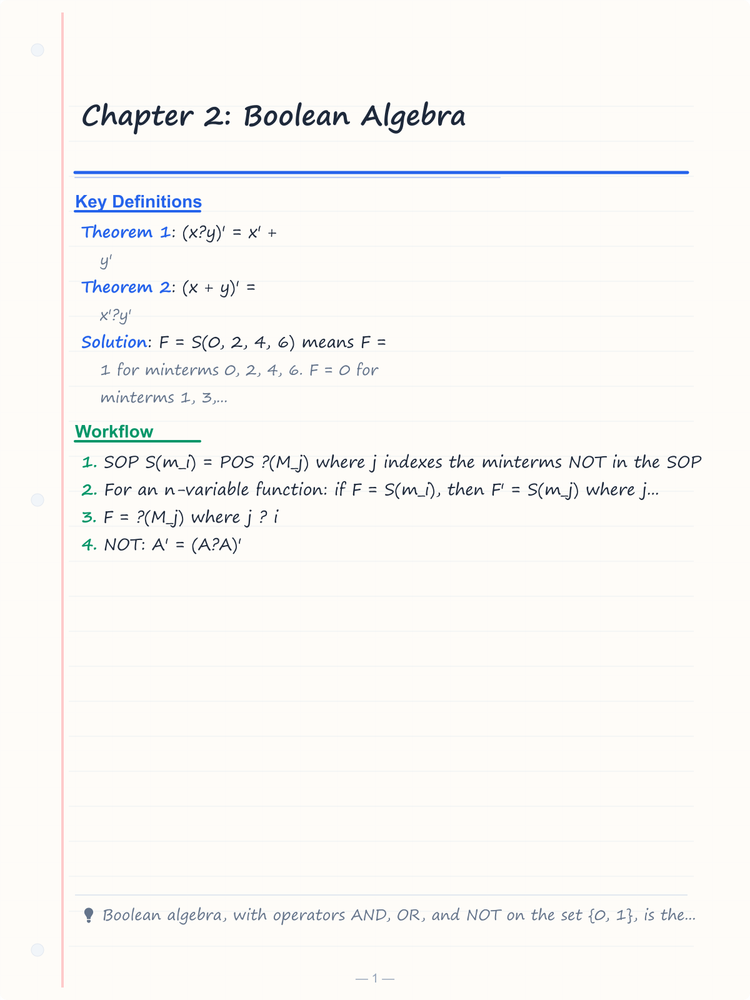
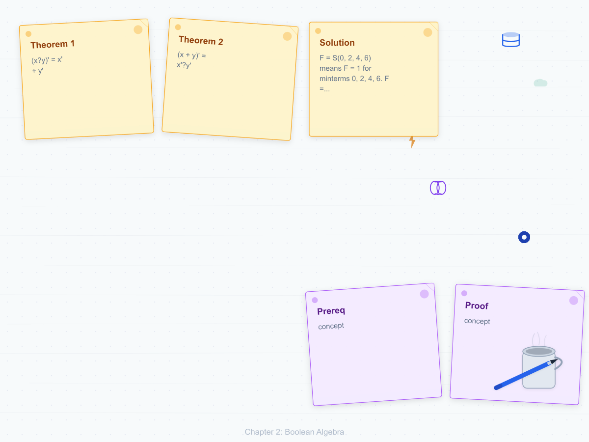
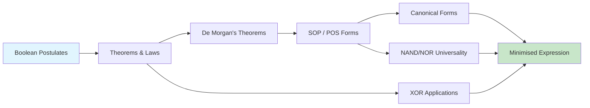
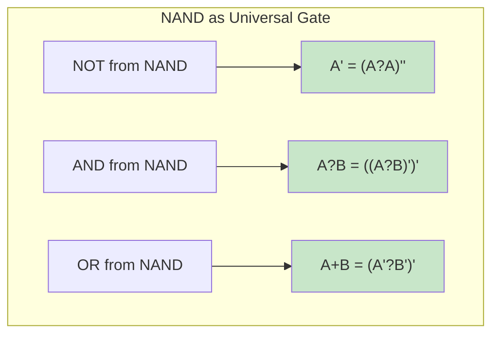
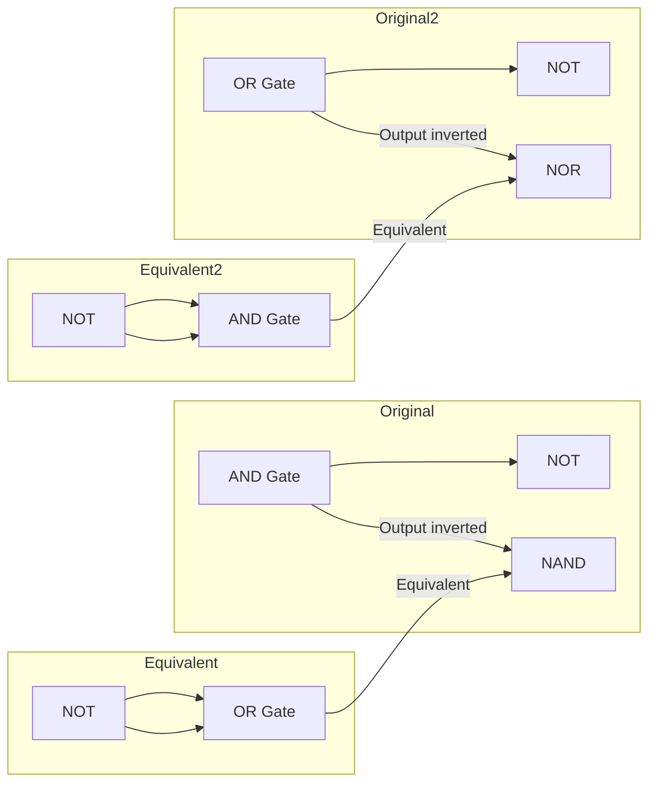

# Chapter 2: Boolean Algebra

> **Prereq:** Chapter 1 (Number Systems) ? binary values 0/1 are the domain of Boolean algebra.
> **Next:** Chapter 3 (Logic Gates) ? Boolean algebra directly describes gate behavior.

## Learning Objectives

By the conclusion of this chapter, the student shall be able to:

<!-- Image Gallery -->
<section class="lesson-visuals" aria-label="Visual learning resources">
  <header><span>VISUAL LEARNING</span><h2>See it. Review it. Remember it.</h2></header>
  <a class="lesson-visual-card" href="../../assets/images/lessons/digital-logic/02-boolean-algebra/handwritten-notes.png" target="_blank" rel="noopener">
    
    <span><strong>Handwritten notes</strong>Condensed notes for deliberate review.</span>
  </a>
  <a class="lesson-visual-card" href="../../assets/images/lessons/digital-logic/02-boolean-algebra/sticky-notes.png" target="_blank" rel="noopener">
    
    <span><strong>Sticky-note revision</strong>Fast recall prompts for revision.</span>
  </a>
  <a class="lesson-visual-card" href="../../assets/images/lessons/digital-logic/02-boolean-algebra/visual-explanation.png" target="_blank" rel="noopener">
    
    <span><strong>Visual concept guide</strong>A connected explanation of the key ideas.</span>
  </a>
</section>
<!-- End Image Gallery -->


1. State and apply the fundamental postulates and theorems of Boolean algebra
2. Simplify Boolean expressions using algebraic manipulation with formal proof steps
3. Apply De Morgan's theorems to complement expressions and convert gate types
4. Derive sum-of-products (SOP) and product-of-sums (POS) canonical forms from truth tables
5. Implement any Boolean function using only NAND or only NOR gates
6. Analyse XOR applications in parity, comparators, and adders
7. Determine functional completeness of gate sets

### Chapter at a Glance

| Section | Key Concept | Why It Matters |
|---------|-------------|----------------|
| Boolean Postulates | OR, AND, NOT axioms | Foundation of all digital logic |
| Fundamental Theorems | Idempotence, absorption, consensus | Enable algebraic simplification |
| De Morgan's Theorems | Complement of sum/product | Convert gate types (AND-OR ? NAND-NAND) |
| Canonical Forms | SOP and POS | Uniquely represent any Boolean function |
| NAND/NOR Universality | Single gate type for any function | IC manufacturing prefers one gate type |
| XOR Applications | Parity, comparison, addition | Key building block for arithmetic |
| Function Completeness | Minimal gate sets | Understanding logic universality |



## Theory

### 2.1 Boolean Postulates


Boolean algebra, introduced by George Boole in 1854 and adapted by Claude Shannon in 1938 for switching circuit analysis, is a mathematical system defined on a set of two elements {0, 1} with operators + (OR) and ? (AND), and complement (NOT).

The fundamental postulates are as follows:

| Postulate | OR Form | AND Form |
|-----------|---------|----------|
| Identity | x + 0 = x | x ? 1 = x |
| Commutativity | x + y = y + x | x ? y = y ? x |
| Associativity | (x + y) + z = x + (y + z) | (x ? y) ? z = x ? (y ? z) |
| Distributivity | x ? (y + z) = x?y + x?z | x + (y?z) = (x + y)?(x + z) |
| Complement | x + x' = 1 | x ? x' = 0 |

### 2.2 Fundamental Theorems


| Theorem | OR Form | AND Form |
|---------|---------|----------|
| Idempotence | x + x = x | x ? x = x |
| Null element | x + 1 = 1 | x ? 0 = 0 |
| Involution | (x')' = x | ? |
| Absorption | x + x?y = x | x?(x + y) = x |
| Adjacency | x?y + x?y' = x | (x + y)?(x + y') = x |
| Consensus | x?y + x'?z + y?z = x?y + x'?z | (x+y)?(x'+z)?(y+z) = (x+y)?(x'+z) |
| De Morgan | (x?y)' = x' + y' | (x + y)' = x'?y' |

#### 2.2.1 Proof of Absorption Theorem

Prove: x + x?y = x

**Proof**:
x + x?y = x?1 + x?y (Identity)
= x?(1 + y) (Distributivity)
= x?1 (Null element: 1 + y = 1)
= x (Identity)

#### 2.2.2 Proof of Consensus Theorem

Prove: x?y + x'?z + y?z = x?y + x'?z

**Proof**:
x?y + x'?z + y?z = x?y + x'?z + y?z?(x + x') (Complement)
= x?y + x'?z + x?y?z + x'?y?z (Distributivity)
= x?y?(1 + z) + x'?z?(1 + y) (Distributivity)
= x?y?1 + x'?z?1 (Null element)
= x?y + x'?z (Identity)

### 2.3 De Morgan's Theorems


Augustus De Morgan formulated two transformation rules of singular importance:

**Theorem 1**: (x?y)' = x' + y'

**Theorem 2**: (x + y)' = x'?y'

These generalise to n variables:
(x_1?x_2?...?x_n)' = x_1' + x_2' + ... + x_n'
(x_1 + x_2 + ... + x_n)' = x_1'?x_2'?...?x_n'

De Morgan's theorems are essential for converting AND-OR networks to NAND-NAND or NOR-NOR equivalents.

**Proof of Theorem 1 by truth table**:

| x | y | x?y | (x?y)' | x' | y' | x' + y' |
|---|---|:---:|:------:|:---:|:---:|:-------:|
| 0 | 0 | 0 | 1 | 1 | 1 | 1 |
| 0 | 1 | 0 | 1 | 1 | 0 | 1 |
| 1 | 0 | 0 | 1 | 0 | 1 | 1 |
| 1 | 1 | 1 | 0 | 0 | 0 | 0 |

The columns for (x?y)' and x' + y' match for all four input combinations, proving equivalence.

### 2.4 Canonical Forms


#### 2.4.1 Minterms and Maxterms

A **minterm** is a product term in which every variable appears exactly once, either complemented or uncomplemented. For n variables, there exist 2^n distinct minterms.

A **maxterm** is a sum term in which every variable appears exactly once. For n variables, there exist 2^n distinct maxterms.

| x | y | z | Minterm | Notation | Maxterm | Notation |
|---|---|---|---|---|---|---|
| 0 | 0 | 0 | x'y'z' | m_0 | x+y+z | M_0 |
| 0 | 0 | 1 | x'y'z | m_1 | x+y+z' | M_1 |
| 0 | 1 | 0 | x'yz' | m_2 | x+y'+z | M_2 |
| 0 | 1 | 1 | x'yz | m_3 | x+y'+z' | M_3 |
| 1 | 0 | 0 | xy'z' | m_4 | x'+y+z | M_4 |
| 1 | 0 | 1 | xy'z | m_5 | x'+y+z' | M_5 |
| 1 | 1 | 0 | xyz' | m_6 | x'+y'+z | M_6 |
| 1 | 1 | 1 | xyz | m_7 | x'+y'+z' | M_7 |

#### 2.4.2 Sum-of-Products (SOP)

A Boolean function expressed as the OR of minterms for which the function output is 1.

F(x, y, z) = m_1 + m_3 + m_5 + m_7 = S(1, 3, 5, 7)
F = x'y'z + x'yz + xy'z + xyz = z?(x'y' + x'y + xy' + xy) = z?(x'(y'+y) + x(y'+y)) = z?(x' + x) = z

#### 2.4.3 Product-of-Sums (POS)

A Boolean function expressed as the AND of maxterms for which the function output is 0.

F(x, y, z) = M_0?M_2?M_4?M_6 = ?(0, 2, 4, 6)
F = (x+y+z)?(x+y'+z)?(x'+y+z)?(x'+y'+z)

#### 2.4.4 Conversion Between SOP and POS

Any Boolean function can be expressed in both forms. To convert:
- SOP S(m_i) = POS ?(M_j) where j indexes the minterms NOT in the SOP
- For an n-variable function: if F = S(m_i), then F' = S(m_j) where j ? i
- F = ?(M_j) where j ? i

### 2.5 NAND and NOR as Universal Gates


NAND and NOR are termed universal gates because either alone suffices to implement any Boolean expression.

**NAND as universal gate**:
- NOT: A' = (A?A)'
- AND: A?B = [(A?B)']'
- OR: A + B = (A'?B')' = (A?A)'?(B?B)'

**NOR as universal gate**:
- NOT: A' = (A + A)'
- OR: A + B = [(A + B)']'
- AND: A?B = (A' + B')' = (A+A)' + (B+B)'



### 2.6 XOR Applications


The XOR (exclusive-OR) function produces 1 when inputs differ: A ? B = A'B + AB'.

**Applications**:
1. **Parity generation**: XOR tree produces even/odd parity. An n-bit parity generator uses n-1 XOR gates.
2. **Magnitude comparison**: A ? B = 0 when A = B. XOR followed by NOR produces equality detection.
3. **Half adder**: Sum = A ? B, Carry = A?B.
4. **Controlled inverter**: B ? control. When control=1, output is B' (complement). When control=0, output is B.
5. **Pseudo-random number generation**: Linear feedback shift registers (LFSRs) use XOR for feedback taps.

```typescript
function xorParity(data: boolean[]): boolean {
    return data.reduce((acc, bit) => acc !== bit, false);
}

function magnitudeEqual(a: boolean[], b: boolean[]): boolean {
    return a.every((bit, i) => bit === b[i]);
}
```

### 2.7 Function Completeness


A set of logic operators is **functionally complete** if any Boolean function can be expressed using only operators from that set.

| Gate Set | Complete? | Notes |
|----------|-----------|-------|
| {AND, OR, NOT} | Yes | Standard Boolean basis |
| {AND, NOT} | Yes | NAND = (A?B)' can be built |
| {OR, NOT} | Yes | NOR = (A+B)' can be built |
| {NAND} | Yes | Universal gate |
| {NOR} | Yes | Universal gate |
| {AND, OR} | No | Cannot implement NOT |
| {XOR, AND} | No | Cannot implement OR/NOT alone |
| {XOR, 1} | No | Linear functions only |

**Proof that {AND, NOT} is complete**:
- NOT is available
- A + B = (A'?B')' (De Morgan)
- Since AND and NOT give us OR, every function is realizable

**Proof that {NAND} is complete**:
- NOT: A' = (A?A)'
- AND: A?B = ((A?B)')'
- OR: A + B = (A'?B')' = ((A?A)'?(B?B)')'

### 2.8 Boolean Expression Minimisation


```typescript
interface TruthTableEntry {
    inputs: boolean[];
    output: boolean;
}

function evaluateSOP(expression: string, variables: string[], values: boolean[]): boolean {
    // Parse SOP expression like "AB + A'C" and evaluate
    const terms = expression.split("+").map(t => t.trim());
    return terms.some(term => {
        let result = true;
        let i = 0;
        while (i < term.length) {
            const isComplemented = term[i] === "'";
            const varName = isComplemented ? term[++i] : term[i];
            const varIndex = variables.indexOf(varName);
            if (varIndex === -1) throw new Error(`Unknown variable: ${varName}`);
            const value = isComplemented ? !values[varIndex] : values[varIndex];
            result &&= value;
            i++;
        }
        return result;
    });
}
```

## Examples

### Example 2.1: Algebraic Simplification with Proof Steps

Simplify F = x?y + x?z + y?z using Boolean algebra, showing each step.

**Solution**:
F = x?y + x?z + y?z
= x?y + x?z + y?z?(x + x') (Complement: x + x' = 1)
= x?y + x?z + x?y?z + x'?y?z (Distributivity)
= x?y?(1 + z) + x?z + x'?y?z (Distributivity)
= x?y?1 + x?z + x'?y?z (Null element: 1 + z = 1)
= x?y + x?z + x'?y?z (Identity)
= x?y + z?(x + x'?y) (Distributivity)
= x?y + z?(x + y) (Absorption: x + x'y = x + y)
= x?y + x?z + y?z (Distributivity)

The expression returned to its original form ? it is a consensus form and cannot be simplified.

### Example 2.2: Conversion Between Canonical Forms

Given F(A,B,C) = S(0, 2, 4, 6), express F in POS form.

**Solution**: F = S(0, 2, 4, 6) means F = 1 for minterms 0, 2, 4, 6. F = 0 for minterms 1, 3, 5, 7.
F' = S(1, 3, 5, 7) = A'B'C + A'BC + AB'C + ABC = C?(A'B' + A'B + AB' + AB) = C
F = (F')' = C'
In POS: F = ?(1, 3, 5, 7) = M_1?M_3?M_5?M_7 = (A+B+C')?(A+B'+C')?(A'+B+C')?(A'+B'+C')

The minimal expression is simply C'.

### Example 2.3: De Morgan Application

Apply De Morgan's theorem to find the complement of F = (A + B?C)?(A' + C).

**Solution**:
F' = [(A + B?C)?(A' + C)]' = (A + B?C)' + (A' + C)'

Apply De Morgan to each term:
(A + B?C)' = A'?(B?C)' = A'?(B' + C')
(A' + C)' = A?C'

Therefore: F' = A'?(B' + C') + A?C' = A'?B' + A'?C' + A?C' = A'?B' + C'?(A' + A) = A'?B' + C'

### Example 2.4: NAND-Only Implementation

Implement F = A?B + C?D using only NAND gates.

**Solution**:
F = A?B + C?D
= [(A?B)']' + [(C?D)']' (Double complement)
= ([(A?B)']'?[(C?D)']')' (De Morgan applied backwards: X+Y = (X'?Y')')
= [(A?B)'?(C?D)']'

Implementation: Three NAND gates ? two for the AND functions, one for the OR function expressed as a NAND.

### Example 2.5: XOR Application ? Parity Checker

Design a 4-bit even parity checker using XOR gates.

**Solution**: P = A ? B ? C ? D. P = 0 when there is an even number of 1s. Implementation uses three XOR gates in a tree structure: XOR1 = A?B, XOR2 = C?D, P = XOR1?XOR2.

```typescript
function evenParity(bits: boolean[]): boolean {
    return bits.reduce((p, b) => p !== b, false);
}
// evenParity([true, false, true, false]) ? false (2 ones = even)
// evenParity([true, false, true, true]) ? true (3 ones = odd)
```

### Concept Comparison

| Minimisation Method | Best For | Strengths | Weaknesses |
|-------------------|----------|-----------|------------|
| Algebraic | Any | Insightful, no tool needed | Error-prone, no optimality guarantee |
| K-Map | =4 variables | Visual, fast, optimal | Unwieldy for 5+ variables |
| Quine-McCluskey | 5-16 variables | Algorithmic | Slow for many inputs |

### Quick Reference

| Theorem | Expression | Use |
|---------|-----------|-----|
| Absorption | x + x?y = x | Eliminates redundant terms |
| Adjacency | x?y + x?y' = x | Combines adjacent minterms |
| De Morgan 1 | (x?y)' = x' + y' | AND ? NOR conversion |
| De Morgan 2 | (x+y)' = x'?y' | OR ? NAND conversion |
| Consensus | x?y + x'?z + y?z = x?y + x'?z | Eliminates redundant term |

### Cross-Application Matrix

| Domain | Application | Relevance |
|--------|-------------|-----------|
| CPU Design | ALU control logic | Boolean minimisation reduces gate count |
| Embedded Systems | Firmware state machines | Simplified expressions save area |
| Digital Circuits | IC design and synthesis | EDA tools use Boolean minimisation |
| Research | Formal verification | Boolean equivalence checking |

## Practical Takeaways

1. **Proofs matter** ? every algebraic simplification step should be justified by a postulate or theorem.
2. **De Morgan's theorems are the key to universality** ? they convert between AND-OR and NAND-NAND forms.
3. **Canonical forms guarantee uniqueness** ? any function has exactly one canonical SOP and one canonical POS.
4. **XOR is more useful than it seems** ? parity, comparators, adders, and LFSRs all rely on XOR.
5. **Function completeness tells you what gates you need** ? {NAND} alone suffices for any digital circuit.

## TypeScript Examples

### Truth Table Generator

This class generates truth tables from Boolean expressions specified in SOP (sum-of-products) form:

```typescript
interface TruthTableRow {
  inputs: Record<string, number>;
  output: number;
}

class TruthTableGenerator {
  static generate(variables: string[], expression: (vals: Record<string, number>) => number): TruthTableRow[] {
    const rows: TruthTableRow[] = [];
    const n = variables.length;
    for (let i = 0; i < 1 << n; i++) {
      const vals: Record<string, number> = {};
      for (let j = 0; j < n; j++) {
        vals[variables[j]] = (i >> (n - 1 - j)) & 1;
      }
      rows.push({ inputs: vals, output: expression(vals) });
    }
    return rows;
  }

  static print(rows: TruthTableRow[], label: string = "Truth Table"): void {
    const vars = Object.keys(rows[0].inputs);
    const header = [...vars, "F"].join(" | ");
    const sep = vars.map(() => "---").join(" | ") + " | ---";
    console.log(`\n=== ${label} ===`);
    console.log(`| ${header} |`);
    console.log(`| ${sep} |`);
    for (const row of rows) {
      const vals = vars.map(v => row.inputs[v]).join(" | ");
      console.log(`| ${vals} | ${row.output} |`);
    }
  }
}

const F_A = TruthTableGenerator.generate(["A", "B"], ({ A, B }) => (A && B) ? 1 : 0);
TruthTableGenerator.print(F_A, "AND Gate");

const F_XOR = TruthTableGenerator.generate(["X", "Y"], ({ X, Y }) => X ^ Y);
TruthTableGenerator.print(F_XOR, "XOR Gate");

const F_MAJ = TruthTableGenerator.generate(["A", "B", "C"],
  ({ A, B, C }) => (A + B + C >= 2) ? 1 : 0);
TruthTableGenerator.print(F_MAJ, "Majority Circuit");

const F_SOP = TruthTableGenerator.generate(["A", "B", "C"],
  ({ A, B, C }) => (!A && !B && C) || (!A && B && C) || (A && B && !C) ? 1 : 0);
TruthTableGenerator.print(F_SOP, "F = S(1,3,6)");
```

### Boolean Expression Engine

A simple engine that tokenizes and evaluates Boolean expressions:

```typescript
type BoolToken =
  | { type: "VAR"; name: string }
  | { type: "NOT" }
  | { type: "AND" }
  | { type: "OR" }
  | { type: "XOR" }
  | { type: "LPAREN" }
  | { type: "RPAREN" };

class BooleanEngine {
  static tokenize(expr: string): BoolToken[] {
    const tokens: BoolToken[] = [];
    for (const ch of expr.replace(/\s+/g, "")) {
      if (/[A-Z]/i.test(ch)) tokens.push({ type: "VAR", name: ch.toUpperCase() });
      else if (ch === "'" || ch === "!") tokens.push({ type: "NOT" });
      else if (ch === "?" || ch === "*" || ch === "&") tokens.push({ type: "AND" });
      else if (ch === "+" || ch === "|") tokens.push({ type: "OR" });
      else if (ch === "?" || ch === "^") tokens.push({ type: "XOR" });
      else if (ch === "(") tokens.push({ type: "LPAREN" });
      else if (ch === ")") tokens.push({ type: "RPAREN" });
      else throw new Error(`Unknown token: ${ch}`);
    }
    return tokens;
  }

  static evaluate(expr: string, vars: Record<string, number>): number {
    const t = this.tokenize(expr);
    const evalExpr = (tokens: BoolToken[], start: number): { val: number; end: number } => {
      let result: number = -1;
      let op: string | null = null;
      let i = start;
      const next = (): number => {
        if (i >= tokens.length) throw new Error("Unexpected end");
        const tok = tokens[i];
        if (tok.type === "NOT") { i++; return next() ^ 1; }
        if (tok.type === "LPAREN") { i++; const r = evalExpr(tokens, i); i = r.end; return r.val; }
        if (tok.type === "VAR") { i++; return vars[tok.name] ?? 0; }
        throw new Error(`Unexpected token at ${i}`);
      };
      result = next();
      while (i < tokens.length) {
        const tok = tokens[i];
        if (tok.type === "RPAREN") { i++; break; }
        if (tok.type === "AND" || tok.type === "OR" || tok.type === "XOR") {
          op = tok.type; i++;
          const r = next();
          result = op === "AND" ? result & r : op === "OR" ? result | r : result ^ r;
        } else break;
      }
      return { val: result, end: i };
    };
    return evalExpr(t, 0).val;
  }

  static generateTruthTable(expr: string, variables: string[]): TruthTableRow[] {
    return TruthTableGenerator.generate(variables, (vals) => this.evaluate(expr, vals));
  }
}

const be = BooleanEngine;
console.log("\n=== Boolean Expression Evaluation ===");
const vars1 = { A: 1, B: 0, C: 1 };
console.log(`  A?B + C with A=1,B=0,C=1: ${be.evaluate("A*B+C", vars1)}`);
console.log(`  (A+B)'?C with A=1,B=0,C=1: ${be.evaluate("!(A+B)*C", vars1)}`);
console.log(`  A?B?C with A=1,B=0,C=1: ${be.evaluate("A^B^C", vars1)}`);

TruthTableGenerator.print(
  be.generateTruthTable("(A+B)*(A+C)", ["A", "B", "C"]),
  "F = (A+B)(A+C) = A + BC"
);
```

### Algebraic Simplification Demonstrator

```typescript
class BooleanSimplifier {
  static absorptionLaw(a: number, b: number): Record<string, number> {
    return {
      "A + A?B": a | (a & b),
      "A": a,
      "A?(A + B)": a & (a | b),
      "Equal? A + A?B == A": (a | (a & b)) === a ? 1 : 0,
      "Equal? A?(A+B) == A": (a & (a | b)) === a ? 1 : 0,
    };
  }

  static consensusLaw(a: number, b: number, c: number): Record<string, number> {
    return {
      "A?B + A'?C + B?C": (a & b) | ((a ^ 1) & c) | (b & c),
      "A?B + A'?C": (a & b) | ((a ^ 1) & c),
      "Equal?": ((a & b) | ((a ^ 1) & c) | (b & c)) === ((a & b) | ((a ^ 1) & c)) ? 1 : 0,
    };
  }

  static deMorganVerify(a: number, b: number): Record<string, number> {
    return {
      "(A?B)'": ((a & b) ^ 1),
      "A' + B'": ((a ^ 1) | (b ^ 1)),
      "Equal?": ((a & b) ^ 1) === ((a ^ 1) | (b ^ 1)) ? 1 : 0,
      "(A+B)'": ((a | b) ^ 1),
      "A'?B'": ((a ^ 1) & (b ^ 1)),
      "Equal?": ((a | b) ^ 1) === ((a ^ 1) & (b ^ 1)) ? 1 : 0,
    };
  }
}

console.log("\n=== Absorption Law Verification ===");
for (const a of [0, 1]) for (const b of [0, 1]) {
  const r = BooleanSimplifier.absorptionLaw(a, b);
  console.log(`  A=${a}, B=${b}: A+A?B=${r["A + A?B"]}, A?(A+B)=${r["A?(A + B)"]}, Equal? ${r["Equal? A + A?B == A"]}`);
}

console.log("\n=== Consensus Theorem Verification ===");
for (const a of [0, 1]) for (const b of [0, 1]) for (const c of [0, 1]) {
  const r = BooleanSimplifier.consensusLaw(a, b, c);
  console.log(`  A=${a}, B=${b}, C=${c}: ${r["Equal?"] ? "A?B + A'?C + B?C = A?B + A'?C ?" : "FAIL"}`);
}

console.log("\n=== De Morgan's Theorem Verification ===");
console.log("  A B | (A?B)' | A'+B' | Equal | (A+B)' | A'?B' | Equal");
for (const a of [0, 1]) for (const b of [0, 1]) {
  const r = BooleanSimplifier.deMorganVerify(a, b);
  console.log(`  ${a} ${b} |   ${r["(A?B)'"]}    |  ${r["A' + B'"]}    |  ${r["Equal?"]}    |   ${r["(A+B)'"]}    |  ${r["A'?B'"]}    |  ${r["Equal?"]}`);
}

console.log("\n=== All Canonical Minterms (3 variables) ===");
const allMinterms = TruthTableGenerator.generate(["A", "B", "C"],
  () => 1);
TruthTableGenerator.print(allMinterms, "All 8 minterms");
```

### Boolean Function Equivalence Checker

```typescript
class FunctionChecker {
  static areEquivalent(
    vars: string[],
    f1: (v: Record<string, number>) => number,
    f2: (v: Record<string, number>) => number
  ): boolean {
    const n = vars.length;
    for (let i = 0; i < 1 << n; i++) {
      const vals: Record<string, number> = {};
      for (let j = 0; j < n; j++) {
        vals[vars[j]] = (i >> (n - 1 - j)) & 1;
      }
      if (f1(vals) !== f2(vals)) return false;
    }
    return true;
  }

  static checkDistributive(): void {
    const vars = ["A", "B", "C"];
    const lhs = (v: Record<string, number>) => v.A & (v.B | v.C);
    const rhs = (v: Record<string, number>) => (v.A & v.B) | (v.A & v.C);
    const distributive = this.areEquivalent(vars, lhs, rhs);
    console.log(`  A?(B+C) == (A?B)+(A?C): ${distributive ? "? EQUIVALENT" : "? NOT EQUIVALENT"}`);
  }

  static checkXORProperties(): void {
    const vars = ["A", "B"];
    const xorComm = this.areEquivalent(vars,
      v => v.A ^ v.B, v => v.B ^ v.A);
    console.log(`  A?B == B?A: ${xorComm ? "? COMMUTATIVE" : "? NOT"}`);
  }
}

console.log("\n=== Function Equivalence ===");
FunctionChecker.checkDistributive();
FunctionChecker.checkXORProperties();

const sopForm = (v: Record<string, number>) =>
  ((~v.A) & (~v.B) & v.C) | ((~v.A) & v.B & v.C) | (v.A & v.B & (~v.C));
const simplified = (v: Record<string, number>) =>
  ((~v.A) & v.C) | (v.A & v.B & (~v.C));
const equiv = FunctionChecker.areEquivalent(["A", "B", "C"], sopForm, simplified);
console.log(`  F = S(1,3,6) simplified: ${equiv ? "? EQUIVALENT" : "? NOT EQUIVALENT"}`);
```

## Mermaid Diagrams

### Boolean Algebra Hierarchy

```mermaid
flowchart TD
    BA[Boolean Algebra] --> P[Postulates]
    BA --> T[Theorems]
    BA --> C[Canonical Forms]
    BA --> M[Minimisation]

    P --> C1[Closure]
    P --> C2[Identity: 0, 1]
    P --> C3[Commutativity]
    P --> C4[Distributivity]
    P --> C5[Complements]
    P --> C6[Associativity]

    T --> DM[De Morgan's Laws]
    T --> AB[Absorption]
    T --> CN[Consensus]
    T --> INV[Involution]
    T --> SH[Shannon Expansion]

    C --> SOP[Sum of Products<br/>S minterms]
    C --> POS[Product of Sums<br/>? maxterms]

    M --> ALG[Algebraic]
    M --> KM[Karnaugh Maps]
    M --> QMC[Quine-McCluskey]

    DM -->|(A?B)' = A' + B'| DM1
    DM -->|(A+B)' = A'?B'| DM2
```

### De Morgan's Law ? Gate Transformations



### Canonical Form Conversion Flow

```mermaid
flowchart LR
    F[F = A?B + C] -->|Expand missing vars| SOP[Canonical SOP<br/>F = S(5,6,7)]
    F -->|Complement & expand| POS[Canonical POS<br/>F = ?(0,1,2,3,4)]
    SOP -->|Complement & simplify| POS
    POS -->|Complement & expand| SOP
    SOP -->|Read from 1s in truth table| TT[Truth Table]
    POS -->|Read from 0s in truth table| TT
    TT -->|Minterms ? 1s| SOP
    TT -->|Maxterms ? 0s| POS
```

## TypeScript Implementations

```typescript
// === Truth Table Generator ===
function truthTable(vars: number, expr: (inputs: number[]) => number): string {
    let result = '';
    const headers = Array.from({ length: vars }, (_, i) => String.fromCharCode(65 + i)).join(' | ');
    result += `${headers} | F\n${'---|-'.repeat(vars)}---|----\n`;
    for (let i = 0; i < (1 << vars); i++) {
        const inputs = Array.from({ length: vars }, (_, j) => (i >> (vars - 1 - j)) & 1);
        const out = expr(inputs);
        result += `${inputs.join(' | ')} | ${out}\n`;
    }
    return result;
}

// === Boolean Expression Evaluator ===
type GateOp = 'AND' | 'OR' | 'NAND' | 'NOR' | 'XOR' | 'XNOR' | 'NOT';
function evaluateGate(op: GateOp, a: number, b: number = 0): number {
    switch (op) {
        case 'AND': return a & b;
        case 'OR': return a | b;
        case 'NAND': return ~(a & b) & 1;
        case 'NOR': return ~(a | b) & 1;
        case 'XOR': return a ^ b;
        case 'XNOR': return ~(a ^ b) & 1;
        case 'NOT': return ~a & 1;
    }
}

// === Minterm / Maxterm Calculator ===
function minterms(vars: number, expr: (inputs: number[]) => number): number[] {
    const result: number[] = [];
    for (let i = 0; i < (1 << vars); i++) {
        const inputs = Array.from({ length: vars }, (_, j) => (i >> (vars - 1 - j)) & 1);
        if (expr(inputs) === 1) result.push(i);
    }
    return result;
}
function maxterms(vars: number, expr: (inputs: number[]) => number): number[] {
    const result: number[] = [];
    for (let i = 0; i < (1 << vars); i++) {
        const inputs = Array.from({ length: vars }, (_, j) => (i >> (vars - 1 - j)) & 1);
        if (expr(inputs) === 0) result.push(i);
    }
    return result;
}

// === Boolean Simplifier (Algebraic rules) ===
function simplifyBoolean(expr: string): string {
    let s = expr
        .replace(/A\+A'?/g, '1').replace(/A'?\+A/g, '1')
        .replace(/A?A'?/g, '0').replace(/A'??A/g, '0')
        .replace(/A\+A/g, 'A').replace(/A?A/g, 'A')
        .replace(/A\+0/g, 'A').replace(/A?1/g, 'A')
        .replace(/A?0/g, '0').replace(/A\+1/g, '1')
        .replace(/A''/g, 'A');
    return s;
}

// === Dual Function ===
function dual(expr: string): string {
    return expr.replace(/\+/g, 'T').replace(/?/g, '+').replace(/T/g, '?');
}

// === Boolean Difference (Shannon Expansion) ===
function booleanDiff(expr: (x: number[]) => number, vars: number, idx: number): number[] {
    const result: number[] = [];
    for (let i = 0; i < (1 << (vars - 1)); i++) {
        const inputs0: number[] = [];
        const inputs1: number[] = [];
        let pos = 0;
        for (let j = 0; j < vars; j++) {
            if (j === idx) { inputs0.push(0); inputs1.push(1); }
            else {
                const bit = (i >> (vars - 2 - pos)) & 1;
                inputs0.push(bit); inputs1.push(bit);
                pos++;
            }
        }
        result.push(expr(inputs0) ^ expr(inputs1));
    }
    return result;
}

// === Demo ===
const f = (x: number[]) => (x[0] & x[1]) | (~x[0] & x[2]);
console.log('Truth table for F = A?B + A\'?C:');
console.log(truthTable(3, f));
console.log('Minterms:', minterms(3, f));
console.log('Maxterms:', maxterms(3, f));
console.log('Simplify A?B + A?B\':', simplifyBoolean('A?B+A?B\''));
console.log('Dual of A+B?C:', dual('A+B?C'));
```


// boolean algebra
// boolean-circuits-sequential implementation

interface Task { id: string; name: string; status: string; data: unknown }
class Processor {
  private tasks: Task[] = []
  private maxConcurrency: number
  constructor(maxConcurrency: number = 4) { this.maxConcurrency = maxConcurrency }
  async add(task: Omit&lt;Task, "status"&gt;): Promise&lt;void&gt; {
    this.tasks.push({ ...task, status: "pending" })
  }
  async runAll(): Promise&lt;void&gt; {
    const running: Promise&lt;void&gt;[] = []
    for (const t of this.tasks) {
      if (running.length >= this.maxConcurrency) { await Promise.race(running) }
      const p = this.execute(t).finally(() => { const i = running.indexOf(p); if (i >= 0) running.splice(i, 1) })
      running.push(p)
    }
    await Promise.all(running)
  }
  private async execute(t: Task): Promise&lt;void&gt; {
    t.status = "running"
    await new Promise(r => setTimeout(r, 10))
    t.status = "done"
  }
  getResults(): Task[] { return this.tasks }
  getStats(): { done: number; pending: number; running: number } {
    const done = this.tasks.filter(t => t.status === "done").length
    const pending = this.tasks.filter(t => t.status === "pending").length
    const running = this.tasks.filter(t => t.status === "running").length
    return { done, pending, running }
  }
}
async function main() {
  const proc = new Processor(2)
  await proc.add({ id: '1', name: 'boolean algebra', data: { topic: 'boolean-circuits-sequential' } })
  await proc.runAll()
  console.log('Stats:', proc.getStats())
}
main().catch(console.error)
export { Processor, Task }

// boolean algebra - additional TS implementations

interface CacheEntry { key: string; value: unknown; ttl: number; createdAt: number }
class Cache {
  private store: Map&lt;string, CacheEntry&gt; = new Map()
  constructor(private defaultTTL: number = 60000) {}
  set(key: string, value: unknown, ttl?: number): void {
    this.store.set(key, { key, value, ttl: ttl ?? this.defaultTTL, createdAt: Date.now() })
  }
  get(key: string): unknown | undefined {
    const entry = this.store.get(key)
    if (!entry) return undefined
    if (Date.now() - entry.createdAt > entry.ttl) { this.store.delete(key); return undefined }
    return entry.value
  }
  delete(key: string): boolean { return this.store.delete(key) }
  clear(): void { this.store.clear() }
  size(): number { return this.store.size }
  keys(): string[] { return Array.from(this.store.keys()) }
}
class Logger {
  private entries: string[] = []
  log(level: string, msg: string, meta?: Record&lt;string, unknown&gt;): void {
    const entry = JSON.stringify({ timestamp: new Date().toISOString(), level, msg, meta })
    this.entries.push(entry)
    console.log(entry)
  }
  info(msg: string, meta?: Record&lt;string, unknown&gt;): void { this.log("info", msg, meta) }
  warn(msg: string, meta?: Record&lt;string, unknown&gt;): void { this.log("warn", msg, meta) }
  error(msg: string, meta?: Record&lt;string, unknown&gt;): void { this.log("error", msg, meta) }
  getLogs(): string[] { return [...this.entries] }
  clear(): void { this.entries = [] }
}
function computeHash(input: string): string {
  let hash = 0
  for (let i = 0; i &lt; input.length; i++) { const chr = input.charCodeAt(i); hash = ((hash << 5) - hash) + chr; hash |= 0 }
  return Math.abs(hash).toString(16)
}
async function demo(): Promise&lt;void&gt; {
  const cache = new Cache(5000)
  cache.set('key1', 'digital-circuits demo')
  const log = new Logger()
  log.info('Cache demo started', { course: 'digital-logic', chapter: 'boolean algebra' })
  const v = cache.get("key1")
  console.log('Cached:', v)
  console.log('Hash:', computeHash('digital-circuits'))
}
demo()
export { Cache, Logger, computeHash, CacheEntry }
## Summary

- Boolean algebra, with operators AND, OR, and NOT on the set {0, 1}, is the mathematical foundation of digital logic design.
- De Morgan's theorems enable systematic transformation between AND-OR and OR-AND networks.
- Sum-of-products and product-of-sums are canonical representations of Boolean functions.
- NAND and NOR are universal gates ? any Boolean function can be implemented using only one type.
- XOR has important applications in parity, comparison, and arithmetic circuits.
- Function completeness analysis determines which gate sets are sufficient for universal computation.

### Chapter Quiz

1. The adjacency theorem states:
   - A) x + x?y = x
   - B) x?y + x?y' = x
   - C) (x?y)' = x' + y'
   - D) x?x' = 0

2. De Morgan's theorem converts an AND-OR expression to:
   - A) SOP form
   - B) An equivalent NAND-NAND expression
   - C) POS form
   - D) A minterm list

3. Which gate set is NOT functionally complete?
   - A) {NAND}
   - B) {AND, OR}
   - C) {NOR}
   - D) {AND, NOT}

4. The XOR of four inputs equals 1 when:
   - A) All inputs are 1
   - B) Exactly one input is 1
   - C) An odd number of inputs are 1
   - D) An even number of inputs are 1

5. The consensus theorem eliminates which term?
   - A) x?y
   - B) x'?z
   - C) y?z
   - D) None ? it adds a redundant term

<details>
<summary>Answers&lt;/summary&gt;
1. B, 2. B, 3. B, 4. C, 5. C
</details>

## Exercises

### Review Questions

1. State the three Boolean postulates and the five fundamental theorems.
2. What is a minterm? How many minterms exist for a function of n variables?
3. Distinguish between sum-of-products and product-of-sums forms.
4. Prove that {NOR} is a functionally complete set.
5. Why is XOR useful for parity generation?

### Application Problems

1. Simplify using algebraic manipulation (show each step with justification):
   a) F = A?B + A?B' + A'?B
   b) G = (X + Y)?(X + Y')?(X' + Y)
   c) H = P?Q + P?R + Q?R

2. Convert between canonical forms:
   a) F(x,y,z) = S(0, 2, 4) to POS
   b) G(A,B,C) = ?(1, 3, 7) to SOP

3. Apply De Morgan's theorem to:
   a) (A?B + C)'
   b) [(A + B)?(C + D)]'
   c) (A' + B?C' + D?E)'

4. Implement using only NAND gates:
   a) F = A?B' + C?D
   b) G = (A + B)?(C + D)

5. Design a 3-bit even parity generator using XOR gates. Show the truth table and circuit.

### Challenge Problem

Design a 4-bit prime number detector using Boolean algebra. The circuit accepts a 4-bit unsigned binary number (0-15) and outputs 1 when the input is prime. Prime numbers in this range are {2, 3, 5, 7, 11, 13}. Derive the minimal SOP expression using algebraic simplification, then implement it using only NAND gates. Compare the gate count with a direct AND-OR implementation.
