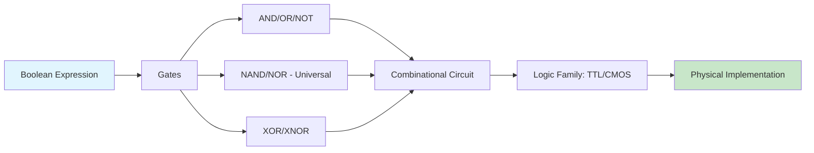

# Chapter 3: Logic Gates

> **Prereq:** Chapter 2 (Boolean Algebra) — gates implement the Boolean operations directly.
> **Next:** Chapter 4 (Combinational Circuits) — gates combine to form useful logic circuits.

## Learning Objectives

By the conclusion of this chapter, the student shall be able to:

1. Describe the operation and truth table of each fundamental logic gate
2. Express any Boolean function using only NAND gates or only NOR gates
3. Compare the electrical characteristics of TTL and CMOS logic families
4. Interpret datasheet parameters including propagation delay, fan-out, and noise margin
5. Analyse the behaviour of three-state and open-collector gate configurations

### Chapter at a Glance

| Section | Key Concept | Why It Matters |
|---------|-------------|----------------|
| Fundamental Gates | AND, OR, NOT, NAND, NOR, XOR, XNOR | Basic building blocks of all digital circuits |
| Universal Gates | NAND/NOR implement any function | IC manufacturing prefers single gate type |
| Three-State Gates | High-impedance output | Enable shared bus architectures |
| Logic Families | TTL vs CMOS electrical characteristics | Real-world voltage levels, speed, power |

## Theory

### 3.1 Fundamental Logic Gates

> **One-Sentence Takeaway:** NAND and NOR are universal gates — any Boolean function, however complex, can be built entirely from either one, which is why chip manufacturers standardise on a single gate type.

A logic gate is an electronic circuit that implements a Boolean function. The seven fundamental gates are AND, OR, NOT, NAND, NOR, XOR, and XNOR.

#### 3.1.1 AND Gate

The AND gate produces a HIGH output (1) only when all inputs are HIGH.

| A | B | A · B |
|---|---|:---:|
| 0 | 0 | 0 |
| 0 | 1 | 0 |
| 1 | 0 | 0 |
| 1 | 1 | 1 |

Symbol: A D-shaped body with a flat left side. Output: 1 only if both inputs are 1.

#### 3.1.2 OR Gate

The OR gate produces a HIGH output when any input is HIGH.

| A | B | A + B |
|---|---|:---:|
| 0 | 0 | 0 |
| 0 | 1 | 1 |
| 1 | 0 | 1 |
| 1 | 1 | 1 |

Symbol: A curved body tapering to a point on the output side.

#### 3.1.3 NOT Gate (Inverter)

The NOT gate produces the complement of its input.

| A | A' |
|---|:---:|
| 0 | 1 |
| 1 | 0 |

Symbol: A triangle pointing to the right with a small circle (bubble) at the output.

#### 3.1.4 NAND Gate

The NAND gate is the complement of AND. It is a universal gate, meaning any Boolean function can be implemented using only NAND gates.

| A | B | (A · B)' |
|---|---|:---:|
| 0 | 0 | 1 |
| 0 | 1 | 1 |
| 1 | 0 | 1 |
| 1 | 1 | 0 |

Symbol: An AND symbol followed by a bubble at the output.

#### 3.1.5 NOR Gate

The NOR gate is the complement of OR. It is also a universal gate.

| A | B | (A + B)' |
|---|---|:---:|
| 0 | 0 | 1 |
| 0 | 1 | 0 |
| 1 | 0 | 0 |
| 1 | 1 | 0 |

Symbol: An OR symbol followed by a bubble at the output.

#### 3.1.6 XOR Gate (Exclusive-OR)

The XOR gate produces a HIGH output when the inputs differ.

| A | B | A ⊕ B |
|---|---|:---:|
| 0 | 0 | 0 |
| 0 | 1 | 1 |
| 1 | 0 | 1 |
| 1 | 1 | 0 |

Symbol: An OR-like symbol with an additional curved line on the input side.

#### 3.1.7 XNOR Gate (Exclusive-NOR)

The XNOR gate produces a HIGH output when the inputs are equal. It is the complement of XOR.

| A | B | (A ⊕ B)' |
|---|---|:---:|
| 0 | 0 | 1 |
| 0 | 1 | 0 |
| 1 | 0 | 0 |
| 1 | 1 | 1 |

Symbol: An XOR symbol followed by a bubble at the output.

### 3.2 Universal Gates

NAND and NOR are termed universal gates because either alone suffices to implement any Boolean expression.

**NAND as universal gate**:
- NOT: Connect both inputs together: *A'* = (A · A)'.
- AND: Complement the output of NAND: *A* · *B* = [(A · B)']'.
- OR: Apply De Morgan's theorem: *A* + *B* = (A' · B')'.

**NOR as universal gate**:
- NOT: Connect both inputs together: *A'* = (A + A)'.
- OR: Complement the output of NOR: *A* + *B* = [(A + B)']'.
- AND: Apply De Morgan's theorem: *A* · *B* = (A' + B')'.

### 3.3 Three-State Gates

A three-state gate exhibits three output states: 0, 1, and high-impedance (Z). The enable input controls whether the gate drives the output or enters the high-impedance state, disconnecting from the bus. Three-state buffers are essential for bus-oriented architectures where multiple outputs share a common wire.

| Enable | Input | Output |
|:------:|:-----:|:------:|
| 0 | X | Z (high-impedance) |
| 1 | 0 | 0 |
| 1 | 1 | 1 |

### 3.4 Positive and Negative Logic

In positive logic, voltage HIGH represents logic 1 and LOW represents logic 0. In negative logic, the mapping is reversed. A circuit implementing AND in positive logic implements OR in negative logic. The duality principle states that every Boolean identity remains valid when AND and OR are interchanged and 0 and 1 are interchanged.

### 3.5 Logic Families

#### 3.5.1 TTL (Transistor-Transistor Logic)

TTL logic uses bipolar junction transistors. Key characteristics:

- Supply voltage: 5 V ± 5%
- Logic LOW: 0 V to 0.8 V (input), 0 V to 0.4 V (output)
- Logic HIGH: 2.0 V to 5 V (input), 2.4 V to 5 V (output)
- Typical propagation delay: 10 ns (standard TTL)
- Noise margin: approximately 0.4 V

TTL subfamilies include standard (74xx), low-power (74Lxx), Schottky (74Sxx), low-power Schottky (74LSxx), and advanced Schottky (74ASxx).

#### 3.5.2 CMOS (Complementary Metal-Oxide-Semiconductor)

CMOS logic uses complementary pairs of p-channel and n-channel MOSFETs. Key characteristics:

- Supply voltage: 3 V to 15 V (varies by subfamily)
- Near-zero static power consumption
- Logic levels proportional to supply voltage: V_{IL} ≤ 0.3V_{DD}, V_{IH} ≥ 0.7V_{DD}
- Typical propagation delay: 20–50 ns (standard CMOS)
- High noise margin: approximately 0.4V_{DD}
- High fan-out capability

CMOS subfamilies include standard (4000 series), high-speed CMOS (74HC), advanced CMOS (74AC), and low-voltage CMOS (74LVC).

#### 3.5.3 Comparison of TTL and CMOS

| Parameter | TTL (74LS) | CMOS (74HC) |
|-----------|------------|-------------|
| Supply voltage | 5 V ± 5% | 2–6 V |
| Power per gate (static) | 2 mW | 0.002 mW |
| Propagation delay | 10 ns | 20 ns |
| Fan-out | 20 | 50 |
| Noise margin LOW | 0.4 V | 0.7 V |
| Noise margin HIGH | 0.4 V | 1.2 V (at 5 V) |

### 3.6 Electrical Characteristics

#### 3.6.1 Propagation Delay

Propagation delay *t_p* is the time required for a change at the input to propagate to the output. It is measured from the 50% transition point of the input waveform to the 50% transition point of the output waveform. Two measurements are specified: *t_{PLH}* (LOW-to-HIGH) and *t_{PHL}* (HIGH-to-LOW).

#### 3.6.2 Fan-Out

Fan-out is the maximum number of gate inputs that a single gate output can drive while maintaining correct logic levels. It is limited by the current sourcing and sinking capability of the output stage.

#### 3.6.3 Noise Margin

Noise margin quantifies the circuit's immunity to voltage noise. It represents the difference between the guaranteed output voltage and the required input voltage for each logic state.

NM_{LOW} = V_{IL}(max) − V_{OL}(max)
NM_{HIGH} = V_{OH}(min) − V_{IH}(min)

#### 3.6.4 Power Dissipation

Power dissipation comprises static power (leakage current multiplied by supply voltage) and dynamic power (proportional to switching frequency, load capacitance, and the square of the supply voltage). CMOS circuits dominate contemporary design because static power is near zero.

## Examples

### Example 3.1: Universal Gate Conversion

Implement the function *F* = *A* · *B* + *C* · *D* using only NAND gates.

**Solution**: The function is in SOP form. Replace AND and OR with NAND equivalents.

*F* = *A* · *B* + *C* · *D*
  = [(A · B)']' + [(C · D)']'
  = [(A · B)']' · [(C · D)']'  (involution before De Morgan)
  = [(A · B)' · (C · D)']'

Implementation: Three NAND gates — two for the AND functions, one for the OR function expressed as a NAND.

### Example 3.2: Propagation Delay Analysis

A logic circuit consists of five cascaded NAND gates. Each gate has *t_{PLH}* = 8 ns and *t_{PHL}* = 12 ns. A rising edge arrives at the input. Calculate the worst-case propagation delay through the chain.

**Solution**: For a rising edge, each gate may exhibit *t_{PHL}* and *t_{PLH}* alternately depending on the gate's position and whether an even or odd number of inversions has occurred. The worst case is when every gate exhibits *t_{PHL}* = 12 ns (or every gate exhibits *t_{PLH}* = 8 ns, whichever path is longer). Worst-case total delay = 5 × 12 ns = 60 ns.

### Concept Comparison

| Logic Family | Supply | Static Power | Speed | Fan-Out | Noise Margin |
|-------------|--------|-------------|-------|---------|-------------|
| TTL (74LS) | 5V | 2 mW/gate | 10 ns | 20 | 0.4 V |
| CMOS (74HC) | 2-6V | 0.002 mW/gate | 20 ns | 50 | 0.7 V |
| Advanced CMOS | 1.8-3.3V | Near zero | 3-5 ns | 30 | 0.3 V |

### Quick Reference

| Gate | Output When | Expression |
|------|-----------|------------|
| AND | All inputs 1 | A · B |
| OR | Any input 1 | A + B |
| NOT | Complement | A' |
| NAND | Not all 1 | (A·B)' |
| NOR | No input 1 | (A+B)' |
| XOR | Inputs differ | A ⊕ B |
| XNOR | Inputs match | (A⊕B)' |

### Cross-Application Matrix

| Domain | Application | Relevance |
|--------|-------------|-----------|
| CPU Design | ALU logic gates | Gates are the physical atoms of computation |
| Embedded Systems | TTL/CMOS level interfacing | Voltage compatibility is critical |
| Digital Circuits | IC fabrication | Universal gate reduces mask layers |
| Research | Emerging logic tech | Reversible/quantum gates studied |

## Summary

- Seven fundamental gates exist: AND, OR, NOT, NAND, NOR, XOR, and XNOR.
- NAND and NOR are universal gates — any Boolean function can be constructed from either alone.
- Three-state gates enable shared bus architectures by providing a high-impedance state.
- TTL and CMOS are the dominant logic families, with CMOS prevailing in modern designs due to low power consumption.
- Key electrical parameters include propagation delay, fan-out, and noise margin.

## Exercises

### Review Questions

1. Draw the circuit symbols for all seven fundamental logic gates.
2. Which gates are classified as universal? Explain why.
3. What is the function of the enable input on a three-state buffer?
4. Define propagation delay. Why does it matter in high-speed circuits?
5. Name two advantages of CMOS over TTL.

### Application Problems

1. Show how to implement a 2-input AND gate using only NOR gates.
2. Show how to implement a 2-input XOR gate using only NAND gates. Determine the minimum number of NAND gates required.
3. A 74LS00 quad NAND gate has the following specifications: V_{OH}(min) = 2.7 V, V_{OL}(max) = 0.5 V, V_{IH}(min) = 2.0 V, V_{IL}(max) = 0.8 V. Calculate the LOW and HIGH noise margins.
4. A CMOS inverter operates at V_{DD} = 3.3 V and switches at 100 MHz driving a 15 pF load. Calculate the dynamic power dissipation.
5. Implement the function *F* = (A + B) · C + D using only:
   a) NAND gates
   b) NOR gates

### Challenge Problem

A digital system uses a shared data bus driven by three-state buffers from four different modules. Design the enable logic such that only one module drives the bus at any time. The module priorities are: Module 1 (highest), Module 2, Module 3, Module 4 (lowest). A higher-priority module's request inhibits all lower-priority modules from driving the bus. Provide the truth table, Boolean expressions for the enable signals,     and a gate-level schematic description.

### Chapter Quiz

1. Which gates are classified as universal?
   - A) AND and OR
   - B) NAND and NOR
   - C) XOR and XNOR
   - D) NOT and Buffer

2. A three-state gate's third output state is:
   - A) 0
   - B) 1
   - C) High-impedance (Z)
   - D) Undefined

3. CMOS logic's main advantage over TTL is:
   - A) Higher speed
   - B) Lower static power consumption
   - C) Lower cost
   - D) Higher output voltage

Answers

1. B, 2. C, 3. B

