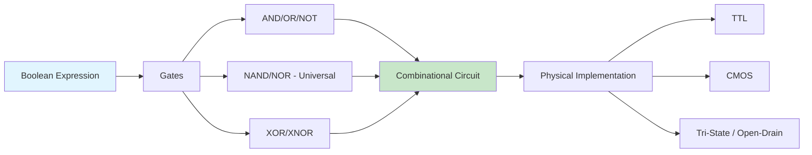
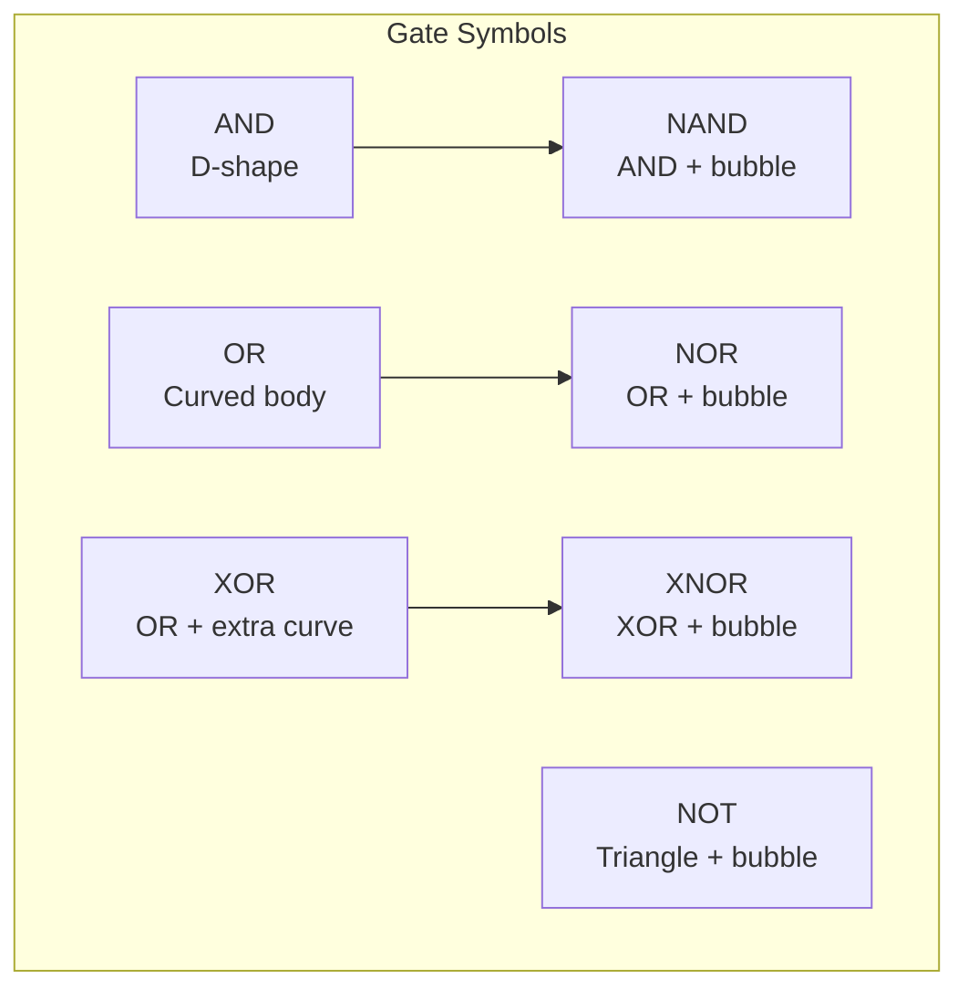
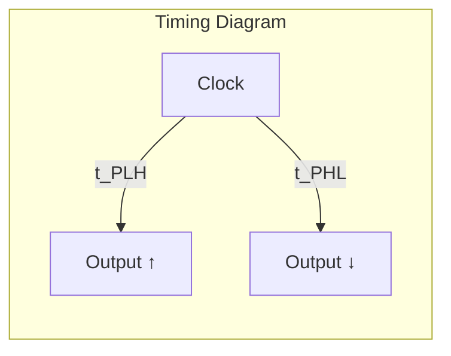
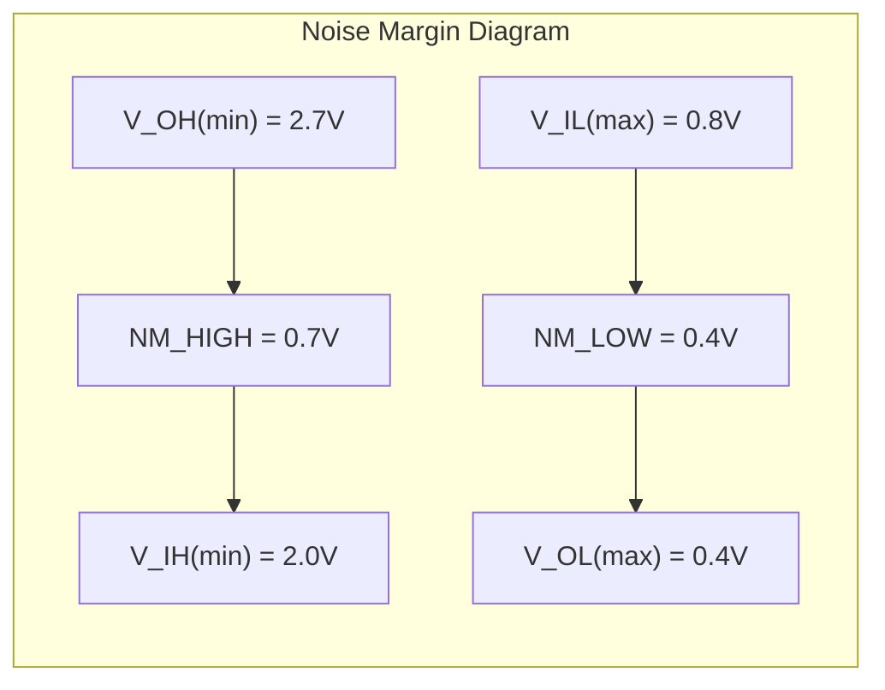
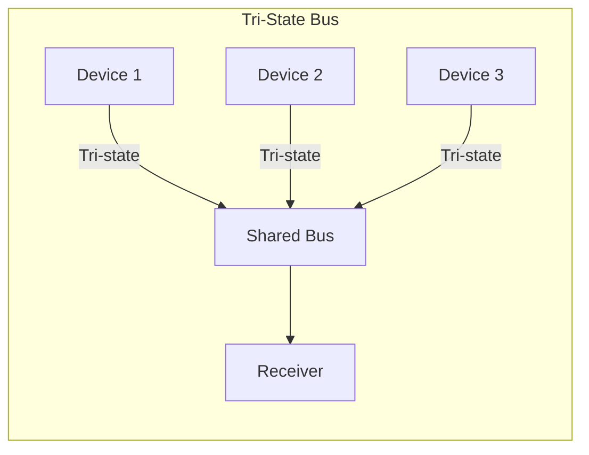

# Chapter 3: Logic Gates

> **Prereq:** Chapter 2 (Boolean Algebra) — gates implement the Boolean operations directly.
> **Next:** Chapter 4 (Karnaugh Maps) — minimisation leads to optimal gate-level implementations.

## Learning Objectives

By the conclusion of this chapter, the student shall be able to:

1. Describe the operation and truth table of each fundamental logic gate
2. Draw circuit symbols and timing diagrams for all seven fundamental gates
3. Express any Boolean function using only NAND gates or only NOR gates
4. Compare the electrical characteristics of TTL and CMOS logic families
5. Analyse fan-in, fan-out, propagation delay, and noise margin from datasheets
6. Explain the operation of tri-state logic and open-drain outputs
7. Perform gate-level minimisation for reduced transistor count

### Chapter at a Glance

| Section | Key Concept | Why It Matters |
|---------|-------------|----------------|
| Fundamental Gates | AND, OR, NOT, NAND, NOR, XOR, XNOR | Basic building blocks of all digital circuits |
| Universal Gates | NAND/NOR implement any function | IC manufacturing prefers single gate type |
| Gate-Level Minimisation | Reduce transistor count | Lower cost, power, and area |
| Electrical Characteristics | Propagation delay, fan-out | Determines maximum operating frequency |
| Logic Families | TTL vs CMOS | Real-world voltage levels, speed, power trade-offs |
| Tri-State Logic | High-impedance output | Enable shared bus architectures |
| Open-Drain Outputs | Wired-AND connections | Multi-driver buses with pull-up resistors |



## Theory

### 3.1 Fundamental Logic Gates

A logic gate is an electronic circuit that implements a Boolean function. The seven fundamental gates are AND, OR, NOT, NAND, NOR, XOR, and XNOR.

#### 3.1.1 AND Gate

The AND gate produces a HIGH output (1) only when all inputs are HIGH.

| A | B | A · B |
|---|---|:---:|
| 0 | 0 | 0 |
| 0 | 1 | 0 |
| 1 | 0 | 0 |
| 1 | 1 | 1 |

Symbol: A D-shaped body with a flat left side. Output: 1 only if both inputs are 1.

**Timing diagram**:
```text
A   ___|````|___|````|___
B   |````|___|````|_____
Y   |_________|````|____
```

#### 3.1.2 OR Gate

The OR gate produces a HIGH output when any input is HIGH.

| A | B | A + B |
|---|---|:---:|
| 0 | 0 | 0 |
| 0 | 1 | 1 |
| 1 | 0 | 1 |
| 1 | 1 | 1 |

Symbol: A curved body tapering to a point on the output side.

#### 3.1.3 NOT Gate (Inverter)

The NOT gate produces the complement of its input.

| A | A' |
|---|:---:|
| 0 | 1 |
| 1 | 0 |

Symbol: A triangle pointing to the right with a small circle (bubble) at the output.

#### 3.1.4 NAND Gate

The NAND gate is the complement of AND. It is a universal gate.

| A | B | (A · B)' |
|---|---|:---:|
| 0 | 0 | 1 |
| 0 | 1 | 1 |
| 1 | 0 | 1 |
| 1 | 1 | 0 |

Symbol: An AND symbol followed by a bubble at the output.

#### 3.1.5 NOR Gate

The NOR gate is the complement of OR. It is also a universal gate.

| A | B | (A + B)' |
|---|---|:---:|
| 0 | 0 | 1 |
| 0 | 1 | 0 |
| 1 | 0 | 0 |
| 1 | 1 | 0 |

Symbol: An OR symbol followed by a bubble at the output.

#### 3.1.6 XOR Gate (Exclusive-OR)

The XOR gate produces a HIGH output when the inputs differ.

| A | B | A ⊕ B |
|---|---|:---:|
| 0 | 0 | 0 |
| 0 | 1 | 1 |
| 1 | 0 | 1 |
| 1 | 1 | 0 |

Expression: A ⊕ B = A'B + AB'

#### 3.1.7 XNOR Gate (Exclusive-NOR)

The XNOR gate produces a HIGH output when the inputs are equal.

| A | B | (A ⊕ B)' |
|---|---|:---:|
| 0 | 0 | 1 |
| 0 | 1 | 0 |
| 1 | 0 | 0 |
| 1 | 1 | 1 |

Expression: A ⊙ B = A·B + A'·B'



### 3.2 Universal Gates

NAND and NOR are termed universal gates because either alone suffices to implement any Boolean expression.

**NAND as universal gate**:
- NOT: Connect both inputs together: A' = (A·A)'
- AND: Complement the output of NAND: A·B = [(A·B)']'
- OR: Apply De Morgan's theorem: A + B = (A'·B')'

**NOR as universal gate**:
- NOT: Connect both inputs together: A' = (A + A)'
- OR: Complement the output of NOR: A + B = [(A + B)']'
- AND: Apply De Morgan's theorem: A·B = (A' + B')'

### 3.3 Gate-Level Minimisation

Gate-level minimisation reduces the number of gates (and thus transistors, area, and power) needed to implement a function.

**Example**: Implement F = A·B + A·C using minimal gates.
- Direct: Two AND gates and one OR gate
- Minimised: F = A·(B + C) — one AND, one OR (saves one gate)

```typescript
interface Gate {
    type: "AND" | "OR" | "NOT" | "NAND" | "NOR" | "XOR" | "XNOR";
    inputs: string[];
    output: string;
}

class GateNetwork {
    gates: Gate[] = [];

    addGate(gate: Gate): void {
        this.gates.push(gate);
    }

    simulate(inputs: Map<string, boolean>): Map<string, boolean> {
        const values = new Map(inputs);
        for (const gate of this.gates) {
            const inputVals = gate.inputs.map(i => {
                if (!values.has(i)) throw new Error(`Unknown input: ${i}`);
                return values.get(i)!;
            });
            let output: boolean;
            switch (gate.type) {
                case "AND": output = inputVals.every(v => v); break;
                case "OR": output = inputVals.some(v => v); break;
                case "NOT": output = !inputVals[0]; break;
                case "NAND": output = !inputVals.every(v => v); break;
                case "NOR": output = !inputVals.some(v => v); break;
                case "XOR": output = inputVals.reduce((a, b) => a !== b); break;
                case "XNOR": output = !inputVals.reduce((a, b) => a !== b); break;
            }
            values.set(gate.output, output);
        }
        return values;
    }
}
```

### 3.4 Electrical Characteristics

#### 3.4.1 Propagation Delay

Propagation delay t_p is the time required for a change at the input to propagate to the output. It is measured from the 50% transition point of the input waveform to the 50% transition point of the output waveform. Two measurements are specified: t_{PLH} (LOW-to-HIGH) and t_{PHL} (HIGH-to-LOW).

The propagation delay through a chain of gates determines the maximum clock frequency of a synchronous system. For a path with N gates: t_total = Σ t_{p_i}



#### 3.4.2 Fan-In

Fan-in is the number of inputs that a logic gate can support. A 2-input AND gate has a fan-in of 2. Gates with higher fan-in require more transistors and have longer propagation delays.

Typical fan-in limits:
- Standard TTL: 8-10 inputs
- CMOS: 4-6 inputs (limited by series transistor stacks)

When a function requires more inputs than available, gates must be cascaded.

#### 3.4.3 Fan-Out

Fan-out is the maximum number of gate inputs that a single gate output can drive while maintaining correct logic levels. It is limited by the current sourcing and sinking capability of the output stage.

Fan-out calculation: FO = I_{OH(max)} / I_{IH} or FO = I_{OL(max)} / I_{IL}, whichever is smaller.

Exceeding fan-out causes:
- Voltage levels beyond guaranteed thresholds
- Slower switching (increased propagation delay)
- Potential device damage

#### 3.4.4 Noise Margin

Noise margin quantifies the circuit's immunity to voltage noise. It represents the difference between the guaranteed output voltage and the required input voltage for each logic state.

NM_{LOW} = V_{IL}(max) − V_{OL}(max)
NM_{HIGH} = V_{OH}(min) − V_{IH}(min)



#### 3.4.5 Power Dissipation

Power dissipation comprises static and dynamic components:

**Static power**: P_static = I_leak × V_DD. In CMOS, static power is near-zero (leakage only).

**Dynamic power**: P_dynamic = α × C_L × V_DD² × f, where:
- α = activity factor (fraction of gates switching per cycle)
- C_L = load capacitance
- f = switching frequency

### 3.5 Logic Families

#### 3.5.1 TTL (Transistor-Transistor Logic)

TTL logic uses bipolar junction transistors. Key characteristics:

- Supply voltage: 5 V ± 5%
- Logic LOW: 0 V to 0.8 V (input), 0 V to 0.4 V (output)
- Logic HIGH: 2.0 V to 5 V (input), 2.4 V to 5 V (output)
- Typical propagation delay: 10 ns (standard TTL)
- Noise margin: approximately 0.4 V

TTL subfamilies include:
| Subfamily | Prefix | Speed | Power |
|-----------|--------|-------|-------|
| Standard | 74xx | 10 ns | 10 mW |
| Low-power | 74Lxx | 33 ns | 1 mW |
| Schottky | 74Sxx | 3 ns | 20 mW |
| Low-power Schottky | 74LSxx | 10 ns | 2 mW |
| Advanced Schottky | 74ASxx | 3 ns | 20 mW |
| Fast | 74Fxx | 3.5 ns | 6 mW |

#### 3.5.2 CMOS (Complementary Metal-Oxide-Semiconductor)

CMOS logic uses complementary pairs of p-channel and n-channel MOSFETs. Key characteristics:

- Supply voltage: 3 V to 15 V (varies by subfamily)
- Near-zero static power consumption
- Logic levels proportional to supply voltage: V_{IL} ≤ 0.3V_{DD}, V_{IH} ≥ 0.7V_{DD}
- Typical propagation delay: 20-50 ns (standard CMOS)
- High noise margin: approximately 0.4V_{DD}
- High fan-out capability

CMOS subfamilies:
| Subfamily | Prefix | Speed | Voltage |
|-----------|--------|-------|---------|
| Standard | 4000 series | 50 ns | 3-15 V |
| High-speed CMOS | 74HC | 20 ns | 2-6 V |
| Advanced CMOS | 74AC | 5 ns | 3-5 V |
| Low-voltage CMOS | 74LVC | 4 ns | 1.65-3.6 V |

#### 3.5.3 Comparison of TTL and CMOS

| Parameter | TTL (74LS) | CMOS (74HC) | Advanced CMOS (74AC) |
|-----------|------------|-------------|---------------------|
| Supply voltage | 5 V ± 5% | 2-6 V | 3-5 V |
| Power per gate (static) | 2 mW | 0.002 mW | ~0.001 mW |
| Propagation delay | 10 ns | 20 ns | 5 ns |
| Fan-out | 20 | 50 | 30 |
| Noise margin LOW | 0.4 V | 0.7 V | 0.8 V |
| Noise margin HIGH | 0.4 V | 1.2 V | 1.2 V |

### 3.6 Tri-State Logic

A three-state gate exhibits three output states: 0, 1, and high-impedance (Z). The enable input controls whether the gate drives the output or enters the high-impedance state, disconnecting from the bus.

| Enable | Input | Output |
|:------:|:-----:|:------:|
| 0 | X | Z (high-impedance) |
| 1 | 0 | 0 |
| 1 | 1 | 1 |

Tri-state buffers are essential for bus-oriented architectures where multiple outputs share a common wire. Only one buffer may be active at a time; otherwise, bus contention (simultaneous 0 and 1 drive) occurs, causing excessive current and potential damage.



### 3.7 Open-Drain and Open-Collector Outputs

An open-drain (CMOS) or open-collector (TTL) output can only pull the output LOW. When the output should be HIGH, the output transistor turns off (high-impedance). An external pull-up resistor is required to achieve the HIGH state.

**Wired-AND connection**: Multiple open-drain outputs connected to a common pull-up resistor implement a wired-AND function. The output is HIGH only if ALL gates are in the HIGH-impedance state.

Applications:
- I²C bus (both SDA and SCL are open-drain)
- Interrupt lines (multiple devices share one interrupt input)
- Level shifting (pull-up to different voltage than the gate supply)

### 3.8 Schmitt Trigger Inputs

Schmitt trigger inputs have hysteresis: the input threshold for LOW-to-HIGH transitions (V_T+) is higher than the threshold for HIGH-to-LOW transitions (V_T-). This provides noise immunity for slow or noisy input signals.

Hysteresis voltage: V_H = V_T+ − V_T-

Applications:
- Debouncing mechanical switches
- Cleaning up slow edges
- Receiving signals over long cables

## Examples

### Example 3.1: Universal Gate Conversion

Implement the function F = A·B + C·D using only NAND gates.

**Solution**: The function is in SOP form. Replace AND and OR with NAND equivalents.
F = A·B + C·D
= [(A·B)']' + [(C·D)']' (double complement)
= ([A·B)'·(C·D)']' (De Morgan: X' + Y' = (X·Y)')
= [(A·B)'·(C·D)']'

Implementation: Three NAND gates — two for the AND functions, one for the OR.

### Example 3.2: Propagation Delay Analysis

A logic circuit consists of five cascaded NAND gates. Each gate has t_{PLH} = 8 ns and t_{PHL} = 12 ns. A rising edge arrives at the input. Calculate the worst-case propagation delay through the chain.

**Solution**: For a rising edge, the first gate exhibits t_{PHL} = 12 ns (since the output falls). The second gate exhibits t_{PLH} = 8 ns. The pattern alternates. Worst case: 3 gates exhibit t_{PHL} and 2 exhibit t_{PLH}. Total delay = 3×12 + 2×8 = 36 + 16 = 52 ns.

### Example 3.3: Fan-Out Calculation

A 74LS00 NAND gate has I_{OH} = −0.4 mA, I_{OL} = 8 mA, I_{IH} = 20 μA, I_{IL} = −0.4 mA. Calculate the fan-out.

**Solution**: 
HIGH-state fan-out: |I_{OH}| / I_{IH} = 0.4 mA / 20 μA = 400 μA / 20 μA = 20
LOW-state fan-out: I_{OL} / |I_{IL}| = 8 mA / 0.4 mA = 20
Fan-out = min(20, 20) = 20

### Example 3.4: Noise Margin Calculation

A 74LS00 has V_{OH}(min) = 2.7 V, V_{OL}(max) = 0.5 V, V_{IH}(min) = 2.0 V, V_{IL}(max) = 0.8 V. Calculate noise margins.

**Solution**:
NM_{HIGH} = 2.7 − 2.0 = 0.7 V
NM_{LOW} = 0.8 − 0.5 = 0.3 V

### Example 3.5: Dynamic Power Calculation

A CMOS gate operates at V_{DD} = 3.3 V, drives a 15 pF load, and switches at 100 MHz with an activity factor of 0.5. Calculate the dynamic power.

**Solution**: P = 0.5 × 15×10^{-12} × (3.3)^2 × 100×10^6 = 0.5 × 15 × 10.89 × 10^{-12} × 10^8 = 0.5 × 15 × 10.89 × 10^{-4} = 81.675 × 10^{-4} = 8.1675 mW

### Concept Comparison

| Logic Family | Supply | Static Power | Speed | Fan-Out | Noise Margin |
|-------------|--------|-------------|-------|---------|-------------|
| TTL (74LS) | 5V | 2 mW/gate | 10 ns | 20 | 0.4 V |
| CMOS (74HC) | 2-6V | 0.002 mW/gate | 20 ns | 50 | 0.7 V |
| Advanced CMOS | 1.8-3.3V | Near zero | 3-5 ns | 30 | 0.3 V |

### Quick Reference

| Gate | Output When | Expression | Symbol |
|------|-----------|------------|--------|
| AND | All inputs 1 | A·B | D-shape |
| OR | Any input 1 | A+B | Curved body |
| NOT | Complement | A' | Triangle + bubble |
| NAND | Not all 1 | (A·B)' | AND + bubble |
| NOR | No input 1 | (A+B)' | OR + bubble |
| XOR | Inputs differ | A⊕B | OR + extra curve |
| XNOR | Inputs match | (A⊕B)' | XOR + bubble |

### Cross-Application Matrix

| Domain | Application | Relevance |
|--------|-------------|-----------|
| CPU Design | ALU logic gates | Gates are the physical atoms of computation |
| Embedded Systems | TTL/CMOS level interfacing | Voltage compatibility is critical |
| Digital Circuits | IC fabrication | Universal gate reduces mask layers |
| Research | Emerging logic tech | Reversible/quantum gates studied |

## Practical Takeaways

1. **NAND and NOR are universal** — master converting any expression to these gate types for IC design.
2. **Propagation delay limits speed** — the critical path delay through gates determines max clock frequency.
3. **Fan-out cannot be exceeded** — violating fan-out causes unreliable logic levels and potential damage.
4. **CMOS dominates modern design** — near-zero static power makes CMOS the choice for most applications.
5. **Tri-state enables shared buses** — but ensuring only one driver is active at a time is critical.
6. **Open-drain for wired-AND** — useful for shared interrupt lines and I²C protocol.

## Summary

- Seven fundamental gates exist: AND, OR, NOT, NAND, NOR, XOR, and XNOR.
- NAND and NOR are universal gates — any Boolean function can be constructed from either alone.
- Three-state gates enable shared bus architectures by providing a high-impedance state.
- Open-drain outputs implement wired-AND connections with external pull-up resistors.
- TTL and CMOS are the dominant logic families, with CMOS prevailing in modern designs due to low power.
- Key electrical parameters include propagation delay, fan-in, fan-out, and noise margin.

### Chapter Quiz

1. Which gates are classified as universal?
   - A) AND and OR
   - B) NAND and NOR
   - C) XOR and XNOR
   - D) NOT and Buffer

2. A three-state gate's third output state is:
   - A) 0
   - B) 1
   - C) High-impedance (Z)
   - D) Undefined

3. CMOS logic's main advantage over TTL is:
   - A) Higher speed
   - B) Lower static power consumption
   - C) Lower cost
   - D) Higher output voltage

4. Fan-out is defined as:
   - A) The number of inputs a gate has
   - B) The maximum number of gate inputs a single output can drive
   - C) The propagation delay of a gate
   - D) The supply voltage range

5. An open-drain output requires:
   - A) An internal pull-down resistor
   - B) An external pull-up resistor
   - C) A tri-state enable signal
   - D) A Schmitt trigger input

<details>
<summary>Answers</summary>
1. B, 2. C, 3. B, 4. B, 5. B
</details>

## Exercises

### Review Questions

1. Draw the circuit symbols for all seven fundamental logic gates.
2. Which gates are classified as universal? Explain why.
3. What is the function of the enable input on a tri-state buffer?
4. Define propagation delay. Why does it matter in high-speed circuits?
5. Name two advantages of CMOS over TTL.

### Application Problems

1. Show how to implement a 2-input AND gate using only NOR gates.
2. Show how to implement a 2-input XOR gate using only NAND gates. Determine the minimum number of NAND gates required.
3. A 74LS00 quad NAND gate has the following specifications: V_{OH}(min) = 2.7 V, V_{OL}(max) = 0.5 V, V_{IH}(min) = 2.0 V, V_{IL}(max) = 0.8 V. Calculate the LOW and HIGH noise margins.
4. A CMOS inverter operates at V_{DD} = 3.3 V and switches at 100 MHz driving a 15 pF load. Calculate the dynamic power dissipation.
5. Implement the function F = (A + B)·C + D using only:
   a) NAND gates
   b) NOR gates

### Challenge Problem

A digital system uses a shared data bus driven by tri-state buffers from four different modules. Design the enable logic such that only one module drives the bus at any time. The module priorities are: Module 1 (highest), Module 2, Module 3, Module 4 (lowest). A higher-priority module's request inhibits all lower-priority modules from driving the bus. Provide the truth table, Boolean expressions for the enable signals, and a gate-level schematic description.
