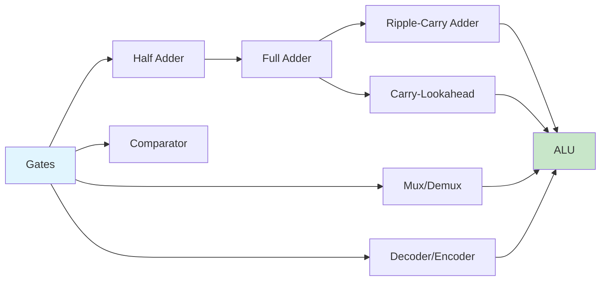

# Chapter 4: Combinational Circuits

> **Prereq:** Chapter 3 (Logic Gates) — combinational circuits are networks of gates.
> **Next:** Chapter 5 (Flip-Flops) — sequential circuits add memory to combinational logic.

## Learning Objectives

By the conclusion of this chapter, the student shall be able to:

1. Design half-adder and full-adder circuits from Boolean expressions
2. Construct ripple-carry adders and carry-lookahead adders
3. Analyse multiplexer and demultiplexer circuits for data routing
4. Implement Boolean functions using decoders and multiplexers
5. Design magnitude comparators and ALU subcircuits

### Chapter at a Glance

| Section | Key Concept | Why It Matters |
|---------|-------------|----------------|
| Adders | Half-adder, full-adder, CLA | Binary addition is the core of ALU |
| MUX/DEMUX | Data selection and routing | Fundamental to data path design |
| Decoder/Encoder | Code conversion | Address decoding, instruction decoding |
| Comparator | Magnitude comparison | Sorting, decision circuits |
| ALU | Integrated arithmetic/logic unit | Heart of the CPU |

## Theory

> **One-Sentence Takeaway:** Combinational logic has no memory — outputs depend only on current inputs — making it ideal for arithmetic and data routing, with adders and multiplexers as the canonical building blocks.

### 4.1 Adders

#### 4.1.1 Half-Adder

The half-adder computes the sum of two single-bit binary numbers. It produces two outputs: sum (S) and carry (C_out).

| A | B | Sum (S) | Carry (C_out) |
|---|---|---------|--------------|
| 0 | 0 | 0 | 0 |
| 0 | 1 | 1 | 0 |
| 1 | 0 | 1 | 0 |
| 1 | 1 | 0 | 1 |

S = A ⊕ B
C_out = A · B

#### 4.1.2 Full-Adder

The full-adder accepts three inputs: A, B, and C_in (carry from a previous stage). It produces sum and carry outputs.

| A | B | C_in | Sum | C_out |
|---|---|:---:|:---:|:-----:|
| 0 | 0 | 0 | 0 | 0 |
| 0 | 0 | 1 | 1 | 0 |
| 0 | 1 | 0 | 1 | 0 |
| 0 | 1 | 1 | 0 | 1 |
| 1 | 0 | 0 | 1 | 0 |
| 1 | 0 | 1 | 0 | 1 |
| 1 | 1 | 0 | 0 | 1 |
| 1 | 1 | 1 | 1 | 1 |

Sum = A ⊕ B ⊕ C_in
C_out = A · B + C_in · (A ⊕ B)

#### 4.1.3 Ripple-Carry Adder

An *n*-bit ripple-carry adder connects *n* full-adders in series, with C_out of stage *i* feeding C_in of stage *i* + 1. The delay increases linearly with *n* because the carry must propagate through all stages.

#### 4.1.4 Carry-Lookahead Adder

The carry-lookahead adder (CLA) reduces addition time by computing carries in parallel using generate (G) and propagate (P) signals:

G_i = A_i · B_i
P_i = A_i ⊕ B_i
C_{i+1} = G_i + P_i · C_i

For a 4-bit CLA, carries are computed as:

C_1 = G_0 + P_0 · C_0
C_2 = G_1 + P_1 · G_0 + P_1 · P_0 · C_0
C_3 = G_2 + P_2 · G_1 + P_2 · P_1 · G_0 + P_2 · P_1 · P_0 · C_0
C_4 = G_3 + P_3 · G_2 + P_3 · P_2 · G_1 + P_3 · P_2 · P_1 · G_0 + P_3 · P_2 · P_1 · P_0 · C_0

### 4.2 Subtractors

#### 4.2.1 Half-Subtractor

| A | B | Difference (D) | Borrow (B_out) |
|---|---|---------------|--------------|
| 0 | 0 | 0 | 0 |
| 0 | 1 | 1 | 1 |
| 1 | 0 | 1 | 0 |
| 1 | 1 | 0 | 0 |

#### 4.2.2 Full-Subtractor

A full-subtractor computes A − B − B_in, producing difference and borrow outputs. Subtraction in modern systems is typically performed using two's complement addition: A − B = A + (B' + 1).

### 4.3 Multiplexer (MUX)

A multiplexer selects one of 2^n data inputs for transmission to a single output based on *n* select lines.

For a 2-to-1 MUX: Y = S' · D_0 + S · D_1
For a 4-to-1 MUX: Y = S_1' · S_0' · D_0 + S_1' · S_0 · D_1 + S_1 · S_0' · D_2 + S_1 · S_0 · D_3

| S_1 | S_0 | Y |
|:---:|:---:|:-:|
| 0 | 0 | D_0 |
| 0 | 1 | D_1 |
| 1 | 0 | D_2 |
| 1 | 1 | D_3 |

Multiplexers can implement arbitrary Boolean functions by connecting the data inputs to constants or variables.

### 4.4 Demultiplexer

A demultiplexer reverses the multiplexer function: one data input is routed to one of 2^n outputs based on *n* select lines. A 1-to-4 demultiplexer truth table:

| S_1 | S_0 | Y_0 | Y_1 | Y_2 | Y_3 |
|:---:|:---:|:---:|:---:|:---:|:---:|
| 0 | 0 | D | 0 | 0 | 0 |
| 0 | 1 | 0 | D | 0 | 0 |
| 1 | 0 | 0 | 0 | D | 0 |
| 1 | 1 | 0 | 0 | 0 | D |

### 4.5 Decoder

A decoder converts an *n*-bit binary code to 2^n mutually exclusive outputs, exactly one of which is active at any time.

**3-to-8 decoder**:

| A_2 | A_1 | A_0 | Y_7 | Y_6 | Y_5 | Y_4 | Y_3 | Y_2 | Y_1 | Y_0 |
|:---:|:---:|:---:|:---:|:---:|:---:|:---:|:---:|:---:|:---:|:---:|
| 0 | 0 | 0 | 0 | 0 | 0 | 0 | 0 | 0 | 0 | 1 |
| 0 | 0 | 1 | 0 | 0 | 0 | 0 | 0 | 0 | 1 | 0 |
| 0 | 1 | 0 | 0 | 0 | 0 | 0 | 0 | 1 | 0 | 0 |
| 0 | 1 | 1 | 0 | 0 | 0 | 0 | 1 | 0 | 0 | 0 |
| 1 | 0 | 0 | 0 | 0 | 0 | 1 | 0 | 0 | 0 | 0 |
| 1 | 0 | 1 | 0 | 0 | 1 | 0 | 0 | 0 | 0 | 0 |
| 1 | 1 | 0 | 0 | 1 | 0 | 0 | 0 | 0 | 0 | 0 |
| 1 | 1 | 1 | 1 | 0 | 0 | 0 | 0 | 0 | 0 | 0 |

Y_i = A_2' · A_1' · A_0' for i = 0, etc.

A decoder with an enable input functions as a demultiplexer.

### 4.6 Encoder

An encoder performs the inverse of decoding: it converts 2^n inputs to an *n*-bit binary code. A 4-to-2 priority encoder assigns highest priority to the input with the highest index number.

| I_3 | I_2 | I_1 | I_0 | A_1 | A_0 | Valid |
|:---:|:---:|:---:|:---:|:---:|:---:|:-----:|
| 0 | 0 | 0 | 0 | 0 | 0 | 0 |
| 0 | 0 | 0 | 1 | 0 | 0 | 1 |
| 0 | 0 | 1 | X | 0 | 1 | 1 |
| 0 | 1 | X | X | 1 | 0 | 1 |
| 1 | X | X | X | 1 | 1 | 1 |

### 4.7 Magnitude Comparator

A magnitude comparator determines the relationship between two binary numbers A and B, producing outputs for A > B, A = B, and A < B.

For 1-bit comparison:
- A > B: A · B'
- A = B: A ⊙ B (XNOR)
- A < B: A' · B

### 4.8 Arithmetic Logic Unit (ALU)

An ALU performs arithmetic and logic operations on *n*-bit operands. A simple 4-function ALU with select lines S_1 and S_0:

| S_1 | S_0 | Operation | Output |
|:---:|:---:|-----------|--------|
| 0 | 0 | Addition | A + B |
| 0 | 1 | Subtraction | A − B |
| 1 | 0 | AND | A · B |
| 1 | 1 | OR | A + B |

## Examples

### Example 4.1: Full-Adder Implementation

Design a full-adder using two half-adders and an OR gate.

**Solution**: A half-adder produces Sum = A ⊕ B and Carry = A · B. For a full-adder:

First half-adder: S_1 = A ⊕ B, C_1 = A · B.
Second half-adder on S_1 and C_in: Sum = S_1 ⊕ C_in = A ⊕ B ⊕ C_in, C_2 = S_1 · C_in.
Final carry: C_out = C_1 + C_2 = A · B + (A ⊕ B) · C_in.

### Example 4.2: Function Implementation with MUX

Implement *F*(x, y, z) = Σ(1, 3, 5, 6) using an 8-to-1 multiplexer.

**Solution**: Connect x, y, z to select lines S_2, S_1, S_0. Connect the data inputs D_0 through D_7:

| x y z | Minterm | F | D_i |
|-------|---------|---|:---:|
| 0 0 0 | 0 | 0 | D_0 = 0 |
| 0 0 1 | 1 | 1 | D_1 = 1 |
| 0 1 0 | 2 | 0 | D_2 = 0 |
| 0 1 1 | 3 | 1 | D_3 = 1 |
| 1 0 0 | 4 | 0 | D_4 = 0 |
| 1 0 1 | 5 | 1 | D_5 = 1 |
| 1 1 0 | 6 | 1 | D_6 = 1 |
| 1 1 1 | 7 | 0 | D_7 = 0 |

### Example 4.3: 4-Bit Ripple-Carry Adder

Design a 4-bit ripple-carry adder using four full-adders.

**Solution**: Connect A_0, B_0, and C_0 (ground) to FA_0. Connect C_out_0 to C_in_1 of FA_1. Continue this pattern through FA_3. The sum outputs S_0 through S_3 form the 4-bit result. C_out_3 indicates overflow in unsigned arithmetic.

### Example 4.4: 4-to-1 MUX Using 2-to-1 MUXes

**Solution**: Use three 2-to-1 MUXes arranged as a tree. The first level uses S_0 to select between D_0/D_1 and D_2/D_3. The second level uses S_1 to select between the two first-level outputs.

### Concept Comparison

| Component | Inputs | Outputs | Function |
|-----------|--------|---------|----------|
| Half-Adder | 2 bits | Sum, Carry | Adds 2 bits |
| Full-Adder | 3 bits | Sum, Carry | Adds 3 bits |
| MUX | 2^n data, n select | 1 | Selects one of many |
| DEMUX | 1 data, n select | 2^n | Routes to one of many |
| Decoder | n-bit code | 2^n one-hot | Activates one of 2^n |

### Quick Reference

| Adder Type | Delay | Gate Count | Best For |
|-----------|-------|-----------|----------|
| Ripple-Carry | O(n) | Low | Small widths |
| Carry-Lookahead | O(log n) | High | Wide addition |
| Carry-Select | O(√n) | Moderate | Medium widths |

### Cross-Application Matrix

| Domain | Application | Relevance |
|--------|-------------|-----------|
| CPU Design | ALU adder, address decoder | Adders and decoders are CPU building blocks |
| Embedded Systems | Peripheral selection via MUX | Multiplexing reduces pin count |
| Digital Circuits | FPGA LUT-based logic | MUX-based architectures dominate FPGAs |
| Research | Approximate computing | Inexact adders for energy-efficient AI |

## Summary

- Half-adders and full-adders form the building blocks of binary addition circuits.
- Carry-lookahead adders accelerate addition by computing carries in parallel.
- Multiplexers select data from multiple sources; demultiplexers route data to multiple destinations.
- Decoders convert binary codes to one-hot representations; encoders perform the inverse.
- Magnitude comparators determine the ordering of binary numbers.
- An ALU integrates arithmetic and logic operations under select-line control.

## Exercises

### Review Questions

1. State the differences between a half-adder and a full-adder.
2. What is the principal disadvantage of a ripple-carry adder? How does a carry-lookahead adder address this?
3. How does a multiplexer differ from a decoder?
4. Define priority encoding.
5. Why is the output of a magnitude comparator typically three signals?

### Application Problems

1. Design a full-subtractor circuit using basic gates. Derive the truth table and Boolean expressions for difference and borrow.

2. Implement the Boolean function *F*(A, B, C, D) = Σ(0, 2, 4, 6, 8, 10, 12, 14) using an 8-to-1 multiplexer. Show the connection diagram with variables on the select lines.

3. Design a 4-bit carry-lookahead adder. Derive expressions for P_i, G_i, and all four carry signals. Compare the gate count with that of a 4-bit ripple-carry adder.

4. Design a 4-bit magnitude comparator. Show the cascading connections for expansion to 8 bits.

5. Design a 4-bit ALU that performs addition, subtraction, AND, OR, XOR, and NOT operations.

### Challenge Problem

Design an 8-bit carry-select adder (CSA). The CSA splits the addition into two halves, computes the upper half with both C_in = 0 and C_in = 1 in parallel, then selects the correct result using the actual carry from the lower half. Determine the delay improvement over an 8-bit ripple-carry adder.     Assume each full-adder has a delay of *t* and each 2-to-1 MUX has a delay of *t_m*.

### Chapter Quiz

1. A full-adder differs from a half-adder by having:
   - A) Two sum outputs
   - B) A carry-in input
   - C) No carry output
   - D) Four inputs

2. A 4-to-1 multiplexer requires how many select lines?
   - A) 1
   - B) 2
   - C) 4
   - D) 8

3. Carry-lookahead adders are faster than ripple-carry because:
   - A) They use more bits
   - B) Carries are computed in parallel using generate/propagate signals
   - C) They use less power
   - D) They skip the sum computation

Answers

1. B, 2. B, 3. B

