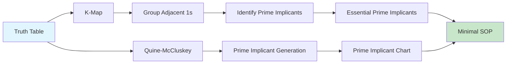
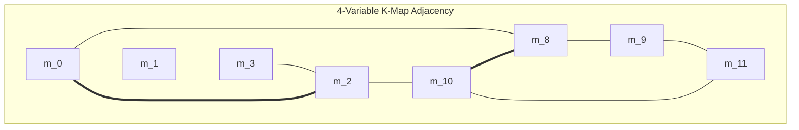
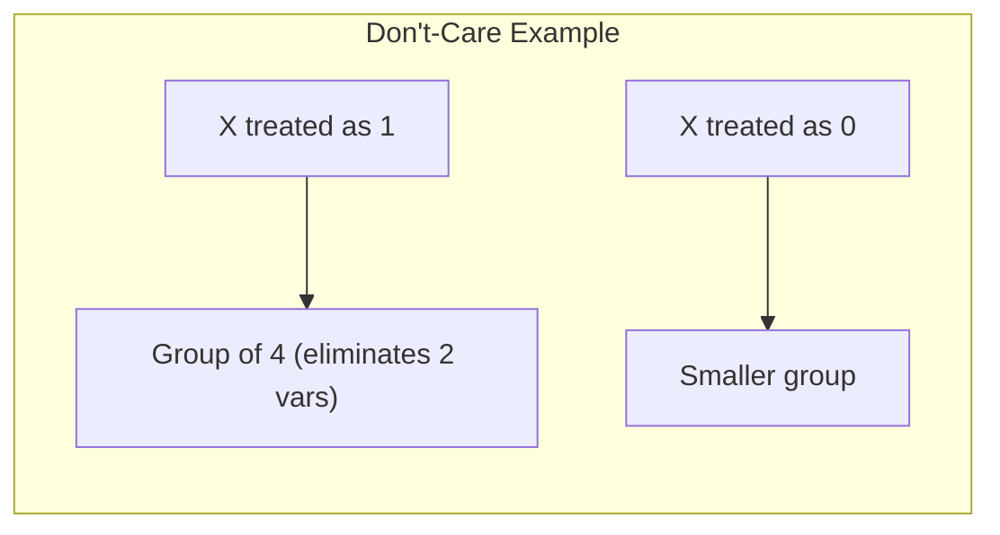
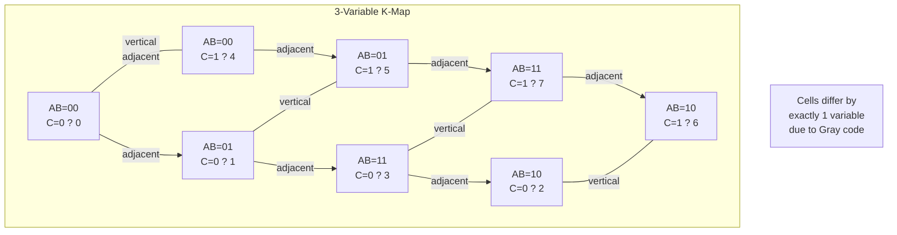
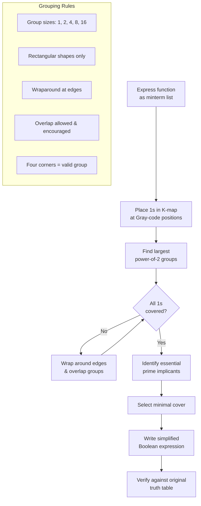
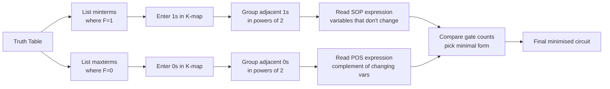

# Chapter 4: Karnaugh Maps

> **Prereq:** Chapter 2 (Boolean Algebra) ? K-maps provide a graphical alternative to algebraic minimisation.
> **Next:** Chapter 5 (Combinational Circuits) ? minimised expressions map directly to efficient circuits.

## Learning Objectives

By the conclusion of this chapter, the student shall be able to:

1. Construct K-maps for 2, 3, 4, and 5 variables with correct Gray code ordering
2. Apply K-map grouping rules to identify prime implicants and essential prime implicants
3. Minimise Boolean functions using K-maps with don't-care conditions
4. Derive minimal SOP and POS expressions from K-maps
5. Use the prime implicant chart to select minimal covers
6. Implement the Quine-McCluskey algorithm as a TypeScript program for functions with 5+ variables
7. Apply the tabulation method for systematic function minimisation

### Chapter at a Glance

| Section | Key Concept | Why It Matters |
|---------|-------------|----------------|
| K-Map Fundamentals | Gray code ordered grid | Adjacent cells differ in one variable |
| Grouping Rules | Powers of 2 groups | Minimises by eliminating changing variables |
| Prime Implicants | Essential vs non-essential | Finding minimal covers |
| Don't-Care Conditions | X entries in K-map | Exploited for simpler expressions |
| Quine-McCluskey | Tabular algorithm | Systematic minimisation for many variables |
| Five+ Variable Maps | Multi-dimensional K-maps | Extending visual minimisation |



## Theory

### 4.1 K-Map Fundamentals

The Karnaugh map (K-map) is a graphical tool for minimising Boolean functions. It arranges truth table entries in a grid where adjacent cells differ in exactly one variable ? leveraging the adjacency theorem (x?y + x?y' = x).

K-maps are practical for functions with up to 6 variables. Beyond that, algorithmic methods (Quine-McCluskey) are preferred.

#### 4.1.1 Two-Variable K-Map

A 2-variable K-map has 2? = 4 cells. Variables are arranged with one on each axis.

|  | y = 0 | y = 1 |
|--|-------|-------|
| x = 0 | m_0 | m_1 |
| x = 1 | m_2 | m_3 |

Adjacent cells: (0,0)-(0,1), (0,0)-(1,0), (0,1)-(1,1), (1,0)-(1,1). Also the map wraps horizontally.

#### 4.1.2 Three-Variable K-Map

A 3-variable K-map has 2? = 8 cells arranged as a 2?4 grid.

|  | yz = 00 | yz = 01 | yz = 11 | yz = 10 |
|--|---------|---------|---------|---------|
| x = 0 | m_0 | m_1 | m_3 | m_2 |
| x = 1 | m_4 | m_5 | m_7 | m_6 |

Note the Gray code ordering: 00, 01, 11, 10. Columns 01 and 11 are adjacent (differ in middle bit). The map wraps both horizontally and vertically.

#### 4.1.3 Four-Variable K-Map

|  | zw = 00 | zw = 01 | zw = 11 | zw = 10 |
|--|---------|---------|---------|---------|
| xy = 00 | m_0 | m_1 | m_3 | m_2 |
| xy = 01 | m_4 | m_5 | m_7 | m_6 |
| xy = 11 | m_12 | m_13 | m_15 | m_14 |
| xy = 10 | m_8 | m_9 | m_11 | m_10 |

Adjacency in a 4-variable map includes:
- Horizontal neighbors (same row)
- Vertical neighbors (same column)
- Wraparound: left-right edges and top-bottom edges
- Corner adjacency: all four corners are adjacent (m_0, m_2, m_8, m_10)



#### 4.1.4 Five-Variable K-Map

A 5-variable K-map requires two 4-variable planes separated by the fifth variable. The two planes are stacked, and adjacency exists between corresponding cells in adjacent planes.

| Plane A (v = 0) | zw=00 | zw=01 | zw=11 | zw=10 |
|:---:|:-----:|:-----:|:-----:|:-----:|
| xy=00 | m_0 | m_1 | m_3 | m_2 |
| xy=01 | m_4 | m_5 | m_7 | m_6 |
| xy=11 | m_12 | m_13 | m_15 | m_14 |
| xy=10 | m_8 | m_9 | m_11 | m_10 |

| Plane B (v = 1) | zw=00 | zw=01 | zw=11 | zw=10 |
|:---:|:-----:|:-----:|:-----:|:-----:|
| xy=00 | m_16 | m_17 | m_19 | m_18 |
| xy=01 | m_20 | m_21 | m_23 | m_22 |
| xy=11 | m_28 | m_29 | m_31 | m_30 |
| xy=10 | m_24 | m_25 | m_27 | m_26 |

Cells in plane A are adjacent to corresponding cells in plane B (same xy,zw coordinates, v differs).

### 4.2 K-Map Grouping Rules

Proper grouping is essential for achieving minimal expressions:

1. **Group size must be a power of 2**: Groups of 1, 2, 4, 8, 16, ... cells.
2. **Groups must be rectangular**: L-shaped groups are not allowed.
3. **Use the largest possible groups**: A group of 8 eliminates 3 variables; a group of 4 eliminates 2; a group of 2 eliminates 1.
4. **Groups may overlap**: Overlapping groups are fine and often necessary.
5. **Wraparound is valid**: Groups may wrap around edges of the map.
6. **Fewest groups**: After selecting largest groups, use the minimum number to cover all 1s.
7. **Each 1 must be covered at least once**: Additional coverage is acceptable.

**Variables eliminated**: A group of 2^k cells eliminates k variables ? the variables that change within the group.

### 4.3 Prime Implicants

A **prime implicant** is a product term that cannot be further combined (enlarged) into any other implicant that covers a subset of the same minterms.

An **essential prime implicant** covers a minterm that is not covered by any other prime implicant.

**Selection procedure**:
1. Identify all prime implicants from the K-map
2. Mark essential prime implicants (must be included)
3. Cover remaining minterms with non-essential prime implicants
4. Choose the minimum-cost set of non-essential prime implicants

### 4.4 Prime Implicant Chart

The prime implicant chart aids selection of the minimal cover:

- Rows represent prime implicants
- Columns represent minterms (or don't-cares that are covered)
- An X at intersection (i,j) means prime implicant i covers minterm j
- Essential prime implicants: rows with a column having exactly one X
- After selecting essentials, remove covered columns and rows, then solve the reduced covering problem

```typescript
interface PrimeImplicant {
    term: string;
    minterms: number[];
    essential: boolean;
}

function findEssentialImplicants(chart: PrimeImplicant[]): PrimeImplicant[] {
    const mintermCount = new Map<number, number>();
    const mintermToImplicant = new Map<number, PrimeImplicant>();

    // Count how many implicants cover each minterm
    for (const pi of chart) {
        for (const m of pi.minterms) {
            mintermCount.set(m, (mintermCount.get(m) || 0) + 1);
            mintermToImplicant.set(m, pi);
        }
    }

    // Minterms covered by exactly one implicant ? essential
    const essential = chart.filter(pi =>
        pi.minterms.some(m => (mintermCount.get(m) || 0) === 1)
    );

    return essential.map(pi => ({ ...pi, essential: true }));
}
```

### 4.5 Don't-Care Conditions

Don't-care conditions (X) represent input combinations that never occur or whose output value is irrelevant. They provide additional freedom for minimisation.

**Rules for don't-cares**:
- A don't-care may be treated as 0 or 1, whichever leads to a simpler expression
- Don't-cares need not be covered
- If a don't-care helps form a larger group, use it as 1
- Don't-cares do not create essential prime implicants



### 4.6 Minimisation Procedure: SOP

The standard procedure for deriving a minimal SOP from a K-map:

1. Enter 1s in cells corresponding to minterms where F = 1.
2. Enter Xs in cells for don't-care conditions.
3. Identify all prime implicants by finding the largest possible groups of 1s (using Xs as needed).
4. Select all essential prime implicants.
5. Cover the remaining 1s with a minimal set of non-essential prime implicants.
6. Write each group as a product term ? variables that are constant within the group are included (uncomplemented if 1, complemented if 0).
7. The minimal SOP is the OR of all selected prime implicants.

### 4.7 Minimisation Procedure: POS

To derive a minimal POS from a K-map:

1. Enter 0s in cells corresponding to maxterms where F = 0.
2. Group the 0s using the same rules as for 1s.
3. Write each group as a sum term.
4. The minimal POS is the AND of all selected sum terms.

Alternatively, derive the minimal SOP for F' and complement using De Morgan's theorem.

### 4.8 Quine-McCluskey Algorithm

The Quine-McCluskey algorithm is a tabular method for Boolean minimisation suitable for functions with many variables where K-maps become unwieldy.

#### Phase 1 ? Generation of Prime Implicants

1. List all minterms grouped by the number of 1s in the binary representation.
2. Compare each minterm in group i with each in group i + 1. If they differ in exactly one bit, combine them and mark the differing position with a dash (-).
3. Mark combined minterms as used.
4. Repeat until no further combinations are possible.
5. The unchecked terms (including combined terms that never matched) are the prime implicants.

#### Phase 2 ? Essential Prime Implicant Selection

1. Construct a prime implicant chart with prime implicants as rows and minterms as columns.
2. Identify essential prime implicants (those covering a minterm that no other implicant covers).
3. Cover the remaining minterms using a minimal set of non-essential prime implicants.

```typescript
function quineMcCluskey(minterms: number[], numVars: number): string[] {
    // Phase 1: Generate prime implicants
    const groups: Map<number, string[]> = new Map();

    // Convert minterms to binary and group by number of 1s
    for (const m of minterms) {
        const binary = m.toString(2).padStart(numVars, "0");
        const ones = binary.split("").filter(b => b === "1").length;
        if (!groups.has(ones)) groups.set(ones, []);
        groups.get(ones)!.push(binary);
    }

    // Combine terms iteratively
    let primeImplicants = new Set<string>();
    let currentTerms = new Set(groups.values().flatMap(g => g));

    while (currentTerms.size > 0) {
        const nextTerms = new Set<string>();
        const used = new Set<string>();
        const termArray = Array.from(currentTerms);

        for (let i = 0; i < termArray.length; i++) {
            for (let j = i + 1; j < termArray.length; j++) {
                const t1 = termArray[i];
                const t2 = termArray[j];
                let diffPos = -1;
                let canCombine = true;

                for (let k = 0; k < numVars; k++) {
                    if (t1[k] !== t2[k]) {
                        if (diffPos === -1) diffPos = k;
                        else { canCombine = false; break; }
                    }
                }

                if (canCombine && diffPos !== -1) {
                    const combined = t1.substring(0, diffPos) + "-" + t1.substring(diffPos + 1);
                    nextTerms.add(combined);
                    used.add(t1);
                    used.add(t2);
                }
            }
        }

        // Add unused terms as prime implicants
        for (const t of currentTerms) {
            if (!used.has(t)) primeImplicants.add(t);
        }

        currentTerms = nextTerms;
    }

    return Array.from(primeImplicants);
}
```

### 4.9 Comparison: K-Map vs Quine-McCluskey

| Method | Best For | Strengths | Weaknesses |
|--------|----------|-----------|------------|
| K-Map | =4 variables (=6 with practice) | Visual, intuitive, fast | Unwieldy for many variables |
| Quine-McCluskey | 5-20 variables | Algorithmic, exact | Slow for many inputs, memory intensive |
| Espresso | >20 variables | Heuristic, efficient | May not find absolute minimum |

## Examples

### Example 4.1: 3-Variable K-Map Minimisation

Minimise F(x, y, z) = S(0, 1, 4, 5).

**Solution**: The K-map:

|  | yz=00 | yz=01 | yz=11 | yz=10 |
|--|-------|-------|-------|-------|
| x=0 | 1 | 1 | 0 | 0 |
| x=1 | 1 | 1 | 0 | 0 |

Group: All four 1s form a group of 4 (x varies, so x is eliminated; y=0 and z varies, so y is eliminated). The constant variable is z=0 (complemented y'). Wait ? let me recheck. 

In rows x=0 and x=1, yz=00 and yz=01 have 1s. So y=0 in both columns, z varies (0?1). Group of 4 eliminates x (changes between rows) and z (changes between columns). The constant is y=0, giving term y'.

Minimal expression: F = y'

### Example 4.2: 4-Variable K-Map with Prime Implicant Chart

Minimise F(A, B, C, D) = S(0, 2, 5, 7, 8, 10, 13, 15).

**Solution**: The K-map:

|  | CD=00 | CD=01 | CD=11 | CD=10 |
|--|-------|-------|-------|-------|
| AB=00 | 1 | 0 | 0 | 1 |
| AB=01 | 0 | 1 | 1 | 0 |
| AB=11 | 0 | 1 | 1 | 0 |
| AB=10 | 1 | 0 | 0 | 1 |

Prime implicants:
- Group of 4 corners: (0, 2, 8, 10) ? B'?D' (B and D vary)
- Group of 4 center: (5, 7, 13, 15) ? B?D (B and D vary? No ? A and C vary, B=1 and D=1 are constant) Actually: B=1 (rows 01, 11), D=1 (columns 01, 11). So B?D.

All minterms are covered by these two groups. Both are essential (corners uniquely covered by B'?D', center uniquely by B?D).

Minimal expression: F = B'?D' + B?D

### Example 4.3: Don't-Care Conditions

Minimise F(A, B, C, D) = S(0, 2, 4, 6, 8) with don't-cares d(A, B, C, D) = S(10, 12, 14).

**Solution**: The K-map:

|  | CD=00 | CD=01 | CD=11 | CD=10 |
|--|-------|-------|-------|-------|
| AB=00 | 1 | 0 | 0 | 1 |
| AB=01 | 1 | 0 | 0 | 1 |
| AB=11 | X | 0 | 0 | X |
| AB=10 | 1 | 0 | 0 | X |

Using don't-cares at 10, 12, 14 as 1s: we can form a group of 8 spanning columns CD=00 and CD=10 (C?D' or C'? Let's check: CD=00 and CD=10 both have C=0... actually column CD=00: C=0,D=0; column CD=10: C=1,D=0). D varies ? no, D=0 in both. C varies. So D' is constant.

The group of 8: all rows (A varies), columns 00 and 10 (C varies, D=0). Term: D'.

Minimal expression: F = D'

Without don't-cares: F would require a much more complex expression.

### Example 4.4: Quine-McCluskey Implementation

Minimise F(w, x, y, z) = S(0, 1, 2, 8, 9, 10, 15) using Quine-McCluskey.

**Solution**: 

Group by number of 1s:
- Group 0: 0000 (0)
- Group 1: 0001 (1), 0010 (2), 1000 (8)
- Group 2: 1001 (9), 1010 (10)
- Group 4: 1111 (15)

Combine groups 0-1:
- 0000 + 0001 = 000- (0,1)
- 0000 + 0010 = 00-0 (0,2)
- 0000 + 1000 = -000 (0,8)

Combine groups 1-2:
- 0001 + 1001 = -001 (1,9)
- 0010 + 1010 = -010 (2,10)
- 1000 + 1001 = 100- (8,9)
- 1000 + 1010 = 10-0 (8,10)

No further combinations possible (group 4 has no adjacent group).

Prime implicants: 000-, 00-0, -000, -001, -010, 100-, 10-0, 1111.

Essential: 1111 (only covers 15), 000- (covers minterm 1 uniquely), -000 (covers minterm 8 uniquely).

Remaining minterms: 2, 9, 10. Choose 100- (covers 9) and -010 (covers 2, 10).

Minimal expression: w'x'y' + x'y'z' + wy'z' + wxyz.

### Example 4.5: 5-Variable K-Map

Minimise F(v, w, x, y, z) = S(0, 2, 4, 6, 16, 18, 20, 22).

**Solution**: v=0 plane has 1s at 0, 2, 4, 6 (wxyz=0000, 0010, 0100, 0110). v=1 plane has 1s at 16, 18, 20, 22 (wxyz=0000, 0010, 0100, 0110).

In each plane, the four 1s form a group of 4: x'z' (w varies, y varies... let me recheck). The cells 0000, 0010, 0100, 0110: w varies (0,0,1,1), x=0 constant, y varies (0,1,0,1), z=0 constant. So x'?z'.

Across planes, v varies but the same x'?z' pattern appears in both planes. Group of 8: x'?z' (v eliminated).

Minimal expression: F = x'?z'

### Concept Comparison

| Method | Max Variables | Effort | Optimality | Automation |
|--------|--------------|--------|------------|------------|
| Algebraic | Any | High | Not guaranteed | No |
| K-Map | ~6 | Low (=4 vars) | Guaranteed | No |
| QMC | ~20 | Moderate | Guaranteed | Yes |
| Espresso | >20 | Low | Near-optimal | Yes |

### Quick Reference

| K-Map Size | Dimensions | Group of 2^k eliminates |
|-----------|-----------|------------------------|
| 2 variables | 2?1 | 1 variable per 2 cells |
| 3 variables | 2?4 | 1 var (2), 2 vars (4) |
| 4 variables | 4?4 | 1 var (2), 2 vars (4), 3 vars (8) |
| 5 variables | 2?4?4 | Up to 4 variables |

### Cross-Application Matrix

| Domain | Application | Relevance |
|--------|-------------|-----------|
| CPU Design | Control logic minimisation | K-maps reduce ALU and decoder gate count |
| Embedded Systems | FSM next-state logic | Minimal state transition hardware |
| Digital Circuits | IC synthesis | EDA tools automate K-map/QMC minimisation |
| Research | Logic synthesis algorithms | Espresso and other heuristic minimisers |

## Practical Takeaways

1. **Gray code ordering is essential** ? K-maps only work because adjacent cells differ in one variable.
2. **Largest groups first** ? always form the biggest possible groups before considering smaller ones.
3. **Don't-cares are free improvements** ? always consider them for larger groups.
4. **Essential prime implicants are mandatory** ? identify them first before covering remaining minterms.
5. **Use QMC for 5+ variables** ? K-maps become impractical; automate with the tabulation method.
6. **SOP and POS are duals** ? minimising one form is equivalent to minimising the other on the complementary map.

## TypeScript Examples

### Karnaugh Map Solver

This class implements K-map minimization for 2, 3, and 4-variable functions:

```typescript
type MintermList = number[];

class KarnaughMap {
  static grayCode(n: number): number[] {
    const result: number[] = [];
    for (let i = 0; i < 1 << n; i++) {
      result.push(i ^ (i >> 1));
    }
    return result;
  }

  static createMap(vars: number, minterms: MintermList, dontCares: MintermList = []): string[][] {
    if (vars < 2 || vars > 4) throw new Error("2-4 variables supported");
    const rows = vars <= 3 ? 2 : this.grayCode(2);
    const cols = vars === 2 ? 2 : this.grayCode(vars === 3 ? 2 : 2);
    const rCount = vars <= 3 ? 2 : 4;
    const cCount = vars === 2 ? 2 : 4;
    const map: string[][] = Array.from({ length: rCount }, () => Array(cCount).fill("0"));
    const totalCells = 1 << vars;
    for (let cell = 0; cell < totalCells; cell++) {
      const row = vars <= 3 ? (cell >> 1) & 1 : this.getRow(vars, cell);
      const col = vars === 2 ? cell & 1 : this.getCol(vars, cell);
      if (minterms.includes(cell)) map[row][col] = "1";
      else if (dontCares.includes(cell)) map[row][col] = "X";
    }
    return map;
  }

  private static getRow(vars: number, cell: number): number {
    if (vars === 4) {
      const a = (cell >> 3) & 1;
      const b = (cell >> 2) & 1;
      return this.grayCode(2).indexOf((a << 1) | b);
    }
    return this.grayCode(2).indexOf(cell >> 1);
  }

  private static getCol(vars: number, cell: number): number {
    if (vars === 4) {
      const c = (cell >> 1) & 1;
      const d = cell & 1;
      return this.grayCode(2).indexOf((c << 1) | d);
    }
    if (vars === 3) {
      const c = cell & 1;
      const b = (cell >> 1) & 1;
      return this.grayCode(2).indexOf((b << 1) | c);
    }
    return cell & 1;
  }

  static printMap(vars: number, minterms: MintermList, label: string = ""): void {
    const map = this.createMap(vars, minterms);
    const rows = map.length;
    const cols = map[0].length;
    console.log(`\n=== ${label || `${vars}-Variable K-Map`} ===`);
    const rowLabels = vars <= 3 ? ["0", "1"] : ["00", "01", "11", "10"];
    const colLabels = vars === 2 ? ["0", "1"] : ["00", "01", "11", "10"];
    console.log(`      ${colLabels.map(c => c.padStart(3)).join(" ")}`);
    for (let i = 0; i < rows; i++) {
      console.log(`  ${rowLabels[i]}  ${map[i].map(c => c.padStart(3)).join(" ")}`);
    }
  }

  static findGroups(vars: number, minterms: MintermList): string[] {
    const groups: string[] = [];
    const covered = new Set<number>();
    const total = 1 << vars;
    const sizeOrder = [8, 4, 2, 1];
    for (const size of sizeOrder) {
      if (size > total) continue;
      for (let mask = 0; mask < total; mask++) {
        const group: number[] = [];
        for (let i = 0; i < size; i++) {
          const cell = (mask + i) % total;
          if (minterms.includes(cell)) group.push(cell);
        }
        if (group.length === size) {
          const allUncovered = group.some(c => !covered.has(c));
          if (allUncovered) {
            group.forEach(c => covered.add(c));
            groups.push(`Group(${size}): {${group.join(",")}}`);
          }
        }
      }
    }
    return groups;
  }
}

const km = KarnaughMap;
// 2-variable: F = S(0,2)
km.printMap(2, [0, 2], "F = S(0,2)");
// 3-variable: F = S(1,3,5,7) ? F = C
km.printMap(3, [1, 3, 5, 7], "F = S(1,3,5,7)");
// 4-variable: F = S(0,1,3,5,7,9,11,13,15)
km.printMap(4, [0, 1, 3, 5, 7, 9, 11, 13, 15], "F = S(0,1,3,5,7,9,11,13,15)");
// With don't-cares
km.printMap(4, [1, 3, 5, 7, 9], [11, 13, 15], "F = S(1,3,5,7,9) + d(11,13,15)");

console.log("\n=== Prime Implicant Groups (F = S(0,2,4,6,7,8,10,12,14,15)) ===");
const groups = km.findGroups(4, [0, 2, 4, 6, 7, 8, 10, 12, 14, 15]);
groups.forEach(g => console.log(`  ${g}`));
```

### Gray Code Generator

```typescript
class GrayCode {
  static generate(n: number): string[] {
    const codes: string[] = [];
    for (let i = 0; i < 1 << n; i++) {
      codes.push((i ^ (i >> 1)).toString(2).padStart(n, "0"));
    }
    return codes;
  }

  static recursiveGenerate(n: number): string[] {
    if (n === 1) return ["0", "1"];
    const prev = this.recursiveGenerate(n - 1);
    const reflected = [...prev].reverse();
    return [
      ...prev.map(c => "0" + c),
      ...reflected.map(c => "1" + c)
    ];
  }

  static verifySingleBit(codes: string[]): boolean {
    for (let i = 0; i < codes.length; i++) {
      const next = codes[(i + 1) % codes.length];
      let diff = 0;
      for (let j = 0; j < codes[i].length; j++) {
        if (codes[i][j] !== next[j]) diff++;
      }
      if (diff !== 1) return false;
    }
    return true;
  }

  static toDecimal(codes: string[]): number[] {
    return codes.map(c => parseInt(c, 2));
  }
}

const gc = GrayCode;
console.log("\n=== Gray Code (3-bit) ===");
const g3 = gc.generate(3);
console.log(`  Binary ? Gray`);
g3.forEach((g, i) => {
  const bin = i.toString(2).padStart(3, "0");
  console.log(`  ${bin}  ?  ${g}`);
});
console.log(`  Single-bit transitions: ${gc.verifySingleBit(g3) ? "? VERIFIED" : "? FAILED"}`);

console.log("\n=== Gray Code (4-bit) ===");
const g4 = gc.generate(4);
g4.forEach((g, i) => {
  const bin = i.toString(2).padStart(4, "0");
  if (i < 8 || i >= 12) console.log(`  ${bin}  ?  ${g}`);
  else if (i === 8) console.log("  ... (16 entries total)");
});
console.log(`  Single-bit transitions: ${gc.verifySingleBit(g4) ? "? VERIFIED" : "? FAILED"}`);

console.log("\n=== Recursive Gray Code (verify identical) ===");
const g3r = gc.recursiveGenerate(3);
console.log(`  Iterative == Recursive: ${JSON.stringify(g3) === JSON.stringify(g3r) ? "? IDENTICAL" : "? DIFFERENT"}`);

console.log("\n=== Gray Code Decimal Sequence (4-bit) ===");
console.log(`  ${gc.toDecimal(g4).join(", ")}`);
```

### Minterm/Maxterm Converter

```typescript
class MintermMaxtermConverter {
  static sopToPos(vars: number, minterms: MintermList): MintermList {
    const all = new Set(Array.from({ length: 1 << vars }, (_, i) => i));
    minterms.forEach(m => all.delete(m));
    return Array.from(all);
  }

  static posToSop(vars: number, maxterms: MintermList): MintermList {
    return this.sopToPos(vars, maxterms);
  }

  static mintermToBinary(vars: number, minterm: number): string {
    return minterm.toString(2).padStart(vars, "0");
  }

  static mintermToExpression(vars: number, minterm: number, usePrime: boolean = true): string {
    const bin = this.mintermToBinary(vars, minterm);
    const varsList = "ABCDEFGH".slice(0, vars);
    const terms: string[] = [];
    for (let i = 0; i < vars; i++) {
      if (usePrime) {
        terms.push(bin[i] === "1" ? varsList[i] : `${varsList[i]}'`);
      } else {
        terms.push(bin[i] === "1" ? varsList[i] : `?${varsList[i]}`);
      }
    }
    return terms.join("?");
  }

  static maxtermToExpression(vars: number, maxterm: number, usePrime: boolean = true): string {
    const bin = this.mintermToBinary(vars, maxterm);
    const varsList = "ABCDEFGH".slice(0, vars);
    const terms: string[] = [];
    for (let i = 0; i < vars; i++) {
      if (usePrime) {
        terms.push(bin[i] === "0" ? varsList[i] : `${varsList[i]}'`);
      } else {
        terms.push(bin[i] === "0" ? varsList[i] : `?${varsList[i]}`);
      }
    }
    return `(${terms.join("+")})`;
  }

  static convert(vars: number, minterms: MintermList): void {
    const maxterms = this.sopToPos(vars, minterms);
    const sopTerms = minterms.map(m => this.mintermToExpression(vars, m));
    const posTerms = maxterms.map(m => this.maxtermToExpression(vars, m));
    console.log(`\n=== Canonical Form Conversion (${vars} vars) ===`);
    console.log(`  Minterms:  S(${minterms.join(", ")})`);
    console.log(`  Maxterms:  ?(${maxterms.join(", ")})`);
    console.log(`  SOP:       F = ${sopTerms.join(" + ")}`);
    console.log(`  POS:       F = ${posTerms.join(" ? ")}`);
  }
}

const conv = MintermMaxtermConverter;
conv.convert(3, [0, 2, 4]);
conv.convert(3, [1, 3, 5, 7]);
conv.convert(4, [0, 2, 5, 7, 10, 13, 15]);

console.log("\n=== Detailed Minterm Binary ===");
console.log("  m | Binary | Expression");
for (const m of [0, 1, 3, 5, 7, 9, 11, 13, 15]) {
  console.log(`  m${m.toString().padStart(2)} | ${conv.mintermToBinary(4, m)} | ${conv.mintermToExpression(4, m)}`);
}
```

### Quine-McCluskey Prime Implicant Finder

```typescript
class QuineMcCluskey {
  static combine(term1: string, term2: string): string | null {
    let diffPos = -1;
    for (let i = 0; i < term1.length; i++) {
      if (term1[i] !== term2[i]) {
        if (diffPos !== -1) return null;
        diffPos = i;
      }
    }
    if (diffPos === -1) return null;
    return term1.slice(0, diffPos) + "-" + term1.slice(diffPos + 1);
  }

  static countOnes(term: string): number {
    return (term.match(/1/g) || []).length;
  }

  static findPrimeImplicants(minterms: number[], bits: number): string[] {
    const terms = minterms.map(m => m.toString(2).padStart(bits, "0"));
    let current: Set<string> = new Set(terms);
    const primeSet: Set<string> = new Set();

    while (current.size > 0) {
      const next: Set<string> = new Set();
      const used: Set<string> = new Set();
      const arr = Array.from(current);

      for (let i = 0; i < arr.length; i++) {
        for (let j = i + 1; j < arr.length; j++) {
          const combined = this.combine(arr[i], arr[j]);
          if (combined) {
            next.add(combined);
            used.add(arr[i]);
            used.add(arr[j]);
          }
        }
      }

      for (const t of arr) {
        if (!used.has(t)) primeSet.add(t);
      }
      current = next;
    }

    return Array.from(primeSet).sort((a, b) => {
      const aOnes = this.countOnes(a.replace(/-/g, ""));
      const bOnes = this.countOnes(b.replace(/-/g, ""));
      return aOnes !== bOnes ? aOnes - bOnes : a.localeCompare(b);
    });
  }
}

const qmc = QuineMcCluskey;
console.log("\n=== Quine-McCluskey Prime Implicants ===");
const testCases = [
  { vars: 3, minterms: [0, 2, 4, 6] },
  { vars: 4, minterms: [0, 2, 5, 7, 10, 13, 15] },
  { vars: 4, minterms: [0, 2, 3, 6, 7, 8, 10, 12, 13] },
];
for (const tc of testCases) {
  console.log(`\n  F(w,x,y,z) = S(${tc.minterms.join(", ")})`);
  const primes = qmc.findPrimeImplicants(tc.minterms, tc.vars);
  console.log(`  Prime implicants:`);
  primes.forEach(p => console.log(`    ${p}  (covers ${p.replace(/-/g, "X")})`));
}

// Prime number detector verification
console.log("\n=== 4-bit Prime Number Detector ===");
const primes = qmc.findPrimeImplicants([2, 3, 5, 7, 11, 13], 4);
console.log(`  Prime numbers: {2, 3, 5, 7, 11, 13}`);
console.log(`  Prime implicants from QMC:`);
primes.forEach(p => console.log(`    ${p}`));
```

## Mermaid Diagrams

### K-Map Cell Adjacency (3-Variable)



### Group Formation Flow



### 4-Variable K-Map Structure

```mermaid
block-beta
  columns 5
  KMap["K-Map<br/>F(A,B,C,D)"]:1
  Space[""]:1
  CD00["CD=00"] CD01["CD=01"] CD11["CD=11"] CD10["CD=10"]
  AB00["AB=00"]:1 M0["0"] M1["1"] M3["3"] M2["2"]
  AB01["AB=01"]:1 M4["4"] M5["5"] M7["7"] M6["6"]
  AB11["AB=11"]:1 M12["12"] M13["13"] M15["15"] M14["14"]
  AB10["AB=10"]:1 M8["8"] M9["9"] M11["11"] M10["10"]
```

### SOP vs POS Minimisation Paths




// karnaugh maps
// boolean-circuits-sequential implementation

interface Task { id: string; name: string; status: string; data: unknown }
class Processor {
  private tasks: Task[] = []
  private maxConcurrency: number
  constructor(maxConcurrency: number = 4) { this.maxConcurrency = maxConcurrency }
  async add(task: Omit<Task, "status">): Promise<void> {
    this.tasks.push({ ...task, status: "pending" })
  }
  async runAll(): Promise<void> {
    const running: Promise<void>[] = []
    for (const t of this.tasks) {
      if (running.length >= this.maxConcurrency) { await Promise.race(running) }
      const p = this.execute(t).finally(() => { const i = running.indexOf(p); if (i >= 0) running.splice(i, 1) })
      running.push(p)
    }
    await Promise.all(running)
  }
  private async execute(t: Task): Promise<void> {
    t.status = "running"
    await new Promise(r => setTimeout(r, 10))
    t.status = "done"
  }
  getResults(): Task[] { return this.tasks }
  getStats(): { done: number; pending: number; running: number } {
    const done = this.tasks.filter(t => t.status === "done").length
    const pending = this.tasks.filter(t => t.status === "pending").length
    const running = this.tasks.filter(t => t.status === "running").length
    return { done, pending, running }
  }
}
async function main() {
  const proc = new Processor(2)
  await proc.add({ id: '1', name: 'karnaugh maps', data: { topic: 'boolean-circuits-sequential' } })
  await proc.runAll()
  console.log('Stats:', proc.getStats())
}
main().catch(console.error)
export { Processor, Task }

// karnaugh maps - additional TS implementations

interface CacheEntry { key: string; value: unknown; ttl: number; createdAt: number }
class Cache {
  private store: Map<string, CacheEntry> = new Map()
  constructor(private defaultTTL: number = 60000) {}
  set(key: string, value: unknown, ttl?: number): void {
    this.store.set(key, { key, value, ttl: ttl ?? this.defaultTTL, createdAt: Date.now() })
  }
  get(key: string): unknown | undefined {
    const entry = this.store.get(key)
    if (!entry) return undefined
    if (Date.now() - entry.createdAt > entry.ttl) { this.store.delete(key); return undefined }
    return entry.value
  }
  delete(key: string): boolean { return this.store.delete(key) }
  clear(): void { this.store.clear() }
  size(): number { return this.store.size }
  keys(): string[] { return Array.from(this.store.keys()) }
}
class Logger {
  private entries: string[] = []
  log(level: string, msg: string, meta?: Record<string, unknown>): void {
    const entry = JSON.stringify({ timestamp: new Date().toISOString(), level, msg, meta })
    this.entries.push(entry)
    console.log(entry)
  }
  info(msg: string, meta?: Record<string, unknown>): void { this.log("info", msg, meta) }
  warn(msg: string, meta?: Record<string, unknown>): void { this.log("warn", msg, meta) }
  error(msg: string, meta?: Record<string, unknown>): void { this.log("error", msg, meta) }
  getLogs(): string[] { return [...this.entries] }
  clear(): void { this.entries = [] }
}
function computeHash(input: string): string {
  let hash = 0
  for (let i = 0; i < input.length; i++) { const chr = input.charCodeAt(i); hash = ((hash << 5) - hash) + chr; hash |= 0 }
  return Math.abs(hash).toString(16)
}
async function demo(): Promise<void> {
  const cache = new Cache(5000)
  cache.set('key1', 'digital-circuits demo')
  const log = new Logger()
  log.info('Cache demo started', { course: 'digital-logic', chapter: 'karnaugh maps' })
  const v = cache.get("key1")
  console.log('Cached:', v)
  console.log('Hash:', computeHash('digital-circuits'))
}
demo()
export { Cache, Logger, computeHash, CacheEntry }
## Summary

- Karnaugh maps provide a visual method for minimising Boolean functions of up to 6 variables.
- Cells in a K-map are arranged in Gray code order so adjacent cells differ in one variable.
- Groups must be rectangular with size a power of 2; larger groups eliminate more variables.
- Prime implicants are maximal groups; essential prime implicants must be included in any minimal cover.
- Don't-care conditions provide additional freedom for simpler expressions.
- The Quine-McCluskey algorithm systematises minimisation for an arbitrary number of variables using a tabular approach.
- TypeScript implementations of QMC enable automated minimisation for complex functions.

### Chapter Quiz

1. In a 4-variable K-map with Gray code ordering, how many cells are adjacent to any given cell?
   - A) 2
   - B) 4
   - C) 6
   - D) 8

2. A group of 4 cells in a 4-variable K-map eliminates how many variables?
   - A) 1
   - B) 2
   - C) 3
   - D) 4

3. An essential prime implicant is one that:
   - A) Is the largest group possible
   - B) Covers a minterm not covered by any other prime implicant
   - C) Contains only don't-care cells
   - D) Spans all four corners of the map

4. Don't-care conditions in a K-map:
   - A) Must always be treated as 1
   - B) Must always be treated as 0
   - C) May be treated as either 0 or 1 for simplification
   - D) Cannot be used in grouping

5. The Quine-McCluskey algorithm is preferred over K-maps when:
   - A) The function has fewer than 4 variables
   - B) The function has 5 or more variables
   - C) The function has no don't-cares
   - D) Minimisation is not required

<details>
<summary>Answers</summary>
1. B, 2. B, 3. B, 4. C, 5. B
</details>

## Exercises

### Review Questions

1. Why is Gray code ordering important in K-maps?
2. What is the difference between a prime implicant and an essential prime implicant?
3. How can don't-care conditions improve a K-map minimisation?
4. When would you choose Quine-McCluskey over a K-map?
5. Explain corner adjacency in a 4-variable K-map.

### Application Problems

1. Use a 3-variable K-map to minimise:
   a) F(x,y,z) = S(0, 1, 3, 4, 5)
   b) G(x,y,z) = S(2, 3, 5, 7)
   c) H(x,y,z) = S(0, 2, 4, 6)

2. Use a 4-variable K-map to minimise:
   a) F(A,B,C,D) = S(0, 1, 3, 5, 7, 9, 11, 13, 15)
   b) G(A,B,C,D) = S(0, 2, 5, 7, 8, 10, 13, 15)
   c) H(A,B,C,D) = ?(1, 3, 5, 7, 9, 11, 13, 15)

3. Minimise with don't-cares:
   F(A,B,C,D) = S(1, 3, 5, 7, 9) with d = S(11, 13, 15)

4. Use the prime implicant chart to select the minimal cover for:
   F(A,B,C,D) = S(0, 2, 4, 6, 7, 8, 10, 12, 14, 15)

5. Implement the Quine-McCluskey algorithm in TypeScript to minimise:
   F(w,x,y,z) = S(0, 2, 3, 6, 7, 8, 10, 12, 13)

### Challenge Problem

Design a 4-bit prime number detector. The circuit accepts a 4-bit unsigned binary number (0-15) and outputs 1 when the input is prime. Prime numbers in this range are {2, 3, 5, 7, 11, 13}. Use a K-map to derive the minimal SOP and POS implementations. The numbers 0 and 1 are not prime. Compare the gate count of the two implementations. Then, use the Quine-McCluskey algorithm to verify your K-map results by implementing it in TypeScript.
