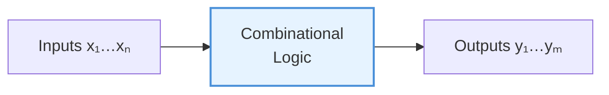
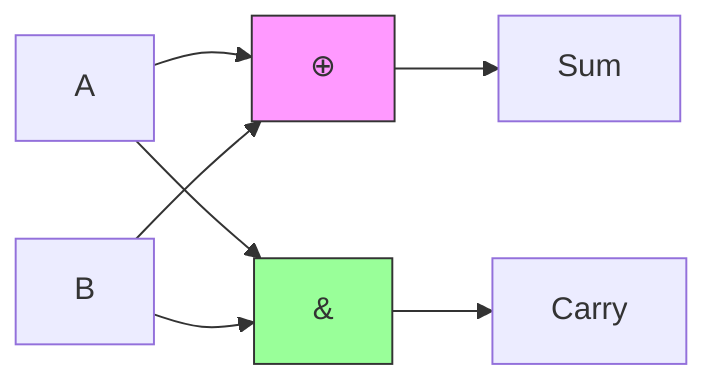
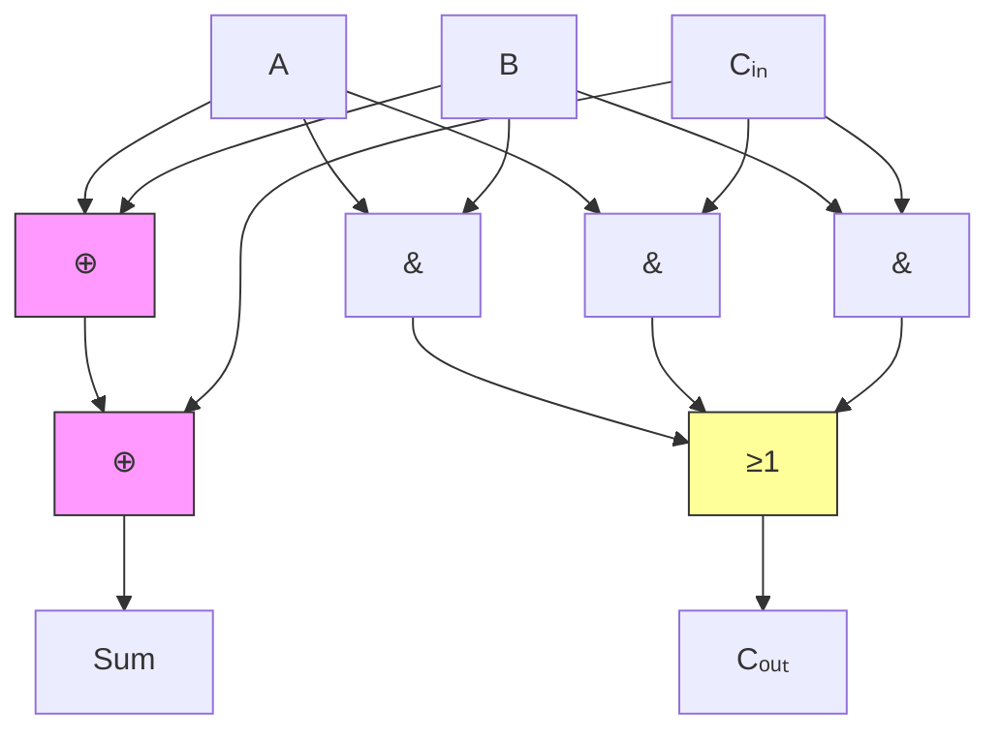
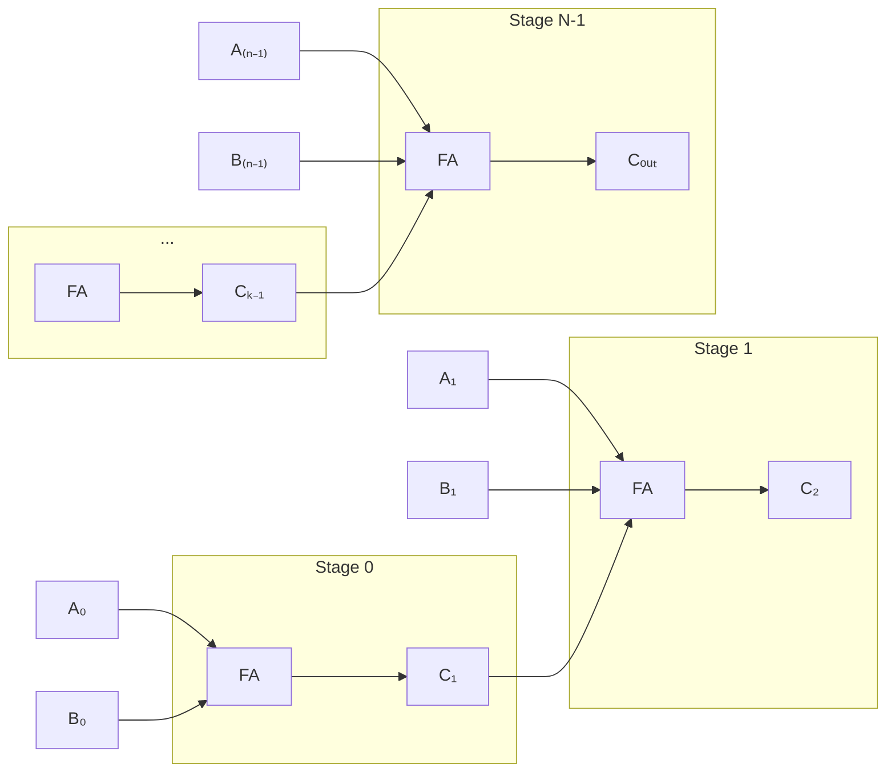
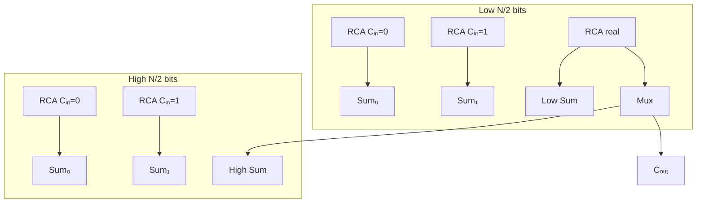
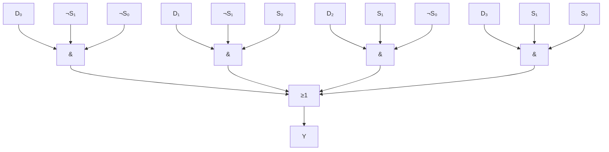
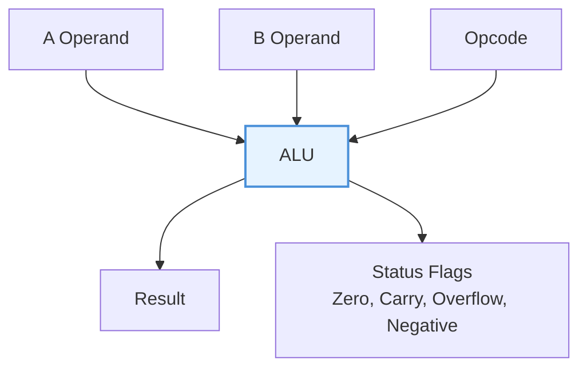
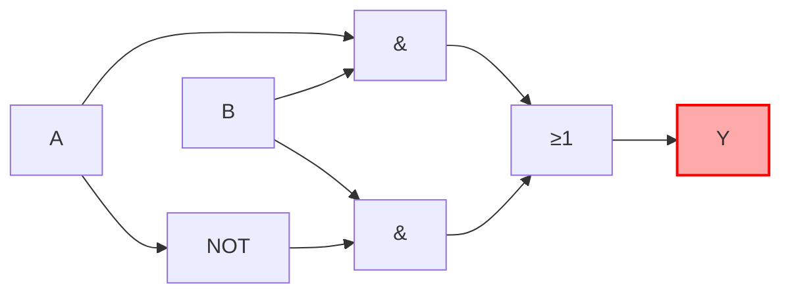

# Chapter 5: Combinational Circuits

> **Prereq:** Chapter 4 (Karnaugh Maps) — minimised expressions are the building blocks for efficient combinational circuits.
> **Next:** Chapter 6 (Sequential Circuits) — combinational logic feeds the next-state logic of sequential systems.

## Learning Objectives

By the conclusion of this chapter, the student shall be able to:

1. Analyse and design half-adder, full-adder, and ripple-carry adder circuits
2. Implement carry-lookahead and carry-select adders for high-performance arithmetic
3. Construct subtractors using 2's complement addition
4. Design multiplexers, demultiplexers, encoders, and decoders from fundamental gates
5. Build magnitude comparators using iterative logic
6. Combine arithmetic and logic operations into a functional ALU
7. Construct BCD adders, code converters, and parity generators
8. Evaluate propagation delay and area trade-offs across circuit families

## 5.1 Introduction to Combinational Circuits

A **combinational circuit** is a digital circuit whose output depends **only on the present combination of inputs** — it has no memory, no feedback path, and no clock. Every combinational circuit can be described by a set of Boolean functions, a truth table, or a netlist of gates.

### 5.1.1 Formal Definition

A combinational circuit with `n` binary inputs and `m` binary outputs realises `m` switching functions:

```
yⱼ = fⱼ(x₁, x₂, ..., xₙ)   for j = 1, 2, ..., m
```

The **delay** through the circuit is the time from an input change until all outputs settle to their final values. This delay limits the maximum clock frequency in sequential systems that use combinational logic in their datapath.



### 5.1.2 Design Procedure

1. **Specification** — state what the circuit does
2. **Truth table** — enumerate all 2ⁿ input combinations and the required outputs
3. **Boolean equations** — derive minimised SOP or POS expressions (use K-maps or QMC)
4. **Logic diagram** — map equations to gates
5. **Verification** — simulate or test the circuit

## 5.2 Binary Adders

Addition is the fundamental arithmetic operation. All other arithmetic (subtraction, multiplication, division) builds on addition.

### 5.2.1 Half Adder

The half adder adds two 1-bit binary digits and produces a sum and a carry.

| A | B | Sum (S) | Carry (C) |
|---|---|---------|-----------|
| 0 | 0 | 0       | 0         |
| 0 | 1 | 1       | 0         |
| 1 | 0 | 1       | 0         |
| 1 | 1 | 0       | 1         |

```
S = A ⊕ B
C = A · B
```



### 5.2.2 Full Adder

The full adder adds three 1-bit inputs: A, B, and Carry-In (Cᵢₙ).

```typescript
function fullAdder(A: number, B: number, Cin: number): { sum: number; Cout: number } {
    const sum = A ^ B ^ Cin;
    const Cout = (A & B) | (A & Cin) | (B & Cin);
    return { sum, Cout };
}

// Verify truth table
for (let i = 0; i < 8; i++) {
    const A = (i >> 2) & 1;
    const B = (i >> 1) & 1;
    const Cin = i & 1;
    const { sum, Cout } = fullAdder(A, B, Cin);
    console.log(`${A} ${B} ${Cin} | ${sum} ${Cout}`);
}
```

**Minimised SOP equations** (from K-map):

```
Sum    = A ⊕ B ⊕ Cᵢₙ
Cₒᵤₜ  = A·B + A·Cᵢₙ + B·Cᵢₙ
```



### 5.2.3 Ripple-Carry Adder (RCA)

An N-bit ripple-carry adder cascades N full adders, with the carry-out of stage `i` feeding the carry-in of stage `i+1`.



```typescript
interface FAOutput { sum: number; Cout: number; }

function fullAdder(A: number, B: number, Cin: number): FAOutput {
    return {
        sum: A ^ B ^ Cin,
        Cout: (A & B) | (A & Cin) | (B & Cin)
    };
}

function rippleCarryAdd(A: number, B: number, bits: number): { sum: number; Cout: number } {
    let result = 0;
    let carry = 0;
    for (let i = 0; i < bits; i++) {
        const aBit = (A >> i) & 1;
        const bBit = (B >> i) & 1;
        const fa = fullAdder(aBit, bBit, carry);
        result |= (fa.sum << i);
        carry = fa.Cout;
    }
    return { sum: result, Cout: carry };
}

// 4-bit example
const a = 0b0110; // 6
const b = 0b0101; // 5
const r = rippleCarryAdd(a, b, 4);
console.log(`${a} + ${b} = ${r.sum} (carry: ${r.Cout})`); // 11
```

**Critical path delay:**

```
tᵣₐ = (N - 1) · tₒᵤₜ + tₛᵤₘ
```

Where `tₒᵤₜ` is the carry propagation delay of one FA and `tₛᵤₘ` is the final sum delay. For N=64 bits, this delay becomes prohibitive (≈3–5 ns per stage → 200–300 ns total).

### 5.2.4 Carry-Lookahead Adder (CLA)

The CLA eliminates the ripple delay by computing all carries in parallel using **generate** (G) and **propagate** (P) signals.

```
Gᵢ = Aᵢ · Bᵢ          // generate: this stage creates a carry
Pᵢ = Aᵢ ⊕ Bᵢ         // propagate: this stage passes a carry through

C₀ = Cᵢₙ
C₁ = G₀ + P₀ · C₀
C₂ = G₁ + P₁ · G₀ + P₁ · P₀ · C₀
C₃ = G₂ + P₂ · G₁ + P₂ · P₁ · G₀ + P₂ · P₁ · P₀ · C₀
```

Each carry is a 2-level AND-OR expression, regardless of N. Practical CLA adders use 4-bit blocks (lookahead width of 4) to limit fan-in.

```typescript
function cla4(A: number, B: number, Cin: number): { sum: number; Cout: number } {
    const G = Array(4);
    const P = Array(4);
    for (let i = 0; i < 4; i++) {
        const ai = (A >> i) & 1;
        const bi = (B >> i) & 1;
        G[i] = ai & bi;
        P[i] = ai ^ bi;
    }

    // Carry equations (2-level logic)
    const C = Array(5);
    C[0] = Cin;
    C[1] = G[0] | (P[0] & C[0]);
    C[2] = G[1] | (P[1] & G[0]) | (P[1] & P[0] & C[0]);
    C[3] = G[2] | (P[2] & G[1]) | (P[2] & P[1] & G[0]) | (P[2] & P[1] & P[0] & C[0]);
    C[4] = G[3] | (P[3] & G[2]) | (P[3] & P[2] & G[1]) | (P[3] & P[2] & P[1] & G[0])
         | (P[3] & P[2] & P[1] & P[0] & C[0]);

    let sum = 0;
    for (let i = 0; i < 4; i++) {
        sum |= ((P[i] ^ C[i]) << i);
    }
    return { sum, Cout: C[4] };
}

// 4-bit CLA example
const r2 = cla4(0b0110, 0b0101, 0);
console.log(`CLA: 6 + 5 = ${r2.sum}, Cout=${r2.Cout}`);
```

**CLA delay:** `tCLA = tₚ,₉ + tₓ,ₙ + tₒᵤₜ` ≈ 4–5 gate levels regardless of word width (with block fan-in constraints).

### 5.2.5 Carry-Select Adder

The carry-select adder (CSA) computes sums for both possible carry-in values (0 and 1) in parallel, then uses a multiplexer to select the correct result once the actual carry arrives.



**Delay:** `tCSA = tRCA₁₂ + tMux` — roughly half the delay of a full ripple-carry adder.

## 5.3 Binary Subtractors

Subtraction is performed by adding the 2's complement of the subtrahend:

```
A - B = A + (¬B + 1)
```

A **full subtractor** has three inputs (A, B, Borrow-In) and two outputs (Difference, Borrow-Out):

```
Diff = A ⊕ B ⊕ Bᵢₙ
Bₒᵤₜ = ¬A·B + ¬A·Bᵢₙ + B·Bᵢₙ
```

An **adder-subtractor** unit uses a control line (SUB) to select between addition and subtraction:

```typescript
function addSub(A: number, B: number, sub: boolean, bits: number): number {
    const bInput = sub ? (~B) & ((1 << bits) - 1) : B;
    const carryIn = sub ? 1 : 0;
    let result = 0;
    let carry = carryIn;
    for (let i = 0; i < bits; i++) {
        const aBit = (A >> i) & 1;
        const bBit = (bInput >> i) & 1;
        const fa = fullAdder(aBit, bBit, carry);
        result |= (fa.sum << i);
        carry = fa.Cout;
    }
    return result;
}

console.log(`6 + 5 = ${addSub(6, 5, false, 4)}`);  // 11
console.log(`6 - 5 = ${addSub(6, 5, true, 4)}`);   // 1
```

## 5.4 Multiplexers

A **multiplexer (MUX)** selects one of 2ⁿ data inputs and routes it to the output based on `n` select lines.

### 5.4.1 2:1 Multiplexer

```
S = 0 → Y = A
S = 1 → Y = B

Y = (¬S · A) + (S · B)
```

```typescript
function mux2(A: number, B: number, S: number): number {
    return (S === 0) ? A : B;
}
```

### 5.4.2 4:1 Multiplexer

```
Y = (¬S₁·¬S₀·D₀) + (¬S₁·S₀·D₁) + (S₁·¬S₀·D₂) + (S₁·S₀·D₃)
```

```typescript
function mux4(D: number[], S: number): number {
    // S is 2-bit select [S1, S0]
    const idx = S & 0b11;
    return D[idx];
}
```



### 5.4.3 Using Multiplexers for Logic Implementation

Any Boolean function can be implemented using a multiplexer by tying data inputs to VCC or GND based on the truth table. An n-variable function requires a 2ⁿ:1 MUX.

```typescript
// Implement F(A,B,C) = Σm(1,3,5,6) using an 8:1 MUX
function implWithMux(A: number, B: number, C: number): number {
    const truthTable = [0, 1, 0, 1, 0, 1, 1, 0]; // D0..D7
    const select = (A << 2) | (B << 1) | C;
    return truthTable[select];
}
```

## 5.5 Demultiplexers

A **demultiplexer (DEMUX)** routes one data input to one of 2ⁿ outputs based on `n` select lines.

```typescript
function demux1x4(D: number, S: number): number[] {
    const Y = [0, 0, 0, 0];
    const idx = S & 0b11;
    Y[idx] = D;
    return Y;
}

console.log(demux1x4(1, 0b10)); // [0, 0, 1, 0]
```

## 5.6 Encoders

An **encoder** converts 2ⁿ input lines into an n-bit binary code.

### 5.6.1 4:2 Priority Encoder

A priority encoder handles multiple active inputs by encoding the highest-priority one.

```typescript
function priorityEncoder4(I: number[]): { code: number; valid: boolean } {
    // I[3] has highest priority, I[0] lowest
    if (I[3]) return { code: 0b11, valid: true };
    if (I[2]) return { code: 0b10, valid: true };
    if (I[1]) return { code: 0b01, valid: true };
    if (I[0]) return { code: 0b00, valid: true };
    return { code: 0b00, valid: false };
}
```

## 5.7 Decoders

A **decoder** converts an n-bit binary code into 2ⁿ mutually exclusive output lines.

### 5.7.1 3:8 Decoder

```typescript
function decoder3to8(A: number): number[] {
    const Y = Array(8).fill(0);
    const idx = A & 0b111;
    Y[idx] = 1;
    return Y;
}

// Active-high output
console.log(decoder3to8(5)); // [0,0,0,0,0,1,0,0]
```

### 5.7.2 Decoder-Based Logic Implementation

Any n-variable function can be implemented with an n:2ⁿ decoder and an OR gate — a direct realisation of the canonical sum-of-minterms form.

```typescript
// Implement F = Σm(1,3,5,6) using a 3:8 decoder
function decoderLogic(A: number, B: number, C: number): number {
    const minterms = decoder3to8((A << 2) | (B << 1) | C);
    // OR together minterms 1, 3, 5, 6
    return minterms[1] | minterms[3] | minterms[5] | minterms[6];
}
```

## 5.8 Magnitude Comparators

A comparator determines the relationship between two binary numbers: A > B, A = B, or A < B.

### 5.8.1 1-Bit Comparator

```
E = (A ⊕ B)'        // A equals B
L = ¬A · B          // A less than B
G = A · ¬B          // A greater than B
```

### 5.8.2 Iterative N-Bit Comparator

```typescript
interface CmpResult { greater: number; equal: number; less: number; }

function compare(A: number, B: number, bits: number): CmpResult {
    let greater = 0;
    let equal = 1;
    let less = 0;

    for (let i = bits - 1; i >= 0; i--) {
        const ai = (A >> i) & 1;
        const bi = (B >> i) & 1;
        const newGreater = (ai & ~bi) | (equal & ai & ~bi);
        const newLess = (~ai & bi) | (equal & ~ai & bi);
        equal = equal & (ai ^ bi) ^ 1;
        greater = newGreater;
        less = newLess;
    }
    return { greater, equal, less };
}

console.log(compare(0b1010, 0b0110, 4)); // { greater: 1, equal: 0, less: 0 }
```

## 5.9 Arithmetic Logic Unit

The ALU is the computational core of a processor — a single combinational circuit that performs multiple arithmetic and logic operations selected by control lines.



### 5.9.1 4-Bit ALU Design

```typescript
type ALUOp = 'ADD' | 'SUB' | 'AND' | 'OR' | 'XOR' | 'SLT';

interface ALUResult {
    value: number;
    zero: boolean;
    carry: boolean;
    overflow: boolean;
    negative: boolean;
}

function alu(A: number, B: number, op: ALUOp, bits: number): ALUResult {
    const maxVal = (1 << bits) - 1;
    const signBit = 1 << (bits - 1);
    let value = 0;
    let carry = false;
    let overflow = false;

    switch (op) {
        case 'ADD': {
            const r = rippleCarryAdd(A, B, bits);
            value = r.sum & maxVal;
            carry = r.Cout !== 0;
            overflow = ((A & signBit) === (B & signBit)) &&
                       ((value & signBit) !== (A & signBit));
            break;
        }
        case 'SUB': {
            const negB = (~B) & maxVal;
            const r = rippleCarryAdd(A, negB + 1, bits);
            value = r.sum & maxVal;
            overflow = ((A & signBit) !== ((negB + 1) & signBit)) &&
                       ((value & signBit) !== (A & signBit));
            break;
        }
        case 'AND': value = A & B; break;
        case 'OR':  value = A | B; break;
        case 'XOR': value = A ^ B; break;
        case 'SLT': value = (A < B) ? 1 : 0; break;
    }

    const negative = (value & signBit) !== 0;
    const zero = value === 0;

    return { value, zero, carry, overflow, negative };
}

// Example: compute flags
const r3 = alu(0b0111, 0b0001, 'ADD', 4); // 7 + 1 = 8
console.log(r3); // value=8, zero=false, carry=false, overflow=true, negative=true

const r4 = alu(0b0010, 0b0011, 'SUB', 4); // 2 - 3 = -1
console.log(r4); // value=15 (1111), zero=false, negative=true
```

### 5.9.2 Status Flags

- **Zero (Z):** asserted when the result is all zeros
- **Carry (C):** asserted when addition produces a carry out of the MSB
- **Overflow (V):** asserted when signed arithmetic overflows the representable range
- **Negative (N):** equals the MSB of the result (sign bit)

## 5.10 Code Converters

### 5.10.1 BCD to 7-Segment Decoder

Converts a 4-bit BCD digit to the 7-segment display pattern (a–g).

```typescript
function bcdTo7Seg(bcd: number): string {
    const patterns: Record<number, string> = {
        0: '1111110', 1: '0110000', 2: '1101101', 3: '1111001',
        4: '0110011', 5: '1011011', 6: '1011111', 7: '1110000',
        8: '1111111', 9: '1111011'
    };
    return patterns[bcd] || '0000000';
}

for (let d = 0; d <= 9; d++) {
    console.log(`${d}: ${bcdTo7Seg(d)}`);
}
```

```mermaid
graph TD
    subgraph "7-Segment Display"
        A[--- a ---]
        B[|] C[|]
        D[--- g ---]
        E[|] F[|]
        G[--- d ---]
    end
```

### 5.10.2 Binary to Gray Code

```typescript
function binToGray(bin: number): number {
    return bin ^ (bin >> 1);
}

function grayToBin(gray: number, bits: number): number {
    let bin = 0;
    for (let i = bits - 1; i >= 0; i--) {
        bin |= ((gray >> i) & 1) ^ ((bin >> (i + 1)) & 1) << i;
    }
    return bin;
}

for (let i = 0; i < 8; i++) {
    const g = binToGray(i);
    const b = grayToBin(g, 3);
    console.log(`${i} → ${g} → ${b}`);
}
```

## 5.11 Parity Generators and Checkers

Parity bits detect single-bit errors in data transmission.

```typescript
function evenParity(data: number, bits: number): number {
    let p = 0;
    for (let i = 0; i < bits; i++) {
        p ^= (data >> i) & 1;
    }
    return p; // parity bit
}

function checkEvenParity(data: number, parity: number, bits: number): boolean {
    let p = parity;
    for (let i = 0; i < bits; i++) {
        p ^= (data >> i) & 1;
    }
    return p === 0; // true if no error
}

const data = 0b1011010;
const p = evenParity(data, 7);
console.log(`Data: ${data.toString(2)}, Parity: ${p}`); // 0
console.log(`Check: ${checkEvenParity(data, p, 7)}`);   // true
console.log(`With error: ${checkEvenParity(data, p ^ 1, 7)}`); // false
```

## 5.12 Timing Hazards in Combinational Circuits

A **hazard** is a momentary glitch on the output caused by unequal propagation delays through different paths.

### 5.12.1 Static Hazards

- **Static-1 hazard:** output should remain 1 but briefly dips to 0
- **Static-0 hazard:** output should remain 0 but briefly rises to 1



The circuit `Y = A·B + ¬A·B` has a static-1 hazard when B=1 and A transitions. The fix is to add the consensus term `B` (redundant logic).

### 5.12.2 Dynamic Hazards

A **dynamic hazard** causes the output to oscillate multiple times before settling. These occur when there are three or more paths with different delays.

### 5.12.3 Hazard Detection and Elimination

Hazards are detected by examining the K-map: if adjacent minterms are covered by different product terms, a hazard exists. The fix is to add the redundant prime implicant that bridges the gap.

```typescript
// Hazard-prone circuit: F = A·B + ¬A·C
function hazardF(A: number, B: number, C: number): number {
    return (A & B) | (~A & C);
}

// Hazard-free circuit: F = A·B + ¬A·C + B·C (consensus term added)
function hazardFreeF(A: number, B: number, C: number): number {
    return (A & B) | (~A & C) | (B & C);
}

// Test all transitions
for (let a = 0; a <= 1; a++) {
    for (let b = 0; b <= 1; b++) {
        for (let c = 0; c <= 1; c++) {
            const f1 = hazardF(a, b, c);
            const f2 = hazardFreeF(a, b, c);
            console.log(`A=${a} B=${b} C=${c} → F=${f1} F_hf=${f2}`);
        }
    }
}
```

## 5.13 Practical Design Considerations

### 5.13.1 Fan-Out and Loading

Each gate output can drive a limited number of inputs (fan-out). Exceeding the fan-out degrades noise margins and increases delay.

| Gate Family | Typical Fan-Out |
|-------------|-----------------|
| TTL (74LS)  | 10–20           |
| CMOS (74HC) | 50+             |
| Advanced CMOS | 20+          |

### 5.13.2 Propagation Delay Comparison

| Adder Type | 4-bit Delay | 16-bit Delay | 64-bit Delay |
|------------|-------------|--------------|--------------|
| Ripple-Carry | 4 tp      | 16 tp         | 64 tp        |
| Carry-Lookahead | 4 tp   | 8 tp          | 12 tp        |
| Carry-Select | 3 tp       | 6 tp          | 8 tp         |
| Brent-Kung | —           | 6 tp          | 8 tp         |

### 5.13.3 Power Optimisation

- **Operand isolation:** gate the inputs to unused ALU functions
- **Data gating:** disable the adder when the ALU performs a logic operation
- **Low-power encoding:** use Gray code for multi-bit transitions

## Practical Takeaways

1. **Ripple-carry adders are simple but slow** — use CLA or CSA for high-performance datapaths
2. **Multiplexers implement any Boolean function** — a 2ⁿ:1 MUX + inverter is universal for n-variable functions
3. **Priority encoders prevent metastability** — always handle the case where no input is active
4. **Hazards matter in asynchronous paths** — add redundant consensus terms to eliminate static hazards
5. **Design for testability** — include scan chains and observability points in complex combinational blocks

## TypeScript Implementations

```typescript
// === Decoder (N:2^N) ===
class Decoder {
    static decode(input: number, n: number): number[] {
        const outputs = new Array(1 << n).fill(0);
        if (input < outputs.length) outputs[input] = 1;
        return outputs;
    }
}

// === Priority Encoder ===
class PriorityEncoder {
    static encode(inputs: number[]): { code: number; valid: boolean } {
        for (let i = inputs.length - 1; i >= 0; i--) {
            if (inputs[i] === 1) return { code: i, valid: true };
        }
        return { code: 0, valid: false };
    }
}

// === Multiplexer ===
class Multiplexer {
    static mux2(inputs: [number, number], sel: number): number { return inputs[sel]; }
    static mux4(inputs: number[], sel: number): number { return inputs[sel] ?? 0; }
    static mux8(inputs: number[], sel: number): number { return inputs[sel] ?? 0; }
}

// === Demultiplexer ===
class Demultiplexer {
    static demux1_2(input: number, sel: number): number[] {
        const out = [0, 0]; out[sel] = input; return out;
    }
    static demux1_4(input: number, sel: number): number[] {
        const out = [0, 0, 0, 0]; out[sel] = input; return out;
    }
}

// === Comparator ===
class Comparator {
    static compare4(a: number, b: number): { gt: number; eq: number; lt: number } {
        return {
            gt: a > b ? 1 : 0,
            eq: a === b ? 1 : 0,
            lt: a < b ? 1 : 0,
        };
    }
    static compare8(a: number, b: number): { gt: number; eq: number; lt: number } {
        const h = Comparator.compare4(a >> 4, b >> 4);
        if (h.gt || h.lt) return h;
        return Comparator.compare4(a & 0xF, b & 0xF);
    }
}

// === ALU (4-bit) ===
class ALU4 {
    static operate(a: number, b: number, op: number): { result: number; flags: { zero: number; carry: number } } {
        let result = 0;
        switch (op) {
            case 0: result = a & b; break;       // AND
            case 1: result = a | b; break;       // OR
            case 2: result = a ^ b; break;       // XOR
            case 3: result = ~a & 0xF; break;    // NOT A
            case 4: result = (a + b) & 0xF; break; // ADD
            case 5: result = (a - b) & 0xF; break; // SUB
            case 6: result = (a << 1) & 0xF; break; // SHL
            case 7: result = (a >> 1) & 0xF; break; // SHR
        }
        const carry = op === 4 && (a + b) > 15 ? 1 : op === 5 && a < b ? 1 : 0;
        return { result, flags: { zero: result === 0 ? 1 : 0, carry } };
    }
}

// === Full Adder ===
function fullAdder(a: number, b: number, cin: number): { sum: number; cout: number } {
    const sum = a ^ b ^ cin;
    const cout = (a & b) | (cin & (a ^ b));
    return { sum, cout };
}

// === Ripple-Carry Adder (8-bit) ===
function rippleCarry8(a: number, b: number): { sum: number; carry: number } {
    let sum = 0, carry = 0;
    for (let i = 0; i < 8; i++) {
        const ba = (a >> i) & 1, bb = (b >> i) & 1;
        const fa = fullAdder(ba, bb, carry);
        sum |= (fa.sum << i);
        carry = fa.cout;
    }
    return { sum, carry };
}

// === Parity Generator / Checker ===
class Parity {
    static evenParity(data: number, bits: number): number {
        let p = 0;
        for (let i = 0; i < bits; i++) p ^= (data >> i) & 1;
        return p;
    }
    static checkEven(data: number, bits: number, parity: number): boolean {
        return Parity.evenParity(data, bits) === parity;
    }
}

// === Demo ===
console.log('Decoder 3:8 input=5:', Decoder.decode(5, 3));
console.log('PriorityEncoder [0,1,0,1]:', PriorityEncoder.encode([0, 1, 0, 1]));
console.log('MUX4([10,20,30,40], sel=2):', Multiplexer.mux4([10, 20, 30, 40], 2));
console.log('ALU4 ADD(7, 6):', ALU4.operate(7, 6, 4));
console.log('RippleCarry8(200, 55):', rippleCarry8(200, 55));
```

## Summary

Combinational circuits form the computational fabric of digital systems. This chapter covered the full design spectrum: from simple half-adders through carry-lookahead adders, multiplexers, decoders, encoders, comparators, and a complete ALU. Each circuit type was presented with minimised Boolean equations, gate-level implementations, TypeScript simulations, and practical trade-off analysis. The next chapter extends these concepts by adding state — introducing sequential circuits that combine combinational logic with memory elements.

## Chapter Quiz

**Q1.** What is the critical path delay of a 32-bit ripple-carry adder?
a) t_FA + 31 · t_carry
b) 32 · t_FA
c) t_carry + t_sum
d) log₂(32) · t_FA

**Q2.** The carry-lookahead adder computes carries in parallel using which two signals?
a) Generate and Propagate
b) Set and Reset
c) Lookahead and Feedback
d) Sum and Carry

**Q3.** A 4:1 multiplexer requires how many select lines?
a) 1
b) 2
c) 3
d) 4

**Q4.** A static-1 hazard occurs when:
a) The output oscillates before settling
b) The output is stuck at 1 regardless of input
c) The output briefly drops to 0 when it should remain 1
d) The output briefly rises to 1 when it should remain 0

**Q5.** In a priority encoder, when multiple inputs are active simultaneously:
a) All active inputs are encoded
b) The lowest-priority input is encoded
c) The highest-priority input is encoded
d) The output is undefined

### Answers

Q1: a | Q2: a | Q3: b | Q4: c | Q5: c

## Exercises

1. **Ripple-carry adder:** Write a TypeScript function that computes the sum of two 8-bit numbers using a cascade of full adders. Verify correctness for 10 random test cases.

2. **CLA extension:** Extend the 4-bit CLA to handle 8 bits using two 4-bit CLA blocks with block generate/propagate logic. Measure the delay improvement over ripple-carry.

3. **Priority encoder:** Design a 16:4 priority encoder using a hierarchical approach (four 4:2 encoders feeding a second-stage encoder). Implement in TypeScript.

4. **ALU extension:** Add shift-left, shift-right, and NOR operations to the 4-bit ALU. Show the control encoding and verify with a test harness.

5. **Hazard analysis:** For the function F = A·C + B·¬C, identify all static hazards and write TypeScript code to verify the hazard-free version.

6. **Comparator tree:** Design an 8-bit comparator using a tree of 4-bit comparator blocks. Implement in TypeScript and compare the delay with an iterative design.

7. **BCD to excess-3 converter:** Write truth tables, minimise using K-maps, and implement a BCD-to-Excess-3 code converter in TypeScript.

8. **Parity checker network:** Design a 16-bit parity generator/checker using a tree of 2-input XOR gates. Measure the critical path depth.

9. **Multi-function logic unit:** Design a circuit that can perform any of the 16 possible 2-input Boolean functions (AND, OR, XOR, NAND, etc.) using a single 4:1 MUX per output bit.

10. **FPGA adder comparison:** Write TypeScript to model the area (gate count) and delay for 8-bit RCA, CLA, and carry-select adders. Plot the trade-off curve.
