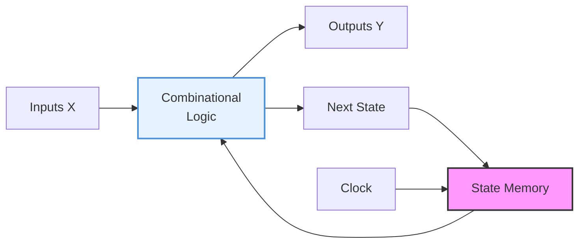
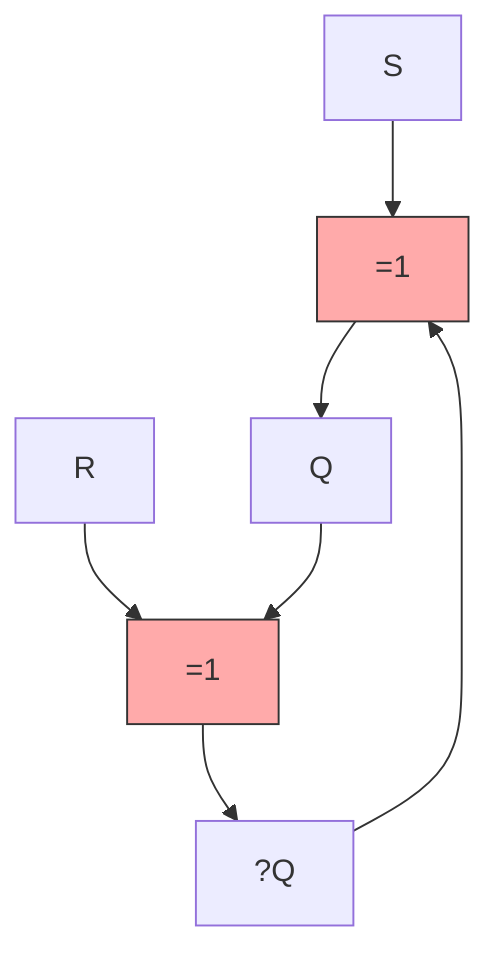
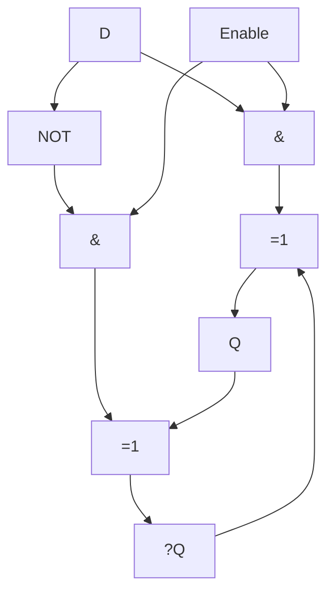
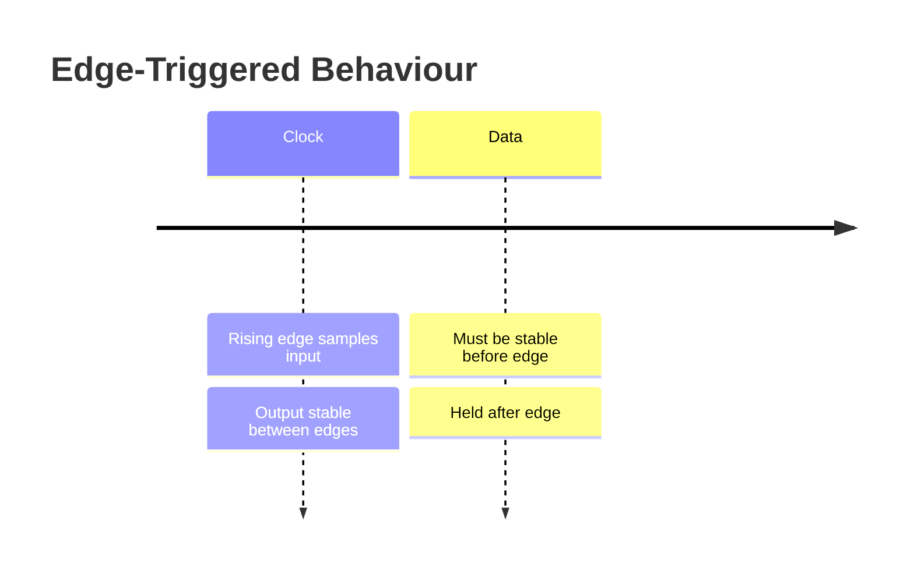
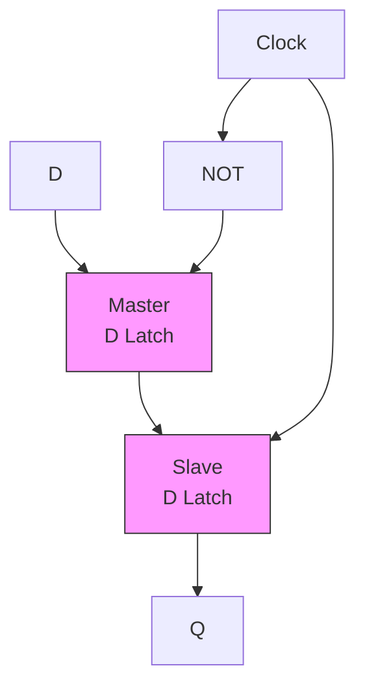
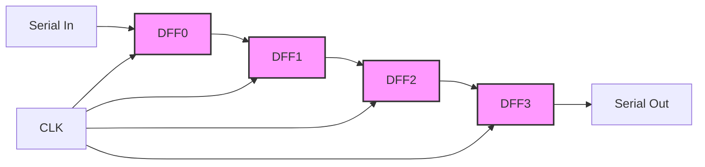
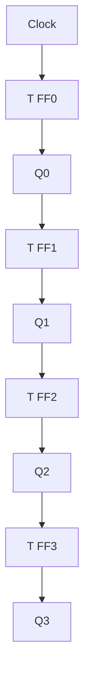
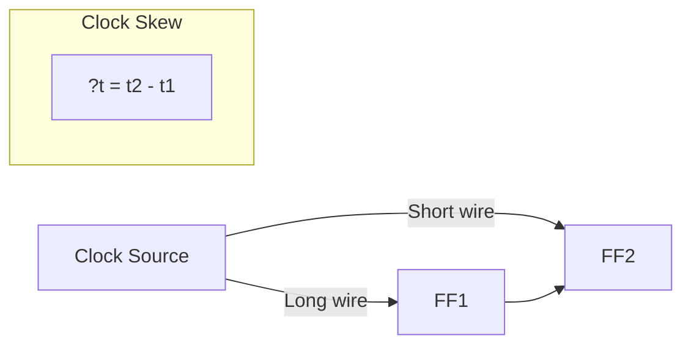
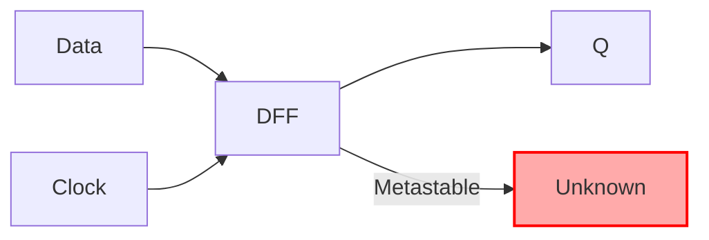

# Chapter 6: Sequential Circuits

> **Prereq:** Chapter 5 (Combinational Circuits) ? sequential circuits add memory to combinational logic.
> **Next:** Chapter 7 (State Machines) ? sequential circuits with a systematic state-transition structure.

## Learning Objectives

By the conclusion of this chapter, the student shall be able to:

1. Distinguish between latches and flip-flops and explain their timing behaviour
2. Analyse SR, D, JK, and T flip-flops using characteristic tables and excitation tables
3. Design edge-triggered flip-flops using master-slave and transmission-gate topologies
4. Compute setup time, hold time, and propagation delay constraints
5. Build registers, shift registers, and counters from flip-flop primitives
6. Analyse clock skew and its effect on sequential circuit timing
7. Identify and eliminate race conditions and metastability

## 6.1 Introduction to Sequential Circuits

A **sequential circuit** differs from a combinational circuit in one critical respect: its output depends on **both the present inputs and the past history** of those inputs. This memory is implemented using **bistable elements** ? circuits that can store one bit of state indefinitely.



### 6.1.1 Sequential Circuit Model

<a href="../../../assets/images/diagrams/digital-logic/06-sequential-circuits/6-1-1-sequential-circuit-model-handwritten.svg" target="_blank" rel="noopener">
  
</a>
<a href="../../../assets/images/diagrams/digital-logic/06-sequential-circuits/6-1-1-sequential-circuit-model-diagram.svg" target="_blank" rel="noopener">
  
</a>
<a href="../../../assets/images/diagrams/digital-logic/06-sequential-circuits/6-1-1-sequential-circuit-model-sticky.svg" target="_blank" rel="noopener">
  
</a>


A sequential circuit is defined by:
- **Next-state function:** `S? = f(X, S)`
- **Output function:** `Y = g(X, S)` (Mealy) or `Y = g(S)` (Moore)

Where `S` is the current state, `S?` is the next state, and `X` are the primary inputs.

### 6.1.2 Classification

<a href="../../../assets/images/diagrams/digital-logic/06-sequential-circuits/6-1-2-classification-handwritten.svg" target="_blank" rel="noopener">
  
</a>
<a href="../../../assets/images/diagrams/digital-logic/06-sequential-circuits/6-1-2-classification-diagram.svg" target="_blank" rel="noopener">
  
</a>
<a href="../../../assets/images/diagrams/digital-logic/06-sequential-circuits/6-1-2-classification-sticky.svg" target="_blank" rel="noopener">
  
</a>


| Type | Clocked? | Output Depends On | Example |
|------|----------|-------------------|---------|
| Asynchronous | No | Inputs + state | SR latch |
| Synchronous (Moore) | Yes | State only | State machine |
| Synchronous (Mealy) | Yes | Inputs + state | State machine |

## 6.2 Latches

A **latch** is a level-sensitive memory element ? it follows its inputs while the enable signal is asserted and holds its value when the enable is de-asserted.

### 6.2.1 SR Latch (NOR Implementation)

<a href="../../../assets/images/diagrams/digital-logic/06-sequential-circuits/6-2-1-sr-latch-nor-implementation-handwritten.svg" target="_blank" rel="noopener">
  
</a>
<a href="../../../assets/images/diagrams/digital-logic/06-sequential-circuits/6-2-1-sr-latch-nor-implementation-diagram.svg" target="_blank" rel="noopener">
  
</a>
<a href="../../../assets/images/diagrams/digital-logic/06-sequential-circuits/6-2-1-sr-latch-nor-implementation-sticky.svg" target="_blank" rel="noopener">
  
</a>




| S | R | Q? | ?Q? | Mode |
|---|---|----|-----|------|
| 0 | 0 | Q  | ?Q  | Hold |
| 0 | 1 | 0  | 1   | Reset |
| 1 | 0 | 1  | 0   | Set |
| 1 | 1 | 0  | 0   | Invalid |

```typescript
type LatchState = { Q: number; Qn: number };

function srLatch(S: number, R: number, prev: LatchState): LatchState {
    if (S === 1 && R === 0) return { Q: 1, Qn: 0 }; // Set
    if (S === 0 && R === 1) return { Q: 0, Qn: 1 }; // Reset
    if (S === 0 && R === 0) return prev;              // Hold
    return { Q: 0, Qn: 0 };                           // Invalid (S=R=1)
}
```

**Critical constraint:** The SR = 11 input combination is forbidden because it forces both outputs low, and when both inputs return to 0 simultaneously, the latch enters a **race condition** where the final state is unpredictable.

### 6.2.2 D Latch

<a href="../../../assets/images/diagrams/digital-logic/06-sequential-circuits/6-2-2-d-latch-handwritten.svg" target="_blank" rel="noopener">
  
</a>
<a href="../../../assets/images/diagrams/digital-logic/06-sequential-circuits/6-2-2-d-latch-diagram.svg" target="_blank" rel="noopener">
  
</a>
<a href="../../../assets/images/diagrams/digital-logic/06-sequential-circuits/6-2-2-d-latch-sticky.svg" target="_blank" rel="noopener">
  
</a>


The D latch (transparent latch) eliminates the SR invalid state by adding an inverter between S and R.

```
Q? = D when Enable = 1
Q? = Q  when Enable = 0
```



```typescript
function dLatch(D: number, enable: number, prev: number): number {
    return enable === 1 ? D : prev;
}
```

## 6.3 Flip-Flops

A **flip-flop** is an edge-triggered memory element ? it samples its inputs only on a clock edge (rising or falling) and holds the value between edges.



### 6.3.1 Edge Detection

<a href="../../../assets/images/diagrams/digital-logic/06-sequential-circuits/6-3-1-edge-detection-handwritten.svg" target="_blank" rel="noopener">
  
</a>
<a href="../../../assets/images/diagrams/digital-logic/06-sequential-circuits/6-3-1-edge-detection-diagram.svg" target="_blank" rel="noopener">
  
</a>
<a href="../../../assets/images/diagrams/digital-logic/06-sequential-circuits/6-3-1-edge-detection-sticky.svg" target="_blank" rel="noopener">
  
</a>


```typescript
type EdgeType = 'rising' | 'falling' | 'none';

function detectEdge(clk: number, prevClk: number): EdgeType {
    if (clk === 1 && prevClk === 0) return 'rising';
    if (clk === 0 && prevClk === 1) return 'falling';
    return 'none';
}
```

### 6.3.2 D Flip-Flop

<a href="../../../assets/images/diagrams/digital-logic/06-sequential-circuits/6-3-2-d-flip-flop-handwritten.svg" target="_blank" rel="noopener">
  
</a>
<a href="../../../assets/images/diagrams/digital-logic/06-sequential-circuits/6-3-2-d-flip-flop-diagram.svg" target="_blank" rel="noopener">
  
</a>
<a href="../../../assets/images/diagrams/digital-logic/06-sequential-circuits/6-3-2-d-flip-flop-sticky.svg" target="_blank" rel="noopener">
  
</a>


The D flip-flop is the most widely used storage element in digital design. On each clock edge, it copies the D input to the Q output.

```
Q? = D  (on rising edge of clock)
```



```typescript
interface FlipFlop {
    Q: number;
    update(D: number, clk: number): void;
}

class DFlipFlop implements FlipFlop {
    Q: number = 0;
    private prevClk: number = 0;

    update(D: number, clk: number): void {
        if (clk === 1 && this.prevClk === 0) { // rising edge
            this.Q = D;
        }
        this.prevClk = clk;
    }
}

// Simulate a D flip-flop
const dff = new DFlipFlop();
for (const [clk, D] of [[0,0],[1,0],[0,0],[1,1],[0,1],[1,0],[0,0]]) {
    dff.update(D, clk);
    console.log(`CLK=${clk} D=${D} ? Q=${dff.Q}`);
}
```

### 6.3.3 JK Flip-Flop

<a href="../../../assets/images/diagrams/digital-logic/06-sequential-circuits/6-3-3-jk-flip-flop-handwritten.svg" target="_blank" rel="noopener">
  
</a>
<a href="../../../assets/images/diagrams/digital-logic/06-sequential-circuits/6-3-3-jk-flip-flop-diagram.svg" target="_blank" rel="noopener">
  
</a>
<a href="../../../assets/images/diagrams/digital-logic/06-sequential-circuits/6-3-3-jk-flip-flop-sticky.svg" target="_blank" rel="noopener">
  
</a>


The JK flip-flop is a universal flip-flop that combines the behaviour of all other types.

| J | K | Q?     | Mode    |
|---|----|--------|---------|
| 0 | 0  | Q      | Hold    |
| 0 | 1  | 0      | Reset   |
| 1 | 0  | 1      | Set     |
| 1 | 1  | ?Q     | Toggle  |

```typescript
class JKFlipFlop implements FlipFlop {
    Q: number = 0;
    private prevClk: number = 0;

    update(J: number, K: number, clk: number): void {
        if (clk === 1 && this.prevClk === 0) {
            this.Q = (J & ~this.Q) | (~K & this.Q);
            // Alternative: T = J & ~Q | ~K & Q
        }
        this.prevClk = clk;
    }
}
```

### 6.3.4 T Flip-Flop

<a href="../../../assets/images/diagrams/digital-logic/06-sequential-circuits/6-3-4-t-flip-flop-handwritten.svg" target="_blank" rel="noopener">
  
</a>
<a href="../../../assets/images/diagrams/digital-logic/06-sequential-circuits/6-3-4-t-flip-flop-diagram.svg" target="_blank" rel="noopener">
  
</a>
<a href="../../../assets/images/diagrams/digital-logic/06-sequential-circuits/6-3-4-t-flip-flop-sticky.svg" target="_blank" rel="noopener">
  
</a>


The T flip-flop toggles its state whenever T=1 on a clock edge.

```
Q? = Q ? T
```

```typescript
class TFlipFlop implements FlipFlop {
    Q: number = 0;
    private prevClk: number = 0;

    update(T: number, clk: number): void {
        if (clk === 1 && this.prevClk === 0) {
            this.Q = this.Q ^ T; // toggle
        }
        this.prevClk = clk;
    }
}
```

### 6.3.5 Flip-Flop Conversion

<a href="../../../assets/images/diagrams/digital-logic/06-sequential-circuits/6-3-5-flip-flop-conversion-handwritten.svg" target="_blank" rel="noopener">
  
</a>
<a href="../../../assets/images/diagrams/digital-logic/06-sequential-circuits/6-3-5-flip-flop-conversion-diagram.svg" target="_blank" rel="noopener">
  
</a>
<a href="../../../assets/images/diagrams/digital-logic/06-sequential-circuits/6-3-5-flip-flop-conversion-sticky.svg" target="_blank" rel="noopener">
  
</a>


Any flip-flop type can be converted to another by deriving the appropriate input equations.

```typescript
function dToJK(D: number, Q: number): { J: number; K: number } {
    return { J: D, K: ~D & 1 };
}

function jkToD(J: number, K: number): number {
    // D = J?Q? + K??Q ? but for next state, D = Q?
    // We need the excitation function
    if (J === 0 && K === 1) return 0;
    if (J === 1 && K === 0) return 1;
    if (J === 0 && K === 0) return J; // meaningless here
    return -1; // toggle case needs Q
}
```

## 6.4 Characteristic and Excitation Tables

### 6.4.1 Characteristic Table

<a href="../../../assets/images/diagrams/digital-logic/06-sequential-circuits/6-4-1-characteristic-table-handwritten.svg" target="_blank" rel="noopener">
  
</a>
<a href="../../../assets/images/diagrams/digital-logic/06-sequential-circuits/6-4-1-characteristic-table-diagram.svg" target="_blank" rel="noopener">
  
</a>
<a href="../../../assets/images/diagrams/digital-logic/06-sequential-circuits/6-4-1-characteristic-table-sticky.svg" target="_blank" rel="noopener">
  
</a>


Describes the next state `Q?` as a function of current state `Q` and inputs.

| Flip-Flop | Characteristic Equation |
|-----------|------------------------|
| D         | Q? = D                 |
| SR        | Q? = S + ?R?Q          |
| JK        | Q? = J??Q + ?K?Q       |
| T         | Q? = Q ? T             |

### 6.4.2 Excitation Table

<a href="../../../assets/images/diagrams/digital-logic/06-sequential-circuits/6-4-2-excitation-table-handwritten.svg" target="_blank" rel="noopener">
  
</a>
<a href="../../../assets/images/diagrams/digital-logic/06-sequential-circuits/6-4-2-excitation-table-diagram.svg" target="_blank" rel="noopener">
  
</a>
<a href="../../../assets/images/diagrams/digital-logic/06-sequential-circuits/6-4-2-excitation-table-sticky.svg" target="_blank" rel="noopener">
  
</a>


Describes the required input to produce a desired state transition. Essential for sequential circuit design.

| Transition Q ? Q? | D | S | R | J | K | T |
|-------------------|---|---|---|---|---|---|
| 0 ? 0             | 0 | 0 | X | 0 | X | 0 |
| 0 ? 1             | 1 | 1 | 0 | 1 | X | 1 |
| 1 ? 0             | 0 | 0 | 1 | X | 1 | 1 |
| 1 ? 1             | 1 | X | 0 | X | 0 | 0 |

## 6.5 Registers

A **register** is an array of D flip-flops sharing a common clock, enabling parallel storage of an N-bit word.

```typescript
class Register {
    private flops: DFlipFlop[];
    readonly width: number;

    constructor(width: number) {
        this.width = width;
        this.flops = Array.from({ length: width }, () => new DFlipFlop());
    }

    get value(): number {
        let val = 0;
        for (let i = 0; i < this.width; i++) {
            val |= (this.flops[i].Q << i);
        }
        return val;
    }

    load(data: number, clk: number): void {
        for (let i = 0; i < this.width; i++) {
            this.flops[i].update((data >> i) & 1, clk);
        }
    }
}

const reg = new Register(8);
reg.load(0b10101100, 1);
reg.load(0b10101100, 0); // ignored (not rising edge)
console.log(`Register value: ${reg.value.toString(2).padStart(8, '0')}`);
```

### 6.5.1 Register with Enable

<a href="../../../assets/images/diagrams/digital-logic/06-sequential-circuits/6-5-1-register-with-enable-handwritten.svg" target="_blank" rel="noopener">
  
</a>
<a href="../../../assets/images/diagrams/digital-logic/06-sequential-circuits/6-5-1-register-with-enable-diagram.svg" target="_blank" rel="noopener">
  
</a>
<a href="../../../assets/images/diagrams/digital-logic/06-sequential-circuits/6-5-1-register-with-enable-sticky.svg" target="_blank" rel="noopener">
  
</a>


Many designs require conditional loading. An enable signal gates the clock or the data.

```typescript
class EnabledRegister {
    private flops: DFlipFlop[];
    readonly width: number;

    constructor(width: number) {
        this.width = width;
        this.flops = Array.from({ length: width }, () => new DFlipFlop());
    }

    get value(): number {
        let val = 0;
        for (let i = 0; i < this.width; i++) {
            val |= (this.flops[i].Q << i);
        }
        return val;
    }

    load(data: number, enable: number, clk: number): void {
        // MUX at input: D = enable ? data_in : Q
        const actualData = enable === 1 ? data : this.value;
        for (let i = 0; i < this.width; i++) {
            this.flops[i].update((actualData >> i) & 1, clk);
        }
    }
}
```

## 6.6 Shift Registers

A **shift register** moves data one position per clock cycle. It is the fundamental building block for serial communication, delay lines, and sequence generators.



```typescript
class ShiftRegister {
    private flops: DFlipFlop[];
    readonly width: number;

    constructor(width: number) {
        this.width = width;
        this.flops = Array.from({ length: width }, () => new DFlipFlop());
    }

    get value(): number {
        let val = 0;
        for (let i = 0; i < this.width; i++) {
            val |= (this.flops[i].Q << i);
        }
        return val;
    }

    shift(serialIn: number, clk: number): number {
        const serialOut = this.flops[this.width - 1].Q;
        for (let i = this.width - 1; i > 0; i--) {
            const prevQ = this.flops[i - 1].Q;
            this.flops[i].update(prevQ, clk);
        }
        this.flops[0].update(serialIn, clk);
        return serialOut;
    }
}

// Serial-in, parallel-out demo
const sr = new ShiftRegister(4);
sr.shift(1, 1); sr.shift(0, 1); sr.shift(1, 1); sr.shift(1, 1);
console.log(`SIPO: ${sr.value.toString(2).padStart(4, '0')}`); // 1101 (LSB first)
```

### 6.6.1 Universal Shift Register

<a href="../../../assets/images/diagrams/digital-logic/06-sequential-circuits/6-6-1-universal-shift-register-handwritten.svg" target="_blank" rel="noopener">
  
</a>
<a href="../../../assets/images/diagrams/digital-logic/06-sequential-circuits/6-6-1-universal-shift-register-diagram.svg" target="_blank" rel="noopener">
  
</a>
<a href="../../../assets/images/diagrams/digital-logic/06-sequential-circuits/6-6-1-universal-shift-register-sticky.svg" target="_blank" rel="noopener">
  
</a>


A universal shift register supports parallel load, shift left, shift right, and hold ? controlled by mode select lines S1, S0.

| S1 | S0 | Operation     |
|----|----|---------------|
| 0  | 0  | Hold          |
| 0  | 1  | Shift right   |
| 1  | 0  | Shift left    |
| 1  | 1  | Parallel load |

```typescript
class UniversalShiftRegister {
    private flops: DFlipFlop[];
    readonly width: number;

    constructor(width: number) {
        this.width = width;
        this.flops = Array.from({ length: width }, () => new DFlipFlop());
    }

    get value(): number {
        let val = 0;
        for (let i = 0; i < this.width; i++) {
            val |= (this.flops[i].Q << i);
        }
        return val;
    }

    operate(data: number, sLeft: number, sRight: number, mode: number, clk: number): void {
        const S0 = mode & 1;
        const S1 = (mode >> 1) & 1;

        const D = new Array(this.width);
        const cur = this.value;

        for (let i = 0; i < this.width; i++) {
            if (S1 === 0 && S0 === 0) D[i] = (cur >> i) & 1; // Hold
            else if (S1 === 0 && S0 === 1) {                   // Shift right
                D[i] = (i === 0) ? sRight : (cur >> (i-1)) & 1;
            } else if (S1 === 1 && S0 === 0) {                 // Shift left
                D[i] = (i === this.width - 1) ? sLeft : (cur >> (i+1)) & 1;
            } else {                                            // Parallel load
                D[i] = (data >> i) & 1;
            }
        }

        for (let i = 0; i < this.width; i++) {
            this.flops[i].update(D[i], clk);
        }
    }
}
```

## 6.7 Counters

A **counter** is a sequential circuit that cycles through a predetermined sequence of states.

### 6.7.1 Binary Ripple Counter

<a href="../../../assets/images/diagrams/digital-logic/06-sequential-circuits/6-7-1-binary-ripple-counter-handwritten.svg" target="_blank" rel="noopener">
  
</a>
<a href="../../../assets/images/diagrams/digital-logic/06-sequential-circuits/6-7-1-binary-ripple-counter-diagram.svg" target="_blank" rel="noopener">
  
</a>
<a href="../../../assets/images/diagrams/digital-logic/06-sequential-circuits/6-7-1-binary-ripple-counter-sticky.svg" target="_blank" rel="noopener">
  
</a>


The simplest counter: T flip-flops with each output driving the clock of the next stage.



```typescript
class RippleCounter {
    private flops: TFlipFlop[];
    readonly width: number;

    constructor(width: number) {
        this.width = width;
        this.flops = Array.from({ length: width }, () => new TFlipFlop());
    }

    get value(): number {
        let val = 0;
        for (let i = 0; i < this.width; i++) {
            val |= (this.flops[i].Q << i);
        }
        return val;
    }

    tick(): void {
        // Ripple: each stage toggles when the previous stage's output falls
        for (let i = 0; i < this.width; i++) {
            const prevClk = (i === 0) ? 1 : this.flops[i - 1].Q;
            // We need to simulate clock edges ? simplified here
            this.flops[i].update(1, prevClk);
        }
    }
}

// Simulate a 4-bit ripple counter
const rc = new RippleCounter(4);
for (let step = 0; step < 16; step++) {
    rc.tick();
    console.log(`Step ${step + 1}: ${rc.value}`);
}
```

**Problem:** Ripple counters are slow ? the Nth stage toggles only after N gate delays.

### 6.7.2 Synchronous Binary Counter

<a href="../../../assets/images/diagrams/digital-logic/06-sequential-circuits/6-7-2-synchronous-binary-counter-handwritten.svg" target="_blank" rel="noopener">
  
</a>
<a href="../../../assets/images/diagrams/digital-logic/06-sequential-circuits/6-7-2-synchronous-binary-counter-diagram.svg" target="_blank" rel="noopener">
  
</a>
<a href="../../../assets/images/diagrams/digital-logic/06-sequential-circuits/6-7-2-synchronous-binary-counter-sticky.svg" target="_blank" rel="noopener">
  
</a>


All flip-flops share a common clock. The T input of each stage is the AND of all lower-order bits.

```
T0 = 1           (always toggle)
T1 = Q0
T2 = Q1 ? Q0
T3 = Q2 ? Q1 ? Q0
```

```typescript
class SyncCounter {
    private flops: TFlipFlop[];
    readonly width: number;

    constructor(width: number) {
        this.width = width;
        this.flops = Array.from({ length: width }, () => new TFlipFlop());
    }

    get value(): number {
        let val = 0;
        for (let i = 0; i < this.width; i++) {
            val |= (this.flops[i].Q << i);
        }
        return val;
    }

    tick(clk: number): void {
        let enable = 1;
        for (let i = 0; i < this.width; i++) {
            this.flops[i].update(this.value === (1 << i) - 1 ? 1 : 0, clk);
        }
    }
}
```

### 6.7.3 Up/Down Counter

<a href="../../../assets/images/diagrams/digital-logic/06-sequential-circuits/6-7-3-up-down-counter-handwritten.svg" target="_blank" rel="noopener">
  
</a>
<a href="../../../assets/images/diagrams/digital-logic/06-sequential-circuits/6-7-3-up-down-counter-diagram.svg" target="_blank" rel="noopener">
  
</a>
<a href="../../../assets/images/diagrams/digital-logic/06-sequential-circuits/6-7-3-up-down-counter-sticky.svg" target="_blank" rel="noopener">
  
</a>


```typescript
class UpDownCounter {
    private flops: TFlipFlop[];
    readonly width: number;

    constructor(width: number) {
        this.width = width;
        this.flops = Array.from({ length: width }, () => new TFlipFlop());
    }

    get value(): number {
        let val = 0;
        for (let i = 0; i < this.width; i++) {
            val |= (this.flops[i].Q << i);
        }
        return val;
    }

    tick(up: number, clk: number): void {
        const cur = this.value;
        for (let i = 0; i < this.width; i++) {
            const allLowerOnes = ((cur & ((1 << i) - 1)) === ((1 << i) - 1)) ? 1 : 0;
            const allLowerZeros = ((cur & ((1 << i) - 1)) === 0) ? 1 : 0;
            const toggle = up === 1 ? allLowerOnes : allLowerZeros;
            this.flops[i].update(toggle, clk);
        }
    }
}
```

### 6.7.4 Ring Counter

<a href="../../../assets/images/diagrams/digital-logic/06-sequential-circuits/6-7-4-ring-counter-handwritten.svg" target="_blank" rel="noopener">
  
</a>
<a href="../../../assets/images/diagrams/digital-logic/06-sequential-circuits/6-7-4-ring-counter-diagram.svg" target="_blank" rel="noopener">
  
</a>
<a href="../../../assets/images/diagrams/digital-logic/06-sequential-circuits/6-7-4-ring-counter-sticky.svg" target="_blank" rel="noopener">
  
</a>


A ring counter is a shift register with the serial output fed back to the serial input. It produces a single 1 that circulates through the register.

```typescript
class RingCounter {
    private sr: ShiftRegister;
    readonly width: number;

    constructor(width: number) {
        this.width = width;
        this.sr = new ShiftRegister(width);
    }

    init(): void {
        // No clean way to set initial state in this model
        // In hardware, use a preset/reset to set Q0=1, others=0
    }

    tick(clk: number): void {
        const serialOut = this.sr.shift(this.sr.value, clk);
    }

    get value(): number { return this.sr.value; }
}
```

## 6.8 Timing Analysis

### 6.8.1 Setup and Hold Time

<a href="../../../assets/images/diagrams/digital-logic/06-sequential-circuits/6-8-1-setup-and-hold-time-handwritten.svg" target="_blank" rel="noopener">
  
</a>
<a href="../../../assets/images/diagrams/digital-logic/06-sequential-circuits/6-8-1-setup-and-hold-time-diagram.svg" target="_blank" rel="noopener">
  
</a>
<a href="../../../assets/images/diagrams/digital-logic/06-sequential-circuits/6-8-1-setup-and-hold-time-sticky.svg" target="_blank" rel="noopener">
  
</a>


**Setup time (t??):** the minimum time data must be stable **before** the clock edge.
**Hold time (t?):** the minimum time data must be stable **after** the clock edge.

```text
          _________         _________
Clock   _|         |_______|         |______
          |  tsetup |
Data    XXXXXXXXXXXX|XXXXXXXXX
                    |  thold  |
Data    XXXXXXXXXXXX|XXXXXXXXX
```

```typescript
function checkTiming(
    dataTransition: number,  // time of last data change
    clockEdge: number,
    tSetup: number,
    tHold: number
): boolean {
    const actualSetup = clockEdge - dataTransition;
    const actualHold = dataTransition - clockEdge; // negative if after edge

    if (actualSetup < tSetup) {
        console.log(`Setup violation: ${actualSetup} < ${tSetup}`);
        return false;
    }
    if (actualHold < tHold) {
        console.log(`Hold violation: ${actualHold} < ${tHold}`);
        return false;
    }
    return true;
}

// For a flip-flop with 2ns setup and 1ns hold
console.log(checkTiming(8, 10, 2, 1));  // true (2ns setup, 2ns hold margin)
console.log(checkTiming(9.5, 10, 2, 1)); // false (0.5ns setup violation)
```

### 6.8.2 Clock Skew

<a href="../../../assets/images/diagrams/digital-logic/06-sequential-circuits/6-8-2-clock-skew-handwritten.svg" target="_blank" rel="noopener">
  
</a>
<a href="../../../assets/images/diagrams/digital-logic/06-sequential-circuits/6-8-2-clock-skew-diagram.svg" target="_blank" rel="noopener">
  
</a>
<a href="../../../assets/images/diagrams/digital-logic/06-sequential-circuits/6-8-2-clock-skew-sticky.svg" target="_blank" rel="noopener">
  
</a>


Clock skew is the difference in arrival time of the clock at different flip-flops. It can causehold violations if the destination flip-flop receives the clock later than the source.

```
t_c > t? + t_skew  ?  hold failure
```



### 6.8.3 Maximum Clock Frequency

<a href="../../../assets/images/diagrams/digital-logic/06-sequential-circuits/6-8-3-maximum-clock-frequency-handwritten.svg" target="_blank" rel="noopener">
  
</a>
<a href="../../../assets/images/diagrams/digital-logic/06-sequential-circuits/6-8-3-maximum-clock-frequency-diagram.svg" target="_blank" rel="noopener">
  
</a>
<a href="../../../assets/images/diagrams/digital-logic/06-sequential-circuits/6-8-3-maximum-clock-frequency-sticky.svg" target="_blank" rel="noopener">
  
</a>


The minimum clock period is determined by:

```
T_min = t_clk-to-Q + t_logic_max + t_su + t_skew
```

Where:
- t_clk-to-Q: clock-to-output delay of the flip-flop
- t_logic_max: maximum combinational logic delay
- t_su: setup time of the receiving flip-flop
- t_skew: clock skew (adds margin if present)

```typescript
function maxFreq(
    tClkQ: number, tLogic: number, tSetup: number, tSkew: number
): number {
    const Tmin = tClkQ + tLogic + tSetup + tSkew;
    return 1 / (Tmin * 1e-9); // frequency in Hz (times in ns)
}

console.log(`${maxFreq(0.5, 5, 0.3, 0.2)} MHz`); // ~166.7 MHz
```

## 6.9 Metastability

**Metastability** occurs when a flip-flop's input changes within the setup/hold window, causing the output to enter an undefined voltage state that can take arbitrarily long to resolve.



### 6.9.1 Mean Time Between Failures (MTBF)

<a href="../../../assets/images/diagrams/digital-logic/06-sequential-circuits/6-9-1-mean-time-between-failures-mtbf-handwritten.svg" target="_blank" rel="noopener">
  
</a>
<a href="../../../assets/images/diagrams/digital-logic/06-sequential-circuits/6-9-1-mean-time-between-failures-mtbf-diagram.svg" target="_blank" rel="noopener">
  
</a>
<a href="../../../assets/images/diagrams/digital-logic/06-sequential-circuits/6-9-1-mean-time-between-failures-mtbf-sticky.svg" target="_blank" rel="noopener">
  
</a>


```
MTBF = exp(t_res / t) / (f_clk ? f_data ? t_W)
```

Where t is the flip-flop's metastability time constant and t_W is the sampling window.

```typescript
function mtbf(tRes: number, tau: number, fClk: number, fData: number, tW: number): number {
    return Math.exp(tRes / tau) / (fClk * fData * tW);
}

// Typical values: t = 0.1ns, tW = 0.05ns, fClk=100MHz, fData=10MHz
console.log(`${mtbf(2e-9, 0.1e-9, 100e6, 10e6, 0.05e-9)} seconds`); // ? 5.4e7 s
```

### 6.9.2 Synchroniser Chain

<a href="../../../assets/images/diagrams/digital-logic/06-sequential-circuits/6-9-2-synchroniser-chain-handwritten.svg" target="_blank" rel="noopener">
  
</a>
<a href="../../../assets/images/diagrams/digital-logic/06-sequential-circuits/6-9-2-synchroniser-chain-diagram.svg" target="_blank" rel="noopener">
  
</a>
<a href="../../../assets/images/diagrams/digital-logic/06-sequential-circuits/6-9-2-synchroniser-chain-sticky.svg" target="_blank" rel="noopener">
  
</a>


To mitigate metastability when crossing clock domains, cascade two (or more) flip-flops:

```typescript
class Synchronizer {
    private ff1: DFlipFlop;
    private ff2: DFlipFlop;

    constructor() {
        this.ff1 = new DFlipFlop();
        this.ff2 = new DFlipFlop();
    }

    synchronize(asyncData: number, clk: number): number {
        this.ff1.update(asyncData, clk);
        this.ff2.update(this.ff1.Q, clk);
        return this.ff2.Q;
    }
}
```

## 6.10 Flip-Flop Timing Parameters in Practice

| Parameter | 74LS74 (TTL) | 74HC74 (CMOS) | 74LVC1G74 (LVCMOS) |
|-----------|--------------|---------------|--------------------|
| t_clk-to-Q | 15 ns       | 30 ns         | 3.7 ns             |
| t_su      | 20 ns        | 16 ns         | 2.0 ns             |
| t_h       | 5 ns         | 3 ns          | 0.5 ns             |
| Max freq  | 25 MHz       | 30 MHz        | 200 MHz            |
| t (MTBF)  | 0.3 ns       | 0.15 ns       | 0.05 ns            |

## Practical Takeaways

1. **Use D flip-flops for most designs** ? they are the simplest to work with and map directly to register-transfer-level (RTL) code
2. **Never gate the clock** ? use clock enable signals instead; gated clocks introduce skew and glitches
3. **Synchronous design avoids race conditions** ? edge-triggered flip-flops with a single clock domain eliminate most timing hazards
4. **Always synchronise asynchronous inputs** ? a two-flip-flop synchroniser gives MTBF in the range of years at typical clock frequencies
5. **Keep timing margins** ? account for process, voltage, and temperature (PVT) variation in addition to setup/hold requirements


// sequential circuits
// boolean-circuits-sequential implementation

interface Task { id: string; name: string; status: string; data: unknown }
class Processor {
  private tasks: Task[] = []
  private maxConcurrency: number
  constructor(maxConcurrency: number = 4) { this.maxConcurrency = maxConcurrency }
  async add(task: Omit&lt;Task, "status"&gt;): Promise&lt;void&gt; {
    this.tasks.push({ ...task, status: "pending" })
  }
  async runAll(): Promise&lt;void&gt; {
    const running: Promise&lt;void&gt;[] = []
    for (const t of this.tasks) {
      if (running.length >= this.maxConcurrency) { await Promise.race(running) }
      const p = this.execute(t).finally(() => { const i = running.indexOf(p); if (i >= 0) running.splice(i, 1) })
      running.push(p)
    }
    await Promise.all(running)
  }
  private async execute(t: Task): Promise&lt;void&gt; {
    t.status = "running"
    await new Promise(r => setTimeout(r, 10))
    t.status = "done"
  }
  getResults(): Task[] { return this.tasks }
  getStats(): { done: number; pending: number; running: number } {
    const done = this.tasks.filter(t => t.status === "done").length
    const pending = this.tasks.filter(t => t.status === "pending").length
    const running = this.tasks.filter(t => t.status === "running").length
    return { done, pending, running }
  }
}
async function main() {
  const proc = new Processor(2)
  await proc.add({ id: '1', name: 'sequential circuits', data: { topic: 'boolean-circuits-sequential' } })
  await proc.runAll()
  console.log('Stats:', proc.getStats())
}
main().catch(console.error)
export { Processor, Task }

// sequential circuits - additional TS implementations

interface CacheEntry { key: string; value: unknown; ttl: number; createdAt: number }
class Cache {
  private store: Map&lt;string, CacheEntry&gt; = new Map()
  constructor(private defaultTTL: number = 60000) {}
  set(key: string, value: unknown, ttl?: number): void {
    this.store.set(key, { key, value, ttl: ttl ?? this.defaultTTL, createdAt: Date.now() })
  }
  get(key: string): unknown | undefined {
    const entry = this.store.get(key)
    if (!entry) return undefined
    if (Date.now() - entry.createdAt > entry.ttl) { this.store.delete(key); return undefined }
    return entry.value
  }
  delete(key: string): boolean { return this.store.delete(key) }
  clear(): void { this.store.clear() }
  size(): number { return this.store.size }
  keys(): string[] { return Array.from(this.store.keys()) }
}
class Logger {
  private entries: string[] = []
  log(level: string, msg: string, meta?: Record&lt;string, unknown&gt;): void {
    const entry = JSON.stringify({ timestamp: new Date().toISOString(), level, msg, meta })
    this.entries.push(entry)
    console.log(entry)
  }
  info(msg: string, meta?: Record&lt;string, unknown&gt;): void { this.log("info", msg, meta) }
  warn(msg: string, meta?: Record&lt;string, unknown&gt;): void { this.log("warn", msg, meta) }
  error(msg: string, meta?: Record&lt;string, unknown&gt;): void { this.log("error", msg, meta) }
  getLogs(): string[] { return [...this.entries] }
  clear(): void { this.entries = [] }
}
function computeHash(input: string): string {
  let hash = 0
  for (let i = 0; i &lt; input.length; i++) { const chr = input.charCodeAt(i); hash = ((hash << 5) - hash) + chr; hash |= 0 }
  return Math.abs(hash).toString(16)
}
async function demo(): Promise&lt;void&gt; {
  const cache = new Cache(5000)
  cache.set('key1', 'digital-circuits demo')
  const log = new Logger()
  log.info('Cache demo started', { course: 'digital-logic', chapter: 'sequential circuits' })
  const v = cache.get("key1")
  console.log('Cached:', v)
  console.log('Hash:', computeHash('digital-circuits'))
}
demo()
export { Cache, Logger, computeHash, CacheEntry }
## Summary

This chapter introduced the core building blocks of sequential circuits. We covered the behaviour of latches and flip-flops (SR, D, JK, T), their characteristic and excitation tables, and the timing constraints that govern their reliable operation. Registers, shift registers, and counters were presented as practical applications, from simple storage to universal shift registers and synchronous counters. The critical concepts of setup/hold time, clock skew, and metastability provide the foundation for reliable sequential system design. The next chapter systematises these elements into finite state machines ? the formal framework for controlling sequential behaviour.

## Chapter Quiz

**Q1.** Which flip-flop type is the most universal (can emulate all others)?
a) D
b) SR
c) JK
d) T

**Q2.** The minimum clock period in a sequential circuit depends on:
a) t_clk-to-Q + t_logic + t_su
b) t_clk-to-Q + t_logic
c) t_clk-to-Q + t_su
d) t_logic + t_su

**Q3.** A transparent D latch samples its input when:
a) The clock is low
b) The enable is asserted
c) The clock rises
d) The clock falls

**Q4.** Metastability is resolved by:
a) Lowering the clock frequency
b) Using a two-flip-flop synchroniser
c) Adding a Schmitt trigger
d) Increasing the supply voltage

**Q5.** In a synchronous up-counter, the T input of bit i is:
a) The AND of Q0 through Q??1
b) The OR of Q0 through Q??1
c) The XOR of all lower bits
d) Always 1

### Answers

<a href="../../../assets/images/diagrams/digital-logic/06-sequential-circuits/answers-handwritten.svg" target="_blank" rel="noopener">
  
</a>
<a href="../../../assets/images/diagrams/digital-logic/06-sequential-circuits/answers-diagram.svg" target="_blank" rel="noopener">
  
</a>
<a href="../../../assets/images/diagrams/digital-logic/06-sequential-circuits/answers-sticky.svg" target="_blank" rel="noopener">
  
</a>


Q1: c | Q2: a | Q3: b | Q4: b | Q5: a

## Exercises

1. **Flip-flop conversion:** Design a JK flip-flop using a D flip-flop and external logic. Implement the excitation logic and verify with TypeScript.

2. **Excitation table practice:** Given a desired state machine with states S0?S1?S2?S3?S0, determine the JK input equations for each flip-flop.

3. **8-bit register with reset:** Extend the EnabledRegister class with an asynchronous reset input that forces all outputs to 0.

4. **LFSR:** Implement a 4-bit linear feedback shift register (LFSR) with polynomial x4 + x? + 1. Generate the full 15-state sequence (non-zero states).

5. **Timing analysis:** For a circuit with t_clk-to-Q = 1ns, t_logic = 8ns, t_su = 0.5ns, t_skew = 0.3ns, compute (a) maximum clock frequency and (b) MTBF with f_data = 5 MHz, t = 0.1ns, t_W = 0.03ns.

6. **Dual-clock FIFO:** Design a synchroniser for passing a 2-bit Gray-coded pointer between clock domains. Explain why Gray encoding is preferred.

7. **Counter with reset:** Implement a synchronous 8-bit counter that resets to 0 when an external reset line is asserted. Include a count-enable input.

8. **Johnson counter:** Design and simulate a 4-bit Johnson counter (twisted ring counter) that produces 8 unique states. Compare its state sequence with a standard ring counter.

9. **Hold time fix:** A critical path has a hold time violation when t_skew = 200ps. Propose three solutions and analyse their impact on maximum clock frequency.

10. **Power analysis:** Estimate the dynamic power consumption of an 8-bit synchronous counter vs. a ripple counter at 100 MHz, assuming each flip-flop transition consumes 20 pJ. Which is more power-efficient and why?
