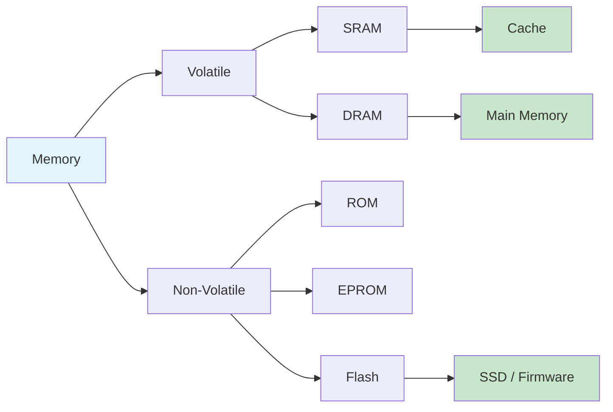

# Chapter 7: Memory Systems

> **Prereq:** Chapter 6 (Sequential Circuits) — address decoding and timing are built from sequential and combinational logic.
> **Next:** Chapter 8 (Computer Architecture) — memory hierarchy and the CPU connect into the full computer.

## Learning Objectives

By the conclusion of this chapter, the student shall be able to:

1. Differentiate among SRAM, DRAM, ROM, EPROM, EEPROM, and Flash memory technologies
2. Describe the internal organisation of a memory chip
3. Design address decoding circuits for memory systems
4. Calculate memory capacity from address and data bus widths
5. Analyse timing parameters including access time and cycle time

### Chapter at a Glance

| Section | Key Concept | Why It Matters |
|---------|-------------|----------------|
| SRAM vs DRAM | Static vs dynamic storage | Speed vs density trade-off |
| ROM/EPROM/Flash | Non-volatile storage | Firmware, boot code |
| Address Decoding | Map address space to chips | Core memory system design skill |
| Timing | Access time, cycle time | Determines system clock speed |
| Memory Organisation | Word width, chip selection | Matching memory to processor bus |

> **One-Sentence Takeaway:** Memory systems are the second pillar of computer architecture — SRAM provides speed for cache, DRAM provides density for main memory, and Flash provides persistence for storage.

## Theory

### 7.1 Memory Hierarchy Overview

Memory systems are organised hierarchically to balance speed, capacity, and cost. The hierarchy from fastest and smallest to slowest and largest comprises registers, cache memory, main memory (RAM), and secondary storage (disk, Flash). This chapter focuses on main memory and read-only memory technologies.

### 7.2 Random-Access Memory (RAM)

RAM permits both reading and writing. It is volatile: data is lost when power is removed.

#### 7.2.1 Static RAM (SRAM)

SRAM stores data using a bistable latch circuit composed of six transistors (6T cell). Data persists as long as power is supplied, without requiring refreshing.

Characteristics:
- Fast access time: 1–10 ns
- Low density (6 transistors per bit)
- Higher power consumption per bit
- Used for cache memory and high-speed applications

#### 7.2.2 Dynamic RAM (DRAM)

DRAM stores data as charge on a capacitor. A transistor acts as a switch to read or write the capacitor. Charge leaks over time, requiring periodic refreshing (typically every 64 ms).

Characteristics:
- Slower access time: 20–80 ns
- High density (1 transistor + 1 capacitor per bit)
- Lower power consumption per bit
- Requires refresh circuitry
- Used for main memory

**DRAM generations**:

| Generation | Speed | Voltage | Year |
|------------|-------|---------|------|
| SDRAM | 100–166 MHz | 3.3 V | 1996 |
| DDR | 200–400 MHz | 2.5 V | 2000 |
| DDR2 | 400–800 MHz | 1.8 V | 2003 |
| DDR3 | 800–2133 MHz | 1.5 V | 2007 |
| DDR4 | 1600–3200 MHz | 1.2 V | 2014 |
| DDR5 | 3200–6400 MHz | 1.1 V | 2020 |

### 7.3 Read-Only Memory (ROM)

ROM is non-volatile: data persists after power removal. ROM contents are fixed during manufacturing.

#### 7.3.1 Mask ROM

Data is programmed during IC fabrication using a photomask. Suitable for high-volume production only.

#### 7.3.2 Programmable ROM (PROM)

PROM can be programmed once by the user. Programming fuses (or anti-fuses) within the memory array. Typically used for small-volume production or prototyping.

#### 7.3.3 Erasable PROM (EPROM)

EPROM can be erased by exposure to ultraviolet (UV) light through a quartz window on the chip, then reprogrammed. Erasure requires 10–30 minutes.

#### 7.3.4 Electrically Erasable PROM (EEPROM)

EEPROM can be erased and reprogrammed electrically, in-system. Individual bytes can be erased and written. Slower than other technologies but offers byte-level flexibility.

#### 7.3.5 Flash Memory

Flash memory is a type of EEPROM that permits block-level (not byte-level) erase and program operations. It offers high density at low cost.

**NAND Flash**: Organised as a series string of transistors. Offers the highest density; used in SSDs, USB drives, memory cards. Programming and erase are page- and block-oriented respectively.

**NOR Flash**: Transistors are connected in parallel, providing random-access read capability. Used for code storage in embedded systems.

| Technology | Volatile | Write | Erase | Density | Speed |
|------------|----------|-------|-------|---------|-------|
| SRAM | Yes | Any time | N/A | Low | Fastest |
| DRAM | Yes | Any time | N/A | High | Moderate |
| Mask ROM | No | During fab | N/A | High | Moderate |
| PROM | No | Once | N/A | Moderate | Moderate |
| EPROM | No | With programmer | UV, 20 min | Moderate | Moderate |
| EEPROM | No | Byte, in-system | Electrical, byte | Low | Slow |
| NAND Flash | No | Page, in-system | Block | Highest | Fast read |
| NOR Flash | No | Word, in-system | Block | Moderate | Fast read |

### 7.4 Memory Organisation

#### 7.4.1 Address and Data Buses

A memory chip with *n* address lines and *m* data lines has a capacity of 2^n × *m* bits.

Example: A chip with 12 address lines and 8 data lines has capacity 2^12 × 8 = 4096 × 8 = 32 Kb = 4 KB.

#### 7.4.2 Chip Select and Enable Signals

Memory chips provide chip select (CS) or chip enable (CE) signals that activate the chip for read or write operations. The output enable (OE) signal controls the data output buffers. The write enable (WE) signal controls writing.

#### 7.4.3 Memory Address Decoding

Address decoding maps the memory address space to physical chips. Three decoding schemes exist:

**Full decoding**: All unused address lines are connected to the decoding logic. Every address maps to exactly one memory location. External logic generates chip select signals by decoding the upper address lines.

**Partial decoding**: Some unused address lines are ignored. Multiple addresses map to the same physical location (address aliasing). Simpler but consumes address space.

**Block decoding**: A combination of full and partial decoding, typically using a decoder IC.

#### 7.4.4 Memory Expansion

**Word expansion**: Increasing the data bus width. Multiple chips are connected in parallel with common address lines. Example: two 8-bit × 4K chips form a 16-bit × 4K memory.

**Capacity expansion**: Increasing the number of addressable words. Multiple chips are connected with separate chip select signals generated by decoding the higher-order address bits.

### 7.5 Timing Considerations

- **Access time (*t_acc*)**: Time from address valid to valid data output (for read).
- **Cycle time (*t_cyc*)**: Minimum interval between successive memory operations.
- **Write pulse width**: Minimum duration of the WE signal for a successful write.
- **Address setup time**: Time address must be stable before the write pulse.

## Examples

### Example 7.1: Memory Capacity Calculation

A memory system uses 16 address lines and 32 data lines. Calculate the total capacity in bytes.

**Solution**: Total bits = 2^16 × 32 = 65536 × 32 = 2,097,152 bits. In bytes: 2,097,152 / 8 = 262,144 bytes = 256 KB.

### Example 7.2: Address Decoding Design

Design an address decoder that activates a 4K × 8 EPROM at address range 0x8000 to 0x8FFF in a 64 KB address space (16 address lines, A_15 through A_0).

**Solution**: The EPROM requires 12 address lines (A_11 through A_0) for its 2^12 = 4K locations. Address lines A_15 through A_12 select the chip.

Address range 0x8000 to 0x8FFF in binary:
- 0x8000: A_15 = 1, A_14 = 0, A_13 = 0, A_12 = 0, A_11–A_0 = 0
- 0x8FFF: A_15 = 1, A_14 = 0, A_13 = 0, A_12 = 0, A_11–A_0 = 1

Therefore: CS = A_15 · A_14' · A_13' · A_12'

### Example 7.3: Memory System Design

Design a 16-bit-wide memory system using 4K × 8 SRAM chips. The address space is 64 KB.

**Solution**: Each chip provides 8 bits. Two chips in parallel provide the 16-bit data word (word expansion). The 64 KB address space requires 16 address lines (2^16 × 16 bits = 128 KB of storage). Each chip uses 12 address lines for internal addressing. The remaining 4 address lines go to a 4-to-16 decoder to select 16 pairs of chips (capacity expansion).

### Example 7.4: DRAM Refresh Calculation

A DRAM with 4096 rows requires a refresh every 64 ms. Each row refresh requires one cycle of 80 ns. Calculate the fraction of time consumed by refresh.

**Solution**: 4096 rows × 80 ns = 327,680 ns = 0.32768 ms per refresh cycle. Fraction = 0.32768 / 64 = 0.00512, or approximately 0.5% of the time.

### Concept Comparison

| Technology | Volatile | Density | Speed | Refresh? | Best For |
|-----------|----------|---------|-------|----------|----------|
| SRAM | Yes | Low | Fast | No | Cache |
| DRAM | Yes | High | Medium | Yes | Main memory |
| ROM | No | Medium | Medium | No | Boot firmware |
| Flash | No | Highest | Slow-write | No | Storage, firmware |

### Quick Reference

| Metric | Formula | Example (64K×16) |
|--------|---------|-----------------|
| Capacity (bits) | 2^A × D | 2^16 × 16 = 1,048,576 bits |
| Capacity (bytes) | 2^A × D/8 | 2^16 × 2 = 128 KB |
| Address pins | A = log2(locations) | 16 for 64K locations |
| Chip count | Total bits / chip bits | (64K×16) / (4K×8) = 32 chips |

### Cross-Application Matrix

| Domain | Application | Relevance |
|--------|-------------|-----------|
| CPU Design | Cache SRAM, DRAM main memory | Memory hierarchy determines CPU performance |
| Embedded Systems | Flash for firmware, SRAM for scratch | Tight memory budgets require careful selection |
| Digital Circuits | FPGA block RAM | Configurable memory inside programmable logic |
| Research | Non-volatile RAM (NVRAM) | Emerging RRAM, MRAM for universal memory |

## Summary

- SRAM is fast but less dense; DRAM is dense but requires periodic refreshing.
- ROM technologies range from mask-programmed (high volume) to electrically reprogrammable (Flash).
- Memory capacity equals 2^(address lines) × (data bus width).
- Address decoding maps the processor's address space to physical memory chips.
- Timing parameters determine memory performance and compatibility with processor cycles.

## Exercises

### Review Questions

1. Explain the difference between volatile and non-volatile memory.
2. Why does DRAM require refresh while SRAM does not?
3. What is the advantage of Flash memory over EPROM?
4. Define address aliasing in partially decoded memory systems.
5. Distinguish between word expansion and capacity expansion.

### Application Problems

1. A memory chip has 14 address lines and 4 data lines. Calculate its capacity in bits and bytes.

2. Design an address decoder for a 16 KB EPROM starting at address 0x4000 in a 64 KB address space. The EPROM uses 14 address lines.

3. Construct an 8 KB memory system using 2K × 8 SRAM chips. Show the interconnections and decoding logic. The memory should occupy addresses 0x0000 through 0x1FFF.

4. A DDR4 module operates at 3200 MHz with a 64-bit data bus. Calculate the peak bandwidth in GB/s.

5. Design a circuit that generates a refresh signal for a DRAM with 2048 rows and a 64 ms refresh interval using a counter and comparator.

### Challenge Problem

Design a memory management unit (MMU) for a system with 16 MB of physical memory and an 8-bit processor that can address only 64 KB. The MMU divides the physical memory into 4 KB pages and maps any 16 pages into the processor's address space at a time. Describe the page table structure, the mapping hardware using a page table base register,     and the address translation process for a 16-bit logical address.

### Chapter Quiz

1. Which memory technology requires periodic refresh?
   - A) SRAM
   - B) DRAM
   - C) ROM
   - D) Flash

2. The capacity of a memory chip with 12 address lines and 8 data lines is:
   - A) 4 KB
   - B) 8 KB
   - C) 16 KB
   - D) 32 KB

3. Flash memory is classified as:
   - A) Volatile, random-access
   - B) Non-volatile, read/write with erase cycles
   - C) Volatile, read-only
   - D) Non-volatile, write-once

Answers

1. B, 2. A, 3. B

