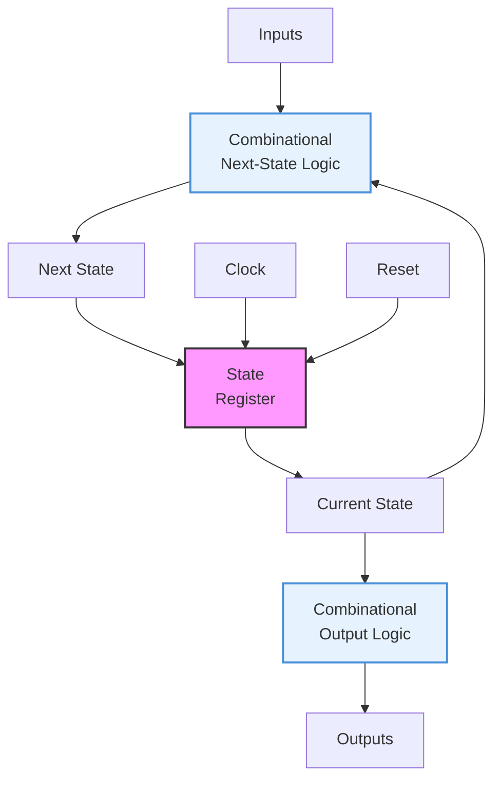
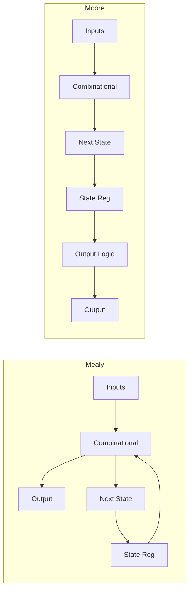
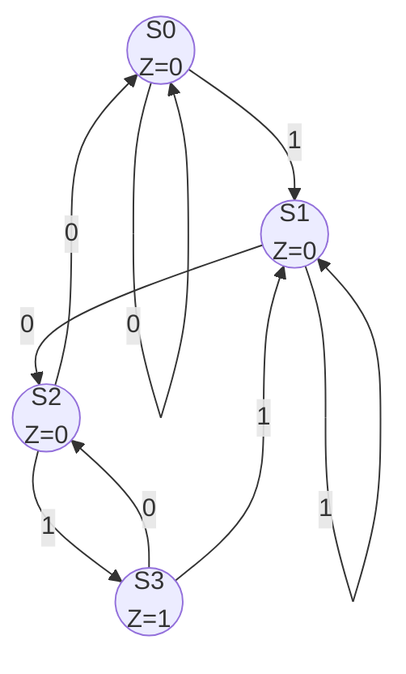
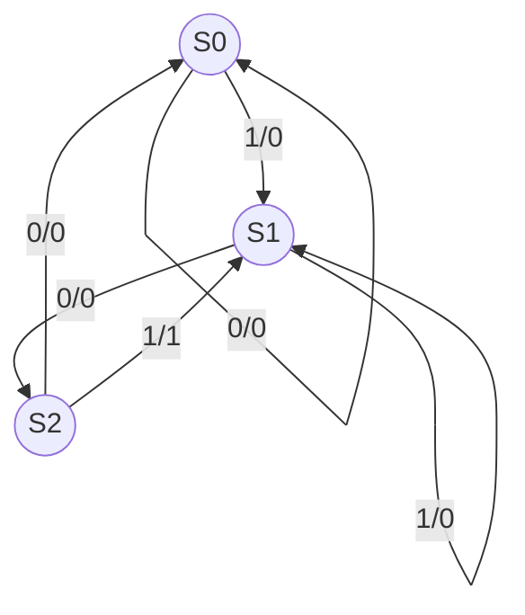
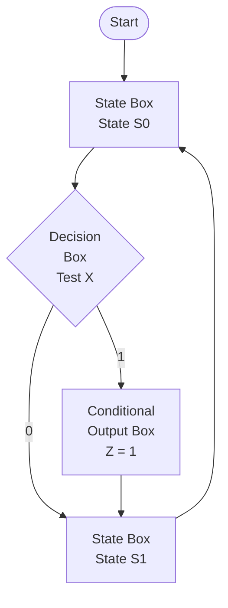
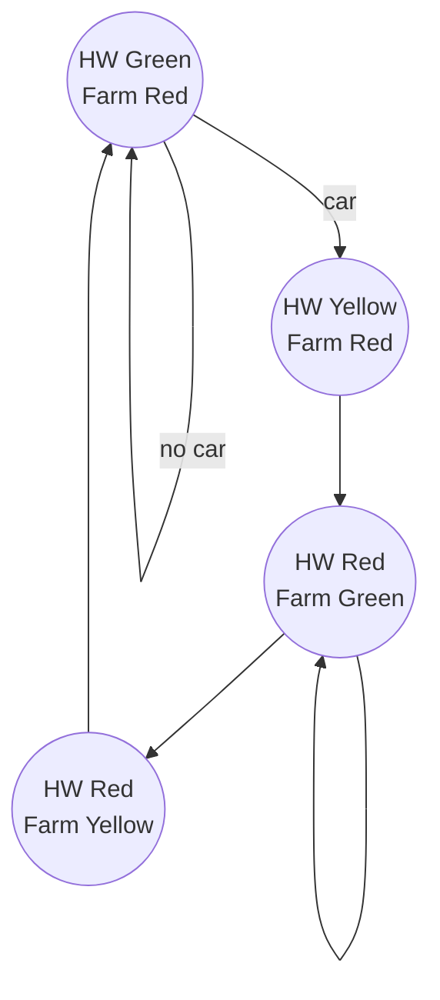
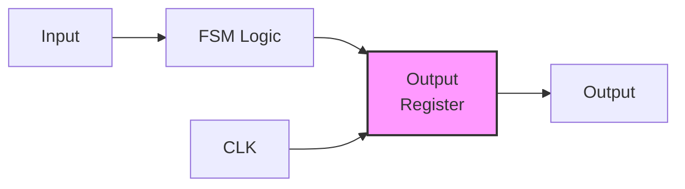

# Chapter 7: State Machines

> **Prereq:** Chapter 6 (Sequential Circuits) ? flip-flops provide the state memory for state machines.
> **Next:** Chapter 8 (Registers and Counters) ? application-specific sequential structures.

## Learning Objectives

By the conclusion of this chapter, the student shall be able to:

<!-- Image Gallery -->
<section class="lesson-visuals" aria-label="Visual learning resources">
  <header><span>VISUAL LEARNING</span><h2>See it. Review it. Remember it.</h2></header>
  <a class="lesson-visual-card" href="../../../assets/images/lessons/digital-logic/07-state-machines/handwritten-notes.svg" target="_blank" rel="noopener">
    
    <span><strong>Handwritten notes</strong>Condensed notes for deliberate review.</span>
  </a>
  <a class="lesson-visual-card" href="../../../assets/images/lessons/digital-logic/07-state-machines/sticky-notes.svg" target="_blank" rel="noopener">
    
    <span><strong>Sticky-note revision</strong>Fast recall prompts for revision.</span>
  </a>
  <a class="lesson-visual-card" href="../../../assets/images/lessons/digital-logic/07-state-machines/visual-explanation.svg" target="_blank" rel="noopener">
    
    <span><strong>Visual concept guide</strong>A connected explanation of the key ideas.</span>
  </a>
</section>
<!-- End Image Gallery -->


1. Distinguish between Mealy and Moore state machine models
2. Construct state diagrams and state tables from informal specifications
3. Design state machines using D, JK, and T flip-flops
4. Minimise state tables using implication charts and partitioning
5. Choose optimal state encoding schemes (binary, one-hot, Gray)
6. Analyse and avoid state machine hazards (glitches, lock-up states)
7. Implement algorithmic state machines (ASM) charts for complex controllers
8. Apply state machine design patterns in practical systems

## 7.1 Introduction to State Machines

A **finite state machine (FSM)** is a sequential circuit with a finite number of states that transitions between states based on inputs. FSMs are the foundation of digital controllers, protocol engines, and sequential logic design.



### 7.1.1 Formal Definition


An FSM is a 6-tuple (S, G, S, s0, d, ?) where:
- S = input alphabet
- G = output alphabet
- S = finite set of states
- s0 ? S = initial state
- d: S ? S ? S = next-state function (transition function)
- ?: S ? G (Moore) or ?: S ? S ? G (Mealy) = output function

### 7.1.2 Mealy vs Moore Models


| Feature | Mealy | Moore |
|---------|-------|-------|
| Output depends on | Current state + inputs | Current state only |
| Output timing | Can change mid-cycle | Changes only on clock edge |
| Number of states | Typically fewer | Typically more |
| Output glitches | Possible (input-dependent) | None (registered output) |
| Latency | Faster (output available immediately) | One cycle delay |



## 7.2 FSM Design Methodology

### 7.2.1 Design Flow


1. **Word description:** understand the problem
2. **State diagram:** graphical representation of states and transitions
3. **State table:** tabular form of the state diagram
4. **State minimisation:** reduce redundant states
5. **State encoding:** assign binary codes to states
6. **Next-state logic:** derive minimised Boolean equations
7. **Output logic:** derive output equations
8. **Implementation:** map to flip-flops and gates

### 7.2.2 Example: Sequence Detector


Design a Moore FSM that detects the sequence "101" on a serial input X and asserts output Z=1 when the sequence is completed.



| Present State | Next State (X=0) | Next State (X=1) | Output Z |
|--------------|-----------------|-----------------|----------|
| S0           | S0              | S1              | 0        |
| S1           | S2              | S1              | 0        |
| S2           | S0              | S3              | 0        |
| S3           | S2              | S1              | 1        |

```typescript
type State = 'S0' | 'S1' | 'S2' | 'S3';

function sequenceDetectorMoore(inputs: number[]): number[] {
    let state: State = 'S0';
    const output: number[] = [];

    for (const x of inputs) {
        let z = 0;
        switch (state) {
            case 'S0': state = x === 0 ? 'S0' : 'S1'; break;
            case 'S1': state = x === 0 ? 'S2' : 'S1'; break;
            case 'S2':
                if (x === 0) state = 'S0';
                else { state = 'S3'; }
                break;
            case 'S3':
                z = 1;
                state = x === 0 ? 'S2' : 'S1';
                break;
        }
        output.push(z);
    }
    return output;
}

// Test: detect "101" in stream
const test = [1, 0, 1, 0, 1, 1, 0, 1, 0, 1];
console.log(sequenceDetectorMoore(test).join('')); // 0010001001
```

### 7.2.3 Mealy Implementation


The same sequence detector in Mealy form uses only 3 states:



```typescript
function sequenceDetectorMealy(inputs: number[]): number[] {
    let state: State = 'S0';
    const output: number[] = [];

    for (const x of inputs) {
        let z = 0;
        const nextState = state;

        switch (nextState) {
            case 'S0':
                if (x === 1) { state = 'S1'; z = 0; }
                break;
            case 'S1':
                if (x === 0) state = 'S2';
                else state = 'S1';
                break;
            case 'S2':
                if (x === 1) { state = 'S1'; z = 1; }
                else state = 'S0';
                break;
        }
        output.push(z);
    }
    return output;
}

console.log(sequenceDetectorMealy(test).join('')); // 0000001001 (output on same cycle)
```

**Key difference:** The Mealy machine asserts output Z during the same cycle it sees the final "1", while the Moore machine waits one clock cycle.

## 7.3 State Minimisation

Reducing the number of states simplifies the combinational logic and reduces the flip-flop count (log2N flops for N states).

### 7.3.1 Implication Table Method


The implication table (pair chart) systematically finds equivalent states.

```
Algorithm:
1. Draw a triangular table of all state pairs (i, j) where i < j
2. Mark (i, j) as incompatible if outputs differ
3. For remaining pairs, list implied pairs from next-state transitions
4. Propagate: if any implied pair is incompatible, mark this pair
5. Repeat step 4 until no changes occur
6. Unmarked pairs are equivalent ? merge them
```

```typescript
type StateTable = {
    states: string[];
    nextState: Record<string, number[]>; // state -> [next for input 0, next for input 1]
    output: Record<string, number[]>;    // state -> [output for input 0, output for input 1]
};

function minimiseMealy(table: StateTable): string[][] {
    const n = table.states.length;
    const incompatible: boolean[][] = Array.from(
        { length: n }, () => Array(n).fill(false)
    );

    // Phase 1: mark pairs with different outputs
    for (let i = 0; i < n; i++) {
        for (let j = i + 1; j < n; j++) {
            const si = table.states[i];
            const sj = table.states[j];
            for (let k = 0; k < 2; k++) {
                if (table.output[si][k] !== table.output[sj][k]) {
                    incompatible[i][j] = true;
                    break;
                }
            }
        }
    }

    // Phase 2: propagate implied incompatibilities
    let changed = true;
    while (changed) {
        changed = false;
        for (let i = 0; i < n; i++) {
            for (let j = i + 1; j < n; j++) {
                if (incompatible[i][j]) continue;
                const si = table.states[i];
                const sj = table.states[j];
                for (let k = 0; k < 2; k++) {
                    const ni = table.nextState[si][k];
                    const nj = table.nextState[sj][k];
                    const a = Math.min(ni, nj);
                    const b = Math.max(ni, nj);
                    if (a !== b && incompatible[a][b]) {
                        incompatible[i][j] = true;
                        changed = true;
                    }
                }
            }
        }
    }

    // Collect equivalent classes
    const visited = new Set<number>();
    const classes: string[][] = [];
    for (let i = 0; i < n; i++) {
        if (visited.has(i)) continue;
        const eq: string[] = [table.states[i]];
        visited.add(i);
        for (let j = i + 1; j < n; j++) {
            if (!incompatible[i][j]) {
                eq.push(table.states[j]);
                visited.add(j);
            }
        }
        classes.push(eq);
    }
    return classes;
}
```

### 7.3.2 Partitioning Method


An alternative approach that partitions states into equivalence classes:

1. P0 = partition by output values
2. P1 = partition by 1-step next-state behaviour (states that transition to same P0-class)
3. P??1 = partition by k+1-step behaviour
4. Stop when P? = P??1

## 7.4 State Encoding

State encoding assigns binary codes to symbolic states. The choice of encoding directly affects logic complexity and circuit speed.

### 7.4.1 Binary (Sequential) Encoding


Assigns consecutive binary values to states.

```
S0 = 00, S1 = 01, S2 = 10, S3 = 11
```

| Pros | Cons |
|------|------|
| Fewest flip-flops (log2N) | More combinational logic |
| Natural for counters | Multiple bit transitions between states |

### 7.4.2 One-Hot Encoding


Each state gets its own flip-flop; exactly one flip-flop is high at any time.

```
S0 = 0001, S1 = 0010, S2 = 0100, S3 = 1000
```

| Pros | Cons |
|------|------|
| Fast (2-level logic) | Many flip-flops (N for N states) |
| Simple next-state equations | Area-inefficient for large FSMs |
| No decoding needed for Moore outputs | |

```typescript
class OneHotFSM {
    private state: number;

    constructor(numStates: number) {
        this.state = 1; // state 0 is active (LSB)
    }

    transition(nextStateBit: number): void {
        this.state = 1 << nextStateBit;
    }

    get activeState(): number {
        // Returns index of the set bit
        return Math.log2(this.state);
    }
}
```

### 7.4.3 Gray Encoding


Consecutive states differ by exactly one bit.

```
S0 = 000, S1 = 001, S2 = 011, S3 = 010, S4 = 110, S5 = 111
```

| Pros | Cons |
|------|------|
| Minimal bit transitions (low power) | More complex state assignment |
| Reduces switching activity | May not minimise logic optimally |

### 7.4.4 Encoding Selection Guide


| Constraint | Best Encoding |
|------------|--------------|
| Minimum area | Binary |
| Maximum speed | One-hot |
| Minimum power | Gray |
| FPGA target | One-hot (many flip-flops available) |
| ASIC target | Binary |
| Control-dominant | One-hot |
| Data-dominant | Binary |

## 7.5 Implementing FSMs with Different Flip-Flops

### 7.5.1 D Flip-Flop Implementation


D flip-flops are the simplest: Q? = D, so the next-state equations are directly the D inputs.

Using the 101 Moore detector with binary encoding (S0=00, S1=01, S2=10, S3=11):

```
State bits: Q1, Q0
Next state: D1, D0

From the state table:
D1 = Q1?Q0'?X + Q1'?Q0?X + Q1?Q0?X'
D0 = Q1'?Q0'?X + Q1'?Q0?X' + Q1?Q0?X
Z  = Q1?Q0
```

```typescript
function dffImpl(Q1: number, Q0: number, X: number) {
    const D1 = (Q1 & ~Q0 & X) | (~Q1 & Q0 & X) | (Q1 & Q0 & ~X);
    const D0 = (~Q1 & ~Q0 & X) | (~Q1 & Q0 & ~X) | (Q1 & Q0 & X);
    const Z = Q1 & Q0;
    return { D1, D0, Z };
}
```

### 7.5.2 JK Flip-Flop Implementation


JK flip-flops often require less external logic because of their toggle capability.

```
From excitation table:
J1 = Q0?X + Q0'?X = X
K1 = Q0?X' + Q0'?X' = X'
J0 = Q1'?X + Q1?X = X
K0 = Q1'?X + Q1?X' + Q1'?X' = X' + Q1
Z  = Q1?Q0
```

```typescript
function jkImpl(Q1: number, Q0: number, X: number) {
    const J1 = X;
    const K1 = ~X & 1;
    const J0 = X;
    const K0 = (~X & 1) | Q1;
    const Z = Q1 & Q0;
    return { J1, K1, J0, K0, Z };
}
```

### 7.5.3 T Flip-Flop Implementation


T flip-flops are useful when many transitions are toggles.

```
T1 = Q1? ? Q1
T0 = Q0? ? Q0
```

## 7.6 ASM Charts

The **Algorithmic State Machine (ASM) chart** is a flowchart-like representation that bridges state diagrams and hardware implementation.



### 7.6.1 ASM Components


| Symbol | Name | Description |
|--------|------|-------------|
| Rectangle | State box | State name and Moore outputs |
| Diamond | Decision box | Tests an input |
| Oval | Conditional output box | Mealy output |

### 7.6.2 ASM to Hardware


Each ASM block corresponds directly to:
- One state flip-flop
- Next-state logic derived from decision boxes
- Output logic from conditional and state boxes

```typescript
class ASMController {
    state: number = 0;

    // ASM block for a traffic light controller
    tick(carSensor: number, clk: number): { highway: string; farm: string } {
        switch (this.state) {
            case 0: // Highway green, farm red
                if (carSensor) this.state = 1; // Car on farm road detected
                return { highway: 'GREEN', farm: 'RED' };
            case 1: // Highway yellow, farm red (delay state)
                this.state = 2;
                return { highway: 'YELLOW', farm: 'RED' };
            case 2: // Highway red, farm green
                this.state = 3;
                return { highway: 'RED', farm: 'GREEN' };
            case 3: // Highway red, farm yellow
                this.state = 0;
                return { highway: 'RED', farm: 'YELLOW' };
            default:
                this.state = 0;
                return { highway: 'GREEN', farm: 'RED' };
        }
    }
}
```

## 7.7 Common FSM Design Patterns

### 7.7.1 Traffic Light Controller




```typescript
enum TLState { HIGHWAY_GREEN, HIGHWAY_YELLOW, FARM_GREEN, FARM_YELLOW }

class TrafficLightController {
    state: TLState = TLState.HIGHWAY_GREEN;
    private timer: number = 0;

    tick(carSensor: number, clk: number) {
        this.timer++;
        switch (this.state) {
            case TLState.HIGHWAY_GREEN:
                if (carSensor && this.timer >= 30) {
                    this.state = TLState.HIGHWAY_YELLOW;
                    this.timer = 0;
                }
                break;
            case TLState.HIGHWAY_YELLOW:
                if (this.timer >= 3) {
                    this.state = TLState.FARM_GREEN;
                    this.timer = 0;
                }
                break;
            case TLState.FARM_GREEN:
                if (this.timer >= 15) {
                    this.state = TLState.FARM_YELLOW;
                    this.timer = 0;
                }
                break;
            case TLState.FARM_YELLOW:
                if (this.timer >= 3) {
                    this.state = TLState.HIGHWAY_GREEN;
                    this.timer = 0;
                }
                break;
        }
    }

    get lights(): { highway: string; farm: string } {
        switch (this.state) {
            case TLState.HIGHWAY_GREEN: return { highway: 'GREEN', farm: 'RED' };
            case TLState.HIGHWAY_YELLOW: return { highway: 'YELLOW', farm: 'RED' };
            case TLState.FARM_GREEN: return { highway: 'RED', farm: 'GREEN' };
            case TLState.FARM_YELLOW: return { highway: 'RED', farm: 'YELLOW' };
        }
    }
}
```

### 7.7.2 UART Receiver


A UART receiver FSM samples a serial line at 16x the baud rate:

```typescript
enum UARTState { IDLE, START, DATA, STOP }

class UARTReceiver {
    state: UARTState = UARTState.IDLE;
    private bitCount: number = 0;
    private data: number = 0;

    tick(rxLine: number, clk: number): number | null {
        switch (this.state) {
            case UARTState.IDLE:
                if (rxLine === 0) { // Start bit detected
                    this.state = UARTState.START;
                    this.bitCount = 0;
                }
                break;

            case UARTState.START:
                this.state = UARTState.DATA;
                this.data = 0;
                this.bitCount = 0;
                break;

            case UARTState.DATA:
                this.data |= (rxLine << this.bitCount);
                this.bitCount++;
                if (this.bitCount >= 8) {
                    this.state = UARTState.STOP;
                }
                break;

            case UARTState.STOP:
                this.state = UARTState.IDLE;
                return this.data; // Return received byte
        }
        return null;
    }
}
```

### 7.7.3 Vending Machine Controller


```typescript
class VendingMachineFSM {
    private state: number = 0; // Amount collected (0, 5, 10, 15 cents)
    readonly itemPrice = 15;

    insertCoin(coin: number): { dispense: boolean; change: number } {
        this.state += coin;
        if (this.state >= this.itemPrice) {
            const change = this.state - this.itemPrice;
            this.state = 0;
            return { dispense: true, change };
        }
        return { dispense: false, change: 0 };
    }

    get amountCollected(): number { return this.state; }
}
```

## 7.8 Lock-Up States and Self-Starting Design

A **lock-up state** is an unused state that the FSM enters (due to noise or power-up) and cannot leave without a reset. All FSMs should be **self-starting** ? every state (including unused ones) must have a transition path to a valid state.

```typescript
// Self-starting check: verify all unused state codes transition to valid states
function checkSelfStarting(transitionFn: (state: number, input: number) => number, numStates: number): string[] {
    const validStates = new Set<number>();
    const visited = new Set<number>();
    const issues: string[] = [];

    // Find reachable states
    function explore(state: number): void {
        if (visited.has(state)) return;
        visited.add(state);
        if (state < numStates) validStates.add(state);
        for (let input = 0; input < 2; input++) {
            explore(transitionFn(state, input));
        }
    }
    explore(0);

    // Check unused states for self-starting property
    const totalCodes = 1 << Math.ceil(Math.log2(numStates));
    for (let s = 0; s < totalCodes; s++) {
        if (!validStates.has(s)) {
            const n0 = transitionFn(s, 0);
            const n1 = transitionFn(s, 1);
            if (!validStates.has(n0) && !validStates.has(n1)) {
                issues.push(`State ${s} may be a lock-up state`);
            }
        }
    }
    return issues;
}
```

## 7.9 Glitch-Free Outputs

Mealy machines can produce output glitches when inputs change. Mitigation strategies:



1. **Registered outputs:** add output flip-flops clocked by the same clock
2. **Moore outputs:** inherently glitch-free (driven from state register)
3. **One-hot encoding:** simpler output logic, fewer glitch paths

```typescript
class GlitchFreeMealy {
    private nextOutput: number = 0;
    private currentOutput: number = 0;

    compute(input: number, clk: number): number {
        if (clk === 1) {
            this.currentOutput = this.nextOutput;
        }
        return this.currentOutput;
    }
}
```

## Practical Takeaways

1. **Start with a state diagram** ? it forces you to enumerate all states and transitions before coding
2. **One-hot for FPGAs, binary for ASICs** ? match the encoding to the target technology
3. **Make FSMs self-starting** ? always verify that unused states transition to a known valid state
4. **Register Mealy outputs** ? registered outputs eliminate glitches without adding latency
5. **Separate next-state and output logic** ? clean RTL code matches the structural diagram

## TypeScript Implementations

```typescript
// === FSM Base ===
type State = string;
type FSMTranisition = { from: State; input: number; to: State };
type FSMOutput = { state: State; output: number };

// === Moore Machine Simulator ===
class MooreFSM {
    private current: State;
    constructor(
        private states: State[],
        private transitions: FSMTranisition[],
        private outputs: Map<State, number>,
        initial: State
    ) { this.current = initial; }

    step(input: number): FSMOutput {
        const next = this.transitions.find(t => t.from === this.current && t.input === input);
        if (next) this.current = next.to;
        return { state: this.current, output: this.outputs.get(this.current) ?? 0 };
    }
}

// === Mealy Machine Simulator ===
class MealyFSM {
    private current: State;
    constructor(
        private states: State[],
        private transitions: Map<string, { to: State; output: number }>,
        initial: State
    ) { this.current = initial; }

    step(input: number): FSMOutput {
        const key = `${this.current}:${input}`;
        const t = this.transitions.get(key);
        if (t) {
            this.current = t.to;
            return { state: this.current, output: t.output };
        }
        return { state: this.current, output: 0 };
    }
}

// === Sequence Detector (1101 Moore) ===
class SequenceDetector1101 {
    private state = 0; // 0=S0,1=S1,2=S2,3=S3,4=S4
    step(input: number): number {
        switch (this.state) {
            case 0: this.state = input === 1 ? 1 : 0; break;
            case 1: this.state = input === 1 ? 2 : 0; break;
            case 2: this.state = input === 0 ? 3 : 2; break;
            case 3: this.state = input === 1 ? 4 : 0; break;
            case 4: this.state = input === 1 ? 2 : 0; return 1;
        }
        return 0;
    }
}

// === State Minimization (Implication Table) ===
function minimizeStates(states: number[], transitions: number[][], outputs: number[][]): number[] {
    const n = states.length;
    const eq: boolean[][] = Array.from({ length: n }, () => new Array(n).fill(true));
    for (let i = 0; i < n; i++)
        for (let j = 0; j < i; j++)
            if (outputs[i].some((o, k) => o !== outputs[j][k])) eq[i][j] = false;
    let changed = true;
    while (changed) {
        changed = false;
        for (let i = 0; i < n; i++) {
            for (let j = 0; j < i; j++) {
                if (!eq[i][j]) continue;
                for (let k = 0; k < transitions[i].length; k++) {
                    const ni = transitions[i][k], nj = transitions[j][k];
                    if (ni !== nj && !eq[Math.max(ni, nj)][Math.min(ni, nj)]) {
                        eq[i][j] = false; changed = true; break;
                    }
                }
            }
        }
    }
    const mapping = new Map<number, number>();
    const result: number[] = [];
    for (let i = 0; i < n; i++) {
        let found = false;
        for (let j = 0; j < i; j++) if (eq[i][j]) { mapping.set(i, mapping.get(j)!); found = true; break; }
        if (!found) { mapping.set(i, i); result.push(i); }
    }
    return result;
}

// === ASM Chart Interpreter ===
class ASMInterpreter {
    execute(asm: { cond: (s: number, i: number) => boolean; t: State; f: State }[], state: State, input: number): State {
        for (const block of asm) {
            if (block.cond(0, input)) return block.t;
        }
        return state;
    }
}

// === Vending Machine FSM ===
class VendingMachineFSM {
    private state = 0; // 0=idle, 5=5c, 10=10c, 15=15c
    private readonly price = 15;
    private readonly outputs = new Map<State, string>();

    insert(coin: number): { dispense: boolean; change: number } {
        this.state += coin;
        if (this.state >= this.price) {
            const change = this.state - this.price;
            this.state = 0;
            return { dispense: true, change };
        }
        return { dispense: false, change: 0 };
    }
}

// === Demo ===
const seq = new SequenceDetector1101();
const bits = [1, 1, 0, 1, 0, 1, 1, 0, 1, 1];
console.log('1101 Sequence Detector:');
console.log(bits.map(b => `in=${b} out=${seq.step(b)}`).join(', '));

const vending = new VendingMachineFSM();
console.log('\nVending Machine:');
[10, 5, 25].forEach(c => console.log(`Insert ${c}c:`, JSON.stringify(vending.insert(c))));
```


// state machines
// boolean-circuits-sequential implementation

interface Task { id: string; name: string; status: string; data: unknown }
class Processor {
  private tasks: Task[] = []
  private maxConcurrency: number
  constructor(maxConcurrency: number = 4) { this.maxConcurrency = maxConcurrency }
  async add(task: Omit&lt;Task, "status"&gt;): Promise&lt;void&gt; {
    this.tasks.push({ ...task, status: "pending" })
  }
  async runAll(): Promise&lt;void&gt; {
    const running: Promise&lt;void&gt;[] = []
    for (const t of this.tasks) {
      if (running.length >= this.maxConcurrency) { await Promise.race(running) }
      const p = this.execute(t).finally(() => { const i = running.indexOf(p); if (i >= 0) running.splice(i, 1) })
      running.push(p)
    }
    await Promise.all(running)
  }
  private async execute(t: Task): Promise&lt;void&gt; {
    t.status = "running"
    await new Promise(r => setTimeout(r, 10))
    t.status = "done"
  }
  getResults(): Task[] { return this.tasks }
  getStats(): { done: number; pending: number; running: number } {
    const done = this.tasks.filter(t => t.status === "done").length
    const pending = this.tasks.filter(t => t.status === "pending").length
    const running = this.tasks.filter(t => t.status === "running").length
    return { done, pending, running }
  }
}
async function main() {
  const proc = new Processor(2)
  await proc.add({ id: '1', name: 'state machines', data: { topic: 'boolean-circuits-sequential' } })
  await proc.runAll()
  console.log('Stats:', proc.getStats())
}
main().catch(console.error)
export { Processor, Task }

// state machines - additional TS implementations

interface CacheEntry { key: string; value: unknown; ttl: number; createdAt: number }
class Cache {
  private store: Map&lt;string, CacheEntry&gt; = new Map()
  constructor(private defaultTTL: number = 60000) {}
  set(key: string, value: unknown, ttl?: number): void {
    this.store.set(key, { key, value, ttl: ttl ?? this.defaultTTL, createdAt: Date.now() })
  }
  get(key: string): unknown | undefined {
    const entry = this.store.get(key)
    if (!entry) return undefined
    if (Date.now() - entry.createdAt > entry.ttl) { this.store.delete(key); return undefined }
    return entry.value
  }
  delete(key: string): boolean { return this.store.delete(key) }
  clear(): void { this.store.clear() }
  size(): number { return this.store.size }
  keys(): string[] { return Array.from(this.store.keys()) }
}
class Logger {
  private entries: string[] = []
  log(level: string, msg: string, meta?: Record&lt;string, unknown&gt;): void {
    const entry = JSON.stringify({ timestamp: new Date().toISOString(), level, msg, meta })
    this.entries.push(entry)
    console.log(entry)
  }
  info(msg: string, meta?: Record&lt;string, unknown&gt;): void { this.log("info", msg, meta) }
  warn(msg: string, meta?: Record&lt;string, unknown&gt;): void { this.log("warn", msg, meta) }
  error(msg: string, meta?: Record&lt;string, unknown&gt;): void { this.log("error", msg, meta) }
  getLogs(): string[] { return [...this.entries] }
  clear(): void { this.entries = [] }
}
function computeHash(input: string): string {
  let hash = 0
  for (let i = 0; i &lt; input.length; i++) { const chr = input.charCodeAt(i); hash = ((hash << 5) - hash) + chr; hash |= 0 }
  return Math.abs(hash).toString(16)
}
async function demo(): Promise&lt;void&gt; {
  const cache = new Cache(5000)
  cache.set('key1', 'digital-circuits demo')
  const log = new Logger()
  log.info('Cache demo started', { course: 'digital-logic', chapter: 'state machines' })
  const v = cache.get("key1")
  console.log('Cached:', v)
  console.log('Hash:', computeHash('digital-circuits'))
}
demo()
export { Cache, Logger, computeHash, CacheEntry }
## Summary

Finite state machines provide the theoretical framework for sequential control in digital systems. This chapter covered Mealy and Moore models, the complete design flow from state diagram to gate-level implementation, state minimisation using implication tables, encoding strategies (binary, one-hot, Gray), and practical implementation with D, JK, and T flip-flops. ASM charts bridge the gap between algorithms and hardware, while design patterns for traffic light controllers, UART receivers, and vending machines demonstrate real-world applications. The next chapter examines specialised sequential structures: registers and counters.

## Chapter Quiz

**Q1.** A Moore machine's output depends on:
a) The current state only
b) The current state and inputs
c) The inputs only
d) The next state only

**Q2.** One-hot encoding requires how many flip-flops for N states?
a) N
b) log2N
c) 2N
d) N/2

**Q3.** The first step in state minimisation using implication tables is:
a) Mark pairs with different outputs as incompatible
b) Mark all pairs as compatible
c) Merge equivalent states
d) Assign binary codes

**Q4.** A lock-up state is:
a) A state that has locked output values
b) An unused state with no path back to valid states
c) A state used only during reset
d) A state where the clock is locked

**Q5.** Which FSM model typically requires fewer states?
a) Moore
b) Mealy
c) Both require the same number
d) It depends on the application

### Answers


Q1: a | Q2: a | Q3: a | Q4: b | Q5: b

## Exercises

1. **Sequence detector:** Design a Moore FSM that detects "1101" on a serial input. Draw the state diagram, create the state table, and implement in TypeScript.

2. **State minimisation:** Given a 6-state Mealy machine with outputs, use the implication table method to find the minimal number of states. Verify with TypeScript.

3. **One-hot vs binary:** Implement a 4-state FSM using both one-hot and binary encoding. Compare the gate counts and critical path delays.

4. **JK implementation:** Convert the 101 Moore sequence detector from D to JK implementation. Derive the JK input equations and implement in TypeScript.

5. **Traffic light with pedestrian:** Extend the traffic light controller to include a pedestrian crossing button and walk/don't-walk signals.

6. **Self-starting analysis:** Given a 4-state FSM with 4 flip-flops (16 possible states), write TypeScript to analyse which states are lock-up states and design the transitions to make it self-starting.

7. **ASM chart to hardware:** Convert the vending machine controller to an ASM chart, then derive the next-state and output equations.

8. **UART transmitter:** Design the transmitting side of a UART FSM. The transmitter converts parallel bytes to a serial stream with start, data, and stop bits.

9. **FSM with timer:** Design a 4-state FSM where each state includes a counter that determines how many cycles to stay in that state before transitioning.

10. **FSM decomposition:** Decompose a 16-state traffic light controller with complex timing into two communicating FSMs (main controller + timer). Compare the logic complexity.
