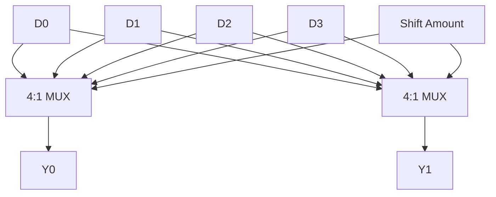
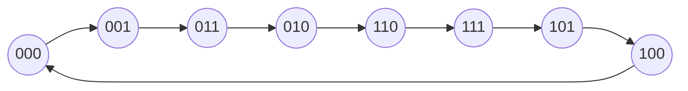
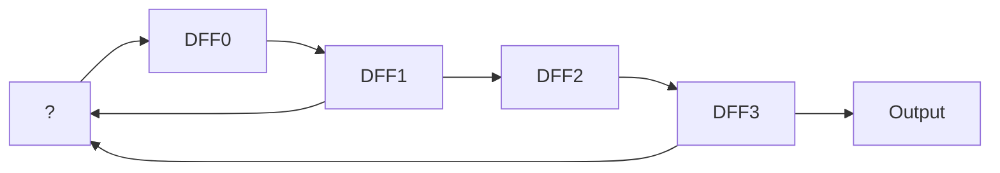
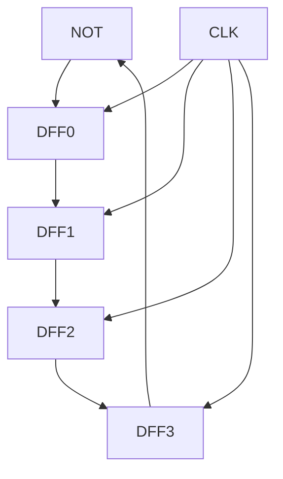

# Chapter 8: Registers and Counters

> **Prereq:** Chapters 6?7 (Sequential Circuits, State Machines) ? registers and counters are specialised sequential structures.
> **Next:** Chapter 9 (Memory) ? registers provide the smallest, fastest storage in the memory hierarchy.

## Learning Objectives

By the conclusion of this chapter, the student shall be able to:

1. Design and analyse parallel-load, shift, and universal registers
2. Construct synchronous and asynchronous binary counters
3. Implement decade, modulo-N, and programmable counters
4. Analyse trade-offs between ripple and synchronous counter topologies
5. Design ring counters, Johnson counters, and LFSR sequence generators
6. Apply counters in frequency division, timing generation, and control applications
7. Evaluate counter performance in terms of speed, power, and area

## 8.1 Register Architectures

A **register** is an array of bistable elements sharing a common clock. While Chapter 6 introduced basic registers, this section covers advanced register architectures and applications.

### 8.1.1 Register with Synchronous Clear and Load

<a href="../../../assets/images/diagrams/digital-logic/08-registers-counters/8-1-1-register-with-synchronous-clear-and-load-handwritten.svg" target="_blank" rel="noopener">
  
</a>
<a href="../../../assets/images/diagrams/digital-logic/08-registers-counters/8-1-1-register-with-synchronous-clear-and-load-diagram.svg" target="_blank" rel="noopener">
  
</a>
<a href="../../../assets/images/diagrams/digital-logic/08-registers-counters/8-1-1-register-with-synchronous-clear-and-load-sticky.svg" target="_blank" rel="noopener">
  
</a>


```typescript
class AdvancedRegister {
    private flops: DFlipFlop[];
    readonly width: number;

    constructor(width: number) {
        this.width = width;
        this.flops = Array.from({ length: width }, () => new DFlipFlop());
    }

    get value(): number {
        let val = 0;
        for (let i = 0; i < this.width; i++) {
            val |= (this.flops[i].Q << i);
        }
        return val;
    }

    operate(
        data: number,
        clr: number,  // synchronous clear (active high)
        load: number, // parallel load enable
        clk: number
    ): void {
        for (let i = 0; i < this.width; i++) {
            let d: number;
            if (clr === 1) d = 0;
            else if (load === 1) d = (data >> i) & 1;
            else d = this.flops[i].Q; // hold
            this.flops[i].update(d, clk);
        }
    }
}
```

### 8.1.2 Bidirectional Shift Register

<a href="../../../assets/images/diagrams/digital-logic/08-registers-counters/8-1-2-bidirectional-shift-register-handwritten.svg" target="_blank" rel="noopener">
  
</a>
<a href="../../../assets/images/diagrams/digital-logic/08-registers-counters/8-1-2-bidirectional-shift-register-diagram.svg" target="_blank" rel="noopener">
  
</a>
<a href="../../../assets/images/diagrams/digital-logic/08-registers-counters/8-1-2-bidirectional-shift-register-sticky.svg" target="_blank" rel="noopener">
  
</a>


```typescript
class BidirectionalShiftRegister {
    private flops: DFlipFlop[];
    readonly width: number;

    constructor(width: number) {
        this.width = width;
        this.flops = Array.from({ length: width }, () => new DFlipFlop());
    }

    get value(): number {
        let val = 0;
        for (let i = 0; i < this.width; i++) {
            val |= (this.flops[i].Q << i);
        }
        return val;
    }

    shift(dir: number, serialIn: number, clk: number): number {
        // dir = 1 for right, 0 for left
        const serialOut = dir === 1
            ? this.flops[this.width - 1].Q
            : this.flops[0].Q;

        if (dir === 1) { // Shift right (MSB first)
            for (let i = this.width - 1; i > 0; i--) {
                this.flops[i].update(this.flops[i - 1].Q, clk);
            }
            this.flops[0].update(serialIn, clk);
        } else { // Shift left (LSB first)
            for (let i = 0; i < this.width - 1; i++) {
                this.flops[i].update(this.flops[i + 1].Q, clk);
            }
            this.flops[this.width - 1].update(serialIn, clk);
        }
        return serialOut;
    }
}
```

### 8.1.3 Barrel Shifter

<a href="../../../assets/images/diagrams/digital-logic/08-registers-counters/8-1-3-barrel-shifter-handwritten.svg" target="_blank" rel="noopener">
  
</a>
<a href="../../../assets/images/diagrams/digital-logic/08-registers-counters/8-1-3-barrel-shifter-diagram.svg" target="_blank" rel="noopener">
  
</a>
<a href="../../../assets/images/diagrams/digital-logic/08-registers-counters/8-1-3-barrel-shifter-sticky.svg" target="_blank" rel="noopener">
  
</a>


A barrel shifter can shift or rotate an N-bit word by any number of positions in one clock cycle.

```typescript
class BarrelShifter {
    shift(data: number, amount: number, direction: 'left' | 'right', width: number): number {
        const mask = (1 << width) - 1;
        data &= mask;
        amount %= width;

        if (direction === 'left') {
            return ((data << amount) | (data >> (width - amount))) & mask;
        } else {
            return ((data >> amount) | (data << (width - amount))) & mask;
        }
    }
}

const bs = new BarrelShifter();
console.log(bs.shift(0b0110, 2, 'left', 4).toString(2).padStart(4, '0')); // 1001
console.log(bs.shift(0b0110, 1, 'right', 4).toString(2).padStart(4, '0')); // 0011
```

**Hardware implementation:** A barrel shifter is implemented as a crossbar switch or a multi-stage multiplexer tree. A 4-bit barrel shifter uses 4:1 multiplexers per output bit.



## 8.2 Advanced Counter Designs

### 8.2.1 Modulo-N Counter

<a href="../../../assets/images/diagrams/digital-logic/08-registers-counters/8-2-1-modulo-n-counter-handwritten.svg" target="_blank" rel="noopener">
  
</a>
<a href="../../../assets/images/diagrams/digital-logic/08-registers-counters/8-2-1-modulo-n-counter-diagram.svg" target="_blank" rel="noopener">
  
</a>
<a href="../../../assets/images/diagrams/digital-logic/08-registers-counters/8-2-1-modulo-n-counter-sticky.svg" target="_blank" rel="noopener">
  
</a>


A modulo-N counter counts from 0 to N-1 and then wraps. When N ? 2?, the counter must detect the terminal count and reset.

```typescript
class ModNCounter {
    private count: number = 0;
    readonly modulus: number;

    constructor(modulus: number) {
        this.modulus = modulus;
    }

    tick(): number {
        this.count = (this.count + 1) % this.modulus;
        return this.count;
    }

    get value(): number { return this.count; }
    get terminalCount(): boolean { return this.count === this.modulus - 1; }
}

// Mod-10 counter (BCD counter)
const bcdCounter = new ModNCounter(10);
for (let i = 0; i < 15; i++) {
    console.log(`Tick ${i}: ${bcdCounter.tick()}`);
}
```

### 8.2.2 BCD Counter (Decade Counter)

<a href="../../../assets/images/diagrams/digital-logic/08-registers-counters/8-2-2-bcd-counter-decade-counter-handwritten.svg" target="_blank" rel="noopener">
  
</a>
<a href="../../../assets/images/diagrams/digital-logic/08-registers-counters/8-2-2-bcd-counter-decade-counter-diagram.svg" target="_blank" rel="noopener">
  
</a>
<a href="../../../assets/images/diagrams/digital-logic/08-registers-counters/8-2-2-bcd-counter-decade-counter-sticky.svg" target="_blank" rel="noopener">
  
</a>


A BCD counter counts 0?9 and wraps. It requires 4 flip-flops but only 10 of 16 states are used.

```typescript
class BCDCounter {
    private flops: TFlipFlop[];

    constructor() {
        this.flops = Array.from({ length: 4 }, () => new TFlipFlop());
    }

    get value(): number {
        let val = 0;
        for (let i = 0; i < 4; i++) {
            val |= (this.flops[i].Q << i);
        }
        return val;
    }

    tick(clk: number): void {
        // T inputs for BCD counting 0?1?2?...?9?0
        const Q = this.value;
        const T0 = 1;  // always toggle
        const T1 = Q & 1;  // toggle when Q0=1
        const T2 = (Q & 0b11) === 0b11;  // toggle when Q1=Q0=1
        const T3 = ((Q & 0b111) === 0b111) || ((Q & 0b0111) === 0b0101);
        // When Q=1001 (9), T3=1 and T1=T2=0 so next state is 0000

        this.flops[0].update(T0, clk);
        this.flops[1].update(T1, clk);
        this.flops[2].update(T2, clk);
        this.flops[3].update(T3, clk);
    }
}

const bcd = new BCDCounter();
for (let i = 0; i < 16; i++) {
    bcd.tick(1);
    console.log(`BCD: ${bcd.value}`);
}
```

### 8.2.3 Gray Code Counter

<a href="../../../assets/images/diagrams/digital-logic/08-registers-counters/8-2-3-gray-code-counter-handwritten.svg" target="_blank" rel="noopener">
  
</a>
<a href="../../../assets/images/diagrams/digital-logic/08-registers-counters/8-2-3-gray-code-counter-diagram.svg" target="_blank" rel="noopener">
  
</a>
<a href="../../../assets/images/diagrams/digital-logic/08-registers-counters/8-2-3-gray-code-counter-sticky.svg" target="_blank" rel="noopener">
  
</a>


Gray code counters change only one bit per transition, minimising switching noise and power consumption.



```typescript
class GrayCounter {
    private value: number = 0;
    private binValue: number = 0;

    tick(): number {
        this.binValue = (this.binValue + 1) & 0xF;
        this.value = this.binValue ^ (this.binValue >> 1);
        return this.value;
    }

    get value(): number { return this.value; }
}

const gray = new GrayCounter();
for (let i = 0; i < 8; i++) {
    console.log(`Step ${i}: ${gray.tick().toString(2).padStart(4, '0')}`);
}
```

### 8.2.4 Programmable Counter

<a href="../../../assets/images/diagrams/digital-logic/08-registers-counters/8-2-4-programmable-counter-handwritten.svg" target="_blank" rel="noopener">
  
</a>
<a href="../../../assets/images/diagrams/digital-logic/08-registers-counters/8-2-4-programmable-counter-diagram.svg" target="_blank" rel="noopener">
  
</a>
<a href="../../../assets/images/diagrams/digital-logic/08-registers-counters/8-2-4-programmable-counter-sticky.svg" target="_blank" rel="noopener">
  
</a>


A programmable counter loads a starting value and counts down (or up) to zero, asserting a terminal count flag.

```typescript
class ProgrammableCounter {
    private value: number = 0;
    private loaded: boolean = false;

    load(data: number): void {
        this.value = data;
        this.loaded = true;
    }

    tick(): boolean {
        if (!this.loaded) return false;
        if (this.value === 0) return true; // terminal count
        this.value--;
        return this.value === 0;
    }

    get currentValue(): number { return this.value; }
}

// Divide-by-7 frequency divider
const prog = new ProgrammableCounter();
prog.load(6); // counts 6,5,4,3,2,1,0 ? 7 cycles
let output = 0;
for (let cycle = 0; cycle < 20; cycle++) {
    const tc = prog.tick();
    if (tc) {
        output ^= 1;
        prog.load(6); // reload
    }
    console.log(`Cycle ${cycle}: count=${prog.currentValue}, out=${output}`);
}
```

## 8.3 Linear Feedback Shift Registers

An LFSR generates a maximal-length pseudo-random sequence using a shift register with feedback from selected tap positions. LFSRs are used in PRNGs, CRC calculations, and built-in self-test (BIST).



```typescript
class LFSR {
    private state: number;
    readonly width: number;
    readonly taps: number[];

    constructor(width: number, taps: number[], seed?: number) {
        this.width = width;
        this.taps = taps;
        this.state = seed ?? 1; // seed must be non-zero
    }

    tick(): number {
        let feedback = 0;
        for (const tap of this.taps) {
            feedback ^= (this.state >> tap) & 1;
        }
        this.state = ((this.state << 1) | feedback) & ((1 << this.width) - 1);
        return this.state;
    }

    get currentState(): number { return this.state; }

    // Generate a sequence and detect when it repeats (cycle length)
    sequenceLength(): number {
        const seen = new Set<number>();
        let steps = 0;
        while (!seen.has(this.state)) {
            seen.add(this.state);
            this.tick();
            steps++;
        }
        return steps;
    }
}

// 4-bit LFSR with polynomial x4 + x? + 1 (taps at positions 3 and 2)
const lfsr4 = new LFSR(4, [3, 2], 0b0001);
console.log(`4-bit LFSR state sequence:`);
for (let i = 0; i < 18; i++) {
    console.log(`  ${i}: ${lfsr4.currentState.toString(2).padStart(4, '0')}`);
    lfsr4.tick();
}

// 8-bit LFSR with polynomial x8 + x6 + x5 + x4 + 1
const lfsr8 = new LFSR(8, [7, 5, 4, 3], 0b00000001);
console.log(`8-bit LFSR cycle length: ${lfsr8.sequenceLength()}`); // 255 (maximal)
```

### 8.3.1 Maximal-Length Polynomials

<a href="../../../assets/images/diagrams/digital-logic/08-registers-counters/8-3-1-maximal-length-polynomials-handwritten.svg" target="_blank" rel="noopener">
  
</a>
<a href="../../../assets/images/diagrams/digital-logic/08-registers-counters/8-3-1-maximal-length-polynomials-diagram.svg" target="_blank" rel="noopener">
  
</a>
<a href="../../../assets/images/diagrams/digital-logic/08-registers-counters/8-3-1-maximal-length-polynomials-sticky.svg" target="_blank" rel="noopener">
  
</a>


| Width | Polynomial | Taps (0-indexed) | Cycle Length |
|-------|-----------|------------------|-------------|
| 3     | x? + x? + 1 | [2, 1] | 7 |
| 4     | x4 + x? + 1 | [3, 2] | 15 |
| 5     | x5 + x? + 1 | [4, 2] | 31 |
| 6     | x6 + x5 + 1 | [5, 4] | 63 |
| 7     | x7 + x6 + 1 | [6, 5] | 127 |
| 8     | x8 + x6 + x5 + x4 + 1 | [7, 5, 4, 3] | 255 |
| 16    | x?6 + x?4 + x?? + x?? + 1 | [15, 13, 12, 10] | 65535 |

### 8.3.2 LFSR Applications

<a href="../../../assets/images/diagrams/digital-logic/08-registers-counters/8-3-2-lfsr-applications-handwritten.svg" target="_blank" rel="noopener">
  
</a>
<a href="../../../assets/images/diagrams/digital-logic/08-registers-counters/8-3-2-lfsr-applications-diagram.svg" target="_blank" rel="noopener">
  
</a>
<a href="../../../assets/images/diagrams/digital-logic/08-registers-counters/8-3-2-lfsr-applications-sticky.svg" target="_blank" rel="noopener">
  
</a>


```typescript
class LFSR_PRNG {
    private lfsr: LFSR;

    constructor(seed?: number) {
        this.lfsr = new LFSR(16, [15, 13, 12, 10], seed ?? 0xACE1);
    }

    next(): number {
        for (let i = 0; i < 16; i++) this.lfsr.tick();
        return this.lfsr.currentState;
    }

    // Generate a random integer in [0, max)
    nextInt(max: number): number {
        return this.next() % max;
    }
}

class CRC8 {
    private state: number = 0;

    update(byte: number): number {
        this.state ^= byte;
        for (let i = 0; i < 8; i++) {
            if (this.state & 0x80) {
                this.state = ((this.state << 1) ^ 0x07) & 0xFF;
            } else {
                this.state = (this.state << 1) & 0xFF;
            }
        }
        return this.state;
    }

    get result(): number { return this.state; }
}

const crc = new CRC8();
crc.update(0x41); // 'A'
crc.update(0x42); // 'B'
console.log(`CRC-8 of "AB": ${crc.result.toString(16)}`);
```

## 8.4 Johnson Counter

A Johnson counter (twisted ring counter) complements the serial output and feeds it back, producing 2N unique states from N flip-flops.



```typescript
class JohnsonCounter {
    private value: number = 0;
    readonly width: number;

    constructor(width: number) {
        this.width = width;
    }

    tick(): number {
        const msb = (this.value >> (this.width - 1)) & 1;
        const feedback = (~msb) & 1;
        this.value = ((this.value << 1) | feedback) & ((1 << this.width) - 1);
        return this.value;
    }

    get currentValue(): number { return this.value; }
}

const jc = new JohnsonCounter(4);
jc.tick(); // skip the all-zeros initial state
for (let i = 0; i < 8; i++) {
    console.log(`Johnson ${i}: ${jc.currentValue.toString(2).padStart(4, '0')}`);
    jc.tick();
}
// Output: 0001, 0011, 0111, 1111, 1110, 1100, 1000, 0000 (and repeats)
```

### 8.4.1 Decoding Johnson Counter States

<a href="../../../assets/images/diagrams/digital-logic/08-registers-counters/8-4-1-decoding-johnson-counter-states-handwritten.svg" target="_blank" rel="noopener">
  
</a>
<a href="../../../assets/images/diagrams/digital-logic/08-registers-counters/8-4-1-decoding-johnson-counter-states-diagram.svg" target="_blank" rel="noopener">
  
</a>
<a href="../../../assets/images/diagrams/digital-logic/08-registers-counters/8-4-1-decoding-johnson-counter-states-sticky.svg" target="_blank" rel="noopener">
  
</a>


Each Johnson counter state requires a 2-input AND gate to decode (vs. N-input for a ring counter), saving significant logic.

| State | 4-bit Johnson | Decode Equation |
|-------|--------------|-----------------|
| 0     | 0000         | ?Q3??Q0         |
| 1     | 0001         | ?Q3?Q0          |
| 2     | 0011         | ?Q2?Q1          |
| 3     | 0111         | ?Q1?Q2          |
| 4     | 1111         | Q3?Q0           |
| 5     | 1110         | Q3??Q0          |
| 6     | 1100         | Q2??Q1          |
| 7     | 1000         | Q1??Q2          |

## 8.5 Frequency Dividers

Counters are natural frequency dividers. A modulo-N counter divides the input frequency by N.

```typescript
function frequencyDivider(inputFreq: number, outputFreq: number): number {
    if (outputFreq === 0) return Infinity;
    return Math.round(inputFreq / outputFreq);
}

// Generate a 1 Hz signal from a 50 MHz clock
class FDivider {
    private count: number = 0;
    readonly divisor: number;

    constructor(divisor: number) {
        this.divisor = divisor;
    }

    tick(): number {
        this.count = (this.count + 1) % this.divisor;
        return this.count === 0 ? 1 : 0;
    }
}

const divider = new FDivider(50_000_000); // 50 MHz ? 1 Hz
let outputPulse = 0;
for (let cycle = 0; cycle < 100_000_000; cycle++) {
    const pulse = divider.tick();
    if (pulse && outputPulse === 0) {
        // Toggle output on each pulse
        outputPulse ^= 1;
    }
}
```

### 8.5.1 50% Duty Cycle Dividers

<a href="../../../assets/images/diagrams/digital-logic/08-registers-counters/8-5-1-50-duty-cycle-dividers-handwritten.svg" target="_blank" rel="noopener">
  
</a>
<a href="../../../assets/images/diagrams/digital-logic/08-registers-counters/8-5-1-50-duty-cycle-dividers-diagram.svg" target="_blank" rel="noopener">
  
</a>
<a href="../../../assets/images/diagrams/digital-logic/08-registers-counters/8-5-1-50-duty-cycle-dividers-sticky.svg" target="_blank" rel="noopener">
  
</a>


For even divisors, the output toggles at half the divisor count, producing a perfect 50% duty cycle.

```typescript
class DutyCycleDivider {
    private count: number = 0;
    readonly halfDivisor: number;

    constructor(divisor: number) {
        this.halfDivisor = divisor / 2;
    }

    tick(): number {
        this.count = (this.count + 1) % (this.halfDivisor * 2);
        return this.count < this.halfDivisor ? 0 : 1;
    }
}
```

## 8.6 Performance Comparison

| Counter Type | Max Freq | Flip-Flops | Logic Complexity | Power | Glitch-Free |
|-------------|----------|-------------|------------------|-------|-------------|
| Ripple      | Low      | N           | Minimal          | Low   | No          |
| Synchronous | High     | N           | O(N?) AND gates  | High  | Yes         |
| LFSR        | High     | N           | O(N) XOR gates   | Low   | Yes         |
| Johnson     | High     | N           | Minimal          | Low   | Yes         |
| Ring        | High     | N           | None             | Low   | Yes         |

## Practical Takeaways

1. **Use LFSRs for PRNGs** ? they produce maximal-length pseudo-random sequences with minimal hardware
2. **Binary counters are area-efficient** ? for datapath applications where the count value matters
3. **Gray code counters reduce power** ? single-bit transitions minimise switching activity in clock domain crossings
4. **Johnson counters simplify decoding** ? 2-input AND gates replace N-input gates for state decoding
5. **Programmable counters provide flexibility** ? software-configurable division ratios without changing hardware

## TypeScript Implementations

```typescript
// === Universal Shift Register (4-bit) ===
class UniversalShiftRegister {
    private data = 0;
    constructor(private bits = 4) {}
    load(value: number): void { this.data = value & ((1 << this.bits) - 1); }
    shiftLeft(serialIn = 0): void { this.data = ((this.data << 1) | serialIn) & ((1 << this.bits) - 1); }
    shiftRight(serialIn = 0): void { this.data = (this.data >> 1) | (serialIn << (this.bits - 1)); }
    hold(): void {}
    read(): number { return this.data; }
    operate(mode: number, serialIn: number, parallelIn?: number): number {
        switch (mode) {
            case 0: this.hold(); break;
            case 1: this.shiftLeft(serialIn); break;
            case 2: this.shiftRight(serialIn); break;
            case 3: if (parallelIn !== undefined) this.load(parallelIn); break;
        }
        return this.read();
    }
}

// === Barrel Shifter (8-bit) ===
class BarrelShifter {
    shiftLeft(value: number, amount: number, bits = 8): number {
        return ((value << amount) | (value >> (bits - amount))) & ((1 << bits) - 1);
    }
    shiftRight(value: number, amount: number, bits = 8): number {
        return (value >> amount) | ((value << (bits - amount)) & ((1 << bits) - 1));
    }
    rotate(value: number, amount: number, bits = 8): number {
        amount = ((amount % bits) + bits) % bits;
        return this.shiftLeft(value, amount, bits);
    }
}

// === Ripple Counter ===
class RippleCounter {
    private flops: number[] = [];
    constructor(private stages: number) { this.flops = new Array(stages).fill(0); }
    tick(): number[] {
        let toggle = 1;
        for (let i = 0; i < this.stages; i++) {
            if (toggle) { this.flops[i] ^= 1; toggle = this.flops[i] === 0 ? 1 : 0; }
            else break;
        }
        return [...this.flops];
    }
    value(): number { return this.flops.reduce((v, f, i) => v | (f << i), 0); }
}

// === Synchronous Counter ===
class SyncCounter {
    private count = 0;
    constructor(private modulus: number) {}
    tick(enable = true, load?: number): number {
        if (load !== undefined) this.count = load & (this.modulus - 1);
        else if (enable) this.count = (this.count + 1) % this.modulus;
        return this.count;
    }
}

// === BCD Counter ===
class BCDCounter {
    private count = 0;
    tick(): { value: number; carry: number } {
        this.count = (this.count + 1) % 10;
        return { value: this.count, carry: this.count === 0 ? 1 : 0 };
    }
}

// === Johnson Counter ===
class JohnsonCounter {
    private state = 0;
    constructor(private stages: number) { this.state = 0; }
    tick(): number {
        const lsb = ~(this.state >> (this.stages - 1)) & 1;
        this.state = ((this.state << 1) | lsb) & ((1 << this.stages) - 1);
        return this.state;
    }
    value(): string { return this.state.toString(2).padStart(this.stages, '0'); }
}

// === LFSR (Maximal Length) ===
class LFSR {
    private state: number;
    constructor(private bits: number, private taps: number[], seed = 1) {
        this.state = seed & ((1 << bits) - 1);
        if (this.state === 0) this.state = 1;
    }
    next(): number {
        const feedback = this.taps.reduce((xor, t) => xor ^ ((this.state >> (t - 1)) & 1), 0);
        this.state = ((this.state << 1) | feedback) & ((1 << this.bits) - 1);
        return this.state;
    }
    sequence(): number[] {
        const seen = new Set<number>();
        const seq: number[] = [];
        while (!seen.has(this.state)) {
            seen.add(this.state);
            seq.push(this.state);
            this.next();
        }
        return seq;
    }
}

// === Programmable Divider ===
class ProgDivider {
    private count = 0;
    constructor(private divisor: number) {}
    tick(): number {
        this.count = (this.count + 1) % this.divisor;
        return this.count === 0 ? 1 : 0;
    }
}

// === PWM Generator ===
class PWMGenerator {
    private counter = 0;
    constructor(private period: number, private dutyCycle: number) {}
    tick(): number {
        this.counter = (this.counter + 1) % this.period;
        return this.counter < this.dutyCycle ? 1 : 0;
    }
    setDuty(percent: number): void { this.dutyCycle = Math.floor((percent / 100) * this.period); }
}

// === CRC-16-CCITT Generator ===
class CRC16 {
    compute(data: number[], poly = 0x1021): number {
        let crc = 0xFFFF;
        for (const byte of data) {
            crc ^= (byte << 8);
            for (let i = 0; i < 8; i++) {
                if (crc & 0x8000) crc = (crc << 1) ^ poly;
                else crc <<= 1;
                crc &= 0xFFFF;
            }
        }
        return crc ^ 0xFFFF;
    }
    verify(data: number[], crc: number, poly = 0x1021): boolean {
        return this.compute(data, poly) === crc;
    }
}

// === Ring Counter ===
class RingCounter {
    private state: number;
    constructor(private stages: number) { this.state = 1; }
    tick(): number {
        this.state = ((this.state << 1) | (this.state >> (this.stages - 1))) & ((1 << this.stages) - 1);
        return this.state;
    }
    value(): string { return this.state.toString(2).padStart(this.stages, '0'); }
}

// === Demo ===
const usr = new UniversalShiftRegister();
console.log(`Load 0b1011: ${usr.operate(3, 0, 0b1011).toString(2).padStart(4, '0')}`);
console.log(`Shift left(1): ${usr.operate(1, 1).toString(2).padStart(4, '0')}`);
console.log(`Shift right(0): ${usr.operate(2, 0).toString(2).padStart(4, '0')}`);

const rc = new RippleCounter(4);
console.log('\nRipple Counter (8 ticks):');
for (let i = 0; i < 8; i++) { rc.tick(); process.stdout.write(`${rc.value()} `); }

const lfsr = new LFSR(5, [5, 2]);
console.log(`\n\nLFSR(5,x^5+x^2+1) sequence length: ${lfsr.sequence().length}`);

const bcd = new BCDCounter();
console.log('\nBCD Counter (15 ticks):');
for (let i = 0; i < 15; i++) process.stdout.write(`${bcd.tick().value} `);

const jc = new JohnsonCounter(4);
console.log('\n\nJohnson Counter (10 ticks):');
for (let i = 0; i < 10; i++) { console.log(`  ${jc.tick().toString(2).padStart(4, '0')}`); }

const crc = new CRC16();
const data = [0x48, 0x65, 0x6C, 0x6C, 0x6F];
const c = crc.compute(data);
console.log(`\nCRC-16 of [Hello]: 0x${c.toString(16).toUpperCase()}`);
console.log(`Verify: ${crc.verify(data, c)}`);

const pwm = new PWMGenerator(100, 30);
console.log(`\nPWM duty 30%: ${Array.from({ length: 20 }, () => pwm.tick()).join('')}`);

const barrel = new BarrelShifter();
console.log(`Barrel shift 0xF0 << 3: ${barrel.shiftLeft(0xF0, 3).toString(16)}`);
```


// registers counters
// boolean-circuits-sequential implementation

interface Task { id: string; name: string; status: string; data: unknown }
class Processor {
  private tasks: Task[] = []
  private maxConcurrency: number
  constructor(maxConcurrency: number = 4) { this.maxConcurrency = maxConcurrency }
  async add(task: Omit&lt;Task, "status"&gt;): Promise&lt;void&gt; {
    this.tasks.push({ ...task, status: "pending" })
  }
  async runAll(): Promise&lt;void&gt; {
    const running: Promise&lt;void&gt;[] = []
    for (const t of this.tasks) {
      if (running.length >= this.maxConcurrency) { await Promise.race(running) }
      const p = this.execute(t).finally(() => { const i = running.indexOf(p); if (i >= 0) running.splice(i, 1) })
      running.push(p)
    }
    await Promise.all(running)
  }
  private async execute(t: Task): Promise&lt;void&gt; {
    t.status = "running"
    await new Promise(r => setTimeout(r, 10))
    t.status = "done"
  }
  getResults(): Task[] { return this.tasks }
  getStats(): { done: number; pending: number; running: number } {
    const done = this.tasks.filter(t => t.status === "done").length
    const pending = this.tasks.filter(t => t.status === "pending").length
    const running = this.tasks.filter(t => t.status === "running").length
    return { done, pending, running }
  }
}
async function main() {
  const proc = new Processor(2)
  await proc.add({ id: '1', name: 'registers counters', data: { topic: 'boolean-circuits-sequential' } })
  await proc.runAll()
  console.log('Stats:', proc.getStats())
}
main().catch(console.error)
export { Processor, Task }

// registers counters - additional TS implementations

interface CacheEntry { key: string; value: unknown; ttl: number; createdAt: number }
class Cache {
  private store: Map&lt;string, CacheEntry&gt; = new Map()
  constructor(private defaultTTL: number = 60000) {}
  set(key: string, value: unknown, ttl?: number): void {
    this.store.set(key, { key, value, ttl: ttl ?? this.defaultTTL, createdAt: Date.now() })
  }
  get(key: string): unknown | undefined {
    const entry = this.store.get(key)
    if (!entry) return undefined
    if (Date.now() - entry.createdAt > entry.ttl) { this.store.delete(key); return undefined }
    return entry.value
  }
  delete(key: string): boolean { return this.store.delete(key) }
  clear(): void { this.store.clear() }
  size(): number { return this.store.size }
  keys(): string[] { return Array.from(this.store.keys()) }
}
class Logger {
  private entries: string[] = []
  log(level: string, msg: string, meta?: Record&lt;string, unknown&gt;): void {
    const entry = JSON.stringify({ timestamp: new Date().toISOString(), level, msg, meta })
    this.entries.push(entry)
    console.log(entry)
  }
  info(msg: string, meta?: Record&lt;string, unknown&gt;): void { this.log("info", msg, meta) }
  warn(msg: string, meta?: Record&lt;string, unknown&gt;): void { this.log("warn", msg, meta) }
  error(msg: string, meta?: Record&lt;string, unknown&gt;): void { this.log("error", msg, meta) }
  getLogs(): string[] { return [...this.entries] }
  clear(): void { this.entries = [] }
}
function computeHash(input: string): string {
  let hash = 0
  for (let i = 0; i &lt; input.length; i++) { const chr = input.charCodeAt(i); hash = ((hash << 5) - hash) + chr; hash |= 0 }
  return Math.abs(hash).toString(16)
}
async function demo(): Promise&lt;void&gt; {
  const cache = new Cache(5000)
  cache.set('key1', 'digital-circuits demo')
  const log = new Logger()
  log.info('Cache demo started', { course: 'digital-logic', chapter: 'registers counters' })
  const v = cache.get("key1")
  console.log('Cached:', v)
  console.log('Hash:', computeHash('digital-circuits'))
}
demo()
export { Cache, Logger, computeHash, CacheEntry }
## Summary

Registers and counters are the workhorses of sequential digital systems. This chapter covered advanced register architectures (universal shift registers, barrel shifters), a range of counter designs (BCD, Gray, programmable, Johnson, LFSR), and their applications in frequency division, sequence generation, and timing control. The LFSR in particular is a versatile building block for PRNGs, CRCs, and BIST. The next chapter moves to larger-scale storage ? semiconductor memory architectures.

## Chapter Quiz

**Q1.** An N-bit Johnson counter produces how many unique states?
a) N
b) 2N
c) 2?
d) N?

**Q2.** What is the cycle length of a maximal-length 5-bit LFSR?
a) 5
b) 31
c) 32
d) 25

**Q3.** A barrel shifter shifts data by:
a) 1 bit per clock cycle
b) Any number of bits in one cycle
c) N bits in N cycles
d) Only one direction

**Q4.** A BCD counter has a modulus of:
a) 10
b) 16
c) 8
d) 12

**Q5.** The main advantage of a synchronous counter over a ripple counter is:
a) Lower power
b) Fewer flip-flops
c) Higher maximum clock frequency
d) Lower cost

### Answers

<a href="../../../assets/images/diagrams/digital-logic/08-registers-counters/answers-handwritten.svg" target="_blank" rel="noopener">
  
</a>
<a href="../../../assets/images/diagrams/digital-logic/08-registers-counters/answers-diagram.svg" target="_blank" rel="noopener">
  
</a>
<a href="../../../assets/images/diagrams/digital-logic/08-registers-counters/answers-sticky.svg" target="_blank" rel="noopener">
  
</a>


Q1: b | Q2: b | Q3: b | Q4: a | Q5: c

## Exercises

1. **Universal register:** Implement a 4-bit universal shift register with hold, shift-left, shift-right, and parallel-load modes. Verify through simulation.

2. **LFSR sequence analysis:** For a 5-bit LFSR with polynomial x5 + x? + 1, generate the full state sequence and verify it is maximal length (31 states, excluding 0).

3. **Modulo-60 counter:** Design a cascaded counter (mod-10 + mod-6) that counts from 0 to 59. Implement the two-counter cascade in TypeScript.

4. **Barrel shifter design:** Implement an 8-bit barrel shifter in TypeScript. Count the number of 2:1 and 4:1 multiplexers required for the hardware implementation.

5. **Frequency synthesis:** Design a programmable frequency divider that can generate any output frequency from 1 Hz to 10 MHz from a 50 MHz input clock.

6. **CRC generator:** Implement a CRC-16-CCITT generator using LFSR principles. Compute the CRC for a test packet and verify against a known-good implementation.

7. **Ring vs Johnson counter:** Implement both a 4-bit ring counter and a 4-bit Johnson counter. Compare their state sequences, decoding requirements, and fault tolerance.

8. **Counter-based PWM:** Design a pulse-width modulator using a programmable counter. The duty cycle should be adjustable from 0% to 100% in 10% steps.

9. **Parallel-to-serial converter:** Design a circuit that loads an 8-bit word in parallel and shifts it out serially at a higher clock rate. Include a "data valid" strobe.

10. **Dual-modulus prescaler:** Implement a divide-by-128/129 dual-modulus prescaler used in PLL frequency synthesisers. Explain how it achieves fractional-N division.
