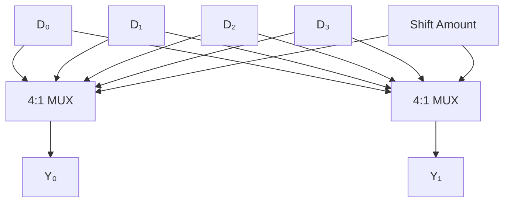
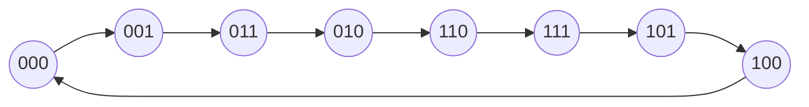
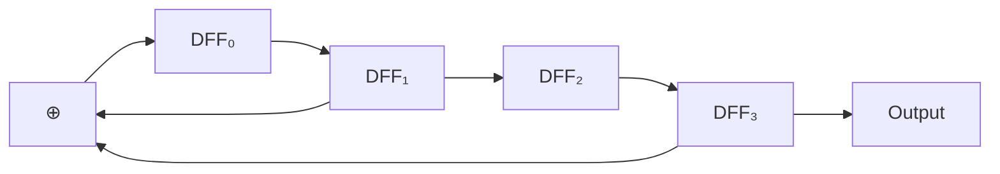

# Chapter 8: Registers and Counters

> **Prereq:** Chapters 6–7 (Sequential Circuits, State Machines) — registers and counters are specialised sequential structures.
> **Next:** Chapter 9 (Memory) — registers provide the smallest, fastest storage in the memory hierarchy.

## Learning Objectives

By the conclusion of this chapter, the student shall be able to:

1. Design and analyse parallel-load, shift, and universal registers
2. Construct synchronous and asynchronous binary counters
3. Implement decade, modulo-N, and programmable counters
4. Analyse trade-offs between ripple and synchronous counter topologies
5. Design ring counters, Johnson counters, and LFSR sequence generators
6. Apply counters in frequency division, timing generation, and control applications
7. Evaluate counter performance in terms of speed, power, and area

## 8.1 Register Architectures

A **register** is an array of bistable elements sharing a common clock. While Chapter 6 introduced basic registers, this section covers advanced register architectures and applications.

### 8.1.1 Register with Synchronous Clear and Load

```typescript
class AdvancedRegister {
    private flops: DFlipFlop[];
    readonly width: number;

    constructor(width: number) {
        this.width = width;
        this.flops = Array.from({ length: width }, () => new DFlipFlop());
    }

    get value(): number {
        let val = 0;
        for (let i = 0; i < this.width; i++) {
            val |= (this.flops[i].Q << i);
        }
        return val;
    }

    operate(
        data: number,
        clr: number,  // synchronous clear (active high)
        load: number, // parallel load enable
        clk: number
    ): void {
        for (let i = 0; i < this.width; i++) {
            let d: number;
            if (clr === 1) d = 0;
            else if (load === 1) d = (data >> i) & 1;
            else d = this.flops[i].Q; // hold
            this.flops[i].update(d, clk);
        }
    }
}
```

### 8.1.2 Bidirectional Shift Register

```typescript
class BidirectionalShiftRegister {
    private flops: DFlipFlop[];
    readonly width: number;

    constructor(width: number) {
        this.width = width;
        this.flops = Array.from({ length: width }, () => new DFlipFlop());
    }

    get value(): number {
        let val = 0;
        for (let i = 0; i < this.width; i++) {
            val |= (this.flops[i].Q << i);
        }
        return val;
    }

    shift(dir: number, serialIn: number, clk: number): number {
        // dir = 1 for right, 0 for left
        const serialOut = dir === 1
            ? this.flops[this.width - 1].Q
            : this.flops[0].Q;

        if (dir === 1) { // Shift right (MSB first)
            for (let i = this.width - 1; i > 0; i--) {
                this.flops[i].update(this.flops[i - 1].Q, clk);
            }
            this.flops[0].update(serialIn, clk);
        } else { // Shift left (LSB first)
            for (let i = 0; i < this.width - 1; i++) {
                this.flops[i].update(this.flops[i + 1].Q, clk);
            }
            this.flops[this.width - 1].update(serialIn, clk);
        }
        return serialOut;
    }
}
```

### 8.1.3 Barrel Shifter

A barrel shifter can shift or rotate an N-bit word by any number of positions in one clock cycle.

```typescript
class BarrelShifter {
    shift(data: number, amount: number, direction: 'left' | 'right', width: number): number {
        const mask = (1 << width) - 1;
        data &= mask;
        amount %= width;

        if (direction === 'left') {
            return ((data << amount) | (data >> (width - amount))) & mask;
        } else {
            return ((data >> amount) | (data << (width - amount))) & mask;
        }
    }
}

const bs = new BarrelShifter();
console.log(bs.shift(0b0110, 2, 'left', 4).toString(2).padStart(4, '0')); // 1001
console.log(bs.shift(0b0110, 1, 'right', 4).toString(2).padStart(4, '0')); // 0011
```

**Hardware implementation:** A barrel shifter is implemented as a crossbar switch or a multi-stage multiplexer tree. A 4-bit barrel shifter uses 4:1 multiplexers per output bit.



## 8.2 Advanced Counter Designs

### 8.2.1 Modulo-N Counter

A modulo-N counter counts from 0 to N-1 and then wraps. When N ≠ 2ᵏ, the counter must detect the terminal count and reset.

```typescript
class ModNCounter {
    private count: number = 0;
    readonly modulus: number;

    constructor(modulus: number) {
        this.modulus = modulus;
    }

    tick(): number {
        this.count = (this.count + 1) % this.modulus;
        return this.count;
    }

    get value(): number { return this.count; }
    get terminalCount(): boolean { return this.count === this.modulus - 1; }
}

// Mod-10 counter (BCD counter)
const bcdCounter = new ModNCounter(10);
for (let i = 0; i < 15; i++) {
    console.log(`Tick ${i}: ${bcdCounter.tick()}`);
}
```

### 8.2.2 BCD Counter (Decade Counter)

A BCD counter counts 0–9 and wraps. It requires 4 flip-flops but only 10 of 16 states are used.

```typescript
class BCDCounter {
    private flops: TFlipFlop[];

    constructor() {
        this.flops = Array.from({ length: 4 }, () => new TFlipFlop());
    }

    get value(): number {
        let val = 0;
        for (let i = 0; i < 4; i++) {
            val |= (this.flops[i].Q << i);
        }
        return val;
    }

    tick(clk: number): void {
        // T inputs for BCD counting 0→1→2→...→9→0
        const Q = this.value;
        const T0 = 1;  // always toggle
        const T1 = Q & 1;  // toggle when Q0=1
        const T2 = (Q & 0b11) === 0b11;  // toggle when Q1=Q0=1
        const T3 = ((Q & 0b111) === 0b111) || ((Q & 0b0111) === 0b0101);
        // When Q=1001 (9), T3=1 and T1=T2=0 so next state is 0000

        this.flops[0].update(T0, clk);
        this.flops[1].update(T1, clk);
        this.flops[2].update(T2, clk);
        this.flops[3].update(T3, clk);
    }
}

const bcd = new BCDCounter();
for (let i = 0; i < 16; i++) {
    bcd.tick(1);
    console.log(`BCD: ${bcd.value}`);
}
```

### 8.2.3 Gray Code Counter

Gray code counters change only one bit per transition, minimising switching noise and power consumption.



```typescript
class GrayCounter {
    private value: number = 0;
    private binValue: number = 0;

    tick(): number {
        this.binValue = (this.binValue + 1) & 0xF;
        this.value = this.binValue ^ (this.binValue >> 1);
        return this.value;
    }

    get value(): number { return this.value; }
}

const gray = new GrayCounter();
for (let i = 0; i < 8; i++) {
    console.log(`Step ${i}: ${gray.tick().toString(2).padStart(4, '0')}`);
}
```

### 8.2.4 Programmable Counter

A programmable counter loads a starting value and counts down (or up) to zero, asserting a terminal count flag.

```typescript
class ProgrammableCounter {
    private value: number = 0;
    private loaded: boolean = false;

    load(data: number): void {
        this.value = data;
        this.loaded = true;
    }

    tick(): boolean {
        if (!this.loaded) return false;
        if (this.value === 0) return true; // terminal count
        this.value--;
        return this.value === 0;
    }

    get currentValue(): number { return this.value; }
}

// Divide-by-7 frequency divider
const prog = new ProgrammableCounter();
prog.load(6); // counts 6,5,4,3,2,1,0 — 7 cycles
let output = 0;
for (let cycle = 0; cycle < 20; cycle++) {
    const tc = prog.tick();
    if (tc) {
        output ^= 1;
        prog.load(6); // reload
    }
    console.log(`Cycle ${cycle}: count=${prog.currentValue}, out=${output}`);
}
```

## 8.3 Linear Feedback Shift Registers

An LFSR generates a maximal-length pseudo-random sequence using a shift register with feedback from selected tap positions. LFSRs are used in PRNGs, CRC calculations, and built-in self-test (BIST).



```typescript
class LFSR {
    private state: number;
    readonly width: number;
    readonly taps: number[];

    constructor(width: number, taps: number[], seed?: number) {
        this.width = width;
        this.taps = taps;
        this.state = seed ?? 1; // seed must be non-zero
    }

    tick(): number {
        let feedback = 0;
        for (const tap of this.taps) {
            feedback ^= (this.state >> tap) & 1;
        }
        this.state = ((this.state << 1) | feedback) & ((1 << this.width) - 1);
        return this.state;
    }

    get currentState(): number { return this.state; }

    // Generate a sequence and detect when it repeats (cycle length)
    sequenceLength(): number {
        const seen = new Set<number>();
        let steps = 0;
        while (!seen.has(this.state)) {
            seen.add(this.state);
            this.tick();
            steps++;
        }
        return steps;
    }
}

// 4-bit LFSR with polynomial x⁴ + x³ + 1 (taps at positions 3 and 2)
const lfsr4 = new LFSR(4, [3, 2], 0b0001);
console.log(`4-bit LFSR state sequence:`);
for (let i = 0; i < 18; i++) {
    console.log(`  ${i}: ${lfsr4.currentState.toString(2).padStart(4, '0')}`);
    lfsr4.tick();
}

// 8-bit LFSR with polynomial x⁸ + x⁶ + x⁵ + x⁴ + 1
const lfsr8 = new LFSR(8, [7, 5, 4, 3], 0b00000001);
console.log(`8-bit LFSR cycle length: ${lfsr8.sequenceLength()}`); // 255 (maximal)
```

### 8.3.1 Maximal-Length Polynomials

| Width | Polynomial | Taps (0-indexed) | Cycle Length |
|-------|-----------|------------------|-------------|
| 3     | x³ + x² + 1 | [2, 1] | 7 |
| 4     | x⁴ + x³ + 1 | [3, 2] | 15 |
| 5     | x⁵ + x³ + 1 | [4, 2] | 31 |
| 6     | x⁶ + x⁵ + 1 | [5, 4] | 63 |
| 7     | x⁷ + x⁶ + 1 | [6, 5] | 127 |
| 8     | x⁸ + x⁶ + x⁵ + x⁴ + 1 | [7, 5, 4, 3] | 255 |
| 16    | x¹⁶ + x¹⁴ + x¹³ + x¹¹ + 1 | [15, 13, 12, 10] | 65535 |

### 8.3.2 LFSR Applications

```typescript
class LFSR_PRNG {
    private lfsr: LFSR;

    constructor(seed?: number) {
        this.lfsr = new LFSR(16, [15, 13, 12, 10], seed ?? 0xACE1);
    }

    next(): number {
        for (let i = 0; i < 16; i++) this.lfsr.tick();
        return this.lfsr.currentState;
    }

    // Generate a random integer in [0, max)
    nextInt(max: number): number {
        return this.next() % max;
    }
}

class CRC8 {
    private state: number = 0;

    update(byte: number): number {
        this.state ^= byte;
        for (let i = 0; i < 8; i++) {
            if (this.state & 0x80) {
                this.state = ((this.state << 1) ^ 0x07) & 0xFF;
            } else {
                this.state = (this.state << 1) & 0xFF;
            }
        }
        return this.state;
    }

    get result(): number { return this.state; }
}

const crc = new CRC8();
crc.update(0x41); // 'A'
crc.update(0x42); // 'B'
console.log(`CRC-8 of "AB": ${crc.result.toString(16)}`);
```

## 8.4 Johnson Counter

A Johnson counter (twisted ring counter) complements the serial output and feeds it back, producing 2N unique states from N flip-flops.


```typescript
class JohnsonCounter {
    private value: number = 0;
    readonly width: number;

    constructor(width: number) {
        this.width = width;
    }

    tick(): number {
        const msb = (this.value >> (this.width - 1)) & 1;
        const feedback = (~msb) & 1;
        this.value = ((this.value << 1) | feedback) & ((1 << this.width) - 1);
        return this.value;
    }

    get currentValue(): number { return this.value; }
}

const jc = new JohnsonCounter(4);
jc.tick(); // skip the all-zeros initial state
for (let i = 0; i < 8; i++) {
    console.log(`Johnson ${i}: ${jc.currentValue.toString(2).padStart(4, '0')}`);
    jc.tick();
}
// Output: 0001, 0011, 0111, 1111, 1110, 1100, 1000, 0000 (and repeats)
```

### 8.4.1 Decoding Johnson Counter States

Each Johnson counter state requires a 2-input AND gate to decode (vs. N-input for a ring counter), saving significant logic.

| State | 4-bit Johnson | Decode Equation |
|-------|--------------|-----------------|
| 0     | 0000         | ¬Q₃·¬Q₀         |
| 1     | 0001         | ¬Q₃·Q₀          |
| 2     | 0011         | ¬Q₂·Q₁          |
| 3     | 0111         | ¬Q₁·Q₂          |
| 4     | 1111         | Q₃·Q₀           |
| 5     | 1110         | Q₃·¬Q₀          |
| 6     | 1100         | Q₂·¬Q₁          |
| 7     | 1000         | Q₁·¬Q₂          |

## 8.5 Frequency Dividers

Counters are natural frequency dividers. A modulo-N counter divides the input frequency by N.

```typescript
function frequencyDivider(inputFreq: number, outputFreq: number): number {
    if (outputFreq === 0) return Infinity;
    return Math.round(inputFreq / outputFreq);
}

// Generate a 1 Hz signal from a 50 MHz clock
class FDivider {
    private count: number = 0;
    readonly divisor: number;

    constructor(divisor: number) {
        this.divisor = divisor;
    }

    tick(): number {
        this.count = (this.count + 1) % this.divisor;
        return this.count === 0 ? 1 : 0;
    }
}

const divider = new FDivider(50_000_000); // 50 MHz → 1 Hz
let outputPulse = 0;
for (let cycle = 0; cycle < 100_000_000; cycle++) {
    const pulse = divider.tick();
    if (pulse && outputPulse === 0) {
        // Toggle output on each pulse
        outputPulse ^= 1;
    }
}
```

### 8.5.1 50% Duty Cycle Dividers

For even divisors, the output toggles at half the divisor count, producing a perfect 50% duty cycle.

```typescript
class DutyCycleDivider {
    private count: number = 0;
    readonly halfDivisor: number;

    constructor(divisor: number) {
        this.halfDivisor = divisor / 2;
    }

    tick(): number {
        this.count = (this.count + 1) % (this.halfDivisor * 2);
        return this.count < this.halfDivisor ? 0 : 1;
    }
}
```

## 8.6 Performance Comparison

| Counter Type | Max Freq | Flip-Flops | Logic Complexity | Power | Glitch-Free |
|-------------|----------|-------------|------------------|-------|-------------|
| Ripple      | Low      | N           | Minimal          | Low   | No          |
| Synchronous | High     | N           | O(N²) AND gates  | High  | Yes         |
| LFSR        | High     | N           | O(N) XOR gates   | Low   | Yes         |
| Johnson     | High     | N           | Minimal          | Low   | Yes         |
| Ring        | High     | N           | None             | Low   | Yes         |

## Practical Takeaways

1. **Use LFSRs for PRNGs** — they produce maximal-length pseudo-random sequences with minimal hardware
2. **Binary counters are area-efficient** — for datapath applications where the count value matters
3. **Gray code counters reduce power** — single-bit transitions minimise switching activity in clock domain crossings
4. **Johnson counters simplify decoding** — 2-input AND gates replace N-input gates for state decoding
5. **Programmable counters provide flexibility** — software-configurable division ratios without changing hardware

## Summary

Registers and counters are the workhorses of sequential digital systems. This chapter covered advanced register architectures (universal shift registers, barrel shifters), a range of counter designs (BCD, Gray, programmable, Johnson, LFSR), and their applications in frequency division, sequence generation, and timing control. The LFSR in particular is a versatile building block for PRNGs, CRCs, and BIST. The next chapter moves to larger-scale storage — semiconductor memory architectures.

## Chapter Quiz

**Q1.** An N-bit Johnson counter produces how many unique states?
a) N
b) 2N
c) 2ᴺ
d) N²

**Q2.** What is the cycle length of a maximal-length 5-bit LFSR?
a) 5
b) 31
c) 32
d) 25

**Q3.** A barrel shifter shifts data by:
a) 1 bit per clock cycle
b) Any number of bits in one cycle
c) N bits in N cycles
d) Only one direction

**Q4.** A BCD counter has a modulus of:
a) 10
b) 16
c) 8
d) 12

**Q5.** The main advantage of a synchronous counter over a ripple counter is:
a) Lower power
b) Fewer flip-flops
c) Higher maximum clock frequency
d) Lower cost

### Answers

Q1: b | Q2: b | Q3: b | Q4: a | Q5: c

## Exercises

1. **Universal register:** Implement a 4-bit universal shift register with hold, shift-left, shift-right, and parallel-load modes. Verify through simulation.

2. **LFSR sequence analysis:** For a 5-bit LFSR with polynomial x⁵ + x² + 1, generate the full state sequence and verify it is maximal length (31 states, excluding 0).

3. **Modulo-60 counter:** Design a cascaded counter (mod-10 + mod-6) that counts from 0 to 59. Implement the two-counter cascade in TypeScript.

4. **Barrel shifter design:** Implement an 8-bit barrel shifter in TypeScript. Count the number of 2:1 and 4:1 multiplexers required for the hardware implementation.

5. **Frequency synthesis:** Design a programmable frequency divider that can generate any output frequency from 1 Hz to 10 MHz from a 50 MHz input clock.

6. **CRC generator:** Implement a CRC-16-CCITT generator using LFSR principles. Compute the CRC for a test packet and verify against a known-good implementation.

7. **Ring vs Johnson counter:** Implement both a 4-bit ring counter and a 4-bit Johnson counter. Compare their state sequences, decoding requirements, and fault tolerance.

8. **Counter-based PWM:** Design a pulse-width modulator using a programmable counter. The duty cycle should be adjustable from 0% to 100% in 10% steps.

9. **Parallel-to-serial converter:** Design a circuit that loads an 8-bit word in parallel and shifts it out serially at a higher clock rate. Include a "data valid" strobe.

10. **Dual-modulus prescaler:** Implement a divide-by-128/129 dual-modulus prescaler used in PLL frequency synthesisers. Explain how it achieves fractional-N division.
