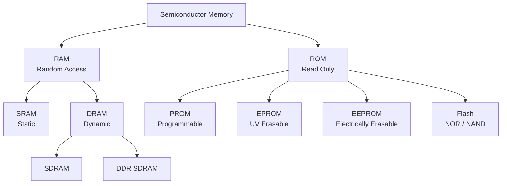
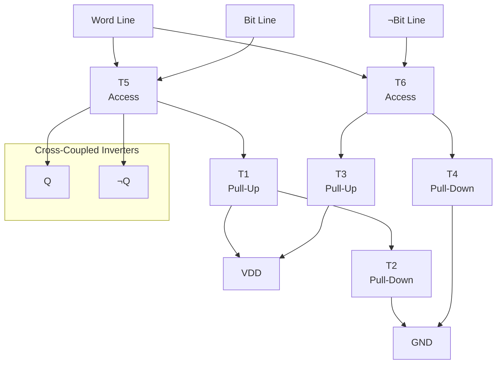
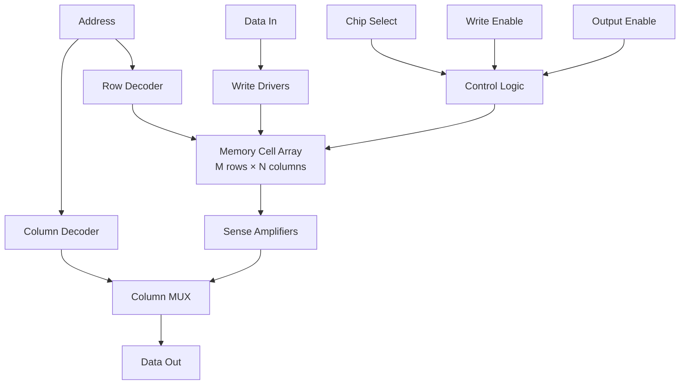
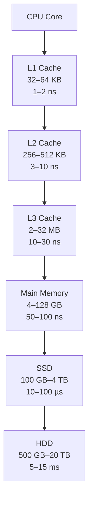

# Chapter 9: Semiconductor Memory

> **Prereq:** Chapter 8 (Registers and Counters) — registers are the fastest, smallest memory elements; this chapter extends storage to arrays of cells.
> **Next:** Chapter 10 (PLA and PAL) — programmable logic is a structured form of memory-based logic implementation.

## Learning Objectives

By the conclusion of this chapter, the student shall be able to:

1. Classify semiconductor memory by volatility, access method, and technology
2. Analyse the internal structure and operation of SRAM and DRAM cells
3. Design address decoders and sense amplifiers for memory arrays
4. Compare ROM, PROM, EPROM, EEPROM, and Flash memory technologies
5. Evaluate memory timing parameters (access time, cycle time, bandwidth)
6. Explain error detection and correction using Hamming codes and SECDED
7. Design memory hierarchy and cache coherence mechanisms
8. Calculate power consumption for different memory technologies

## 9.1 Memory Taxonomy



| Property | SRAM | DRAM | Flash (NOR) | Flash (NAND) |
|----------|------|------|-------------|--------------|
| Volatile | Yes | Yes | No | No |
| Cell size | 6 transistors | 1T + 1C | 1 floating-gate | 1 floating-gate |
| Density | Low | High | Medium | Very high |
| Speed | Fast (1–10 ns) | Moderate (50 ns) | Slow (70 ns read) | Very slow (µs read) |
| Refresh | No | Yes (64 ms) | No | No |
| Write endurance | Infinite | Infinite | 10⁵–10⁶ cycles | 10³–10⁵ cycles |
| Power | Medium | Low (standby) | Zero (non-volatile) | Zero |

## 9.2 SRAM — Static Random Access Memory

SRAM stores each bit in a **cross-coupled inverter pair** — a bistable latch that holds data as long as power is applied.

### 9.2.1 6T SRAM Cell



**Operation:**
- **Standby:** WL = 0, access transistors off. Cross-coupled inverters hold the state.
- **Read:** Precharge BL = BLB = VDD/2. Assert WL = 1. The cell pulls one bit line low; a sense amplifier detects the voltage difference.
- **Write:** Drive BL and BLB to complementary values. Assert WL = 1. The access transistors overpower the latch.

```typescript
class SRAM6T {
    private Q: number = 0;
    private Qb: number = 1;

    read(wl: number): { bl: number; blb: number } {
        if (wl === 1) {
            return { bl: this.Q, blb: this.Qb };
        }
        return { bl: 0, blb: 0 };
    }

    write(wl: number, bl: number, blb: number): void {
        if (wl === 1) {
            this.Q = bl;
            this.Qb = blb;
        }
    }

    get state(): string { return `Q=${this.Q} ¬Q=${this.Qb}`; }
}
```

### 9.2.2 SRAM Array Architecture



```typescript
class SRAMArray {
    private cells: SRAM6T[][];
    readonly rows: number;
    readonly cols: number;

    constructor(rows: number, cols: number) {
        this.rows = rows;
        this.cols = cols;
        this.cells = Array.from(
            { length: rows },
            () => Array.from({ length: cols }, () => new SRAM6T())
        );
    }

    read(address: number): number {
        const row = address % this.rows;
        const col = Math.floor(address / this.rows) % this.cols;
        const cell = this.cells[row][col];
        const result = cell.read(1);
        return result.bl;
    }

    write(address: number, data: number): void {
        const row = address % this.rows;
        const col = Math.floor(address / this.rows) % this.cols;
        const cell = this.cells[row][col];
        cell.write(1, data, 1 - data);
    }
}

// 64-word SRAM (8×8 array)
const ram = new SRAMArray(8, 8);
ram.write(0b001001, 1); // address 9, data 1
console.log(ram.read(0b001001)); // 1
```

### 9.2.3 Sense Amplifier

The sense amplifier detects the tiny voltage difference (50–200 mV) between bit lines during a read and amplifies it to full CMOS levels.

```typescript
class SenseAmp {
    sense(bl: number, blb: number): number {
        const diff = bl - blb;
        if (Math.abs(diff) < 0.05) return 0.5; // metastable
        return diff > 0 ? 1 : 0;
    }
}
```

## 9.3 DRAM — Dynamic Random Access Memory

DRAM stores each bit on a **capacitor** that leaks charge over time, requiring periodic refresh.

### 9.3.1 1T1C DRAM Cell

A single transistor + capacitor cell is the densest memory cell in use.

```typescript
class DRAMCell {
    private charge: number = 0; // 0 or VDD

    read(wl: number): number {
        if (wl === 1) {
            const stored = this.charge;
            this.charge = stored; // restore after destructive read
            return stored;
        }
        return 0; // High-Z
    }

    write(wl: number, data: number): void {
        if (wl === 1) {
            this.charge = data;
        }
    }

    refresh(): void {
        // Must be called every 64 ms
        // Charge leaks through the access transistor and subthreshold leakage
    }

    get isCharged(): boolean { return this.charge > 0.5; }
}
```

### 9.3.2 DRAM Timing

```text
          ────────
RAS      │        │
    ─────┘        └────────────
               ────────
CAS          │        │
    ─────────┘        └───────
               ────────
Data Out     │XXXXXXXX│
    ─────────┘        └───────
    │← tRCD →│← tCAS →│
    │←─────── tRC ──────────→│
```

```typescript
interface DRAMTiming {
    tRCD: number; // RAS to CAS delay
    tCAS: number; // CAS latency
    tRP: number;  // RAS precharge
    tRC: number;  // Row cycle time
}

const ddr4_3200: DRAMTiming = {
    tRCD: 13.75,   // ns
    tCAS: 13.75,   // ns (CL = 22 at 1600 MHz)
    tRP: 13.75,    // ns
    tRC: 45        // ns
};

function accessTime(timing: DRAMTiming): number {
    return timing.tRCD + timing.tCAS;
}
```

### 9.3.3 DRAM Refresh

Every row must be refreshed every 64 ms. With 8192 rows, the refresh interval per row is 64 ms / 8192 ≈ 7.8 µs.

```typescript
class DRAMController {
    private cells: DRAMCell[][];
    readonly rows: number;
    readonly cols: number;
    private refreshRow: number = 0;
    private cycleCount: number = 0;

    constructor(rows: number, cols: number) {
        this.rows = rows;
        this.cols = cols;
        this.cells = Array.from(
            { length: rows },
            () => Array.from({ length: cols }, () => new DRAMCell())
        );
    }

    read(row: number, col: number): number {
        return this.cells[row][col].read(1);
    }

    write(row: number, col: number, data: number): void {
        this.cells[row][col].write(1, data);
    }

    tick(): void {
        this.cycleCount++;
        // Refresh one row every N cycles
        const refreshInterval = Math.floor(64000000 / this.rows / 10); // ~ns per row
        if (this.cycleCount % refreshInterval === 0) {
            const row = this.refreshRow;
            for (let c = 0; c < this.cols; c++) {
                const data = this.cells[row][c].read(1);
                this.cells[row][c].write(1, data); // restore
            }
            this.refreshRow = (this.refreshRow + 1) % this.rows;
        }
    }

    get refreshOverhead(): number {
        return (this.rows / 64000) * 100; // refresh cycles per 1000 µs
    }
}
```

### 9.3.4 SDRAM and DDR

| Generation | I/O Clock | Data Rate | Prefetch | VDD |
|------------|-----------|-----------|----------|-----|
| SDRAM      | 100–133 MHz | 100–133 MT/s | 1n | 3.3 V |
| DDR        | 133–200 MHz | 266–400 MT/s | 2n | 2.5 V |
| DDR2       | 200–533 MHz | 400–1066 MT/s | 4n | 1.8 V |
| DDR3       | 400–800 MHz | 800–1600 MT/s | 8n | 1.5 V |
| DDR4       | 800–1600 MHz | 1600–3200 MT/s | 8n | 1.2 V |
| DDR5       | 1600–3200 MHz | 3200–6400 MT/s | 16n | 1.1 V |

```typescript
function dramBandwidth(dataRate: number, busWidth: number, channels: number): number {
    return (dataRate * busWidth * channels) / 8; // bytes/second
}

console.log(`DDR4-3200 × 64-bit × 1 ch: ${dramBandwidth(3200, 64, 1)} MB/s`); // 25600
console.log(`DDR5-6400 × 64-bit × 2 ch: ${dramBandwidth(6400, 64, 2)} MB/s`); // 102400
```

## 9.4 Non-Volatile Memory

### 9.4.1 Mask ROM

Data is programmed during chip fabrication using the via mask. Used for fixed lookup tables and boot code.

```typescript
class MaskROM {
    private data: number[];

    constructor(data: number[]) {
        this.data = data;
    }

    read(address: number): number {
        return this.data[address] ?? 0;
    }
}

// Fixed sine lookup table (8 entries)
const sineLUT = new MaskROM([
    0, 128, 181, 128, 0, 128, 181, 128
]);
```

### 9.4.2 PROM, EPROM, EEPROM

- **PROM:** One-time programmable fuses or anti-fuses
- **EPROM:** UV-erasable floating-gate transistors; erased in bulk
- **EEPROM:** Electrically erasable byte-by-byte; uses tunnel injection

### 9.4.3 Flash Memory

Flash memory is the dominant non-volatile technology. Two main variants:

| Property | NOR Flash | NAND Flash |
|----------|-----------|------------|
| Cell arrangement | Parallel | Serial string |
| Read speed | Fast (70–100 ns) | Slow (µs reads) |
| Write speed | Slow (ms) | Fast (µs page writes) |
| Erase granularity | Block (64–128 KB) | Block (64–512 KB) |
| Density | Low–Medium | Very high |
| Typical use | Code execution | Mass storage |

```typescript
class NANDFlash {
    private pages: number[][];
    readonly pageSize: number;
    readonly pagesPerBlock: number;
    private eraseCounts: number[];

    constructor(numBlocks: number, pagesPerBlock: number, pageSize: number) {
        this.pageSize = pageSize;
        this.pagesPerBlock = pagesPerBlock;
        this.pages = Array.from(
            { length: numBlocks * pagesPerBlock },
            () => Array(pageSize).fill(0xFF)
        );
        this.eraseCounts = Array(numBlocks).fill(0);
    }

    read(page: number, offset: number): number {
        return this.pages[page][offset] ?? 0xFF;
    }

    program(page: number, data: number[]): void {
        // NAND programming only clears bits (1→0)
        for (let i = 0; i < Math.min(data.length, this.pageSize); i++) {
            this.pages[page][i] &= data[i];
        }
    }

    erase(block: number): void {
        const start = block * this.pagesPerBlock;
        const end = start + this.pagesPerBlock;
        for (let p = start; p < end; p++) {
            this.pages[p] = Array(this.pageSize).fill(0xFF);
        }
        this.eraseCounts[block]++;
    }

    get wearLevel(): number[] {
        return this.eraseCounts;
    }
}
```

## 9.5 Address Decoding

The address decoder selects one word line from 2ᴺ address lines. Two architectures:

### 9.5.1 Single-Level (NAND) Decoder

A single NAND gate per word line with N inputs and a buffer.

```
WLᵢ = ¬(A₀ = a₀ · A₁ = a₁ · ... · Aₙ₋₁ = aₙ₋₁)
```

**Area:** O(N · 2ᴺ) — scales poorly beyond 8–10 bits.

### 9.5.2 Two-Level (Pre-) Decoder

Split address bits into pre-decode groups, then combine.

```typescript
class PreDecoder {
    readonly rowBits: number;
    readonly groupSize: number;

    constructor(rowBits: number, groupSize: number = 3) {
        this.rowBits = rowBits;
        this.groupSize = groupSize;
    }

    decode(address: number): number {
        // 2-level decode: pre-decode groups of groupSize bits
        const groups = Math.ceil(this.rowBits / this.groupSize);
        const predecode = new Array(groups);

        for (let g = 0; g < groups; g++) {
            const shift = g * this.groupSize;
            const bits = (address >> shift) & ((1 << this.groupSize) - 1);
            predecode[g] = 1 << bits;
        }

        // Second level: AND pre-decode signals
        // Each word line is the AND of one signal from each group
        let wordLine = 0;
        for (let w = 0; w < (1 << this.rowBits); w++) {
            let match = true;
            for (let g = 0; g < groups; g++) {
                const shift = g * this.groupSize;
                const bit = (w >> shift) & ((1 << this.groupSize) - 1);
                if (!(predecode[g] & (1 << bit))) {
                    match = false;
                    break;
                }
            }
            if (match) wordLine = w;
        }
        return wordLine;
    }
}
```

## 9.6 Error Detection and Correction

### 9.6.1 Parity

Single-bit parity detects an odd number of errors. Used in DRAM row-based protection.

### 9.6.2 Hamming Code (SECDED)

A **Single Error Correct, Double Error Detect (SECDED)** code adds log₂(N) + 1 check bits to an N-bit word.

For 64-bit data: 7 check bits needed (2⁷ ≥ 64 + 7 + 1 → 128 ≥ 72).

```typescript
class HammingCode {
    readonly dataBits: number;
    readonly checkBits: number;

    constructor(dataBits: number) {
        this.dataBits = dataBits;
        // Find smallest k such that 2^k >= dataBits + k + 1
        let k = 1;
        while ((1 << k) < dataBits + k + 1) k++;
        this.checkBits = k;
    }

    encode(data: bigint): bigint {
        let codeword = 0n;
        let dataIdx = 0n;
        for (let i = 0n; i < BigInt(this.dataBits + this.checkBits); i++) {
            const pos = 1n << i;
            if (pos & (pos - 1n)) { // Not a power of 2 → data position
                const dataBit = (data >> dataIdx) & 1n;
                if (dataBit) codeword |= (1n << i);
                dataIdx++;
            }
        }

        // Calculate parity bits
        for (let i = 0n; i < BigInt(this.checkBits); i++) {
            const parityPos = 1n << i;
            let parity = 0n;
            for (let j = parityPos; j < BigInt(this.dataBits + this.checkBits); j++) {
                if (j & parityPos) {
                    parity ^= (codeword >> j) & 1n;
                }
            }
            if (parity) codeword |= (1n << i);
        }
        return codeword;
    }

    decode(codeword: bigint): { data: bigint; corrected: boolean; errorPos: number } {
        let syndrome = 0n;
        for (let i = 0n; i < BigInt(this.checkBits); i++) {
            const parityPos = 1n << i;
            let parity = 0n;
            for (let j = parityPos; j < BigInt(this.dataBits + this.checkBits); j++) {
                if (j & parityPos) {
                    parity ^= (codeword >> j) & 1n;
                }
            }
            if (parity) syndrome |= (1n << i);
        }

        if (syndrome === 0n) {
            // No error
            return { data: this.extractData(codeword), corrected: false, errorPos: -1 };
        }

        // Correct the error
        const corrected = codeword ^ (1n << syndrome);
        return { data: this.extractData(corrected), corrected: true, errorPos: Number(syndrome) };
    }

    private extractData(codeword: bigint): bigint {
        let data = 0n;
        let dataIdx = 0n;
        for (let i = 0n; i < BigInt(this.dataBits + this.checkBits); i++) {
            const pos = 1n << i;
            if (pos & (pos - 1n)) { // Not a power of 2
                const bit = (codeword >> i) & 1n;
                if (bit) data |= (1n << dataIdx);
                dataIdx++;
            }
        }
        return data;
    }
}

const hamming = new HammingCode(4);
const encoded = hamming.encode(0b1011n);
console.log(`Encoded: ${encoded.toString(2).padStart(7, '0')}`);

// Introduce single-bit error
const withError = encoded ^ (1n << 3n);
const result = hamming.decode(withError);
console.log(`Decoded: ${result.data.toString(2)} corrected=${result.corrected}`); // 1011
```

## 9.7 Memory Hierarchy and Cache



```typescript
class CacheLine {
    readonly tag: number;
    readonly data: number[];
    valid: boolean = false;
    dirty: boolean = false;

    constructor(tag: number, wordsPerLine: number) {
        this.tag = tag;
        this.data = Array(wordsPerLine).fill(0);
    }
}

class DirectMappedCache {
    private lines: CacheLine[];
    readonly numLines: number;
    readonly wordsPerLine: number;

    constructor(numLines: number, wordsPerLine: number) {
        this.numLines = numLines;
        this.wordsPerLine = wordsPerLine;
        this.lines = Array.from(
            { length: numLines },
            (_, i) => new CacheLine(0, wordsPerLine)
        );
    }

    access(address: number): { hit: boolean; data?: number } {
        const blockSize = this.wordsPerLine;
        const blockAddr = Math.floor(address / blockSize);
        const offset = address % blockSize;
        const index = blockAddr % this.numLines;
        const tag = Math.floor(blockAddr / this.numLines);

        const line = this.lines[index];
        if (line.valid && line.tag === tag) {
            return { hit: true, data: line.data[offset] };
        }
        return { hit: false };
    }
}
```

## Practical Takeaways

1. **SRAM is fast but large (6T/cell)** — used for caches and registers; 1–10 ns access
2. **DRAM is dense but needs refresh** — 1T1C cell requires periodic refresh, ~50 ns access
3. **NAND Flash is the highest density non-volatile memory** — page-based read/write, block erase
4. **Address pre-decoders save area** — multi-level decoding reduces transistor count by orders of magnitude
5. **ECC is essential for modern memories** — SECDED Hamming codes protect DRAM and Flash from soft errors

## Summary

Semiconductor memory spans a wide design space from the 6T SRAM cell through 1T1C DRAM to floating-gate Flash. SRAM provides the fastest access (1–10 ns) at the cost of density, while DRAM offers higher density with refresh overhead. Flash memory provides non-volatile storage at the cost of write speed and endurance limits. Address decoding, sense amplification, and error correction circuits are critical enablers. The next chapter explores programmable logic arrays and PALs — structured logic that bridges memory and computation.

## Chapter Quiz

**Q1.** An SRAM cell uses how many transistors in its standard 6T configuration?
a) 4
b) 6
c) 8
d) 2

**Q2.** DRAM requires refresh because:
a) The capacitor leaks charge
b) The transistor gate leaks
c) The sense amplifier needs resets
d) The address decoder drifts

**Q3.** A SECDED Hamming code for 64 data bits requires how many check bits?
a) 6
b) 7
c) 8
d) 9

**Q4.** NAND Flash is organised for access at the granularity of:
a) Bits
b) Bytes
c) Words
d) Pages

**Q5.** The main advantage of address pre-decoding is:
a) Faster access
b) Lower power
c) Reduced area
d) Higher density

### Answers

Q1: b | Q2: a | Q3: b | Q4: d | Q5: c

## Exercises

1. **SRAM array:** Design and implement an 8×8 SRAM array in TypeScript with row decoder, column multiplexer, and sense amplifier.

2. **DRAM controller:** Implement a DRAM controller with auto-refresh. The controller should handle read, write, and refresh cycles with appropriate arbitration.

3. **Hamming SECDED:** Extend the Hamming code implementation to 64 data bits. Test with single-bit errors and double-bit errors (the latter should be flagged without correction).

4. **NAND Flash controller:** Design a Flash translation layer (FTL) that maps logical block addresses to physical pages with wear leveling.

5. **Cache performance:** Simulate a 4-way set-associative cache with LRU replacement for a stream of addresses. Measure the hit rate for different cache sizes.

6. **ROM-based LUT:** Implement a sine wave generator using a 256-entry lookup table stored in ROM. Compute the worst-case error vs. an ideal sine.

7. **DDR timing:** Write a TypeScript function that computes the total memory access latency given DDR timing parameters (tRCD, tCAS, tRP, tRC) and a burst length of 8.

8. **Error rate analysis:** For a memory with 10⁻¹² soft error rate per bit, compute the probability of an uncorrectable error in a 64-bit word with SECDEC over 1 year of continuous operation.

9. **Memory power model:** Create a power estimation model for SRAM and DRAM at a given capacity, access rate, and technology node. Compare the energy per access.

10. **Hybrid memory cube:** Research and describe the architecture of a 3D-stacked memory like HBM or HMC. Explain how TSVs (through-silicon vias) improve bandwidth over traditional DDR.
