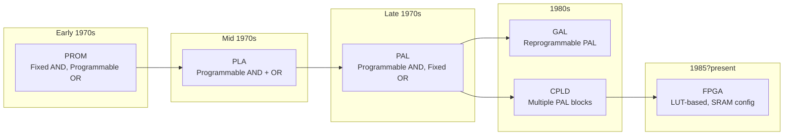
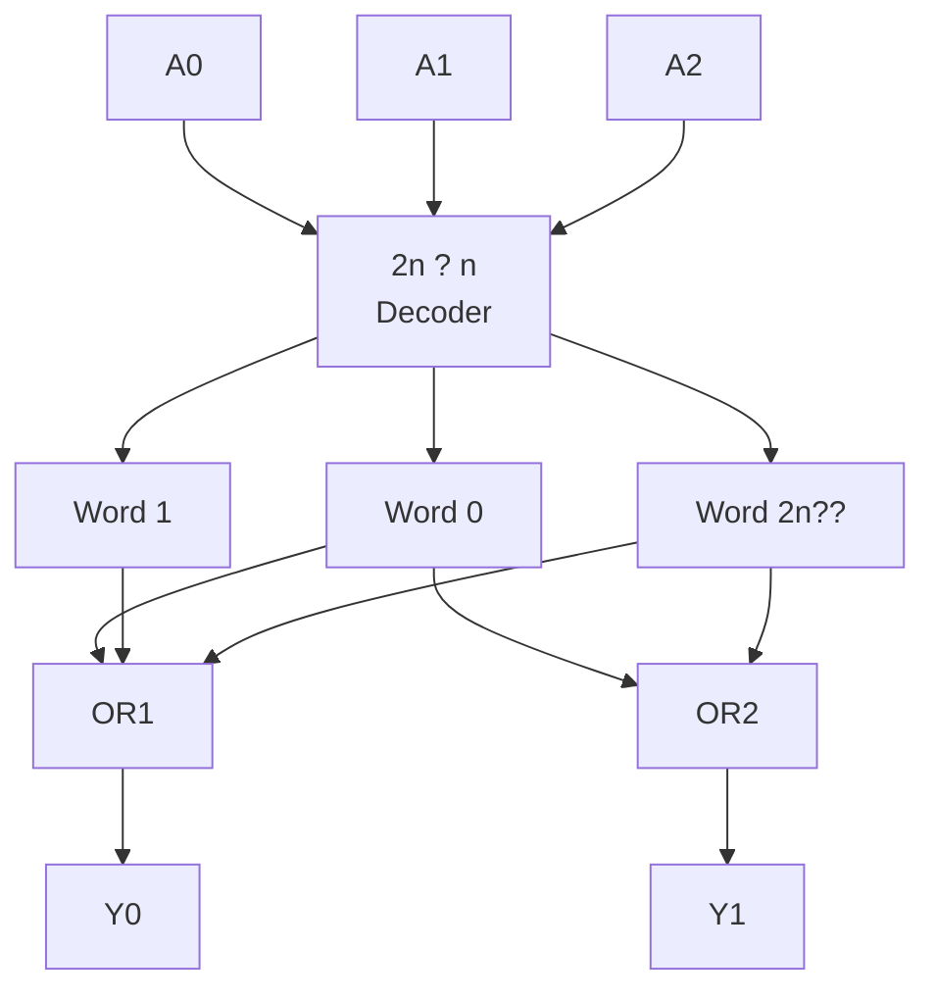
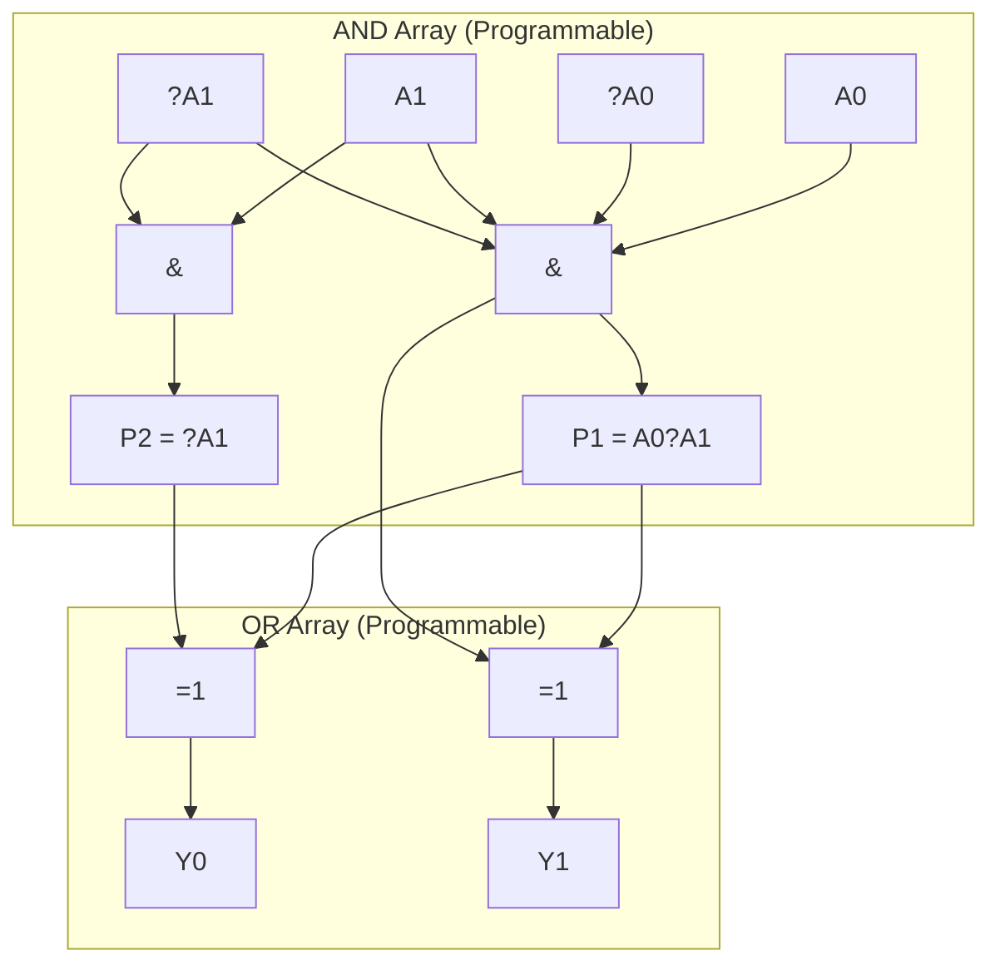
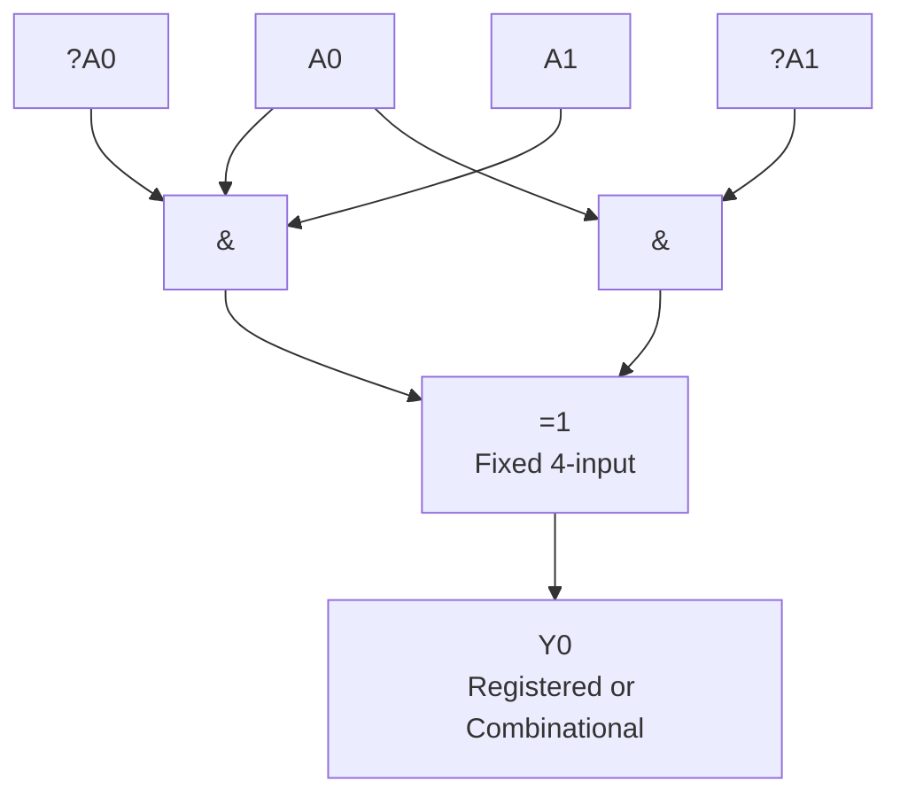
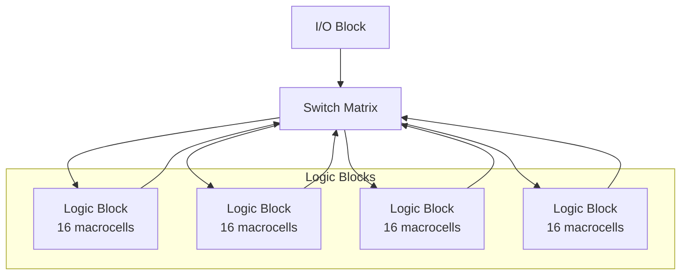
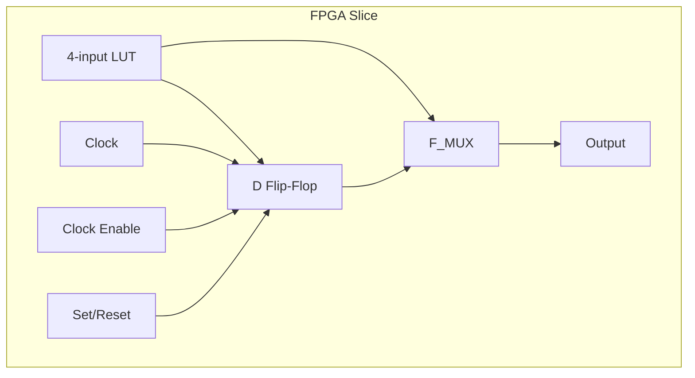

# Chapter 10: Programmable Logic ? PLA and PAL

> **Prereq:** Chapter 4 (Karnaugh Maps) and Chapter 5 (Combinational Circuits) ? programmable logic implements sum-of-products expressions.
> **Next:** Chapter 11 (Arithmetic Circuits) ? arithmetic building blocks often use PLD structures for control logic.

## Learning Objectives

By the conclusion of this chapter, the student shall be able to:

<!-- Image Gallery -->
<div style="display:flex;flex-wrap:wrap;gap:4px;margin:16px 0;padding:12px;background:#f8fafc;border-radius:8px;border:1px solid #e2e8f0;">
<a href="../../../assets/images/lessons/digital-logic/10-pla-pal/hero.svg" target="_blank" rel="noopener">
  
</a>
<a href="../../../assets/images/lessons/digital-logic/10-pla-pal/handwritten-notes.svg" target="_blank" rel="noopener">
  
</a>
<a href="../../../assets/images/lessons/digital-logic/10-pla-pal/sticky-notes.svg" target="_blank" rel="noopener">
  
</a>
<a href="../../../assets/images/lessons/digital-logic/10-pla-pal/visual-explanation.svg" target="_blank" rel="noopener">
  
</a>
<a href="../../../assets/images/lessons/digital-logic/10-pla-pal/architecture.svg" target="_blank" rel="noopener">
  
</a>
<a href="../../../assets/images/lessons/digital-logic/10-pla-pal/workflow.svg" target="_blank" rel="noopener">
  
</a>
<a href="../../../assets/images/lessons/digital-logic/10-pla-pal/mindmap.svg" target="_blank" rel="noopener">
  
</a>
<a href="../../../assets/images/lessons/digital-logic/10-pla-pal/comparison.svg" target="_blank" rel="noopener">
  
</a>
<a href="../../../assets/images/lessons/digital-logic/10-pla-pal/cheatsheet.svg" target="_blank" rel="noopener">
  
</a>
<a href="../../../assets/images/lessons/digital-logic/10-pla-pal/interview-quiz.svg" target="_blank" rel="noopener">
  
</a>
<a href="../../../assets/images/lessons/digital-logic/10-pla-pal/social-card.svg" target="_blank" rel="noopener">
  
</a>
</div>
<!-- End Image Gallery -->


1. Distinguish between PROM, PLA, PAL, and CPLD/FPGA architectures
2. Design and program a PLA for arbitrary combinational logic
3. Analyse the trade-offs between PAL (fixed OR) and PLA (programmable OR)
4. Implement state machines using programmable logic devices
5. Evaluate logic capacity, speed, and power for different PLD families
6. Compare ISP (in-system programmable) vs. one-time programmable devices
7. Translate Boolean equations into PLA/PAL fuse patterns

## 10.1 Evolution of Programmable Logic



## 10.2 PROM-Based Logic

A PROM (programmable read-only memory) can implement any combinational function. The **address lines** serve as inputs, and the **data lines** serve as outputs.

```
An n-input, m-output PROM = AND array (fixed) + OR array (programmable)
    = n:2n decoder + m OR gates
```



```typescript
class PROM {
    private words: number[];
    readonly addressBits: number;
    readonly dataBits: number;

    constructor(addressBits: number, dataBits: number) {
        this.addressBits = addressBits;
        this.dataBits = dataBits;
        this.words = Array(1 << addressBits).fill(0);
    }

    program(address: number, data: number): void {
        this.words[address] = data & ((1 << this.dataBits) - 1);
    }

    read(address: number): number {
        return this.words[address] ?? 0;
    }

    // Implement F(A,B,C) = Sm(1,3,5,6) using PROM
    static implementFunction(addr: number): number {
        const truthTable: number[] = [
            0b00, // 000 ? 0
            0b01, // 001 ? 1
            0b00, // 010 ? 0
            0b01, // 011 ? 1
            0b00, // 100 ? 0
            0b01, // 101 ? 1
            0b10, // 110 ? 1 (bit 1)
            0b00  // 111 ? 0
        ];
        return truthTable[addr] ?? 0;
    }
}
```

**Limitation:** A PROM uses a full decoder ? it allocates one word line for every minterm, even for don't-care conditions. A 16-input function needs 2?6 = 65,536 word lines, most unused.

## 10.3 Programmable Logic Array (PLA)

A PLA has both a **programmable AND array** and a **programmable OR array**, sharing product terms across multiple outputs.



### 10.3.1 PLA Structure


- **Input buffers:** generate true and complement of each input
- **AND array:** each product term connects to any input (or its complement) via programmable connections
- **OR array:** each output sums selected product terms

```typescript
class PLA {
    private productTerms: number[][]; // each term: [inputMask, outputMask]
    readonly numInputs: number;
    readonly numOutputs: number;
    readonly numTerms: number;

    constructor(numInputs: number, numOutputs: number, numTerms: number) {
        this.numInputs = numInputs;
        this.numOutputs = numOutputs;
        this.numTerms = numTerms;
        this.productTerms = [];
    }

    // Program a product term
    // inputMask: bit = 1 ? true, 0 ? complement, X ? don't connect
    //   For each input bit: 2 bits: [true, complement]
    //   true=1, comp=1, neither=don't care
    addTerm(inputMask: number[], outputMask: number[]): void {
        // inputMask[i] = 1 for true, 0 for complement, -1 for don't care
        const encodedInput = inputMask.map(m => m === 1 ? 0b10 : m === 0 ? 0b01 : 0b00);
        const encodedOutput = outputMask.reduce((acc, b, i) => acc | (b << i), 0);
        this.productTerms.push([...encodedInput, encodedOutput]);
    }

    evaluate(inputs: number[]): number[] {
        const outputs = Array(this.numOutputs).fill(0);

        for (const term of this.productTerms) {
            let termActive = true;
            const encodedInput = term.slice(0, this.numInputs);
            const outputMask = term[this.numInputs];

            for (let i = 0; i < this.numInputs; i++) {
                const inputVal = inputs[i];
                const trueBit = (encodedInput[i] >> 1) & 1;
                const compBit = encodedInput[i] & 1;

                if (trueBit && compBit) continue; // don't care
                if (trueBit && inputVal !== 1) { termActive = false; break; }
                if (compBit && inputVal !== 0) { termActive = false; break; }
            }

            if (termActive) {
                for (let o = 0; o < this.numOutputs; o++) {
                    if ((outputMask >> o) & 1) outputs[o] = 1;
                }
            }
        }
        return outputs;
    }

    // Implement a full adder using PLA
    static fullAdderPLA(): PLA {
        const pla = new PLA(3, 2, 7); // 3 inputs, 2 outputs, 7 product terms

        // Sum = Sm(1,2,4,7)
        pla.addTerm([1, 0, 0], [1, 0]); // A??B??C
        pla.addTerm([0, 1, 0], [1, 0]); // ?A?B??C
        pla.addTerm([0, 0, 1], [1, 0]); // ?A??B?C
        pla.addTerm([1, 1, 1], [1, 0]); // A?B?C

        // Cout = Sm(3,5,6,7)
        pla.addTerm([1, 1, -1], [0, 1]); // A?B
        pla.addTerm([1, -1, 1], [0, 1]); // A?C
        pla.addTerm([-1, 1, 1], [0, 1]); // B?C

        return pla;
    }
}

// Verify full adder PLA
const faPLA = PLA.fullAdderPLA();
for (let i = 0; i < 8; i++) {
    const inputs = [(i >> 2) & 1, (i >> 1) & 1, i & 1];
    const outputs = faPLA.evaluate(inputs);
    console.log(`A=${inputs[0]} B=${inputs[1]} Cin=${inputs[2]} ? Sum=${outputs[0]} Cout=${outputs[1]}`);
}
```

### 10.3.2 PLA Minimisation


Minimising the number of product terms is critical for PLA area efficiency:

```typescript
function minimisePLA(truthTable: number[][], numInputs: number): number[][] {
    // Combine adjacent minterms using the uniting theorem
    // A?B?C + A?B??C = A?B (C eliminated)
    const terms: number[][] = [];
    let current = truthTable.map(row => [...row]);

    let changed = true;
    while (changed) {
        changed = false;
        const next: number[][] = [];
        const used = new Array(current.length).fill(false);

        for (let i = 0; i < current.length; i++) {
            for (let j = i + 1; j < current.length; j++) {
                const diff = current[i].map((v, k) => v !== current[j][k] ? k : -1)
                    .filter(k => k >= 0 && k < numInputs);
                if (diff.length === 1) {
                    // Adjacent ? merge
                    const merged = [...current[i]];
                    merged[diff[0]] = -1; // don't care
                    next.push(merged);
                    used[i] = used[j] = true;
                    changed = true;
                }
            }
        }

        // Add remaining uncombined terms
        for (let i = 0; i < current.length; i++) {
            if (!used[i]) next.push(current[i]);
        }

        // Deduplicate
        const unique = new Set(next.map(t => t.join(',')));
        current = Array.from(unique).map(s => s.split(',').map(Number));
    }

    return current;
}
```

## 10.4 Programmable Array Logic (PAL)

A PAL has a **programmable AND array** but a **fixed OR array**. Each output has a fixed set of product terms (typically 4?8).



### 10.4.1 PAL Architecture


```typescript
class PAL {
    private andArray: number[][][]; // [output][productTerm][inputConnect]
    readonly numInputs: number;
    readonly numOutputs: number;
    readonly termsPerOutput: number;

    constructor(numInputs: number, numOutputs: number, termsPerOutput: number) {
        this.numInputs = numInputs;
        this.numOutputs = numOutputs;
        this.termsPerOutput = termsPerOutput;
        // Initialize: all connections present (fuse intact)
        this.andArray = Array.from(
            { length: numOutputs },
            () => Array.from(
                { length: termsPerOutput },
                () => Array(numInputs * 2).fill(1) // true + complement per input
            )
        );
    }

    // Blow fuse: disconnect input from product term
    // inputIdx: 0..numInputs-1, polarity: 0=true, 1=complement
    disconnectFuse(output: number, term: number, inputIdx: number, polarity: number): void {
        this.andArray[output][term][inputIdx * 2 + polarity] = 0;
    }

    programProductTerm(output: number, term: number, inputValues: number[]): void {
        // inputValues[i] = 1 (true), 0 (complement), -1 (don't connect)
        for (let i = 0; i < this.numInputs; i++) {
            if (inputValues[i] === -1) {
                this.andArray[output][term][i * 2] = 0;
                this.andArray[output][term][i * 2 + 1] = 0;
            } else if (inputValues[i] === 1) {
                this.andArray[output][term][i * 2 + 1] = 0; // disconnect complement
            } else {
                this.andArray[output][term][i * 2] = 0; // disconnect true
            }
        }
    }

    evaluate(inputs: number[]): number[] {
        const outputs = Array(this.numOutputs).fill(0);

        for (let o = 0; o < this.numOutputs; o++) {
            for (let t = 0; t < this.termsPerOutput; t++) {
                let termActive = true;
                for (let i = 0; i < this.numInputs; i++) {
                    const trueConnected = this.andArray[o][t][i * 2];
                    const compConnected = this.andArray[o][t][i * 2 + 1];
                    const inputVal = inputs[i];

                    if (trueConnected && compConnected) continue; // both intact ? don't care
                    if (trueConnected && inputVal !== 1) { termActive = false; break; }
                    if (compConnected && inputVal !== 0) { termActive = false; break; }
                }
                if (termActive) {
                    outputs[o] = 1;
                    break; // Fixed OR ? first active term wins
                }
            }
        }
        return outputs;
    }
}
```

### 10.4.2 PAL vs PLA Comparison


| Feature | PLA | PAL |
|---------|-----|-----|
| AND array | Programmable | Programmable |
| OR array | Programmable | Fixed |
| Flexibility | Higher (share terms) | Lower (dedicated terms) |
| Speed | Slower (two programmable arrays) | Faster (fixed OR) |
| Area efficiency | Better for complex functions | Better for simple functions |
| Predictable delay | No (varies with programming) | Yes (fixed OR delay) |
| Cost | Higher | Lower |

### 10.4.3 Registered PAL Outputs


Many PALs include a D flip-flop on each output, enabling state machine implementation:

```text
            +---------+
Inputs ----?? AND/OR  +----? D Q ----? Registered Output
            ?  Array  ?     ?   ?
            +---------+     ?   ?
                            ?   +--? Feedback to array
                            ?
                          Clock
```

```typescript
class RegisteredPAL {
    private pal: PAL;
    private regs: number[];
    readonly numInputs: number;
    readonly numOutputs: number;

    constructor(numInputs: number, numOutputs: number, termsPerOutput: number) {
        this.pal = new PAL(numInputs + numOutputs, numOutputs, termsPerOutput);
        this.regs = Array(numOutputs).fill(0);
        this.numInputs = numInputs;
        this.numOutputs = numOutputs;
    }

    tick(inputs: number[], clk: number): number[] {
        // Feedback current state as inputs
        const allInputs = [...inputs, ...this.regs];
        const nextOutputs = this.pal.evaluate(allInputs);

        if (clk === 1) {
            this.regs = nextOutputs;
        }
        return this.regs;
    }
}
```

## 10.5 Complex PLDs (CPLDs)

A CPLD integrates multiple PAL-like blocks on a single chip, connected by a programmable interconnect.



| Vendor | Family | Macrocells | Key Feature |
|--------|--------|-----------|-------------|
| Altera (Intel) | MAX 3000/7000 | 32?512 | EEPROM-based |
| Xilinx | XC9500 | 36?288 | ISP, 5V/3.3V |
| Lattice | ispMACH 4000 | 32?512 | Very fast (3.5 ns) |
| Microchip | ATF150x | 32?128 | Low power |

**CPLD vs FPGA:**

| | CPLD | FPGA |
|--|------|------|
| Logic element | Product-term macrocell | LUT + flip-flop |
| Configuration | Non-volatile (Flash/EEPROM) | Volatile (SRAM) |
| Routing | Deterministic (fixed delay) | Variable (routing delays) |
| Density | Low?Medium (up to ~1000 macrocells) | High (millions of LUTs) |
| Best for | Glue logic, simple FSMs | Complex datapaths, DSP, CPUs |

## 10.6 FPGAs ? Field Programmable Gate Arrays

The FPGA dominates modern programmable logic. It uses a **lookup table (LUT)** based architecture.

### 10.6.1 LUT-Based Logic


An N-input LUT is a small SRAM that stores the truth table of any N-variable function. A 4-LUT (16?1 SRAM) can implement any 4-input function.

```typescript
class LUT4 {
    private sram: number[] = Array(16).fill(0);

    program(truthTable: number[]): void {
        for (let i = 0; i < 16 && i < truthTable.length; i++) {
            this.sram[i] = truthTable[i] & 1;
        }
    }

    evaluate(inputs: number[]): number {
        const addr = (inputs[3] << 3) | (inputs[2] << 2) | (inputs[1] << 1) | inputs[0];
        return this.sram[addr] ?? 0;
    }

    // Configure as any 2-input gate
    static and(): LUT4 {
        const lut = new LUT4();
        lut.program([0, 0, 0, 1]);
        return lut;
    }

    static xor(): LUT4 {
        const lut = new LUT4();
        lut.program([0, 1, 1, 0]);
        return lut;
    }
}

const xorLUT = LUT4.xor();
console.log(`1 ? 0 = ${xorLUT.evaluate([1, 0, 0, 0])}`); // 1
console.log(`1 ? 1 = ${xorLUT.evaluate([1, 1, 0, 0])}`); // 0
```

### 10.6.2 FPGA Slice Architecture




A modern FPGA slice contains:
- Two 6-input LUTs (or one 7-input LUT)
- Two flip-flops
- Fast carry chain logic
- Multiplexers for routing

```typescript
class FPGASlice {
    private lut: LUT4;
    private flop: DFlipFlop;
    private regOut: boolean = false; // true = registered output

    constructor() {
        this.lut = new LUT4();
        this.flop = new DFlipFlop();
    }

    configure(lutTruthTable: number[], registered: boolean): void {
        this.lut.program(lutTruthTable);
        this.regOut = registered;
    }

    evaluate(inputs: number[], clk: number): number {
        const combOut = this.lut.evaluate(inputs);
        if (this.regOut) {
            this.flop.update(combOut, clk);
            return this.flop.Q;
        }
        return combOut;
    }
}
```

### 10.6.3 FPGA Routing


Configurable routing connects LUTs, flip-flops, and I/O pins through:

- **Switch boxes:** connect horizontal and vertical routing channels
- **Connection boxes:** connect logic blocks to routing
- **PI (programmable interconnect point):** SRAM-controlled pass transistor

```typescript
class SwitchBox {
    private connections: Map<string, boolean> = new Map();

    connect(from: string, to: string): void {
        this.connections.set(`${from}?${to}`, true);
    }

    disconnect(from: string, to: string): void {
        this.connections.delete(`${from}?${to}`);
    }

    isConnected(from: string, to: string): boolean {
        return this.connections.has(`${from}?${to}`);
    }
}
```

## 10.7 Implementing State Machines in PLDs

### 10.7.1 One-Hot Encoding in FPGAs


FPGAs have many flip-flops, making one-hot encoding the natural choice:

```typescript
class FPGAStateMachine {
    private slices: FPGASlice[];
    readonly numStates: number;

    constructor(numStates: number) {
        this.numStates = numStates;
        this.slices = Array.from({ length: numStates }, () => new FPGASlice());
    }

    configure(transitions: number[][]): void {
        // transitions[state] = [nextStateIfInput0, nextStateIfInput1]
        for (let s = 0; s < this.numStates; s++) {
            const tt = Array(16).fill(0);
            for (let input = 0; input < 2; input++) {
                const ns = transitions[s][input];
                for (let nsBit = 0; nsBit < this.numStates; nsBit++) {
                    const addr = (nsBit << 1) | input;
                    tt[addr] = (ns >> nsBit) & 1;
                }
            }
            this.slices[s].configure(tt, true);
        }
    }
}
```

## 10.8 Technology Comparison

| Device | Config Storage | Reconfigurable | Logic Density | Speed | Power | NRE Cost |
|--------|---------------|----------------|---------------|-------|-------|----------|
| PROM | Fuse/Anti-fuse | No | Low | Fast | Medium | None |
| PLA | Fuse/EPROM | Limited | Medium | Medium | Medium | None |
| PAL | Fuse/EEPROM | Some | Medium | Fast | Low | None |
| CPLD | EEPROM/Flash | Yes (ISP) | Medium | Fast | Low | None |
| FPGA (SRAM) | SRAM | Unlimited | Very high | Fast | High | None |
| FPGA (Flash) | Flash | 104 cycles | High | Medium | Medium | None |
| ASIC | Custom masks | No | Maximum | Fastest | Lowest | Very high |

## Practical Takeaways

1. **PALs are best for simple glue logic** ? small, fast, predictable delay; ideal for address decoding and bus interfaces
2. **PLAs share product terms efficiently** ? use when outputs share common logic (e.g., ALU control)
3. **One-hot FSMs fit FPGAs naturally** ? abundant flip-flops and wide OR gates make one-hot encoding optimal
4. **LUTs are universal** ? a K-input LUT implements any K-variable function, making FPGAs flexible for any logic
5. **PLD choice depends on volume** ? PALs/CPLDs for low?medium volume, FPGAs for prototyping/medium volume, ASICs for >100K units

## TypeScript Implementations

```typescript
// === Product Term ===
type ProductTerm = { inputs: number; mask: number; output: number };
type PLASpec = { inputs: number; outputs: number; terms: ProductTerm[] };

// === PLA Simulator (Programmable AND + OR) ===
class PLASim {
    constructor(private spec: PLASpec) {}
    evaluate(input: number): number[] {
        const results = new Array(this.spec.outputs).fill(0);
        for (const term of this.spec.terms) {
            const match = (input & term.mask) === term.inputs;
            if (match) results[term.output] ^= 1;
        }
        return results;
    }
    productTermCount(): number { return this.spec.terms.length; }
}

// === PAL Simulator (fixed OR array) ===
class PALSim {
    private andTerms: { inputs: number[]; inverted: boolean[] }[];

    constructor(private inputs: number, private outputs: number, andArray: { inputs: number[]; inverted: boolean[] }[]) {
        this.andTerms = andArray;
    }

    evaluate(input: number): number[] {
        const results = new Array(this.outputs).fill(0);
        for (let o = 0; o < this.outputs; o++) {
            let product = 1;
            for (let t = o * 4; t < Math.min((o + 1) * 4, this.andTerms.length); t++) {
                let term = 1;
                for (let i = 0; i < this.andTerms[t]?.inputs.length ?? 0; i++) {
                    const bit = (input >> this.andTerms[t].inputs[i]) & 1;
                    term &= this.andTerms[t].inverted[i] ? (~bit & 1) : bit;
                }
                product = (product | term); // sum of products
            }
            results[o] = product;
        }
        return results;
    }
}

// === PROM Simulator ===
class PROMSim {
    private words: number[];
    constructor(private addrBits: number, private dataBits: number) {
        this.words = new Array(1 << addrBits).fill(0);
    }
    program(addr: number, data: number): void { this.words[addr] = data & ((1 << this.dataBits) - 1); }
    read(addr: number): number { return this.words[addr] ?? 0; }
    implementFunction(truthTable: { input: number; output: number }[]): void {
        for (const entry of truthTable) this.program(entry.input, entry.output);
    }
}

// === LUT (K-input) Emulator ===
class LUT {
    private sram: number[];
    constructor(private k: number) { this.sram = new Array(1 << k).fill(0); }
    configure(truthTable: number[]): void {
        if (truthTable.length === (1 << this.k)) this.sram = [...truthTable];
    }
    evaluate(input: number): number { return this.sram[input & ((1 << this.k) - 1)] ?? 0; }
    implementFunction(fn: (inputs: number[]) => number): void {
        const table: number[] = [];
        for (let i = 0; i < (1 << this.k); i++) {
            const ins = Array.from({ length: this.k }, (_, j) => (i >> (this.k - 1 - j)) & 1);
            table.push(fn(ins));
        }
        this.configure(table);
    }
}

// === Quine-McCluskey Minimizer ===
class QuineMcCluskey {
    minimize(minterms: number[], vars: number): string[] {
        const groups: Map<number, number[]> = new Map();
        for (const m of minterms) {
            const ones = m.toString(2).split('1').length - 1;
            if (!groups.has(ones)) groups.set(ones, []);
            groups.get(ones)!.push(m);
        }
        const primes: string[] = [];
        let combined = true;
        let implicants = minterms.map(m => ({ value: m, mask: 0, used: false }));
        while (combined) {
            combined = false;
            const next: { value: number; mask: number; used: boolean }[] = [];
            for (let i = 0; i < implicants.length; i++) {
                for (let j = i + 1; j < implicants.length; j++) {
                    const diff = implicants[i].value ^ implicants[j].value;
                    const maskDiff = implicants[i].mask ^ implicants[j].mask;
                    if ((diff & (diff - 1)) === 0 && maskDiff === 0) {
                        const val = implicants[i].value & ~diff;
                        const mask = implicants[i].mask | diff;
                        if (!next.some(n => n.value === val && n.mask === mask)) {
                            next.push({ value: val, mask, used: false });
                        }
                        implicants[i].used = true;
                        implicants[j].used = true;
                        combined = true;
                    }
                }
            }
            for (const imp of implicants) if (!imp.used) primes.push(`${imp.value.toString(2).padStart(vars, '0')}`);
            implicants = next;
        }
        for (const imp of implicants) primes.push(`${imp.value.toString(2).padStart(vars, '0')}`);
        return [...new Set(primes)];
    }
}

// === GAL/CPLD Output Logic Macrocell ===
class OLMC {
    private xor: number = 0;
    private outputMux: 'reg' | 'comb' = 'comb';
    private flipFlop = 0;

    configure(xor: number, mode: 'reg' | 'comb'): void { this.xor = xor; this.outputMux = mode; }
    compute(andResult: number, clk: number): number {
        let result = andResult ^ this.xor;
        if (this.outputMux === 'reg') {
            if (clk) this.flipFlop = result;
            return this.flipFlop;
        }
        return result;
    }
}

// === FPGA Switch Box Router ===
class SwitchBox {
    private connections: boolean[][];

    constructor(private wires: number) {
        this.connections = Array.from({ length: wires }, () => new Array(wires).fill(false));
    }
    connect(w1: number, w2: number): void { this.connections[w1][w2] = this.connections[w2][w1] = true; }
    canRoute(from: number, to: number): boolean { return this.connections[from][to]; }
    routeProbability(utilization: number): number {
        const available = this.wires * (this.wires - 1) / 2;
        const used = Math.floor(available * utilization);
        return used / available;
    }
}

// === ASIC vs FPGA Break-Even Calculator ===
class CostModel {
    static breakEven(fpgaUnit: number, asicNRE: number, asicUnit: number): number {
        return Math.ceil(asicNRE / (fpgaUnit - asicUnit));
    }
}

// === Demo ===
const qm = new QuineMcCluskey();
console.log('Q-M minimization of F=S(0,1,2,4,5,6)@3:');
console.log(qm.minimize([0, 1, 2, 4, 5, 6], 3));

const lut = new LUT(3);
lut.implementFunction((ins) => (ins[0] & ins[1]) | (~ins[0] & ins[2]) ? 1 : 0);
console.log(`LUT(3) F=A?B+A'?C evaluate(5=101): ${lut.evaluate(5)}`);

const prom = new PROMSim(3, 1);
prom.implementFunction([{ input: 3, output: 1 }, { input: 5, output: 1 }, { input: 6, output: 1 }, { input: 7, output: 1 }]);
console.log(`PROM F=S(3,5,6,7) read(5): ${prom.read(5)}`);

const sb = new SwitchBox(40);
sb.connect(0, 1); sb.connect(0, 2);
console.log(`Switch box route prob @80%: ${(sb.routeProbability(0.8) * 100).toFixed(1)}%`);
console.log(`ASIC break-even @$50/$5/$250K: ${CostModel.breakEven(50, 250000, 5)} units`);
```


// pla pal
// boolean-circuits-sequential implementation

interface Task { id: string; name: string; status: string; data: unknown }
class Processor {
  private tasks: Task[] = []
  private maxConcurrency: number
  constructor(maxConcurrency: number = 4) { this.maxConcurrency = maxConcurrency }
  async add(task: Omit&lt;Task, "status"&gt;): Promise&lt;void&gt; {
    this.tasks.push({ ...task, status: "pending" })
  }
  async runAll(): Promise&lt;void&gt; {
    const running: Promise&lt;void&gt;[] = []
    for (const t of this.tasks) {
      if (running.length >= this.maxConcurrency) { await Promise.race(running) }
      const p = this.execute(t).finally(() => { const i = running.indexOf(p); if (i >= 0) running.splice(i, 1) })
      running.push(p)
    }
    await Promise.all(running)
  }
  private async execute(t: Task): Promise&lt;void&gt; {
    t.status = "running"
    await new Promise(r => setTimeout(r, 10))
    t.status = "done"
  }
  getResults(): Task[] { return this.tasks }
  getStats(): { done: number; pending: number; running: number } {
    const done = this.tasks.filter(t => t.status === "done").length
    const pending = this.tasks.filter(t => t.status === "pending").length
    const running = this.tasks.filter(t => t.status === "running").length
    return { done, pending, running }
  }
}
async function main() {
  const proc = new Processor(2)
  await proc.add({ id: '1', name: 'pla pal', data: { topic: 'boolean-circuits-sequential' } })
  await proc.runAll()
  console.log('Stats:', proc.getStats())
}
main().catch(console.error)
export { Processor, Task }

// pla pal - additional TS implementations

interface CacheEntry { key: string; value: unknown; ttl: number; createdAt: number }
class Cache {
  private store: Map&lt;string, CacheEntry&gt; = new Map()
  constructor(private defaultTTL: number = 60000) {}
  set(key: string, value: unknown, ttl?: number): void {
    this.store.set(key, { key, value, ttl: ttl ?? this.defaultTTL, createdAt: Date.now() })
  }
  get(key: string): unknown | undefined {
    const entry = this.store.get(key)
    if (!entry) return undefined
    if (Date.now() - entry.createdAt > entry.ttl) { this.store.delete(key); return undefined }
    return entry.value
  }
  delete(key: string): boolean { return this.store.delete(key) }
  clear(): void { this.store.clear() }
  size(): number { return this.store.size }
  keys(): string[] { return Array.from(this.store.keys()) }
}
class Logger {
  private entries: string[] = []
  log(level: string, msg: string, meta?: Record&lt;string, unknown&gt;): void {
    const entry = JSON.stringify({ timestamp: new Date().toISOString(), level, msg, meta })
    this.entries.push(entry)
    console.log(entry)
  }
  info(msg: string, meta?: Record&lt;string, unknown&gt;): void { this.log("info", msg, meta) }
  warn(msg: string, meta?: Record&lt;string, unknown&gt;): void { this.log("warn", msg, meta) }
  error(msg: string, meta?: Record&lt;string, unknown&gt;): void { this.log("error", msg, meta) }
  getLogs(): string[] { return [...this.entries] }
  clear(): void { this.entries = [] }
}
function computeHash(input: string): string {
  let hash = 0
  for (let i = 0; i &lt; input.length; i++) { const chr = input.charCodeAt(i); hash = ((hash << 5) - hash) + chr; hash |= 0 }
  return Math.abs(hash).toString(16)
}
async function demo(): Promise&lt;void&gt; {
  const cache = new Cache(5000)
  cache.set('key1', 'digital-circuits demo')
  const log = new Logger()
  log.info('Cache demo started', { course: 'digital-logic', chapter: 'pla pal' })
  const v = cache.get("key1")
  console.log('Cached:', v)
  console.log('Hash:', computeHash('digital-circuits'))
}
demo()
export { Cache, Logger, computeHash, CacheEntry }
## Summary

Programmable logic devices span a wide range from simple PROM-based logic through PLA, PAL, CPLD, and FPGA architectures. Each offers a different trade-off between flexibility, speed, density, and non-recurring engineering cost. PLAs provide the most flexible two-level logic (programmable AND and OR), PALs offer faster predictable delays (fixed OR), and FPGAs dominate high-density applications with LUT-based logic and abundant flip-flops. Understanding these trade-offs is essential for selecting the right implementation technology for any digital design.

## Chapter Quiz

**Q1.** A PAL differs from a PLA in that:
a) The AND array is fixed
b) The OR array is fixed
c) The outputs are registered
d) It uses LUTs instead of product terms

**Q2.** A 4-input LUT can implement how many different functions?
a) 16
b) 256
c) 65,536
d) 4

**Q3.** Which device type has both programmable AND and OR arrays?
a) PROM
b) PAL
c) PLA
d) CPLD

**Q4.** The main advantage of one-hot encoding in FPGAs is:
a) Fewer flip-flops
b) Faster operation
c) Lower power
d) Simpler decoding

**Q5.** CPLDs combine multiple:
a) LUTs
b) PAL-like blocks
c) Microprocessors
d) DRAM cells

### Answers


Q1: b | Q2: c | Q3: c | Q4: b | Q5: b

## Exercises

1. **PLA implementation:** Design a PLA for a BCD to 7-segment decoder. Minimise the number of product terms. Implement in TypeScript and verify all 10 valid BCD inputs.

2. **PAL state machine:** Use a registered PAL with 4 inputs, 4 outputs, and 4 terms/output to implement a 4-state traffic light controller.

3. **PROM vs PLA comparison:** Implement the function F(A,B,C,D) = Sm(0,3,5,6,9,10,12,15) using both a PROM and a PLA. Compare the number of word lines vs. product terms required.

4. **CPLD timing analysis:** A CPLD has a tPD (propagation delay) of 7.5 ns. What is the maximum frequency for a state machine with three levels of logic between flip-flops?

5. **FPGA LUT cascading:** Show how to implement a 7-input function using two 4-LUTs and a multiplexer. Write TypeScript to verify correctness.

6. **GAL emulation:** Implement a generic array logic (GAL) device in TypeScript that can be configured as any PAL type (16V8, 20V8, 22V10). Include an OLMC (output logic macrocell) configuration register.

7. **PLA minimisation:** Write a TypeScript program that takes a truth table (up to 6 inputs) and produces minimised PLA product terms using the Quine-McCluskey algorithm.

8. **Routing analysis:** Model an FPGA routing channel with 40 wires and switch boxes. Calculate the probability that a connection between two LUTs can be routed given 80% switch box utilisation.

9. **ASIC vs FPGA cost:** Compute the break-even quantity where an ASIC becomes cheaper than an FPGA. Assume FPGA cost = $50/unit, ASIC NRE = $250K, ASIC unit cost = $5.

10. **Dynamic partial reconfiguration:** Research and describe how partial reconfiguration works in Xilinx 7-series FPGAs. Write a TypeScript simulation of a reconfigurable partition switching between an FIR filter and an FFT.
