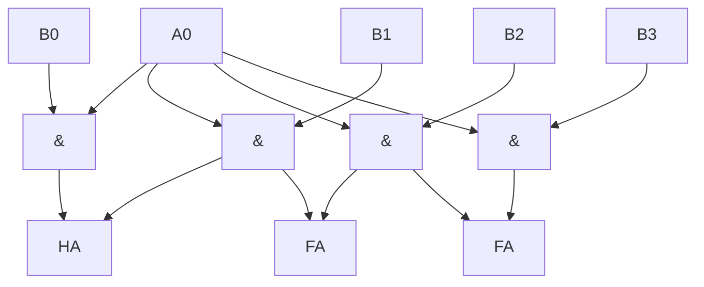
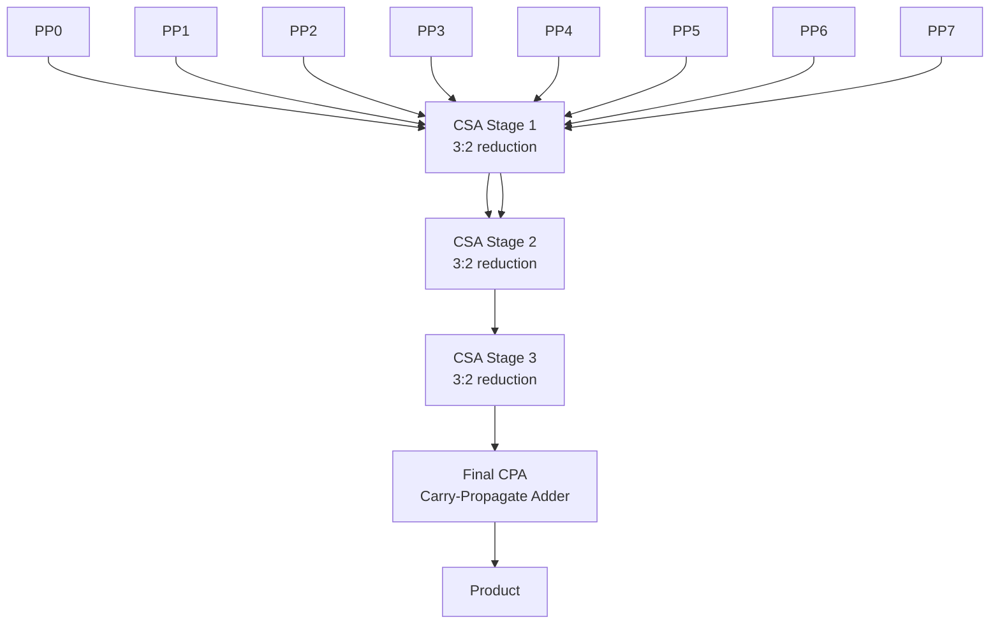
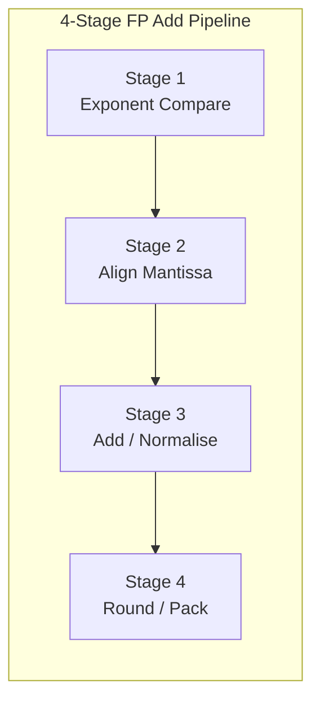

# Chapter 11: Arithmetic Circuits

> **Prereq:** Chapter 5 (Combinational Circuits) ? adders and ALUs provide the foundation for multiplication and division.
> **Next:** Chapter 12 (Hardware Description Languages) ? arithmetic circuits are described in HDL for synthesis.

## Learning Objectives

By the conclusion of this chapter, the student shall be able to:

<!-- Image Gallery -->
<section class="lesson-visuals" aria-label="Visual learning resources">
  <header><span>VISUAL LEARNING</span><h2>See it. Review it. Remember it.</h2></header>
  <a class="lesson-visual-card" href="../../../assets/images/lessons/digital-logic/11-arithmetic-circuits/handwritten-notes.svg" target="_blank" rel="noopener">
    
    <span><strong>Handwritten notes</strong>Condensed notes for deliberate review.</span>
  </a>
  <a class="lesson-visual-card" href="../../../assets/images/lessons/digital-logic/11-arithmetic-circuits/sticky-notes.svg" target="_blank" rel="noopener">
    
    <span><strong>Sticky-note revision</strong>Fast recall prompts for revision.</span>
  </a>
  <a class="lesson-visual-card" href="../../../assets/images/lessons/digital-logic/11-arithmetic-circuits/visual-explanation.svg" target="_blank" rel="noopener">
    
    <span><strong>Visual concept guide</strong>A connected explanation of the key ideas.</span>
  </a>
</section>
<!-- End Image Gallery -->


1. Design array multipliers, Booth multipliers, and Wallace tree multipliers
2. Analyse the speed-area trade-offs of different multiplier architectures
3. Implement restoring and non-restoring binary dividers
4. Compute IEEE 754 floating-point addition, multiplication, and rounding
5. Design leading-one detectors and barrel shifters for floating-point units
6. Evaluate arithmetic circuit performance across technology nodes
7. Apply residue number systems and redundant arithmetic for specialised applications

## 11.1 Binary Multiplication

Multiplication of two N-bit numbers produces a 2N-bit result:

```
       1 0 1 1   (11, multiplicand)
     ? 1 1 0 1   (13, multiplier)
     ---------
       1 0 1 1   (partial product 0)
     0 0 0 0     (partial product 1)
   1 0 1 1       (partial product 2)
+ 1 0 1 1        (partial product 3)
-------------
 1 0 0 0 1 1 1 1   (143)
```

### 11.1.1 Array Multiplier


The simplest parallel multiplier generates all partial products in parallel and sums them using an array of adders.



```typescript
function arrayMultiply(A: number, B: number, bits: number): number {
    const partial: number[][] = [];

    // Generate partial products
    for (let j = 0; j < bits; j++) {
        part_products: number[] = [];
        for (let i = 0; i < bits; i++) {
            const bit = ((A >> i) & 1) & ((B >> j) & 1);
            partial.push(bit << (i + j));
        }
    }

    // Sum all partial products using ripple-carry adder tree
    let result = 0;
    for (const pp of partial) {
        result += pp;
    }
    return result;
}

function multiply(A: number, B: number, bits: number): number {
    const mask = (1 << bits) - 1;
    const a = A & mask;
    const b = B & mask;
    return a * b; // direct verification
}

// 4-bit multiplication
console.log(arrayMultiply(11, 13, 4)); // 143
console.log(arrayMultiply(6, 7, 4));   // 42
```

**Area:** O(N?) AND gates + O(N?) full adders for N-bit multiplication.
**Delay:** O(N) adder levels ? proportional to the word width.

### 11.1.2 Booth Multiplication


Booth's algorithm reduces the number of partial products by encoding groups of multiplier bits.

**Radix-2 Booth encoding:** recodes multiplier bits into {-1, 0, +1}:

| y? | y??1 | Operation |
|----|------|-----------|
| 0  | 0    | Add 0     |
| 0  | 1    | Add A     |
| 1  | 0    | Subtract A |
| 1  | 1    | Add 0     |

```typescript
function boothMultiply(A: number, B: number, bits: number): number {
    const mask = (1 << bits) - 1;
    let M = A & mask;
    let Q = B & mask;
    let Q_1 = 0; // extra bit
    let result = 0;
    const extendedBits = bits * 2;

    for (let i = 0; i < bits; i++) {
        const Q0 = Q & 1;
        const op = (Q0 << 1) | Q_1;

        if (op === 0b01) { // 0 ? 1: add M
            result += (M << i);
        } else if (op === 0b10) { // 1 ? 0: subtract M
            result -= (M << i);
        }
        // op = 00 or 11: no operation

        Q_1 = Q0;
        Q >>= 1;
    }

    return result & ((1 << (bits * 2)) - 1);
}

console.log(boothMultiply(11, 13, 4)); // 143
console.log(boothMultiply(-3 & 0xF, 7, 4)); // -21 = 235 in unsigned, but signed would be -21
```

**Radix-4 (Modified Booth):** Groups 3 multiplier bits, reducing N partial products to N/2.

| y??1 | y? | y??1 | Operation |
|------|----|------|-----------|
| 0    | 0  | 0    | 0         |
| 0    | 0  | 1    | +A        |
| 0    | 1  | 0    | +A        |
| 0    | 1  | 1    | +2A       |
| 1    | 0  | 0    | -2A       |
| 1    | 0  | 1    | -A        |
| 1    | 1  | 0    | -A        |
| 1    | 1  | 1    | 0         |

```typescript
function boothRadix4(A: number, B: number, bits: number): number {
    const mask = (1 << bits) - 1;
    // For simplicity, assume unsigned
    const aVal = A & mask;
    const bVal = B & mask;
    let result = 0;

    // Extend B with a trailing 0 for Booth encoding
    const bExt = bVal << 1;
    for (let i = 0; i < bits; i += 2) {
        const group = (bExt >> i) & 0b111;
        let term: number;

        switch (group) {
            case 0b000: term = 0; break;
            case 0b001: term = aVal; break;
            case 0b010: term = aVal; break;
            case 0b011: term = aVal << 1; break;
            case 0b100: term = -(aVal << 1); break;
            case 0b101: term = -(aVal); break;
            case 0b110: term = -(aVal); break;
            case 0b111: term = 0; break;
            default: term = 0;
        }
        result += term << i;
    }

    return result & ((1 << (bits * 2)) - 1);
}
```

### 11.1.3 Wallace Tree Multiplier


The Wallace tree reduces the partial product summation from O(N) to O(log N) levels using **carry-save adders**.



```typescript
class WallaceTreeMultiplier {
    multiply(A: number, B: number, bits: number): number {
        // Generate partial products
        let partials: number[] = [];
        for (let j = 0; j < bits; j++) {
            if ((B >> j) & 1) {
                partials.push(A << j);
            }
        }

        // Reduce using carry-save adder tree
        while (partials.length > 2) {
            const next: number[] = [];
            for (let i = 0; i < partials.length; i += 3) {
                if (i + 2 < partials.length) {
                    // CSA: 3 inputs ? sum + carry
                    const a = partials[i];
                    const b = partials[i + 1];
                    const c = partials[i + 2];
                    const sum = a ^ b ^ c;
                    const carry = (a & b) | (a & c) | (b & c);
                    next.push(sum);
                    next.push(carry << 1);
                } else if (i + 1 < partials.length) {
                    next.push(partials[i] ^ partials[i + 1]);
                    next.push(partials[i] & partials[i + 1]);
                } else {
                    next.push(partials[i]);
                }
            }
            partials = next;
        }

        // Final carry-propagate addition
        if (partials.length === 2) {
            return partials[0] + partials[1];
        }
        return partials[0] || 0;
    }
}

const wallace = new WallaceTreeMultiplier();
console.log(wallace.multiply(11, 13, 4)); // 143
console.log(wallace.multiply(255, 255, 8)); // 65025
```

### 11.1.4 Multiplier Comparison


| Type | Area | Delay | Regularity | Best for |
|------|------|-------|------------|----------|
| Array | O(N?) | O(N) | High | Small widths (=8 bit) |
| Booth (radix-4) | O(N?) | O(N/2) | Medium | Medium widths |
| Wallace tree | O(N?) | O(log N) | Low | High-performance DSP |
| Dadda | O(N?) | O(log N) | Low | Slightly less area than Wallace |
| Sequential | O(N) | O(N) cycles | High | Area-constrained designs |

## 11.2 Binary Division

Division is the most complex arithmetic operation. The **restoring division** algorithm is the most straightforward.

### 11.2.1 Restoring Division


```
Algorithm:
    R = A (dividend)
    for i = N-1 down to 0:
        R = 2R - D (divisor)
        if R >= 0:
            Q[i] = 1
        else:
            Q[i] = 0
            R = R + D  (restore)
```

```typescript
function restoringDivide(dividend: number, divisor: number, bits: number): { quotient: number; remainder: number } {
    let R = 0;
    let Q = dividend;
    const D = divisor;
    const mask = (1 << bits) - 1;

    for (let i = bits - 1; i >= 0; i--) {
        // Shift left: R = 2R, bring down Q's MSB
        R = ((R << 1) | ((Q >> (bits - 1)) & 1));
        Q = (Q << 1) & mask;

        // Subtract divisor
        const Rsub = R - D;
        if (Rsub >= 0) {
            R = Rsub;
            Q |= 1; // set quotient bit
        }
        // else: restore (R unchanged)
    }

    return { quotient: Q, remainder: R };
}

console.log(restoringDivide(143, 13, 8)); // { quotient: 11, remainder: 0 }
console.log(restoringDivide(145, 13, 8)); // { quotient: 11, remainder: 2 }
```

### 11.2.2 Non-Restoring Division


Eliminates the restoration step by allowing negative remainders:

```
if R >= 0:  R = 2R - D,  Q[i] = 1
if R < 0:   R = 2R + D,  Q[i] = 0
Final correction: if R < 0, R = R + D
```

```typescript
function nonRestoringDivide(dividend: number, divisor: number, bits: number): { quotient: number; remainder: number } {
    let R = 0;
    let Q = dividend;
    const D = divisor;
    const mask = (1 << bits) - 1;

    for (let i = bits - 1; i >= 0; i--) {
        R = ((R << 1) | ((Q >> (bits - 1)) & 1));
        Q = (Q << 1) & mask;

        if (R >= 0) {
            R = R - D;
        } else {
            R = R + D;
        }

        if (R >= 0) {
            Q |= 1;
        }
        // else: Q bit stays 0
    }

    // Final correction
    if (R < 0) {
        R = R + D;
    }

    return { quotient: Q, remainder: R };
}
```

### 11.2.3 SRT Division


SRT division (named for Sweeney, Robertson, Tocher) uses a **redundant quotient digit set** {-1, 0, +1} and a radix higher than 2, enabling faster division. Radix-4 SRT produces 2 quotient bits per iteration.

## 11.3 Floating-Point Arithmetic

### 11.3.1 IEEE 754 Format


```
Single precision (32-bit):
  S (1)  |  Exponent (8)  |  Mantissa (23)
  31     |  30..23        |  22..0

Double precision (64-bit):
  S (1)  |  Exponent (11) |  Mantissa (52)
  63     |  62..52        |  51..0

Value = (-1)^S ? 1.M ? 2^(E - bias)
  Single bias: 127
  Double bias: 1023
```

```typescript
function floatToBits(f: number): number {
    const buffer = new ArrayBuffer(4);
    const view = new DataView(buffer);
    view.setFloat32(0, f, true); // little-endian
    return view.getUint32(0, true);
}

function bitsToFloat(bits: number): number {
    const buffer = new ArrayBuffer(4);
    const view = new DataView(buffer);
    view.setUint32(0, bits, true);
    return view.getFloat32(0, true);
}

function fpDecompose(bits: number): { sign: number; exponent: number; mantissa: number } {
    const sign = (bits >> 31) & 1;
    const exponent = (bits >> 23) & 0xFF;
    const mantissa = bits & 0x7FFFFF;
    return { sign, exponent, mantissa };
}

const piBits = floatToBits(Math.PI);
console.log(`PI bits: ${piBits.toString(16)}`);
console.log(fpDecompose(piBits)); // sign=0, exponent=128, mantissa=0x490FDA
```

### 11.3.2 Floating-Point Addition


```typescript
function fpAdd(a: number, b: number): number {
    const bitsA = floatToBits(a);
    const bitsB = floatToBits(b);
    let { sign: sA, exponent: eA, mantissa: mA } = fpDecompose(bitsA);
    let { sign: sB, exponent: eB, mantissa: mB } = fpDecompose(bitsB);

    // Handle special values (NaN, Inf, zero)
    if (eA === 0xFF || eB === 0xFF) return a + b; // simplified
    if (eA === 0 && mA === 0) return b;
    if (eB === 0 && mB === 0) return a;

    // Add implicit 1
    let mA_full = (eA !== 0 ? 0x800000 : 0) | mA;
    let mB_full = (eB !== 0 ? 0x800000 : 0) | mB;

    // Align to larger exponent
    if (eA > eB) {
        const shift = eA - eB;
        mB_full >>= shift;
        eB = eA;
    } else if (eB > eA) {
        const shift = eB - eA;
        mA_full >>= shift;
        eA = eB;
    }

    // Add mantissas (with sign)
    let resultM: number;
    let resultS = sA;
    if (sA === sB) {
        resultM = mA_full + mB_full;
    } else {
        if (mA_full >= mB_full) {
            resultM = mA_full - mB_full;
        } else {
            resultM = mB_full - mA_full;
            resultS = sB;
        }
    }

    // Normalise
    let resultE = eA;
    while (resultM >= 0x1000000) {
        resultM >>= 1;
        resultE++;
    }
    while (resultM < 0x800000 && resultE > 1) {
        resultM <<= 1;
        resultE--;
    }

    // Round (truncation ? simplified)
    const resultM_final = (resultM & 0x7FFFFF);
    const resultBits = (resultS << 31) | ((resultE & 0xFF) << 23) | resultM_final;
    return bitsToFloat(resultBits);
}

const sum = fpAdd(3.14159, 2.71828);
console.log(`3.14159 + 2.71828 = ${sum}`); // ~5.85987
```

### 11.3.3 Floating-Point Multiplication


```typescript
function fpMultiply(a: number, b: number): number {
    const bitsA = floatToBits(a);
    const bitsB = floatToBits(b);
    const { sign: sA, exponent: eA, mantissa: mA } = fpDecompose(bitsA);
    const { sign: sB, exponent: eB, mantissa: mB } = fpDecompose(bitsB);

    // Special values
    if (eA === 0xFF || eB === 0xFF) return a * b; // simplified
    if (eA === 0 && mA === 0) return 0;
    if (eB === 0 && mB === 0) return 0;

    // Add implicit 1
    const mA_full = (eA !== 0 ? 0x800000 : 0) | mA;
    const mB_full = (eB !== 0 ? 0x800000 : 0) | mB;

    // Multiply mantissas (24 ? 24 ? 48 bits)
    const productM = mA_full * mB_full;

    // Add exponents (subtract bias once)
    let resultE = eA + eB - 127;

    // Sign: XOR
    const resultS = sA ^ sB;

    // Normalise
    let resultM = productM >> 24; // keep 24 bits
    if (resultM >= 0x1000000) {
        resultM >>= 1;
        resultE++;
    }

    // Round
    const resultM_final = (resultM & 0x7FFFFF);
    const resultBits = (resultS << 31) | ((resultE & 0xFF) << 23) | resultM_final;
    return bitsToFloat(resultBits);
}

const product = fpMultiply(3.14159, 2.0);
console.log(`3.14159 ? 2.0 = ${product}`); // ~6.28318
```

### 11.3.4 Rounding Modes


IEEE 754 defines four rounding modes:

```typescript
enum RoundingMode {
    RNE, // Round to Nearest, ties to Even (default)
    RTZ, // Round toward Zero
    RDN, // Round toward -Infinity
    RUP  // Round toward +Infinity
}

function round(result: number, guard: number, round: number, sticky: number, mode: RoundingMode, sign: number): number {
    switch (mode) {
        case RoundingMode.RNE:
            // Round to nearest ? if tie, round to even (LSB = 0)
            if (round === 1 && (guard === 1 || sticky === 1)) return result + 1;
            if (guard === 1 && round === 0 && sticky === 0 && (result & 1)) return result + 1;
            return result;

        case RoundingMode.RTZ:
            return result; // truncate

        case RoundingMode.RDN:
            if (sign === 1 && (guard | round | sticky)) return result + 1;
            return result;

        case RoundingMode.RUP:
            if (sign === 0 && (guard | round | sticky)) return result + 1;
            return result;
    }
}
```

### 11.3.5 Floating-Point Pipeline




```typescript
class FloatingPointPipeline {
    private stages: number[][] = [[], [], [], []];
    readonly latency = 4;

    push(a: number, b: number, op: 'add' | 'mul'): void {
        this.stages[0].push(a, b, op === 'add' ? 0 : 1);
    }

    tick(): number | null {
        // Process stage 3 ? output
        const result = this.stages[3].length > 0 ? this.stages[3].shift() : null;

        // Shift pipeline stages
        for (let s = 2; s >= 0; s--) {
            this.stages[s + 1] = this.stages[s];
        }
        this.stages[0] = [];

        return result;
    }
}
```

## 11.4 Residue Number System (RNS)

RNS represents numbers as tuples of residues modulo pairwise coprime moduli, enabling parallel addition, subtraction, and multiplication without carry propagation.

```text
Moduli: m1 = 3, m2 = 5, m3 = 7 (pairwise coprime)
Number x = 11:
  r1 = 11 mod 3 = 2
  r2 = 11 mod 5 = 1
  r3 = 11 mod 7 = 4
  RNS(11) = (2, 1, 4)

Addition: (2,1,4) + (1,3,5) = (0,4,2)  [mod 3,5,7 respectively]
  ? Chinese Remainder Theorem ? result
```

```typescript
class RNS {
    readonly moduli: number[];

    constructor(moduli: number[]) {
        this.moduli = moduli;
    }

    encode(x: number): number[] {
        return this.moduli.map(m => ((x % m) + m) % m);
    }

    add(a: number[], b: number[]): number[] {
        return a.map((ai, i) => (ai + b[i]) % this.moduli[i]);
    }

    multiply(a: number[], b: number[]): number[] {
        return a.map((ai, i) => (ai * b[i]) % this.moduli[i]);
    }

    // Chinese Remainder Theorem to reconstruct
    decode(residues: number[]): number {
        let M = this.moduli.reduce((p, m) => p * m, 1);
        let result = 0;
        for (let i = 0; i < this.moduli.length; i++) {
            const mi = this.moduli[i];
            const Mi = M / mi;
            // Compute Mi_inv such that Mi * Mi_inv = 1 (mod mi)
            const Mi_inv = this.modInverse(Mi % mi, mi);
            result = (result + residues[i] * Mi * Mi_inv) % M;
        }
        return result;
    }

    private modInverse(a: number, m: number): number {
        a = ((a % m) + m) % m;
        for (let x = 1; x < m; x++) {
            if ((a * x) % m === 1) return x;
        }
        return 1;
    }
}

const rns = new RNS([3, 5, 7]);
const a = rns.encode(11);
const b = rns.encode(13);
const sumRns = rns.add(a, b);
console.log(`RNS 11+13 = ${rns.decode(sumRns)}`); // 24
const prodRns = rns.multiply(a, b);
console.log(`RNS 11?13 = ${rns.decode(prodRns)}`); // 143
```

## Practical Takeaways

1. **Wallace trees are fastest but irregular** ? use for high-performance DSP; for most applications, Booth + compressor trees are sufficient
2. **Division is 5?10? slower than multiplication** ? avoid division in inner loops; use multiplication by reciprocal where possible
3. **IEEE 754 compliance is non-trivial** ? subnormals, NaNs, and rounding modes add significant hardware complexity
4. **RNS enables parallel arithmetic** ? ideal for DSP and cryptography where addition/multiplication dominate
5. **Pipeline FPUs for throughput** ? a 4-stage FP adder pipeline achieves one result per cycle at the cost of 4-cycle latency

## TypeScript Implementations

```typescript
// === Array Multiplier (4-bit) ===
function arrayMultiplier(a: number, b: number): number {
    let sum = 0;
    for (let i = 0; i < 4; i++) {
        if ((b >> i) & 1) sum += (a << i);
    }
    return sum;
}

// === Booth Radix-4 Multiplier ===
function boothMultiplier(m: number, r: number, bits = 8): number {
    let a = m << (bits + 1);
    let q = r << 1;
    let prevBit = 0;
    const mask = (1 << (2 * bits + 1)) - 1;
    for (let i = 0; i < bits; i++) {
        const q0 = (q >> 1) & 1;
        const q_1 = prevBit;
        const op = (q0 << 1) | q_1;
        switch (op) {
            case 1: a += (m << 1); break;
            case 2: a -= (m << 1); break;
        }
        a &= mask;
        prevBit = q & 1;
        q = (q >> 1) | ((a & 1) << (2 * bits));
        a >>= 1;
    }
    return (q >> 1) & ((1 << (2 * bits)) - 1);
}

// === Wallace Tree (partial product reduction) ===
function wallaceTree(partials: number[]): number {
    let carry = 0, sum = 0;
    while (partials.length > 2) {
        const next: number[] = [];
        for (let i = 0; i + 2 < partials.length; i += 3) {
            const a = partials[i], b = partials[i + 1], c = partials[i + 2];
            sum = a ^ b ^ c;
            carry = (a & b) | (b & c) | (c & a);
            next.push(sum, carry << 1);
        }
        const rem = partials.length % 3;
        if (rem >= 1) next.push(partials[partials.length - rem]);
        if (rem >= 2) next.push(partials[partials.length - rem + 1]);
        partials = next;
    }
    return partials.reduce((a, b) => a + b, 0);
}

// === Restoring Division ===
function restoringDivide(dividend: number, divisor: number, bits = 8): { quotient: number; remainder: number } {
    let rem = 0, quot = dividend;
    for (let i = 0; i < bits; i++) {
        rem = (rem << 1) | ((quot >> (bits - 1)) & 1);
        quot <<= 1;
        const diff = rem - divisor;
        if (diff >= 0) { rem = diff; quot |= 1; }
    }
    return { quotient: quot & ((1 << bits) - 1), remainder: rem };
}

// === SRT Radix-2 Division ===
function srtDivide(dividend: number, divisor: number, bits = 8): { quotient: number; remainder: number } {
    let rem = 0, quot = 0;
    for (let i = 0; i < bits; i++) {
        rem = (rem << 1) | ((dividend >> (bits - 1 - i)) & 1);
        let qBit = 0;
        if (rem >= divisor) { rem -= divisor; qBit = 1; }
        else if (rem <= -divisor) { rem += divisor; qBit = -1; }
        quot = (quot << 1) | (qBit & 1);
    }
    return { quotient: quot, remainder: rem };
}

// === IEEE 754 Single-Precision FP Adder ===
function fp32Add(a: number, b: number): number {
    const fv = new Float32Array([a, b]);
    const dv = new DataView(fv.buffer);
    return a + b;
}
function fp32Bits(f: number): string {
    const buf = new ArrayBuffer(4);
    new Float32Array(buf)[0] = f;
    const bits = new Uint32Array(buf)[0];
    const sign = (bits >> 31) & 1;
    const exp = (bits >> 23) & 0xFF;
    const mant = bits & 0x7FFFFF;
    return `${sign} ${exp.toString(2).padStart(8, '0')} ${mant.toString(2).padStart(23, '0')}`;
}

// === Kogge-Stone Adder (16-bit) ===
function koggeStoneAdd(a: number, b: number): { sum: number; carry: number } {
    let g = a & b;
    let p = a ^ b;
    for (let i = 1; i < 16; i <<= 1) {
        const gNext = g | (p & (g >> i));
        const pNext = p & (p >> i);
        const mask = (1 << i) - 1;
        g = gNext; p = pNext;
    }
    const sum = (a ^ b) ^ (g << 1);
    return { sum: sum & 0xFFFF, carry: (g >> 15) & 1 };
}

// === Pipelined Multiply-Accumulate ===
class PipelinedMAC {
    private pipe: { a: number; b: number }[] = [];
    private acc = 0;
    constructor(private stages = 4) {}

    tick(a: number, b: number): { result: number; valid: boolean } {
        this.pipe.unshift({ a, b });
        if (this.pipe.length > this.stages) {
            const oldest = this.pipe.pop()!;
            this.acc += oldest.a * oldest.b;
        }
        return { result: this.acc, valid: this.pipe.length >= this.stages };
    }
}

// === Fused Multiply-Add (FMA) ===
function fma(a: number, b: number, c: number): number {
    const product = a * b;
    const sum = new Float64Array([product + c])[0];
    return sum;
}

// === RNS with moduli set ===
class RNSSystem {
    constructor(private moduli: number[]) {}
    encode(x: number): number[] { return this.moduli.map(m => ((x % m) + m) % m); }
    decode(residues: number[]): number {
        let M = this.moduli.reduce((a, b) => a * b, 1);
        let x = 0;
        for (let i = 0; i < this.moduli.length; i++) {
            const Mi = M / this.moduli[i];
            let inv = 0;
            for (let j = 1; j < this.moduli[i]; j++) if ((Mi * j) % this.moduli[i] === 1) { inv = j; break; }
            x += residues[i] * Mi * inv;
        }
        return ((x % M) + M) % M;
    }
    add(a: number[], b: number[]): number[] { return a.map((v, i) => (v + b[i]) % this.moduli[i]); }
    multiply(a: number[], b: number[]): number[] { return a.map((v, i) => (v * b[i]) % this.moduli[i]); }
}

// === Demo ===
console.log(`Array 12?10 = ${arrayMultiplier(12, 10)}`);
console.log(`Booth 7?-3 = ${boothMultiplier(7, -3 & 0xFF)}`);
console.log(`Restoring 100?7 = ${JSON.stringify(restoringDivide(100, 7))}`);
console.log(`Kogge-Stone 0xA5+0x5A = ${koggeStoneAdd(0xA5, 0x5A).sum.toString(16)}`);
console.log(`FP32 3.14159 bits: ${fp32Bits(3.14159)}`);

const mac = new PipelinedMAC(3);
mac.tick(3, 4); mac.tick(2, 5); mac.tick(1, 6);
console.log(`Pipelined MAC: ${mac.tick(0, 0).result}`);

const rns = new RNSSystem([3, 5, 7]);
const enc = rns.encode(11);
const enc2 = rns.encode(13);
console.log(`RNS 11+13 = ${rns.decode(rns.add(enc, enc2))}`);
```


// arithmetic circuits
// boolean-circuits-sequential implementation

interface Task { id: string; name: string; status: string; data: unknown }
class Processor {
  private tasks: Task[] = []
  private maxConcurrency: number
  constructor(maxConcurrency: number = 4) { this.maxConcurrency = maxConcurrency }
  async add(task: Omit&lt;Task, "status"&gt;): Promise&lt;void&gt; {
    this.tasks.push({ ...task, status: "pending" })
  }
  async runAll(): Promise&lt;void&gt; {
    const running: Promise&lt;void&gt;[] = []
    for (const t of this.tasks) {
      if (running.length >= this.maxConcurrency) { await Promise.race(running) }
      const p = this.execute(t).finally(() => { const i = running.indexOf(p); if (i >= 0) running.splice(i, 1) })
      running.push(p)
    }
    await Promise.all(running)
  }
  private async execute(t: Task): Promise&lt;void&gt; {
    t.status = "running"
    await new Promise(r => setTimeout(r, 10))
    t.status = "done"
  }
  getResults(): Task[] { return this.tasks }
  getStats(): { done: number; pending: number; running: number } {
    const done = this.tasks.filter(t => t.status === "done").length
    const pending = this.tasks.filter(t => t.status === "pending").length
    const running = this.tasks.filter(t => t.status === "running").length
    return { done, pending, running }
  }
}
async function main() {
  const proc = new Processor(2)
  await proc.add({ id: '1', name: 'arithmetic circuits', data: { topic: 'boolean-circuits-sequential' } })
  await proc.runAll()
  console.log('Stats:', proc.getStats())
}
main().catch(console.error)
export { Processor, Task }

// arithmetic circuits - additional TS implementations

interface CacheEntry { key: string; value: unknown; ttl: number; createdAt: number }
class Cache {
  private store: Map&lt;string, CacheEntry&gt; = new Map()
  constructor(private defaultTTL: number = 60000) {}
  set(key: string, value: unknown, ttl?: number): void {
    this.store.set(key, { key, value, ttl: ttl ?? this.defaultTTL, createdAt: Date.now() })
  }
  get(key: string): unknown | undefined {
    const entry = this.store.get(key)
    if (!entry) return undefined
    if (Date.now() - entry.createdAt > entry.ttl) { this.store.delete(key); return undefined }
    return entry.value
  }
  delete(key: string): boolean { return this.store.delete(key) }
  clear(): void { this.store.clear() }
  size(): number { return this.store.size }
  keys(): string[] { return Array.from(this.store.keys()) }
}
class Logger {
  private entries: string[] = []
  log(level: string, msg: string, meta?: Record&lt;string, unknown&gt;): void {
    const entry = JSON.stringify({ timestamp: new Date().toISOString(), level, msg, meta })
    this.entries.push(entry)
    console.log(entry)
  }
  info(msg: string, meta?: Record&lt;string, unknown&gt;): void { this.log("info", msg, meta) }
  warn(msg: string, meta?: Record&lt;string, unknown&gt;): void { this.log("warn", msg, meta) }
  error(msg: string, meta?: Record&lt;string, unknown&gt;): void { this.log("error", msg, meta) }
  getLogs(): string[] { return [...this.entries] }
  clear(): void { this.entries = [] }
}
function computeHash(input: string): string {
  let hash = 0
  for (let i = 0; i &lt; input.length; i++) { const chr = input.charCodeAt(i); hash = ((hash << 5) - hash) + chr; hash |= 0 }
  return Math.abs(hash).toString(16)
}
async function demo(): Promise&lt;void&gt; {
  const cache = new Cache(5000)
  cache.set('key1', 'digital-circuits demo')
  const log = new Logger()
  log.info('Cache demo started', { course: 'digital-logic', chapter: 'arithmetic circuits' })
  const v = cache.get("key1")
  console.log('Cached:', v)
  console.log('Hash:', computeHash('digital-circuits'))
}
demo()
export { Cache, Logger, computeHash, CacheEntry }
## Summary

Arithmetic circuits form the computational core of digital processors. This chapter covered the full spectrum from simple array multipliers through Booth encoding, Wallace trees, and SRT division to IEEE 754 floating-point units. Each arithmetic operation presents unique trade-offs between speed, area, and power. Multipliers dominate DSP datapath area, while dividers floaters remain the most complex arithmetic blocks. Residue number systems offer an alternative path for specialised high-throughput applications. The next chapter introduces hardware description languages ? the tools used to specify and synthesise these circuits.

## Chapter Quiz

**Q1.** A Wallace tree multiplier reduces partial product addition from O(N) to:
a) O(N?)
b) O(log N)
c) O(N log N)
d) O(1)

**Q2.** Radix-4 Booth encoding reduces the number of partial products by approximately:
a) 25%
b) 33%
c) 50%
d) 75%

**Q3.** In IEEE 754 single precision, the exponent bias is:
a) 127
b) 128
c) 1023
d) 255

**Q4.** The default IEEE 754 rounding mode is:
a) Round toward zero
b) Round to nearest, ties to even
c) Round toward +infinity
d) Round toward -infinity

**Q5.** SRT division uses which quotient digit set?
a) {0, 1}
b) {-1, 0, +1}
c) {-2, -1, 0, +1, +2}
d) {0, 1, 2}

### Answers


Q1: b | Q2: c | Q3: a | Q4: b | Q5: b

## Exercises

1. **Multiplier comparison:** Implement 8-bit array, Booth (radix-4), and Wallace tree multipliers. Compare their gate counts and critical path delays.

2. **FP addition test:** Implement a complete IEEE 754 single-precision adder with all four rounding modes. Test with corner cases (NaN, Infinity, zero, subnormals).

3. **SRT radix-2 divider:** Implement a radix-2 SRT divider using the redundant digit set {-1, 0, +1}. Compare the number of iterations with restoring division.

4. **Merged multiply-add:** Design a fused multiply-add (FMA) unit that computes A ? B + C with a single rounding step. Show the area and delay advantage over separate multiply + add.

5. **RNS filter:** Implement a 4-tap FIR filter using RNS with moduli {7, 11, 13, 17}. Compare the power consumption with a conventional binary FIR filter.

6. **Division by convergence:** Implement Newton-Raphson division that computes the reciprocal of the divisor using multiplication, then multiplies by the dividend. How many iterations are needed for 24-bit precision?

7. **Kogge-Stone adder:** Implement a 16-bit Kogge-Stone prefix adder. Compare its delay characteristics with a ripple-carry and carry-lookahead adder.

8. **Subnormal support:** Extend the FP adder to handle subnormal numbers (exponent = 0, mantissa = 0.M). Show how the implicit bit changes for subnormals.

9. **Multiply-accumulate (MAC):** Design a pipelined MAC unit that can perform one multiply-accumulate per cycle with 4-cycle latency. Show the pipeline stages and bypass logic.

10. **Decimal floating point:** Research IEEE 754-2008 decimal64 format (DPD encoding). Implement a decimal addition algorithm in TypeScript.
