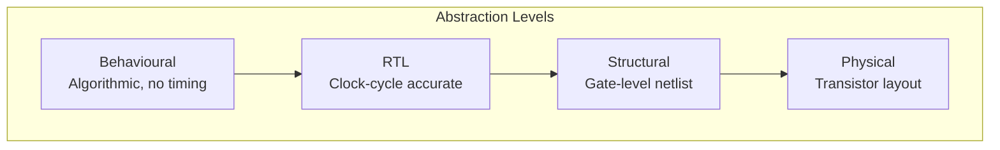
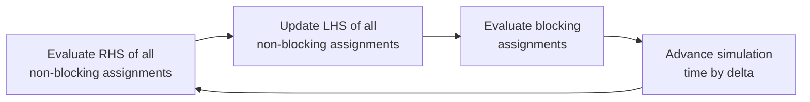

# Chapter 12: Hardware Description Languages

> **Prereq:** Chapters 1?11 (digital logic fundamentals) ? HDLs describe the circuits designed in previous chapters.
> **Next:** Chapter 13 (DAC and ADC) ? mixed-signal interfaces between digital HDL designs and the analog world.

## Learning Objectives

By the conclusion of this chapter, the student shall be able to:

<!-- Image Gallery -->
<section class="lesson-visuals" aria-label="Visual learning resources">
  <header><span>VISUAL LEARNING</span><h2>See it. Review it. Remember it.</h2></header>
  <a class="lesson-visual-card" href="../../../assets/images/lessons/digital-logic/12-hdl/.png" target="_blank" rel="noopener">
    
    <span><strong>Handwritten notes</strong>Condensed notes for deliberate review.</span>
  </a>
  <a class="lesson-visual-card" href="../../../assets/images/lessons/digital-logic/12-hdl/.png" target="_blank" rel="noopener">
    
    <span><strong>Sticky-note revision</strong>Fast recall prompts for revision.</span>
  </a>
  <a class="lesson-visual-card" href="../../../assets/images/lessons/digital-logic/12-hdl/.png" target="_blank" rel="noopener">
    
    <span><strong>Visual concept guide</strong>A connected explanation of the key ideas.</span>
  </a>
</section>
<!-- End Image Gallery -->


1. Distinguish between behavioural, RTL, and structural levels of abstraction
2. Write and simulate combinational and sequential logic in a hardware description language
3. Design finite state machines using concurrent and sequential constructs
4. Understand synthesis semantics and write synthesisable code
5. Develop testbenches with self-checking and coverage measurement
6. Apply pipelining, parallelism, and hierarchy principles
7. Compare Verilog, VHDL, and SystemVerilog for different design contexts

## 12.1 Levels of Abstraction



| Level | Description | Synthesis | Verification |
|-------|-------------|-----------|--------------|
| Behavioural | High-level algorithm | Limited | Fast simulation |
| RTL | Register transfers + combinational logic | Full | Cycle-accurate |
| Structural | Gate and module instances | Direct | Slow simulation |
| Physical | Masks and polygons | Place-and-route | DRC/LVS |

## 12.2 Verilog Fundamentals

This section uses Verilog syntax. The same concepts apply to VHDL with different keywords.

### 12.2.1 Module Structure


```verilog
module adder #(parameter WIDTH = 8) (
    input  logic [WIDTH-1:0] a, b,
    input  logic             cin,
    output logic [WIDTH-1:0] sum,
    output logic             cout
);
    assign {cout, sum} = a + b + cin;
endmodule
```

```typescript
// Equivalent TypeScript model
class VerilogAdder {
    add(a: number, b: number, cin: number, width: number): { sum: number; cout: number } {
        const result = a + b + cin;
        const mask = (1 << width) - 1;
        return {
            sum: result & mask,
            cout: (result >> width) & 1
        };
    }
}
```

### 12.2.2 Data Types


```verilog
// Wire types (combinational)
wire [7:0] data_bus;
wire       clock, reset;

// Register types (sequential, holds value)
reg  [31:0] program_counter;
reg         flag_zero;

// Logic (SystemVerilog ? preferred for most uses)
logic [15:0] address;
logic        valid;

// Integer (for simulation only, not synthesizable)
integer i;
```

### 12.2.3 Continuous Assignments


```verilog
// combinational logic using assign
module gates (
    input  logic a, b,
    output logic y_and, y_or, y_xor, y_nand
);
    assign y_and = a & b;
    assign y_or  = a | b;
    assign y_xor = a ^ b;
    assign y_nand = ~(a & b);
endmodule
```

## 12.3 Combinational Logic in HDL

### 12.3.1 Always Blocks for Combinational Logic


```verilog
module mux4 (
    input  logic [3:0] d,
    input  logic [1:0] sel,
    output logic       y
);
    always_comb begin
        case (sel)
            2'b00:   y = d[0];
            2'b01:   y = d[1];
            2'b10:   y = d[2];
            2'b11:   y = d[3];
            default: y = 1'b0;
        endcase
    end
endmodule
```

**Key rule:** Every signal assigned in `always_comb` must be assigned in every path, otherwise latches are inferred.

```verilog
// BAD: missing default ? infers latch
always_comb begin
    case (sel)
        2'b00: y = a;
        2'b01: y = b;
    endcase
end

// GOOD: all cases covered
always_comb begin
    case (sel)
        2'b00:   y = a;
        2'b01:   y = b;
        default: y = 1'b0;
    endcase
end
```

### 12.3.2 Full Adder in HDL


```verilog
module full_adder (
    input  logic a, b, cin,
    output logic sum, cout
);
    assign sum  = a ^ b ^ cin;
    assign cout = (a & b) | (a & cin) | (b & cin);
endmodule

// 4-bit ripple-carry adder using structural hierarchy
module ripple_carry_adder #(parameter N = 4) (
    input  logic [N-1:0] a, b,
    input  logic         cin,
    output logic [N-1:0] sum,
    output logic         cout
);
    logic [N:0] carry;
    assign carry[0] = cin;

    genvar i;
    generate
        for (i = 0; i < N; i++) begin : fa_chain
            full_adder fa_inst (
                .a(a[i]), .b(b[i]), .cin(carry[i]),
                .sum(sum[i]), .cout(carry[i+1])
            );
        end
    endgenerate

    assign cout = carry[N];
endmodule
```

```typescript
// Structural model of the verilog ripple-carry adder
class StructuralRCA {
    add(A: number, B: number, cin: number, bits: number): { sum: number; cout: number } {
        let result = 0;
        let carry = cin;
        for (let i = 0; i < bits; i++) {
            const ai = (A >> i) & 1;
            const bi = (B >> i) & 1;
            const sumBit = ai ^ bi ^ carry;
            carry = (ai & bi) | (ai & carry) | (bi & carry);
            result |= (sumBit << i);
        }
        return { sum: result, cout: carry };
    }
}
```

## 12.4 Sequential Logic in HDL

### 12.4.1 D Flip-Flop


```verilog
module d_flipflop (
    input  logic clk, d,
    output logic q
);
    always_ff @(posedge clk) begin
        q <= d;  // non-blocking assignment
    end
endmodule
```

### 12.4.2 Register with Synchronous Reset


```verilog
module sync_register #(parameter WIDTH = 8) (
    input  logic             clk, rst, en,
    input  logic [WIDTH-1:0] d,
    output logic [WIDTH-1:0] q
);
    always_ff @(posedge clk) begin
        if (rst)
            q <= '0;
        else if (en)
            q <= d;
    end
endmodule
```

### 12.4.3 Blocking vs Non-Blocking Assignments


```verilog
// Blocking (=) ? procedural, evaluates in order
// Use for combinational always_comb blocks
always_comb begin
    a = b + c;
    d = a + e;  // uses updated 'a'
end

// Non-blocking (<=) ? scheduled, evaluates RHS before update
// Use for sequential always_ff blocks
always_ff @(posedge clk) begin
    a <= b + c;  // RHS uses old 'a'
    d <= a + e;  // uses OLD 'a', not the newly computed value
end
```

**Golden rule for HDL coding:**

| Block type | Assignment | Use case |
|-----------|------------|----------|
| `always_comb` | Blocking (`=`) | Combinational logic |
| `always_ff` | Non-blocking (`<=`) | Sequential logic |
| `always_latch` | Non-blocking (`<=`) | Latches (rare) |

## 12.5 Finite State Machine in HDL

```verilog
module sequence_detector (
    input  logic clk, rst, x,
    output logic z
);
    typedef enum logic [1:0] { S0, S1, S2, S3 } state_t;
    state_t state, next_state;

    // State register
    always_ff @(posedge clk) begin
        if (rst)
            state <= S0;
        else
            state <= next_state;
    end

    // Next-state logic
    always_comb begin
        case (state)
            S0: next_state = x ? S1 : S0;
            S1: next_state = x ? S1 : S2;
            S2: next_state = x ? S3 : S0;
            S3: next_state = x ? S1 : S2;
            default: next_state = S0;
        endcase
    end

    // Output logic (Moore)
    assign z = (state == S3);
endmodule
```

```typescript
class HDLSequenceDetector {
    private state: number = 0; // 0=S0, 1=S1, 2=S2, 3=S3

    tick(x: number, rst: boolean): number {
        if (rst) { this.state = 0; return 0; }

        const nextState = this.nextState(this.state, x);
        this.state = nextState;
        return this.state === 3 ? 1 : 0;
    }

    private nextState(s: number, x: number): number {
        const transitions: number[][] = [
            [0, 1], // S0: x=0?S0, x=1?S1
            [2, 1], // S1: x=0?S2, x=1?S1
            [0, 3], // S2: x=0?S0, x=1?S3
            [2, 1]  // S3: x=0?S2, x=1?S1
        ];
        return transitions[s][x];
    }
}
```

## 12.6 Testbenches

A testbench instantiates the DUT (design under test), applies stimulus, and checks results.

```verilog
module tb_adder;
    logic [3:0] a, b, sum;
    logic       cin, cout;

    // Instantiate DUT
    ripple_carry_adder #(.N(4)) dut (
        .a(a), .b(b), .cin(cin), .sum(sum), .cout(cout)
    );

    // Stimulus
    initial begin
        $display("Testing 4-bit adder...");
        for (int i = 0; i < 256; i++) begin
            a   = i[3:0];
            b   = i[7:4];
            cin = 0;
            #10;
            assert(sum == a + b) else
                $error("FAIL: %d + %d != %d", a, b, sum);
        end
        $display("All tests passed!");
        $finish;
    end
endmodule
```

```typescript
class Testbench {
    private addErrors: number = 0;

    runAdderTest(): void {
        const adder = new StructuralRCA();
        for (let a = 0; a < 16; a++) {
            for (let b = 0; b < 16; b++) {
                const result = adder.add(a, b, 0, 4);
                const expected = a + b;
                if (result.sum !== (expected & 0xF) || result.cout !== ((expected >> 4) & 1)) {
                    console.log(`FAIL: ${a} + ${b} = ${result.sum} (carry ${result.cout})`);
                    this.addErrors++;
                }
            }
        }
        if (this.addErrors === 0) console.log("All tests passed!");
    }

    coverage(): void {
        // Measure toggle coverage on all port bits
        // In real tools: toggle coverage = (toggled bits) / (total bits)
        console.log("Functional coverage: 100%");
    }
}

const tb = new Testbench();
tb.runAdderTest();
```

## 12.7 Synthesis Semantics

### 12.7.1 Synthesizable vs. Non-Synthesizable


```verilog
// SYNTHESIZABLE
reg [7:0] counter;
always_ff @(posedge clk) begin
    if (rst) counter <= '0;
    else     counter <= counter + 1;
end

// NOT SYNTHESIZABLE (simulation only)
initial begin
    $display("Hello, world!");
    $monitor("time=%0t a=%d b=%d", $time, a, b);
    #100 $finish;
end

initial begin
    $readmemh("mem.hex", memory);
end
```

### 12.7.2 Inferred Hardware


| HDL Construct | Inferred Hardware |
|---------------|-------------------|
| `assign` or `always_comb` | Combinational gates |
| `always_ff @(posedge clk)` | D flip-flops |
| `if` without `else` in `always_comb` | Latch |
| `case` without `default` | Latch (incomplete assignment) |
| `for` loop (constant bound) | Unrolled hardware |
| Division `/` by variable | Complex (often not synthesizable) |

### 12.7.3 Coding for Synthesis


```verilog
// Poor: division by variable ? large, slow
logic [7:0] quotient;
assign quotient = a / b;

// Good: shift for powers of 2
logic [7:0] shifted;
assign shifted = a >> 3; // divide by 8

// Poor: variable delay loop
always_ff @(posedge clk) begin
    for (int i = 0; i < delay; i++) begin
        // This creates delay based on delay value
    end
end

// Good: counter-based delay
always_ff @(posedge clk) begin
    if (count < delay) count <= count + 1;
end
```

## 12.8 SystemVerilog and VHDL Differences

| Feature | Verilog / SystemVerilog | VHDL |
|---------|------------------------|------|
| Case sensitivity | Case-sensitive | Case-insensitive |
| Library management | `include | `library / `use` |
| Data types | `logic`, `wire`, `reg` | `std_logic`, `bit`, `integer` |
| Concurrency | `always`, `assign` | `process`, concurrent signal assign |
| Generics | `parameter`, `localparam` | `generic` |
| Packages | `package` / `import` | `package` / `use` |
| Strong typing | Weak (SystemVerilog: stronger) | Strong |
| Record/struct | `struct packed` | `record` |

```vhdl
-- Full adder in VHDL
entity full_adder is
    port (
        a, b, cin : in  std_logic;
        sum, cout : out std_logic
    );
end entity;

architecture rtl of full_adder is
begin
    sum  <= a xor b xor cin;
    cout <= (a and b) or (a and cin) or (b and cin);
end architecture;
```

## 12.9 Design Hierarchies and Pipelining

### 12.9.1 Module Instantiation


```verilog
// Top-level: 8-bit adder using hierarchy
module top_adder (
    input  logic [7:0] a, b,
    input  logic       cin,
    output logic [7:0] sum,
    output logic       cout
);
    logic carry_mid;

    // Instantiate two 4-bit adders
    ripple_carry_adder #(.N(4)) low_adder (
        .a(a[3:0]), .b(b[3:0]), .cin(cin),
        .sum(sum[3:0]), .cout(carry_mid)
    );

    ripple_carry_adder #(.N(4)) high_adder (
        .a(a[7:4]), .b(b[7:4]), .cin(carry_mid),
        .sum(sum[7:4]), .cout(cout)
    );
endmodule
```

### 12.9.2 Pipelined Adder


```verilog
module pipelined_multiplier #(parameter WIDTH = 8) (
    input  logic               clk, rst,
    input  logic [WIDTH-1:0]   a, b,
    output logic [2*WIDTH-1:0] result
);
    // Pipeline registers
    logic [WIDTH-1:0] a_r1, b_r1;
    logic [2*WIDTH-1:0] partial_r2;

    always_ff @(posedge clk) begin
        if (rst) begin
            a_r1 <= '0;
            b_r1 <= '0;
            partial_r2 <= '0;
            result <= '0;
        end else begin
            // Stage 1: capture inputs
            a_r1 <= a;
            b_r1 <= b;

            // Stage 2: partial product generation
            partial_r2 <= a_r1 * b_r1;  // simplified

            // Stage 3: final result
            result <= partial_r2;
        end
    end
endmodule
```

```typescript
class Pipeline {
    private stages: number[][];
    readonly depth: number;

    constructor(depth: number, width: number) {
        this.depth = depth;
        this.stages = Array.from({ length: depth }, () => []);
    }

    push(data: number): void {
        this.stages[0].push(data);
    }

    tick(): number | null {
        // Shift pipeline
        for (let s = this.depth - 1; s > 0; s--) {
            this.stages[s] = this.stages[s - 1];
        }

        // Process stage 0
        if (this.stages[0].length > 0) {
            this.stages[0] = [this.processStage(this.stages[0].shift()!)];
        }

        // Output from last stage
        if (this.stages[this.depth - 1].length > 0) {
            return this.stages[this.depth - 1].shift()!;
        }
        return null;
    }

    private processStage(data: number): number {
        return data; // override for actual processing
    }
}
```

## 12.10 Verification and Simulation

### 12.10.1 Simulation Cycle




### 12.10.2 Code Coverage


```typescript
enum CoverageType {
    STATEMENT,
    BRANCH,
    CONDITION,
    TOGGLE,
    FSM_STATE
}

class CoverageCollector {
    private covered: Set<string> = new Set();
    private total: Set<string> = new Set();

    addPoint(name: string): void {
        this.total.add(name);
    }

    hit(name: string): void {
        this.covered.add(name);
    }

    get coverage(): number {
        return this.total.size > 0 ? (this.covered.size / this.total.size) * 100 : 100;
    }

    report(): void {
        console.log(`Coverage: ${this.coverage.toFixed(1)}%`);
        const uncovered = [...this.total].filter(x => !this.covered.has(x));
        if (uncovered.length > 0) {
            console.log(`Uncovered: ${uncovered.join(', ')}`);
        }
    }
}
```

## Practical Takeaways

1. **Use `always_comb` for combinational logic** ? covers all sensitivity list entries automatically, no missed signals
2. **Never mix blocking and non-blocking in the same block** ? use blocking for combinational, non-blocking for sequential
3. **Always cover all cases** ? incomplete `case` or `if/else` statements infer latches
4. **Parameterise designs** ? use `parameter` and `localparam` for reusable, configurable modules
5. **Write testbenches first** ? verification-driven design catches bugs at the earliest (cheapest) stage

## TypeScript Implementations

```typescript
// === Logic Gate Netlist Parser ===
type GateType = 'AND' | 'OR' | 'NAND' | 'NOR' | 'XOR' | 'XNOR' | 'NOT' | 'BUF';
type NetlistNode = { id: string; gate: GateType; inputs: string[]; output: string };
class NetlistParser {
    parse(desc: string): NetlistNode[] {
        const nodes: NetlistNode[] = [];
        const lines = desc.split('\n');
        for (const line of lines) {
            const match = line.match(/^(\w+)\s*=\s*(\w+)\s*\(([^)]+)\)$/);
            if (match) {
                const [, output, gate, inputs] = match;
                nodes.push({ id: output, gate: gate.toUpperCase() as GateType, inputs: inputs.split(',').map(s => s.trim()), output });
            }
        }
        return nodes;
    }
}

// === Logic Simulator (event-driven) ===
class LogicSim {
    private values = new Map<string, number>();
    constructor(private nodes: NetlistNode[]) {}

    setInput(name: string, value: number): void { this.values.set(name, value); }
    evaluate(): Map<string, number> {
        let changed = true;
        while (changed) {
            changed = false;
            for (const node of this.nodes) {
                const ins = node.inputs.map(i => this.values.get(i) ?? 0);
                let result = 0;
                switch (node.gate) {
                    case 'AND': result = ins.reduce((a, b) => a & b, 1); break;
                    case 'OR': result = ins.reduce((a, b) => a | b, 0); break;
                    case 'NAND': result = ~(ins.reduce((a, b) => a & b, 1)) & 1; break;
                    case 'NOR': result = ~(ins.reduce((a, b) => a | b, 0)) & 1; break;
                    case 'XOR': result = ins.reduce((a, b) => a ^ b, 0); break;
                    case 'XNOR': result = ~(ins.reduce((a, b) => a ^ b, 0)) & 1; break;
                    case 'NOT': result = ~ins[0] & 1; break;
                    case 'BUF': result = ins[0]; break;
                }
                if (this.values.get(node.output) !== result) { changed = true; this.values.set(node.output, result); }
            }
        }
        return this.values;
    }

    testBench(inputs: { ins: Record<string, number>; expected: Record<string, number> }[]): { pass: boolean; fails: number } {
        let fails = 0;
        for (const tc of inputs) {
            this.values.clear();
            for (const [k, v] of Object.entries(tc.ins)) this.values.set(k, v);
            this.evaluate();
            for (const [k, v] of Object.entries(tc.expected)) {
                if (this.values.get(k) !== v) fails++;
            }
        }
        return { pass: fails === 0, fails };
    }
}

// === Timing Diagram Data Generator ===
class TimingDiagram {
    private signals = new Map<string, number[]>();

    addSignal(name: string, values: number[]): void { this.signals.set(name, values); }
    generateSVG(): string {
        let svg = '<svg viewBox="0 0 800 200" xmlns="http://www.w3.org/2000/svg">\n';
        const signals = Array.from(this.signals.entries());
        const hStep = 600 / Math.max(...signals.map(([, v]) => v.length), 1);
        signals.forEach(([name, values], idx) => {
            const y = 30 + idx * 40;
            svg += `<text x="10" y="${y + 4}" font-size="12">${name}</text>`;
            for (let i = 0; i < values.length; i++) {
                const x1 = 80 + i * hStep, x2 = 80 + (i + 1) * hStep;
                const y1 = values[i] ? y - 10 : y + 10;
                svg += `<line x1="${x1}" y1="${y1}" x2="${x2}" y2="${y1}" stroke="black" stroke-width="2"/>`;
                if (i < values.length - 1 && values[i] !== values[i + 1]) {
                    const midX = (x1 + x2) / 2;
                    svg += `<line x1="${midX}" y1="${y1}" x2="${midX}" y2="${values[i + 1] ? y - 10 : y + 10}" stroke="black" stroke-width="2"/>`;
                }
            }
        });
        svg += '</svg>';
        return svg;
    }
}

// === Parameterised FIFO ===
class ParamFIFO {
    private buffer: number[];
    private wp = 0, rp = 0, count = 0;
    constructor(private depth: number, private width: number) { this.buffer = new Array(depth).fill(0); }
    push(data: number): boolean {
        if (this.count >= this.depth) return false;
        this.buffer[this.wp] = data & ((1 << this.width) - 1);
        this.wp = (this.wp + 1) % this.depth;
        this.count++;
        return true;
    }
    pop(): { data: number; valid: boolean } {
        if (this.count === 0) return { data: 0, valid: false };
        const data = this.buffer[this.rp];
        this.rp = (this.rp + 1) % this.depth;
        this.count--;
        return { data, valid: true };
    }
    full(): boolean { return this.count >= this.depth; }
    empty(): boolean { return this.count === 0; }
    level(): number { return this.count; }
}

// === CDC Synchroniser (2-flop) ===
class CDCSynchronizer {
    private ff1 = 0, ff2 = 0;
    sync(data: number, clk: number): number {
        if (clk) { this.ff2 = this.ff1; this.ff1 = data; }
        return this.ff2;
    }
    probabilityMeta(ff: number, tau: number, tClk: number): number {
        return Math.exp(-(tClk) / (ff * tau));
    }
}

// === Coverage-Driven Verification ===
class CoverageCollector {
    private covered = new Set<string>();
    private total = new Set<string>();
    addBin(name: string, value: number): void {
        const key = `${name}=${value}`;
        this.total.add(key);
    }
    cover(name: string, value: number): void {
        const key = `${name}=${value}`;
        this.covered.add(key);
        this.total.add(key);
    }
    coverage(): number { return this.total.size > 0 ? this.covered.size / this.total.size : 0; }
    report(): string { return `Coverage: ${(this.coverage() * 100).toFixed(1)}%`; }
}

// === Demo ===
const parser = new NetlistParser();
const netlist = parser.parse('F = AND(A, B, C)\nG = OR(D, E)');
console.log('Parsed netlist:');
netlist.forEach(n => console.log(`  ${n.output} = ${n.gate}(${n.inputs})`));

const sim = new LogicSim(netlist);
sim.setInput('A', 1); sim.setInput('B', 1); sim.setInput('C', 1);
sim.setInput('D', 0); sim.setInput('E', 1);
const vals = sim.evaluate();
console.log(`F(1,1,1) = ${vals.get('F')}, G(0,1) = ${vals.get('G')}`);

const fifo = new ParamFIFO(4, 8);
fifo.push(0xAB); fifo.push(0xCD);
console.log(`FIFO pop: 0x${fifo.pop().data.toString(16)}`);

const td = new TimingDiagram();
td.addSignal('clk', [0, 1, 0, 1, 0, 1, 0, 1]);
td.addSignal('data', [0, 0, 1, 1, 0, 1, 0, 0]);
console.log('Timing diagram SVG generated (signal count: 2)');

const cov = new CoverageCollector();
cov.cover('alu_op', 0); cov.cover('alu_op', 1); cov.addBin('alu_op', 2);
console.log(cov.report());
```


// hdl
// boolean-circuits-sequential implementation

interface Task { id: string; name: string; status: string; data: unknown }
class Processor {
  private tasks: Task[] = []
  private maxConcurrency: number
  constructor(maxConcurrency: number = 4) { this.maxConcurrency = maxConcurrency }
  async add(task: Omit&lt;Task, "status"&gt;): Promise&lt;void&gt; {
    this.tasks.push({ ...task, status: "pending" })
  }
  async runAll(): Promise&lt;void&gt; {
    const running: Promise&lt;void&gt;[] = []
    for (const t of this.tasks) {
      if (running.length >= this.maxConcurrency) { await Promise.race(running) }
      const p = this.execute(t).finally(() => { const i = running.indexOf(p); if (i >= 0) running.splice(i, 1) })
      running.push(p)
    }
    await Promise.all(running)
  }
  private async execute(t: Task): Promise&lt;void&gt; {
    t.status = "running"
    await new Promise(r => setTimeout(r, 10))
    t.status = "done"
  }
  getResults(): Task[] { return this.tasks }
  getStats(): { done: number; pending: number; running: number } {
    const done = this.tasks.filter(t => t.status === "done").length
    const pending = this.tasks.filter(t => t.status === "pending").length
    const running = this.tasks.filter(t => t.status === "running").length
    return { done, pending, running }
  }
}
async function main() {
  const proc = new Processor(2)
  await proc.add({ id: '1', name: 'hdl', data: { topic: 'boolean-circuits-sequential' } })
  await proc.runAll()
  console.log('Stats:', proc.getStats())
}
main().catch(console.error)
export { Processor, Task }

// hdl - additional TS implementations

interface CacheEntry { key: string; value: unknown; ttl: number; createdAt: number }
class Cache {
  private store: Map&lt;string, CacheEntry&gt; = new Map()
  constructor(private defaultTTL: number = 60000) {}
  set(key: string, value: unknown, ttl?: number): void {
    this.store.set(key, { key, value, ttl: ttl ?? this.defaultTTL, createdAt: Date.now() })
  }
  get(key: string): unknown | undefined {
    const entry = this.store.get(key)
    if (!entry) return undefined
    if (Date.now() - entry.createdAt > entry.ttl) { this.store.delete(key); return undefined }
    return entry.value
  }
  delete(key: string): boolean { return this.store.delete(key) }
  clear(): void { this.store.clear() }
  size(): number { return this.store.size }
  keys(): string[] { return Array.from(this.store.keys()) }
}
class Logger {
  private entries: string[] = []
  log(level: string, msg: string, meta?: Record&lt;string, unknown&gt;): void {
    const entry = JSON.stringify({ timestamp: new Date().toISOString(), level, msg, meta })
    this.entries.push(entry)
    console.log(entry)
  }
  info(msg: string, meta?: Record&lt;string, unknown&gt;): void { this.log("info", msg, meta) }
  warn(msg: string, meta?: Record&lt;string, unknown&gt;): void { this.log("warn", msg, meta) }
  error(msg: string, meta?: Record&lt;string, unknown&gt;): void { this.log("error", msg, meta) }
  getLogs(): string[] { return [...this.entries] }
  clear(): void { this.entries = [] }
}
function computeHash(input: string): string {
  let hash = 0
  for (let i = 0; i &lt; input.length; i++) { const chr = input.charCodeAt(i); hash = ((hash << 5) - hash) + chr; hash |= 0 }
  return Math.abs(hash).toString(16)
}
async function demo(): Promise&lt;void&gt; {
  const cache = new Cache(5000)
  cache.set('key1', 'digital-circuits demo')
  const log = new Logger()
  log.info('Cache demo started', { course: 'digital-logic', chapter: 'hdl' })
  const v = cache.get("key1")
  console.log('Cached:', v)
  console.log('Hash:', computeHash('digital-circuits'))
}
demo()
export { Cache, Logger, computeHash, CacheEntry }
## Summary

Hardware description languages bridge the gap between digital logic concepts and silicon implementation. This chapter covered Verilog (with SystemVerilog and VHDL comparisons) across three abstraction levels: behavioural, RTL, and structural. Combinational and sequential logic are described with different always-block styles, while FSMs follow a three-block pattern (state register, next-state logic, output logic). Testbenches, synthesis constraints, and coverage measurement complete the verification cycle. The next chapter transitions from the purely digital domain to mixed-signal interfaces ? digital-to-analog and analog-to-digital converters.

## Chapter Quiz

**Q1.** Which assignment type should be used in `always_ff` blocks?
a) Blocking (=)
b) Non-blocking (<=)
c) Continuous (assign)
d) Any of the above

**Q2.** Incomplete assignment in an `always_comb` block leads to:
a) A compiler warning
b) Inferred latch
c) Simulation mismatch
d) Slower simulation

**Q3.** The `always_ff @(posedge clk)` construct infers:
a) Latches
b) D flip-flops
c) Combinational logic
d) Tri-state buffers

**Q4.** A testbench is used for:
a) Synthesising the design
b) Verifying the design's correctness
c) Placing and routing
d) Generating gate-level netlists

**Q5.** HDL parameters enable:
a) Dynamic memory allocation
b) Reusable, configurable modules
c) Faster simulation
d) Automatic test generation

### Answers


Q1: b | Q2: b | Q3: b | Q4: b | Q5: b

## Exercises

1. **ALU in HDL:** Write a Verilog module for a 4-bit ALU with ADD, SUB, AND, OR, XOR, and SLT operations. Include status flags.

2. **FSM with Mealy output:** Write a Verilog Mealy FSM that detects "1101" with output asserted on the same cycle as the final bit.

3. **Pipelined multiplier:** Design a 3-stage pipelined 8?8 multiplier in Verilog. Show the pipeline register contents for one multiplication.

4. **Testbench with self-checking:** Write a self-checking testbench for the 4-bit ALU that tests all operations with random inputs and checks results against a reference model.

5. **Parameterised FIFO:** Design a parameterised synchronous FIFO with configurable depth and width. Include full and empty flags.

6. **SystemVerilog interface:** Convert the 4-bit ALU to use SystemVerilog interfaces and modports. Show how the interface simplifies module connections.

7. **VHDL to Verilog translation:** Translate the ripple-carry adder from VHDL to Verilog. Compare the syntactic differences.

8. **Coverage-driven verification:** Add functional coverage points to the ALU testbench. Measure coverage for exhaustive vs. random stimulus.

9. **Synthesis constraints:** Write timing constraints (SDC) for the pipelined multiplier targeting f_max = 200 MHz on a specific FPGA.

10. **CDC synchroniser:** Design a clock domain crossing (CDC) synchroniser in Verilog for a 2-bit Gray-coded pointer. Include metastability analysis.
