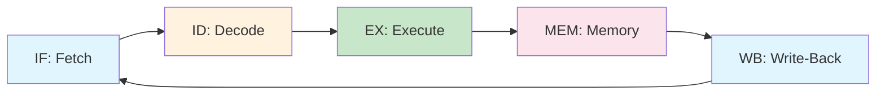

# Chapter 12: Pipelining

> **Prereq:** Chapter 11 (ISA) — the pipeline stages are designed around the instruction formats and datapath.
> **Next:** Chapter 13 (Memory Hierarchy) — cache design directly affects pipeline stall frequency.

## Learning Objectives

By the conclusion of this chapter, the student shall be able to:

1. Describe the five-stage RISC pipeline and the function of each stage
2. Identify structural, data, and control hazards in pipeline execution
3. Implement forwarding (bypassing) to resolve data hazards
4. Explain branch prediction and its impact on pipeline performance
5. Calculate pipeline speedup and analyse the effect of stalls

### Chapter at a Glance

| Section | Key Concept | Why It Matters |
|---------|-------------|----------------|
| Five-Stage Pipeline | IF, ID, EX, MEM, WB | Classic RISC organisation |
| Structural Hazard | Resource conflict | Solved by adding hardware |
| Data Hazard | RAW/WAR/WAW | Solved by forwarding + stalling |
| Control Hazard | Branch penalty | Solved by branch prediction |
| Speedup | Pipeline depth × clock | Amdahl's law limits returns |



> **One-Sentence Takeaway:** Pipelining improves throughput by overlapping instruction execution — but hazards (structural, data, control) reduce the ideal speedup, making forwarding and branch prediction essential for performance.

## Theory


### 12.1 Pipeline Concept

Pipelining is an implementation technique that overlaps the execution of multiple instructions. Each instruction is broken into sequential stages, and a new instruction begins execution at each clock cycle. The throughput increases proportionally to the number of pipeline stages, though latency per instruction remains similar.

### 12.2 Five-Stage RISC Pipeline

A canonical RISC pipeline comprises five stages:

1. **IF (Instruction Fetch)**: Fetch the instruction from instruction memory using the PC. Update PC to PC + 4.
2. **ID (Instruction Decode)**: Decode the instruction, read source registers from the register file, and sign-extend the immediate field.
3. **EX (Execute)**: Perform ALU operation or compute the effective address for memory access.
4. **MEM (Memory Access)**: Read or write data memory (active only for load and store instructions).
5. **WB (Write-Back)**: Write the ALU result or memory data to the destination register.

Each stage completes in one clock cycle. Pipeline registers (IF/ID, ID/EX, EX/MEM, MEM/WB) hold intermediate results between stages.

### 12.3 Ideal Speedup

For a *k*-stage pipeline processing *n* instructions:

Speedup = (n × T_{single}) / (T_{pipeline}) = (n × k × t) / ((k + n − 1) × t)

As n → ∞, speedup → k, assuming no hazards.

### 12.4 Pipeline Hazards

Hazards are situations that prevent the next instruction from executing during its designated clock cycle. Three hazard types exist.

#### 12.4.1 Structural Hazards

A structural hazard occurs when two instructions require the same hardware resource simultaneously. A unified instruction/data memory (Von Neumann architecture) creates a structural hazard when a load instruction writes to data memory while the next instruction fetches from instruction memory.

Resolution: Separate instruction and data caches (modified Harvard architecture) or stall.

#### 12.4.2 Data Hazards

A data hazard occurs when an instruction depends on a result that has not yet been computed by a preceding instruction.

**Read After Write (RAW)**: True data dependence. Instruction *j* reads a register that instruction *i* writes. (Most common.)

**Write After Read (WAR)**: Instruction *j* writes a register that instruction *i* reads. Does not occur in in-order RISC pipelines (all reads occur in ID, all writes in WB).

**Write After Write (WAW)**: Instruction *j* writes a register that instruction *i* also writes. Does not occur in in-order RISC pipelines.

**Example of RAW hazard**:
```
ADD R1, R2, R3    ; IF  ID  EX  MEM WB
SUB R4, R1, R5    ;     IF  ID  EX  MEM WB
```
The SUB instruction needs R1 in its EX stage, but ADD writes R1 in WB two cycles later.

**Resolution techniques**:

1. **Stalling**: Insert bubbles (NOPs) until the result is available. Decreases throughput.

2. **Forwarding (bypassing)**: Route the ALU result directly from EX/MEM or MEM/WB pipeline register to the ALU input, bypassing the register file.

3. **Code reordering**: Compiler rearranges instructions to separate dependent pairs.

#### 12.4.3 Control Hazards

A control hazard occurs when the pipeline makes wrong decisions about the next instruction to fetch. Branches and jumps introduce control hazards because the next PC is not known until the EX stage (or later).

**Branch penalty**: The number of cycles wasted when a branch is taken.

**Resolution techniques**:

1. **Assume not taken**: Continue fetching sequentially; flush instructions if branch is taken. Penalty = 1 cycle in a 5-stage pipeline.

2. **Assume taken**: Redirect fetch to the branch target speculatively. Penalty = 1 cycle if branch not taken.

3. **Branch prediction**: Predict whether the branch will be taken. Static prediction uses compiler hints; dynamic prediction uses history.

4. **Delayed branch**: Execute the instruction in the branch delay slot regardless of the branch direction. The compiler fills the delay slot with a useful instruction.

5. **Branch target buffer (BTB)**: Cache that stores branch addresses and their targets for fast prediction.

### 12.5 Forwarding Logic

Forwarding detects when the source register of the current instruction matches the destination register of a prior instruction in the pipeline. The forwarding unit compares register addresses and selects the appropriate data source for the ALU.

**Forwarding conditions**:

- Forward from EX/MEM: EX/MEM register rd equals ID/EX register rs (or rt), and RegWrite in EX/MEM is 1.
- Forward from MEM/WB: MEM/WB register rd equals ID/EX register rs (or rt), and RegWrite in MEM/WB is 1.

Priority: The closer stage (EX/MEM) has priority over the farther stage (MEM/WB) since it provides the more recent value.

### 12.6 Pipeline Performance with Hazards

Let *p* be the fraction of branches, *d* the fraction of load instructions, and *c* the fraction of RAW dependencies:

Effective CPI = 1 + (branch penalty × p) + (load-use penalty × d × c)

For a 5-stage pipeline with 2-cycle branch penalty (if branches are resolved in MEM) and 1-cycle load-use penalty:

Effective CPI = 1 + 2p + d × c

### 12.7 Pipeline Depth Trends

Modern processors use 14–20 pipeline stages (Intel Pentium 4: 31 stages). Deeper pipelines:
- Allow higher clock frequencies
- Increase branch misprediction penalty
- Increase power consumption
- Require more sophisticated hazard handling

## Examples

### Example 12.1: Pipeline Stage Diagram

Construct a pipeline diagram for the following MIPS code sequence using forwarding, not stalling.

```
LW   R1, 0(R2)
ADD  R3, R1, R4
SW   R3, 0(R5)
```

**Solution without forwarding**:
- LW: IF ID EX MEM WB
- ADD: IF ID stall EX MEM WB (stall due to RAW on R1)
- SW: IF stall ID EX MEM WB (stall due to RAW on R3)

Total: 8 cycles for 3 instructions.

**Solution with forwarding**:
- LW: IF ID EX MEM WB
- ADD: IF ID EX MEM WB (forward R1 from MEM to EX)
- SW: IF ID EX MEM WB (forward R3 from MEM to EX)

Total: 7 cycles (no stalls needed — forwarding from LW MEM stage to ADD EX stage).

### Example 12.2: Speedup Calculation

A 5-stage pipeline processes 1000 instructions. There are 50 branch instructions with a 2-cycle penalty and 150 load instructions with a 20% probability of load-use hazard (1-cycle penalty). Calculate the speedup over a single-cycle processor.

**Solution**:
Ideal cycles = 1000 + 5 − 1 = 1004 cycles.
Branch penalty cycles = 50 × 2 = 100.
Load-use penalty cycles = 150 × 0.20 × 1 = 30.
Total cycles = 1004 + 100 + 30 = 1134.
Speedup = (1000 × 5) / 1134 = 5000 / 1134 = 4.41 (vs. ideal 5.0).

### Example 12.3: Branch Prediction Accuracy

A predictor has 90% accuracy. There are 100 branches in a program, each with a 2-cycle misprediction penalty. Compare the total penalty cycles for a perfect predictor versus this predictor.

**Solution**:
Perfect predictor penalty = 0 cycles (all taken branches incur 0 penalty if correctly predicted taken).
Actual predictor: 10% of branches mispredicted = 10 branches, each incurring 2 cycles = 20 penalty cycles.

### Concept Comparison

| Hazard Type | Cause | Solution | Penalty |
|-------------|-------|----------|---------|
| Structural | Resource conflict | Add more hardware | 1 cycle per conflict |
| Data (RAW) | Instruction needs prior result | Forwarding + stalls | 0-2 cycles |
| Control | Branch uncertainty | Branch prediction | 1-3 cycles per mispredict |

### Quick Reference

| Metric | Formula | 5-stage ideal | With hazards |
|--------|---------|---------------|-------------|
| Ideal CPI | 1.0 | 1.0 | — |
| Speedup | Pipeline depth | 5× | < 5× |
| Effective CPI | 1 + stall_fraction | 1.0 | ~1.1-1.3 |

### Cross-Application Matrix

| Domain | Application | Relevance |
|--------|-------------|-----------|
| CPU Design | ARM, x86, RISC-V deep pipelines | Pipeline design determines GHz targets |
| Embedded Systems | Short pipelines for low power | Fewer stages = lower frequency, lower power |
| Digital Circuits | FPGA pipeline registers | Pipeline stages mapped to flip-flop chains |
| Research | Superscalar/out-of-order | Complexity beyond in-order pipelines |

## Summary

- Pipelining improves throughput by overlapping instruction execution across five or more stages.
- Structural hazards arise from resource contention; data hazards arise from operand dependencies; control hazards arise from branch uncertainty.
- Forwarding resolves most data hazards by routing results directly between pipeline stages.
- Branch prediction reduces control hazard penalties by speculatively issuing instructions.
- Pipeline performance is measured by effective CPI accounting for all hazard penalties.

## Exercises

### Review Questions

1. Name the five stages of a typical RISC pipeline.
2. Why does load-use data hazard cause a stall even with forwarding?
3. What is the difference between a taken branch and a not-taken branch in terms of pipeline cost?
4. Explain how a branch target buffer works.
5. What is a branch delay slot?

### Application Problems

1. A 5-stage pipeline processes 5000 instructions. There are 800 branches with 85% prediction accuracy (2-cycle penalty) and 1200 loads with 15% RAW hazard (1-cycle penalty). Calculate the total execution time at 2 GHz.

2. Show the pipeline diagram with forwarding for:
   ADD R1, R2, R3
   ADD R4, R1, R5
   ADD R6, R4, R7
   Identify all forwarding paths.

3. Design the forwarding unit for a 5-stage pipeline. Derive the Boolean equations for the forwardA and forwardB multiplexer selects.

4. Calculate the minimum number of cycles for a loop with 100 iterations:
   LOOP: LW R1, 0(R2)
         ADD R3, R3, R1
         ADDI R2, R2, 4
         BNE R2, R4, LOOP
   Assume a 5-stage pipeline with full forwarding, one branch delay slot, and the loop exits condition is known by the EX stage.

5. Compare the performance of a 5-stage and a 10-stage pipeline at the same clock frequency for a program with 20% branches and 90% branch prediction accuracy. Which pipeline suffers more from mispredictions?

### Challenge Problem

Design a pipeline interlock unit that handles all data hazards in a 5-stage RISC pipeline. The unit must detect RAW hazards, insert stalls when forwarding cannot resolve the hazard (load-use case), and manage write-after-write hazards if out-of-order completion were allowed. Show the control logic, stall insertion mechanism,     and interaction with the forwarding unit.

### Chapter Quiz

1. Which hazard can forwarding completely eliminate?
   - A) All RAW hazards except load-use
   - B) All structural hazards
   - C) All control hazards
   - D) All WAR hazards

2. A load-use hazard occurs when:
   - A) Two loads access the same memory address
   - B) An instruction uses the result of a load in the next cycle
   - C) A load instruction follows a branch
   - D) Multiple loads execute out of order

3. The ideal speedup from a 5-stage pipeline is:
   - A) 1×
   - B) 2×
   - C) 5×
   - D) 10×

<details>
<summary>Answers</summary>
1. A, 2. B, 3. C
</details>
