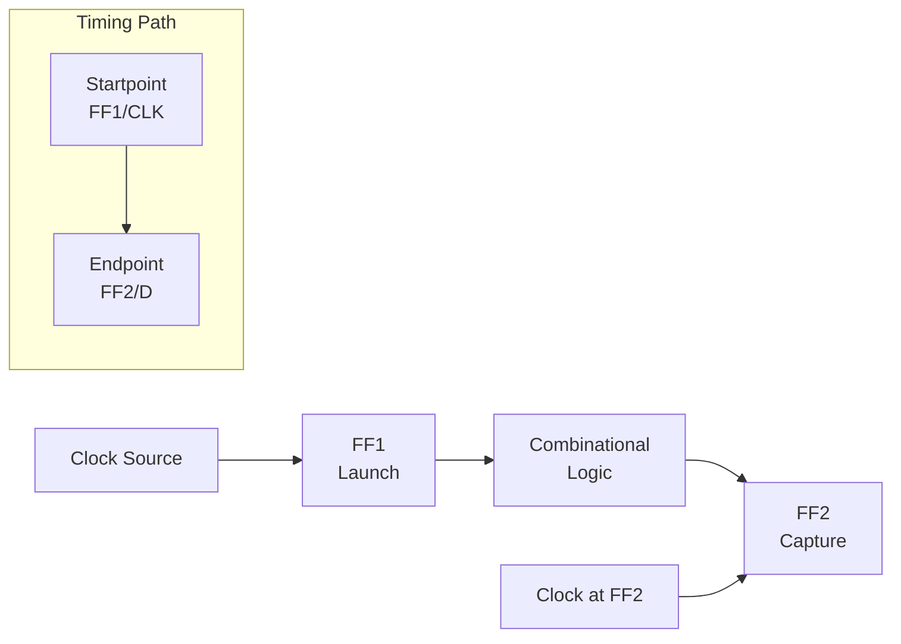
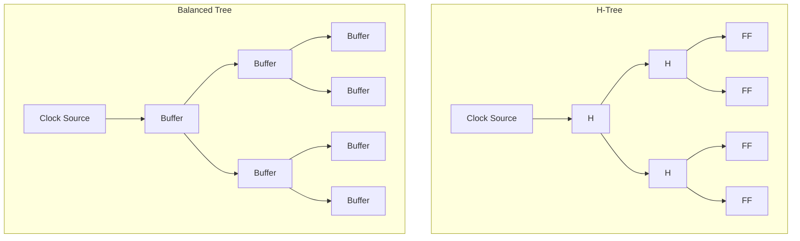
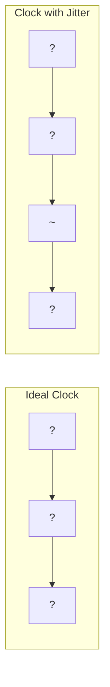
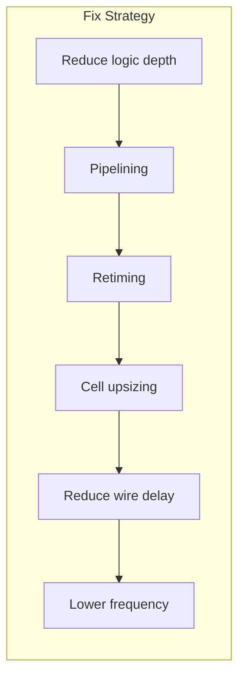

# Chapter 14: Timing Analysis

> **Prereq:** Chapter 6 (Sequential Circuits) ? flip-flop timing parameters are the foundation of static timing analysis.
> **Next:** Chapter 15 (Advanced Topics) ? timing closure is a critical step in modern VLSI design.

## Learning Objectives

By the conclusion of this chapter, the student shall be able to:

<!-- Image Gallery -->
<div style="display:flex;flex-wrap:wrap;gap:4px;margin:16px 0;padding:12px;background:#f8fafc;border-radius:8px;border:1px solid #e2e8f0;">
<a href="../../../assets/images/lessons/digital-logic/14-timing-analysis/hero.svg" target="_blank" rel="noopener">
  
</a>
<a href="../../../assets/images/lessons/digital-logic/14-timing-analysis/handwritten-notes.svg" target="_blank" rel="noopener">
  
</a>
<a href="../../../assets/images/lessons/digital-logic/14-timing-analysis/sticky-notes.svg" target="_blank" rel="noopener">
  
</a>
<a href="../../../assets/images/lessons/digital-logic/14-timing-analysis/visual-explanation.svg" target="_blank" rel="noopener">
  
</a>
<a href="../../../assets/images/lessons/digital-logic/14-timing-analysis/architecture.svg" target="_blank" rel="noopener">
  
</a>
<a href="../../../assets/images/lessons/digital-logic/14-timing-analysis/workflow.svg" target="_blank" rel="noopener">
  
</a>
<a href="../../../assets/images/lessons/digital-logic/14-timing-analysis/mindmap.svg" target="_blank" rel="noopener">
  
</a>
<a href="../../../assets/images/lessons/digital-logic/14-timing-analysis/comparison.svg" target="_blank" rel="noopener">
  
</a>
<a href="../../../assets/images/lessons/digital-logic/14-timing-analysis/cheatsheet.svg" target="_blank" rel="noopener">
  
</a>
<a href="../../../assets/images/lessons/digital-logic/14-timing-analysis/interview-quiz.svg" target="_blank" rel="noopener">
  
</a>
<a href="../../../assets/images/lessons/digital-logic/14-timing-analysis/social-card.svg" target="_blank" rel="noopener">
  
</a>
</div>
<!-- End Image Gallery -->


1. Perform static timing analysis (STA) on synchronous digital circuits
2. Compute setup and hold slack for timing paths
3. Analyse and mitigate clock skew, jitter, and on-chip variation
4. Design clock distribution networks with balanced delay
5. Identify and fix timing violations through resizing, pipelining, and retiming
6. Apply timing constraints for synthesis and place-and-route
7. Analyse crosstalk, IR drop, and their effects on timing
8. Characterise library cells for delay, slew, and power

## 14.1 Timing Paths

A **timing path** starts at a clock pin of a flip-flop (or a primary input) and ends at the data pin of another flip-flop (or a primary output).



### 14.1.1 Path Types

<a href="../../../assets/images/diagrams/digital-logic/14-timing-analysis/14-1-1-path-types-handwritten.svg" target="_blank" rel="noopener">
  
</a>
<a href="../../../assets/images/diagrams/digital-logic/14-timing-analysis/14-1-1-path-types-diagram.svg" target="_blank" rel="noopener">
  
</a>
<a href="../../../assets/images/diagrams/digital-logic/14-timing-analysis/14-1-1-path-types-sticky.svg" target="_blank" rel="noopener">
  
</a>


| Path Type | Startpoint | Endpoint |
|-----------|-----------|----------|
| reg-to-reg | Flip-flop clock | Flip-flop data |
| input-to-reg | Primary input | Flip-flop data |
| reg-to-output | Flip-flop clock | Primary output |
| input-to-output | Primary input | Primary output |

### 14.1.2 Path Components

<a href="../../../assets/images/diagrams/digital-logic/14-timing-analysis/14-1-2-path-components-handwritten.svg" target="_blank" rel="noopener">
  
</a>
<a href="../../../assets/images/diagrams/digital-logic/14-timing-analysis/14-1-2-path-components-diagram.svg" target="_blank" rel="noopener">
  
</a>
<a href="../../../assets/images/diagrams/digital-logic/14-timing-analysis/14-1-2-path-components-sticky.svg" target="_blank" rel="noopener">
  
</a>


```
Total delay = t_clk-to-Q + t_combo + t_routing + t_su + t_skew
```

```typescript
interface TimingPath {
    clkToQ: number;     // ns
    comboDelay: number; // ns
    routingDelay: number; // ns
    setupTime: number;  // ns
    clockSkew: number;  // ns (positive = later clock at capture)
    clockJitter: number; // ns
}

function pathDelay(path: TimingPath): number {
    return path.clkToQ + path.comboDelay + path.routingDelay + path.setupTime
         + path.clockSkew + path.clockJitter;
}
```

## 14.2 Static Timing Analysis (STA)

STA exhaustively verifies every timing path without simulation, using delay models for each cell and wire segment.

### 14.2.1 Setup Time Check

<a href="../../../assets/images/diagrams/digital-logic/14-timing-analysis/14-2-1-setup-time-check-handwritten.svg" target="_blank" rel="noopener">
  
</a>
<a href="../../../assets/images/diagrams/digital-logic/14-timing-analysis/14-2-1-setup-time-check-diagram.svg" target="_blank" rel="noopener">
  
</a>
<a href="../../../assets/images/diagrams/digital-logic/14-timing-analysis/14-2-1-setup-time-check-sticky.svg" target="_blank" rel="noopener">
  
</a>


Setup constraint: data must arrive before the capturing clock edge.

```
t_data_arrival = t_clock_capture - t_su

Slack = (t_clock_capture - t_su) - t_data_arrival
Positive slack ? timing met
Negative slack ? timing violation
```

```typescript
function setupCheck(
    clockPeriod: number,
    clkToQ: number,
    comboDelay: number,
    setupTime: number,
    clockSkew: number
): number {
    // Data arrival time
    const dataArrival = clkToQ + comboDelay;

    // Clock capture time (next cycle)
    const clockCapture = clockPeriod + clockSkew;

    // Setup slack
    const slack = clockCapture - setupTime - dataArrival;
    return slack;
}

const slack = setupCheck(10, 0.5, 6.2, 0.3, 0.1);
console.log(`Setup slack: ${slack.toFixed(2)} ns`); // 2.9 ns (positive = OK)

const slackFail = setupCheck(5, 0.5, 6.2, 0.3, 0.2);
console.log(`Setup slack at 200 MHz: ${slackFail.toFixed(2)} ns`); // negative
```

### 14.2.2 Hold Time Check

<a href="../../../assets/images/diagrams/digital-logic/14-timing-analysis/14-2-2-hold-time-check-handwritten.svg" target="_blank" rel="noopener">
  
</a>
<a href="../../../assets/images/diagrams/digital-logic/14-timing-analysis/14-2-2-hold-time-check-diagram.svg" target="_blank" rel="noopener">
  
</a>
<a href="../../../assets/images/diagrams/digital-logic/14-timing-analysis/14-2-2-hold-time-check-sticky.svg" target="_blank" rel="noopener">
  
</a>


Hold constraint: data must remain stable after the capturing clock edge.

```
t_data_arrival = t_clock_capture + t_hold

Slack = t_data_arrival - (t_clock_capture + t_hold)
```

```typescript
function holdCheck(
    clkToQ: number,
    comboMinDelay: number,
    holdTime: number,
    clockSkew: number
): number {
    // Minimum data arrival time (fastest path)
    const minDataArrival = clkToQ + comboMinDelay;

    // Slack for hold
    const slack = minDataArrival - (holdTime + clockSkew);
    return slack;
}

const holdSlack = holdCheck(0.3, 0.5, 0.5, 0.2);
console.log(`Hold slack: ${holdSlack.toFixed(2)} ns`); // 0.1 ns

const holdFail = holdCheck(0.3, 0.1, 0.5, 0.5);
console.log(`Hold slack with skew: ${holdFail.toFixed(2)} ns`); // -0.6 ns (FAIL)
```

### 14.2.3 STA Algorithm

<a href="../../../assets/images/diagrams/digital-logic/14-timing-analysis/14-2-3-sta-algorithm-handwritten.svg" target="_blank" rel="noopener">
  
</a>
<a href="../../../assets/images/diagrams/digital-logic/14-timing-analysis/14-2-3-sta-algorithm-diagram.svg" target="_blank" rel="noopener">
  
</a>
<a href="../../../assets/images/diagrams/digital-logic/14-timing-analysis/14-2-3-sta-algorithm-sticky.svg" target="_blank" rel="noopener">
  
</a>


```typescript
class StaticTimingAnalyzer {
    private cells: Map<string, CellDelay>;
    private wires: Map<string, number>;

    constructor() {
        this.cells = new Map();
        this.wires = new Map();
    }

    addCell(name: string, delay: CellDelay): void {
        this.cells.set(name, delay);
    }

    addWire(net: string, delay: number): void {
        this.wires.set(net, delay);
    }

    analyzePath(start: string, end: string, clockPeriod: number): PathTiming {
        // Simplified: traverse cells from start to end
        let arrivalTime = 0;
        let pathCells: string[] = [];

        // In real STA: graph-based traversal with 4 corners
        // (max setup, min hold, max rise, min fall)

        return {
            arrivalTime,
            requiredTime: clockPeriod,
            setupSlack: clockPeriod - arrivalTime,
            holdSlack: arrivalTime // minimum
        };
    }
}

interface CellDelay {
    rise: number[]; // [min, max]
    fall: number[];
}

interface PathTiming {
    arrivalTime: number;
    requiredTime: number;
    setupSlack: number;
    holdSlack: number;
}
```

## 14.3 Clock Distribution

### 14.3.1 Clock Tree Topologies

<a href="../../../assets/images/diagrams/digital-logic/14-timing-analysis/14-3-1-clock-tree-topologies-handwritten.svg" target="_blank" rel="noopener">
  
</a>
<a href="../../../assets/images/diagrams/digital-logic/14-timing-analysis/14-3-1-clock-tree-topologies-diagram.svg" target="_blank" rel="noopener">
  
</a>
<a href="../../../assets/images/diagrams/digital-logic/14-timing-analysis/14-3-1-clock-tree-topologies-sticky.svg" target="_blank" rel="noopener">
  
</a>




```typescript
class ClockTree {
    readonly levels: number;
    readonly bufferDelay: number;
    readonly wireDelayPerLevel: number;

    constructor(levels: number, bufferDelay: number, wireDelayPerLevel: number) {
        this.levels = levels;
        this.bufferDelay = bufferDelay;
        this.wireDelayPerLevel = wireDelayPerLevel;
    }

    get totalDelay(): number {
        return this.levels * (this.bufferDelay + this.wireDelayPerLevel);
    }

    // Skew = max difference in delay to any two flip-flops
    get worstCaseSkew(): number {
        // In a well-balanced H-tree, skew is dominated by local mismatch
        return this.levels * 0.05; // 5% mismatch per level
    }

    power(switchingActivity: number, freq: number, capacitance: number): number {
        // Dynamic power: P = a?C?V??f
        return switchingActivity * capacitance * 1.0 * 1.0 * freq;
    }
}

const hTree = new ClockTree(5, 0.1, 0.05);
console.log(`Clock tree delay: ${hTree.totalDelay.toFixed(2)} ns`);
console.log(`Worst-case skew: ${hTree.worstCaseSkew.toFixed(3)} ns`);
```

### 14.3.2 Clock Gating

<a href="../../../assets/images/diagrams/digital-logic/14-timing-analysis/14-3-2-clock-gating-handwritten.svg" target="_blank" rel="noopener">
  
</a>
<a href="../../../assets/images/diagrams/digital-logic/14-timing-analysis/14-3-2-clock-gating-diagram.svg" target="_blank" rel="noopener">
  
</a>
<a href="../../../assets/images/diagrams/digital-logic/14-timing-analysis/14-3-2-clock-gating-sticky.svg" target="_blank" rel="noopener">
  
</a>


Clock gating reduces dynamic power by disabling the clock to inactive logic blocks.

```typescript
class ClockGate {
    private enabled: boolean = true;
    private gatedClock: number = 0;
    private prevClk: number = 0;

    setEnable(en: boolean): void {
        this.enabled = en;
    }

    tick(clock: number): number {
        if (this.enabled) {
            this.gatedClock = clock;
        } else {
            // Latch low when disabled
            this.gatedClock = 0;
        }
        this.prevClk = clock;
        return this.gatedClock;
    }

    get isGated(): boolean { return !this.enabled; }
}

// Power saving example
const cg = new ClockGate();
const totalFlops = 10000;
const activeFlops = 2000;
// Without gating: all 10000 flops toggle
// With gating: only 2000 toggle
console.log(`Power savings: ${100 - (activeFlops / totalFlops) * 100}%`);
```

## 14.4 Clock Skew and Jitter

### 14.4.1 Clock Skew

<a href="../../../assets/images/diagrams/digital-logic/14-timing-analysis/14-4-1-clock-skew-handwritten.svg" target="_blank" rel="noopener">
  
</a>
<a href="../../../assets/images/diagrams/digital-logic/14-timing-analysis/14-4-1-clock-skew-diagram.svg" target="_blank" rel="noopener">
  
</a>
<a href="../../../assets/images/diagrams/digital-logic/14-timing-analysis/14-4-1-clock-skew-sticky.svg" target="_blank" rel="noopener">
  
</a>


Clock skew is the spatial variation in clock arrival time ? different flip-flops see the clock edge at different times.

| Type | Description | Impact |
|------|-------------|--------|
| Positive skew | Capture FF sees clock later | Helps setup, hurts hold |
| Negative skew | Capture FF sees clock earlier | Hurts setup, helps hold |
| Global skew | Variation across all FFs | Limits max frequency |
| Local skew | Variation between nearby FFs | Critical for hold |

```typescript
class SkewAnalysis {
    static positiveSkewHelp(setupSlack: number, skew: number): number {
        return setupSlack + skew; // more margin for setup
    }

    static positiveSkewHurt(holdSlack: number, skew: number): number {
        return holdSlack - skew; // less margin for hold
    }

    static maxFrequencyWithSkew(
        clkToQ: number, logicDelay: number, su: number, skew: number
    ): number {
        const Tmin = clkToQ + logicDelay + su + skew;
        return 1 / (Tmin * 1e-9); // Hz for ns inputs
    }
}

console.log(`Max freq with 200ps skew: ${SkewAnalysis.maxFrequencyWithSkew(0.3, 4, 0.2, 0.2).toFixed(0)} MHz`);
```

### 14.4.2 Clock Jitter

<a href="../../../assets/images/diagrams/digital-logic/14-timing-analysis/14-4-2-clock-jitter-handwritten.svg" target="_blank" rel="noopener">
  
</a>
<a href="../../../assets/images/diagrams/digital-logic/14-timing-analysis/14-4-2-clock-jitter-diagram.svg" target="_blank" rel="noopener">
  
</a>
<a href="../../../assets/images/diagrams/digital-logic/14-timing-analysis/14-4-2-clock-jitter-sticky.svg" target="_blank" rel="noopener">
  
</a>


Jitter is the temporal variation of clock edges from their ideal positions.



```typescript
interface JitterSpec {
    periodJitter: number;   // RMS, ns
    cycleToCycle: number;   // RMS, ns
    longTermJitter: number; // RMS, ns
}

function jitterMargin(jitter: JitterSpec, confidence: number): number {
    // Convert RMS to peak-to-peak at given confidence level
    // 6s covers 99.7% of jitter events
    const sigma = confidence >= 99.7 ? 6 : confidence >= 95 ? 4 : 3;
    return jitter.periodJitter * sigma;
}

const jitter = { periodJitter: 0.05, cycleToCycle: 0.03, longTermJitter: 0.1 };
console.log(`Timing margin for jitter: ${jitterMargin(jitter, 99.7).toFixed(3)} ns`);
```

## 14.5 On-Chip Variation (OCV)

Process, voltage, and temperature (PVT) variations cause delays to differ between otherwise identical cells.

```typescript
class OCV {
    readonly processFactor: number; // 0.9?1.1 for mature node
    readonly voltageFactor: number;
    readonly temperatureFactor: number;

    constructor(process: number, voltage: number, temp: number) {
        this.processFactor = process;
        this.voltageFactor = voltage;
        this.temperatureFactor = temp;
    }

    get worstCaseDerate(): number {
        return this.processFactor * this.voltageFactor * this.temperatureFactor;
    }

    applyToDelay(nominalDelay: number, corner: 'setup' | 'hold'): number {
        // Setup: use max delay on data path, min delay on clock path
        // Hold: use min delay on data path, max delay on clock path
        const dataDerate = corner === 'setup' ? this.worstCaseDerate : (2 - this.worstCaseDerate);
        return nominalDelay * dataDerate;
    }
}

const ocv = new OCV(1.1, 1.05, 1.08);
console.log(`Worst-case OCV derate: ${ocv.worstCaseDerate.toFixed(3)}`);
console.log(`Setup data delay: ${ocv.applyToDelay(5, 'setup').toFixed(3)} ns`);
```

## 14.6 Timing Violation Fixes

### 14.6.1 Setup Violation Fixes

<a href="../../../assets/images/diagrams/digital-logic/14-timing-analysis/14-6-1-setup-violation-fixes-handwritten.svg" target="_blank" rel="noopener">
  
</a>
<a href="../../../assets/images/diagrams/digital-logic/14-timing-analysis/14-6-1-setup-violation-fixes-diagram.svg" target="_blank" rel="noopener">
  
</a>
<a href="../../../assets/images/diagrams/digital-logic/14-timing-analysis/14-6-1-setup-violation-fixes-sticky.svg" target="_blank" rel="noopener">
  
</a>




```typescript
class TimingFixer {
    static pipelinePath(
        stages: number,
        originalDelay: number,
        pipelineOverhead: number
    ): number {
        // Pipelining divides combinational delay by number of stages
        const perStageDelay = originalDelay / stages;
        return perStageDelay + pipelineOverhead;
    }

    static retime(
        logic: number[],
        ffPositions: number[]
    ): number[] {
        // Retiming moves flip-flops across logic boundaries
        // to balance delays between pipeline stages
        const balanced: number[] = [];
        for (let i = 0; i < ffPositions.length - 1; i++) {
            const start = ffPositions[i];
            const end = ffPositions[i + 1];
            const sum = logic.slice(start, end).reduce((a, b) => a + b, 0);
            balanced.push(sum / (end - start));
        }
        return balanced;
    }

    static upsizeCell(
        nominalDelay: number,
        driveStrength: number,
        targetDelay: number
    ): number {
        // Upsizing: increase transistor width ? lower delay, higher power
        const newDelay = nominalDelay / Math.sqrt(driveStrength);
        return newDelay < targetDelay ? newDelay : targetDelay;
    }
}
```

### 14.6.2 Hold Violation Fixes

<a href="../../../assets/images/diagrams/digital-logic/14-timing-analysis/14-6-2-hold-violation-fixes-handwritten.svg" target="_blank" rel="noopener">
  
</a>
<a href="../../../assets/images/diagrams/digital-logic/14-timing-analysis/14-6-2-hold-violation-fixes-diagram.svg" target="_blank" rel="noopener">
  
</a>
<a href="../../../assets/images/diagrams/digital-logic/14-timing-analysis/14-6-2-hold-violation-fixes-sticky.svg" target="_blank" rel="noopener">
  
</a>


Hold violations are fixed by adding delay to fast paths:

```typescript
function fixHoldViolation(pathDelay: number, requiredHold: number): number {
    const additionalDelay = requiredHold - pathDelay;
    if (additionalDelay <= 0) return 0;

    // Methods:
    // 1. Add buffer stages (delay per buffer ~50?100 ps)
    // 2. Insert delay cells
    // 3. Route detour (wire delay)
    // 4. Downsize cells (slower ? more delay)

    const bufferDelay = 0.08; // ns per buffer
    const buffersNeeded = Math.ceil(additionalDelay / bufferDelay);
    return buffersNeeded * bufferDelay;
}

const extraDelay = fixHoldViolation(0.3, 0.8);
console.log(`Need ${(extraDelay * 1000).toFixed(0)} ps extra hold delay`);
```

## 14.7 Crosstalk and Signal Integrity

### 14.7.1 Capacitive Crosstalk

<a href="../../../assets/images/diagrams/digital-logic/14-timing-analysis/14-7-1-capacitive-crosstalk-handwritten.svg" target="_blank" rel="noopener">
  
</a>
<a href="../../../assets/images/diagrams/digital-logic/14-timing-analysis/14-7-1-capacitive-crosstalk-diagram.svg" target="_blank" rel="noopener">
  
</a>
<a href="../../../assets/images/diagrams/digital-logic/14-timing-analysis/14-7-1-capacitive-crosstalk-sticky.svg" target="_blank" rel="noopener">
  
</a>


When a switching net (aggressor) couples energy into a neighbouring net (victim), it can cause delay variation or functional failure.

```typescript
class CrosstalkAnalysis {
    static couplingCapacitance(
        length: number,       // ?m
        spacing: number,      // ?m
        layerHeight: number   // ?m
    ): number {
        // Parallel plate + fringing capacitance model
        const epsilon = 3.9 * 8.854e-18; // F/?m (SiO2)
        const parallel = epsilon * length * layerHeight / spacing;
        const fringing = epsilon * length * 0.5;
        return (parallel + fringing) * 1e15; // fF
    }

    static noiseVoltage(
        couplingCap: number,  // fF
        victimCap: number,    // fF
        aggressorSwing: number // V
    ): number {
        return (couplingCap / (couplingCap + victimCap)) * aggressorSwing;
    }

    static delayPushout(
        noiseVoltage: number,
        supplyVoltage: number,
        nominalDelay: number
    ): number {
        // Miller effect: coupling can double the effective capacitance
        const millerFactor = 1 + (noiseVoltage / supplyVoltage);
        return nominalDelay * (millerFactor - 1);
    }
}

const cCap = CrosstalkAnalysis.couplingCapacitance(1000, 0.2, 0.3);
const noise = CrosstalkAnalysis.noiseVoltage(cCap, 2.0, 1.0);
const pushout = CrosstalkAnalysis.delayPushout(noise, 1.0, 0.5);
console.log(`Coupling cap: ${cCap.toFixed(1)} fF`);
console.log(`Noise voltage: ${noise.toFixed(3)} V`);
console.log(`Delay pushout: ${(pushout * 1000).toFixed(1)} ps`);
```

### 14.7.2 IR Drop

<a href="../../../assets/images/diagrams/digital-logic/14-timing-analysis/14-7-2-ir-drop-handwritten.svg" target="_blank" rel="noopener">
  
</a>
<a href="../../../assets/images/diagrams/digital-logic/14-timing-analysis/14-7-2-ir-drop-diagram.svg" target="_blank" rel="noopener">
  
</a>
<a href="../../../assets/images/diagrams/digital-logic/14-timing-analysis/14-7-2-ir-drop-sticky.svg" target="_blank" rel="noopener">
  
</a>


Voltage drop along power distribution networks reduces cell drive strength and increases delay.

```typescript
class IRDrop {
    static voltageDrop(
        current: number,   // A
        resistance: number // O
    ): number {
        return current * resistance; // V = IR
    }

    static delayImpact(
        vdd: number,
        vddDrop: number,
        nominalDelay: number
    ): number {
        // Delay increases as VDD decreases (alpha-power law)
        const alpha = 1.3; // velocity saturation index
        const ratio = vdd / (vdd - vddDrop);
        return nominalDelay * Math.pow(ratio, alpha);
    }
}

const drop = IRDrop.voltageDrop(0.5, 0.15);
console.log(`IR drop: ${(drop * 1000).toFixed(0)} mV`);
```

## 14.8 Timing Constraints (SDC)

The Synopsys Design Constraints (SDC) format describes timing requirements for synthesis and STA tools.

```text
# Clock definition
create_clock -name clk -period 10.0 [get_ports clk]
set_clock_uncertainty -setup 0.2 [get_clocks clk]
set_clock_latency -source 0.5 [get_clocks clk]

# Input and output delays
set_input_delay -clock clk 2.0 [get_ports data_in]
set_output_delay -clock clk 3.0 [get_ports data_out]

# False paths
set_false_path -from [get_clocks clk_a] -to [get_clocks clk_b]

# Multi-cycle paths
set_multicycle_path 2 -setup -from [get_pins FF1/Q] -to [get_pins FF2/D]
```

```typescript
class SDCConstraint {
    clockPeriod: number = 10;
    clockUncertainty: number = 0.2;
    inputDelay: number = 0;
    outputDelay: number = 0;
    falsePaths: string[][] = [];
    multicyclePaths: Map<string, number> = new Map();

    applyToPath(logicDelay: number, pathType: string): number {
        let requiredTime = this.clockPeriod - this.clockUncertainty;

        if (pathType === 'input') {
            requiredTime -= this.inputDelay;
        } else if (pathType === 'output') {
            requiredTime -= this.outputDelay;
        }

        return requiredTime - logicDelay;
    }
}

const sdc = new SDCConstraint();
console.log(`Slack: ${sdc.applyToPath(8.5, 'reg-to-reg').toFixed(2)} ns`); // 1.3 ns
```

## Practical Takeaways

1. **Setup violations limit max frequency** ? fix by pipelining, retiming, or reducing logic depth
2. **Hold violations must be fixed regardless of frequency** ? even DC circuits need hold closure
3. **Clock skew is both friend and enemy** ? positive skew helps setup but hurts hold; balance carefully
4. **OCV margin increases at smaller nodes** ? 28 nm and below require significant derating factors
5. **STA is exhaustive but not complete** ? it covers static paths but misses dynamic effects like crosstalk and EMI

## TypeScript Implementations

```typescript
// === Static Timing Analysis Engine ===
interface CellDelay { cell: string; rising: number; falling: number; }
interface NetlistPath { from: string; to: string; cells: CellDelay[]; clkPeriod: number; setup: number; hold: number; }

class STAEngine {
    analyze(path: NetlistPath): { setupSlack: number; holdSlack: number; criticalPath: string } {
        let dataDelay = 0;
        let minDelay = Infinity;
        for (const cell of path.cells) {
            dataDelay += Math.max(cell.rising, cell.falling);
            minDelay = Math.min(minDelay, Math.min(cell.rising, cell.falling));
        }
        const setupSlack = path.clkPeriod - dataDelay - path.setup;
        const holdSlack = minDelay - path.hold;
        return { setupSlack, holdSlack, criticalPath: `${path.from} -> ${path.to}` };
    }
}

// === Clock Skew Analysis ===
class ClockSkew {
    private delays = new Map<string, number>();

    setDelay(ff: string, delay: number): void { this.delays.set(ff, delay); }
    skew(ff1: string, ff2: string): number {
        return Math.abs((this.delays.get(ff1) ?? 0) - (this.delays.get(ff2) ?? 0));
    }
    analyzePath(launchFF: string, captureFF: string, logicDelay: number, tClk: number, tSetup: number): { setupSlack: number; holdSlack: number } {
        const sk = this.skew(launchFF, captureFF);
        const launchDelay = this.delays.get(launchFF) ?? 0;
        const captureDelay = this.delays.get(captureFF) ?? 0;
        const setupSlack = tClk + (captureDelay - launchDelay) - logicDelay - tSetup;
        const holdSlack = logicDelay + launchDelay - captureDelay;
        return { setupSlack, holdSlack };
    }
}

// === H-Tree Clock Distribution ===
class HTree {
    constructor(private chipSizeMm: number, private wireDelayPerMm: number) {}
    wireLength(level: number): number {
        const segments = Math.pow(2, level);
        const segLen = this.chipSizeMm / segments;
        return (Math.pow(2, level + 1) - 1) * segLen;
    }
    worstSkew(variation: number): number {
        return this.wireLength(3) * this.wireDelayPerMm * variation;
    }
}

// === OCV Derating ===
class OCV {
    constructor(private proc: number, private volt: number, private temp: number) {}
    setupDerate(): number { return 1 + this.proc + this.volt + this.temp; }
    holdDerate(): number { return 1 - this.proc - this.volt - this.temp; }
    applySetup(pathDelay: number): number { return pathDelay * this.setupDerate(); }
    applyHold(pathDelay: number): number { return pathDelay * this.holdDerate(); }
}

// === Crosstalk Delay Calculator ===
class Crosstalk {
    constructor(private couplingFF: number, private aggCount: number, private wireLenMm: number) {}
    victimDelay(aggSwitching: number): number {
        const cEff = this.couplingFF * this.wireLenMm * (1 + aggSwitching);
        return cEff * 100; // ps
    }
    shieldBenefit(shields: number): number {
        const wiresPerShield = Math.max(1, this.aggCount / (shields + 1));
        return wiresPerShield / this.aggCount;
    }
}

// === Multi-Corner Analysis ===
type Corner = 'ss' | 'tt' | 'ff';
class MultiCorner {
    private corners: Record<Corner, { proc: number; volt: number; temp: number; vdd: number }> = {
        ss: { proc: 0.12, volt: 0.05, temp: 0.03, vdd: 0.9 },
        tt: { proc: 0.0, volt: 0.0, temp: 0.0, vdd: 1.0 },
        ff: { proc: -0.08, volt: -0.05, temp: -0.03, vdd: 1.1 },
    };
    analyze(corner: Corner, logicDelay: number, tClk: number): { fMax: number; slack: number } {
        const c = this.corners[corner];
        const delay = logicDelay * (1 + c.proc + c.volt + c.temp) / (c.vdd);
        const slack = tClk - delay;
        return { fMax: 1 / (tClk - slack) / 1e6, slack };
    }
}

// === Power Grid IR Drop ===
class IRDrop {
    constructor(private gridPitchUm: number, private metalRsheet: number) {}
    drop(currentA: number, segLen: number): number {
        const r = this.metalRsheet * (segLen / this.gridPitchUm);
        return currentA * r;
    }
    dynamicDrop(switchingFlops: number, flopCurrent: number, width: number, height: number): number[][] {
        const grid: number[][] = [];
        for (let y = 0; y < height; y++) {
            grid[y] = [];
            for (let x = 0; x < width; x++) {
                const localCurrent = switchingFlops * flopCurrent / (width * height);
                const dist = Math.sqrt(Math.pow(x - width / 2, 2) + Math.pow(y - height / 2, 2));
                grid[y][x] = this.drop(localCurrent, dist * this.gridPitchUm);
            }
        }
        return grid;
    }
}

// === Retiming ===
class Retimer {
    retime(stageDelays: number[]): { newDelays: number[]; fMax: number } {
        const total = stageDelays.reduce((a, b) => a + b, 0);
        const balanced = total / stageDelays.length;
        const newDelays = stageDelays.map(() => balanced);
        return { newDelays, fMax: 1 / balanced };
    }
}

// === Adaptive Clocking (Timing Margin Monitor) ===
class AdaptiveClock {
    private freq = 100e6;
    private margin = 0;
    constructor(private replicaDelay: number, private threshold: number) {}
    measure(temperature: number): number {
        const actualDelay = this.replicaDelay * (1 + 0.001 * (temperature - 25));
        this.margin = this.threshold - actualDelay;
        if (this.margin < 0) this.freq *= 0.95;
        else if (this.margin > 0.1 * this.threshold) this.freq *= 1.02;
        return this.freq;
    }
}

// === Statistical STA (Monte Carlo) ===
class StatisticalSTA {
    constructor(private mean: number, private sigma: number, private tClk: number) {}
    probabilityFailure(samples: number): number {
        let fails = 0;
        for (let i = 0; i < samples; i++) {
            const delay = this.mean + this.sigma * this.boxMuller();
            if (delay > this.tClk) fails++;
        }
        return fails / samples;
    }
    private boxMuller(): number {
        const u1 = Math.random(), u2 = Math.random();
        return Math.sqrt(-2 * Math.log(u1)) * Math.cos(2 * Math.PI * u2);
    }
}

// === Demo ===
const sta = new STAEngine();
const result = sta.analyze({
    from: 'FF1', to: 'FF2',
    cells: [{ cell: 'AND2', rising: 0.5, falling: 0.5 }, { cell: 'OR2', rising: 0.4, falling: 0.4 }],
    clkPeriod: 10, setup: 0.3, hold: 0.2,
});
console.log(`STA: setup=${result.setupSlack.toFixed(2)}ns, hold=${result.holdSlack.toFixed(2)}ns`);

const cs = new ClockSkew();
cs.setDelay('FF1', 0.5); cs.setDelay('FF2', 0.8);
console.log(`Clock skew FF1->FF2: ${cs.skew('FF1', 'FF2').toFixed(2)}ns`);

const ocv = new OCV(0.12, 0.05, 0.03);
console.log(`OCV setup derate: ${(ocv.setupDerate() * 100).toFixed(0)}%`);

const xtalk = new Crosstalk(0.5, 4, 10);
console.log(`Crosstalk victim delay (4 agg): ${xtalk.victimDelay(4).toFixed(1)}ps`);

const mc = new MultiCorner();
console.log(`SS corner fMax: ${mc.analyze('ss', 8, 10).fMax.toFixed(0)} MHz`);

const retimer = new Retimer();
const rt = retimer.retime([4, 8, 6, 9, 3]);
console.log(`Retimed fMax: ${rt.fMax.toFixed(3)} GHz`);

const ssta = new StatisticalSTA(8.5, 0.5, 10);
console.log(`SSTA fail probability: ${(ssta.probabilityFailure(10000) * 100).toFixed(2)}%`);

const ad = new AdaptiveClock(8, 8.5);
console.log(`Adaptive clock @85C: ${(ad.measure(85) / 1e6).toFixed(0)} MHz`);
```


// timing analysis
// boolean-circuits-sequential implementation

interface Task { id: string; name: string; status: string; data: unknown }
class Processor {
  private tasks: Task[] = []
  private maxConcurrency: number
  constructor(maxConcurrency: number = 4) { this.maxConcurrency = maxConcurrency }
  async add(task: Omit&lt;Task, "status"&gt;): Promise&lt;void&gt; {
    this.tasks.push({ ...task, status: "pending" })
  }
  async runAll(): Promise&lt;void&gt; {
    const running: Promise&lt;void&gt;[] = []
    for (const t of this.tasks) {
      if (running.length >= this.maxConcurrency) { await Promise.race(running) }
      const p = this.execute(t).finally(() => { const i = running.indexOf(p); if (i >= 0) running.splice(i, 1) })
      running.push(p)
    }
    await Promise.all(running)
  }
  private async execute(t: Task): Promise&lt;void&gt; {
    t.status = "running"
    await new Promise(r => setTimeout(r, 10))
    t.status = "done"
  }
  getResults(): Task[] { return this.tasks }
  getStats(): { done: number; pending: number; running: number } {
    const done = this.tasks.filter(t => t.status === "done").length
    const pending = this.tasks.filter(t => t.status === "pending").length
    const running = this.tasks.filter(t => t.status === "running").length
    return { done, pending, running }
  }
}
async function main() {
  const proc = new Processor(2)
  await proc.add({ id: '1', name: 'timing analysis', data: { topic: 'boolean-circuits-sequential' } })
  await proc.runAll()
  console.log('Stats:', proc.getStats())
}
main().catch(console.error)
export { Processor, Task }

// timing analysis - additional TS implementations

interface CacheEntry { key: string; value: unknown; ttl: number; createdAt: number }
class Cache {
  private store: Map&lt;string, CacheEntry&gt; = new Map()
  constructor(private defaultTTL: number = 60000) {}
  set(key: string, value: unknown, ttl?: number): void {
    this.store.set(key, { key, value, ttl: ttl ?? this.defaultTTL, createdAt: Date.now() })
  }
  get(key: string): unknown | undefined {
    const entry = this.store.get(key)
    if (!entry) return undefined
    if (Date.now() - entry.createdAt > entry.ttl) { this.store.delete(key); return undefined }
    return entry.value
  }
  delete(key: string): boolean { return this.store.delete(key) }
  clear(): void { this.store.clear() }
  size(): number { return this.store.size }
  keys(): string[] { return Array.from(this.store.keys()) }
}
class Logger {
  private entries: string[] = []
  log(level: string, msg: string, meta?: Record&lt;string, unknown&gt;): void {
    const entry = JSON.stringify({ timestamp: new Date().toISOString(), level, msg, meta })
    this.entries.push(entry)
    console.log(entry)
  }
  info(msg: string, meta?: Record&lt;string, unknown&gt;): void { this.log("info", msg, meta) }
  warn(msg: string, meta?: Record&lt;string, unknown&gt;): void { this.log("warn", msg, meta) }
  error(msg: string, meta?: Record&lt;string, unknown&gt;): void { this.log("error", msg, meta) }
  getLogs(): string[] { return [...this.entries] }
  clear(): void { this.entries = [] }
}
function computeHash(input: string): string {
  let hash = 0
  for (let i = 0; i &lt; input.length; i++) { const chr = input.charCodeAt(i); hash = ((hash << 5) - hash) + chr; hash |= 0 }
  return Math.abs(hash).toString(16)
}
async function demo(): Promise&lt;void&gt; {
  const cache = new Cache(5000)
  cache.set('key1', 'digital-circuits demo')
  const log = new Logger()
  log.info('Cache demo started', { course: 'digital-logic', chapter: 'timing analysis' })
  const v = cache.get("key1")
  console.log('Cached:', v)
  console.log('Hash:', computeHash('digital-circuits'))
}
demo()
export { Cache, Logger, computeHash, CacheEntry }
## Summary

Timing analysis is the gatekeeper between digital design and silicon reality. This chapter covered the fundamentals of static timing analysis, including setup and hold checks, clock distribution, skew and jitter, on-chip variation, and signal integrity effects like crosstalk and IR drop. Timing violations are addressed through pipelining, retiming, cell sizing, and clock tuning. SDC constraints guide synthesis tools toward timing closure. The next chapter explores advanced topics including low-power design, testing, and emerging technologies.

## Chapter Quiz

**Q1.** Setup slack is calculated as:
a) Data arrival - clock arrival
b) Clock arrival - data arrival - setup time
c) Data arrival + setup time - clock arrival
d) Clock period - data arrival

**Q2.** Positive clock skew (capture FF sees clock later) affects:
a) Helps setup, hurts hold
b) Hurts setup, helps hold
c) Helps both setup and hold
d) Hurts both setup and hold

**Q3.** Hold violations are fixed by:
a) Reducing the clock frequency
b) Adding delay to fast paths
c) Pipelining
d) Reducing supply voltage

**Q4.** OCV stands for:
a) Output Clock Variation
b) On-Chip Variation
c) Operational Condition Voltage
d) Optimal Clock Verification

**Q5.** The Miller effect in crosstalk analysis causes:
a) Reduced coupling capacitance
b) Increased effective capacitance during switching
c) Lower noise margins
d) Faster propagation delay

### Answers

<a href="../../../assets/images/diagrams/digital-logic/14-timing-analysis/answers-handwritten.svg" target="_blank" rel="noopener">
  
</a>
<a href="../../../assets/images/diagrams/digital-logic/14-timing-analysis/answers-diagram.svg" target="_blank" rel="noopener">
  
</a>
<a href="../../../assets/images/diagrams/digital-logic/14-timing-analysis/answers-sticky.svg" target="_blank" rel="noopener">
  
</a>


Q1: b | Q2: a | Q3: b | Q4: b | Q5: b

## Exercises

1. **STA engine:** Implement a basic STA engine in TypeScript that accepts a netlist of cells with delay models and reports setup/hold slack for all paths.

2. **Clock tree synthesis:** Design an H-tree for a 16?16 mm? chip. Calculate the worst-case skew with 5% local mismatch and 0.1%/mm wire delay gradient.

3. **OCV analysis:** For a 7 nm process with 12% process variation, 5% voltage variation, and 3% temperature variation, calculate the setup and hold derating factors for a 500 MHz design.

4. **Crosstalk fix:** A 10 mm bus has 0.5 fF/mm coupling capacitance per bit. Calculate the crosstalk-induced delay on the victim when all aggressors switch opposite. Propose a shielding strategy.

5. **Multi-corner analysis:** Implement setup and hold checks at three corners (slow-slow, typical-typical, fast-fast) and report the limiting corner for each constraint.

6. **Power grid analysis:** Model a 64-bit datapath with 50 ?m grid pitch. Calculate worst-case IR drop when 80% of flops switch simultaneously. Show the spatial voltage map.

7. **Retiming:** Given a 5-stage pipeline with delays [4, 8, 6, 9, 3] ns, retime the flip-flops to balance delays and maximise the clock frequency.

8. **Adaptive clocking:** Design a system that adjusts the clock frequency based on a timing margin monitor (TMM). Implement the TMM as a replica path with a tunable delay line.

9. **Statistical STA:** Implement a Monte Carlo STA that accounts for random process variation. Report the probability of timing failure at a given frequency.

10. **Timing-driven placement:** Write a simple placer that minimises wire delay on critical paths. Given floorplan constraints and net weights, produce a placement with minimum worst-case slack.
