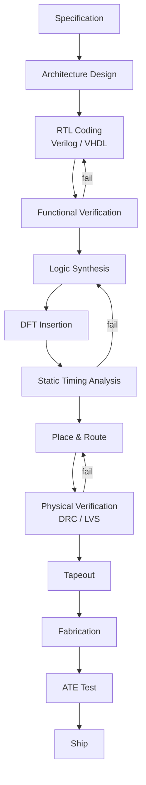
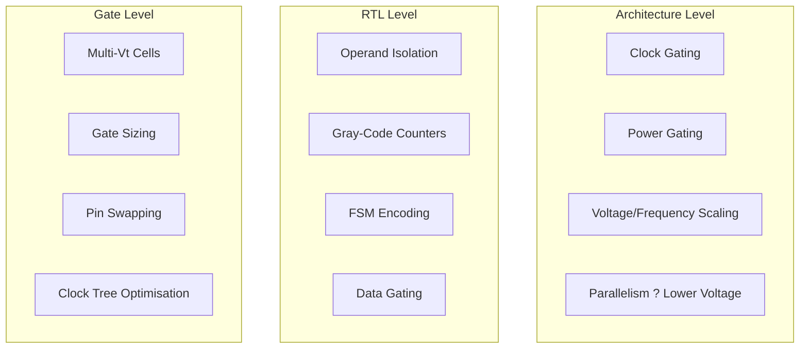
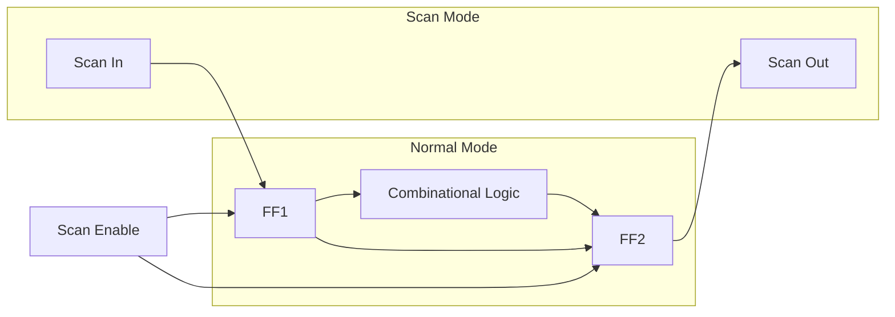
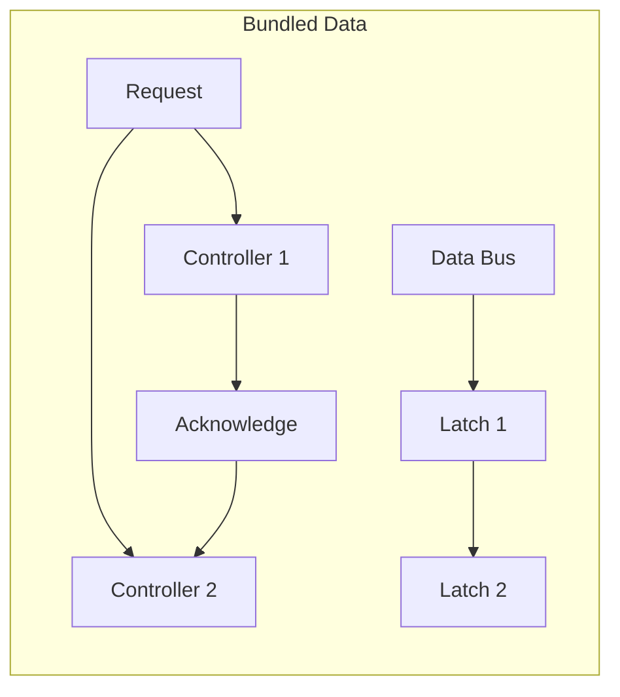
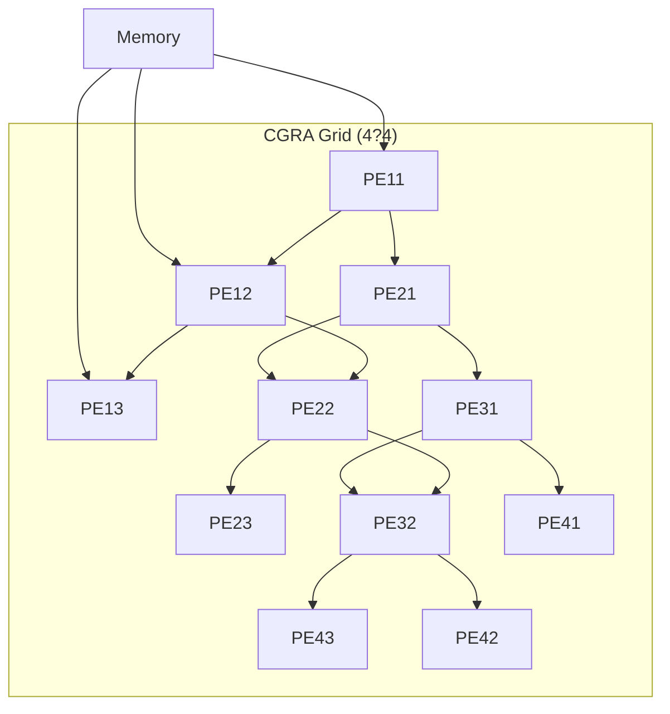

# Chapter 15: Advanced Topics in Digital Logic

> **Prereq:** All previous chapters ? this capstone chapter surveys advanced and emerging topics.
> **Next:** Your next course ? computer architecture, VLSI design, or embedded systems.

## Learning Objectives

By the conclusion of this chapter, the student shall be able to:

<!-- Image Gallery -->
<div style="display:flex;flex-wrap:wrap;gap:4px;margin:16px 0;padding:12px;background:#f8fafc;border-radius:8px;border:1px solid #e2e8f0;">
<a href="../../../assets/images/lessons/digital-logic/15-advanced-topics/hero.svg" target="_blank" rel="noopener">
  
</a>
<a href="../../../assets/images/lessons/digital-logic/15-advanced-topics/handwritten-notes.svg" target="_blank" rel="noopener">
  
</a>
<a href="../../../assets/images/lessons/digital-logic/15-advanced-topics/sticky-notes.svg" target="_blank" rel="noopener">
  
</a>
<a href="../../../assets/images/lessons/digital-logic/15-advanced-topics/visual-explanation.svg" target="_blank" rel="noopener">
  
</a>
<a href="../../../assets/images/lessons/digital-logic/15-advanced-topics/architecture.svg" target="_blank" rel="noopener">
  
</a>
<a href="../../../assets/images/lessons/digital-logic/15-advanced-topics/workflow.svg" target="_blank" rel="noopener">
  
</a>
<a href="../../../assets/images/lessons/digital-logic/15-advanced-topics/mindmap.svg" target="_blank" rel="noopener">
  
</a>
<a href="../../../assets/images/lessons/digital-logic/15-advanced-topics/comparison.svg" target="_blank" rel="noopener">
  
</a>
<a href="../../../assets/images/lessons/digital-logic/15-advanced-topics/cheatsheet.svg" target="_blank" rel="noopener">
  
</a>
<a href="../../../assets/images/lessons/digital-logic/15-advanced-topics/interview-quiz.svg" target="_blank" rel="noopener">
  
</a>
<a href="../../../assets/images/lessons/digital-logic/15-advanced-topics/social-card.svg" target="_blank" rel="noopener">
  
</a>
</div>
<!-- End Image Gallery -->


1. Describe the ASIC design flow from specification to tapeout
2. Explain low-power design techniques at architecture, RTL, and gate levels
3. Analyse design-for-test (DFT) structures including scan chains and BIST
4. Compare asynchronous design styles with synchronous approaches
5. Discuss reconfigurable computing and coarse-grained reconfigurable arrays
6. Evaluate emerging technologies (quantum, neuromorphic, photonic computing)
7. Understand the impact of process scaling on digital design
8. Apply formal verification methods for safety-critical designs

## 15.1 The Modern VLSI Design Flow



### 15.1.1 Key Milestones

<a href="../../../assets/images/diagrams/digital-logic/15-advanced-topics/15-1-1-key-milestones-handwritten.svg" target="_blank" rel="noopener">
  
</a>
<a href="../../../assets/images/diagrams/digital-logic/15-advanced-topics/15-1-1-key-milestones-diagram.svg" target="_blank" rel="noopener">
  
</a>
<a href="../../../assets/images/diagrams/digital-logic/15-advanced-topics/15-1-1-key-milestones-sticky.svg" target="_blank" rel="noopener">
  
</a>


| Milestone | Description | Duration |
|-----------|-------------|----------|
| Specification | Architecture document, ISA, interfaces | 3?6 months |
| RTL coding | Verilog/SystemVerilog implementation | 6?12 months |
| Functional verification | Simulation, UVM testbenches, coverage | 6?12 months |
| Logic synthesis | RTL ? gate-level netlist | 2?4 weeks |
| Physical design | Floorplan, place, route, clock tree | 2?4 months |
| Physical verification | DRC, LVS, antenna checks | 2?4 weeks |
| Tapeout | GDSII to mask shop | 1?2 weeks |
| Fabrication | Wafer processing | 2?4 months |
| ATE test | Wafer sort, package test | 1?2 months |

```typescript
class ASICProject {
    estimatedCost(maskCost: number, waferCost: number, diePerWafer: number, yield: number): number {
        const goodDie = diePerWafer * yield;
        const costPerDie = (maskCost + waferCost) / goodDie;
        return costPerDie;
    }

    scheduleMonths(complexity: 'simple' | 'medium' | 'complex'): number {
        const months = { simple: 12, medium: 18, complex: 30 };
        return months[complexity] + 6; // +6 for verification
    }
}

const project = new ASICProject();
console.log(`Cost per die (28nm): $${project.estimatedCost(5000000, 3000, 500, 0.85).toFixed(2)}`);
```

## 15.2 Low-Power Design

Power has become the primary design constraint in modern digital systems.

### 15.2.1 Power Components

<a href="../../../assets/images/diagrams/digital-logic/15-advanced-topics/15-2-1-power-components-handwritten.svg" target="_blank" rel="noopener">
  
</a>
<a href="../../../assets/images/diagrams/digital-logic/15-advanced-topics/15-2-1-power-components-diagram.svg" target="_blank" rel="noopener">
  
</a>
<a href="../../../assets/images/diagrams/digital-logic/15-advanced-topics/15-2-1-power-components-sticky.svg" target="_blank" rel="noopener">
  
</a>


```
P_total = P_dynamic + P_static + P_short_circuit

P_dynamic = a ? C_L ? V_DD? ? f
P_static = I_leak ? V_DD
P_short_circuit = t_sc ? V_DD ? I_peak ? f
```

```typescript
class PowerModel {
    static dynamicPower(
        activity: number,   // switching activity (0..1)
        capacitance: number, // load capacitance (F)
        voltage: number,     // supply voltage (V)
        frequency: number    // clock frequency (Hz)
    ): number {
        return activity * capacitance * voltage * voltage * frequency;
    }

    static staticPower(
        leakageCurrent: number, // A
        voltage: number         // V
    ): number {
        return leakageCurrent * voltage;
    }

    static totalPower(
        dynPower: number,
        staticPower: number
    ): number {
        return dynPower + staticPower;
    }
}

// 7 nm processor core example
const dynP = PowerModel.dynamicPower(0.15, 2e-9, 0.75, 2e9);
const leakP = PowerModel.staticPower(0.5, 0.75);
console.log(`Dynamic: ${dynP.toFixed(1)} W`);
console.log(`Leakage: ${leakP.toFixed(2)} W`);
```

### 15.2.2 Power Reduction Techniques

<a href="../../../assets/images/diagrams/digital-logic/15-advanced-topics/15-2-2-power-reduction-techniques-handwritten.svg" target="_blank" rel="noopener">
  
</a>
<a href="../../../assets/images/diagrams/digital-logic/15-advanced-topics/15-2-2-power-reduction-techniques-diagram.svg" target="_blank" rel="noopener">
  
</a>
<a href="../../../assets/images/diagrams/digital-logic/15-advanced-topics/15-2-2-power-reduction-techniques-sticky.svg" target="_blank" rel="noopener">
  
</a>




```typescript
class PowerSaving {
    static clockGating(functionalPower: number, gatedFraction: number): number {
        return functionalPower * (1 - gatedFraction);
    }

    static DVFS(basePower: number, voltageScale: number, freqScale: number): number {
        // P ? V? ? f
        return basePower * voltageScale * voltageScale * freqScale;
    }

    static powerGating(leakagePower: number, dutyCycle: number): number {
        // Sleep mode reduces leakage by ~1000?
        const sleepPower = leakagePower / 1000;
        return leakagePower * dutyCycle + sleepPower * (1 - dutyCycle);
    }
}

console.log(`After clock gating (40%): ${PowerSaving.clockGating(100, 0.4).toFixed(0)} W`);
console.log(`After DVFS (0.8V, 0.7f): ${PowerSaving.DVFS(100, 0.8/1.0, 0.7).toFixed(1)} W`);
console.log(`After power gating (30% active): ${PowerSaving.powerGating(30, 0.3).toFixed(1)} W`);
```

### 15.2.3 Multi-Vt Design

<a href="../../../assets/images/diagrams/digital-logic/15-advanced-topics/15-2-3-multi-vt-design-handwritten.svg" target="_blank" rel="noopener">
  
</a>
<a href="../../../assets/images/diagrams/digital-logic/15-advanced-topics/15-2-3-multi-vt-design-diagram.svg" target="_blank" rel="noopener">
  
</a>
<a href="../../../assets/images/diagrams/digital-logic/15-advanced-topics/15-2-3-multi-vt-design-sticky.svg" target="_blank" rel="noopener">
  
</a>


```typescript
type VtType = 'HVT' | 'RVT' | 'LVT';

interface CellCharacteristic {
    vt: VtType;
    delay: number;  // ps
    leakage: number; // nW
}

const cells: CellCharacteristic[] = [
    { vt: 'HVT', delay: 60, leakage: 0.5 },   // High threshold: slow, low leakage
    { vt: 'RVT', delay: 40, leakage: 5 },     // Regular threshold: balanced
    { vt: 'LVT', delay: 25, leakage: 100 }    // Low threshold: fast, high leakage
];

function selectVtCells(criticalPaths: number, totalPaths: number): void {
    // Use LVT on critical paths, HVT on non-critical
    const criticalPercent = criticalPaths / totalPaths;
    console.log(`LVT on ${(criticalPercent * 100).toFixed(1)}% of paths`);
    console.log(`HVT on ${((1 - criticalPercent) * 100).toFixed(1)}% of paths`);
}
```

## 15.3 Design for Test (DFT)

Testing ensures that manufactured chips are defect-free. DFT adds hardware to make testing easier and more thorough.

### 15.3.1 Scan Chains

<a href="../../../assets/images/diagrams/digital-logic/15-advanced-topics/15-3-1-scan-chains-handwritten.svg" target="_blank" rel="noopener">
  
</a>
<a href="../../../assets/images/diagrams/digital-logic/15-advanced-topics/15-3-1-scan-chains-diagram.svg" target="_blank" rel="noopener">
  
</a>
<a href="../../../assets/images/diagrams/digital-logic/15-advanced-topics/15-3-1-scan-chains-sticky.svg" target="_blank" rel="noopener">
  
</a>


Scan chains convert flip-flops into shift-register elements during test mode, enabling direct control and observation of internal state.



```typescript
class ScanFlop {
    private data: number = 0;
    private scanData: number = 0;

    tick(D: number, scanIn: number, scanEnable: number, clk: number): { Q: number; scanOut: number } {
        if (scanEnable) {
            this.data = scanIn;
            this.scanData = scanIn;
        } else {
            this.data = D;
        }
        return { Q: this.data, scanOut: this.scanData };
    }
}

class ScanChain {
    private flops: ScanFlop[];
    readonly length: number;

    constructor(length: number) {
        this.length = length;
        this.flops = Array.from({ length }, () => new ScanFlop());
    }

    // Shift in test pattern
    shiftIn(pattern: number[]): void {
        for (let i = 0; i < this.length; i++) {
            this.flops[i].tick(0, pattern[i] ?? 0, 1, 1);
        }
    }

    // Capture response
    capture(clk: number): void {
        for (const f of this.flops) {
            f.tick(0, 0, 0, clk);
        }
    }

    // Shift out response
    shiftOut(): number[] {
        const response: number[] = [];
        for (let i = this.length - 1; i >= 0; i--) {
            const result = this.flops[i].tick(0, 0, 1, 1);
            response.push(result.scanOut);
        }
        return response.reverse();
    }
}
```

### 15.3.2 Built-In Self-Test (BIST)

<a href="../../../assets/images/diagrams/digital-logic/15-advanced-topics/15-3-2-built-in-self-test-bist-handwritten.svg" target="_blank" rel="noopener">
  
</a>
<a href="../../../assets/images/diagrams/digital-logic/15-advanced-topics/15-3-2-built-in-self-test-bist-diagram.svg" target="_blank" rel="noopener">
  
</a>
<a href="../../../assets/images/diagrams/digital-logic/15-advanced-topics/15-3-2-built-in-self-test-bist-sticky.svg" target="_blank" rel="noopener">
  
</a>


BIST uses on-chip pattern generation and response compaction to test memories and logic without external ATE.

```typescript
class LFSR_BIST {
    private lfsr: LFSR;   // pattern generator
    private misr: LFSR;   // response compactor
    private signature: number = 0;

    constructor(width: number) {
        this.lfsr = new LFSR(width, [width - 1, width - 2]);
        this.misr = new LFSR(width, [width - 1, width - 2]);
    }

    generatePattern(): number {
        return this.lfsr.tick();
    }

    compactResponse(response: number): void {
        // Multiple-Input Signature Register (MISR)
        this.signature ^= response;
        this.signature = this.misr.tick();
    }

    getFinalSignature(): number {
        return this.signature;
    }

    compare(goldenSignature: number): boolean {
        return this.signature === goldenSignature;
    }
}
```

### 15.3.3 Fault Models

<a href="../../../assets/images/diagrams/digital-logic/15-advanced-topics/15-3-3-fault-models-handwritten.svg" target="_blank" rel="noopener">
  
</a>
<a href="../../../assets/images/diagrams/digital-logic/15-advanced-topics/15-3-3-fault-models-diagram.svg" target="_blank" rel="noopener">
  
</a>
<a href="../../../assets/images/diagrams/digital-logic/15-advanced-topics/15-3-3-fault-models-sticky.svg" target="_blank" rel="noopener">
  
</a>


```typescript
type FaultType = 'stuck-at-0' | 'stuck-at-1' | 'transition' | 'bridging';

interface Fault {
    net: string;
    type: FaultType;
}

function faultCoverage(detected: Fault[], total: Fault[]): number {
    return (detected.length / total.length) * 100;
}

// ATPG (Automatic Test Pattern Generation)
function atpg(faults: Fault[], logic: (inputs: number[]) => number[]): number[][] {
    // Simplified: generate patterns that propagate faults to outputs
    const patterns: number[][] = [];
    for (const fault of faults) {
        // In real ATPG: D-algorithm, PODEM, or FAN
        // For each fault, find an input pattern that:
        // 1. Excites the fault (sets the node to opposite value)
        // 2. Propagates the fault effect to an observable output
    }
    return patterns;
}
```

## 15.4 Asynchronous Design

Asynchronous (clockless) circuits eliminate the global clock, using handshake protocols instead.



### 15.4.1 Handshake Protocols

<a href="../../../assets/images/diagrams/digital-logic/15-advanced-topics/15-4-1-handshake-protocols-handwritten.svg" target="_blank" rel="noopener">
  
</a>
<a href="../../../assets/images/diagrams/digital-logic/15-advanced-topics/15-4-1-handshake-protocols-diagram.svg" target="_blank" rel="noopener">
  
</a>
<a href="../../../assets/images/diagrams/digital-logic/15-advanced-topics/15-4-1-handshake-protocols-sticky.svg" target="_blank" rel="noopener">
  
</a>


```typescript
type HandshakePhase = 'idle' | 'wait_req' | 'wait_ack' | 'done';

class BundledDataChannel {
    private req: number = 0;
    private ack: number = 0;
    private data: number = 0;
    private phase: HandshakePhase = 'idle';

    // Sender
    send(data: number): void {
        this.data = data;
        this.req = 1;
        this.phase = 'wait_ack';
        // Wait for ack
        while (this.ack === 0) { /* spin */ }
        this.req = 0;
        this.phase = 'idle';
    }

    // Receiver
    receive(): number {
        this.ack = 0;
        while (this.req === 0) { /* spin */ }
        const data = this.data;
        this.ack = 1;
        this.phase = 'done';
        return data;
    }
}
```

### 15.4.2 Synchronous vs Asynchronous

<a href="../../../assets/images/diagrams/digital-logic/15-advanced-topics/15-4-2-synchronous-vs-asynchronous-handwritten.svg" target="_blank" rel="noopener">
  
</a>
<a href="../../../assets/images/diagrams/digital-logic/15-advanced-topics/15-4-2-synchronous-vs-asynchronous-diagram.svg" target="_blank" rel="noopener">
  
</a>
<a href="../../../assets/images/diagrams/digital-logic/15-advanced-topics/15-4-2-synchronous-vs-asynchronous-sticky.svg" target="_blank" rel="noopener">
  
</a>


| Aspect | Synchronous | Asynchronous |
|--------|------------|--------------|
| Clock | Global distribution required | No clock |
| Timing closure | Complex STA | Local timing only |
| Power | High (clock toggling) | Low (activity-driven) |
| EMI | High (clock harmonics) | Low (spread spectrum) |
| Design flow | Mature, automated | Manual, specialised |
| Robustness | PVT-sensitive | PVT-tolerant |
| Performance | Bounded by worst-case | Average-case performance |
| Examples | 99% of chips | AMULET, Intel/i860 FIFO |

## 15.5 Reconfigurable Computing

Beyond FPGAs, reconfigurable computing includes coarse-grained reconfigurable arrays (CGRAs) and dynamic reconfiguration.

### 15.5.1 CGRA Architecture

<a href="../../../assets/images/diagrams/digital-logic/15-advanced-topics/15-5-1-cgra-architecture-handwritten.svg" target="_blank" rel="noopener">
  
</a>
<a href="../../../assets/images/diagrams/digital-logic/15-advanced-topics/15-5-1-cgra-architecture-diagram.svg" target="_blank" rel="noopener">
  
</a>
<a href="../../../assets/images/diagrams/digital-logic/15-advanced-topics/15-5-1-cgra-architecture-sticky.svg" target="_blank" rel="noopener">
  
</a>




```typescript
class CGRA_PE {
    private config: { op: string; reg: number } = { op: 'NOP', reg: 0 };
    private output: number = 0;

    configure(op: string, initialReg?: number): void {
        this.config = { op, reg: initialReg ?? 0 };
    }

    execute(inputs: number[]): number {
        switch (this.config.op) {
            case 'ADD': this.output = inputs[0] + inputs[1]; break;
            case 'MUL': this.output = inputs[0] * inputs[1]; break;
            case 'AND': this.output = inputs[0] & inputs[1]; break;
            case 'ACC': this.output = this.output + inputs[0]; break;
            case 'PASS': this.output = inputs[0]; break;
            default: this.output = 0;
        }
        return this.output;
    }
}
```

### 15.5.2 Partial Reconfiguration

<a href="../../../assets/images/diagrams/digital-logic/15-advanced-topics/15-5-2-partial-reconfiguration-handwritten.svg" target="_blank" rel="noopener">
  
</a>
<a href="../../../assets/images/diagrams/digital-logic/15-advanced-topics/15-5-2-partial-reconfiguration-diagram.svg" target="_blank" rel="noopener">
  
</a>
<a href="../../../assets/images/diagrams/digital-logic/15-advanced-topics/15-5-2-partial-reconfiguration-sticky.svg" target="_blank" rel="noopener">
  
</a>


Modern FPGAs can reconfigure part of the device while the rest continues operating:

```typescript
class PartialReconfiguration {
    private regions: Map<string, number[]> = new Map();
    private activeConfig: string = '';

    defineRegion(name: string, bitstream: number[]): void {
        this.regions.set(name, bitstream);
    }

    enableReconfiguration(regionName: string): void {
        if (!this.regions.has(regionName)) return;

        // Load new bitstream for this region
        const config = this.regions.get(regionName)!;
        this.activeConfig = regionName;

        // Other regions continue operating unchanged
        console.log(`Reconfigured region to ${regionName}`);
    }

    // Time to reconfigure = bitstream_size / configuration_port_bandwidth
    reconfigurationTime(bitstreamSizeKB: number, bandwidthMBps: number): number {
        return (bitstreamSizeKB / 1024) / bandwidthMBps; // seconds
    }
}

const pr = new PartialReconfiguration();
console.log(`PR time (500 KB @ 400 MB/s): ${pr.reconfigurationTime(500, 400).toFixed(1)} ms`);
```

## 15.6 Emerging Technologies

### 15.6.1 Quantum Computing

<a href="../../../assets/images/diagrams/digital-logic/15-advanced-topics/15-6-1-quantum-computing-handwritten.svg" target="_blank" rel="noopener">
  
</a>
<a href="../../../assets/images/diagrams/digital-logic/15-advanced-topics/15-6-1-quantum-computing-diagram.svg" target="_blank" rel="noopener">
  
</a>
<a href="../../../assets/images/diagrams/digital-logic/15-advanced-topics/15-6-1-quantum-computing-sticky.svg" target="_blank" rel="noopener">
  
</a>


Quantum bits (qubits) exploit superposition and entanglement to perform computations that are intractable for classical computers.

```typescript
// Simplified quantum gate simulation (classical vector)
type Qubit = [number, number]; // [a, ?] where |?? = a|0? + ?|1?

class QuantumGate {
    static hadamard(q: Qubit): Qubit {
        // H = 1/v2 ? [[1, 1], [1, -1]]
        const sqrt2 = Math.SQRT1_2;
        return [
            sqrt2 * (q[0] + q[1]),
            sqrt2 * (q[0] - q[1])
        ];
    }

    static cnot(control: Qubit, target: Qubit): [Qubit, Qubit] {
        // CNOT: if control=1, flip target
        // Simplified: assumes computational basis states
        return [control, [target[1], target[0]]];
    }

    static measure(q: Qubit): number {
        // |a|? = probability of |0?
        const prob0 = q[0] * q[0];
        return Math.random() < prob0 ? 0 : 1;
    }
}

// Create a Bell state |F?? = (|00? + |11?)/v2
const q0: Qubit = [1, 0]; // |0?
const q1: Qubit = [1, 0]; // |0?

const hQ0 = QuantumGate.hadamard(q0);
const [bell0, bell1] = QuantumGate.cnot(hQ0, q1);
console.log(`Bell state: |F??`);
```

### 15.6.2 Neuromorphic Computing

<a href="../../../assets/images/diagrams/digital-logic/15-advanced-topics/15-6-2-neuromorphic-computing-handwritten.svg" target="_blank" rel="noopener">
  
</a>
<a href="../../../assets/images/diagrams/digital-logic/15-advanced-topics/15-6-2-neuromorphic-computing-diagram.svg" target="_blank" rel="noopener">
  
</a>
<a href="../../../assets/images/diagrams/digital-logic/15-advanced-topics/15-6-2-neuromorphic-computing-sticky.svg" target="_blank" rel="noopener">
  
</a>


Neuromorphic chips mimic biological neural networks using spiking neurons and synaptic weights.

```typescript
class SpikingNeuron {
    private membranePotential: number = 0;
    readonly threshold: number;
    readonly leakFactor: number;

    constructor(threshold: number = 1.0, leakFactor: number = 0.95) {
        this.threshold = threshold;
        this.leakFactor = leakFactor;
    }

    integrate(inputSpikes: number[], weights: number[]): number {
        // Weighted sum of input spikes
        let sum = 0;
        for (let i = 0; i < inputSpikes.length; i++) {
            sum += inputSpikes[i] * weights[i];
        }

        this.membranePotential = this.membranePotential * this.leakFactor + sum;

        if (this.membranePotential >= this.threshold) {
            this.membranePotential = 0; // reset
            return 1; // spike
        }
        return 0; // no spike
    }
}

// Simple neural network layer
class NeuromorphicLayer {
    private neurons: SpikingNeuron[];
    private weights: number[][];

    constructor(numInputs: number, numNeurons: number) {
        this.neurons = Array.from({ length: numNeurons }, () => new SpikingNeuron());
        this.weights = Array.from(
            { length: numNeurons },
            () => Array.from({ length: numInputs }, () => Math.random() * 2 - 1)
        );
    }

    process(spikes: number[]): number[] {
        return this.neurons.map((n, i) => n.integrate(spikes, this.weights[i]));
    }
}
```

### 15.6.3 Silicon Photonics

<a href="../../../assets/images/diagrams/digital-logic/15-advanced-topics/15-6-3-silicon-photonics-handwritten.svg" target="_blank" rel="noopener">
  
</a>
<a href="../../../assets/images/diagrams/digital-logic/15-advanced-topics/15-6-3-silicon-photonics-diagram.svg" target="_blank" rel="noopener">
  
</a>
<a href="../../../assets/images/diagrams/digital-logic/15-advanced-topics/15-6-3-silicon-photonics-sticky.svg" target="_blank" rel="noopener">
  
</a>


Optical interconnects use light instead of electricity for data transmission, offering higher bandwidth and lower power.

```typescript
class OpticalLink {
    readonly wavelength: number; // nm
    readonly dataRate: number;   // Gbps per wavelength
    readonly channels: number;   // WDM channels

    constructor(wavelength: number, dataRate: number, channels: number) {
        this.wavelength = wavelength;
        this.dataRate = dataRate;
        this.channels = channels;
    }

    get totalBandwidth(): number {
        return this.dataRate * this.channels;
    }

    energyPerBit(distance: number): number {
        // ~1 pJ/bit for on-chip optical links
        return 1e-12 + (distance * 1e-15); // J/bit
    }
}

const optic = new OpticalLink(1310, 25, 64);
console.log(`Optical link bandwidth: ${optic.totalBandwidth} Gbps`);
console.log(`Energy/bit at 10mm: ${(optic.energyPerBit(10) * 1e12).toFixed(1)} pJ`);
```

## 15.7 Formal Verification

Formal methods mathematically prove that a design satisfies its specification, unlike simulation which only checks specific cases.

```typescript
// Simple property checking with BMC (Bounded Model Checking)
class PropertyChecker {
    private stateCount: number;
    private transitionFunc: (state: number, input: number) => number;

    constructor(states: number, transition: (s: number, i: number) => number) {
        this.stateCount = states;
        this.transitionFunc = transition;
    }

    // Check: "from any state, within K steps, the FSM reaches a valid state"
    checkReachability(targetStates: Set<number>, maxSteps: number): boolean {
        for (let start = 0; start < this.stateCount; start++) {
            let state = start;
            let reached = false;

            for (let step = 0; step < maxSteps; step++) {
                if (targetStates.has(state)) {
                    reached = true;
                    break;
                }
                // Try both input values
                state = this.transitionFunc(state, 0);
            }

            if (!reached && !targetStates.has(state)) {
                console.log(`Counterexample: state ${start} cannot reach target in ${maxSteps} steps`);
                return false;
            }
        }
        return true;
    }

    // Check invariance: "property P holds in all reachable states"
    checkInvariant(property: (state: number) => boolean, boundary: number): boolean {
        const visited = new Set<number>();
        const stack = [0]; // start state

        while (stack.length > 0) {
            const state = stack.pop()!;
            if (visited.has(state)) continue;
            visited.add(state);

            if (!property(state)) {
                console.log(`Property violated in state ${state}`);
                return false;
            }

            if (visited.size < boundary) {
                for (let i = 0; i < 2; i++) {
                    stack.push(this.transitionFunc(state, i));
                }
            }
        }
        return true;
    }
}
```

## 15.8 Process Scaling and Moore's Law

### 15.8.1 Technology Nodes

<a href="../../../assets/images/diagrams/digital-logic/15-advanced-topics/15-8-1-technology-nodes-handwritten.svg" target="_blank" rel="noopener">
  
</a>
<a href="../../../assets/images/diagrams/digital-logic/15-advanced-topics/15-8-1-technology-nodes-diagram.svg" target="_blank" rel="noopener">
  
</a>
<a href="../../../assets/images/diagrams/digital-logic/15-advanced-topics/15-8-1-technology-nodes-sticky.svg" target="_blank" rel="noopener">
  
</a>


| Node | Year | Gate Length | VDD | Features |
|------|------|-------------|-----|----------|
| 180 nm | 1999 | 140 nm | 1.8 V | First copper interconnects |
| 130 nm | 2001 | 100 nm | 1.3 V | Low-k dielectrics |
| 90 nm  | 2004 | 70 nm  | 1.2 V | Strained silicon |
| 65 nm  | 2006 | 50 nm  | 1.1 V | High-k + metal gate |
| 45 nm  | 2008 | 38 nm  | 1.0 V | Immersion lithography |
| 32 nm  | 2010 | 28 nm  | 0.9 V | Second-gen high-k |
| 28 nm  | 2011 | 25 nm  | 0.85 V | HKMG bulk CMOS |
| 16 nm  | 2014 | 18 nm  | 0.8 V | FinFET |
| 7 nm   | 2018 | 12 nm  | 0.75 V | EUV lithography |
| 5 nm   | 2020 | 10 nm  | 0.7 V | Extreme UV |
| 3 nm   | 2022 | 8 nm   | 0.65 V | GAA (Gate-All-Around) |

```typescript
function mooresLaw(year: number, baseYear: number, baseTransistors: number): number {
    // Transistor count doubles every ~2 years
    const generations = (year - baseYear) / 2;
    return baseTransistors * Math.pow(2, generations);
}

function dennardScaling(prevNode: number, newNode: number, prevPower: number): number {
    // Ideal Dennard: P scales with area (V??f, V ? L, f ? 1/L)
    const scale = newNode / prevNode;
    return prevPower * scale * scale; // area scales as L?
}

const trCount = mooresLaw(2025, 2000, 42e6); // Pentium 4: 42M transistors
console.log(`Projected transistor count (2025): ${(trCount / 1e9).toFixed(1)}B`);

const power = dennardScaling(7, 5, 100);
console.log(`Scaled power (7nm ? 5nm ideal): ${power.toFixed(1)}%`);
```

## Practical Takeaways

1. **Low power is the defining constraint** ? every modern design optimises for energy efficiency first
2. **DFT adds 5?15% area but saves millions in test cost** ? scan chains and BIST are non-negotiable
3. **Formal verification catches corner cases simulation misses** ? use for control logic and safety-critical paths
4. **Asynchronous design remains niche** ? despite advantages, the tool flow gap limits adoption
5. **Emerging technologies complement, not replace, CMOS** ? quantum, photonic, and neuromorphic each target specific workloads


// advanced topics
// boolean-circuits-sequential implementation

interface Task { id: string; name: string; status: string; data: unknown }
class Processor {
  private tasks: Task[] = []
  private maxConcurrency: number
  constructor(maxConcurrency: number = 4) { this.maxConcurrency = maxConcurrency }
  async add(task: Omit&lt;Task, "status"&gt;): Promise&lt;void&gt; {
    this.tasks.push({ ...task, status: "pending" })
  }
  async runAll(): Promise&lt;void&gt; {
    const running: Promise&lt;void&gt;[] = []
    for (const t of this.tasks) {
      if (running.length >= this.maxConcurrency) { await Promise.race(running) }
      const p = this.execute(t).finally(() => { const i = running.indexOf(p); if (i >= 0) running.splice(i, 1) })
      running.push(p)
    }
    await Promise.all(running)
  }
  private async execute(t: Task): Promise&lt;void&gt; {
    t.status = "running"
    await new Promise(r => setTimeout(r, 10))
    t.status = "done"
  }
  getResults(): Task[] { return this.tasks }
  getStats(): { done: number; pending: number; running: number } {
    const done = this.tasks.filter(t => t.status === "done").length
    const pending = this.tasks.filter(t => t.status === "pending").length
    const running = this.tasks.filter(t => t.status === "running").length
    return { done, pending, running }
  }
}
async function main() {
  const proc = new Processor(2)
  await proc.add({ id: '1', name: 'advanced topics', data: { topic: 'boolean-circuits-sequential' } })
  await proc.runAll()
  console.log('Stats:', proc.getStats())
}
main().catch(console.error)
export { Processor, Task }

// advanced topics - additional TS implementations

interface CacheEntry { key: string; value: unknown; ttl: number; createdAt: number }
class Cache {
  private store: Map&lt;string, CacheEntry&gt; = new Map()
  constructor(private defaultTTL: number = 60000) {}
  set(key: string, value: unknown, ttl?: number): void {
    this.store.set(key, { key, value, ttl: ttl ?? this.defaultTTL, createdAt: Date.now() })
  }
  get(key: string): unknown | undefined {
    const entry = this.store.get(key)
    if (!entry) return undefined
    if (Date.now() - entry.createdAt > entry.ttl) { this.store.delete(key); return undefined }
    return entry.value
  }
  delete(key: string): boolean { return this.store.delete(key) }
  clear(): void { this.store.clear() }
  size(): number { return this.store.size }
  keys(): string[] { return Array.from(this.store.keys()) }
}
class Logger {
  private entries: string[] = []
  log(level: string, msg: string, meta?: Record&lt;string, unknown&gt;): void {
    const entry = JSON.stringify({ timestamp: new Date().toISOString(), level, msg, meta })
    this.entries.push(entry)
    console.log(entry)
  }
  info(msg: string, meta?: Record&lt;string, unknown&gt;): void { this.log("info", msg, meta) }
  warn(msg: string, meta?: Record&lt;string, unknown&gt;): void { this.log("warn", msg, meta) }
  error(msg: string, meta?: Record&lt;string, unknown&gt;): void { this.log("error", msg, meta) }
  getLogs(): string[] { return [...this.entries] }
  clear(): void { this.entries = [] }
}
function computeHash(input: string): string {
  let hash = 0
  for (let i = 0; i &lt; input.length; i++) { const chr = input.charCodeAt(i); hash = ((hash << 5) - hash) + chr; hash |= 0 }
  return Math.abs(hash).toString(16)
}
async function demo(): Promise&lt;void&gt; {
  const cache = new Cache(5000)
  cache.set('key1', 'digital-circuits demo')
  const log = new Logger()
  log.info('Cache demo started', { course: 'digital-logic', chapter: 'advanced topics' })
  const v = cache.get("key1")
  console.log('Cached:', v)
  console.log('Hash:', computeHash('digital-circuits'))
}
demo()
export { Cache, Logger, computeHash, CacheEntry }
## Summary

This capstone chapter surveyed the advanced topics that shape modern digital logic design. The VLSI design flow encompasses specification through tapeout, with verification and timing closure consuming the majority of the schedule. Low-power techniques span architecture, RTL, and gate levels, driven by the end of Dennard scaling. DFT ensures manufacturing testability, while formal verification provides mathematical correctness guarantees. Asynchronous design, reconfigurable computing, and emerging technologies (quantum, neuromorphic, photonic) represent the future directions of the field. Together with the preceding 14 chapters, this completes a comprehensive foundation in digital logic engineering.

## Final Assessment (Chapters 1?15)

**Q1.** Which number system uses 4 bits per digit?
a) Binary
b) Octal
c) Hexadecimal
d) BCD

**Q2.** De Morgan's theorem states that ?(A?B) equals:
a) ?A + ?B
b) ?A ? ?B
c) A + B
d) ?(A + B)

**Q3.** A Karnaugh map with 4 variables has how many cells?
a) 4
b) 8
c) 16
d) 32

**Q4.** The critical path of a ripple-carry adder is proportional to:
a) log2(N)
b) N
c) N?
d) 1

**Q5.** Which flip-flop type toggles when both inputs are 1?
a) D
b) SR
c) JK
d) T

**Q6.** One-hot encoding of 8 states requires how many flip-flops?
a) 3
b) 8
c) 16
d) 4

**Q7.** An LFSR with maximal-length polynomial 5-bit produces how many states?
a) 5
b) 31
c) 32
d) 25

**Q8.** SECDED Hamming code for 16 data bits requires how many check bits?
a) 4
b) 5
c) 6
d) 7

**Q9.** The ideal SNR of a 14-bit ADC is approximately:
a) 74 dB
b) 86 dB
c) 98 dB
d) 50 dB

**Q10.** In static timing analysis, a hold violation is fixed by:
a) Reducing clock frequency
b) Adding delay to the data path
c) Pipelining
d) Increasing supply voltage

### Answers

<a href="../../../assets/images/diagrams/digital-logic/15-advanced-topics/answers-handwritten.svg" target="_blank" rel="noopener">
  
</a>
<a href="../../../assets/images/diagrams/digital-logic/15-advanced-topics/answers-diagram.svg" target="_blank" rel="noopener">
  
</a>
<a href="../../../assets/images/diagrams/digital-logic/15-advanced-topics/answers-sticky.svg" target="_blank" rel="noopener">
  
</a>


Q1: d | Q2: a | Q3: c | Q4: b | Q5: c | Q6: b | Q7: b | Q8: b | Q9: b | Q10: b

## Exercises

1. **VLSI cost model:** Write a TypeScript function that computes the die cost given
   wafer diameter, die area, defect density, and mask cost. Determine the optimal die size
   to minimise cost per good die.

2. **Power management unit:** Design a power management FSM with active, sleep, and
   deep-sleep states. Calculate the energy savings for a 10% duty cycle workload.

3. **BIST for SRAM:** Implement a March C- algorithm for memory BIST. Generate the test
   patterns and verify that all stuck-at and transition faults are detected.

4. **Asynchronous FIFO:** Design a 4-deep asynchronous FIFO using bundled-data
   handshaking between two clock domains. Simulate read and write operations.

5. **Temporal property checking:** Write a property checker that verifies "after a
   request, the grant must be asserted within 5 cycles" for a bus arbiter FSM.

6. **Quantum adder:** Implement a quantum ripple-carry adder using the simplified qubit
   model. Show the circuit depth and compare with classical adder complexity.

7. **Neuromorphic pattern classifier:** Build a single-layer spiking neural network that
   classifies MNIST digits (simplified 4?4 grid). Train using spike-timing-dependent
   plasticity (STDP).

8. **FPGA vs ASIC crossover:** Compute the economic crossover point between FPGA and
   ASIC for various production volumes. Include NRE, unit cost, and time-to-market
   penalties.

9. **3D IC thermal analysis:** Model the thermal profile of a 3D-stacked IC with four
   tiers. Calculate the maximum power density before thermal runaway occurs.

10. **Digital logic research paper:** Write a 2-page research proposal on one emerging
    topic (quantum error correction, photonic FPGAs, in-memory computing, or
    approximate computing). Include background, proposed approach, and evaluation
    methodology.
