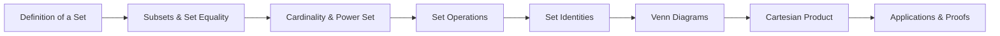

# Chapter 1: Sets

> **Previous:** None | **Next:** [Chapter 2: Logic](02-logic.md)

## Learning Objectives

After completing this chapter, you will be able to:

- Define sets, elements, and set membership using formal notation
- Determine subsets, proper subsets, and set equality
- Perform set operations: union, intersection, difference, symmetric difference, complement
- Construct and interpret Venn diagrams
- Compute power sets
- Work with Cartesian products
- Apply set identities in proofs

## Chapter at a Glance

| Topic | Key Insight | Practical Takeaway |
|-------|-------------|-------------------|
| Definition of a Set | A set is an unordered collection of distinct objects | Use roster or set-builder notation to precisely describe collections |
| Subsets and Set Equality | $A \subseteq B$ means every element of $A$ is in $B$ | Proving mutual subset inclusion is the standard way to prove set equality |
| Set Operations | Union, intersection, difference, complement combine sets | Venn diagrams provide intuition; formal definitions enable rigorous proofs |
| Power Set | $\mathcal{P}(S)$ is the set of all subsets of $S$ | A set of $n$ elements has $2^n$ subsets |
| Set Identities | De Morgan's and distributive laws are foundational | Use identity chains to simplify complex set expressions without element arguments |
| Cartesian Product | $A \times B$ is the set of all ordered pairs | Useful for defining relations, functions, and coordinate spaces |

## Chapter Roadmap

## Theory

### 1.1 Definition of a Set

A **set** is an unordered collection of distinct objects, called its **elements** or **members**. If $x$ is an element of the set $S$, we write $x \in S$. If $x$ is not an element of $S$, we write $x \notin S$.

A set may be specified by listing its elements in roster notation:
$$A = \{1, 2, 3, 4, 5\}$$

or by a set-builder (predicate) notation:
$$B = \{x \mid x \in \mathbb{N},\; x \text{ is even},\; x \leq 20\}$$

Standard number sets:
- $\mathbb{N} = \{0, 1, 2, 3, \ldots\}$ — natural numbers
- $\mathbb{Z} = \{\ldots, -2, -1, 0, 1, 2, \ldots\}$ — integers
- $\mathbb{Q} = \{a/b \mid a, b \in \mathbb{Z},\; b \neq 0\}$ — rational numbers
- $\mathbb{R}$ — real numbers

The **empty set** $\emptyset$ (or $\{\}$) contains no elements. The **universal set** $U$ is the set of all elements under consideration in a given context.

> **One-Sentence Takeaway:** A set is defined solely by its membership — two sets are equal iff they contain exactly the same elements, regardless of order.

### 1.2 Subsets

$A$ is a **subset** of $B$, written $A \subseteq B$, if every element of $A$ is also an element of $B$:
$$A \subseteq B \iff \forall x\,(x \in A \implies x \in B)$$

$A$ is a **proper subset** of $B$, written $A \subset B$, if $A \subseteq B$ and $A \neq B$.

**Theorem 1.1 (Set Equality).** $A = B$ if and only if $A \subseteq B$ and $B \subseteq A$.

**Theorem 1.2.** The empty set is a subset of every set: $\emptyset \subseteq S$ for any set $S$.

> **One-Sentence Takeaway:** Subset inclusion ($\subseteq$) is the fundamental ordering relation on sets, and proving $A \subseteq B$ and $B \subseteq A$ is how we prove $A = B$.

### 1.3 Cardinality

The **cardinality** of a finite set $S$, denoted $|S|$, is the number of distinct elements in $S$. For example, $|\{a, b, c\}| = 3$ and $|\emptyset| = 0$.

> **One-Sentence Takeaway:** Cardinality measures the size of a set; it is the gateway to counting arguments throughout discrete mathematics.

### 1.4 Power Set

The **power set** of $S$, denoted $\mathcal{P}(S)$ or $2^S$, is the set of all subsets of $S$:
$$\mathcal{P}(S) = \{T \mid T \subseteq S\}$$

**Theorem 1.3.** If $|S| = n$, then $|\mathcal{P}(S)| = 2^n$.

*Proof.* Each element of $S$ may either be in a given subset or not — two choices per element, independently, yielding $2^n$ subsets.

> **One-Sentence Takeaway:** A set of size $n$ has $2^n$ subsets — the power set grows exponentially.

### 1.5 Set Operations

Let $A$ and $B$ be sets.

- **Union:** $A \cup B = \{x \mid x \in A \lor x \in B\}$
- **Intersection:** $A \cap B = \{x \mid x \in A \land x \in B\}$
- **Difference:** $A \setminus B = \{x \mid x \in A \land x \notin B\}$
- **Symmetric difference:** $A \oplus B = (A \setminus B) \cup (B \setminus A)$
- **Complement (relative to $U$):** $\overline{A} = A^c = \{x \in U \mid x \notin A\}$

> **One-Sentence Takeaway:** Set operations — union, intersection, difference, complement — mirror logical connectives and form the algebra of sets.

### 1.6 Set Identities

For sets $A, B, C$ under universal set $U$:

| Identity | Expression |
|----------|-----------|
| Identity laws | $A \cup \emptyset = A$, $A \cap U = A$ |
| Domination laws | $A \cup U = U$, $A \cap \emptyset = \emptyset$ |
| Idempotent laws | $A \cup A = A$, $A \cap A = A$ |
| Complement law | $A \cup \overline{A} = U$, $A \cap \overline{A} = \emptyset$ |
| Double complement | $\overline{\overline{A}} = A$ |
| Commutative laws | $A \cup B = B \cup A$, $A \cap B = B \cap A$ |
| Associative laws | $A \cup (B \cup C) = (A \cup B) \cup C$, $A \cap (B \cap C) = (A \cap B) \cap C$ |
| Distributive laws | $A \cup (B \cap C) = (A \cup B) \cap (A \cup C)$, $A \cap (B \cup C) = (A \cap B) \cup (A \cap C)$ |
| De Morgan's laws | $\overline{A \cup B} = \overline{A} \cap \overline{B}$, $\overline{A \cap B} = \overline{A} \cup \overline{B}$ |

> **One-Sentence Takeaway:** Set identities like De Morgan's and distributive laws allow algebraic manipulation of set expressions without elementwise reasoning.

### 1.7 Venn Diagrams

Venn diagrams represent sets as overlapping regions in a plane. The universal set $U$ is a rectangle; sets are circles (or ovals) inside it. Shaded regions indicate the result of operations. For example, $A \cap B$ is the overlapping region of circles $A$ and $B$; $A \cup B$ is all area inside either circle.

> **One-Sentence Takeaway:** Venn diagrams provide visual intuition for set relationships but are not substitutes for formal proofs.

### 1.8 Cartesian Product

The **Cartesian product** of sets $A$ and $B$, written $A \times B$, is the set of all ordered pairs $(a, b)$ with $a \in A$ and $b \in B$:
$$A \times B = \{(a, b) \mid a \in A,\; b \in B\}$$

**Theorem 1.4.** $|A \times B| = |A| \cdot |B|$.

The $n$-fold Cartesian product $A_1 \times A_2 \times \cdots \times A_n$ is the set of all $n$-tuples $(a_1, a_2, \ldots, a_n)$ with $a_i \in A_i$.

> **One-Sentence Takeaway:** The Cartesian product builds ordered pairs from sets, and its size is the product of the individual set sizes — the foundation of relations and functions.

> **Pro Tip:** When proving set identities, start with the more complex side and reduce it to the simpler side using known identities — this is cleaner than elementwise arguments.
>
> **Pro Tip:** For finite sets, use the inclusion-exclusion principle $|A \cup B| = |A| + |B| - |A \cap B|$ to avoid double-counting elements.
>
> **Warning:** Do not confuse $\emptyset$ (the empty set, a set with no elements) with $\{\emptyset\}$ (a set containing the empty set as an element — its cardinality is 1).

## Concept Comparison Table

| Concept | Definition | Key Distinction | Use Case |
|---------|-----------|-----------------|----------|
| Subset ($\subseteq$) | All elements of $A$ are in $B$ | $A$ may equal $B$ | Building hierarchies of sets |
| Proper Subset ($\subset$) | $A \subseteq B$ and $A \neq B$ | Strict inclusion, $A$ is smaller | Precluding equality in proofs |
| Power Set ($\mathcal{P}(S)$) | Set of all subsets of $S$ | Contains $2^{|S|}$ elements | Counting all possible subsets |
| Cartesian Product ($\times$) | Set of all ordered pairs | Order matters; non-commutative | Defining coordinates and relations |
| Union ($\cup$) | Elements in either set | Inclusive OR logic | Combining sets without duplication |
| Intersection ($\cap$) | Elements in both sets | AND logic | Finding common elements |

## Quick Reference

| Notation | Meaning | Example |
|----------|---------|---------|
| $x \in S$ | $x$ is an element of $S$ | $2 \in \mathbb{N}$ |
| $A \subseteq B$ | $A$ is a subset of $B$ | $\{1\} \subseteq \{1,2\}$ |
| $A \cup B$ | Union of $A$ and $B$ | $\{1,2\} \cup \{2,3\} = \{1,2,3\}$ |
| $A \cap B$ | Intersection of $A$ and $B$ | $\{1,2\} \cap \{2,3\} = \{2\}$ |
| $A \setminus B$ | Set difference | $\{1,2\} \setminus \{2\} = \{1\}$ |
| $\overline{A}$ | Complement of $A$ | $U \setminus A$ |
| $A \times B$ | Cartesian product | $\{1\} \times \{a,b\} = \{(1,a),(1,b)\}$ |
| $\mathcal{P}(S)$ | Power set of $S$ | $\mathcal{P}(\{a\}) = \{\emptyset, \{a\}\}$ |
| $\emptyset$ | Empty set | $|\emptyset| = 0$ |

## Cross-Application Matrix

| Area | How Sets Apply |
|------|---------------|
| Database Queries | SQL UNION, INTERSECT, EXCEPT map directly to set operations |
| Probability | Sample spaces and events are sets; probability axioms use set operations |
| Computer Science | Formal languages, type theory, and relational algebra are built on sets |
| Logic | Truth sets of predicates connect logic to set membership |
| Graph Theory | Vertices and edges are sets; adjacency is a relation (set of ordered pairs) |
| Software Engineering | Collections, uniqueness constraints, and access control lists use set semantics |

## Chapter Quiz

1. If $|A| = 3$ and $|B| = 2$, what is $|A \times B|$?
   - A) 5
   - B) 6
   - C) 8
   - D) 9

   

Answer
**B)** $|A \times B| = |A| \cdot |B| = 3 \cdot 2 = 6$

2. Which of the following is NOT a subset of $\{1, 2, 3\}$?
   - A) $\emptyset$
   - B) $\{1, 2\}$
   - C) $\{1, 4\}$
   - D) $\{1, 2, 3\}$

   

Answer
**C)** $\{1, 4\}$ contains 4 which is not an element of $\{1, 2, 3\}$

3. $\overline{A \cap B}$ is equivalent to:
   - A) $\overline{A} \cap \overline{B}$
   - B) $\overline{A} \cup \overline{B}$
   - C) $A \cup B$
   - D) $\overline{A \cup B}$

   

Answer
**B)** By De Morgan's law, $\overline{A \cap B} = \overline{A} \cup \overline{B}$

## Examples Write the set of all positive odd integers less than 20 in roster and set-builder form.

*Solution.* Roster: $\{1, 3, 5, 7, 9, 11, 13, 15, 17, 19\}$.
Set-builder: $\{x \in \mathbb{N} \mid x < 20 \land x \bmod 2 = 1\}$.

**Example 1.2** (Subset verification). Let $A = \{1, 2, 3\}$, $B = \{1, 2, 3, 4, 5\}$, $C = \{1, 2, 3\}$. Then $A \subseteq B$, $A \subseteq C$, $C \subseteq A$, and $A = C$.

**Example 1.3** (Set operations). Let $U = \{1, 2, 3, 4, 5, 6, 7\}$, $A = \{1, 2, 3, 4\}$, $B = \{3, 4, 5, 6\}$. Compute:

- $A \cup B = \{1, 2, 3, 4, 5, 6\}$
- $A \cap B = \{3, 4\}$
- $A \setminus B = \{1, 2\}$
- $B \setminus A = \{5, 6\}$
- $\overline{A} = \{5, 6, 7\}$

**Example 1.4** (Power set). Find $\mathcal{P}(\{a, b\})$.

*Solution.* The subsets of $\{a, b\}$ are $\emptyset$, $\{a\}$, $\{b\}$, $\{a, b\}$. Thus $\mathcal{P}(\{a, b\}) = \{\emptyset, \{a\}, \{b\}, \{a, b\}\}$.

**Example 1.5** (Cartesian product). Let $A = \{1, 2\}$, $B = \{x, y\}$. Then
$$A \times B = \{(1, x), (1, y), (2, x), (2, y)\}$$

**Example 1.6** (Distributive law proof). Prove $A \cup (B \cap C) = (A \cup B) \cap (A \cup C)$.

*Proof.* Let $x \in A \cup (B \cap C)$. Then $x \in A$ or $x \in (B \cap C)$. If $x \in A$, then $x \in A \cup B$ and $x \in A \cup C$, so $x \in (A \cup B) \cap (A \cup C)$. If $x \in B \cap C$, then $x \in B$ and $x \in C$, so $x \in A \cup B$ and $x \in A \cup C$, hence $x \in (A \cup B) \cap (A \cup C)$. The reverse inclusion is analogous.

## Summary

- A set is a collection of distinct objects. Sets are equal when they contain exactly the same elements.
- $|S| = n$ implies $|\mathcal{P}(S)| = 2^n$.
- Union, intersection, difference, and complement generate new sets from existing ones.
- De Morgan's laws and the distributive laws are fundamental set identities.
- The Cartesian product $A \times B$ is the set of ordered pairs from $A$ and $B$.

## Exercises

### Review Questions

1. List all subsets of $\{1, 2, 3, 4\}$.
2. If $|A| = 5$ and $|B| = 3$, what is $|A \times B|$?
3. State De Morgan's laws for sets in words.
4. For $A = \{x \in \mathbb{Z} \mid -3 \leq x \leq 3\}$ and $B = \{x \in \mathbb{Z} \mid x^2 < 10\}$, determine $A \cap B$.
5. Is $\emptyset \in \mathcal{P}(\emptyset)$? Justify.

### Application Problems

6. Let $U = \{1, 2, \ldots, 10\}$, $A = \{1, 3, 5, 7, 9\}$, $B = \{2, 3, 5, 7\}$, $C = \{4, 5, 6, 7\}$. Compute:
   (a) $A \cup (B \cap C)$
   (b) $(A \cup B) \setminus C$
   (c) $\overline{A \cap B}$
   (d) $A \oplus B$

7. Prove the complement law: $A \cup \overline{A} = U$ and $A \cap \overline{A} = \emptyset$.

8. Prove De Morgan's law: $\overline{A \cap B} = \overline{A} \cup \overline{B}$ using elementwise argument.

9. Let $A = \{a, b\}$, $B = \{1, 2, 3\}$. List $A \times B$ and $B \times A$.

10. Show that $A \subseteq B$ if and only if $A \cap B = A$.

### Challenge Problem

11. Let $A_1, A_2, \ldots, A_n$ be sets. Prove the generalized distributive law:
    $$A \cap (B_1 \cup B_2 \cup \cdots \cup B_n) = (A \cap B_1) \cup (A \cap B_2) \cup \cdots \cup (A \cap B_n)$$
    by induction on $n$.
