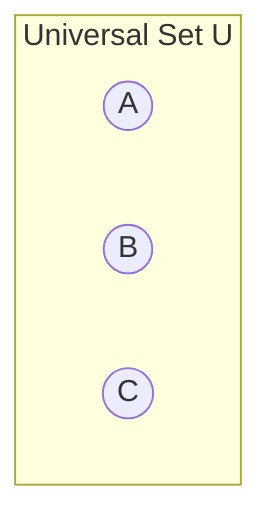
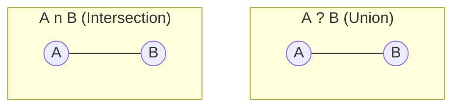
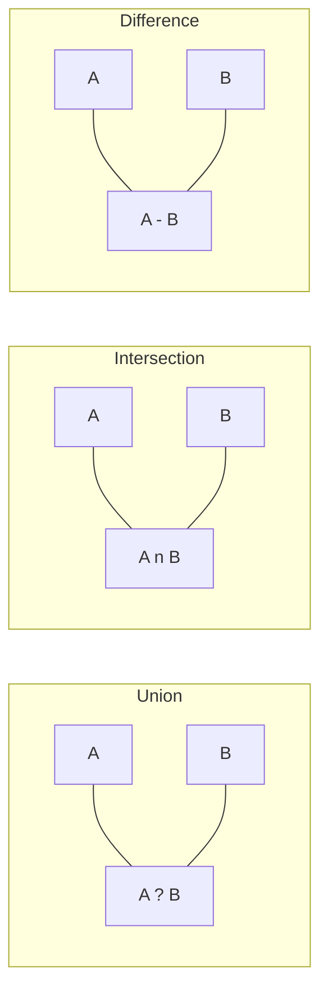

# Chapter 1: Sets

> **Previous:** None | **Next:** [Chapter 2: Logic](02-logic.md)

## Learning Objectives

After completing this chapter, you will be able to:

<!-- Image Gallery -->
<section class="lesson-visuals" aria-label="Visual learning resources">
  <header><span>VISUAL LEARNING</span><h2>See it. Review it. Remember it.</h2></header>
  <a class="lesson-visual-card" href="../../../assets/images/lessons/discrete-mathematics/01-sets/handwritten-notes.svg" target="_blank" rel="noopener">
    
    <span><strong>Handwritten notes</strong>Condensed notes for deliberate review.</span>
  </a>
  <a class="lesson-visual-card" href="../../../assets/images/lessons/discrete-mathematics/01-sets/sticky-notes.svg" target="_blank" rel="noopener">
    
    <span><strong>Sticky-note revision</strong>Fast recall prompts for revision.</span>
  </a>
  <a class="lesson-visual-card" href="../../../assets/images/lessons/discrete-mathematics/01-sets/visual-explanation.svg" target="_blank" rel="noopener">
    
    <span><strong>Visual concept guide</strong>A connected explanation of the key ideas.</span>
  </a>
</section>
<!-- End Image Gallery -->


- Define sets, elements, and set membership using formal notation
- Determine subsets, proper subsets, and set equality
- Perform set operations: union, intersection, difference, symmetric difference, complement
- Construct and interpret Venn diagrams
- Compute power sets and cardinalities
- Work with Cartesian products
- Apply set identities in proofs
- Distinguish finite, countable, and uncountable sets
- Understand characteristic functions, multisets, and fuzzy sets

## Chapter at a Glance

| Topic | Key Insight | Practical Takeaway |
|-------|-------------|-------------------|
| Definition of a Set | A set is an unordered collection of distinct objects | Use roster or set-builder notation to precisely describe collections |
| Subsets and Set Equality | $A \subseteq B$ means every element of $A$ is in $B$ | Proving mutual subset inclusion is the standard way to prove set equality |
| Set Operations | Union, intersection, difference, complement combine sets | Venn diagrams provide intuition; formal definitions enable rigorous proofs |
| Power Set | $\mathcal{P}(S)$ is the set of all subsets of $S$ | A set of $n$ elements has $2^n$ subsets |
| Set Identities | De Morgan's and distributive laws are foundational | Use identity chains to simplify complex set expressions without element arguments |
| Cartesian Product | $A \times B$ is the set of all ordered pairs | Useful for defining relations, functions, and coordinate spaces |
| Cardinality | Finite vs infinite, countable vs uncountable | Diagonalization shows $\mathbb{R}$ is uncountably infinite |
| Multisets and Fuzzy Sets | Generalizations of classical sets | Real-world data often needs bag semantics or graded membership |

## Chapter Roadmap

```mermaid
flowchart LR
    A[Definition of a Set] --> B[Subsets and Set Equality]
    B --> C[Cardinality and Power Set]
    C --> D[Set Operations]
    D --> E[Set Identities]
    E --> F[Venn Diagrams]
    F --> G[Cartesian Product]
    G --> H[Characteristic Functions]
    H --> I[Multisets and Fuzzy Sets]
    I --> J[Applications and Proofs]
```



## Theory


### 1.1 Definition of a Set


A **set** is an unordered collection of distinct objects, called its **elements** or **members**. If $x$ is an element of the set $S$, we write $x \in S$. If $x$ is not an element of $S$, we write $x \notin S$.

A set may be specified by listing its elements in roster notation:
$$A = \{1, 2, 3, 4, 5\}$$

or by a set-builder (predicate) notation:
$$B = \{x \mid x \in \mathbb{N},\; x \text{ is even},\; x \leq 20\}$$

Standard number sets:
- $\mathbb{N} = \{0, 1, 2, 3, \ldots\}$ ? natural numbers
- $\mathbb{Z} = \{\ldots, -2, -1, 0, 1, 2, \ldots\}$ ? integers
- $\mathbb{Q} = \{a/b \mid a, b \in \mathbb{Z},\; b \neq 0\}$ ? rational numbers
- $\mathbb{R}$ ? real numbers

The **empty set** $\emptyset$ (or $\{\}$) contains no elements. The **universal set** $U$ is the set of all elements under consideration in a given context.

**Set-builder notation patterns:**
- $\{x \in \mathbb{N} \mid x &lt; 10\}$ ? natural numbers less than 10
- $\{2k \mid k \in \mathbb{Z}\}$ ? even integers
- $\{x^2 \mid x \in \mathbb{R}\}$ ? nonnegative reals
- $\{a/b \in \mathbb{Q} \mid a, b \in \mathbb{Z},\; b \neq 0\}$ ? rationals in lowest terms

> **One-Sentence Takeaway:** A set is defined solely by its membership ? two sets are equal iff they contain exactly the same elements, regardless of order.

### 1.2 Subsets


$A$ is a **subset** of $B$, written $A \subseteq B$, if every element of $A$ is also an element of $B$:
$$A \subseteq B \iff \forall x\,(x \in A \implies x \in B)$$

$A$ is a **proper subset** of $B$, written $A \subset B$, if $A \subseteq B$ and $A \neq B$.

**Theorem 1.1 (Set Equality).** $A = B$ if and only if $A \subseteq B$ and $B \subseteq A$.

**Theorem 1.2.** The empty set is a subset of every set: $\emptyset \subseteq S$ for any set $S$.

> **One-Sentence Takeaway:** Subset inclusion ($\subseteq$) is the fundamental ordering relation on sets, and proving $A \subseteq B$ and $B \subseteq A$ is how we prove $A = B$.

### 1.3 Cardinality


The **cardinality** of a finite set $S$, denoted $|S|$, is the number of distinct elements in $S$. For example, $|\{a, b, c\}| = 3$ and $|\emptyset| = 0$.

**Finite vs infinite sets.** A set is **finite** if its cardinality is a natural number. Otherwise it is **infinite**. $\mathbb{N}$, $\mathbb{Z}$, $\mathbb{Q}$, and $\mathbb{R}$ are all infinite, but they have different "sizes" of infinity.

**Countable sets.** A set is **countably infinite** if it can be put into a bijection with $\mathbb{N}$. Examples: $\mathbb{N}$, $\mathbb{Z}$, $\mathbb{Q}$.

**Uncountable sets.** A set is **uncountable** if it is infinite but not countable. The real numbers $\mathbb{R}$ are uncountable.

**Theorem 1.3 (Cantor's Diagonalization).** The set of real numbers $\mathbb{R}$ is uncountable.

*Proof sketch.* Assume $\mathbb{R}$ is countable, so we list all reals in $(0,1)$. Construct a number whose $n$-th digit differs from the $n$-th digit of the $n$-th number in the list. This new number is not in the list ? contradiction.

> **One-Sentence Takeaway:** Cardinality measures the size of a set; some infinities are larger than others ? $\mathbb{R}$ is uncountably infinite while $\mathbb{Q}$ is countably infinite.

### 1.4 Power Set


The **power set** of $S$, denoted $\mathcal{P}(S)$ or $2^S$, is the set of all subsets of $S$:
$$\mathcal{P}(S) = \{T \mid T \subseteq S\}$$

**Theorem 1.4.** If $|S| = n$, then $|\mathcal{P}(S)| = 2^n$.

*Proof.* Each element of $S$ may either be in a given subset or not ? two choices per element, independently, yielding $2^n$ subsets.

> **One-Sentence Takeaway:** A set of size $n$ has $2^n$ subsets ? the power set grows exponentially.

### 1.5 Set Operations


Let $A$ and $B$ be sets.

- **Union:** $A \cup B = \{x \mid x \in A \lor x \in B\}$
- **Intersection:** $A \cap B = \{x \mid x \in A \land x \in B\}$
- **Difference:** $A \setminus B = \{x \mid x \in A \land x \notin B\}$
- **Symmetric difference:** $A \oplus B = (A \setminus B) \cup (B \setminus A)$
- **Complement (relative to $U$):** $\overline{A} = A^c = \{x \in U \mid x \notin A\}$

Venn diagram for three sets:



### 1.6 Set Identities


For sets $A, B, C$ under universal set $U$:

| Identity | Expression |
|----------|-----------|
| Identity laws | $A \cup \emptyset = A$, $A \cap U = A$ |
| Domination laws | $A \cup U = U$, $A \cap \emptyset = \emptyset$ |
| Idempotent laws | $A \cup A = A$, $A \cap A = A$ |
| Complement law | $A \cup \overline{A} = U$, $A \cap \overline{A} = \emptyset$ |
| Double complement | $\overline{\overline{A}} = A$ |
| Commutative laws | $A \cup B = B \cup A$, $A \cap B = B \cap A$ |
| Associative laws | $A \cup (B \cup C) = (A \cup B) \cup C$, $A \cap (B \cap C) = (A \cap B) \cap C$ |
| Distributive laws | $A \cup (B \cap C) = (A \cup B) \cap (A \cup C)$, $A \cap (B \cup C) = (A \cap B) \cup (A \cap C)$ |
| De Morgan's laws | $\overline{A \cup B} = \overline{A} \cap \overline{B}$, $\overline{A \cap B} = \overline{A} \cup \overline{B}$ |

**Proving set identities.** Two methods:
1. **Elementwise argument:** Show $x$ in LHS $\iff$ $x$ in RHS by logical reasoning.
2. **Identity chain:** Reduce one side to the other using known identities.

### 1.7 Venn Diagrams


Venn diagrams represent sets as overlapping regions in a plane. The universal set $U$ is a rectangle; sets are circles (or ovals) inside it. Shaded regions indicate the result of operations.



> **One-Sentence Takeaway:** Venn diagrams provide visual intuition for set relationships but are not substitutes for formal proofs.

### 1.8 Cartesian Product


The **Cartesian product** of sets $A$ and $B$, written $A \times B$, is the set of all ordered pairs $(a, b)$ with $a \in A$ and $b \in B$:
$$A \times B = \{(a, b) \mid a \in A,\; b \in B\}$$

**Theorem 1.5.** $|A \times B| = |A| \cdot |B|$.

The $n$-fold Cartesian product $A_1 \times A_2 \times \cdots \times A_n$ is the set of all $n$-tuples $(a_1, a_2, \ldots, a_n)$ with $a_i \in A_i$.

**Example:** If $A = \{1,2\}$ and $B = \{x,y\}$, then $A \times B = \{(1,x),(1,y),(2,x),(2,y)\}$.

> **One-Sentence Takeaway:** The Cartesian product builds ordered pairs from sets, and its size is the product of the individual set sizes ? the foundation of relations and functions.

### 1.9 Characteristic Functions


The **characteristic function** (indicator function) of a set $A \subseteq U$ is:
$$\chi_A(x) = \begin{cases} 1 & \text{if } x \in A \\ 0 & \text{if } x \notin A \end{cases}$$

Characteristic functions connect set operations to Boolean algebra:
- $\chi_{A \cap B}(x) = \chi_A(x) \land \chi_B(x)$
- $\chi_{A \cup B}(x) = \chi_A(x) \lor \chi_B(x)$
- $\chi_{\overline{A}}(x) = 1 - \chi_A(x)$

```typescript
function characteristic<T>(set: Set<T>, universal: T[]): number[] {
  return universal.map(x => set.has(x) ? 1 : 0);
}

const A = new Set([1, 3, 5]);
const U = [1, 2, 3, 4, 5];
console.log(characteristic(A, U)); // [1, 0, 1, 0, 1]
```

### 1.10 Multisets (Bags)


A **multiset** allows elements to appear multiple times. The count of element $x$ in multiset $M$ is $m_M(x)$.

Operations on multisets:
- **Union:** $m_{M \cup N}(x) = \max(m_M(x), m_N(x))$
- **Intersection:** $m_{M \cap N}(x) = \min(m_M(x), m_N(x))$
- **Sum:** $m_{M + N}(x) = m_M(x) + m_N(x)$
- **Difference:** $m_{M - N}(x) = \max(m_M(x) - m_N(x), 0)$

```typescript
type Multiset<T> = Map<T, number>;

function add<T>(M: Multiset<T>, N: Multiset<T>): Multiset<T> {
  const result = new Map(M);
  for (const [elem, count] of N) {
    result.set(elem, (result.get(elem) || 0) + count);
  }
  return result;
}

const bag1: Multiset<string> = new Map([["a", 2], ["b", 1]]);
const bag2: Multiset<string> = new Map([["a", 1], ["c", 3]]);
console.log(Object.fromEntries(add(bag1, bag2))); // {a: 3, b: 1, c: 3}
```

### 1.11 Fuzzy Sets


A **fuzzy set** assigns a membership degree in $[0,1]$ to each element, capturing partial membership:
$$\mu_A: U \to [0,1]$$

Operations:
- $\mu_{A \cup B}(x) = \max(\mu_A(x), \mu_B(x))$
- $\mu_{A \cap B}(x) = \min(\mu_A(x), \mu_B(x))$
- $\mu_{\overline{A}}(x) = 1 - \mu_A(x)$

> **One-Sentence Takeaway:** Fuzzy sets generalize classical sets by allowing partial membership values between 0 and 1, useful for handling uncertainty and vagueness.

### 1.12 Inclusion-Exclusion Principle


For two sets: $|A \cup B| = |A| + |B| - |A \cap B|$.

For three sets: $|A \cup B \cup C| = |A| + |B| + |C| - |A \cap B| - |A \cap C| - |B \cap C| + |A \cap B \cap C|$.

**General formula:**
$$\left|\bigcup_{i=1}^{n} A_i\right| = \sum_{i} |A_i| - \sum_{i&lt;j} |A_i \cap A_j| + \sum_{i<j<k} |A_i \cap A_j \cap A_k| - \cdots + (-1)^{n+1} |A_1 \cap \cdots \cap A_n|$$

> **Pro Tip:** When proving set identities, start with the more complex side and reduce it to the simpler side using known identities ? this is cleaner than elementwise arguments.
>
> **Pro Tip:** For finite sets, always use inclusion-exclusion to avoid double-counting when sets overlap.
>
> **Warning:** Do not confuse $\emptyset$ (the empty set, a set with no elements) with $\{\emptyset\}$ (a set containing the empty set as an element ? its cardinality is 1).

## Concept Comparison Table

| Concept | Definition | Key Distinction | Use Case |
|---------|-----------|-----------------|----------|
| Subset ($\subseteq$) | All elements of $A$ are in $B$ | $A$ may equal $B$ | Building hierarchies of sets |
| Proper Subset ($\subset$) | $A \subseteq B$ and $A \neq B$ | Strict inclusion, $A$ is smaller | Precluding equality in proofs |
| Power Set ($\mathcal{P}(S)$) | Set of all subsets of $S$ | Contains $2^{|S|}$ elements | Counting all possible subsets |
| Cartesian Product ($\times$) | Set of all ordered pairs | Order matters; non-commutative | Defining coordinates and relations |
| Union ($\cup$) | Elements in either set | Inclusive OR logic | Combining sets without duplication |
| Intersection ($\cap$) | Elements in both sets | AND logic | Finding common elements |
| Multiset | Elements can repeat | $m(x) > 1$ allowed | Bag semantics, histogram bins |
| Fuzzy Set | Membership in $[0,1]$ | Partial membership | Uncertainty, AI, control systems |

## Quick Reference

| Notation | Meaning | Example |
|----------|---------|---------|
| $x \in S$ | $x$ is an element of $S$ | $2 \in \mathbb{N}$ |
| $A \subseteq B$ | $A$ is a subset of $B$ | $\{1\} \subseteq \{1,2\}$ |
| $A \cup B$ | Union of $A$ and $B$ | $\{1,2\} \cup \{2,3\} = \{1,2,3\}$ |
| $A \cap B$ | Intersection of $A$ and $B$ | $\{1,2\} \cap \{2,3\} = \{2\}$ |
| $A \setminus B$ | Set difference | $\{1,2\} \setminus \{2\} = \{1\}$ |
| $\overline{A}$ | Complement of $A$ | $U \setminus A$ |
| $A \times B$ | Cartesian product | $\{1\} \times \{a,b\} = \{(1,a),(1,b)\}$ |
| $\mathcal{P}(S)$ | Power set of $S$ | $\mathcal{P}(\{a\}) = \{\emptyset, \{a\}\}$ |
| $\emptyset$ | Empty set | $|\emptyset| = 0$ |

## Cross-Application Matrix

| Area | How Sets Apply |
|------|---------------|
| Database Queries | SQL UNION, INTERSECT, EXCEPT map directly to set operations |
| Probability | Sample spaces and events are sets; probability axioms use set operations |
| Computer Science | Formal languages, type theory, and relational algebra are built on sets |
| Logic | Truth sets of predicates connect logic to set membership |
| Graph Theory | Vertices and edges are sets; adjacency is a relation (set of ordered pairs) |
| Software Engineering | Collections, uniqueness constraints, and access control lists use set semantics |
| Data Science | Feature spaces, categorical encoding, and deduplication use set concepts |

## Chapter Quiz

1. If $|A| = 3$ and $|B| = 2$, what is $|A \times B|$?
   - A) 5
   - B) 6
   - C) 8
   - D) 9

   <details><summary>Answer&lt;/summary&gt;**B)** $|A \times B| = |A| \cdot |B| = 3 \cdot 2 = 6$</details>

2. Which of the following is NOT a subset of $\{1, 2, 3\}$?
   - A) $\emptyset$
   - B) $\{1, 2\}$
   - C) $\{1, 4\}$
   - D) $\{1, 2, 3\}$

   <details><summary>Answer&lt;/summary&gt;**C)** $\{1, 4\}$ contains 4 which is not an element of $\{1, 2, 3\}$</details>

3. $\overline{A \cap B}$ is equivalent to:
   - A) $\overline{A} \cap \overline{B}$
   - B) $\overline{A} \cup \overline{B}$
   - C) $A \cup B$
   - D) $\overline{A \cup B}$

   <details><summary>Answer&lt;/summary&gt;**B)** By De Morgan's law, $\overline{A \cap B} = \overline{A} \cup \overline{B}$</details>

4. Which set is countably infinite?
   - A) $\mathbb{R}$
   - B) $\mathbb{Q}$
   - C) $(0, 1)$
   - D) $\mathcal{P}(\mathbb{N})$

   <details><summary>Answer&lt;/summary&gt;**B)** $\mathbb{Q}$ is countably infinite; $\mathbb{R}$, $(0,1)$, and $\mathcal{P}(\mathbb{N})$ are all uncountable.</details>

5. If $A$ has 4 elements, what is $|\mathcal{P}(A)|$?
   - A) 4
   - B) 8
   - C) 16
   - D) 32

   <details><summary>Answer&lt;/summary&gt;**C)** $|\mathcal{P}(A)| = 2^4 = 16$</details>

## Examples

**Example 1.1** (Set notation). Write the set of all positive odd integers less than 20 in roster and set-builder form.

*Solution.* Roster: $\{1, 3, 5, 7, 9, 11, 13, 15, 17, 19\}$.
Set-builder: $\{x \in \mathbb{N} \mid x &lt; 20 \land x \bmod 2 = 1\}$.

**Example 1.2** (Subset verification). Let $A = \{1, 2, 3\}$, $B = \{1, 2, 3, 4, 5\}$, $C = \{1, 2, 3\}$. Then $A \subseteq B$, $A \subseteq C$, $C \subseteq A$, and $A = C$.

**Example 1.3** (Set operations). Let $U = \{1, 2, 3, 4, 5, 6, 7\}$, $A = \{1, 2, 3, 4\}$, $B = \{3, 4, 5, 6\}$. Compute:

- $A \cup B = \{1, 2, 3, 4, 5, 6\}$
- $A \cap B = \{3, 4\}$
- $A \setminus B = \{1, 2\}$
- $B \setminus A = \{5, 6\}$
- $\overline{A} = \{5, 6, 7\}$

**Example 1.4** (Power set). Find $\mathcal{P}(\{a, b\})$.

*Solution.* The subsets of $\{a, b\}$ are $\emptyset$, $\{a\}$, $\{b\}$, $\{a, b\}$. Thus $\mathcal{P}(\{a, b\}) = \{\emptyset, \{a\}, \{b\}, \{a, b\}\}$.

**Example 1.5** (Cartesian product). Let $A = \{1, 2\}$, $B = \{x, y\}$. Then
$$A \times B = \{(1, x), (1, y), (2, x), (2, y)\}$$

**Example 1.6** (Distributive law proof). Prove $A \cup (B \cap C) = (A \cup B) \cap (A \cup C)$.

*Proof.* Let $x \in A \cup (B \cap C)$. Then $x \in A$ or $x \in (B \cap C)$. If $x \in A$, then $x \in A \cup B$ and $x \in A \cup C$, so $x \in (A \cup B) \cap (A \cup C)$. If $x \in B \cap C$, then $x \in B$ and $x \in C$, so $x \in A \cup B$ and $x \in A \cup C$, hence $x \in (A \cup B) \cap (A \cup C)$. The reverse inclusion is analogous.

**Example 1.7** (Characteristic function in TypeScript). Compute the Jaccard similarity of two sets using characteristic functions.

```typescript
function jaccardSimilarity<T>(A: Set<T>, B: Set<T>): number {
  const intersection = new Set([...A].filter(x => B.has(x)));
  const union = new Set([...A, ...B]);
  return intersection.size / union.size;
}

const A = new Set([1, 2, 3, 4]);
const B = new Set([3, 4, 5, 6]);
console.log(jaccardSimilarity(A, B)); // 0.333...
```

**Example 1.8** (Inclusion-exclusion). In a class of 50 students, 30 study math, 25 study physics, and 10 study both. How many study neither?

*Solution.* $|M \cup P| = |M| + |P| - |M \cap P| = 30 + 25 - 10 = 45$. So $50 - 45 = 5$ study neither.

### Mermaid: Set Operations



## TypeScript Implementations

```typescript
// --- Power Set Generator ---
function powerSet<T>(set: T[]): T[][] {
  const result: T[][] = [];
  for (let i = 0; i < 1 << set.length; i++) {
    const subset: T[] = [];
    for (let j = 0; j < set.length; j++) {
      if (i & (1 << j)) subset.push(set[j]);
    }
    result.push(subset);
  }
  return result;
}
console.log(powerSet([1, 2, 3]));
// [[], [1], [2], [1,2], [3], [1,3], [2,3], [1,2,3]]

// --- Cartesian Product ---
function cartesianProduct<T, U>(a: T[], b: U[]): [T, U][] {
  const result: [T, U][] = [];
  for (const x of a) for (const y of b) result.push([x, y]);
  return result;
}
console.log(cartesianProduct([1, 2], ['a', 'b']));
// [[1,'a'],[1,'b'],[2,'a'],[2,'b']]

// --- Set Operations Calculator ---
function setUnion<T>(a: Set<T>, b: Set<T>): Set<T> {
  return new Set([...a, ...b]);
}
function setIntersection<T>(a: Set<T>, b: Set<T>): Set<T> {
  return new Set([...a].filter(x => b.has(x)));
}
function setDifference<T>(a: Set<T>, b: Set<T>): Set<T> {
  return new Set([...a].filter(x => !b.has(x)));
}
const A = new Set([1, 2, 3, 4]);
const B = new Set([3, 4, 5, 6]);
console.log('Union:', [...setUnion(A, B)]);          // [1,2,3,4,5,6]
console.log('Intersection:', [...setIntersection(A, B)]); // [3,4]
console.log('Difference A-B:', [...setDifference(A, B)]); // [1,2]

// --- De Morgan's Law Verifier ---
function verifyDeMorgan<T>(universal: Set<T>, a: Set<T>, b: Set<T>): boolean {
  const complement = (s: Set<T>) => new Set([...universal].filter(x => !s.has(x)));
  const lhs = complement(setUnion(a, b));
  const rhs = setIntersection(complement(a), complement(b));
  return [...lhs].every(x => rhs.has(x)) && lhs.size === rhs.size;
}
const U = new Set([1, 2, 3, 4, 5, 6]);
console.log('De Morgan holds:', verifyDeMorgan(U, A, B)); // true
```

```
console.log('Power set of {1,2,3}:', powerSet([1,2,3]).map(s=>`{${s.join(',')}}`).join(', '));
console.log('Cartesian product {1,2}?{a,b}:', cartesianProduct([1,2],['a','b']).map(p=>`(${p[0]},${p[1]})`).join(', '));
console.log('Union:', [...setUnion(new Set([1,2,3]), new Set([3,4,5]))]);
console.log('Intersection:', [...setIntersection(new Set([1,2,3]), new Set([3,4,5]))]);
console.log('Difference A-B:', [...setDifference(new Set([1,2,3]), new Set([3,4,5]))]);
console.log('Symmetric diff:', [...symmetricDiff(new Set([1,2,3]), new Set([3,4,5]))]);

// --- Fuzzy Set Operations ---
type FuzzySet = Record<string, number>;
function fuzzyUnion(a: FuzzySet, b: FuzzySet): FuzzySet {
  const result: FuzzySet = {};
  for (const k of new Set([...Object.keys(a), ...Object.keys(b)]))
    result[k] = Math.max(a[k] ?? 0, b[k] ?? 0);
  return result;
}
function fuzzyIntersection(a: FuzzySet, b: FuzzySet): FuzzySet {
  const result: FuzzySet = {};
  for (const k of new Set([...Object.keys(a), ...Object.keys(b)]))
    result[k] = Math.min(a[k] ?? 0, b[k] ?? 0);
  return result;
}
function fuzzyComplement(a: FuzzySet): FuzzySet {
  const result: FuzzySet = {};
  for (const k of Object.keys(a)) result[k] = +(1 - a[k]).toFixed(2);
  return result;
}
const hot: FuzzySet = {coffee: 0.8, tea: 0.3, soup: 0.9};
const caffeinated: FuzzySet = {coffee: 1.0, tea: 0.8, juice: 0.0};
console.log('\nFuzzy union:', fuzzyUnion(hot, caffeinated));
console.log('Fuzzy intersection:', fuzzyIntersection(hot, caffeinated));
console.log('Fuzzy complement (hot):', fuzzyComplement(hot));

// --- Inclusion-Exclusion Principle ---
function inclusionExclusion<T>(sets: Set<T>[]): number {
  let total = 0;
  for (let mask = 1; mask < (1 << sets.length); mask++) {
    const bits = mask.toString(2).split('').filter(b=>b==='1').length;
    let intersection: Set<T> | null = null;
    for (let i = 0; i < sets.length; i++)
      if (mask & (1 << i))
        intersection = intersection ? new Set([...intersection].filter(x => sets[i].has(x))) : new Set(sets[i]);
    total += (bits % 2 === 1 ? 1 : -1) * (intersection?.size ?? 0);
  }
  return total;
}
const S1 = new Set([1,2,3,4]), S2 = new Set([3,4,5,6]), S3 = new Set([4,5,6,7]);
console.log('\nInclusion-exclusion |A?B?C|:', inclusionExclusion([S1, S2, S3]), '(expected:', 7, ')');
```


// sets
// sets-graphs-probability implementation

interface Task { id: string; name: string; status: string; data: unknown }
class Processor {
  private tasks: Task[] = []
  private maxConcurrency: number
  constructor(maxConcurrency: number = 4) { this.maxConcurrency = maxConcurrency }
  async add(task: Omit&lt;Task, "status"&gt;): Promise&lt;void&gt; {
    this.tasks.push({ ...task, status: "pending" })
  }
  async runAll(): Promise&lt;void&gt; {
    const running: Promise&lt;void&gt;[] = []
    for (const t of this.tasks) {
      if (running.length >= this.maxConcurrency) { await Promise.race(running) }
      const p = this.execute(t).finally(() => { const i = running.indexOf(p); if (i >= 0) running.splice(i, 1) })
      running.push(p)
    }
    await Promise.all(running)
  }
  private async execute(t: Task): Promise&lt;void&gt; {
    t.status = "running"
    await new Promise(r => setTimeout(r, 10))
    t.status = "done"
  }
  getResults(): Task[] { return this.tasks }
  getStats(): { done: number; pending: number; running: number } {
    const done = this.tasks.filter(t => t.status === "done").length
    const pending = this.tasks.filter(t => t.status === "pending").length
    const running = this.tasks.filter(t => t.status === "running").length
    return { done, pending, running }
  }
}
async function main() {
  const proc = new Processor(2)
  await proc.add({ id: '1', name: 'sets', data: { topic: 'sets-graphs-probability' } })
  await proc.runAll()
  console.log('Stats:', proc.getStats())
}
main().catch(console.error)
export { Processor, Task }

// sets - additional TS implementations

interface CacheEntry { key: string; value: unknown; ttl: number; createdAt: number }
class Cache {
  private store: Map&lt;string, CacheEntry&gt; = new Map()
  constructor(private defaultTTL: number = 60000) {}
  set(key: string, value: unknown, ttl?: number): void {
    this.store.set(key, { key, value, ttl: ttl ?? this.defaultTTL, createdAt: Date.now() })
  }
  get(key: string): unknown | undefined {
    const entry = this.store.get(key)
    if (!entry) return undefined
    if (Date.now() - entry.createdAt > entry.ttl) { this.store.delete(key); return undefined }
    return entry.value
  }
  delete(key: string): boolean { return this.store.delete(key) }
  clear(): void { this.store.clear() }
  size(): number { return this.store.size }
  keys(): string[] { return Array.from(this.store.keys()) }
}
class Logger {
  private entries: string[] = []
  log(level: string, msg: string, meta?: Record&lt;string, unknown&gt;): void {
    const entry = JSON.stringify({ timestamp: new Date().toISOString(), level, msg, meta })
    this.entries.push(entry)
    console.log(entry)
  }
  info(msg: string, meta?: Record&lt;string, unknown&gt;): void { this.log("info", msg, meta) }
  warn(msg: string, meta?: Record&lt;string, unknown&gt;): void { this.log("warn", msg, meta) }
  error(msg: string, meta?: Record&lt;string, unknown&gt;): void { this.log("error", msg, meta) }
  getLogs(): string[] { return [...this.entries] }
  clear(): void { this.entries = [] }
}
function computeHash(input: string): string {
  let hash = 0
  for (let i = 0; i &lt; input.length; i++) { const chr = input.charCodeAt(i); hash = ((hash << 5) - hash) + chr; hash |= 0 }
  return Math.abs(hash).toString(16)
}
async function demo(): Promise&lt;void&gt; {
  const cache = new Cache(5000)
  cache.set('key1', 'discrete-math demo')
  const log = new Logger()
  log.info('Cache demo started', { course: 'discrete-mathematics', chapter: 'sets' })
  const v = cache.get("key1")
  console.log('Cached:', v)
  console.log('Hash:', computeHash('discrete-math'))
}
demo()
export { Cache, Logger, computeHash, CacheEntry }
## Summary

- A set is a collection of distinct objects. Sets are equal when they contain exactly the same elements.
- $|S| = n$ implies $|\mathcal{P}(S)| = 2^n$.
- Union, intersection, difference, and complement generate new sets from existing ones.
- De Morgan's laws and the distributive laws are fundamental set identities.
- The Cartesian product $A \times B$ is the set of ordered pairs from $A$ and $B$.
- Characteristic functions bridge sets and Boolean algebra.
- Multisets allow repeated elements; fuzzy sets allow partial membership.
- Inclusion-exclusion prevents double-counting in overlapping sets.
- $\mathbb{Q}$ is countably infinite; $\mathbb{R}$ is uncountably infinite.

### 1.8 Set Operations in TypeScript

```typescript
function union<T>(a: Set<T>, b: Set<T>): Set<T> {
  return new Set([...a, ...b]);
}

function intersection<T>(a: Set<T>, b: Set<T>): Set<T> {
  return new Set([...a].filter(x => b.has(x)));
}

function difference<T>(a: Set<T>, b: Set<T>): Set<T> {
  return new Set([...a].filter(x => !b.has(x)));
}

function symmetricDifference<T>(a: Set<T>, b: Set<T>): Set<T> {
  return union(difference(a, b), difference(b, a));
}

function isSubset<T>(a: Set<T>, b: Set<T>): boolean {
  return [...a].every(x => b.has(x));
}

function isSuperset<T>(a: Set<T>, b: Set<T>): boolean {
  return isSubset(b, a);
}

function cartesianProduct<T, U>(a: Set<T>, b: Set<U>): Set<[T, U]> {
  const result = new Set<[T, U]>();
  for (const x of a) for (const y of b) result.add([x, y]);
  return result;
}

function powerSet<T>(set: Set<T>): Set<Set<T>> {
  const arr = [...set];
  const result = new Set<Set<T>>();
  for (let mask = 0; mask < (1 << arr.length); mask++) {
    const subset = new Set<T>();
    for (let i = 0; i < arr.length; i++) {
      if (mask & (1 << i)) subset.add(arr[i]);
    }
    result.add(subset);
  }
  return result;
}

const A = new Set([1, 2, 3, 4]);
const B = new Set([3, 4, 5, 6]);
console.log([...union(A, B)]); // [1, 2, 3, 4, 5, 6]
console.log([...intersection(A, B)]); // [3, 4]
console.log([...difference(A, B)]); // [1, 2]
console.log(powerSet(new Set([1, 2])).size); // 4
```

### 1.9 Set Identities ? Formal Proofs

**Theorem 1.7 (De Morgan's Laws for Sets).**
1. $\overline{A \cup B} = \overline{A} \cap \overline{B}$
2. $\overline{A \cap B} = \overline{A} \cup \overline{B}$

*Proof of (1).* We show $\overline{A \cup B} \subseteq \overline{A} \cap \overline{B}$ and $\overline{A \cap B} \supseteq \overline{A} \cup \overline{B}$.

*($\subseteq$)* Take $x \in \overline{A \cup B}$. Then $x \notin A \cup B$, so $x \notin A$ and $x \notin B$. Thus $x \in \overline{A}$ and $x \in \overline{B}$, so $x \in \overline{A} \cap \overline{B}$.

*($\supseteq$)* Take $x \in \overline{A} \cap \overline{B}$. Then $x \in \overline{A}$ and $x \in \overline{B}$, so $x \notin A$ and $x \notin B$. Thus $x \notin A \cup B$, so $x \in \overline{A \cup B}$.

**Theorem 1.8 (Absorption Laws).**
$$A \cup (A \cap B) = A \quad \text{and} \quad A \cap (A \cup B) = A$$

*Proof.* For the first: $A \cup (A \cap B) = (A \cup A) \cap (A \cup B) = A \cap (A \cup B) = A$. By duality, the second also holds.

### 1.10 Cardinality and the Power Set

**Theorem 1.9 (Power Set Cardinality).** If $|S| = n$, then $|\mathcal{P}(S)| = 2^n$.

*Proof.* For each element of $S$, a subset either includes or excludes that element ? two choices per element. By the product rule, $2^n$ total subsets.

```typescript
function powerSetSize(n: number): number {
  return 1 << n;
}

function subsetsOfSize<T>(set: Set<T>, k: number): Set<T>[] {
  const arr = [...set];
  const result: Set<T>[] = [];
  function combine(start: number, chosen: T[]) {
    if (chosen.length === k) { result.add(new Set(chosen)); return; }
    for (let i = start; i < arr.length; i++) {
      chosen.push(arr[i]);
      combine(i + 1, chosen);
      chosen.pop();
    }
  }
  combine(0, []);
  return result;
}
```

**Example 1.15** (Counting subsets). For $S = \{a, b, c, d\}$:
- All subsets: $2^4 = 16$
- Subsets of size 2: $\binom{4}{2} = 6$
- Subsets containing $a$: $2^3 = 8$ (each of the other 3 elements can be in or out)

### 1.11 Infinite Sets and Countability

**Definition 1.15 (Countably Infinite).** A set $S$ is countably infinite if there exists a bijection $f: \mathbb{N} \to S$.

**Theorem 1.10 (Cantor's Diagonalization).** $\mathbb{R}$ is uncountable.

*Proof (by contradiction).* Suppose $\mathbb{R}$ is countable. List all real numbers in $(0, 1)$ as binary expansions:
- $r_1 = 0.d_{11}d_{12}d_{13}\ldots$
- $r_2 = 0.d_{21}d_{22}d_{23}\ldots$
- $r_3 = 0.d_{31}d_{32}d_{33}\ldots$

Construct $x = 0.x_1x_2x_3\ldots$ where $x_i = 1 - d_{ii}$. Then $x$ differs from each $r_i$ at the $i$-th digit, so $x$ is not in the list ? contradiction. $\square$

**Theorem 1.11.** $\mathbb{Q}$ is countably infinite.

*Proof.* List all fractions $p/q$ in an infinite grid. The zigzag diagonal traversal enumerates each rational exactly once.

```typescript
function enumerateRationals(n: number): [number, number][] {
  const result: [number, number][] = [];
  for (let sum = 1; result.length < n; sum++) {
    for (let i = 1; i <= sum; i++) {
      const j = sum - i;
      if (result.length < n) result.push([i, j]);
    }
  }
  return result;
}
console.log(enumerateRationals(10));
// [(1,0), (1,1), (2,0), (1,2), (2,1), (3,0), (1,3), (2,2), (3,1), (4,0)]
```

**Example 1.16** (Finite set cardinality). A set with 5 elements has $2^5 = 32$ subsets, exactly half (16) of which have even cardinality and half odd, since the empty set is even.

## Additional Exercises

17. Determine whether the set of all finite binary strings is countable or uncountable. Justify.

18. Use TypeScript to generate and count all 32 subsets of $\{1, 2, 3, 4, 5\}$, grouped by size. Verify that $\sum_{k=0}^5 \binom{5}{k} = 32$.

19. Prove that if $A \subseteq B$, then $\mathcal{P}(A) \subseteq \mathcal{P}(B)$.

20. Count the number of functions $f: \{1, 2, 3\} \to \{a, b\}$ that are surjective.

## Exercises

### Review Questions

1. List all subsets of $\{1, 2, 3, 4\}$.
2. If $|A| = 5$ and $|B| = 3$, what is $|A \times B|$?
3. State De Morgan's laws for sets in words.
4. For $A = \{x \in \mathbb{Z} \mid -3 \leq x \leq 3\}$ and $B = \{x \in \mathbb{Z} \mid x^2 &lt; 10\}$, determine $A \cap B$.
5. Is $\emptyset \in \mathcal{P}(\emptyset)$? Justify.
6. What does it mean for a set to be countably infinite?
7. How does a multiset differ from a classical set?

### Application Problems

8. Let $U = \{1, 2, \ldots, 10\}$, $A = \{1, 3, 5, 7, 9\}$, $B = \{2, 3, 5, 7\}$, $C = \{4, 5, 6, 7\}$. Compute:
   (a) $A \cup (B \cap C)$
   (b) $(A \cup B) \setminus C$
   (c) $\overline{A \cap B}$
   (d) $A \oplus B$

9. Prove the complement law: $A \cup \overline{A} = U$ and $A \cap \overline{A} = \emptyset$.

10. Prove De Morgan's law: $\overline{A \cap B} = \overline{A} \cup \overline{B}$ using elementwise argument.

11. Let $A = \{a, b\}$, $B = \{1, 2, 3\}$. List $A \times B$ and $B \times A$.

12. Show that $A \subseteq B$ if and only if $A \cap B = A$.

13. Write a TypeScript function that computes the symmetric difference of two sets.

14. Show that $|\mathcal{P}(\{1,2,3,4\})| = 16$ by listing all subsets grouped by size.

### Challenge Problem

15. Let $A_1, A_2, \ldots, A_n$ be sets. Prove the generalized distributive law:
    $$A \cap (B_1 \cup B_2 \cup \cdots \cup B_n) = (A \cap B_1) \cup (A \cap B_2) \cup \cdots \cup (A \cap B_n)$$
    by induction on $n$.

16. Cantor's theorem states: For any set $S$, $|S| < |\mathcal{P}(S)|$. Prove this by showing there is no surjection $f: S \to \mathcal{P}(S)$. (Hint: consider $B = \{x \in S \mid x \notin f(x)\}$.)
