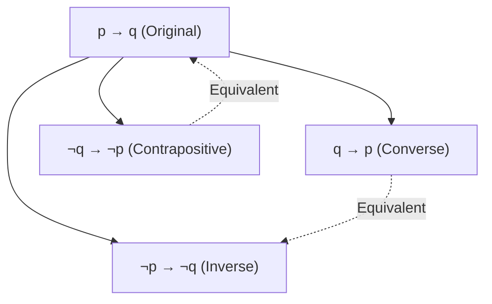
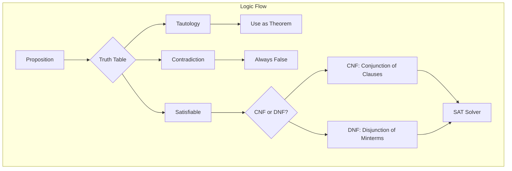

# Chapter 2: Logic

> **Previous:** [Chapter 1: Sets](01-sets.md) | **Next:** [Chapter 3: Predicates and Quantifiers](03-predicates.md)

## Learning Objectives


After completing this chapter, you will be able to:

- Identify propositions and their truth values
- Construct truth tables for compound propositions
- Apply logical connectives: $\neg, \land, \lor, \oplus, \rightarrow, \leftrightarrow$
- Prove logical equivalence using truth tables and known equivalences
- Apply De Morgan's laws for logic
- Convert expressions to CNF and DNF normal forms
- Determine satisfiability of compound propositions
- Validate arguments using inference rules (modus ponens, modus tollens, etc.)
- Understand the limitations of propositional logic

## Chapter at a Glance

| Topic | Key Insight | Practical Takeaway |
|-------|-------------|-------------------|
| Propositions | A proposition is a statement that is either true or false | Every precise factual claim is a proposition — questions and commands are not |
| Logical Connectives | $\neg, \land, \lor, \rightarrow, \leftrightarrow$ combine propositions | Connectives mirror natural language "not," "and," "or," "if-then," "iff" |
| Truth Tables | Exhaustive enumeration of all truth assignments | Truth tables are the ultimate arbiter of logical equivalence |
| Logical Equivalence | $A \equiv B$ when they match on every row | De Morgan's and distributive laws simplify complex expressions |
| Conditionals | $p \rightarrow q$ is false only when $p$ is true and $q$ is false | The contrapositive is equivalent; the converse is not |
| Normal Forms | CNF and DNF provide canonical representations | SAT solvers use CNF; circuit synthesis uses DNF |
| Inference Rules | Modus ponens, modus tollens, syllogism validate arguments | Formal proof construction in mathematics and AI |
| Satisfiability | A formula is satisfiable if some assignment makes it true | SAT is the canonical NP-complete problem |
| Limitations | Propositional logic cannot express relationships between objects | Predicate logic (Chapter 3) adds quantifiers |

## Chapter Roadmap


## Theory

### 2.1 Propositions

A **proposition** is a declarative statement that is either true (T) or false (F), but not both.

Examples: "2 + 2 = 4" (true). "5 is an even number" (false). "If it rains, the ground gets wet" (a conditional proposition whose truth depends on the meaning; in logic we treat it as a compound proposition).

Non-examples: "What time is it?" (question), "Close the door" (command), "This sentence is false" (paradox, not a proposition).

> **One-Sentence Takeaway:** A proposition is the atomic unit of logic — it must have a definite truth value (true or false) with no ambiguity.

### 2.2 Logical Connectives

Let $p$ and $q$ be propositions.

| Name | Symbol | Read as | True when |
|------|--------|---------|-----------|
| Negation | $\neg p$ | "not $p$" | $p$ is false |
| Conjunction | $p \land q$ | "$p$ and $q$" | both true |
| Disjunction | $p \lor q$ | "$p$ or $q$" (inclusive) | at least one true |
| Exclusive or | $p \oplus q$ | "$p$ xor $q$" | exactly one true |
| Conditional | $p \rightarrow q$ | "if $p$ then $q$" | $p$ false or $q$ true |
| Biconditional | $p \leftrightarrow q$ | "$p$ if and only if $q$" | both same truth value |

> **One-Sentence Takeaway:** Logical connectives define the grammar of propositional logic — mastering their truth conditions is essential for reasoning.

### 2.3 Truth Tables

A truth table enumerates all possible truth assignments to the variables and shows the resulting truth value of a compound proposition.

| $p$ | $q$ | $\neg p$ | $p \land q$ | $p \lor q$ | $p \oplus q$ | $p \rightarrow q$ | $p \leftrightarrow q$ |
|-----|-----|----------|-------------|-------------|---------------|--------------------|----------------------|
| T | T | F | T | T | F | T | T |
| T | F | F | F | T | T | F | F |
| F | T | T | F | T | T | T | F |
| F | F | T | F | F | F | T | T |

Note carefully: $p \rightarrow q$ is false only when $p$ is true and $q$ is false. This is called **material implication**.

> **One-Sentence Takeaway:** A truth table enumerates all $2^n$ possible truth assignments — it is the definitive method for checking equivalence and validity.

### 2.4 Logical Equivalence

Two compound propositions $A$ and $B$ are **logically equivalent**, written $A \equiv B$, if they have identical truth values for all truth assignments.

**Theorem 2.1 (De Morgan's Laws).**
$$\neg(p \land q) \equiv \neg p \lor \neg q$$
$$\neg(p \lor q) \equiv \neg p \land \neg q$$

**Important equivalences:**

| Name | Equivalence |
|------|-------------|
| Identity | $p \land \text{T} \equiv p$, $p \lor \text{F} \equiv p$ |
| Domination | $p \lor \text{T} \equiv \text{T}$, $p \land \text{F} \equiv \text{F}$ |
| Idempotent | $p \land p \equiv p$, $p \lor p \equiv p$ |
| Double negation | $\neg(\neg p) \equiv p$ |
| Commutative | $p \land q \equiv q \land p$, $p \lor q \equiv q \lor p$ |
| Associative | $(p \land q) \land r \equiv p \land (q \land r)$ (similarly for $\lor$) |
| Distributive | $p \lor (q \land r) \equiv (p \lor q) \land (p \lor r)$ |
| | $p \land (q \lor r) \equiv (p \land q) \lor (p \land r)$ |
| Implication | $p \rightarrow q \equiv \neg p \lor q$ |
| Contrapositive | $p \rightarrow q \equiv \neg q \rightarrow \neg p$ |
| Biconditional | $p \leftrightarrow q \equiv (p \rightarrow q) \land (q \rightarrow p)$ |
| Exportation | $p \rightarrow (q \rightarrow r) \equiv (p \land q) \rightarrow r$ |
| Absorption | $p \lor (p \land q) \equiv p$, $p \land (p \lor q) \equiv p$ |

**Implication variants:**
- **Converse:** $q \rightarrow p$ (not equivalent)
- **Inverse:** $\neg p \rightarrow \neg q$ (not equivalent)
- **Contrapositive:** $\neg q \rightarrow \neg p$ (equivalent)

```typescript
function logicalEquivalence(vars: number): boolean[][] {
  const rows: boolean[][] = [];
  for (let i = 0; i < Math.pow(2, vars); i++) {
    const row: boolean[] = [];
    for (let j = vars - 1; j >= 0; j--) {
      row.push(Boolean(i & (1 << j)));
    }
    rows.push(row);
  }
  return rows;
}

// Verify that p -> q is equivalent to ¬p ∨ q
function implies(p: boolean, q: boolean): boolean { return !p || q; }
function negOr(p: boolean, q: boolean): boolean { return !p || q; }

const assignments = logicalEquivalence(2);
const allMatch = assignments.every(([p, q]) => implies(p, q) === negOr(p, q));
console.log(`p→q ≡ ¬p∨q: ${allMatch}`); // true
```

> **One-Sentence Takeaway:** Two propositions are logically equivalent when they have identical truth tables — De Morgan's laws are the most important equivalence pair.

### 2.5 Conditional and Related Statements

For the conditional $p \rightarrow q$:

- **Converse:** $q \rightarrow p$
- **Inverse:** $\neg p \rightarrow \neg q$
- **Contrapositive:** $\neg q \rightarrow \neg p$

The conditional is equivalent to its contrapositive. The converse is equivalent to the inverse.



> **One-Sentence Takeaway:** The conditional $p \rightarrow q$ is logically equivalent to its contrapositive $\neg q \rightarrow \neg p$, but NOT to its converse $q \rightarrow p$.

### 2.6 Normal Forms

**Literal:** a variable ($p$) or its negation ($\neg p$).

**Clause:** a disjunction of literals, e.g., $p \lor \neg q \lor r$.

**Conjunctive Normal Form (CNF):** a conjunction of clauses.
Example: $(p \lor \neg q) \land (q \lor r) \land (\neg p \lor \neg r)$

**Disjunctive Normal Form (DNF):** a disjunction of conjunctions (minterms).
Example: $(p \land q) \lor (\neg p \land r) \lor (p \land \neg r)$

**Theorem 2.2 (Existence of normal forms).** Every Boolean expression can be expressed in CNF and DNF.

**Converting to DNF:**
1. Write the truth table.
2. For each row where output is T, form a conjunction (minterm) of all variables (negate if F).
3. OR all minterms together.

**Converting to CNF:**
1. Write the truth table.
2. For each row where output is F, form a disjunction (maxterm) of all variables (negate if T).
3. AND all maxterms together.

```typescript
function toDNF(truthTable: { vars: boolean[], result: boolean }[]): string {
  return truthTable
    .filter(row => row.result)
    .map(row => {
      const terms = row.vars.map((v, i) => v ? `x${i}` : `¬x${i}`);
      return `(${terms.join(' ∧ ')})`;
    })
    .join(' ∨ ');
}
```

> **One-Sentence Takeaway:** CNF (product of sums) and DNF (sum of products) are canonical forms; SAT solvers require CNF input.

### 2.7 Satisfiability and Tautology

A compound proposition is a **tautology** if it is always true (e.g., $p \lor \neg p$). It is a **contradiction** if always false (e.g., $p \land \neg p$). It is **satisfiable** if there exists at least one truth assignment making it true.

**Theorem 2.3 (SAT).** Determining whether a CNF formula is satisfiable (SAT) is NP-complete. This is the canonical NP-complete problem (Cook-Levin theorem).

**Checking satisfiability in TypeScript:**

```typescript
function isSatisfiable(formula: (assign: Map<string, boolean>) => boolean, vars: string[]): boolean {
  for (let i = 0; i < Math.pow(2, vars.length); i++) {
    const assign = new Map<string, boolean>();
    for (let j = 0; j < vars.length; j++) {
      assign.set(vars[j], Boolean(i & (1 << (vars.length - 1 - j))));
    }
    if (formula(assign)) return true;
  }
  return false;
}

// Test: (p ∨ q) ∧ (¬p ∨ ¬q) is satisfiable
const formula = (a: Map<string, boolean>) => 
  (a.get('p')! || a.get('q')!) && (!a.get('p')! || !a.get('q')!);
console.log(isSatisfiable(formula, ['p', 'q'])); // true
```

> **One-Sentence Takeaway:** Tautologies are always-true statements (valid arguments), contradictions are always-false (impossible conditions), and satisfiable statements have at least one path to truth.

### 2.8 Arguments and Validity

An **argument** consists of premises $P_1, P_2, \ldots, P_n$ and a conclusion $C$. It is **valid** when $(P_1 \land P_2 \land \cdots \land P_n) \rightarrow C$ is a tautology.

**Inference rules:**

| Rule | Name |
|------|------|
| $p \rightarrow q,\; p \;\therefore\; q$ | Modus ponens |
| $p \rightarrow q,\; \neg q \;\therefore\; \neg p$ | Modus tollens |
| $p \rightarrow q,\; q \rightarrow r \;\therefore\; p \rightarrow r$ | Hypothetical syllogism |
| $p \lor q,\; \neg p \;\therefore\; q$ | Disjunctive syllogism |
| $p \;\therefore\; p \lor q$ | Addition |
| $p \land q \;\therefore\; p$ | Simplification |
| $p,\; q \;\therefore\; p \land q$ | Conjunction |
| $p \lor q,\; p \rightarrow r,\; q \rightarrow r \;\therefore\; r$ | Resolution |
| $p \rightarrow q \;\therefore\; \neg q \rightarrow \neg p$ | Contraposition |

```typescript
// Modus ponens checker
function modusPonens(p: boolean, impliesPQ: boolean): boolean | null {
  if (p && impliesPQ) return true;      // q must be true
  if (!p || !impliesPQ) return null;    // can't conclude
  return null;
}

// Resolution: (p ∨ q) ∧ (¬p ∨ r) → (q ∨ r)
function resolution(p: boolean, q: boolean, r: boolean): boolean {
  const premise1 = p || q;
  const premise2 = !p || r;
  const conclusion = q || r;
  return !(premise1 && premise2) || conclusion;
}
```

**Common fallacies:**
- **Affirming the converse:** $p \rightarrow q,\; q \;\therefore\; p$ (invalid)
- **Denying the antecedent:** $p \rightarrow q,\; \neg p \;\therefore\; \neg q$ (invalid)

> **One-Sentence Takeaway:** An argument is valid if the conclusion follows necessarily from the premises — modus ponens and modus tollens are the most fundamental inference rules.

### 2.9 Limitations of Propositional Logic

Propositional logic cannot express:
- Statements about all/some objects: "All humans are mortal"
- Relationships between objects: "x is the parent of y"
- Properties of individuals: "x is prime"

These require **predicate logic** (first-order logic), which adds quantifiers $\forall$ and $\exists$ and predicates $P(x)$. This is covered in Chapter 3.

> **Pro Tip:** When simplifying a compound proposition, work step-by-step naming each equivalence you use — this makes errors easy to spot.
>
> **Pro Tip:** Use De Morgan's laws to push negations inward: $\neg(p \land q) \equiv \neg p \lor \neg q$. This is the single most useful equivalence for simplifying negated expressions.
>
> **Warning:** $p \rightarrow q$ is NOT equivalent to $q \rightarrow p$ (the converse). A common logical fallacy is assuming "if P then Q" means the same as "if Q then P."
>
> **Warning:** Material implication $p \rightarrow q$ is true when $p$ is false, regardless of $q$. This is counterintuitive in natural language but mathematically necessary.

## Concept Comparison Table

| Concept | Definition | Key Distinction | Use Case |
|---------|-----------|-----------------|----------|
| Proposition | Declarative T/F statement | Atomic unit, no connectives | Building blocks of arguments |
| Tautology | Always true | No falsifying assignment | Valid argument forms |
| Contradiction | Always false | No satisfying assignment | Detecting inconsistent premises |
| Logical Equivalence | Same truth table | $A \equiv B$ iff identical columns | Simplifying expressions |
| Conditional ($\rightarrow$) | False only when $p$ true, $q$ false | Material implication | "If-then" reasoning |
| Biconditional ($\leftrightarrow$) | True when $p$ and $q$ match | Both directions must hold | Definitions and equivalences |
| CNF | Conjunction of clauses | Product of sums | SAT solvers |
| DNF | Disjunction of minterms | Sum of products | Circuit synthesis |

## Quick Reference

| Rule | Name |
|------|------|
| $\neg(\neg p) \equiv p$ | Double Negation |
| $p \lor \neg p \equiv T$ | Law of Excluded Middle |
| $p \land \neg p \equiv F$ | Law of Contradiction |
| $\neg(p \land q) \equiv \neg p \lor \neg q$ | De Morgan's Law |
| $\neg(p \lor q) \equiv \neg p \land \neg q$ | De Morgan's Law |
| $p \rightarrow q \equiv \neg p \lor q$ | Implication Law |
| $p \rightarrow q \equiv \neg q \rightarrow \neg p$ | Contrapositive |
| $p \leftrightarrow q \equiv (p \rightarrow q) \land (q \rightarrow p)$ | Biconditional Law |
| $(p \land q) \rightarrow r \equiv p \rightarrow (q \rightarrow r)$ | Exportation |

## Cross-Application Matrix

| Area | How Logic Applies |
|------|------------------|
| Programming | Boolean expressions in `if`, `while`, and loop conditions |
| Circuit Design | Logic gates (AND, OR, NOT) implement propositional logic |
| Database Queries | SQL WHERE clauses use logical connectives |
| Mathematics | Proofs rely on logical deduction and equivalence |
| AI & Expert Systems | Inference engines apply logical deduction rules |
| Law & Argumentation | Legal reasoning follows modus ponens and modus tollens |
| SAT Solving | CNF satisfiability is the core of automated reasoning |

## Chapter Quiz

1. Which of the following is a proposition?
   - A) What time is it?
   - B) $x + 2 = 5$
   - C) 2 + 2 = 5
   - D) Close the door

   <details><summary>Answer</summary>**C)** "2 + 2 = 5" is a declarative statement with a definite truth value (false).</details>

2. $p \rightarrow q$ is logically equivalent to:
   - A) $q \rightarrow p$
   - B) $\neg p \rightarrow \neg q$
   - C) $\neg q \rightarrow \neg p$
   - D) $p \land q$

   <details><summary>Answer</summary>**C)** The contrapositive $\neg q \rightarrow \neg p$ is logically equivalent to $p \rightarrow q$.</details>

3. A compound proposition that is always false is called a:
   - A) Tautology
   - B) Contingency
   - C) Satisfiable
   - D) Contradiction

   <details><summary>Answer</summary>**D)** A contradiction (e.g., $p \land \neg p$) is always false regardless of truth assignments.</details>

4. Which inference rule does $(p \rightarrow q) \land p \therefore q$ represent?
   - A) Modus tollens
   - B) Modus ponens
   - C) Hypothetical syllogism
   - D) Disjunctive syllogism

   <details><summary>Answer</summary>**B)** Modus ponens: if $p$ implies $q$ and $p$ is true, then $q$ must be true.</details>

5. The CNF form of $p \oplus q$ is:
   - A) $(p \lor q) \land (\neg p \lor \neg q)$
   - B) $(p \land \neg q) \lor (\neg p \land q)$
   - C) $p \lor q$
   - D) $\neg p \land \neg q$

   <details><summary>Answer</summary>**A)** $p \oplus q \equiv (p \lor q) \land (\neg p \lor \neg q)$ in CNF.</details>

## Examples

**Example 2.1** (Truth table construction). Build the truth table for $(p \lor q) \rightarrow (p \land q)$.

| $p$ | $q$ | $p \lor q$ | $p \land q$ | $(p \lor q) \rightarrow (p \land q)$ |
|-----|-----|-----------|-------------|--------------------------------------|
| T | T | T | T | T |
| T | F | T | F | F |
| F | T | T | F | F |
| F | F | F | F | T |

**Example 2.2** (Logical equivalence). Show $p \rightarrow q \equiv \neg p \lor q$ using a truth table.

*Solution.* Compare columns for $p \rightarrow q$ and $\neg p \lor q$; they match for all four rows, confirming equivalence.

**Example 2.3** (De Morgan's). Negate "It is raining and it is cold."

*Solution.* Let $p$ = "it is raining", $q$ = "it is cold". The statement is $p \land q$. Negation: $\neg(p \land q) \equiv \neg p \lor \neg q$, i.e., "It is not raining or it is not cold."

**Example 2.4** (Converse/inverse/contrapositive). For "If it snows, school closes" ($p \rightarrow q$):

- Converse: "If school closes, it snows" ($q \rightarrow p$)
- Inverse: "If it does not snow, school does not close" ($\neg p \rightarrow \neg q$)
- Contrapositive: "If school does not close, it did not snow" ($\neg q \rightarrow \neg p$)

**Example 2.5** (Distributive law). Show $p \lor (q \land r) \equiv (p \lor q) \land (p \lor r)$.

| $p$ | $q$ | $r$ | $q \land r$ | $p \lor (q \land r)$ | $p \lor q$ | $p \lor r$ | RHS |
|-----|-----|-----|-----------|---------------------|-----------|-----------|-----|
| T | T | T | T | T | T | T | T |
| T | T | F | F | T | T | T | T |
| T | F | T | F | T | T | T | T |
| T | F | F | F | T | T | T | T |
| F | T | T | T | T | T | T | T |
| F | T | F | F | F | T | F | F |
| F | F | T | F | F | F | T | F |
| F | F | F | F | F | F | F | F |

**Example 2.6** (DNF construction). Express $(p \rightarrow q) \land (q \rightarrow p)$ in DNF.

*Solution.* The formula is true when $p$ and $q$ have the same truth value. So DNF = $(p \land q) \lor (\neg p \land \neg q)$.

**Example 2.7** (Argument validity). Determine if the argument is valid: If it rains, the ground is wet. The ground is wet. Therefore, it rained.

*Solution.* Premises: $p \rightarrow q$, $q$. Conclusion: $p$. This is affirming the converse — invalid. Counterexample: the ground could be wet from sprinklers.

**Example 2.8** (Modus tollens in TypeScript).

```typescript
function isValidModusTollens(p: boolean, q: boolean, notQ: boolean): boolean {
  // Premises: p → q, ¬q. Conclusion: ¬p
  const premise1 = !p || q;    // p → q
  const premise2 = notQ;       // ¬q
  const conclusion = !p;       // ¬p
  // If premises are true, conclusion must be true
  return !(premise1 && premise2) || conclusion;
}

console.log(isValidModusTollens(false, false, true));  // true
console.log(isValidModusTollens(true, false, true));   // true
console.log(isValidModusTollens(true, true, false));   // false
```

## Summary

- Propositions are T/F statements. Logical connectives combine them into compound propositions.
- Truth tables exhaustively enumerate truth values.
- Logical equivalence means identical truth tables; De Morgan's and distributive laws are essential.
- $p \rightarrow q$ is equivalent to $\neg p \lor q$ and to its contrapositive $\neg q \rightarrow \neg p$.
- Every Boolean expression has CNF and DNF canonical forms.
- A tautology is always true; a contradiction is always false.
- Valid arguments correspond to tautological conditionals.
- Inference rules (modus ponens, modus tollens, syllogism) formalize reasoning.
- Propositional logic cannot express quantifiers — that requires predicate logic.

### 2.9 Truth Table Generator

```typescript
type TruthTableRow = Record<string, boolean>;

function generateTruthTable(vars: string[]): TruthTableRow[] {
  const rows: TruthTableRow[] = [];
  for (let i = 0; i < (1 << vars.length); i++) {
    const row: TruthTableRow = {};
    for (let j = 0; j < vars.length; j++) {
      row[vars[j]] = Boolean((i >> (vars.length - 1 - j)) & 1);
    }
    rows.push(row);
  }
  return rows;
}

function evaluate(
  expr: (vars: TruthTableRow) => boolean,
  vars: string[]
): { table: TruthTableRow[]; isTautology: boolean; isContradiction: boolean } {
  const table = generateTruthTable(vars);
  const results = table.map(row => expr(row));
  return {
    table,
    isTautology: results.every(r => r),
    isContradiction: results.every(r => !r)
  };
}

// p → q ≡ ¬p ∨ q
const result = evaluate(
  row => !row.p || row.q,
  ["p", "q"]
);
console.log(result.isTautology); // false (satisfiable but not tautology)

const tautology = evaluate(
  row => (!row.p || row.q) === (!(!row.p && !row.q)),
  ["p", "q"]
);
console.log(tautology.isTautology); // true
```

### 2.10 Logical Equivalence Prover

```typescript
function areLogicallyEquivalent(
  expr1: (row: TruthTableRow) => boolean,
  expr2: (row: TruthTableRow) => boolean,
  vars: string[]
): boolean {
  const table = generateTruthTable(vars);
  return table.every(row => expr1(row) === expr2(row));
}

// Prove: p → q ≡ ¬p ∨ q
const equiv1 = areLogicallyEquivalent(
  row => !row.p || row.q,
  row => row.p ? row.q : true,
  ["p", "q"]
);
console.log(equiv1); // true

// Prove: p ⊕ q ≡ (p ∨ q) ∧ ¬(p ∧ q)
const equiv2 = areLogicallyEquivalent(
  row => row.p !== row.q,
  row => (row.p || row.q) && !(row.p && row.q),
  ["p", "q"]
);
console.log(equiv2); // true
```

### 2.11 Inference Rules — Systematic Proofs

```typescript
type Proposition = { type: string; args: any[] };

function modusPonens(p: boolean, pImpliesQ: boolean): boolean | null {
  if (p && pImpliesQ) return true;
  return null; // cannot conclude
}

function modusTollens(notQ: boolean, pImpliesQ: boolean): boolean | null {
  if (notQ && pImpliesQ) return false;
  return null;
}

function hypotheticalSyllogism(
  pImpliesQ: boolean,
  qImpliesR: boolean
): boolean | null {
  if (pImpliesQ && qImpliesR) return true;
  return null;
}
```

**Proof 2.4 (Logical proof using inference rules).** Prove that $p \land q$, $p \rightarrow r$, $q \rightarrow s$ entails $r \land s$.

| Step | Formula | Justification |
|------|---------|---------------|
| 1 | $p \land q$ | Premise |
| 2 | $p$ | Simplification (1) |
| 3 | $q$ | Simplification (1) |
| 4 | $p \rightarrow r$ | Premise |
| 5 | $q \rightarrow s$ | Premise |
| 6 | $r$ | Modus ponens (2, 4) |
| 7 | $s$ | Modus ponens (3, 5) |
| 8 | $r \land s$ | Conjunction (6, 7) |

### 2.12 Normal Forms — CNF and DNF

**Definition 2.18 (Conjunctive Normal Form).** A conjunction of clauses, where each clause is a disjunction of literals. Example: $(p \lor \neg q) \land (q \lor r)$.

**Definition 2.19 (Disjunctive Normal Form).** A disjunction of minterms, where each minterm is a conjunction of literals. Example: $(p \land q) \lor (\neg p \land r)$.

```typescript
function toDNF(truthTable: { vars: string[]; result: boolean }[]): string {
  const terms: string[] = [];
  for (const row of truthTable) {
    if (!row.result) continue;
    const literals: string[] = [];
    for (const v of row.vars) {
      literals.push(row[row.vars.indexOf(v)] ? v : `¬${v}`);
    }
    terms.push(`(${literals.join(" ∧ ")})`);
  }
  return terms.join(" ∨ ");
}

// Example: XOR truth table
function dnfOfXor(): string {
  const table = [
    { vars: ["p", "q"], result: false },
    { vars: ["p", "q"], result: true },
    { vars: ["p", "q"], result: true },
    { vars: ["p", "q"], result: false }
  ];
  return toDNF(table); // (¬p ∧ q) ∨ (p ∧ ¬q)
}
```

### 2.13 SAT Solver — Brute Force

```typescript
function bruteForceSAT(
  clauses: number[][],
  varCount: number
): number[] | null {
  // clauses: array of clauses, each clause is array of literals
  // positive = variable, negative = ¬variable
  for (let assignment = 0; assignment < (1 << varCount); assignment++) {
    const vars: boolean[] = [];
    for (let i = 0; i < varCount; i++) {
      vars[i] = Boolean((assignment >> (varCount - 1 - i)) & 1);
    }
    const allClausesSat = clauses.every(clause =>
      clause.some(lit => lit > 0 ? vars[lit - 1] : !vars[-lit - 1])
    );
    if (allClausesSat) return vars.map(v => v ? 1 : 0);
  }
  return null; // unsatisfiable
}

// (p ∨ q) ∧ (¬p ∨ q) ∧ (p ∨ ¬q) ∧ (¬p ∨ ¬q)
const unsat = bruteForceSAT([[1, 2], [-1, 2], [1, -2], [-1, -2]], 2);
console.log(unsat); // null (contradiction)

// (p ∨ q) ∧ (¬p ∨ r)
const sat = bruteForceSAT([[1, 2], [-1, 3]], 3);
console.log(sat); // [1, 0, 1] e.g., p=true, q=false, r=true
```



**Example 2.18** (Sheffer stroke — universal gate). The NAND gate ($p \mid q$) alone can express all connectives:
- $\neg p \equiv p \mid p$
- $p \land q \equiv (p \mid q) \mid (p \mid q)$
- $p \lor q \equiv (p \mid p) \mid (q \mid q)$

**Proof 2.5** (Resolution principle). $(p \lor q) \land (\neg p \lor r) \implies (q \lor r)$.

*Proof by cases.* If $p$ is true, then $\neg p$ is false, so $r$ must be true, giving $q \lor r$. If $p$ is false, then $p \lor q$ forces $q$ true, again giving $q \lor r$. $\square$

## Additional Exercises

17. Show that $(p \rightarrow q) \land (q \rightarrow r) \rightarrow (p \rightarrow r)$ is a tautology using a truth table.

18. Convert $(p \land q) \lor (\neg p \land r)$ to CNF.

19. Express the XOR gate using only NOR gates (the dual of NAND).

20. Prove by logical equivalence: $p \rightarrow (q \rightarrow r) \equiv (p \land q) \rightarrow r$.

21. Determine whether $(p \rightarrow q) \land (p \rightarrow \neg q)$ is satisfiable.

## Exercises

### Review Questions

1. Is "This statement is false" a proposition? Explain.
2. Build a truth table for $\neg(p \lor \neg q)$.
3. State the converse and contrapositive of "If a number is even, its square is even."
4. Show $p \rightarrow q$ and $\neg q \rightarrow \neg p$ are equivalent.
5. What is the negation of $p \oplus q$?
6. Convert $p \oplus q$ to CNF.
7. Name the inference rule: $p \lor q$, $\neg p$, $\therefore q$.

### Application Problems

8. Prove De Morgan's second law $\neg(p \lor q) \equiv \neg p \land \neg q$ by truth table.

9. Simplify $\neg(p \land (\neg p \lor q))$ using logical equivalences. Name each step.

10. Determine whether $(p \rightarrow q) \land (q \rightarrow p)$ is logically equivalent to $p \leftrightarrow q$.

11. Prove that $(p \lor q) \land \neg(p \land q)$ is equivalent to $p \oplus q$.

12. Is $((p \rightarrow q) \rightarrow r) \rightarrow s$ a tautology, contradiction, or satisfiable? Justify.

13. Convert $p \rightarrow (q \land r)$ to DNF.

14. Write a TypeScript function that takes a CNF formula as an array of clauses (each clause is an array of literals) and checks satisfiability by brute force for up to 5 variables.

### Challenge Problem

15. A **Sheffer stroke** (NAND) is defined as $p \mid q \equiv \neg(p \land q)$. Show that all other logical connectives ($\neg, \land, \lor, \rightarrow$) can be expressed using only the Sheffer stroke.

16. The **resolution principle** states that if $(p \lor q)$ and $(\neg p \lor r)$ are both true, then $(q \lor r)$ must be true (the resolvent). Prove this equivalence. Then show that repeated resolution can determine unsatisfiability of any CNF formula.
