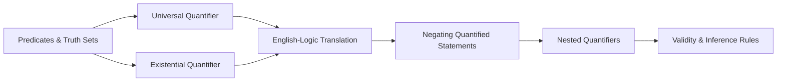

# Chapter 3: Predicates and Quantifiers

> **Previous:** [Chapter 2: Logic](02-logic.md) | **Next:** [Chapter 4: Proof Techniques](04-proofs.md)

## Learning Objectives

After completing this chapter, you will be able to:

- Define predicates and their truth sets
- Use universal ($\forall$) and existential ($\exists$) quantifiers
- Translate between English statements and quantified logical expressions
- Negate quantified statements correctly
- Handle nested quantifiers
- Determine the truth value of quantified statements over different domains

## Chapter at a Glance

| Topic | Key Insight | Practical Takeaway |
|-------|-------------|-------------------|
| Predicates | $P(x)$ is a statement whose truth depends on $x$ | Predicates become propositions when variables are assigned specific values |
| Universal Quantifier | $\forall x\; P(x)$ means "for all $x$, $P(x)$" | A single counterexample disproves a universal claim |
| Existential Quantifier | $\exists x\; P(x)$ means "there exists $x$ such that $P(x)$" | Proving existence requires just one example |
| Translation Patterns | "All A are B" uses $\rightarrow$; "Some A are B" uses $\land$ | The choice of connective is critical for correct translation |
| Quantifier Negation | $\neg \forall \equiv \exists \neg$ and $\neg \exists \equiv \forall \neg$ | Negating a quantifier flips it and pushes negation inward |
| Nested Quantifiers | $\forall x\; \exists y$ is NOT the same as $\exists y\; \forall x$ | Order matters — reversing quantifiers changes meaning completely |

## Chapter Roadmap

## Theory

### 3.1 Predicates

A **predicate** $P(x)$ is a statement whose truth depends on the value of the variable $x$. The domain of $x$ is the set of values it may take. Once $x$ is assigned a specific value, $P(x)$ becomes a proposition.

Example: $P(x)$ = "$x$ is prime". When $x = 2$, $P(2)$ is true; when $x = 4$, $P(4)$ is false.

The **truth set** of a predicate $P(x)$ over domain $D$ is:
$$\{x \in D \mid P(x)\}$$

> **One-Sentence Takeaway:** A predicate is like a function that returns a truth value — it only becomes a proposition when its variable is bound to a specific value.

### 3.2 Quantifiers

**Universal quantifier:** $\forall x\; P(x)$ means "$P(x)$ is true for all $x$ in the domain."

**Existential quantifier:** $\exists x\; P(x)$ means "there exists at least one $x$ in the domain such that $P(x)$ is true."

| Statement | True when | False when |
|-----------|-----------|------------|
| $\forall x\; P(x)$ | $P(x)$ true for every element | at least one counterexample |
| $\exists x\; P(x)$ | at least one element makes $P(x)$ true | $P(x)$ false for all elements |

> **One-Sentence Takeaway:** $\forall$ requires all elements to satisfy the condition; $\exists$ requires at least one — they are duals via negation.

### 3.3 Translation between English and Logic

English often uses implicit quantifiers. Careful translation requires identifying the domain and quantifier type.

- "All cats are mammals": $\forall x\;(\text{Cat}(x) \rightarrow \text{Mammal}(x))$
- "Some cats are black": $\exists x\;(\text{Cat}(x) \land \text{Black}(x))$
- "No cats are fish": $\forall x\;(\text{Cat}(x) \rightarrow \neg\text{Fish}(x))$ or $\neg\exists x\;(\text{Cat}(x) \land \text{Fish}(x))$

Note the pattern: "all" uses $\rightarrow$; "some" uses $\land$.

> **One-Sentence Takeaway:** Translate "all A are B" as $\forall x (A(x) \rightarrow B(x))$ and "some A are B" as $\exists x (A(x) \land B(x))$ — mixing these up is the most common quantifier mistake.

### 3.4 Negating Quantified Statements

**Theorem 3.1 (Quantifier Negation).**
$$\neg \forall x\; P(x) \equiv \exists x\; \neg P(x)$$
$$\neg \exists x\; P(x) \equiv \forall x\; \neg P(x)$$

In words: the negation of "all are true" is "at least one is false". The negation of "some are true" is "none are true".

> **One-Sentence Takeaway:** Negating a quantified statement flips every $\forall$ to $\exists$ and vice versa, then pushes the negation past all quantifiers.

### 3.5 Nested Quantifiers

When quantifiers appear within each other, order matters.

| Statement | Meaning |
|-----------|---------|
| $\forall x\; \forall y\; P(x,y)$ | $P(x,y)$ holds for all pairs |
| $\forall x\; \exists y\; P(x,y)$ | For every $x$, there exists some $y$ (may depend on $x$) |
| $\exists x\; \forall y\; P(x,y)$ | There exists an $x$ that works for all $y$ |
| $\exists x\; \exists y\; P(x,y)$ | There exists a pair $(x,y)$ satisfying $P$ |

**Important:** $\forall x\; \exists y\; P(x,y)$ and $\exists y\; \forall x\; P(x,y)$ are **not** equivalent.

> **One-Sentence Takeaway:** With nested quantifiers, order determines meaning — $\forall x\; \exists y$ allows $y$ to depend on $x$, while $\exists y\; \forall x$ requires a single $y$ that works for all $x$.

### 3.6 Negating Nested Quantifiers

Apply quantifier negation rules sequentially, from left to right:

$$\neg \forall x\; \exists y\; P(x,y) \equiv \exists x\; \neg \exists y\; P(x,y) \equiv \exists x\; \forall y\; \neg P(x,y)$$

> **One-Sentence Takeaway:** Negating nested quantifiers is mechanical — flip each quantifier and push the negation through, working left to right.

### 3.7 Validity of Arguments with Quantifiers

An argument form with quantifiers is **valid** iff whenever all premises are true, the conclusion is also true. Inference rules for quantifiers include:

- **Universal instantiation:** $\forall x\; P(x) \implies P(c)$ for any particular $c$
- **Universal generalization:** $P(c)$ for arbitrary $c \implies \forall x\; P(x)$
- **Existential instantiation:** $\exists x\; P(x) \implies P(c)$ for some new $c$
- **Existential generalization:** $P(c) \implies \exists x\; P(x)$

> **One-Sentence Takeaway:** Universal instantiation (from "all" to "any particular") and existential generalization (from "a specific example" to "some") are the workhorse inference rules for quantified arguments.

> **Pro Tip:** When translating "every student has a computer," use $\forall x (S(x) \rightarrow C(x))$ — NOT $\forall x (S(x) \land C(x))$, which incorrectly claims everyone is a student with a computer.
>
> **Pro Tip:** To disprove a universal statement $\forall x\; P(x)$, find exactly one counterexample — that's sufficient and often easier than attempting a proof.
>
> **Warning:** The statement "some A are B" translates to $\exists x (A(x) \land B(x))$, NOT $\exists x (A(x) \rightarrow B(x))$ — the latter would be trivially true if there is any element that is not A.

## Concept Comparison Table

| Concept | Definition | Key Distinction | Use Case |
|---------|-----------|-----------------|----------|
| Predicate $P(x)$ | Statement whose truth depends on $x$ | Not a proposition until $x$ is bound | Expressing properties of elements |
| $\forall x\; P(x)$ | $P(x)$ holds for all $x$ | Universal quantifier | "All," "every," "each" statements |
| $\exists x\; P(x)$ | $P(x)$ holds for some $x$ | Existential quantifier | "Some," "there exists," "at least one" |
| $\forall x\; \exists y\; P(x,y)$ | For each $x$, some $y$ works | $y$ can depend on $x$ | "Every student has a advisor" |
| $\exists y\; \forall x\; P(x,y)$ | One $y$ works for all $x$ | $y$ is independent of $x$ | "There is a universal advisor" |
| $\neg \forall x\; P(x)$ | Equivalent to $\exists x\; \neg P(x)$ | Flips quantifier, negates predicate | Disproving universal claims |

## Quick Reference

| Rule | Statement |
|------|-----------|
| $\forall$ Negation | $\neg \forall x\; P(x) \equiv \exists x\; \neg P(x)$ |
| $\exists$ Negation | $\neg \exists x\; P(x) \equiv \forall x\; \neg P(x)$ |
| Universal Instantiation | $\forall x\; P(x) \implies P(c)$ |
| Universal Generalization | $P(c)$ (arbitrary $c$) $\implies \forall x\; P(x)$ |
| Existential Instantiation | $\exists x\; P(x) \implies P(c)$ (new $c$) |
| Existential Generalization | $P(c) \implies \exists x\; P(x)$ |
| "All A are B" | $\forall x (A(x) \rightarrow B(x))$ |
| "Some A are B" | $\exists x (A(x) \land B(x))$ |

## Cross-Application Matrix

| Area | How Predicates & Quantifiers Apply |
|------|-----------------------------------|
| Databases | SQL queries: WHERE = predicate, EXISTS = $\exists$, ALL = $\forall$ |
| Programming Languages | Type systems use $\forall$ for polymorphic types |
| Software Verification | Formal specifications use quantified logic to assert invariants |
| Mathematics | Definitions of limits, continuity, and convergence use nested quantifiers |
| AI & Knowledge Representation | First-order logic is the foundation of many knowledge bases |
| Networking | Packet filtering rules use quantified conditions on packet properties |

## Chapter Quiz

1. The negation of $\forall x\; (P(x) \rightarrow Q(x))$ is:
   - A) $\forall x\; (P(x) \land \neg Q(x))$
   - B) $\exists x\; (P(x) \land \neg Q(x))$
   - C) $\exists x\; (\neg P(x) \land Q(x))$
   - D) $\forall x\; (\neg P(x) \rightarrow Q(x))$

   

Answer
**B)** $\neg \forall x (P(x) \rightarrow Q(x)) \equiv \exists x \neg(P(x) \rightarrow Q(x)) \equiv \exists x (P(x) \land \neg Q(x))$

2. Which statement is true when the domain is integers?
   - A) $\forall x\; \exists y\; (y = x + 1)$
   - B) $\exists y\; \forall x\; (y = x + 1)$
   - C) $\forall x\; \forall y\; (x < y)$
   - D) $\exists x\; \forall y\; (x > y)$

   

Answer
**A)** For every integer $x$, we can pick $y = x + 1$ — this is always true over $\mathbb{Z}$.

3. "Every cat is a mammal" translates to:
   - A) $\forall x\; (Cat(x) \land Mammal(x))$
   - B) $\exists x\; (Cat(x) \rightarrow Mammal(x))$
   - C) $\forall x\; (Cat(x) \rightarrow Mammal(x))$
   - D) $\forall x\; (Mammal(x) \rightarrow Cat(x))$

   

Answer
**C)** "All A are B" = $\forall x (A(x) \rightarrow B(x))$.

## Examples

**Example 3.1** (Truth value). Let domain be $\mathbb{Z}$. Determine truth:

- $\forall x\; (x^2 \geq 0)$: True — squares of integers are nonnegative.
- $\exists x\; (x^2 = 2)$: False — no integer squares to 2.
- $\forall x\; \exists y\; (y = x^2)$: True — for each $x$, we can choose $y = x^2$.
- $\exists y\; \forall x\; (y = x^2)$: False — no single integer equals all squares.

**Example 3.2** (Translation). Translate "Every student in this class has taken exactly one math course."

Let $S(x)$ = "$x$ is a student in this class", $M(x,y)$ = "$x$ has taken math course $y$". Then:
$$\forall x\; \big(S(x) \rightarrow \exists y\; (M(x,y) \land \forall z\; (M(x,z) \rightarrow z = y))\big)$$

**Example 3.3** (Negation). Negate "All prime numbers are odd."

*Solution.* Let domain be $\mathbb{Z}^+$, $P(x)$ = "$x$ is prime", $O(x)$ = "$x$ is odd". The statement is $\forall x\; (P(x) \rightarrow O(x))$. Negation:
$$\neg \forall x\; (P(x) \rightarrow O(x)) \equiv \exists x\; \neg(P(x) \rightarrow O(x)) \equiv \exists x\; (P(x) \land \neg O(x))$$
So the negation is "There exists a prime number that is even."

**Example 3.4** (Nested negation). Negate $\forall x\; \exists y\; \forall z\; P(x,y,z)$.

*Solution.* Move negation inward step by step:
$$\neg \forall x\; \exists y\; \forall z\; P(x,y,z)$$
$$\equiv \exists x\; \neg \exists y\; \forall z\; P(x,y,z)$$
$$\equiv \exists x\; \forall y\; \neg \forall z\; P(x,y,z)$$
$$\equiv \exists x\; \forall y\; \exists z\; \neg P(x,y,z)$$

**Example 3.5** (Validity). Determine whether the argument is valid:

Premises:
1. $\forall x\; (P(x) \rightarrow Q(x))$
2. $\forall x\; (Q(x) \rightarrow R(x))$

Conclusion: $\forall x\; (P(x) \rightarrow R(x))$

*Solution.* Pick an arbitrary element $c$. From (1), $P(c) \rightarrow Q(c)$. From (2), $Q(c) \rightarrow R(c)$. By hypothetical syllogism (transitivity of implication), $P(c) \rightarrow R(c)$. Since $c$ was arbitrary, $\forall x\; (P(x) \rightarrow R(x))$ holds. Valid.

## Summary

- Predicates are statements that depend on variables. Quantifiers $\forall$ and $\exists$ bind variables.
- $\neg \forall x\; P(x) \equiv \exists x\; \neg P(x)$ and $\neg \exists x\; P(x) \equiv \forall x\; \neg P(x)$.
- Nested quantifier order matters; negate from left to right.
- Translation between English and logic requires careful choice of $\rightarrow$ vs $\land$.

## Exercises

### Review Questions

1. Express "there exists a unique $x$ such that $P(x)$" using quantifiers.
2. Negate $\forall x\; \exists y\; (x + y = 0)$ over $\mathbb{Z}$.
3. Write "Every CS major has taken a math course" in predicate logic.
4. Is $\exists x\; \forall y\; P(x,y)$ equivalent to $\forall y\; \exists x\; P(x,y)$? Explain with a counterexample.
5. What is the domain if $\forall x\; (x > 0)$ is false?

### Application Problems

6. Translate and then negate: "There is a student who has emailed every professor."

7. Let domain be $\mathbb{R}$. Determine truth values:
   (a) $\forall x\; \exists y\; (x + y = 0)$
   (b) $\exists y\; \forall x\; (x + y = 0)$
   (c) $\forall x\; \forall y\; (x^2 + y^2 \geq 0)$

8. Negate: $\forall x\; \forall y\; \big((P(x) \land P(y)) \rightarrow x = y\big)$ (this states "at most one" element satisfies $P$).

9. Show that $\exists x\; \forall y\; P(x,y) \implies \forall y\; \exists x\; P(x,y)$ is logically true, but the converse is not.

10. Express "There exist at least two elements satisfying $P(x)$" and "There exist at most two elements satisfying $P(x)$" using quantifiers.

### Challenge Problem

11. Define the **uniqueness quantifier** $\exists!x\; P(x)$ meaning "there exists exactly one $x$ satisfying $P(x)$." Express $\exists!x\; P(x)$ using only $\forall$, $\exists$, $\land$, $\rightarrow$, $=$ and $P(x)$. Then negate the expression and simplify.
