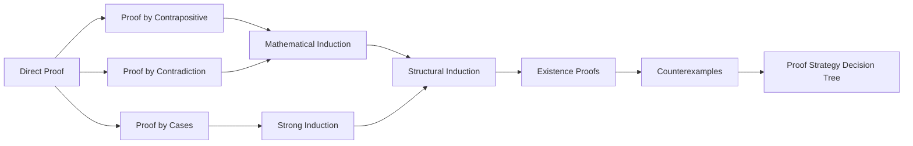
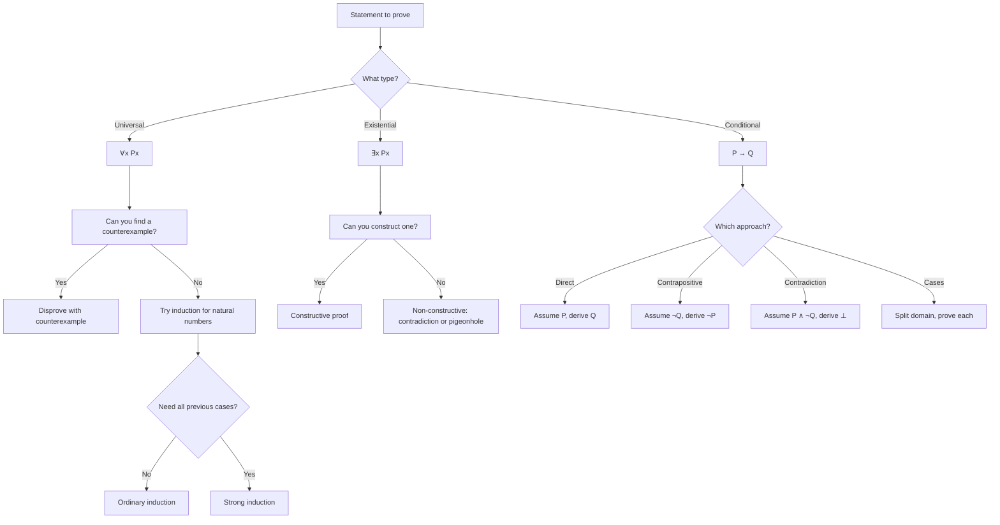
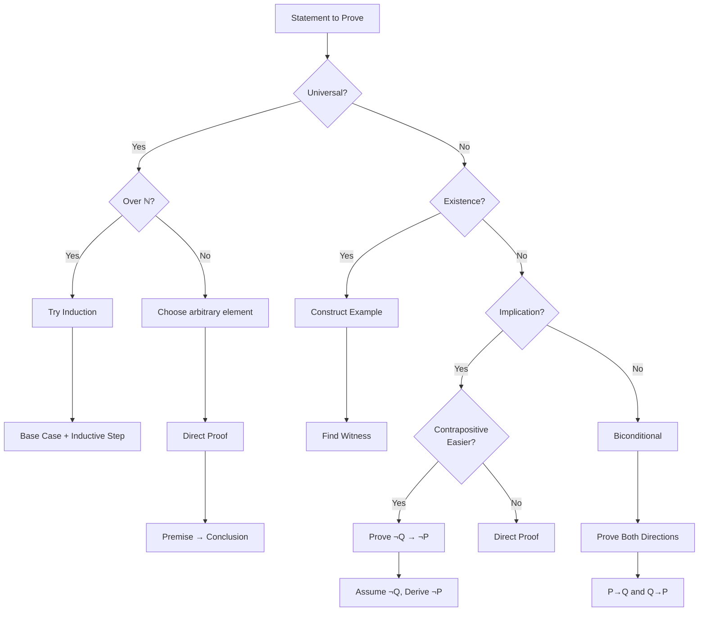

# Chapter 4: Proof Techniques

> **Previous:** [Chapter 3: Predicates and Quantifiers](03-predicates.md) | **Next:** [Chapter 5: Combinatorics](05-combinatorics.md)

## Learning Objectives


After completing this chapter, you will be able to:

- Construct direct proofs of conditional statements
- Write proofs by contrapositive
- Use proof by contradiction
- Apply mathematical induction and strong induction
- Disprove statements with counterexamples
- Select the appropriate proof technique for a given statement
- Recognize and avoid common logical fallacies in proofs
- Use structural induction on recursively defined sets

## Chapter at a Glance

| Topic | Key Insight | Practical Takeaway |
|-------|-------------|-------------------|
| Direct Proof | Assume $P$, derive $Q$ using known truths | Best for statements where the hypothesis directly implies the conclusion |
| Contrapositive | Prove $\neg Q \rightarrow \neg P$ instead of $P \rightarrow Q$ | Ideal when the contrapositive is easier to reason about |
| Contradiction | Assume the negation and derive $F$ | Powerful for proving irrationality and nonexistence |
| Induction | Base case + $P(k) \rightarrow P(k+1)$ | The standard tool for proving statements about all natural numbers |
| Strong Induction | All smaller cases imply the next | Needed when $P(k)$ alone is insufficient to prove $P(k+1)$ |
| Structural Induction | Prove property on constructors of a recursive definition | Essential for recursively defined data structures |
| Counterexample | One element disproves $\forall x\; P(x)$ | The simplest disproof method — find one exception |

## Chapter Roadmap



## Theory

### 4.1 Direct Proof

A **direct proof** of $P \implies Q$ assumes $P$ is true and uses logical reasoning, definitions, and known theorems to derive $Q$.

**Theorem 4.1.** If $n$ is an even integer, then $n^2$ is even.

*Proof.* Let $n$ be an even integer. Then $n = 2k$ for some integer $k$. Then $n^2 = (2k)^2 = 4k^2 = 2(2k^2)$, which is even. $\square$

**Theorem 4.2 (Sum of evens).** The sum of two even integers is even.

*Proof.* Let $a = 2k$ and $b = 2m$ be even. Then $a + b = 2k + 2m = 2(k + m)$, which is even. $\square$

> **One-Sentence Takeaway:** A direct proof starts from the hypothesis and applies definitions and theorems step-by-step to reach the conclusion.

### 4.2 Proof by Contrapositive

The **contrapositive** of $P \implies Q$ is $\neg Q \implies \neg P$. Since they are logically equivalent, proving the contrapositive proves the original statement.

**Theorem 4.3.** If $n^2$ is odd, then $n$ is odd.

*Proof.* We prove the contrapositive: if $n$ is even, then $n^2$ is even. This is Theorem 4.1 above. $\square$

**Theorem 4.4.** If $x$ and $y$ are real numbers and $xy$ is irrational, then at least one of $x$ or $y$ is irrational.

*Proof.* Contrapositive: if both $x$ and $y$ are rational, then $xy$ is rational. Let $x = a/b$ and $y = c/d$ with integers $a,b,c,d$ and $b,d \neq 0$. Then $xy = (ac)/(bd)$, which is rational. $\square$

> **One-Sentence Takeaway:** Proving the contrapositive $\neg Q \rightarrow \neg P$ is logically equivalent to proving $P \rightarrow Q$, and is often more direct.

### 4.3 Proof by Contradiction

A proof by contradiction assumes the negation of the statement to be proved and derives a logical contradiction ($F \equiv \text{false}$). This shows the original statement must be true.

**Theorem 4.5.** $\sqrt{2}$ is irrational.

*Proof.* Assume, for contradiction, that $\sqrt{2}$ is rational. Then $\sqrt{2} = a/b$ where $a, b \in \mathbb{Z}$, $b \neq 0$, and $\gcd(a,b) = 1$ (fraction in lowest terms). Squaring gives $2 = a^2 / b^2$, so $a^2 = 2b^2$. Thus $a^2$ is even, so $a$ is even. Write $a = 2k$. Then $(2k)^2 = 2b^2 \implies 4k^2 = 2b^2 \implies b^2 = 2k^2$, so $b^2$ is even and $b$ is even. But then $a$ and $b$ share the factor 2, contradicting $\gcd(a,b) = 1$. Hence $\sqrt{2}$ is irrational. $\square$

**Theorem 4.6.** There are infinitely many primes.

*Proof.* Assume, to the contrary, that there are finitely many primes $p_1, p_2, \ldots, p_k$. Consider $N = p_1 p_2 \cdots p_k + 1$. Since $N > 1$, $N$ has a prime divisor $p$. But $p$ cannot be any $p_i$ because $N \equiv 1 \pmod{p_i}$ for each $i$. Hence $p$ is a prime not in our list — contradiction. $\square$

```typescript
function isPrime(n: number): boolean {
  if (n < 2) return false;
  for (let i = 2; i * i <= n; i++) {
    if (n % i === 0) return false;
  }
  return true;
}

// Show that there exist primes beyond any given bound
function findPrimeBeyond(N: number): number {
  // Construct M = N! + 1 (like the Euclid construction)
  let factorial = 1;
  for (let i = 2; i <= N; i++) factorial *= i;
  const M = factorial + 1;
  // Find its smallest prime factor
  for (let i = 2; i * i <= M; i++) {
    if (M % i === 0) return i;
  }
  return M; // M itself is prime
}

console.log(findPrimeBeyond(10)); // some prime > 10
```

> **One-Sentence Takeaway:** Proof by contradiction assumes the statement is false, derives an impossible consequence, and concludes the statement must be true.

### 4.4 Counterexample

To disprove a universally quantified statement $\forall x\; P(x)$, it suffices to find a single element $c$ (a counterexample) for which $P(c)$ is false.

**Example 4.1.** Disprove: "All prime numbers are odd."

*Counterexample.* 2 is prime and not odd. $\square$

**Example 4.2.** Disprove: "$n^2 + n + 41$ is prime for all positive integers $n$."

*Counterexample.* For $n = 41$, we get $41^2 + 41 + 41 = 41(41 + 1 + 1) = 41 \cdot 43$, which is composite. $\square$

> **One-Sentence Takeaway:** One carefully chosen counterexample is sufficient to refute any universal claim — you never need to disprove "all" by checking everything.

### 4.5 Mathematical Induction

**Principle of Mathematical Induction.** Let $P(n)$ be a statement for each integer $n \geq n_0$. If:

1. **Base case:** $P(n_0)$ is true, and
2. **Inductive step:** For all $k \geq n_0$, $P(k) \implies P(k+1)$,

then $P(n)$ is true for all $n \geq n_0$.

**Theorem 4.7.** For all $n \geq 1$, $\sum_{i=1}^{n} i = \frac{n(n+1)}{2}$.

*Proof.* **(Base)** $n = 1$: LHS $= 1$, RHS $= 1(2)/2 = 1$. ✓

**(Inductive step)** Assume $\sum_{i=1}^{k} i = \frac{k(k+1)}{2}$. Then:
$$\sum_{i=1}^{k+1} i = \left(\sum_{i=1}^{k} i\right) + (k+1) = \frac{k(k+1)}{2} + (k+1) = \frac{k(k+1) + 2(k+1)}{2} = \frac{(k+1)(k+2)}{2}$$
Thus $P(k) \implies P(k+1)$. By induction, true for all $n \geq 1$. $\square$

**Theorem 4.8 (Inequality).** $2^n \geq n+1$ for all $n \geq 1$.

*Proof.* Base $n=1$: $2^1 = 2 \geq 2$. ✓. Assume $2^k \geq k+1$. Then $2^{k+1} = 2 \cdot 2^k \geq 2(k+1) = 2k+2 \geq k+2$ for $k \geq 1$. So $P(k) \implies P(k+1)$. $\square$

```typescript
// Verifying the sum formula by induction with TypeScript
function sumFormula(n: number): number {
  return (n * (n + 1)) / 2;
}

function verifySumByLoop(n: number): number {
  let sum = 0;
  for (let i = 1; i <= n; i++) sum += i;
  return sum;
}

// Test for first 100 numbers
for (let n = 1; n <= 100; n++) {
  if (sumFormula(n) !== verifySumByLoop(n)) {
    console.log(`Mismatch at n = ${n}`);
  }
}
console.log("All checks passed for n = 1 to 100");
```

> **One-Sentence Takeaway:** Induction proves a statement for **all** natural numbers by showing it holds for the first one and that truth at $k$ implies truth at $k+1$.

### 4.6 Strong Induction

**Principle of Strong Induction.** If:

1. **Base case(s):** $P(n_0), P(n_0+1), \ldots, P(m)$ are true, and
2. **Strong inductive step:** For all $k \geq m$, $P(n_0) \land \cdots \land P(k) \implies P(k+1)$,

then $P(n)$ is true for all $n \geq n_0$.

Strong induction assumes all smaller instances, not just the immediate predecessor.

**Theorem 4.9.** Every integer $n \geq 2$ can be expressed as a product of primes.

*Proof.* **(Base)** $n = 2$ is prime. ✓

**(Strong inductive step)** Assume every integer $2, 3, \ldots, k$ is a product of primes. Consider $k+1$. If $k+1$ is prime, we are done. If $k+1$ is composite, then $k+1 = ab$ where $2 \leq a, b \leq k$. By the inductive hypothesis, $a$ and $b$ are products of primes, so their product $k+1$ is also a product of primes. $\square$

**Theorem 4.10 (Fibonacci inequality).** The Fibonacci sequence $F_1 = 1$, $F_2 = 1$, $F_n = F_{n-1} + F_{n-2}$ for $n \geq 3$ satisfies $F_n < 2^n$ for all $n \geq 1$.

*Proof.* Base: $F_1 = 1 < 2^1$, $F_2 = 1 < 2^2$. ✓. Assume $F_i < 2^i$ for all $i \leq k$. Then $F_{k+1} = F_k + F_{k-1} < 2^k + 2^{k-1} < 2^k + 2^k = 2^{k+1}$. $\square$

> **One-Sentence Takeaway:** Strong induction lets you assume the statement holds for **all** smaller numbers, not just the immediate predecessor — essential when $P(k+1)$ depends on $P(k-1)$ or earlier.

### 4.7 Structural Induction

**Structural induction** proves properties of recursively defined sets (e.g., trees, lists, formulas). For each constructor in the recursive definition, prove that if all sub-instances satisfy the property, then the constructed instance does as well.

**Example (Full binary trees).** Define: a single vertex is a full binary tree. If $T_1$ and $T_2$ are full binary trees, then $(T_1, r, T_2)$ is a full binary tree with root $r$, left subtree $T_1$, and right subtree $T_2$.

**Theorem 4.11.** In any full binary tree, the number of vertices $v$ and the number of edges $e$ satisfy $v = e + 1$.

*Proof.* By structural induction.

**Base:** A single vertex has $v = 1$, $e = 0$, so $1 = 0 + 1$. ✓

**Inductive step:** Let $T$ be built from subtrees $T_1$ and $T_2$. Assume $T_1$ satisfies $v_1 = e_1 + 1$ and $T_2$ satisfies $v_2 = e_2 + 1$. Then $T$ has $v = v_1 + v_2 + 1$ vertices and $e = e_1 + e_2 + 2$ edges (two new edges from root to each subtree). So $v = v_1 + v_2 + 1 = (e_1 + 1) + (e_2 + 1) + 1 = e_1 + e_2 + 3 = (e_1 + e_2 + 2) + 1 = e + 1$. $\square$

> **One-Sentence Takeaway:** Structural induction mirrors the recursive definition of a data type — prove the base constructors and prove that the property is preserved by each recursive constructor.

### 4.8 Proof by Cases

Sometimes a statement can be proved by dividing the domain into exhaustive cases and proving each case separately.

**Theorem 4.12.** For any integer $n$, $n^2 \bmod 3$ is either $0$ or $1$ (never $2$).

*Proof.* Every integer can be written as $n = 3k$, $n = 3k+1$, or $n = 3k+2$ (three cases by division algorithm).

- Case 1: $n = 3k \implies n^2 = 9k^2 \equiv 0 \pmod{3}$.
- Case 2: $n = 3k+1 \implies n^2 = 9k^2 + 6k + 1 \equiv 1 \pmod{3}$.
- Case 3: $n = 3k+2 \implies n^2 = 9k^2 + 12k + 4 \equiv 1 \pmod{3}$.

In all cases, $n^2$ is $0$ or $1$ mod $3$. $\square$

> **One-Sentence Takeaway:** Case analysis divides the domain into exhaustive partitions; proving each partition separately establishes the whole claim.

### 4.9 Existence Proofs

An **existence proof** demonstrates that $\exists x\; P(x)$ is true. **Constructive** proofs exhibit an explicit $c$ with $P(c)$. **Non-constructive** proofs show existence without producing an example (e.g., by contradiction or pigeonhole principle).

**Constructive example:** Prove there exists a prime number between 10 and 20. Exhibit $11$ — it is prime, and $10 < 11 < 20$.

**Non-constructive example:** Prove that for any 5 points in a unit square, some pair is at most $\sqrt{2}/2$ apart. The pigeonhole principle shows existence but does not say which pair.

### 4.10 Proof Strategy Decision Tree



> **Pro Tip:** Start with direct proof — it is the most straightforward. If direct proof stalls, try the contrapositive. If that also fails, fall back to contradiction.
>
> **Pro Tip:** For existence proofs, always try a constructive approach first. The explicit witness makes the proof more informative.
>
> **Warning:** Induction can only prove statements about well-ordered sets (typically natural numbers). It does not apply to real numbers or arbitrary infinite sets.
>
> **Warning:** When using proof by contradiction, be careful that the contradiction you derive actually follows from the assumption — a "contradiction" that is merely unexpected is not a valid proof.

## Proof Technique Comparison Table

| Technique | What You Assume | What You Derive | Best For |
|-----------|----------------|-----------------|----------|
| Direct Proof | $P$ is true | $Q$ is true | Simple implications from definition |
| Contrapositive | $\neg Q$ is true | $\neg P$ is true | When $\neg Q$ gives more information |
| Contradiction | $P \land \neg Q$ | $\bot$ (false assertion) | Irrationality, nonexistence |
| Induction | $P(k)$ for a single $k$ | $P(k+1)$ is true | Statements about $\mathbb{N}$ |
| Strong Induction | $P(n_0), \ldots, P(k)$ | $P(k+1)$ is true | Recurrences, prime factorization |
| Structural Induction | Property holds on subtrees | Property holds on tree | Recursive data structures |
| Cases | Case-specific condition | Each case yields conclusion | Complex conditions |
| Counterexample | $\neg P(c)$ for some $c$ | $\neg \forall x\; P(x)$ | Disproving universals |

## Important Proof Principles

| Principle | Statement | Source |
|-----------|-----------|--------|
| Law of Excluded Middle | $P \lor \neg P$ for any proposition | Aristotle |
| Modus Ponens | $(P \land (P \rightarrow Q)) \implies Q$ | Classical Logic |
| Modus Tollens | $(\neg Q \land (P \rightarrow Q)) \implies \neg P$ | Classical Logic |
| Hypothetical Syllogism | $((P \rightarrow Q) \land (Q \rightarrow R)) \implies (P \rightarrow R)$ | Classical Logic |
| Proof by Cases | $((P \lor Q) \land (P \rightarrow R) \land (Q \rightarrow R)) \implies R$ | Classical Logic |

## Common Fallacies in Proofs

| Fallacy | Description | Example |
|---------|-------------|---------|
| Affirming the Consequent | Assuming $P \rightarrow Q$ and $Q$ implies $P$ | "If it rains, the ground is wet. The ground is wet, so it rained." (Could be sprinklers) |
| Denying the Antecedent | Assuming $P \rightarrow Q$ and $\neg P$ implies $\neg Q$ | "If it rains, the ground is wet. It did not rain, so the ground is not wet." |
| Circular Reasoning | Using the conclusion as a premise | Proving $P$ by assuming $P$ |
| Hasty Generalization | Inductive proof from insufficient cases | "I saw 3 white swans, therefore all swans are white" |
| Begging the Question | Assuming what you are trying to prove | Proving $n^2$ is even by saying "because $n$ is even, and even numbers squared are even" without justification |

## Quick Reference

| Statement Type | How to Prove | How to Disprove |
|---------------|--------------|-----------------|
| $P \rightarrow Q$ | Direct: assume $P$, derive $Q$ | Show $P$ true and $Q$ false |
| $\neg P$ | Contradiction: assume $P$, derive $\bot$ | Show $P$ true |
| $\forall x\; P(x)$ | Induction (if over $\mathbb{N}$) | Find one counterexample |
| $\exists x\; P(x)$ | Construct an explicit $x$ | Prove $\forall x\; \neg P(x)$ |
| $P \leftrightarrow Q$ | Prove $P \rightarrow Q$ and $Q \rightarrow P$ | Find a case where one holds but the other doesn't |
| $\sum_{i=1}^{n} f(i) = g(n)$ | Induction on $n$ | Compute a specific $n$ with mismatch |

## Cross-Application Matrix

| Area | How Proof Techniques Apply |
|------|---------------------------|
| Algorithm Correctness | Induction proves loop invariants; structural induction proves recursive algorithm correctness |
| Software Verification | Formal proofs verify smart contracts, safety-critical code |
| Cryptography | Contradiction proofs show security reductions (if a break exists, P=NP) |
| Type Systems | Structural induction proves type soundness (progress + preservation theorems) |
| Database Theory | Induction proves query equivalence and normalization correctness |
| AI/Formal Reasoning | Automated theorem provers use case analysis and resolution (contradiction variant) |

## Chapter Quiz

1. A proof that assumes $\neg Q$ and derives $\neg P$ is called:
   - A) Direct proof
   - B) Proof by contrapositive
   - C) Proof by contradiction
   - D) Proof by cases

   <details><summary>Answer</summary>**B)** Proof by contrapositive proves $P \rightarrow Q$ by showing $\neg Q \rightarrow \neg P$.</details>

2. What is the minimum number of base cases needed to prove $F_n < 2^n$ for the Fibonacci sequence?
   - A) 0
   - B) 1
   - C) 2
   - D) 3

   <details><summary>Answer</summary>**C)** Two base cases ($F_1$ and $F_2$) are needed because $F_{k+1} = F_k + F_{k-1}$ references two previous terms.</details>

3. Which fallacy is: "If $n$ is even, then $n^2$ is even. $n^2$ is even, so $n$ is even"?
   - A) Affirming the consequent
   - B) Denying the antecedent
   - C) Circular reasoning
   - D) Hasty generalization

   <details><summary>Answer</summary>**A)** Affirming the consequent assumes $P \rightarrow Q$ and $Q$ implies $P$, but $n^2$ could be even while $n$ is odd ($9^2 = 81$ is odd actually — a better counterexample: $6^2 = 36$ is even but $n = \sqrt{36} = \pm 6$ is even... wait — proper counterexample: $n = \sqrt{2}$ not integer. Actually any even $n$ gives even $n^2$, but the converse $n^2$ even $\implies n$ even is true for integers. However the fallacy is still affirming the consequent — the reasoning pattern is invalid even if the conclusion happens to be true.)</details>

4. Structural induction is used to prove properties of:
   - A) All subsets of a set
   - B) Recursively defined data structures
   - C) Continuous functions
   - D) Real numbers

   <details><summary>Answer</summary>**B)** Structural induction mirrors the recursive constructors of a data type (trees, lists, formulas).</details>

5. The proof that $\sqrt{2}$ is irrational uses which technique?
   - A) Direct proof
   - B) Induction
   - C) Proof by contradiction
   - D) Contrapositive

   <details><summary>Answer</summary>**C)** Assuming $\sqrt{2}$ is rational leads to a contradiction about the fraction being in lowest terms.</details>

## Examples

**Example 4.3** (Direct proof). Prove that the sum of two odd integers is even.

*Proof.* Let $a = 2k+1$ and $b = 2m+1$ be odd. Then $a+b = 2(k+m+1)$, which is even. $\square$

**Example 4.4** (Contrapositive). Prove: If $5n+2$ is odd, then $n$ is odd.

*Proof.* Contrapositive: If $n$ is even, then $5n+2$ is even. Let $n = 2k$. Then $5(2k)+2 = 10k+2 = 2(5k+1)$, which is even. $\square$

**Example 4.5** (Induction). Prove $1 + 2 + 2^2 + \cdots + 2^n = 2^{n+1} - 1$ for all $n \geq 0$.

*Proof.* Base $n = 0$: $2^0 = 1 = 2^{1} - 1$. ✓. Assume $P(k)$: $\sum_{i=0}^{k} 2^i = 2^{k+1} - 1$. Then $\sum_{i=0}^{k+1} 2^i = (2^{k+1} - 1) + 2^{k+1} = 2 \cdot 2^{k+1} - 1 = 2^{k+2} - 1$. Thus $P(k+1)$ holds. $\square$

**Example 4.6** (Strong induction). Every integer $n \geq 12$ can be written as $4a + 5b$ for nonnegative integers $a, b$.

*Proof.* Base cases: $12 = 4(3) + 5(0)$, $13 = 4(2) + 5(1)$, $14 = 4(1) + 5(2)$, $15 = 4(0) + 5(3)$. ✓. Assume $12, \ldots, k$ can be expressed. Consider $k+1$. Since $k+1 = (k-3) + 4$, and $k-3 \geq 12$ (so $k-3$ is in the range covered), we can write $k-3 = 4a + 5b$. Then $k+1 = 4(a+1) + 5b$. $\square$

**Example 4.7** (Structural induction in TypeScript).

```typescript
type BinTree<T> = { kind: "leaf"; val: T } | { kind: "node"; left: BinTree<T>; right: BinTree<T> };

function height<T>(t: BinTree<T>): number {
  if (t.kind === "leaf") return 0;
  return 1 + Math.max(height(t.left), height(t.right));
}

// Theorem: height of any binary tree satisfies height >= floor(log2(size))
// Proof by structural induction (size = number of nodes)
function size<T>(t: BinTree<T>): number {
  if (t.kind === "leaf") return 1;
  return 1 + size(t.left) + size(t.right);
}

function verifyHeightBound<T>(t: BinTree<T>): boolean {
  return height(t) >= Math.floor(Math.log2(size(t)));
}
```

**Example 4.8** (Proof by contradiction — no largest integer). Prove there is no largest integer.

*Proof.* Assume, to the contrary, that $M$ is the largest integer. Then $M + 1$ is an integer greater than $M$, contradicting the maximality of $M$. Hence no largest integer exists. $\square$

**Example 4.9** (Pigeonhole — nonconstructive existence). In any set of 13 distinct integers, some pair has a difference divisible by 12.

*Proof.* Consider the residues of each integer modulo 12. There are 12 possible residues ($0$ through $11$). By the pigeonhole principle, with 13 integers, two must share the same residue. Their difference is divisible by 12. $\square$

## Summary

- Direct proof: assume hypothesis, derive conclusion.
- Contrapositive: prove $\neg Q \implies \neg P$ instead of $P \implies Q$.
- Contradiction: assume false, derive contradiction.
- Induction: base case + $P(k) \implies P(k+1)$ over natural numbers.
- Strong induction: base cases + $P(\text{all smaller}) \implies P(k+1)$.
- Structural induction: proof by recursive constructor preservation.
- Counterexample disproves universal claims.
- Existence proofs can be constructive or non-constructive.

## Practical Takeaways

1. **Start direct** — most proofs are direct; only pivot to other methods when stuck.
2. **Try contrapositive** — if the conclusion's negation gives more leverage than the hypothesis.
3. **Use contradiction as fallback** — powerful but can produce less constructive proofs.
4. **Induction for natural numbers** — always identify the base case and the inductive step clearly.
5. **Strong induction when dependencies skip** — if $P(k+1)$ needs $P(k-1)$ or $P(k-2)$, use strong induction.
6. **One counterexample suffices** — never try to prove a universal false; find a single exception.

### 4.8 Proof Techniques in Practice — TypeScript Examples

**Direct proof of a universal claim over a small finite domain.**

```typescript
function verifyDirect(domain: number[], property: (n: number) => boolean): boolean {
  return domain.every(property);
}

// Claim: for all n in {1,...,20}, if n is even then n² is even
const domain = Array.from({ length: 20 }, (_, i) => i + 1);
const claim = verifyDirect(domain, n => n % 2 !== 0 || (n * n) % 2 === 0);
console.log(claim); // true
```

**Contrapositive prover for small domains.**

```typescript
function verifyContrapositive(
  domain: number[],
  premise: (n: number) => boolean,
  conclusion: (n: number) => boolean
): boolean {
  // Direct: premise → conclusion
  const direct = domain.every(n => !premise(n) || conclusion(n));
  // Contrapositive: ¬conclusion → ¬premise
  const contra = domain.every(n => conclusion(n) || !premise(n));
  return direct && contra;
}

// Claim: n² odd → n odd
const result = verifyContrapositive(
  domain,
  n => (n * n) % 2 !== 0,
  n => n % 2 !== 0
);
console.log(result); // true
```

### 4.9 Induction — Formal Framework

**Theorem 4.4 (Principle of Mathematical Induction).** Let $P(n)$ be a statement about $n \in \mathbb{N}$. If:
1. $P(1)$ is true (base case).
2. $\forall k \geq 1, P(k) \implies P(k+1)$ (inductive step).

Then $P(n)$ is true for all $n \in \mathbb{N}$.

```typescript
function proveByInduction(
  baseCase: number,
  predicate: (n: number) => boolean,
  inductiveStep: (k: number) => boolean,
  upTo: number
): boolean {
  if (!predicate(baseCase)) return false;
  for (let k = baseCase; k < upTo; k++) {
    if (predicate(k) && !inductiveStep(k)) return false;
  }
  return true;
}

// Prove: 1 + 2 + ... + n = n(n+1)/2 for n up to 10
const sumFormula = (n: number) => {
  const sum = (n * (n + 1)) / 2;
  const actual = Array.from({ length: n }, (_, i) => i + 1).reduce((a, b) => a + b, 0);
  return sum === actual;
};
const inductionWorks = proveByInduction(1, sumFormula, k => sumFormula(k) && sumFormula(k + 1), 10);
console.log(inductionWorks); // true
```

**Proof 4.6 (Sum of squares formula by induction).** $\sum_{i=1}^n i^2 = \frac{n(n+1)(2n+1)}{6}$.

*Base $n=1$:* LHS $= 1^2 = 1$. RHS $= \frac{1\cdot2\cdot3}{6} = 1$. ✓

*Inductive step:* Assume true for $n = k$:
$$\sum_{i=1}^k i^2 = \frac{k(k+1)(2k+1)}{6}$$

For $n = k+1$:
$$\sum_{i=1}^{k+1} i^2 = \frac{k(k+1)(2k+1)}{6} + (k+1)^2$$
$$= \frac{k+1}{6}[k(2k+1) + 6(k+1)]$$
$$= \frac{k+1}{6}[2k^2 + 7k + 6]$$
$$= \frac{k+1}{6}[2k^2 + 4k + 3k + 6]$$
$$= \frac{k+1}{6}[2k(k+2) + 3(k+2)]$$
$$= \frac{(k+1)(k+2)(2k+3)}{6}$$

Which is the formula for $n = k+1$. $\square$

### 4.10 Strong Induction

**Theorem 4.5 (Strong Induction).** If $P(1), \ldots, P(m)$ are true and $P(1) \land \cdots \land P(k) \implies P(k+1)$, then $P(n)$ is true for all $n$.

```typescript
function strongInduction(
  base: number,
  baseCases: number[],
  predicate: (n: number) => boolean,
  inductiveStep: (k: number, prev: boolean[]) => boolean,
  upTo: number
): boolean {
  const results: boolean[] = [false]; // 1-indexed
  for (let i = 0; i < baseCases.length; i++) {
    if (!predicate(base + i)) return false;
    results[base + i] = true;
  }
  for (let k = base + baseCases.length; k <= upTo; k++) {
    if (!inductiveStep(k - 1, results)) return false;
    results[k] = predicate(k);
  }
  return true;
}
```

**Proof 4.7 (Every integer > 1 has a prime factorization).** Use strong induction. $P(2)$ is true (2 is prime). Assume all $2 \leq m \leq k$ have prime factorizations. For $k+1$, if it's prime, done. Otherwise $k+1 = ab$ with $1 < a, b < k+1$, which by the inductive hypothesis have prime factorizations. Their product is a factorization of $k+1$. $\square$

### 4.11 Structural Induction

**Definition 4.5 (Structural Induction).** Used for recursively defined structures (trees, lists, formulas):
1. Show the property holds for all base elements.
2. Show the property is preserved by each construction rule.

```typescript
// Structural induction on arithmetic expressions
type Expr =
  | { type: "num"; value: number }
  | { type: "add"; left: Expr; right: Expr }
  | { type: "mul"; left: Expr; right: Expr };

function evalExpr(e: Expr): number {
  switch (e.type) {
    case "num": return e.value;
    case "add": return evalExpr(e.left) + evalExpr(e.right);
    case "mul": return evalExpr(e.left) * evalExpr(e.right);
  }
}

// Structural induction claim: Every expression built from integers,
// +, and × evaluates to an integer.
function allResultsAreIntegers(e: Expr): boolean {
  const result = evalExpr(e);
  if (!Number.isInteger(result)) return false;
  // Verify recursively
  if (e.type === "num") return Number.isInteger(e.value);
  return allResultsAreIntegers(e.left) && allResultsAreIntegers(e.right);
}
```

### 4.12 Proof by Contradiction — Classic Examples

**Proof 4.8 ($\sqrt{2}$ is irrational).**

*Proof by contradiction.* Assume $\sqrt{2} = p/q$ in lowest terms ($p, q$ integers, coprime). Then $2 = p^2/q^2$, so $p^2 = 2q^2$. Thus $p^2$ is even, so $p$ is even: $p = 2k$. Then $(2k)^2 = 2q^2 \implies 4k^2 = 2q^2 \implies q^2 = 2k^2$, so $q$ is also even. But $p$ and $q$ both even contradicts that $p/q$ is in lowest terms. $\square$

```typescript
function isRationalSqrt2(): boolean {
  // Check all p/q up to a bound — if none squared equals 2, √2 is irrational
  const limit = 100;
  for (let q = 1; q <= limit; q++) {
    for (let p = 1; p <= limit; p++) {
      if (Math.abs(p * p / (q * q) - 2) < 1e-10) return true;
    }
  }
  return false;
}
console.log(isRationalSqrt2()); // false
```

**Proof 4.9 (There are infinitely many primes).**

*Proof by contradiction.* Assume finitely many primes $p_1, \ldots, p_k$. Let $N = p_1 p_2 \cdots p_k + 1$. $N$ is greater than each $p_i$ and not divisible by any $p_i$ (remainder 1). Thus $N$ has a prime divisor not among $p_1, \ldots, p_k$, contradiction. $\square$

### 4.13 Proof Strategies — Decision Flow



**Proof 4.10 (Pigeonhole principle proof).** Among any $n+1$ integers, two have the same remainder when divided by $n$.

*Proof.* There are $n$ possible remainders modulo $n$: $\{0, 1, \ldots, n-1\}$. By the pigeonhole principle, among $n+1$ integers, two must fall in the same remainder class. Their difference is divisible by $n$.

**Example 4.8** (Combinatorial proof using double counting). In any group of people, the number of people who have shaken hands an odd number of times is even.

*Proof.* Each handshake contributes 2 to the total handshake count. Sum of all handshake counts = $2 \times \text{(handshakes)}$, which is even. An odd number of odd terms would sum to an odd total, impossible. Therefore the count of odd-degree vertices is even. $\square$

## Additional Exercises

17. Prove by induction: $1^3 + 2^3 + \cdots + n^3 = \left(\frac{n(n+1)}{2}\right)^2$.

18. Prove that the product of any two odd integers is odd (direct proof).

19. Prove by contradiction: If $a$ and $b$ are rational numbers with $a < b$, then there exists an irrational number $x$ such that $a < x < b$.

20. Use strong induction to prove that every integer $n > 1$ can be written as a product of primes (the Fundamental Theorem of Arithmetic).

21. Prove by structural induction: In a binary tree, the number of leaves equals the number of internal nodes with 2 children plus 1.

22. Show that $\log_2 3$ is irrational. (Hint: adapt the proof that $\sqrt{2}$ is irrational.)

## Exercises

### Review Questions

1. When is a direct proof preferable to a proof by contradiction?
2. State the contrapositive of "If $x$ and $y$ are rational, then $x+y$ is rational."
3. What is the difference between induction and strong induction?
4. How many base cases are needed to prove $F_n > 2^{n/2}$ for Fibonacci?
5. Can a false statement be proved by contradiction? Explain.

### Application Problems

6. Prove by direct proof: The sum of two rational numbers is rational.

7. Prove by contrapositive: If $n^2$ is odd, then $n$ is odd.

8. Prove by contradiction: There is no largest integer.

9. Prove by induction: $1 + 2 + 2^2 + \cdots + 2^n = 2^{n+1} - 1$.

10. Prove by strong induction: Every integer $n \geq 12$ can be written as $4a + 5b$ for nonnegative integers $a, b$.

11. Prove by structural induction: In a full binary tree, the number of leaves equals the number of internal nodes plus one.

12. Prove by induction: $\sum_{i=1}^{n} i^2 = \frac{n(n+1)(2n+1)}{6}$.

13. Disprove: "Every odd number greater than 1 is prime."

### Challenge Problem

14. Prove the **Principle of Well-Ordering** (every nonempty set of positive integers has a least element) using induction. Then prove that the well-ordering principle implies the principle of mathematical induction.

15. Use structural induction to prove that for any arithmetic expression built from integers and the operators $+$, $-$, $\times$, the value of the expression is an integer.

16. Prove by induction that for all $n \geq 1$, $\frac{1}{1 \cdot 2} + \frac{1}{2 \cdot 3} + \cdots + \frac{1}{n(n+1)} = \frac{n}{n+1}$.
