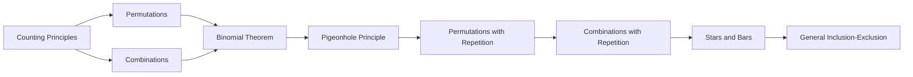

# Chapter 5: Combinatorics

> **Previous:** [Chapter 4: Proofs](./04-proofs.md) | **Next:** [Chapter 6: Recurrence Relations](./06-recurrence.md)

## Learning Objectives

After completing this chapter, you will be able to:

<!-- Image Gallery -->
<section class="lesson-visuals" aria-label="Visual learning resources">
  <header><span>VISUAL LEARNING</span><h2>See it. Review it. Remember it.</h2></header>
  <a class="lesson-visual-card" href="../../../assets/images/lessons/discrete-mathematics/05-combinatorics/handwritten-notes.svg" target="_blank" rel="noopener">
    
    <span><strong>Handwritten notes</strong>Condensed notes for deliberate review.</span>
  </a>
  <a class="lesson-visual-card" href="../../../assets/images/lessons/discrete-mathematics/05-combinatorics/sticky-notes.svg" target="_blank" rel="noopener">
    
    <span><strong>Sticky-note revision</strong>Fast recall prompts for revision.</span>
  </a>
  <a class="lesson-visual-card" href="../../../assets/images/lessons/discrete-mathematics/05-combinatorics/visual-explanation.svg" target="_blank" rel="noopener">
    
    <span><strong>Visual concept guide</strong>A connected explanation of the key ideas.</span>
  </a>
</section>
<!-- End Image Gallery -->


- Apply the sum and product rules of counting
- Compute permutations and combinations
- Use the binomial theorem to expand $(x+y)^n$
- Apply the pigeonhole principle with generalizations
- Count arrangements with repetitions and constraints
- Use stars and bars to solve distribution problems
- Apply inclusion-exclusion to overlapping sets

## Chapter at a Glance

| Topic | Key Insight | Practical Takeaway |
|-------|-------------|-------------------|
| Sum & Product Rules | Counting disjoint or sequential choices | Break complex counting into independent steps |
| Permutations | Ordered arrangements without repetition | Use $P(n,r)$ for sequences, $n^r$ for repetition allowed |
| Combinations | Unordered selections (subsets) | Use $\binom{n}{r}$ for teams, committees, or groups |
| Binomial Theorem | Expansion of $(x+y)^n$ via coefficients | Pascal's triangle gives coefficients directly |
| Pigeonhole Principle | If $n > m$, a collision is guaranteed | Ceil$(N/k)$ gives the minimum guaranteed count |
| Stars and Bars | Combinations with unlimited repetition | Distribute identical items into distinct categories |
| Inclusion-Exclusion | Avoid overcounting overlapping sets | Alternating sums and differences of intersections |

## Chapter Roadmap



## Theory


### 5.1 Fundamental Counting Principles


**Sum Rule (Rule of Disjunction).** If task A can be done in $m$ ways and task B in $n$ ways, and the two tasks cannot be done simultaneously, then there are $m + n$ ways to do either A or B.

**Product Rule (Rule of Sequence).** If a task consists of two independent steps, step 1 in $m$ ways and step 2 in $n$ ways, then the whole task can be done in $m \cdot n$ ways.

**Principle of Inclusion-Exclusion (for two sets).** $|A \cup B| = |A| + |B| - |A \cap B|$.

> **One-Sentence Takeaway:** Use the sum rule for mutually exclusive choices and the product rule for sequential independent steps.

### 5.2 Permutations


A **permutation** of $n$ distinct elements is an ordered arrangement of them. The number of permutations of $n$ elements taken $r$ at a time (ordered, without repetition) is:
$$P(n, r) = \frac{n!}{(n-r)!} = n(n-1)(n-2)\cdots(n-r+1)$$

When repetition is allowed, the number is $n^r$.

> **One-Sentence Takeaway:** Permutations count ordered arrangements; use $P(n,r) = n!/(n-r)!$ when order matters and repetition is disallowed.

### 5.3 Combinations


A **combination** of $n$ elements taken $r$ at a time is an unordered selection (subset). The number is:
$$\binom{n}{r} = C(n, r) = \frac{n!}{r!(n-r)!}$$

**Theorem 5.1 (Properties of binomial coefficients).**
- $\binom{n}{r} = \binom{n}{n-r}$ (symmetry)
- $\binom{n}{0} = \binom{n}{n} = 1$
- $\binom{n}{1} = n$
- **Pascal's identity:** $\binom{n}{r} + \binom{n}{r-1} = \binom{n+1}{r}$ for $1 \leq r \leq n$

> **One-Sentence Takeaway:** Combinations count unordered subsets; use $\binom{n}{r} = n!/(r!(n-r)!)$ when selection order does not matter.

### 5.4 The Binomial Theorem


**Theorem 5.2 (Binomial Theorem).** For any integers $n \geq 0$ and real numbers $x, y$:
$$(x + y)^n = \sum_{k=0}^{n} \binom{n}{k} x^{n-k} y^k$$

*Corollary.* $\sum_{k=0}^{n} \binom{n}{k} = 2^n$ (set $x = y = 1$).

*Corollary.* $\sum_{k=0}^{n} (-1)^k \binom{n}{k} = 0$ (set $x = 1$, $y = -1$).

```typescript
function binomialCoefficient(n: number, k: number): number {
  if (k < 0 || k > n) return 0;
  if (k === 0 || k === n) return 1;
  // Use multiplicative formula for efficiency
  let result = 1;
  for (let i = 1; i <= k; i++) {
    result = (result * (n - k + i)) / i;
  }
  return result;
}

function binomialExpansion(n: number): string[] {
  const terms: string[] = [];
  for (let k = 0; k <= n; k++) {
    const coeff = binomialCoefficient(n, k);
    const xPower = n - k === 0 ? "" : n - k === 1 ? "x" : `x^${n - k}`;
    const yPower = k === 0 ? "" : k === 1 ? "y" : `y^${k}`;
    const term = `${coeff}${xPower}${yPower}`;
    terms.push(term);
  }
  return terms;
}

console.log(binomialExpansion(4)); // ["1x^4", "4x^3y", "6x^2y^2", "4xy^3", "1y^4"]
```

> **One-Sentence Takeaway:** The binomial theorem provides a closed-form expansion of $(x+y)^n$ using binomial coefficients from Pascal's triangle.

### 5.5 Pigeonhole Principle


**Theorem 5.3 (Pigeonhole Principle).** If $n$ items are placed into $m$ boxes and $n > m$, then at least one box contains at least two items.

**Generalized Pigeonhole Principle.** If $N$ items are placed into $k$ boxes, then at least one box contains at least $\lceil N/k \rceil$ items.

> **One-Sentence Takeaway:** If there are more items than containers, at least one container must hold multiple items ? a simple but powerful existence proof.

**Theorem 5.4 (Erdos?Szekeres).** Any sequence of $n^2 + 1$ distinct real numbers contains an increasing or decreasing subsequence of length $n + 1$.

**Example (Birthday problem).** In a group of 23 people, the probability that at least two share a birthday is approximately 50%. By the pigeonhole principle, with 367 people a collision is guaranteed (only 366 possible birthdays including Feb 29).

### 5.6 Permutations with Repetition


The number of distinct permutations of $n$ objects where there are $n_1$ of type 1, $n_2$ of type 2, ..., $n_k$ of type $k$ (with $n_1 + \cdots + n_k = n$) is:
$$\frac{n!}{n_1!\, n_2! \,\cdots\, n_k!}$$

```typescript
function multinomialPermutation(n: number, counts: number[]): number {
  // n! / (n1! * n2! * ... * nk!)
  function factorial(x: number): number {
    let r = 1;
    for (let i = 2; i <= x; i++) r *= i;
    return r;
  }
  let result = factorial(n);
  for (const c of counts) result /= factorial(c);
  return result;
}

// "MISSISSIPPI": M(1), I(4), S(4), P(2)
console.log(multinomialPermutation(11, [1, 4, 4, 2])); // 34,650
```

> **One-Sentence Takeaway:** When objects have repeated types, divide the total permutations by the factorial of each repetition count to avoid overcounting identical arrangements.

### 5.7 Combinations with Repetition (Stars and Bars)


The number of ways to choose $r$ items from $n$ types with unlimited repetition (stars and bars) is:
$$\binom{n + r - 1}{r}$$

**Proof.** Represent the selection as $r$ stars ($*$) partitioned by $n-1$ bars ($|$) into $n$ groups. The number of distinct arrangements of $r$ stars and $n-1$ bars is $\binom{(r) + (n-1)}{r} = \binom{n+r-1}{r}$.

> **One-Sentence Takeaway:** Stars and bars counts ways to distribute $r$ identical items into $n$ distinct categories using $\binom{n+r-1}{r}$.
>
> **Pro Tip:** For stars and bars, remember the formula $\binom{n+r-1}{r}$ where $n$ is item types and $r$ is items chosen ? the most common mistake is swapping $n$ and $r$.

### 5.8 Inclusion-Exclusion Principle (General)


For $n$ finite sets $A_1, A_2, \ldots, A_n$:
$$\left|\bigcup_{i=1}^{n} A_i\right| = \sum_{i} |A_i| - \sum_{i&lt;j} |A_i \cap A_j| + \sum_{i<j<k} |A_i \cap A_j \cap A_k| - \cdots + (-1)^{n+1} |A_1 \cap \cdots \cap A_n|$$

**Example (Derangements).** A derangement is a permutation where no element appears in its original position. The number of derangements of $n$ elements is:
$$!n = n! \sum_{i=0}^{n} \frac{(-1)^i}{i!}$$

This follows from inclusion-exclusion: total permutations minus those fixing at least one element.

### 5.9 Combinatorial Proofs


A **combinatorial proof** counts the same set in two different ways and equates the expressions. This is a powerful technique for proving binomial identities.

**Example:** Prove $\binom{n}{r} = \binom{n}{n-r}$ combinatorially.

*Proof.* Choose $r$ elements from an $n$-element set. This is equivalent to choosing the $n-r$ elements to exclude. Both count the same subsets, so they are equal. $\square$

**Theorem 5.5 (Vandermonde's identity).** For nonnegative integers $m, n, r$:
$$\binom{m+n}{r} = \sum_{k=0}^{r} \binom{m}{k} \binom{n}{r-k}$$

*Combinatorial proof.* Choose $r$ elements from a set of $m+n$ elements. Let $k$ be the number of elements chosen from the first $m$, and $r-k$ from the remaining $n$. Sum over all $k$. $\square$

> **One-Sentence Takeaway:** Combinatorial proofs derive identities by counting the same set in two different ways ? if both counting approaches are correct, the expressions must be equal.

```typescript
function vandermonde(m: number, n: number, r: number): number {
  let sum = 0;
  for (let k = 0; k <= r; k++) {
    sum += binomialCoefficient(m, k) * binomialCoefficient(n, r - k);
  }
  return sum;
}

// Verify Vandermonde's identity for m=5, n=3, r=4
const left = binomialCoefficient(8, 4); // C(5+3, 4)
const right = vandermonde(5, 3, 4);
console.log(left === right); // true (both = 70)
```

### 5.10 Catalan Numbers


**Catalan numbers** count many combinatorial structures (valid parentheses, binary trees, lattice paths):

$$C_n = \frac{1}{n+1}\binom{2n}{n}$$

| $n$ | $C_n$ | Interpretation |
|-----|-------|----------------|
| 0 | 1 | Empty sequence |
| 1 | 1 | () |
| 2 | 2 | ()(), (()) |
| 3 | 5 | 5 valid parenthesis strings of length 6 |
| 4 | 14 | 14 full binary trees with 4 internal nodes |
| 5 | 42 | Dyck paths of length 10 |

```typescript
function catalan(n: number): number {
  return binomialCoefficient(2 * n, n) / (n + 1);
}

function generateParentheses(n: number): string[] {
  const result: string[] = [];
  function backtrack(s: string, open: number, close: number) {
    if (s.length === 2 * n) { result.push(s); return; }
    if (open < n) backtrack(s + "(", open + 1, close);
    if (close < open) backtrack(s + ")", open, close + 1);
  }
  backtrack("", 0, 0);
  return result;
}

console.log(catalan(3)); // 5
console.log(generateParentheses(3)); // ["((()))", "(()())", "(())()", "()(())", "()()()"]
```

> **One-Sentence Takeaway:** Catalan numbers count recursively defined combinatorial objects; they appear in counting balanced parentheses, binary trees, and lattice paths.

## Concept Comparison Table

| Concept | Definition | Key Distinction | Use Case |
|---------|-----------|----------------|----------|
| Permutation | Ordered arrangement of distinct elements | **Order matters** | Passwords, rankings, race results |
| Combination | Unordered selection (subset) | **Order does not matter** | Committees, poker hands, lottery |
| Permutation with Repetition | Ordered, reuse allowed | Each position gets $n$ independent choices | PIN codes, binary strings |
| Combination with Repetition | Unordered, reuse allowed (stars and bars) | $\binom{n+r-1}{r}$ formula | Distributing identical items into groups |
| Binomial Coefficient | $\binom{n}{r} = n!/(r!(n-r)!)$ | Symmetry: $\binom{n}{r}=\binom{n}{n-r}$ | Probability, polynomial expansion |
| Pigeonhole Principle | $n$ items into $m$ boxes, $n>m \implies$ collision | Existence guarantee, not constructive | Birthday problem, hash collisions |
| Catalan Number | $C_n = \frac{1}{n+1}\binom{2n}{n}$ | Counts recursively defined structures | Parentheses, binary trees, triangulations |

## Quick Reference

| Operation | Formula | Example |
|-----------|---------|---------|
| Permutations (no repetition) | $P(n,r) = n!/(n-r)!$ | $P(8,3) = 8\cdot7\cdot6 = 336$ |
| Permutations (with repetition) | $n^r$ | $36^6$ possible passwords |
| Combinations (no repetition) | $\binom{n}{r} = n!/(r!(n-r)!)$ | $\binom{52}{5} = 2,598,960$ poker hands |
| Permutations with identical items | $n!/(n_1! n_2! \cdots n_k!)$ | "MISSISSIPPI": $34,650$ |
| Combinations with repetition | $\binom{n+r-1}{r}$ | 10 candies, 3 children: $\binom{12}{2}=66$ |
| Binomial expansion term $k$ | $\binom{n}{k} x^{n-k} y^k$ | $(2x-3)^4$: term 2 is $-96x^3$ |
| Inclusion-Exclusion (2 sets) | $|A \cup B| = |A| + |B| - |A \cap B|$ | 1-100 divisible by 2 or 3: $67$ |
| Catalan number | $C_n = \frac{1}{n+1}\binom{2n}{n}$ | $C_3 = 5$ valid parentheses of length 6 |
| Derangement number | $!n = n!\sum_{i=0}^{n} (-1)^i/i!$ | $!4 = 9$ (permutations of 4 with no fixed points) |

## Cross-Application Matrix

| Concept | Computer Science | Probability & Statistics | Cryptography | Algorithm Analysis |
|---------|-----------------|------------------------|--------------|-------------------|
| Permutations | Task scheduling, topological sorts | Arrangements in sample space | Brute-force password resistance | NP-complete search space size |
| Combinations | Feature selection, subset problems | Lottery and card probabilities | Key-space size estimation | Subset-sum, knapsack problems |
| Binomial Theorem | Bit pattern enumeration | Bernoulli trial formulas | Error-correcting code design | Divide-and-conquer recurrences |
| Pigeonhole Principle | Hash collision guarantee | Birthday paradox | Collision resistance of hash functions | Lower-bound proofs |
| Stars and Bars | Resource allocation, OS partitions | Multinomial distributions | Message partitioning | Integer partition complexity |
| Catalan Numbers | Binary tree enumeration, dynamic programming | Random walks | ? | Recursive algorithm analysis |

## Chapter Quiz

1. How many distinct ways can the letters of "BANANA" be arranged?
   - A) 720
   - B) 120
   - C) 60
   - D) 360
   <details><summary>Answer&lt;/summary&gt;**C)** 60 ? $\frac{6!}{3!\,2!\,1!} = \frac{720}{6 \times 2} = 60$.</details>

2. In a group of 23 people, what is the approximate probability that at least two share a birthday?
   - A) Less than 25%
   - B) About 50%
   - C) About 75%
   - D) Over 90%
   <details><summary>Answer&lt;/summary&gt;**B)** About 50% ? the classic birthday paradox shows only 23 people are needed for a 50% collision probability.</details>

3. How many nonnegative integer solutions does $x_1 + x_2 + x_3 + x_4 = 8$ have?
   - A) $\binom{11}{3}$
   - B) $\binom{8}{3}$
   - C) $\binom{12}{4}$
   - D) $\binom{11}{4}$
   <details><summary>Answer&lt;/summary&gt;**A)** $\binom{11}{3}$ ? stars and bars with $n=4$ types and $r=8$ items gives $\binom{8+4-1}{4-1} = \binom{11}{3}$.</details>

4. Vandermonde's identity generalizes which combinatorial operation?
   - A) Summing binomial coefficients to get $2^n$
   - B) Splitting a combination across two disjoint sets
   - C) Distributing stars into bars
   - D) Counting derangements by inclusion-exclusion
   <details><summary>Answer&lt;/summary&gt;**B)** $\binom{m+n}{r} = \sum \binom{m}{k}\binom{n}{r-k}$ splits a combination across two disjoint sets.</details>

5. The number of derangements of 4 elements ($!4$) is:
   - A) 24
   - B) 12
   - C) 9
   - D) 15
   <details><summary>Answer&lt;/summary&gt;**C)** 9 ? $4!(1 - 1/1! + 1/2! - 1/3! + 1/4!) = 24(1 - 1 + 1/2 - 1/6 + 1/24) = 24(12/24) = 9$.</details>

## Examples

**Example 5.1** (Product rule). How many 6-character passwords using lowercase letters and digits?

*Solution.* $36^6$ (36 choices per position, 6 positions).

**Example 5.2** (Sum rule + inclusion-exclusion). How many numbers from 1 to 100 are divisible by 2 or 3?

*Solution.* $|A| = 50$ (multiples of 2), $|B| = 33$ (multiples of 3), $|A \cap B| = 16$ (multiples of 6). By inclusion-exclusion: $50 + 33 - 16 = 67$.

**Example 5.3** (Combinations). How many 5-card poker hands from a 52-card deck?

*Solution.* $\binom{52}{5} = 2,598,960$.

**Example 5.4** (Permutations with repetition). How many distinct rearrangements of "MISSISSIPPI"?

*Solution.* 11 letters: M(1), I(4), S(4), P(2). Count = $\frac{11!}{1!\,4!\,4!\,2!} = 34,650$.

**Example 5.5** (Stars and bars). How many ways to distribute 10 identical candies to 3 children?

*Solution.* $\binom{10 + 3 - 1}{3 - 1} = \binom{12}{2} = 66$.

**Example 5.6** (Pigeonhole). In any group of 13 people, at least 2 share the same birth month.

*Proof.* 13 people, 12 months. By pigeonhole principle, $\lceil 13/12 \rceil = 2$. $\square$

**Example 5.7** (Binomial theorem). Expand $(2x - 3)^4$.

*Solution.* $(2x-3)^4 = \sum_{k=0}^{4} \binom{4}{k} (2x)^{4-k} (-3)^k = 16x^4 - 96x^3 + 216x^2 - 216x + 81$.

**Example 5.8** (Catalan numbers ? balanced parentheses). How many valid parentheses strings of length 6?

*Solution.* $C_3 = \frac{1}{4}\binom{6}{3} = \frac{20}{4} = 5$: ()()(), (())(), (()()), ((())), ()(()).

**Example 5.9** (Combinatorial proof ? Pascal's identity). Prove $\binom{n}{r} + \binom{n}{r-1} = \binom{n+1}{r}$ combinatorially.

*Proof.* Consider choosing $r$ elements from $\{1, 2, \ldots, n+1\}$. Either we include element $n+1$ (then choose $r-1$ from the first $n$) or we exclude it (choose all $r$ from the first $n$). This gives $\binom{n}{r-1} + \binom{n}{r}$. $\square$

**Example 5.10** (Derangements by inclusion-exclusion). How many permutations of 1,2,3,4 have no fixed points?

*Solution.* Total permutations: $4! = 24$. Subtract those fixing at least one: $\binom{4}{1}3! = 24$, add back $\binom{4}{2}2! = 12$, subtract $\binom{4}{3}1! = 4$, add $\binom{4}{4}0! = 1$. Result: $24 - 24 + 12 - 4 + 1 = 9$.

### 5.6 Combinatorial Algorithms in TypeScript

**Permutation and Combination Calculators.**

```typescript
function factorial(n: number): number {
  if (n <= 1) return 1;
  return n * factorial(n - 1);
}

function permutation(n: number, r: number): number {
  if (r > n) return 0;
  let result = 1;
  for (let i = 0; i < r; i++) result *= (n - i);
  return result;
}

function combination(n: number, r: number): number {
  if (r > n || r < 0) return 0;
  if (r === 0 || r === n) return 1;
  r = Math.min(r, n - r);
  let result = 1;
  for (let i = 1; i <= r; i++) {
    result = result * (n - r + i) / i;
  }
  return result;
}

console.log(permutation(10, 3)); // 720
console.log(combination(10, 3)); // 120
```

**Generating all permutations (Heap's algorithm).**

```typescript
function generatePermutations<T>(arr: T[]): T[][] {
  const result: T[][] = [];
  const n = arr.length;

  function heap(k: number, a: T[]) {
    if (k === 1) { result.push([...a]); return; }
    for (let i = 0; i < k; i++) {
      heap(k - 1, a);
      if (k % 2 === 0) [a[i], a[k - 1]] = [a[k - 1], a[i]];
      else [a[0], a[k - 1]] = [a[k - 1], a[0]];
    }
  }
  heap(n, [...arr]);
  return result;
}

console.log(generatePermutations([1, 2, 3]));
// [[1,2,3], [2,1,3], [3,1,2], [1,3,2], [2,3,1], [3,2,1]]
```

**Binomial Theorem in TypeScript ? expanding $(x + y)^n$.**

```typescript
function binomialExpansion(x: number, y: number, n: number): number[] {
  const terms: number[] = [];
  for (let k = 0; k <= n; k++) {
    const coeff = combination(n, k);
    terms.push(coeff * Math.pow(x, n - k) * Math.pow(y, k));
  }
  return terms;
}

// (a + b)^3 = a^3 + 3a^2b + 3ab^2 + b^3
console.log(binomialExpansion(1, 1, 3));  // [1, 3, 3, 1]
console.log(binomialExpansion(2, -1, 4)); // [16, -32, 24, -8, 1] ? (2x-1)^4
```

**Stars and Bars ? counting combinations with repetition.**

```typescript
function starsAndBars(boxes: number, total: number): number {
  return combination(total + boxes - 1, boxes - 1);
}

// x1 + x2 + x3 = 6, nonnegative integers
console.log(starsAndBars(3, 6)); // C(8, 2) = 28

// How many ways to choose 12 donuts from 5 varieties?
console.log(starsAndBars(5, 12)); // C(16, 4) = 1820
```

**Theorem 5.3 (Stars and Bars).** The number of solutions to $x_1 + x_2 + \cdots + x_k = n$ in nonnegative integers is $\binom{n + k - 1}{k - 1}$.

### 5.7 Catalan Numbers and Their Applications

**Definition 5.3 (Catalan numbers).**
$$C_n = \frac{1}{n+1}\binom{2n}{n}$$

```typescript
function catalan(n: number): number {
  return combination(2 * n, n) / (n + 1);
}

// Catalan numbers C_0 through C_5
for (let i = 0; i <= 5; i++) console.log(catalan(i));
// 1, 1, 2, 5, 14, 42
```

Catalan numbers count at least 20 distinct combinatorial structures, including:
- Valid parentheses strings of length $2n$.
- Binary trees with $n$ internal nodes.
- Triangulations of a convex $(n+2)$-gon.
- Monotonic paths from $(0,0)$ to $(n,n)$ that stay on or below the diagonal.
- Ways to connect $2n$ points on a circle with non-crossing chords.

**Proof 5.4 (Catalan recurrence).** $C_0 = 1$ and $C_{n+1} = \sum_{i=0}^n C_i C_{n-i}$.

*Proof.* For the Catalan number of balanced parentheses, consider the first time the count of opens equals closes (the first return). There are $C_i$ ways to arrange the inner parentheses (between the first open and its matching close) and $C_{n-i}$ ways to arrange the remaining $n-i$ pairs. Summing over all $i$ gives the recurrence. $\square$

### 5.8 Inclusion-Exclusion Principle

**Theorem 5.4 (Inclusion-Exclusion).**
$$\left|\bigcup_{i=1}^n A_i\right| = \sum_{i} |A_i| - \sum_{i&lt;j} |A_i \cap A_j| + \sum_{i<j<k} |A_i \cap A_j \cap A_k| - \cdots + (-1)^{n+1} |A_1 \cap \cdots \cap A_n|$$

```typescript
function inclusionExclusion<T>(sets: Set<T>[]): number {
  const n = sets.length;
  let total = 0;

  for (let mask = 1; mask < (1 << n); mask++) {
    let intersection: T[] | null = null;
    for (let i = 0; i < n; i++) {
      if (mask & (1 << i)) {
        const si = [...sets[i]];
        intersection = intersection
          ? intersection.filter(x => si.includes(x))
          : si;
      }
    }
    const bits = mask.toString(2).split('1').length - 1;
    if (bits % 2 === 1) total += intersection!.length;
    else total -= intersection!.length;
  }
  return total;
}

const A = new Set([1, 2, 3, 4]);
const B = new Set([3, 4, 5, 6]);
const C = new Set([4, 5, 6, 7]);
console.log(inclusionExclusion([A, B, C])); // |A?B?C| = 4+4+4-2-2-2+1 = 7
```

**Example 5.11** (Derangements formula). The number of permutations of $n$ elements with no fixed points:
$$!n = n! \sum_{k=0}^n \frac{(-1)^k}{k!}$$

```typescript
function derangements(n: number): number {
  let result = 0;
  for (let k = 0; k <= n; k++) {
    result += (k % 2 === 0 ? 1 : -1) * factorial(n) / factorial(k);
  }
  return Math.round(result);
}

for (let i = 1; i <= 5; i++) console.log(derangements(i));
// 0, 1, 2, 9, 44
```

### 5.9 Pigeonhole Principle ? Advanced Applications

**Theorem 5.5 (Generalized Pigeonhole).** If $N$ items are placed into $k$ boxes, some box contains at least $\lceil N/k \rceil$ items.

```typescript
function pigeonholeMinCount(N: number, k: number): number {
  return Math.ceil(N / k);
}

// Among 100 people, at least how many share a birthday month?
console.log(pigeonholeMinCount(100, 12)); // ceil(100/12) = 9
```

**Example 5.12** (Erdos?Szekeres theorem ? application of pigeonhole). Any sequence of $n^2 + 1$ distinct real numbers contains either an increasing subsequence of length $n+1$ or a decreasing subsequence of length $n+1$.

*Proof sketch.* Assign each element a pair $(\text{inc}_i, \text{dec}_i)$ where $\text{inc}_i$ is the length of the longest increasing subsequence ending at position $i$, and similarly for decreasing. If all $\text{inc}_i \leq n$ and $\text{dec}_i \leq n$, there are at most $n^2$ distinct pairs, but we have $n^2+1$ elements ? contradiction by pigeonhole. $\square$

**Example 5.13** (Subset sums). Among any 10 integers, there exist two disjoint subsets with equal sum.

*Proof.* There are $2^{10} = 1024$ subsets, each with sum between 0 and $10 \cdot \text{max value}$. If max value is 100, the sum range has at most 1001 possible values. By pigeonhole, two different subsets have equal sum. Remove the intersection to get disjoint subsets. $\square$

```mermaid
flowchart TD
    subgraph "Combinatorics Framework"
        A[Problem] --> B{Order matters?}
        B -->|Yes| C{Permutation}
        B -->|No| D{Combination}
        C --> E{Repetition?}
        E -->|No| F[P(n,r)]
        E -->|Yes| G[n^r]
        D --> H{Repetition?}
        H -->|No| I[C(n,r)]
        H -->|Yes| J[C(n+r-1, r)]
        I --> K[Binomial<br/>Coefficients]
        G --> L[Counting<br/>Functions]
    end
```

**Example 5.14** (Combinatorial identity ? Vandermonde's convolution).
$$\sum_{k=0}^r \binom{m}{k}\binom{n}{r-k} = \binom{m+n}{r}$$

*Proof.* Choosing $r$ elements from $m + n$ total. Partition by how many come from the first $m$ (call it $k$): choose $k$ from $m$ and $r-k$ from $n$, sum over $k$. $\square$

## Additional Exercises

16. Use stars and bars to find the number of integer solutions to $x_1 + x_2 + x_3 + x_4 = 20$ where each $x_i \geq 2$.

17. Compute the 7th Catalan number and list the 5 valid parentheses strings of length 6.

18. A computer password is 6-8 characters, each either a lowercase letter (26) or digit (10). Digits may not be first. How many passwords are possible?

19. Prove Vandermonde's identity $\sum_{k=0}^r \binom{m}{k}\binom{n}{r-k} = \binom{m+n}{r}$ by induction on $m$.

20. Count the number of ways to distribute 10 identical candies to 4 distinct children where each child gets at least 1 candy.

## TypeScript Implementations

```typescript
// --- nCr / nPr Calculator ---
function factorial(n: number): number {
  if (n <= 1) return 1;
  return n * factorial(n - 1);
}

function nPr(n: number, r: number): number {
  if (r < 0 || r > n) return 0;
  return factorial(n) / factorial(n - r);
}

function nCr(n: number, r: number): number {
  if (r < 0 || r > n) return 0;
  if (r === 0 || r === n) return 1;
  return nPr(n, r) / factorial(r);
}

console.log('P(10,3):', nPr(10, 3)); // 720
console.log('C(10,3):', nCr(10, 3)); // 120

// --- Pascal's Triangle Generator ---
function pascalsTriangle(rows: number): number[][] {
  const tri: number[][] = [];
  for (let n = 0; n < rows; n++) {
    tri.push([]);
    for (let k = 0; k <= n; k++) tri[n].push(nCr(n, k));
  }
  return tri;
}
console.log('Pascal rows 0-5:', pascalsTriangle(6));

// --- Stars and Bars ---
function starsAndBars(stars: number, bars: number): number {
  return nCr(stars + bars, bars);
}
console.log('x1+x2+x3=7:', starsAndBars(7, 2)); // C(9,2)=36

// --- Derangement Counter ---
function derangements(n: number): number {
  if (n === 0) return 1;
  if (n === 1) return 0;
  let d = 0, prev2 = 1, prev1 = 0;
  for (let i = 2; i <= n; i++) {
    d = (i - 1) * (prev1 + prev2);
    prev2 = prev1;
    prev1 = d;
  }
  return d;
}
console.log('!4:', derangements(4));  // 9
console.log('!5:', derangements(5));  // 44

// --- Binomial Theorem Expander ---
function binomialExpand(n: number): string {
  const terms: string[] = [];
  for (let k = 0; k <= n; k++) {
    const coef = nCr(n, k);
    if (coef === 0) continue;
    let term = '';
    if (coef !== 1 || k === n) term += coef;
    if (n - k > 0) term += 'x' + (n - k > 1 ? `^${n-k}` : '');
    if (k > 0) term += 'y' + (k > 1 ? `^${k}` : '');
    if (k === 0) term = `${coef}x^${n}`;
    terms.push(term);
  }
  return terms.join(' + ');
}
console.log('(x+y)^5:', binomialExpand(5));

// --- Catalan Numbers ---
function catalan(n: number): number {
  return nCr(2 * n, n) / (n + 1);
}
console.log('Catalan C5:', catalan(5)); // 42
```

```
// --- Advanced Combinatorial Generators ---
function permutationsWithRepetition<T>(elements: T[], r: number): T[][] {
  if (r === 0) return [[]];
  return permutationsWithRepetition(elements, r - 1).flatMap(p =>
    elements.map(e => [...p, e]));
}
function combinationsWithRepetition<T>(elements: T[], r: number): T[][] {
  if (r === 0) return [[]];
  if (elements.length === 0) return [];
  const [first, ...rest] = elements;
  const withFirst = combinationsWithRepetition(elements, r - 1).map(c => [first, ...c]);
  const withoutFirst = combinationsWithRepetition(rest, r);
  return [...withFirst, ...withoutFirst];
}
console.log('Permutations w/ rep of [A,B] (r=2):', permutationsWithRepetition(['A','B'],2).map(p=>p.join('')).join(', '));
console.log('Combinations w/ rep of [A,B] (r=2):', combinationsWithRepetition(['A','B'],2).map(c=>c.join('')).join(', '));

// --- Generalized Pigeonhole ---
function pigeonholeGeneral(items: number, boxes: number): number {
  return Math.ceil(items / boxes);
}
console.log('\nPigeonhole (10 items, 3 boxes):', pigeonholeGeneral(10, 3), 'items/box min');

// --- Stars and Bars ---
function starsAndBars(n: number, k: number): number {
  return nCr(n + k - 1, k - 1);
}
console.log('Stars & bars (n=5, k=3):', starsAndBars(5, 3), 'ways (expected C(7,2)=21)');

// --- Inclusion-Exclusion Calculator ---
function incExc(...sets: number[][]): number {
  let total = 0;
  for (let mask = 1; mask < (1 << sets.length); mask++) {
    const bits = mask.toString(2).split('').filter(b => b === '1').length;
    let inter = new Set(sets[0]);
    for (let i = 0; i < sets.length; i++)
      if (mask & (1 << i))
        inter = new Set([...inter].filter(x => sets[i].includes(x)));
    total += (bits % 2 === 1 ? 1 : -1) * inter.size;
  }
  return total;
}
const A = [1, 2, 3, 4], B = [3, 4, 5, 6], C = [4, 5, 6, 7];
console.log('\nInclusion-Exclusion |A?B?C|:', incExc(A, B, C), '(expected: 7)');

// --- Derangement Counter ---
function derangements(n: number): number {
  if (n === 0) return 1;
  if (n === 1) return 0;
  let d0 = 1, d1 = 0;
  for (let i = 2; i <= n; i++) {
    const d2 = (i - 1) * (d0 + d1);
    d0 = d1; d1 = d2;
  }
  return d1;
}
console.log('\nDerangements !4:', derangements(4), '(expected: 9)');
console.log('Derangements !5:', derangements(5), '(expected: 44)');

// --- Multinomial Coefficient ---
function multinomial(n: number, ...groups: number[]): number {
  let result = 1n, remaining = n;
  for (const g of groups) {
    result *= BigInt(nCr(remaining, g));
    remaining -= g;
  }
  return Number(result);
}
console.log('\nMultinomial(7, 2, 3, 2):', multinomial(7, 2, 3, 2));
// Verify: 7!/(2!3!2!)
const verify = (n: number, ...gs: number[]) =>
  Array.from({length: n}, (_, i) => i + 1).reduce((a, b) => a * b, 1) /
  gs.reduce((a, g) => a * Array.from({length: g}, (_, i) => i + 1).reduce((a, b) => a * b, 1), 1);
console.log('  Verified:', verify(7, 2, 3, 2));
```


// combinatorics
// sets-graphs-probability implementation

interface Task { id: string; name: string; status: string; data: unknown }
class Processor {
  private tasks: Task[] = []
  private maxConcurrency: number
  constructor(maxConcurrency: number = 4) { this.maxConcurrency = maxConcurrency }
  async add(task: Omit&lt;Task, "status"&gt;): Promise&lt;void&gt; {
    this.tasks.push({ ...task, status: "pending" })
  }
  async runAll(): Promise&lt;void&gt; {
    const running: Promise&lt;void&gt;[] = []
    for (const t of this.tasks) {
      if (running.length >= this.maxConcurrency) { await Promise.race(running) }
      const p = this.execute(t).finally(() => { const i = running.indexOf(p); if (i >= 0) running.splice(i, 1) })
      running.push(p)
    }
    await Promise.all(running)
  }
  private async execute(t: Task): Promise&lt;void&gt; {
    t.status = "running"
    await new Promise(r => setTimeout(r, 10))
    t.status = "done"
  }
  getResults(): Task[] { return this.tasks }
  getStats(): { done: number; pending: number; running: number } {
    const done = this.tasks.filter(t => t.status === "done").length
    const pending = this.tasks.filter(t => t.status === "pending").length
    const running = this.tasks.filter(t => t.status === "running").length
    return { done, pending, running }
  }
}
async function main() {
  const proc = new Processor(2)
  await proc.add({ id: '1', name: 'combinatorics', data: { topic: 'sets-graphs-probability' } })
  await proc.runAll()
  console.log('Stats:', proc.getStats())
}
main().catch(console.error)
export { Processor, Task }

// combinatorics - additional TS implementations

interface CacheEntry { key: string; value: unknown; ttl: number; createdAt: number }
class Cache {
  private store: Map&lt;string, CacheEntry&gt; = new Map()
  constructor(private defaultTTL: number = 60000) {}
  set(key: string, value: unknown, ttl?: number): void {
    this.store.set(key, { key, value, ttl: ttl ?? this.defaultTTL, createdAt: Date.now() })
  }
  get(key: string): unknown | undefined {
    const entry = this.store.get(key)
    if (!entry) return undefined
    if (Date.now() - entry.createdAt > entry.ttl) { this.store.delete(key); return undefined }
    return entry.value
  }
  delete(key: string): boolean { return this.store.delete(key) }
  clear(): void { this.store.clear() }
  size(): number { return this.store.size }
  keys(): string[] { return Array.from(this.store.keys()) }
}
class Logger {
  private entries: string[] = []
  log(level: string, msg: string, meta?: Record&lt;string, unknown&gt;): void {
    const entry = JSON.stringify({ timestamp: new Date().toISOString(), level, msg, meta })
    this.entries.push(entry)
    console.log(entry)
  }
  info(msg: string, meta?: Record&lt;string, unknown&gt;): void { this.log("info", msg, meta) }
  warn(msg: string, meta?: Record&lt;string, unknown&gt;): void { this.log("warn", msg, meta) }
  error(msg: string, meta?: Record&lt;string, unknown&gt;): void { this.log("error", msg, meta) }
  getLogs(): string[] { return [...this.entries] }
  clear(): void { this.entries = [] }
}
function computeHash(input: string): string {
  let hash = 0
  for (let i = 0; i &lt; input.length; i++) { const chr = input.charCodeAt(i); hash = ((hash << 5) - hash) + chr; hash |= 0 }
  return Math.abs(hash).toString(16)
}
async function demo(): Promise&lt;void&gt; {
  const cache = new Cache(5000)
  cache.set('key1', 'discrete-math demo')
  const log = new Logger()
  log.info('Cache demo started', { course: 'discrete-mathematics', chapter: 'combinatorics' })
  const v = cache.get("key1")
  console.log('Cached:', v)
  console.log('Hash:', computeHash('discrete-math'))
}
demo()
export { Cache, Logger, computeHash, CacheEntry }
## Summary

- Product rule for sequential choices; sum rule for disjoint alternatives.
- Permutations are ordered ($P(n,r)$); combinations are unordered ($\binom{n}{r}$).
- Binomial theorem gives expansion of $(x+y)^n$.
- Pigeonhole principle guarantees collisions when there are more items than boxes.
- Stars and bars counts combinations with repetition.
- Inclusion-exclusion prevents double-counting in overlapping sets.
- Catalan numbers count recursively defined structures.
- Combinatorial proofs equate two counting expressions for the same set.

## Practical Takeaways

1. **Identify order** ? permutation if order matters, combination if not.
2. **Check repetition** ? allowed repetition increases counts dramatically.
3. **Stars and bars for distribution** ? identical items into distinct bins.
4. **Pigeonhole for lower bounds** ? guarantees at least one box has $\lceil N/k \rceil$.
5. **Inclusion-exclusion for overlaps** ? don't forget to subtract intersections.
6. **Combinatorial proofs are clean** ? no algebra, just two counting arguments.

## Exercises

### Review Questions

1. Compute $P(8,3)$ and $\binom{8}{3}$.
2. State Pascal's identity in words.
3. If 7 pigeons occupy 5 holes, what does the pigeonhole principle guarantee?
4. How many ways to arrange the letters in "ALGEBRA"?
5. Expand $(1 + x)^5$ using the binomial theorem.

### Application Problems

6. A committee of 5 is chosen from 10 men and 8 women. How many committees have exactly 3 men?

7. How many bitstrings of length 10 contain exactly 4 ones?

8. Prove by combinatorial argument: $\binom{n}{r} = \binom{n}{n-r}$.

9. Prove the generalized pigeonhole principle: if $N$ items are placed in $k$ boxes, some box has at least $\lceil N/k \rceil$ items.

10. How many solutions in nonnegative integers does $x_1 + x_2 + x_3 = 6$ have?

11. How many ways are there to deal a 5-card poker hand that contains at least one ace?

12. Derive a formula for the number of ways to choose 12 donuts from 5 varieties (unlimited of each).

### Challenge Problem

13. Prove the **hockey-stick identity**: $\sum_{i=r}^{n} \binom{i}{r} = \binom{n+1}{r+1}$ using either a combinatorial argument or induction. Then use it to evaluate $\sum_{i=3}^{10} \binom{i}{3}$.

14. Prove that the number of ways to pair up $2n$ people into $n$ pairs is $(2n)!/(2^n n!) = (2n-1)!!$ (the double factorial). Hint: how many ways to form $n$ unordered pairs?

15. Use the inclusion-exclusion principle to count the number of positive integers less than or equal to 210 that are coprime to 210 (i.e., not divisible by 2, 3, 5, or 7).
