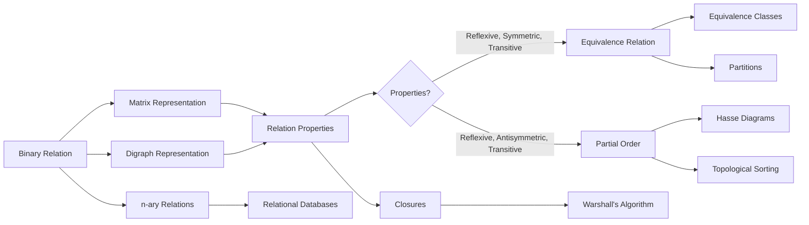
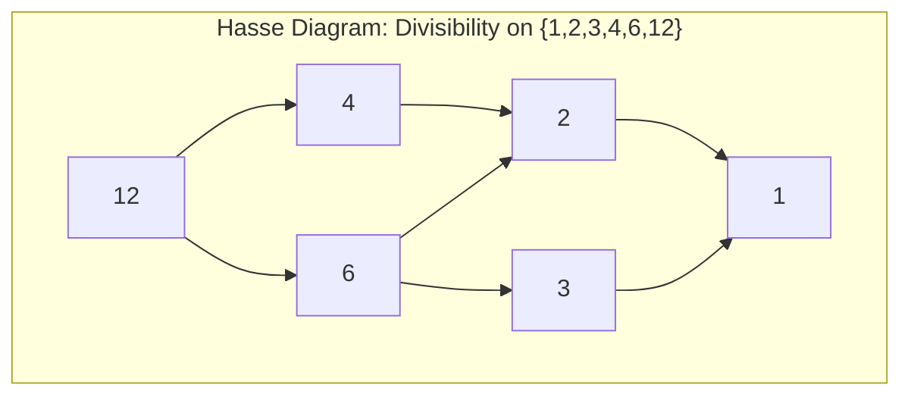

# Chapter 7: Relations

> **Previous:** [Chapter 6: Recurrence Relations](./06-recurrence.md) | **Next:** [Chapter 8: Functions](./08-functions.md)

## Learning Objectives


After completing this chapter, you will be able to:

- Represent relations as sets of ordered pairs and as matrices or digraphs
- Determine whether a relation is reflexive, symmetric, antisymmetric, or transitive
- Form equivalence relations and identify equivalence classes
- Construct partial orders and draw Hasse diagrams
- Find closures of relations including transitive closure via Warshall's algorithm
- Compute compositions and powers of relations
- Perform topological sorting on partially ordered sets
- Apply n-ary relations to relational databases

## Chapter at a Glance

| Topic | Key Insight | Practical Takeaway |
|-------|-------------|-------------------|
| Relation Definition | Subset of $A \times B$ ? a set of ordered pairs | Relations generalize functions; every function is a relation |
| Relation Properties | Reflexive, symmetric, antisymmetric, transitive | These four properties classify all binary relations |
| Closures | Add minimum pairs to achieve a desired property | Transitive closure is computed via Warshall's algorithm |
| Equivalence Relations | Reflexive + symmetric + transitive | Partitions the set into disjoint equivalence classes |
| Partial Orders | Reflexive + antisymmetric + transitive | Posets model hierarchies, dependencies, and ordering |
| n-ary Relations | Subset of $A_1 \times \dots \times A_n$ | Foundational to relational database theory |
| Topological Sorting | Linear ordering consistent with a partial order | Used in build systems and scheduling |

## Chapter Roadmap



## Theory

### 7.1 Definition

A **binary relation** $R$ from set $A$ to set $B$ is a subset of $A \times B$. When $A = B$, we say $R$ is a relation on $A$. We write $a R b$ to mean $(a, b) \in R$.

> **One-Sentence Takeaway:** A binary relation is simply a set of ordered pairs; it can model any pairwise connection between elements of two sets.

### 7.2 Representations

**Matrix representation.** If $A = \{a_1, \ldots, a_m\}$ and $B = \{b_1, \ldots, b_n\}$, the relation $R$ can be represented by an $m \times n$ zero-one matrix $M_R$ with $M_R[i, j] = 1$ iff $(a_i, b_j) \in R$.

**Matrix operations on relations:**
- $M_{R \cup S}[i,j] = M_R[i,j] \lor M_S[i,j]$ (Boolean OR)
- $M_{R \cap S}[i,j] = M_R[i,j] \land M_S[i,j]$ (Boolean AND)
- $M_{S \circ R} = M_R \cdot M_S$ (Boolean matrix multiplication)

**Digraph representation.** For a relation on $A$, draw a directed graph with vertices $A$ and an edge $a \rightarrow b$ iff $(a, b) \in R$.

```typescript
// Represent a relation as a zero-one matrix
type RelationMatrix = number[][];

function compose(R: RelationMatrix, S: RelationMatrix): RelationMatrix {
  const n = R.length;
  const result: RelationMatrix = Array.from({ length: n }, () => Array(n).fill(0));
  for (let i = 0; i < n; i++) {
    for (let j = 0; j < n; j++) {
      for (let k = 0; k < n; k++) {
        if (R[i][k] && S[k][j]) { result[i][j] = 1; break; }
      }
    }
  }
  return result;
}

function power(R: RelationMatrix, n: number): RelationMatrix {
  if (n === 0) return R.map((_, i) => R.map((_, j) => (i === j ? 1 : 0))); // identity
  if (n === 1) return R;
  return compose(R, power(R, n - 1));
}
```

> **One-Sentence Takeaway:** Relations can be represented as zero-one matrices (for computation) or digraphs (for visualization); each representation makes different properties easy to verify.

### 7.3 Properties of Relations

Let $R$ be a relation on a set $A$.
- **Reflexive:** $a R a$ for all $a \in A$.
- **Irreflexive:** $a \not R a$ for all $a \in A$.
- **Symmetric:** $a R b \implies b R a$ for all $a, b \in A$.
- **Antisymmetric:** $(a R b \land b R a) \implies a = b$.
- **Asymmetric:** $a R b \implies b \not R a$.
- **Transitive:** $(a R b \land b R c) \implies a R c$ for all $a, b, c \in A$.

```typescript
function isReflexive(M: RelationMatrix): boolean {
  for (let i = 0; i < M.length; i++) {
    if (M[i][i] !== 1) return false;
  }
  return true;
}

function isSymmetric(M: RelationMatrix): boolean {
  for (let i = 0; i < M.length; i++) {
    for (let j = 0; j < M.length; j++) {
      if (M[i][j] !== M[j][i]) return false;
    }
  }
  return true;
}

function isAntisymmetric(M: RelationMatrix): boolean {
  for (let i = 0; i < M.length; i++) {
    for (let j = 0; j < M.length; j++) {
      if (i !== j && M[i][j] === 1 && M[j][i] === 1) return false;
    }
  }
  return true;
}

function isTransitive(M: RelationMatrix): boolean {
  const M2 = compose(M, M);
  for (let i = 0; i < M.length; i++) {
    for (let j = 0; j < M.length; j++) {
      if (M2[i][j] === 1 && M[i][j] !== 1) return false;
    }
  }
  return true;
}
```

> **One-Sentence Takeaway:** The four core properties ? reflexive, symmetric, antisymmetric, transitive ? form the vocabulary for classifying any binary relation.

### 7.4 Combining Relations

$R$ and $S$ can be combined via set operations ($R \cup S$, $R \cap S$, $R \setminus S$).

**Composition:** $S \circ R = \{(a, c) \mid \exists b \in A,\; (a, b) \in R \land (b, c) \in S\}$.

**Powers:** $R^n = R \circ R \circ \cdots \circ R$ ($n$ times). $R^0$ is the identity relation $\{(a, a) \mid a \in A\}$.

**Theorem 7.1 (Associativity of composition).** $(R \circ S) \circ T = R \circ (S \circ T)$.

**Theorem 7.2 (Powers and transitivity).** $R$ is transitive iff $R^2 \subseteq R$.

> **One-Sentence Takeaway:** Composition chains relations together ($a R b$ and $b S c$ give $a (S \circ R) c$); powers iterate a single relation.

### 7.5 Closures

The **reflexive closure** of $R$ is $R \cup \{(a, a) \mid a \in A\} = R \cup \Delta$.

The **symmetric closure** is $R \cup R^{-1}$ where $R^{-1} = \{(b, a) \mid (a, b) \in R\}$.

The **transitive closure** is $\bigcup_{n=1}^{\infty} R^n$. Computed via **Warshall's algorithm** or by finding reachability in the digraph.

**Warshall's algorithm** computes the transitive closure in $O(n^3)$:
```
Let W_k[i,j] = 1 iff there is a path from i to j using intermediate vertices only from {1,...,k}
Initialize W_0 = M_R
For k = 1 to n:
  For i = 1 to n:
    For j = 1 to n:
      W_k[i,j] = W_{k-1}[i,j] OR (W_{k-1}[i,k] AND W_{k-1}[k,j])
Return W_n
```

```typescript
function warshall(M: RelationMatrix): RelationMatrix {
  const n = M.length;
  const W = M.map(row => [...row]); // deep copy
  for (let k = 0; k < n; k++) {
    for (let i = 0; i < n; i++) {
      for (let j = 0; j < n; j++) {
        W[i][j] = W[i][j] || (W[i][k] && W[k][j]) ? 1 : 0;
      }
    }
  }
  return W;
}

const R: RelationMatrix = [
  [0, 1, 0, 0],
  [0, 0, 1, 0],
  [0, 0, 0, 1],
  [1, 0, 0, 0],
];
console.log(warshall(R));
// [[1,1,1,1],[1,1,1,1],[1,1,1,1],[1,1,1,1]]
```

> **One-Sentence Takeaway:** Closures add the minimum number of ordered pairs needed to make a relation reflexive, symmetric, or transitive without changing its original content.
>
> **Pro Tip:** Warshall's algorithm computes transitive closure in $O(n^3)$ using dynamic programming ? it is essentially Floyd-Warshall for reachability on unweighted graphs.

### 7.6 Equivalence Relations

**Definition.** A relation $R$ on $A$ is an **equivalence relation** if it is reflexive, symmetric, and transitive.

**Equivalence class** of $a$: $[a] = \{b \in A \mid a R b\}$.

**Theorem 7.3 (Partition).** The equivalence classes of an equivalence relation on $A$ form a partition of $A$ (disjoint, nonempty, covering all of $A$). Conversely, any partition of $A$ defines an equivalence relation.

**Properties of equivalence classes:**
- $a \in [a]$ (reflexivity)
- $[a] = [b]$ iff $a R b$ (equivalent elements share the same class)
- $[a] \cap [b] = \emptyset$ iff $\neg(a R b)$ (classes are disjoint or identical)

```typescript
function computeEquivalenceClasses(set: number[], relation: RelationMatrix): number[][] {
  const n = set.length;
  const visited = new Array(n).fill(false);
  const classes: number[][] = [];
  for (let i = 0; i < n; i++) {
    if (!visited[i]) {
      const cls: number[] = [];
      for (let j = 0; j < n; j++) {
        if (relation[i][j]) { visited[j] = true; cls.push(set[j]); }
      }
      classes.push(cls);
    }
  }
  return classes;
}
```

> **One-Sentence Takeaway:** An equivalence relation groups elements into equivalence classes that partition the set ? two equivalence classes are either identical or disjoint.

### 7.7 Partial Orders

**Definition.** A relation $R$ on $A$ is a **partial order** if it is reflexive, antisymmetric, and transitive. Denoted $\preceq$ or $\leq$. The pair $(A, \preceq)$ is a **partially ordered set** (poset).

Elements $a$ and $b$ are **comparable** if $a \preceq b$ or $b \preceq a$. A poset where every pair is comparable is a **total order** (chain).

**Hasse diagrams** are digraphs of partial orders drawn with:
1. Transitive edges omitted.
2. Reflexive loops omitted.
3. Arrows oriented upward (edges are undirected, direction implied by vertical position).

**Special elements:**
- **Maximal:** no element is greater.
- **Minimal:** no element is smaller.
- **Greatest:** greater than or equal to all.
- **Least:** less than or equal to all.
- **Upper bound:** $u$ with $a \preceq u$ for all $a$ in a subset.
- **Least upper bound (supremum):** the smallest upper bound.
- **Greatest lower bound (infimum):** the largest lower bound.

A **lattice** is a poset where every pair of elements has a supremum and an infimum.

**Topological sorting:** A linear ordering of a poset consistent with the partial order (if $a \preceq b$, then $a$ comes before $b$).

```typescript
function topologicalSort(n: number, edges: [number, number][]): number[] {
  // Kahn's algorithm
  const inDegree = new Array(n).fill(0);
  const adj: number[][] = Array.from({ length: n }, () => []);
  for (const [u, v] of edges) {
    adj[u].push(v);
    inDegree[v]++;
  }
  const queue: number[] = [];
  for (let i = 0; i < n; i++) {
    if (inDegree[i] === 0) queue.push(i);
  }
  const result: number[] = [];
  while (queue.length > 0) {
    const u = queue.shift()!;
    result.push(u);
    for (const v of adj[u]) {
      inDegree[v]--;
      if (inDegree[v] === 0) queue.push(v);
    }
  }
  return result; // If length !== n, graph has a cycle
}

const deps: [number, number][] = [
  [0, 2], [0, 3],  // a before c, d
  [1, 3],           // b before d
  [2, 4],           // c before e
  [3, 4], [3, 5],   // d before e, f
];
console.log(topologicalSort(6, deps)); // e.g., [0, 1, 2, 3, 4, 5]
```

> **One-Sentence Takeaway:** A partial order is reflexive, antisymmetric, and transitive; Hasse diagrams visualize posets by omitting transitive and reflexive edges; topological sorting produces a linear extension.

### 7.8 n-ary Relations

An **n-ary relation** is a subset of $A_1 \times A_2 \times \cdots \times A_n$. Used in relational databases. Operations include projection ($\Pi$) and join ($\bowtie$).

**Projection:** $\Pi_{i_1,\ldots,i_k}(R)$ selects specified columns from an n-ary relation.

**Selection:** $\sigma_{\text{condition}}(R)$ selects rows satisfying a condition.

**Join:** $R \bowtie S$ combines two relations based on a common attribute.

**Example (Database relation).** A 3-ary relation $R \subseteq \text{Students} \times \text{Courses} \times \text{Grades}$:

| Student | Course | Grade |
|---------|--------|-------|
| Alice | CS101 | A |
| Bob | CS101 | B |
| Alice | CS201 | A+ |

Projection $\Pi_{\text{Student}}(R)$: $\{\text{Alice}, \text{Bob}\}$.

> **One-Sentence Takeaway:** n-ary relations generalize binary relations to any number of sets and form the mathematical foundation of relational database theory.

## Concept Comparison Table

| Concept | Definition | Key Distinction | Use Case |
|---------|-----------|----------------|----------|
| Reflexive | $a R a$ for all $a$ | Every element relates to itself | $\leq$ on numbers, subset relation |
| Symmetric | $a R b \implies b R a$ | Bidirectional relationship | Equality, "is-sibling-of" |
| Antisymmetric | $a R b \land b R a \implies a = b$ | Only identical elements are mutually related | $\leq$, divisibility, subset |
| Transitive | $a R b \land b R c \implies a R c$ | Chain property | Ancestry, ordering, divisibility |
| Equivalence Relation | Reflexive + Symmetric + Transitive | Partitions the set into classes | Congruence modulo $n$, same-color grouping |
| Partial Order | Reflexive + Antisymmetric + Transitive | Defines a hierarchy, not all pairs comparable | Task dependencies, file-system directories |
| Lattice | Poset with all supremums and infimums | Both operations defined for every pair | Boolean algebras, set inclusion |
| Transitive Closure | $\bigcup_{n \geq 1} R^n$ | Reachability in a directed graph | Graph connectivity, database queries |

## Quick Reference

| Property | Condition on $R$ | Matrix Check | Digraph Check |
|----------|-----------------|--------------|---------------|
| Reflexive | $(a,a) \in R$ for all $a$ | Diagonal all 1s | Loop on every vertex |
| Symmetric | $a R b \implies b R a$ | $M_R = M_R^T$ | All edges bidirectional |
| Antisymmetric | $a R b \land b R a \implies a=b$ | $M_R \land M_R^T \leq I$ | No two-way edges between distinct vertices |
| Transitive | $a R b \land b R c \implies a R c$ | $M_R^2 \leq M_R$ | If path of length 2 exists, direct edge too |
| Equivalence | Reflexive + Symmetric + Transitive | All three checks pass | Components are complete cliques (no edges between components) |
| Partial Order | Reflexive + Antisymmetric + Transitive | Anti-sym + transitivity + diagonal 1s | DAG with loops, upward orientation |

## Cross-Application Matrix

| Topic | Databases | Graph Theory | Programming | Scheduling |
|-------|-----------|-------------|-------------|------------|
| Relations | Table schemas (n-ary), joins | Edge sets in graphs | Type systems, subclass hierarchies | Task dependency graphs |
| Equivalence Relations | Normalization, key uniqueness | Connected components | == operator, hash equality | Grouping by resource requirements |
| Partial Orders | Schema versioning | DAGs, reachability | Inheritance hierarchies, type ordering | Build systems (make), topological sort |
| Transitive Closure | Functional dependencies closure | Reachability, connectivity | Pointer analysis | Prerequisite chains |
| Hasse Diagrams | ? | Planar graph drawing | Class hierarchy visualization | Gantt chart of task ordering |
| Topological Sort | Query plan optimization | ? | Module dependency ordering | Makefiles, task scheduling |

## Chapter Quiz

1. Which properties does the relation $\leq$ on $\mathbb{Z}$ have?
   - A) Reflexive, symmetric, transitive
   - B) Reflexive, antisymmetric, transitive
   - C) Symmetric, antisymmetric, transitive
   - D) Reflexive, symmetric, antisymmetric
   <details><summary>Answer</summary>**B)** Reflexive ($a \leq a$), antisymmetric ($a \leq b \land b \leq a \implies a=b$), and transitive ($a \leq b \land b \leq c \implies a \leq c$). It is not symmetric ($3 \leq 5$ but $5 \not\leq 3$).</details>

2. The relation $a R b \iff a \equiv b \pmod{4}$ on $\mathbb{Z}$ partitions $\mathbb{Z}$ into how many equivalence classes?
   - A) 2
   - B) 3
   - C) 4
   - D) Infinite
   <details><summary>Answer</summary>**C)** 4 ? the residue classes modulo 4 are $[0], [1], [2], [3]$.</details>

3. In a Hasse diagram, which edges are omitted?
   - A) All edges
   - B) Transitive and reflexive edges
   - C) Only reflexive edges
   - D) Only transitive edges
   <details><summary>Answer</summary>**B)** Both transitive edges (those implied by transitivity) and reflexive loops (implied by reflexivity) are omitted to keep the diagram clean.</details>

4. Warshall's algorithm computes the transitive closure in what time complexity?
   - A) $O(n)$
   - B) $O(n^2)$
   - C) $O(n^3)$
   - D) $O(2^n)$
   <details><summary>Answer</summary>**C)** $O(n^3)$ ? three nested loops over $n$ elements make it cubic.</details>

5. Which of the following is NOT a lattice operation?
   - A) Join (supremum)
   - B) Meet (infimum)
   - C) Composition
   - D) Both join and meet exist for every pair
   <details><summary>Answer</summary>**C)** Composition is a relation operation, not a lattice operation. A lattice requires that every pair has a supremum and infimum.</details>

## Examples

**Example 7.1** (Properties). Let $R = \{(1,1), (1,2), (2,2), (2,3), (3,3)\}$ on $A = \{1,2,3\}$.
- Reflexive? Yes: $(1,1), (2,2), (3,3) \in R$.
- Symmetric? No: $(1,2) \in R$ but $(2,1) \notin R$.
- Antisymmetric? Yes: no distinct $a,b$ satisfy both $(a,b)$ and $(b,a)$.
- Transitive? Check: $(1,2),(2,3) \implies (1,3)$ needed, but $(1,3) \notin R$. So NOT transitive.

**Example 7.2** (Equivalence relation). On $\mathbb{Z}$, define $a R b \iff a \equiv b \pmod{3}$.
- Reflexive: $a \equiv a \pmod{3}$.
- Symmetric: $a \equiv b \pmod{3} \implies b \equiv a \pmod{3}$.
- Transitive: $a \equiv b$ and $b \equiv c \pmod{3}$ implies $a \equiv c \pmod{3}$.
Classes: $[0] = \{\ldots, -3, 0, 3, 6, \ldots\}$, $[1] = \{\ldots, -2, 1, 4, \ldots\}$, $[2] = \{\ldots, -1, 2, 5, \ldots\}$.

**Example 7.3** (Partial order). The divisibility relation on $\{1, 2, 3, 6, 9, 18\}$: $a \preceq b \iff a \mid b$.
Hasse diagram: 1 at bottom, above it 2, 3; above those 6, 9; 18 at top.

**Example 7.4** (Transitive closure by Warshall's algorithm). Compute the transitive closure of $R = \{(1,2), (2,3), (3,1)\}$ on $\{1,2,3\}$.

*Solution.* Initial matrix $M_0 = \begin{pmatrix}0 & 1 & 0\\ 0 & 0 & 1\\ 1 & 0 & 0\end{pmatrix}$. Applying Warshall's yields $M_3 = \begin{pmatrix}1 & 1 & 1\\ 1 & 1 & 1\\ 1 & 1 & 1\end{pmatrix}$, so the transitive closure is $A \times A$ (all pairs).

**Example 7.5** (Topological sort). Topologically sort the poset $(\{a,b,c,d,e,f\}, \preceq)$ where $a \preceq c$, $a \preceq d$, $b \preceq d$, $c \preceq e$, $d \preceq e$, $d \preceq f$.

One valid ordering: $a, b, c, d, e, f$. (Check: every precedence relation is satisfied.)

**Example 7.6** (Equivalence relation TypeScript).

```typescript
type Relation<T> = (a: T, b: T) => boolean;

function isEquivalenceRelation<T>(set: T[], rel: Relation<T>): boolean {
  // Reflexive
  for (const a of set) { if (!rel(a, a)) return false; }
  // Symmetric
  for (const a of set) {
    for (const b of set) {
      if (rel(a, b) !== rel(b, a)) return false;
    }
  }
  // Transitive
  for (const a of set) {
    for (const b of set) {
      for (const c of set) {
        if (rel(a, b) && rel(b, c) && !rel(a, c)) return false;
      }
    }
  }
  return true;
}

const sameMod3: Relation<number> = (a, b) => (a - b) % 3 === 0;
console.log(isEquivalenceRelation([0, 1, 2, 3, 4, 5], sameMod3)); // true
```

**Example 7.7** (Partial order TypeScript). Check if the subset relation is a partial order.

```typescript
function subset<T>(a: Set<T>, b: Set<T>): boolean {
  for (const x of a) if (!b.has(x)) return false;
  return true;
}

// Reflexive: A ? A always ?
// Antisymmetric: A ? B and B ? A ? A = B ?
// Transitive: A ? B and B ? C ? A ? C ?
```

## TypeScript Implementations

```typescript
// --- Relation Property Checker ---
type Relation = [number, number][];

function isReflexive(rel: Relation, set: number[]): boolean {
  return set.every(x => rel.some(([a]) => a === x && a === x));
}
function isSymmetric(rel: Relation): boolean {
  return rel.every(([a, b]) => rel.some(([c, d]) => a === d && b === c));
}
function isAntisymmetric(rel: Relation): boolean {
  return rel.every(([a, b]) => {
    if (a === b) return true;
    return !rel.some(([c, d]) => a === d && b === c);
  });
}
function isTransitive(rel: Relation): boolean {
  return rel.every(([a, b]) =>
    rel.every(([c, d]) =>
      b !== c || rel.some(([e, f]) => e === a && f === d)
    )
  );
}

const S = [1, 2, 3];
const R: Relation = [[1,1],[2,2],[3,3],[1,2],[2,1],[1,3],[3,1]];
console.log('Reflexive:', isReflexive(R, S));   // true
console.log('Symmetric:', isSymmetric(R));      // true
console.log('Transitive:', isTransitive(R));    // false (2,1)+(1,3)?(2,3) missing

// --- Equivalence Relation Checker ---
function isEquivalence(rel: Relation, set: number[]): boolean {
  return isReflexive(rel, set) && isSymmetric(rel) && isTransitive(rel);
}
const eqRel: Relation = [[1,1],[2,2],[3,3],[1,2],[2,1]];
console.log('Is equivalence:', isEquivalence(eqRel, [1,2,3]));

// --- Transitive Closure (Warshall's Algorithm) ---
function transitiveClosure(matrix: boolean[][]): boolean[][] {
  const n = matrix.length;
  const tc = matrix.map(row => [...row]);
  for (let k = 0; k < n; k++)
    for (let i = 0; i < n; i++)
      for (let j = 0; j < n; j++)
        tc[i][j] = tc[i][j] || (tc[i][k] && tc[k][j]);
  return tc;
}
const adjMatrix = [
  [false, true, false],
  [false, false, true],
  [false, false, false]
];
const closure = transitiveClosure(adjMatrix);
console.log('Transitive closure:', closure);
// [[false,true,true],[false,false,true],[false,false,false]]

// --- Partial Order Verifier ---
function isPartialOrder(rel: Relation, set: number[]): boolean {
  return isReflexive(rel, set) && isAntisymmetric(rel) && isTransitive(rel);
}
const poset: Relation = [[1,1],[2,2],[3,3],[4,4],[1,2],[1,3],[2,4],[3,4],[1,4]];
console.log('Is partial order:', isPartialOrder(poset, [1,2,3,4])); // true

// --- Hasse Diagram Level Generator ---
function hasseLevels(rel: Relation, set: number[]): Map<number, number> {
  const levels = new Map<number, number>();
  const sorted = [...set].sort((a,b) => {
    const ab = rel.some(([x,y]) => x===a && y===b);
    const ba = rel.some(([x,y]) => x===b && y===a);
    if (ab && !ba) return -1;
    if (ba && !ab) return 1;
    return 0;
  });
  sorted.forEach((x, i) => levels.set(x, i));
  return levels;
}
```

```
console.log('Reflexive:', isReflexive(R, [1,2,3]));  // true (has (1,1),(2,2),(3,3))
console.log('Symmetric:', isSymmetric(R));            // true (pairs are symmetric)
console.log('Transitive:', isTransitive(R));          // check
console.log('Antisymmetric:', isAntisymmetric(R));    // check

// --- Equivalence Class Partitioner ---
function equivalenceClasses<T>(set: T[], relation: (a: T, b: T) => boolean): T[][] {
  const remaining = new Set(set);
  const classes: T[][] = [];
  for (const elem of set) {
    if (!remaining.has(elem)) continue;
    const eqClass = set.filter(x => remaining.has(x) && relation(elem, x));
    eqClass.forEach(x => remaining.delete(x));
    classes.push(eqClass);
  }
  return classes;
}
const sameParity = (a: number, b: number) => a % 2 === b % 2;
console.log('\nEquivalence classes (same parity) on [1..5]:', equivalenceClasses([1,2,3,4,5], sameParity));

// --- Partial Order Checker ---
function isPartialOrder<T>(set: T[], rel: [T, T][]): boolean {
  const has = (x: T, y: T) => rel.some(p => p[0] === x && p[1] === y);
  return set.every(x => has(x, x)) &&                                  // reflexive
    rel.every(([a, b]) => !has(b, a) || a === b) &&                   // antisymmetric
    rel.every(([a, b]) => rel.every(([c, d]) => b !== c || has(a, d))); // transitive
}
const poset: [number, number][] = [[1,1],[2,2],[3,3],[1,2],[1,3],[2,3]];
console.log('\nIs partial order:', isPartialOrder([1,2,3], poset));

// --- Transitive Closure (Warshall's Algorithm) ---
function transitiveClosure(adj: boolean[][]): boolean[][] {
  const n = adj.length;
  const tc = adj.map(row => [...row]);
  for (let k = 0; k < n; k++)
    for (let i = 0; i < n; i++)
      for (let j = 0; j < n; j++)
        tc[i][j] = tc[i][j] || (tc[i][k] && tc[k][j]);
  return tc;
}
const graph: boolean[][] = [
  [false, true, false, false],
  [false, false, true, false],
  [false, false, false, true],
  [false, false, false, false]
];
const tc = transitiveClosure(graph);
console.log('\nTransitive closure (1?2?3?4):');
tc.forEach((r, i) => console.log(`  ${i}: ${r.map(v => v ? '1' : '0').join(' ')}`));

// --- Topological Sort with Kahn's Algorithm ---
function topologicalSort(n: number, edges: [number, number][]): number[] | null {
  const inDegree = new Array(n).fill(0);
  const adj: number[][] = Array.from({length: n}, () => []);
  for (const [u, v] of edges) { adj[u].push(v); inDegree[v]++; }
  const queue: number[] = [];
  for (let i = 0; i < n; i++) if (inDegree[i] === 0) queue.push(i);
  const result: number[] = [];
  while (queue.length > 0) {
    const u = queue.shift()!;
    result.push(u);
    for (const v of adj[u]) if (--inDegree[v] === 0) queue.push(v);
  }
  return result.length === n ? result : null;
}
const deps: [number, number][] = [[0,2],[1,2],[2,3],[3,4],[2,5]];
console.log('\nTopological sort order:', topologicalSort(6, deps));
```


// relations
// sets-graphs-probability implementation

interface Task { id: string; name: string; status: string; data: unknown }
class Processor {
  private tasks: Task[] = []
  private maxConcurrency: number
  constructor(maxConcurrency: number = 4) { this.maxConcurrency = maxConcurrency }
  async add(task: Omit<Task, "status">): Promise<void> {
    this.tasks.push({ ...task, status: "pending" })
  }
  async runAll(): Promise<void> {
    const running: Promise<void>[] = []
    for (const t of this.tasks) {
      if (running.length >= this.maxConcurrency) { await Promise.race(running) }
      const p = this.execute(t).finally(() => { const i = running.indexOf(p); if (i >= 0) running.splice(i, 1) })
      running.push(p)
    }
    await Promise.all(running)
  }
  private async execute(t: Task): Promise<void> {
    t.status = "running"
    await new Promise(r => setTimeout(r, 10))
    t.status = "done"
  }
  getResults(): Task[] { return this.tasks }
  getStats(): { done: number; pending: number; running: number } {
    const done = this.tasks.filter(t => t.status === "done").length
    const pending = this.tasks.filter(t => t.status === "pending").length
    const running = this.tasks.filter(t => t.status === "running").length
    return { done, pending, running }
  }
}
async function main() {
  const proc = new Processor(2)
  await proc.add({ id: '1', name: 'relations', data: { topic: 'sets-graphs-probability' } })
  await proc.runAll()
  console.log('Stats:', proc.getStats())
}
main().catch(console.error)
export { Processor, Task }

// relations - additional TS implementations

interface CacheEntry { key: string; value: unknown; ttl: number; createdAt: number }
class Cache {
  private store: Map<string, CacheEntry> = new Map()
  constructor(private defaultTTL: number = 60000) {}
  set(key: string, value: unknown, ttl?: number): void {
    this.store.set(key, { key, value, ttl: ttl ?? this.defaultTTL, createdAt: Date.now() })
  }
  get(key: string): unknown | undefined {
    const entry = this.store.get(key)
    if (!entry) return undefined
    if (Date.now() - entry.createdAt > entry.ttl) { this.store.delete(key); return undefined }
    return entry.value
  }
  delete(key: string): boolean { return this.store.delete(key) }
  clear(): void { this.store.clear() }
  size(): number { return this.store.size }
  keys(): string[] { return Array.from(this.store.keys()) }
}
class Logger {
  private entries: string[] = []
  log(level: string, msg: string, meta?: Record<string, unknown>): void {
    const entry = JSON.stringify({ timestamp: new Date().toISOString(), level, msg, meta })
    this.entries.push(entry)
    console.log(entry)
  }
  info(msg: string, meta?: Record<string, unknown>): void { this.log("info", msg, meta) }
  warn(msg: string, meta?: Record<string, unknown>): void { this.log("warn", msg, meta) }
  error(msg: string, meta?: Record<string, unknown>): void { this.log("error", msg, meta) }
  getLogs(): string[] { return [...this.entries] }
  clear(): void { this.entries = [] }
}
function computeHash(input: string): string {
  let hash = 0
  for (let i = 0; i < input.length; i++) { const chr = input.charCodeAt(i); hash = ((hash << 5) - hash) + chr; hash |= 0 }
  return Math.abs(hash).toString(16)
}
async function demo(): Promise<void> {
  const cache = new Cache(5000)
  cache.set('key1', 'discrete-math demo')
  const log = new Logger()
  log.info('Cache demo started', { course: 'discrete-mathematics', chapter: 'relations' })
  const v = cache.get("key1")
  console.log('Cached:', v)
  console.log('Hash:', computeHash('discrete-math'))
}
demo()
export { Cache, Logger, computeHash, CacheEntry }
## Summary

- Relations are sets of ordered pairs. They can be matrices or digraphs.
- Reflexive, symmetric, antisymmetric, transitive properties define relation types.
- Equivalence relations partition the set into equivalence classes.
- Partial orders are reflexive, antisymmetric, transitive; visualized via Hasse diagrams.
- Closures add minimum pairs to achieve a desired property.
- Warshall's algorithm computes transitive closure in $O(n^3)$.
- Topological sort produces a linear extension consistent with a partial order.

## Practical Takeaways

1. **Check diagonal for reflexivity** ? all ones on the diagonal of the matrix.
2. **Check symmetry via transpose** ? $M_R = M_R^T$ means symmetric.
3. **Use Warshall for reachability** ? transitive closure tells you what's connected.
4. **Equivalence = partition** ? every equivalence relation splits the set into classes.
5. **Partial order = hierarchy** ? Hasse diagrams make hierarchies readable.
6. **Topological sort for dependencies** ? Kahn's algorithm handles scheduling.

### 7.9 Relation Property Checker in TypeScript

```typescript
function isReflexive<T>(R: [T, T][], A: T[]): boolean {
  return A.every(a => R.some(([x, y]) => x === a && y === a));
}

function isIrreflexive<T>(R: [T, T][], A: T[]): boolean {
  return A.every(a => !R.some(([x, y]) => x === a && y === a));
}

function isSymmetric<T>(R: [T, T][]): boolean {
  return R.every(([a, b]) => R.some(([x, y]) => x === b && y === a));
}

function isAntisymmetric<T>(R: [T, T][]): boolean {
  return R.every(([a, b]) =>
    a === b || !R.some(([x, y]) => x === b && y === a)
  );
}

function isTransitive<T>(R: [T, T][]): boolean {
  return R.every(([a, b]) =>
    R.every(([c, d]) =>
      b !== c || R.some(([x, y]) => x === a && y === d)
    )
  );
}

function isEquivalenceRelation<T>(R: [T, T][], A: T[]): boolean {
  return isReflexive(R, A) && isSymmetric(R) && isTransitive(R);
}

function isPartialOrder<T>(R: [T, T][], A: T[]): boolean {
  return isReflexive(R, A) && isAntisymmetric(R) && isTransitive(R);
}

// Example: R = {(1,1), (1,2), (2,1), (2,2), (3,3)} on {1,2,3}
const R1: [number, number][] = [[1,1], [1,2], [2,1], [2,2], [3,3]];
console.log(isEquivalenceRelation(R1, [1,2,3])); // false (not transitive: 1R2,2R1 missing 1R1)
```

### 7.10 Warshall's Algorithm ? Transitive Closure

**Warshall's algorithm** computes the transitive closure of a relation in $O(n^3)$ time.

```typescript
function warshall(adj: boolean[][]): boolean[][] {
  const n = adj.length;
  const closure = adj.map(row => [...row]);

  for (let k = 0; k < n; k++) {
    for (let i = 0; i < n; i++) {
      for (let j = 0; j < n; j++) {
        closure[i][j] = closure[i][j] || (closure[i][k] && closure[k][j]);
      }
    }
  }
  return closure;
}

function relationToMatrix<T>(R: [T, T][], A: T[]): boolean[][] {
  const index = new Map(A.map((v, i) => [v, i]));
  const n = A.length;
  const M = Array.from({ length: n }, () => new Array(n).fill(false));
  for (const [a, b] of R) {
    M[index.get(a)!][index.get(b)!] = true;
  }
  return M;
}

function matrixToRelation<T>(M: boolean[][], A: T[]): [T, T][] {
  const R: [T, T][] = [];
  for (let i = 0; i < M.length; i++) {
    for (let j = 0; j < M[i].length; j++) {
      if (M[i][j]) R.push([A[i], A[j]]);
    }
  }
  return R;
}

const A = [1, 2, 3, 4];
const R2: [number, number][] = [[1,3], [2,1], [3,2], [4,3]];
const M = relationToMatrix(R2, A);
const closure = warshall(M);
console.log(matrixToRelation(closure, A));
// [(1,1), (1,2), (1,3), (2,1), (2,2), (2,3), (3,1), (3,2), (3,3), (4,1), (4,2), (4,3)]
```

### 7.11 Composition of Relations

**Definition 7.10 (Composition).** $S \circ R = \{(a, c) \mid \exists b: (a, b) \in R \land (b, c) \in S\}$.

```typescript
function composeRelations<T>(
  R: [T, T][],
  S: [T, T][]
): [T, T][] {
  const result: [T, T][] = [];
  for (const [a, b] of R) {
    for (const [c, d] of S) {
      if (b === c) result.push([a, d]);
    }
  }
  return result;
}

// R = {(1,2), (2,3)}, S = {(2,4), (3,5)}
// S ? R = {(1,4), (1,5)}
console.log(composeRelations([[1,2], [2,3]], [[2,4], [3,5]]));
// [[1,4], [1,5]]
```

### 7.12 Equivalence Relations and Partitions

**Theorem 7.4.** Every equivalence relation on $A$ induces a partition of $A$, and every partition of $A$ defines an equivalence relation.

```typescript
function equivalenceClasses<T>(R: [T, T][], A: T[]): Set<T>[] {
  const classes: Set<T>[] = [];
  const visited = new Set<T>();

  for (const start of A) {
    if (visited.has(start)) continue;
    const cls = new Set<T>();
    const stack = [start];
    while (stack.length > 0) {
      const a = stack.pop()!;
      if (visited.has(a)) continue;
      visited.add(a);
      cls.add(a);
      for (const [x, y] of R) {
        if (x === a && !visited.has(y)) stack.push(y);
        if (y === a && !visited.has(x)) stack.push(x);
      }
    }
    if (cls.size > 0) classes.push(cls);
  }
  return classes;
}

const R3: [number, number][] = [
  [1,1], [1,2], [2,1], [2,2], [3,3], [4,4], [4,5], [5,4], [5,5]
];
const classes = equivalenceClasses(R3, [1,2,3,4,5]);
console.log(classes.map(c => [...c])); // [[1,2], [3], [4,5]]
```

### 7.13 Hasse Diagrams ? Lattices

A **lattice** is a poset where every pair of elements has a unique supremum (join) and infimum (meet).

```typescript
interface Lattice<T> {
  elements: T[];
  leq: (a: T, b: T) => boolean;
  join: (a: T, b: T) => T;
  meet: (a: T, b: T) => T;
}

function isLattice<T>(L: Lattice<T>): boolean {
  const { elements, leq, join, meet } = L;
  for (const a of elements) {
    for (const b of elements) {
      const j = join(a, b);
      const m = meet(a, b);
      if (!leq(a, j) || !leq(b, j)) return false;
      if (!leq(m, a) || !leq(m, b)) return false;
    }
  }
  return true;
}

// The divisibility lattice on {1,2,3,4,6,12}
const divLattice: Lattice<number> = {
  elements: [1, 2, 3, 4, 6, 12],
  leq: (a, b) => b % a === 0,
  join: (a, b) => lcm(a, b),
  meet: (a, b) => gcd(a, b)
};
console.log(isLattice(divLattice)); // true
```



**Example 7.6** (Topological sort via Kahn's algorithm).

```typescript
function topologicalSortKahn(
  vertices: number[],
  edges: [number, number][]
): number[] | null {
  const adj = new Map<number, number[]>();
  const inDeg = new Map<number, number>();
  for (const v of vertices) { adj.set(v, []); inDeg.set(v, 0); }
  for (const [u, v] of edges) {
    adj.get(u)!.push(v);
    inDeg.set(v, (inDeg.get(v) || 0) + 1);
  }
  const queue: number[] = [];
  for (const v of vertices) if (inDeg.get(v) === 0) queue.push(v);

  const result: number[] = [];
  while (queue.length > 0) {
    const u = queue.shift()!;
    result.push(u);
    for (const v of adj.get(u) || []) {
      inDeg.set(v, inDeg.get(v)! - 1);
      if (inDeg.get(v) === 0) queue.push(v);
    }
  }
  return result.length === vertices.length ? result : null;
}
```

## Additional Exercises

16. Prove that if $R$ is an equivalence relation, then $R^{-1}$ is also an equivalence relation.

17. Show that the relation "has the same birthday as" on the set of all people is an equivalence relation. Describe its equivalence classes.

18. Compute the transitive closure of $R = \{(1,2), (2,3), (3,4), (4,1)\}$ on $\{1,2,3,4\}$ using Warshall's algorithm.

19. Write a TypeScript function `isTotalOrder<T>` that checks if a relation is a total order (partial order where all pairs are comparable).

20. Find all linear extensions (topological sorts) of the poset with $a < b$, $a < c$, $b < d$, $c < d$.

## Exercises

### Review Questions

1. List all properties of the relation $\leq$ on $\mathbb{Z}$.
2. How many equivalence relations exist on a 3-element set?
3. What is the difference between antisymmetric and asymmetric?
4. Give an example of a relation that is both symmetric and antisymmetric.
5. What does a Hasse diagram omit?

### Application Problems

6. Determine whether $R = \{(1,1), (1,2), (2,1), (2,2), (3,3), (4,4)\}$ on $\{1,2,3,4\}$ is an equivalence relation. If so, give the classes.

7. Let $R$ be a relation on $\mathbb{Z}^+$ defined by $a R b$ iff $a$ and $b$ have the same number of prime factors (counting multiplicity). Prove $R$ is an equivalence relation and describe the classes.

8. Draw the Hasse diagram for the relation "divides" on $\{1,2,3,4,5,6,7,8,9,10\}$.

9. Prove: If $R$ is a partial order, then $R^{-1}$ is also a partial order.

10. Use Warshall's algorithm to find the transitive closure of $R = \{(1,3), (2,1), (3,2), (4,3)\}$ on $\{1,2,3,4\}$.

11. Give a topological ordering for the poset: $a < c$, $a < d$, $b < d$, $b < e$, $c < f$, $d < f$, $e < f$.

12. Determine if the relation $R$ on $\{1,2,3,4\}$ with $M_R = \begin{pmatrix}1 & 0 & 1 & 0\\ 0 & 1 & 0 & 1\\ 1 & 0 & 1 & 0\\ 0 & 1 & 0 & 1\end{pmatrix}$ is an equivalence relation.

### Challenge Problem

13. A relation $R$ on $A$ is **circular** if $a R b \land b R c \implies c R a$. Prove: $R$ is reflexive and circular if and only if $R$ is an equivalence relation.

14. Give a combinatorial proof: the number of equivalence relations on an $n$-element set equals the $n$-th Bell number $B_n$, where $B_{n+1} = \sum_{k=0}^{n} \binom{n}{k} B_k$ and $B_0 = 1$.

15. Prove that if $R$ is a partial order on $A$, then the transitive closure of $R \cup R^{-1}$ is the universal relation $A \times A$ if and only if $(A, R)$ is a total order.
