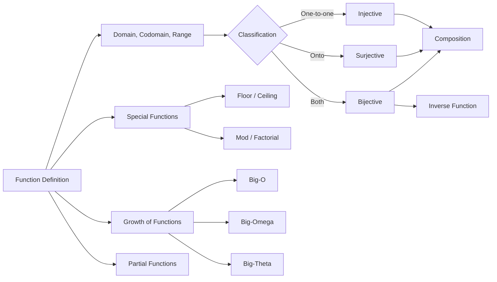

# Chapter 8: Functions

> **Previous:** [Chapter 7: Relations](./07-relations.md) | **Next:** [Chapter 9: Graph Theory](./09-graph-theory.md)

## Learning Objectives

After completing this chapter, you will be able to:

- Define functions and identify domains, codomains, and ranges
- Classify functions as injective, surjective, or bijective
- Compose functions and find inverses
- Apply floor, ceiling, and other special functions
- Analyze growth rates using big-O, big-$\Omega$, and big-$\Theta$ notation

## Chapter at a Glance

| Topic | Key Insight | Practical Takeaway |
|-------|-------------|-------------------|
| Function Definition | Every input maps to exactly one output | Functions are a special case of relations — each $x$ has one $y$ |
| Injective, Surjective, Bijective | One-to-one, onto, and both | A bijection has an inverse; cardinality arguments depend on injections |
| Composition | Apply $f$ then $g$: $(g \circ f)(x) = g(f(x))$ | Composition is associative but not commutative |
| Inverse Functions | Exists only for bijections | $f^{-1}(y) = x$ iff $f(x) = y$; $(g \circ f)^{-1} = f^{-1} \circ g^{-1}$ |
| Floor & Ceiling | Round down and up to nearest integer | Essential for discrete math, algorithm analysis, and number theory |
| Big-O / $\Omega$ / $\Theta$ | Classify function growth rates | Identify dominant term; constants and lower-order terms are ignored |

## Chapter Roadmap

## Theory

### 8.1 Definition

A **function** (or **mapping**) $f: A \rightarrow B$ assigns to each $a \in A$ exactly one $b \in B$. We write $f(a) = b$.

- $A$ is the **domain**, $B$ is the **codomain**.
- The **image** (or **range**) of $f$ is $f(A) = \{f(a) \mid a \in A\} \subseteq B$.
- If $f(a) = b$, $b$ is the **image** of $a$, and $a$ is a **preimage** of $b$.

Two functions $f$ and $g$ are **equal** if they have the same domain and $f(a) = g(a)$ for all $a$ in the domain.

> **One-Sentence Takeaway:** A function assigns every element of the domain exactly one element of the codomain; the range (image) may be a proper subset of the codomain.

### 8.2 Injective, Surjective, Bijective

**Injective (one-to-one):** $f(a_1) = f(a_2) \implies a_1 = a_2$.
Equivalently: distinct inputs map to distinct outputs. $|f(A)| = |A|$.

**Surjective (onto):** For every $b \in B$, there exists $a \in A$ with $f(a) = b$.
Equivalently: $f(A) = B$. The codomain equals the range.

**Bijective (one-to-one correspondence):** Both injective and surjective.

**Theorem 8.1.** A function is bijective if and only if it has an inverse (see below).

**Theorem 8.2.** If $A$ and $B$ are finite sets with $|A| = |B|$, then $f: A \rightarrow B$ is injective iff it is surjective iff it is bijective.

> **One-Sentence Takeaway:** Injective functions are one-to-one (distinct inputs map to distinct outputs); surjective functions hit every codomain element; bijective functions are both — and only bijections have inverses.
>
> **Pro Tip:** For finite sets of equal size, injectivity automatically implies surjectivity and vice versa — a powerful shortcut for cardinality proofs.

### 8.3 Composition

If $f: A \rightarrow B$ and $g: B \rightarrow C$, then the **composition** $g \circ f: A \rightarrow C$ is:
$$(g \circ f)(a) = g(f(a))$$

Composition is associative: $(h \circ g) \circ f = h \circ (g \circ f)$.

> **One-Sentence Takeaway:** Composition applies one function after another ($g \circ f$ means "first $f$, then $g$"); it is associative but not commutative.

### 8.4 Inverse Functions

If $f: A \rightarrow B$ is bijective, there exists an **inverse** $f^{-1}: B \rightarrow A$ such that:
$$f^{-1}(b) = a \iff f(a) = b$$

Properties:
- $f^{-1} \circ f = \text{id}_A$ (identity on $A$)
- $f \circ f^{-1} = \text{id}_B$ (identity on $B$)
- $(g \circ f)^{-1} = f^{-1} \circ g^{-1}$

> **One-Sentence Takeaway:** Only bijective functions have inverses; the inverse reverses the mapping and satisfies $f^{-1}(f(x)) = x$.

### 8.5 Special Functions

**Floor function:** $\lfloor x \rfloor$ = the greatest integer $\leq x$.

**Ceiling function:** $\lceil x \rceil$ = the least integer $\geq x$.

**Factorial:** $n! = n \cdot (n-1) \cdots 2 \cdot 1$, with $0! = 1$.

**Mod function:** $a \bmod m$ = the remainder when $a$ is divided by $m$ (integer $r$ with $0 \leq r < m$ and $a = qm + r$).

> **One-Sentence Takeaway:** Floor rounds down toward $-\infty$, ceiling rounds up toward $+\infty$; factorial grows faster than any exponential.
>
> **Warning:** Floor and ceiling behave counterintuitively for negative numbers: $\lfloor -2.3 \rfloor = -3$ (not $-2$). Always test with negatives.

### 8.6 Growth of Functions

**Big-O Notation:** $f(x) = O(g(x))$ if there exist constants $C > 0$ and $k$ such that $|f(x)| \leq C|g(x)|$ for all $x > k$.

**Big-Omega:** $f(x) = \Omega(g(x))$ if $|f(x)| \geq C|g(x)|$ for all $x > k$.

**Big-Theta:** $f(x) = \Theta(g(x))$ if $f(x) = O(g(x))$ and $f(x) = \Omega(g(x))$.

**Little-o:** $f(x) = o(g(x))$ if $\lim_{x \to \infty} f(x)/g(x) = 0$.

**Common growth rates (ordered by growth):**
$$1 \prec \log n \prec \sqrt{n} \prec n \prec n \log n \prec n^2 \prec n^3 \prec 2^n \prec n!$$

**Theorem 8.3 (Sum rule).** If $f_1 = O(g_1)$ and $f_2 = O(g_2)$, then $f_1 + f_2 = O(\max(|g_1|, |g_2|))$.

**Theorem 8.4 (Product rule).** If $f_1 = O(g_1)$ and $f_2 = O(g_2)$, then $f_1 f_2 = O(g_1 g_2)$.

> **One-Sentence Takeaway:** Big-O provides an asymptotic upper bound, big-$\Omega$ a lower bound, and big-$\Theta$ a tight bound — the growth hierarchy is $1 \prec \log n \prec n \prec n \log n \prec n^2 \prec 2^n \prec n!$.

### 8.7 Partial Functions

A **partial function** $f: A \rightharpoonup B$ is a function defined on a subset of $A$. If $f$ is defined for all $a \in A$, it is a **total function**.

> **One-Sentence Takeaway:** A partial function may be undefined for some domain elements; a total function is a partial function that is defined everywhere.

## Examples

**Example 8.1** (Injective but not surjective). $f: \mathbb{Z} \rightarrow \mathbb{Z}$ with $f(n) = 2n$ is injective ($2n = 2m \implies n = m$) but not surjective (odd numbers have no preimage).

**Example 8.2** (Surjective but not injective). $f: \mathbb{Z} \rightarrow \{0,1\}$ with $f(n) = n \bmod 2$ is surjective (both 0 and 1 hit) but not injective ($f(2) = 0 = f(4)$).

**Example 8.3** (Bijection). $f: \mathbb{Z} \rightarrow \mathbb{Z}$ with $f(n) = n + 1$ is bijective. Inverse: $f^{-1}(n) = n - 1$.

**Example 8.4** (Composition). Let $f(n) = n^2$ and $g(n) = n + 1$, both $\mathbb{Z} \rightarrow \mathbb{Z}$. Then $(g \circ f)(n) = n^2 + 1$ and $(f \circ g)(n) = (n+1)^2 = n^2 + 2n + 1$. Composition is not commutative.

**Example 8.5** (Floor and ceiling). $\lfloor 3.7 \rfloor = 3$, $\lceil 3.7 \rceil = 4$, $\lfloor -2.3 \rfloor = -3$, $\lceil -2.3 \rceil = -2$.

**Example 8.6** (Big-O). Show $f(n) = 3n^2 + 2n + 5$ is $O(n^2)$.

*Proof.* For $n \geq 1$, $3n^2 + 2n + 5 \leq 3n^2 + 2n^2 + 5n^2 = 10n^2$. So with $C = 10$, $k = 1$, $f(n) \leq C n^2$, hence $f(n) = O(n^2)$. $\square$

**Example 8.7** (Big-Theta). Show $5n^3 + 10n$ is $\Theta(n^3)$.

*Proof.* For $n \geq 1$: $5n^3 + 10n \leq 5n^3 + 10n^3 = 15n^3$, so $f(n) = O(n^3)$. Also $5n^3 + 10n \geq 5n^3$, so $f(n) = \Omega(n^3)$. Thus $f(n) = \Theta(n^3)$. $\square$

**Example 8.8** (Inverse of bijection). Prove $f: \mathbb{R} \rightarrow \mathbb{R}$, $f(x) = 2x - 3$, is bijective and find its inverse.

*Proof.* Injective: $2x - 3 = 2y - 3 \implies x = y$. Surjective: for any $y \in \mathbb{R}$, let $x = (y+3)/2$, then $f(x) = y$. Bijective. Inverse: $f^{-1}(y) = (y+3)/2$. $\square$

## Concept Comparison Table

| Concept | Definition | Key Distinction | Use Case |
|---------|-----------|----------------|----------|
| Injective (One-to-One) | $f(a_1) = f(a_2) \implies a_1 = a_2$ | Distinct inputs map to distinct outputs | Encoding, unique identifiers |
| Surjective (Onto) | For all $b \in B$, exists $a$ with $f(a)=b$ | Every codomain element is hit | Projection operations, covering |
| Bijective | Both injective and surjective | One-to-one correspondence; has an inverse | Permutations, encoding/decoding pairs |
| Floor | $\lfloor x \rfloor$ = greatest integer $\leq x$ | Rounds **down** toward $-\infty$ | Discrete math, algorithm analysis |
| Ceiling | $\lceil x \rceil$ = least integer $\geq x$ | Rounds **up** toward $+\infty$ | Pagination, resource allocation |
| Big-O | $f \leq Cg$ for large $x$ | **Upper** bound; not necessarily tight | Worst-case complexity analysis |

## Quick Reference

| Asymptotic Notation | Definition | Meaning | Example |
|--------------------|-----------|---------|---------|
| $f = O(g)$ | $\|f(x)\| \leq C\|g(x)\|$ for $x > k$ | $f$ grows no faster than $g$ | $3n^2 + 2n = O(n^2)$ |
| $f = \Omega(g)$ | $\|f(x)\| \geq C\|g(x)\|$ for $x > k$ | $f$ grows at least as fast as $g$ | $3n^2 + 2n = \Omega(n^2)$ |
| $f = \Theta(g)$ | $f = O(g)$ and $f = \Omega(g)$ | $f$ grows at the same rate as $g$ | $3n^2 + 2n = \Theta(n^2)$ |
| $f = o(g)$ | $\lim f/g = 0$ | $f$ grows strictly slower than $g$ | $n = o(n^2)$ |
| $f \sim g$ | $\lim f/g = 1$ | $f$ and $g$ asymptotically equal | $n^2 + n \sim n^2$ |

## Cross-Application Matrix

| Topic | Computer Science | Cryptography | Engineering | Data Science |
|-------|-----------------|--------------|-------------|-------------|
| Injective Functions | Hash functions (collision-free) | Encoding functions, public-key maps | Signal encoding | Feature embedding |
| Bijective Functions | Permutations, sorting networks | Encryption/decryption pairs | Reversible transformations | Data normalization / denormalization |
| Floor & Ceiling | Page numbering, bucket indexing | Padding calculations | Discrete-time sampling | Binning continuous variables |
| Big-O / $\Theta$ | Algorithm complexity classification | Attack complexity estimation | Worst-case runtime guarantees | Model training complexity |
| Composition | Pipeline architecture, decorators | Cipher composition (AES rounds) | Cascading signal processing | Feature transformation pipelines |

## Chapter Quiz

1. Which of the following functions $f: \mathbb{Z} \rightarrow \mathbb{Z}$ is bijective?
   - A) $f(n) = n^2$
   - B) $f(n) = 2n$
   - C) $f(n) = n + 1$
   - D) $f(n) = n \bmod 2$
   

Answer
**C)** $f(n) = n + 1$ — it is injective ($n+1 = m+1 \implies n=m$) and surjective (for any $y$, let $n = y-1$), hence bijective.

2. What is the growth rate of $f(n) = n \log n + \sqrt{n}$?
   - A) $\Theta(\sqrt{n})$
   - B) $\Theta(n)$
   - C) $\Theta(n \log n)$
   - D) $\Theta(\log n)$
   

Answer
**C)** $\Theta(n \log n)$ — $n \log n$ dominates $\sqrt{n}$ asymptotically.

3. Compute $\lfloor -3.14 \rfloor$.
   - A) $-3$
   - B) $-4$
   - C) $3$
   - D) $4$
   

Answer
**B)** $-4$ — floor rounds **down** toward $-\infty$, so $-3.14$ goes to $-4$ (not $-3$).

## Summary

- Functions map each input to exactly one output.
- Injective: one-to-one. Surjective: onto. Bijective: both.
- Bijective functions have inverses; composition is associative but not commutative.
- Floor/ceiling round to integers; growth rates are classified by big-O/$\Omega$/$\Theta$.
- Common hierarchy: constant $\prec$ logarithmic $\prec$ linear $\prec$ polynomial $\prec$ exponential.

## Exercises

### Review Questions

1. Can a function from $\{1,2,3\}$ to $\{1,2\}$ be injective? Explain.
2. What is the growth rate of $f(n) = n \log n + \sqrt{n}$?
3. If $f$ is bijective, what is $f^{-1} \circ f$?
4. Compute $\lfloor \pi \rfloor$, $\lceil \pi \rceil$, $\lfloor -\pi \rfloor$, $\lceil -\pi \rceil$.
5. Is $O(g) \subset \Omega(g)$ ever true? When?

### Application Problems

6. Determine whether $f: \mathbb{Z} \rightarrow \mathbb{Z}$, $f(n) = n^2 + 1$, is injective, surjective, or bijective.

7. Prove: If $f$ and $g$ are injective, then $g \circ f$ is injective.

8. Prove: $f(n) = \log(n!)$ is $\Theta(n \log n)$.

9. Show $n^2 + 100n$ is $\Theta(n^2)$.

10. Let $f: A \rightarrow B$ and $g: B \rightarrow C$. Prove: if $g \circ f$ is injective, then $f$ is injective.

### Challenge Problem

11. Let $f: A \rightarrow B$ and $g: B \rightarrow C$. Prove: $g \circ f$ is bijective if and only if $f$ is injective, $g$ is surjective, and the image of $f$ equals the domain of injectivity restriction of $g$. More directly: prove that if $g \circ f$ is bijective, then $f$ is injective and $g$ is surjective, but the converse (both injective and surjective individually) is not necessary — find a counterexample where $g \circ f$ is bijective but $f$ is not surjective.
