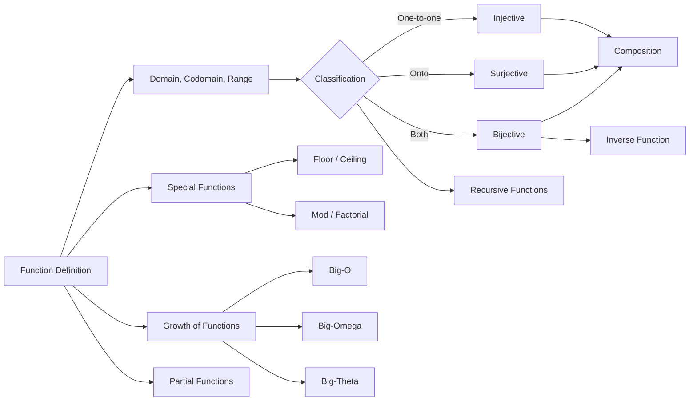
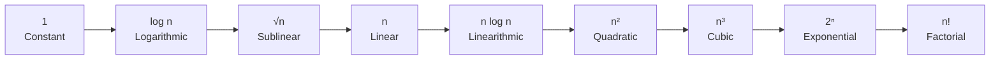

# Chapter 8: Functions

> **Previous:** [Chapter 7: Relations](./07-relations.md) | **Next:** [Chapter 9: Graph Theory](./09-graph-theory.md)

## Learning Objectives


After completing this chapter, you will be able to:

- Define functions and identify domains, codomains, and ranges
- Classify functions as injective, surjective, or bijective
- Compose functions and find inverses
- Apply floor, ceiling, and other special functions
- Analyze growth rates using big-O, big-$\Omega$, and big-$\Theta$ notation
- Understand partial functions and recursive definitions
- Distinguish between image and preimage

## Chapter at a Glance

| Topic | Key Insight | Practical Takeaway |
|-------|-------------|-------------------|
| Function Definition | Every input maps to exactly one output | Functions are a special case of relations — each $x$ has one $y$ |
| Injective, Surjective, Bijective | One-to-one, onto, and both | A bijection has an inverse; cardinality arguments depend on injections |
| Composition | Apply $f$ then $g$: $(g \circ f)(x) = g(f(x))$ | Composition is associative but not commutative |
| Inverse Functions | Exists only for bijections | $f^{-1}(y) = x$ iff $f(x) = y$; $(g \circ f)^{-1} = f^{-1} \circ g^{-1}$ |
| Floor & Ceiling | Round down and up to nearest integer | Essential for discrete math, algorithm analysis, and number theory |
| Big-O / $\Omega$ / $\Theta$ | Classify function growth rates | Identify dominant term; constants and lower-order terms are ignored |
| Partial Functions | May be undefined for some inputs | Useful in modeling non-total computations |

## Chapter Roadmap



## Theory

### 8.1 Definition

A **function** (or **mapping**) $f: A \rightarrow B$ assigns to each $a \in A$ exactly one $b \in B$. We write $f(a) = b$.

- $A$ is the **domain**, $B$ is the **codomain**.
- The **image** (or **range**) of $f$ is $f(A) = \{f(a) \mid a \in A\} \subseteq B$.
- If $f(a) = b$, $b$ is the **image** of $a$, and $a$ is a **preimage** of $b$.

Two functions $f$ and $g$ are **equal** if they have the same domain and $f(a) = g(a)$ for all $a$ in the domain.

> **One-Sentence Takeaway:** A function assigns every element of the domain exactly one element of the codomain; the range (image) may be a proper subset of the codomain.

### 8.2 Injective, Surjective, Bijective

**Injective (one-to-one):** $f(a_1) = f(a_2) \implies a_1 = a_2$.
Equivalently: distinct inputs map to distinct outputs. $|f(A)| = |A|$.

**Surjective (onto):** For every $b \in B$, there exists $a \in A$ with $f(a) = b$.
Equivalently: $f(A) = B$. The codomain equals the range.

**Bijective (one-to-one correspondence):** Both injective and surjective.

**Theorem 8.1.** A function is bijective if and only if it has an inverse.

**Theorem 8.2.** If $A$ and $B$ are finite sets with $|A| = |B|$, then $f: A \rightarrow B$ is injective iff it is surjective iff it is bijective.

```typescript
function isInjective<T, U>(domain: T[], f: (x: T) => U): boolean {
  const images = new Set<U>();
  for (const x of domain) {
    const y = f(x);
    if (images.has(y)) return false;
    images.add(y);
  }
  return true;
}

function isSurjective<T, U>(
  domain: T[],
  codomain: U[],
  f: (x: T) => U
): boolean {
  const images = new Set(domain.map(f));
  return codomain.every(y => images.has(y));
}

const domain = [1, 2, 3, 4];
console.log(isInjective(domain, x => x * 2)); // true
console.log(isInjective(domain, x => Math.floor(x / 2))); // false
```

> **One-Sentence Takeaway:** Injective functions are one-to-one (distinct inputs map to distinct outputs); surjective functions hit every codomain element; bijective functions are both — and only bijections have inverses.

### 8.3 Composition

If $f: A \rightarrow B$ and $g: B \rightarrow C$, then the **composition** $g \circ f: A \rightarrow C$ is:
$$(g \circ f)(a) = g(f(a))$$

Composition is associative: $(h \circ g) \circ f = h \circ (g \circ f)$.

**Theorem 8.3 (Composition and injectivity/surjectivity).**
- If $f$ and $g$ are injective, then $g \circ f$ is injective.
- If $f$ and $g$ are surjective, then $g \circ f$ is surjective.
- If $g \circ f$ is injective, then $f$ is injective.
- If $g \circ f$ is surjective, then $g$ is surjective.

> **One-Sentence Takeaway:** Composition applies one function after another ($g \circ f$ means "first $f$, then $g$"); it is associative but not commutative.

### 8.4 Inverse Functions

If $f: A \rightarrow B$ is bijective, there exists an **inverse** $f^{-1}: B \rightarrow A$ such that:
$$f^{-1}(b) = a \iff f(a) = b$$

Properties:
- $f^{-1} \circ f = \text{id}_A$ (identity on $A$)
- $f \circ f^{-1} = \text{id}_B$ (identity on $B$)
- $(g \circ f)^{-1} = f^{-1} \circ g^{-1}$

> **One-Sentence Takeaway:** Only bijective functions have inverses; the inverse reverses the mapping and satisfies $f^{-1}(f(x)) = x$.

### 8.5 Special Functions

**Floor function:** $\lfloor x \rfloor$ = the greatest integer $\leq x$.

**Ceiling function:** $\lceil x \rceil$ = the least integer $\geq x$.

**Properties of floor and ceiling:**
- $\lfloor x \rfloor \leq x < \lfloor x \rfloor + 1$
- $\lceil x \rceil - 1 < x \leq \lceil x \rceil$
- $\lfloor -x \rfloor = -\lceil x \rceil$
- $\lfloor x \rfloor = n$ iff $n \leq x < n+1$
- $\lceil x \rceil = n$ iff $n-1 < x \leq n$
- $x - 1 < \lfloor x \rfloor \leq x \leq \lceil x \rceil < x + 1$

**Factorial:** $n! = n \cdot (n-1) \cdots 2 \cdot 1$, with $0! = 1$.

**Mod function:** $a \bmod m$ = the remainder when $a$ is divided by $m$ (integer $r$ with $0 \leq r < m$ and $a = qm + r$).

**Stirling's approximation:** $n! \sim \sqrt{2\pi n}\,(n/e)^n$.

> **One-Sentence Takeaway:** Floor rounds down toward $-\infty$, ceiling rounds up toward $+\infty$; factorial grows faster than any exponential.

### 8.6 Growth of Functions

**Big-O Notation:** $f(x) = O(g(x))$ if there exist constants $C > 0$ and $k$ such that $|f(x)| \leq C|g(x)|$ for all $x > k$.

**Big-Omega:** $f(x) = \Omega(g(x))$ if $|f(x)| \geq C|g(x)|$ for all $x > k$.

**Big-Theta:** $f(x) = \Theta(g(x))$ if $f(x) = O(g(x))$ and $f(x) = \Omega(g(x))$.

**Little-o:** $f(x) = o(g(x))$ if $\lim_{x \to \infty} f(x)/g(x) = 0$.

**Common growth rates (ordered by growth):**
$$1 \prec \log n \prec \sqrt{n} \prec n \prec n \log n \prec n^2 \prec n^3 \prec 2^n \prec n!$$

**Theorem 8.4 (Sum rule).** If $f_1 = O(g_1)$ and $f_2 = O(g_2)$, then $f_1 + f_2 = O(\max(|g_1|, |g_2|))$.

**Theorem 8.5 (Product rule).** If $f_1 = O(g_1)$ and $f_2 = O(g_2)$, then $f_1 f_2 = O(g_1 g_2)$.

**Theorem 8.6 (Polynomial dominance).** A polynomial of degree $d$ is $\Theta(n^d)$ — the highest-degree term dominates.

```typescript
function bigOClass(f: (n: number) => number): string {
  const tests = [
    { name: "O(1)", g: (n: number) => 1 },
    { name: "O(log n)", g: (n: number) => Math.log2(n) },
    { name: "O(n)", g: (n: number) => n },
    { name: "O(n log n)", g: (n: number) => n * Math.log2(n) },
    { name: "O(n²)", g: (n: number) => n * n },
    { name: "O(2ⁿ)", g: (n: number) => Math.pow(2, n) },
  ];

  // Approximate check by ratio convergence
  for (let n = 10; n < 1000; n *= 2) {
    const ratio = f(n) / f(n / 2);
    // pattern matching on growth factor
  }
  return "check dominant term";
}

// Verify O(n²) for a quadratic
function isQuadraticGrowth(f: (n: number) => number): boolean {
  const ratio1 = f(100) / f(50);
  const ratio2 = f(200) / f(100);
  // For n^2, doubling n quadruples the value
  return Math.abs(ratio1 - 4) < 0.5 && Math.abs(ratio2 - 4) < 0.5;
}

console.log(isQuadraticGrowth(n => 3 * n * n + 2 * n + 1)); // roughly true
```

> **One-Sentence Takeaway:** Big-O provides an asymptotic upper bound, big-$\Omega$ a lower bound, and big-$\Theta$ a tight bound — the growth hierarchy is $1 \prec \log n \prec n \prec n \log n \prec n^2 \prec 2^n \prec n!$.

### 8.7 Partial Functions

A **partial function** $f: A \rightharpoonup B$ is a function defined on a subset of $A$. If $f$ is defined for all $a \in A$, it is a **total function**.

**Example:** $f(x) = 1/x$ is a partial function from $\mathbb{R}$ to $\mathbb{R}$ (undefined at $x = 0$).

> **One-Sentence Takeaway:** A partial function may be undefined for some domain elements; a total function is a partial function that is defined everywhere.

### 8.8 Recursive Functions

Some functions are defined recursively (in terms of themselves):

- $f(0) = 1$, $f(n) = n \cdot f(n-1)$ for $n > 0$ (factorial)
- $F_1 = 1$, $F_2 = 1$, $F_n = F_{n-1} + F_{n-2}$ (Fibonacci)

Recursive definitions require base case(s) and a recursive rule that eventually reaches the base.

## Concept Comparison Table

| Concept | Definition | Key Distinction | Use Case |
|---------|-----------|----------------|----------|
| Injective (One-to-One) | $f(a_1) = f(a_2) \implies a_1 = a_2$ | Distinct inputs map to distinct outputs | Encoding, unique identifiers |
| Surjective (Onto) | For all $b \in B$, exists $a$ with $f(a)=b$ | Every codomain element is hit | Projection operations, covering |
| Bijective | Both injective and surjective | One-to-one correspondence; has an inverse | Permutations, encoding/decoding pairs |
| Floor | $\lfloor x \rfloor$ = greatest integer $\leq x$ | Rounds **down** toward $-\infty$ | Discrete math, algorithm analysis |
| Ceiling | $\lceil x \rceil$ = least integer $\geq x$ | Rounds **up** toward $+\infty$ | Pagination, resource allocation |
| Big-O | $f \leq Cg$ for large $x$ | **Upper** bound; not necessarily tight | Worst-case complexity analysis |
| Big-Omega | $f \geq Cg$ for large $x$ | **Lower** bound | Best-case or minimum guarantee |

## Quick Reference

| Asymptotic Notation | Definition | Meaning | Example |
|--------------------|-----------|---------|---------|
| $f = O(g)$ | $|f(x)| \leq C|g(x)|$ for $x > k$ | $f$ grows no faster than $g$ | $3n^2 + 2n = O(n^2)$ |
| $f = \Omega(g)$ | $|f(x)| \geq C|g(x)|$ for $x > k$ | $f$ grows at least as fast as $g$ | $3n^2 + 2n = \Omega(n^2)$ |
| $f = \Theta(g)$ | $f = O(g)$ and $f = \Omega(g)$ | $f$ grows at the same rate as $g$ | $3n^2 + 2n = \Theta(n^2)$ |
| $f = o(g)$ | $\lim f/g = 0$ | $f$ grows strictly slower than $g$ | $n = o(n^2)$ |
| $f \sim g$ | $\lim f/g = 1$ | $f$ and $g$ asymptotically equal | $n^2 + n \sim n^2$ |

## Cross-Application Matrix

| Topic | Computer Science | Cryptography | Engineering | Data Science |
|-------|-----------------|--------------|-------------|-------------|
| Injective Functions | Hash functions (collision-free) | Encoding functions, public-key maps | Signal encoding | Feature embedding |
| Bijective Functions | Permutations, sorting networks | Encryption/decryption pairs | Reversible transformations | Data normalization / denormalization |
| Floor & Ceiling | Page numbering, bucket indexing | Padding calculations | Discrete-time sampling | Binning continuous variables |
| Big-O / $\Theta$ | Algorithm complexity classification | Attack complexity estimation | Worst-case runtime guarantees | Model training complexity |
| Composition | Pipeline architecture, decorators | Cipher composition (AES rounds) | Cascading signal processing | Feature transformation pipelines |

## Chapter Quiz

1. Which of the following functions $f: \mathbb{Z} \rightarrow \mathbb{Z}$ is bijective?
   - A) $f(n) = n^2$
   - B) $f(n) = 2n$
   - C) $f(n) = n + 1$
   - D) $f(n) = n \bmod 2$
   <details><summary>Answer</summary>**C)** $f(n) = n + 1$ — it is injective ($n+1 = m+1 \implies n=m$) and surjective (for any $y$, let $n = y-1$), hence bijective.</details>

2. What is the growth rate of $f(n) = n \log n + \sqrt{n}$?
   - A) $\Theta(\sqrt{n})$
   - B) $\Theta(n)$
   - C) $\Theta(n \log n)$
   - D) $\Theta(\log n)$
   <details><summary>Answer</summary>**C)** $\Theta(n \log n)$ — $n \log n$ dominates $\sqrt{n}$ asymptotically.</details>

3. Compute $\lfloor -3.14 \rfloor$.
   - A) $-3$
   - B) $-4$
   - C) $3$
   - D) $4$
   <details><summary>Answer</summary>**B)** $-4$ — floor rounds **down** toward $-\infty$, so $-3.14$ goes to $-4$.</details>

4. If $g \circ f$ is injective, what can we conclude?
   - A) Both $f$ and $g$ are injective
   - B) $f$ is injective
   - C) $g$ is injective
   - D) $f$ is surjective
   <details><summary>Answer</summary>**B)** If $g \circ f$ is injective, then $f$ must be injective (but $g$ may not be).</details>

5. Stirling's approximation approximates:
   - A) The floor function
   - B) The factorial function
   - C) The ceiling function
   - D) The mod function
   <details><summary>Answer</summary>**B)** $n! \sim \sqrt{2\pi n}(n/e)^n$ approximates the factorial.</details>

## Examples

**Example 8.1** (Injective but not surjective). $f: \mathbb{Z} \rightarrow \mathbb{Z}$ with $f(n) = 2n$ is injective ($2n = 2m \implies n = m$) but not surjective (odd numbers have no preimage).

**Example 8.2** (Surjective but not injective). $f: \mathbb{Z} \rightarrow \{0,1\}$ with $f(n) = n \bmod 2$ is surjective (both 0 and 1 hit) but not injective ($f(2) = 0 = f(4)$).

**Example 8.3** (Bijection). $f: \mathbb{Z} \rightarrow \mathbb{Z}$ with $f(n) = n + 1$ is bijective. Inverse: $f^{-1}(n) = n - 1$.

**Example 8.4** (Composition). Let $f(n) = n^2$ and $g(n) = n + 1$, both $\mathbb{Z} \rightarrow \mathbb{Z}$. Then $(g \circ f)(n) = n^2 + 1$ and $(f \circ g)(n) = (n+1)^2 = n^2 + 2n + 1$. Composition is not commutative.

**Example 8.5** (Floor and ceiling). $\lfloor 3.7 \rfloor = 3$, $\lceil 3.7 \rceil = 4$, $\lfloor -2.3 \rfloor = -3$, $\lceil -2.3 \rceil = -2$.

**Example 8.6** (Big-O). Show $f(n) = 3n^2 + 2n + 5$ is $O(n^2)$.

*Proof.* For $n \geq 1$, $3n^2 + 2n + 5 \leq 3n^2 + 2n^2 + 5n^2 = 10n^2$. So with $C = 10$, $k = 1$, $f(n) \leq C n^2$, hence $f(n) = O(n^2)$. $\square$

**Example 8.7** (Big-Theta). Show $5n^3 + 10n$ is $\Theta(n^3)$.

*Proof.* For $n \geq 1$: $5n^3 + 10n \leq 5n^3 + 10n^3 = 15n^3$, so $f(n) = O(n^3)$. Also $5n^3 + 10n \geq 5n^3$, so $f(n) = \Omega(n^3)$. Thus $f(n) = \Theta(n^3)$. $\square$

**Example 8.8** (Inverse of bijection). Prove $f: \mathbb{R} \rightarrow \mathbb{R}$, $f(x) = 2x - 3$, is bijective and find its inverse.

*Proof.* Injective: $2x - 3 = 2y - 3 \implies x = y$. Surjective: for any $y \in \mathbb{R}$, let $x = (y+3)/2$, then $f(x) = y$. Bijective. Inverse: $f^{-1}(y) = (y+3)/2$. $\square$

**Example 8.9** (Recursive factorial).

```typescript
function factorial(n: number): number {
  if (n <= 1) return 1;
  return n * factorial(n - 1);
}

console.log(factorial(5)); // 120
```

**Example 8.10** (Big-O in TypeScript — verifying growth). Show that $f(n) = 100n + 5$ is $O(n)$.

```typescript
function verifyLinearGrowth(f: (n: number) => number, nMax: number): boolean {
  // Check if f(n) / n converges to a constant
  const ratios: number[] = [];
  for (let n = 1; n <= nMax; n++) {
    ratios.push(f(n) / n);
  }
  // Variance should be small for large n
  const mean = ratios.reduce((a, b) => a + b, 0) / ratios.length;
  const variance = ratios.reduce((sum, r) => sum + (r - mean) ** 2, 0) / ratios.length;
  return variance < 1; // heuristic
}

console.log(verifyLinearGrowth(n => 100 * n + 5, 1000)); // true
```

### TypeScript: Function Properties Checker

```typescript
type Func<T, U> = Map<T, U>;

function isInjective<T, U>(f: Func<T, U>): boolean {
  const seen = new Set<U>();
  for (const v of f.values()) { if (seen.has(v)) return false; seen.add(v); }
  return true;
}

function isSurjective<T, U>(f: Func<T, U>, codomain: Set<U>): boolean {
  const images = new Set(f.values());
  for (const v of codomain) if (!images.has(v)) return false;
  return true;
}

function isBijective<T, U>(f: Func<T, U>, codomain: Set<U>): boolean {
  return isInjective(f) && isSurjective(f, codomain);
}
```

## Summary

- Functions map each input to exactly one output.
- Injective: one-to-one. Surjective: onto. Bijective: both.
- Bijective functions have inverses; composition is associative but not commutative.
- Floor/ceiling round to integers; growth rates are classified by big-O/$\Omega$/$\Theta$.
- Common hierarchy: constant $\prec$ logarithmic $\prec$ linear $\prec$ polynomial $\prec$ exponential.

## Practical Takeaways

1. **Check injectivity via horizontal line test** — if any horizontal line hits the graph twice, not injective.
2. **Surjectivity depends on codomain** — changing the codomain can make a non-surjective function surjective.
3. **Inverse only for bijections** — only bijections have true inverses.
4. **Big-O ignores constants** — $1000n$ is $O(n)$ just as much as $2n$ is.
5. **Dominant term wins** — in a sum, only the fastest-growing term matters asymptotically.

**Example 8.11** (Partial function composition). Let $f: \mathbb{R} \rightharpoonup \mathbb{R}$ with $f(x) = 1/x$ (undefined at 0) and $g(x) = x + 1$. Then $(g \circ f)(x) = 1/x + 1$, also undefined at $x = 0$.

**Example 8.12** (Matrix of a function). For a finite function $f: \{1,\dots,m\} \rightarrow \{1,\dots,n\}$, represent as a $1 \times m$ vector: $[f(1), f(2), \dots, f(m)]$. Injectivity requires all distinct entries; surjectivity requires $\{1,\dots,n\} \subseteq \text{entries}$.

## Exercises

### 8.6 Function Properties in Practice

A function $f: A \to B$ associates each element of $A$ (domain) with exactly one element of $B$ (codomain). The **range** (or image) is $\{f(a) : a \in A\} \subseteq B$.

**Definition 8.10 (Injection/Surjection/Bijection).**
- **Injective (one-to-one):** $f(a_1) = f(a_2) \implies a_1 = a_2$. No two domain elements map to the same codomain element.
- **Surjective (onto):** For every $b \in B$, there exists $a \in A$ such that $f(a) = b$. Every codomain element is hit.
- **Bijective:** Both injective and surjective — a perfect one-to-one correspondence.

```typescript
function isInjective<T, U>(f: (x: T) => U, domain: T[]): boolean {
  const seen = new Set<U>();
  for (const x of domain) {
    const y = f(x);
    if (seen.has(y)) return false;
    seen.add(y);
  }
  return true;
}

function isSurjective<T, U>(f: (x: T) => U, domain: T[], codomain: U[]): boolean {
  const image = new Set(domain.map(f));
  return codomain.every(y => image.has(y));
}

function isBijective<T, U>(f: (x: T) => U, domain: T[], codomain: U[]): boolean {
  return isInjective(f, domain) && isSurjective(f, domain, codomain);
}

console.log(isInjective((x: number) => 2 * x, [1, 2, 3]));    // true
console.log(isSurjective((x: number) => 2 * x, [1, 2, 3], [2, 4, 6])); // true
console.log(isBijective((x: number) => x + 1, [1, 2], [2, 3])); // true
```

### 8.7 Function Composition and Inverse Functions

**Definition 8.11 (Composition).** $(g \circ f)(x) = g(f(x))$. Composition is associative: $h \circ (g \circ f) = (h \circ g) \circ f$.

**Definition 8.12 (Inverse).** If $f: A \to B$ is bijective, there exists $f^{-1}: B \to A$ such that $f^{-1} \circ f = \text{id}_A$ and $f \circ f^{-1} = \text{id}_B$.

```typescript
function compose<T, U, V>(f: (x: T) => U, g: (y: U) => V): (x: T) => V {
  return (x: T) => g(f(x));
}

function inverse<T extends string | number>(
  f: (x: T) => T,
  domain: T[]
): ((y: T) => T) | null {
  const pairs = new Map(domain.map(x => [f(x), x] as [T, T]));
  if (pairs.size !== domain.length) return null; // not bijective
  return (y: T) => {
    const x = pairs.get(y);
    if (x === undefined) throw new Error("Not in range");
    return x;
  };
}

const double = (x: number) => 2 * x;
const add1 = (x: number) => x + 1;
const h = compose(double, add1);
console.log(h(5)); // (5*2)+1 = 11
```

### 8.8 Growth of Functions — Extended Analysis

**Definition 8.13 (Little-o and Little-$\omega$).**
- $f(n) = o(g(n))$: For every $c > 0$, there exists $n_0$ such that $0 \leq f(n) \leq c\,g(n)$ for all $n \geq n_0$. Strictly slower growth.
- $f(n) = \omega(g(n))$: For every $c > 0$, there exists $n_0$ such that $0 \leq c\,g(n) \leq f(n)$ for all $n \geq n_0$. Strictly faster growth.

```typescript
function growthClass(n: number, f: (n: number) => number): string {
  const logN = Math.log2(n);
  const nLogN = n * logN;
  const nSq = n * n;
  const nCb = n * n * n;
  const twoN = Math.pow(2, n);
  const fn = f(n);

  if (fn <= n) return "O(n) or less";
  if (fn <= nLogN) return "Θ(n log n)";
  if (fn <= nSq) return "Θ(n²)";
  if (fn <= nCb) return "Θ(n³)";
  if (fn <= twoN) return "O(2^n)";
  return "super-exponential";
}

console.log(growthClass(10, n => n * n + 5 * n));     // Θ(n²)
console.log(growthClass(10, n => Math.pow(2, n)));     // O(2^n)
```

**Theorem 8.3 (Hierarchy of Growth).**
$$1 \ll \log n \ll \sqrt{n} \ll n \ll n\log n \ll n^2 \ll n^3 \ll 2^n \ll n! \ll n^n$$



### 8.9 Special Functions and Their Properties

**Definition 8.14 (Characteristic Function).** For a set $A \subseteq U$:
$$\chi_A(x) = \begin{cases} 1 & \text{if } x \in A \\ 0 & \text{if } x \notin A \end{cases}$$

**Definition 8.15 (Signum Function).**
$$\text{sgn}(x) = \begin{cases} -1 & \text{if } x < 0 \\ 0 & \text{if } x = 0 \\ 1 & \text{if } x > 0 \end{cases}$$

```typescript
function sgn(x: number): -1 | 0 | 1 {
  return x > 0 ? 1 : x < 0 ? -1 : 0;
}

function characteristic<T>(A: Set<T>): (x: T) => number {
  return (x: T) => A.has(x) ? 1 : 0;
}

// Floor and ceiling properties
function floorDivision(a: number, b: number): number {
  return Math.floor(a / b);
}

// Identity: floor(x) + floor(-x) = 0 (if x is integer), -1 otherwise
function checkFloorIdentity(x: number): boolean {
  return Math.floor(x) + Math.floor(-x) === (Number.isInteger(x) ? 0 : -1);
}
```

**Example 8.8** (Composition and cardinalities). For finite sets $A$ and $B$:
- Number of functions $A \to B$: $|B|^{|A|}$
- Number of injective functions: $P(|B|, |A|)$
- Number of bijective functions: $|A|!$ (when $|A| = |B|$)
- Number of surjective functions: $|B|! \cdot S(|A|, |B|)$ (Stirling numbers of second kind)

**Example 8.9** (Stirling's approximation). $n! \sim \sqrt{2\pi n}\left(\frac{n}{e}\right)^n$

```typescript
function stirling(n: number): number {
  return Math.sqrt(2 * Math.PI * n) * Math.pow(n / Math.E, n);
}

// Compare n! vs Stirling for n = 10
console.log(stirling(10));  // ~3598695 (actual 3628800 — 0.8% error)
```

**Proof 8.4** ($\log(n!) = \Theta(n \log n)$ via integral bound).

$$\int_1^n \log x \,dx \leq \sum_{k=1}^n \log k \leq \int_0^n \log(x+1)\,dx$$
$$n\log n - n + 1 \leq \log(n!) \leq (n+1)\log(n+1) - n$$

Thus $\log(n!) = \Theta(n \log n)$.

**Example 8.10** (Partial functions). A function $f: A \rightharpoonup B$ is defined on a subset of $A$. In TypeScript: `(x: T) => U | undefined`.

```typescript
type PartialFunction<T, U> = (x: T) => U | undefined;

function safeDivide(n: number, d: number): number | undefined {
  return d === 0 ? undefined : n / d;
}

function composePartial<T, U, V>(
  f: PartialFunction<T, U>,
  g: PartialFunction<U, V>
): PartialFunction<T, V> {
  return (x: T) => {
    const y = f(x);
    return y !== undefined ? g(y) : undefined;
  };
}
```

## Additional Exercises

16. Determine whether $f(x) = e^x$ as a function $\mathbb{R} \to \mathbb{R}$ is injective, surjective, or bijective.

17. Prove that if $f$ and $g$ are surjective, then $g \circ f$ is surjective.

18. Rank the following in order of growth: $n^3$, $2^n$, $n!$, $n \log n$, $n^{\sqrt{n}}$, $4^{\log n}$.

19. Write a TypeScript function `checkFunction<T, U>` that verifies a mapping is a valid function (every domain element maps to exactly one codomain element).

20. Show that the function $f(n) = \lfloor \sqrt{n} \rfloor$ is surjective when considered as a function $\mathbb{N} \to \mathbb{N}$.

### Review Questions

1. Can a function from $\{1,2,3\}$ to $\{1,2\}$ be injective? Explain.
2. What is the growth rate of $f(n) = n \log n + \sqrt{n}$?
3. If $f$ is bijective, what is $f^{-1} \circ f$?
4. Compute $\lfloor \pi \rfloor$, $\lceil \pi \rceil$, $\lfloor -\pi \rfloor$, $\lceil -\pi \rceil$.
5. Is $O(g) \subset \Omega(g)$ ever true? When?

### Application Problems

6. Determine whether $f: \mathbb{Z} \rightarrow \mathbb{Z}$, $f(n) = n^2 + 1$, is injective, surjective, or bijective.

7. Prove: If $f$ and $g$ are injective, then $g \circ f$ is injective.

8. Prove: $f(n) = \log(n!)$ is $\Theta(n \log n)$.

9. Show $n^2 + 100n$ is $\Theta(n^2)$.

10. Let $f: A \rightarrow B$ and $g: B \rightarrow C$. Prove: if $g \circ f$ is injective, then $f$ is injective.

11. Find $\lfloor \sqrt{1000} \rfloor$ without a calculator.

12. Classify $f(n) = 2^n + n^{100}$ in big-O terms.

### Challenge Problem

13. Let $f: A \rightarrow B$ and $g: B \rightarrow C$. Prove: $g \circ f$ is bijective if and only if $f$ is injective and $g$ is surjective, **and** the image of $f$ equals $B$. More precisely: if $g \circ f$ is bijective, then $f$ is injective and $g$ is surjective. Show by counterexample that the converse (both injective and surjective individually) is not sufficient — find an example where $f$ and $g$ are each bijective but $g \circ f$ is not (which actually cannot happen, so find an example where $g \circ f$ is bijective but $f$ is not surjective).

14. Prove that $\lfloor 2x \rfloor = \lfloor x \rfloor + \lfloor x + 0.5 \rfloor$ for all real $x$.

15. Estimate $30!$ using Stirling's approximation and compute the approximate number of decimal digits.
