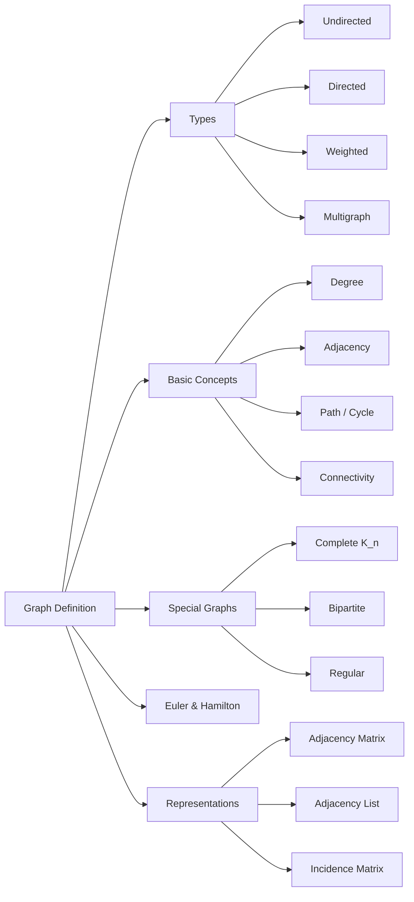

# Chapter 9: Graph Theory

> **Previous:** [Chapter 8: Functions](./08-functions.md) | **Next:** [Chapter 10: Trees](./10-trees.md)

## Learning Objectives

After completing this chapter, you will be able to:

- Define and identify different types of graphs (undirected, directed, weighted, simple, multigraphs)
- Apply graph terminology: vertices, edges, degree, adjacency, paths, cycles
- Distinguish between graph representations (adjacency matrix, adjacency list, incidence matrix)
- Determine connectivity, components, and cut vertices/edges
- Recognize bipartite, complete, and regular graphs
- Model real-world problems using graph structures
- Apply Euler and Hamilton path concepts

## Chapter at a Glance

| Topic | Key Insight | Practical Takeaway |
|-------|-------------|-------------------|
| Graph Types | Undirected, directed, weighted, multigraphs | Choose representation based on relationship symmetry |
| Vertex Degree | Sum of degrees = $2 \|E\|$ | Handshaking lemma: even number of odd-degree vertices |
| Connectivity | Paths connect vertices; components are maximal connected subgraphs | Cut vertices and bridges are single points of failure |
| Graph Representations | Adjacency matrix, adjacency list, incidence matrix | Matrix: $O(1)$ edge lookup; List: $O(V+E)$ space for sparse graphs |
| Complete Graphs | $K_n$ has $n(n-1)/2$ edges | Every pair of vertices is connected |
| Bipartite Graphs | Two independent sets; no odd cycles | Equivalent to 2-colorability |
| Eulerian vs Hamiltonian | Euler: traverse every edge; Hamilton: visit every vertex | Euler: all even-degree vertices; Hamilton: NP-complete |

## Chapter Roadmap



## Theory

### 9.1 Definition

A **graph** $G = (V, E)$ consists of a set $V$ of **vertices** (or **nodes**) and a set $E$ of **edges** connecting pairs of vertices. An edge $\{u, v\}$ connects vertices $u$ and $v$.

**Graph types:**
- **Undirected graph:** edges have no direction ($\{u,v\} = \{v,u\}$).
- **Directed graph (digraph):** edges have direction ($(u,v) \neq (v,u)$).
- **Weighted graph:** edges carry a numeric weight.
- **Multigraph:** multiple edges between the same vertices allowed.
- **Simple graph:** no loops or multiple edges.

> **One-Sentence Takeaway:** A graph is a set of vertices connected by edges; the edge type (directed, weighted, multiple) determines the graph variant.

### 9.2 Basic Concepts

**Adjacency:** Two vertices are adjacent if an edge connects them.

**Degree (undirected):** $\deg(v)$ = number of edges incident to $v$. A vertex of degree 0 is **isolated**; degree 1 is a **pendant** (leaf).

**The Handshaking Lemma (Theorem 9.1):** $\sum_{v \in V} \deg(v) = 2|E|$. Every graph has an even number of odd-degree vertices.

**Degree (directed):** $\deg^-(v)$ = in-degree (incoming edges), $\deg^+(v)$ = out-degree (outgoing edges). $\sum \deg^-(v) = \sum \deg^+(v) = |E|$.

**Path:** A sequence of vertices where each consecutive pair is adjacent. A **simple path** repeats no vertices. **Length** = number of edges.

**Cycle:** A path where the first and last vertices are the same (and $v_0$ is the only repeated vertex).

> **One-Sentence Takeaway:** The Handshaking Lemma ties vertex degrees to edge count; paths and cycles are the fundamental building blocks of graph connectivity.

### 9.3 Connectivity

A graph is **connected** if there is a path between any two vertices. A **connected component** is a maximal connected subgraph.

**Cut vertex (articulation point):** A vertex whose removal disconnects the graph.

**Bridge (cut edge):** An edge whose removal disconnects the graph.

**Theorem 9.2 (Connectivity in directed graphs).** A directed graph is **strongly connected** if there is a directed path between any two vertices. It is **weakly connected** if its underlying undirected graph is connected.

**Distance:** The shortest path length between two vertices.

**Diameter:** The maximum distance between any two vertices in a connected graph.

> **One-Sentence Takeaway:** A vertex or edge whose removal disconnects the graph is a cut vertex or bridge; strong connectivity requires directed paths both ways.

### 9.4 Special Graphs

**Complete graph $K_n$:** Every pair of vertices is connected. Has $n(n-1)/2$ edges.

**Cycle graph $C_n$:** $n$ vertices connected in a single cycle.

**Bipartite graph $K_{m,n}$:** Vertices partitioned into two sets; edges only cross between sets.

**Theorem 9.3 (Bipartite characterization).** A graph is bipartite if and only if it contains no odd-length cycles.

**Regular graph:** Every vertex has degree $k$ (a $k$-regular graph).

**Wheel graph $W_n$:** Cycle $C_{n-1}$ connected to one central vertex.

**Planar graph:** Can be drawn with no edge crossings (edges intersect only at vertices).

**Theorem 9.4 (Euler's formula for planar graphs).** For a connected planar graph: $V - E + F = 2$, where $F$ is the number of faces.

> **One-Sentence Takeaway:** Complete graphs ($K_n$) and bipartite graphs ($K_{m,n}$) are fundamental special classes; bipartite is equivalent to 2-colorability and absence of odd cycles.

### 9.5 Graph Representations

**Adjacency Matrix:** $A[i][j] = 1$ if edge $(i,j)$ exists, $0$ otherwise. For undirected graphs, $A$ is symmetric. Size: $|V| \times |V|$.

**Adjacency List:** Array of lists; vertex $i$ has a list of its neighbors. Space: $O(|V| + |E|)$.

**Incidence Matrix:** $M[i][j] = 1$ if vertex $i$ is incident to edge $j$. Size: $|V| \times |E|$.

```typescript
class Graph {
  private adj: Map<number, number[]> = new Map();
  private directed: boolean;

  constructor(directed: boolean = false) {
    this.directed = directed;
  }

  addVertex(v: number): void {
    if (!this.adj.has(v)) this.adj.set(v, []);
  }

  addEdge(u: number, v: number): void {
    this.addVertex(u);
    this.addVertex(v);
    this.adj.get(u)!.push(v);
    if (!this.directed) this.adj.get(v)!.push(u);
  }

  neighbors(v: number): number[] {
    return this.adj.get(v) ?? [];
  }

  degree(v: number): number {
    return this.neighbors(v).length;
  }

  hasEdge(u: number, v: number): boolean {
    return this.neighbors(u).includes(v);
  }
}
```

> **One-Sentence Takeaway:** Adjacency matrices give $O(1)$ edge lookup at the cost of $O(V^2)$ space; adjacency lists use $O(V+E)$ space and are preferred for sparse graphs.

### 9.6 Euler and Hamilton Paths

**Eulerian path:** A trail that traverses every edge exactly once.
**Eulerian circuit:** An Eulerian path that starts and ends at the same vertex.

**Theorem 9.5 (Euler's theorem).** An undirected graph has an Eulerian circuit if and only if every vertex has even degree. It has an Eulerian path (but not a circuit) if exactly two vertices have odd degree.

**Hamiltonian path:** A path that visits every vertex exactly once.
**Hamiltonian cycle:** A Hamiltonian path that starts and ends at the same vertex.

No simple characterization exists for Hamiltonian graphs (the problem is NP-complete).

**Theorem 9.6 (Dirac's theorem).** If $G$ is a simple graph with $n \geq 3$ vertices and every vertex has degree $\geq n/2$, then $G$ has a Hamiltonian cycle.

> **One-Sentence Takeaway:** Eulerian paths traverse every edge once (easy to characterize via parity); Hamiltonian paths visit every vertex once (NP-complete to characterize).

### 9.7 Subgraphs and Graph Isomorphism

**Subgraph:** $H = (V', E')$ where $V' \subseteq V$ and $E' \subseteq E$.

**Spanning subgraph:** $V' = V$ (keeps all vertices).

**Induced subgraph:** Includes all edges whose endpoints are in $V'$.

**Graph isomorphism:** Graphs $G$ and $H$ are isomorphic ($G \cong H$) if there exists a bijection $f: V_G \rightarrow V_H$ such that $\{u,v\} \in E_G \iff \{f(u), f(v)\} \in E_H$.

Isomorphism is an equivalence relation. Checking isomorphism is difficult (no polynomial-time algorithm known in general).

**Invariants preserved by isomorphism:** number of vertices, edges, degree sequence, connectivity, bipartiteness.

## Quick Reference

| Graph Family | Notation | Vertices | Edges | Properties |
|-------------|----------|----------|-------|------------|
| Complete | $K_n$ | $n$ | $n(n-1)/2$ | All pairs connected; $n-1$-regular |
| Cycle | $C_n$ | $n$ | $n$ | 2-regular; connected |
| Bipartite | $K_{m,n}$ | $m+n$ | $mn$ | Two independent sets; no odd cycles |
| Wheel | $W_n$ | $n$ | $2(n-1)$ | Cycle + hub; planar for $n \leq 4$ |
| Path | $P_n$ | $n$ | $n-1$ | 2 pendant vertices; tree |
| Hypercube | $Q_n$ | $2^n$ | $n2^{n-1}$ | $n$-regular; distance = Hamming distance |

## Cross-Application Matrix

| Concept | Computer Science | Networking | Operations | Biology |
|---------|-----------------|------------|------------|---------|
| Shortest Path | Dijkstra, BFS | Routing protocols (OSPF) | Logistics optimization | Metabolic pathway analysis |
| Connectivity | Network resilience | Fault-tolerant topologies | Supply chain risk | Protein interaction networks |
| Bipartite Graphs | Matching algorithms | Switch-router models | Job assignment | Gene regulatory networks |
| Planar Graphs | VLSI layout, PCB routing | Map routing | Facility layout | Neural connectivity |
| Eulerian Path | De Bruijn sequences | Network traversal | Garbage collection routes | DNA assembly |
| Hamiltonian Cycle | TSP algorithms | Ring topologies | Traveling salesman | Genome mapping |

## Chapter Quiz

1. What is the sum of degrees in a graph with $|E| = 10$ edges?
   - A) 5
   - B) 10
   - C) 20
   - D) 40
   <details><summary>Answer</summary>**C)** $\sum \deg(v) = 2|E| = 20$ by the Handshaking Lemma.</details>

2. Which condition characterizes bipartite graphs?
   - A) No even cycles
   - B) No odd cycles
   - C) Every vertex has even degree
   - D) Connectedness
   <details><summary>Answer</summary>**B)** A graph is bipartite iff it contains no odd-length cycles.</details>

3. A graph has an Eulerian circuit if and only if:
   - A) It is connected and every vertex has even degree
   - B) It is complete
   - C) It is bipartite
   - D) It has a Hamiltonian cycle
   <details><summary>Answer</summary>**A)** Eulerian circuit exists iff the graph is connected (ignoring isolated vertices) and every vertex has even degree.</details>

4. How many edges does $K_6$ have?
   - A) 6
   - B) 10
   - C) 15
   - D) 30
   <details><summary>Answer</summary>**C)** $K_6$ has $6 \cdot 5 / 2 = 15$ edges.</details>

5. What is the space complexity of an adjacency matrix for a graph with $V$ vertices?
   - A) $O(V)$
   - B) $O(V + E)$
   - C) $O(V^2)$
   - D) $O(E^2)$
   <details><summary>Answer</summary>**C)** Adjacency matrices use $O(V^2)$ space regardless of the number of edges.</details>

## Examples

**Example 9.1** (Handshaking Lemma verification). Consider a graph with 4 vertices and edges $\{\{1,2\}, \{2,3\}, \{3,4\}, \{4,1\}, \{2,4\}\}$. Degrees: $\deg(1)=2$, $\deg(2)=3$, $\deg(3)=2$, $\deg(4)=3$. Sum $= 2 + 3 + 2 + 3 = 10 = 2 \cdot 5 = 2|E|$.

**Example 9.2** (Path vs. cycle). In $C_5$ (a 5-cycle), the maximum distance between any two vertices is 2 (diameter = 2). The graph is 2-regular and connected.

**Example 9.3** (Bipartite check). $C_4$ is bipartite (even cycle): assign vertices alternately to sets $A = \{1,3\}$, $B = \{2,4\}$. $C_3$ (triangle) is not bipartite (odd cycle).

**Example 9.4** (Eulerian path). A graph with vertices $\{1,2,3,4\}$ and edges $\{\{1,2\},\{2,3\},\{3,4\},\{4,2\}\}$: degrees are $\deg(1)=1$, $\deg(2)=3$, $\deg(3)=2$, $\deg(4)=2$. Two odd-degree vertices (1 and 2), so it has an Eulerian path but not a circuit.

```typescript
function hasEulerianCircuit(graph: Graph): boolean {
  const vertices = Array.from(graph['adj'].keys());
  for (const v of vertices) {
    if (graph.degree(v) % 2 !== 0) return false;
  }
  return true;
}

function hasEulerianPath(graph: Graph): boolean {
  const vertices = Array.from(graph['adj'].keys());
  let oddCount = 0;
  for (const v of vertices) {
    if (graph.degree(v) % 2 !== 0) oddCount++;
  }
  return oddCount === 0 || oddCount === 2;
}
```

**Example 9.5** (Euler's formula). The cube graph $Q_3$ has $V = 8$, $E = 12$, $F = 6$. Euler's formula: $8 - 12 + 6 = 2$. ✓

**Example 9.6** (Adjacency matrix). For graph with edges $\{1,2\},\{2,3\},\{3,1\}$:
$$A = \begin{bmatrix} 0 & 1 & 1 \\ 1 & 0 & 1 \\ 1 & 1 & 0 \end{bmatrix}$$

**Example 9.7** (Distance calculation). In $K_5$, distance between any two distinct vertices is 1. Diameter = 1.

**Example 9.8** (Complete bipartite graph $K_{2,3}$). Two vertices in set $A$, three in set $B$. $|E| = 2 \cdot 3 = 6$. The graph is bipartite and has $5$ vertices.

**Example 9.9** (Finding cut vertices). In a path graph $P_4$ ($1-2-3-4$), every internal vertex (2 and 3) is a cut vertex. The end vertices (1 and 4) are not.

**Example 9.10** (Isomorphism). $C_4$ drawn as a square is isomorphic to $C_4$ drawn as a diamond — vertex labels differ but structure is identical.

### 9.8 Graph Traversal Algorithms

**Breadth-first search (BFS):** Explores a graph level by level. Uses a queue. $O(V+E)$.
- Finds shortest path in unweighted graphs.
- Used for connected components, bipartite checking, level-order traversal.

```typescript
function bfs(graph: Graph, start: number): Map<number, number> {
  const distances = new Map<number, number>();
  const queue: number[] = [start];
  distances.set(start, 0);
  while (queue.length > 0) {
    const v = queue.shift()!;
    for (const neighbor of graph.neighbors(v)) {
      if (!distances.has(neighbor)) {
        distances.set(neighbor, distances.get(v)! + 1);
        queue.push(neighbor);
      }
    }
  }
  return distances;
}
```

**Depth-first search (DFS):** Explores as deep as possible before backtracking. Uses a stack (recursion). $O(V+E)$.
- Used for topological sorting, cycle detection, strongly connected components.

```typescript
function dfs(
  graph: Graph,
  start: number,
  visited: Set<number> = new Set()
): Set<number> {
  visited.add(start);
  for (const neighbor of graph.neighbors(start)) {
    if (!visited.has(neighbor)) {
      dfs(graph, neighbor, visited);
    }
  }
  return visited;
}
```

> **One-Sentence Takeaway:** BFS finds shortest paths in unweighted graphs using a queue; DFS explores deep using a stack and is useful for cycle detection and topological ordering.

### 9.9 Graph Coloring

Greedy coloring algorithm: Order vertices; assign each vertex the smallest color not used by its already-colored neighbors. Uses at most $\Delta + 1$ colors.

**Applications:**
- Scheduling: exams with overlapping students (conflict = edge).
- Register allocation: variables live at the same time (conflict = edge).
- Sudoku: coloring $9 \times 9$ with constraints.

### 9.10 Applications of Graph Theory

- **Social networks:** Recommend friends, detect communities, measure influence.
- **Road networks:** GPS shortest-path navigation (Dijkstra, A*).
- **World Wide Web:** PageRank uses directed graph of hyperlinks.
- **Biology:** Protein interaction networks, neural connectivity, phylogenetic trees.
- **Transportation:** Airline route optimization, shipping logistics.
- **Computer networks:** Topology design, routing protocols, fault tolerance.

## Summary

- Graphs are modeled as $(V,E)$; types include undirected, directed, weighted, and multigraphs.
- The Handshaking Lemma: $\sum \deg(v) = 2|E|$.
- A graph is connected if a path exists between any two vertices.
- Bipartite iff no odd cycles.
- Eulerian circuit iff all vertices have even degree (connected graph).
- Hamiltonian cycle is NP-complete to characterize.

## Practical Takeaways

1. **Use adjacency list for sparse graphs** — real-world graphs are almost always sparse.
2. **Bipartite = 2-colorable** — check via BFS alternating colors; any conflict means an odd cycle.
3. **Euler = edges, Hamilton = vertices** — Euler is computationally easy, Hamilton is hard.
4. **Even-degree condition** — always check parity first when looking for Eulerian trails.
5. **Planar graphs have $E \leq 3V - 6$** — a quick check for non-planarity.

## Exercises

### Review Questions

1. What is the degree of every vertex in $C_7$?
2. Can a complete bipartite graph $K_{2,2}$ have a Hamiltonian cycle?
3. How many edges does $K_{10}$ have?
4. Is $C_6$ bipartite? Explain.
5. State Euler's formula for planar graphs.

### Application Problems

6. Show that any graph with $|V| = 6$ and $|E| = 16$ has at least one vertex of degree $\geq 6$.

7. Determine whether $K_5$ is planar.

8. Prove that every tree (connected, acyclic graph) with $n$ vertices has $n-1$ edges.

9. Draw $K_{3,3}$ and determine whether it is planar.

10. Construct an Eulerian circuit for the graph with vertices $\{1,2,3,4\}$ and edges $\{\{1,2\},\{2,3\},\{3,4\},\{4,1\},\{1,3\},\{2,4\}\}$.

11. Find the diameter of $Q_3$ (the 3-dimensional hypercube).

12. Write a BFS-based function to check if a graph is connected.

### Challenge Problem

13. Prove that every graph with at least 2 vertices has at least two vertices of the same degree.

14. Prove: A graph with $n$ vertices and $\binom{n-1}{2} + 1$ edges is always connected.

15. A **tournament** is a complete directed graph (for every unordered pair $\{u,v\}$, exactly one of $(u,v)$ or $(v,u)$ is an edge). Prove that every tournament has a Hamiltonian path.
