# Chapter 10: Trees

> **Previous:** [Chapter 9: Graph Theory](./09-graph-theory.md) | **Next:** [Chapter 11: Algebra](./11-algebra.md)

## Learning Objectives

After completing this chapter, you will be able to:

- Define trees and identify their fundamental properties
- Apply tree theorems (edge count, leaf count, spanning tree existence)
- Construct and traverse binary search trees
- Distinguish between rooted, unrooted, full, and complete binary trees
- Apply prefix (Huffman) codes for data compression
- Model decision problems using decision trees
- Understand minimum spanning trees and their algorithms

## Chapter at a Glance

| Topic | Key Insight | Practical Takeaway |
|-------|-------------|-------------------|
| Tree Definition | Connected acyclic graph | $n$ vertices, $n-1$ edges; exactly one path between any two vertices |
| Rooted Trees | A designated root; parent-child relationship | Enables hierarchy; every node (except root) has exactly one parent |
| Binary Trees | Each node has at most 2 children | Foundational data structure: BST, heap, expression trees |
| Tree Traversals | Preorder, inorder, postorder, level-order | Inorder on BST yields sorted sequence |
| Spanning Trees | Subgraph connecting all vertices | Every connected graph has at least one spanning tree |
| Minimum Spanning Tree | Minimum total weight connecting all vertices | Kruskal (union-find) and Prim (priority queue) |
| Huffman Coding | Optimal prefix code from character frequencies | Lossless compression achieved by replacing fixed-length codes with variable-length ones |

## Chapter Roadmap

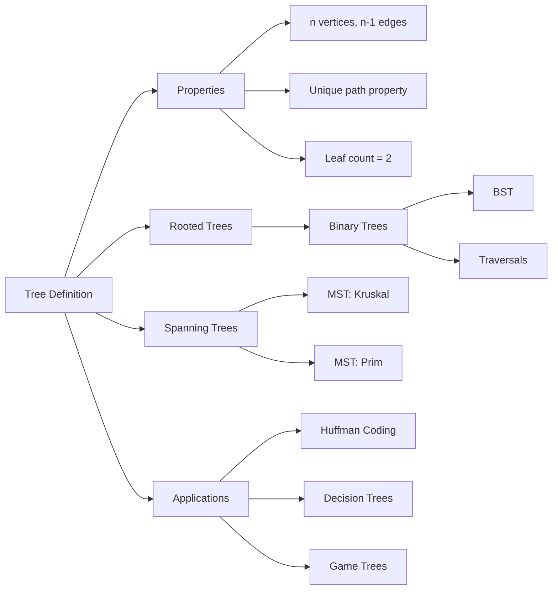

## Theory

### 10.1 Definition

<a href="../../assets/images/diagrams/discrete-mathematics/10-trees/10-1-definition-handwritten.svg" target="_blank" rel="noopener">
  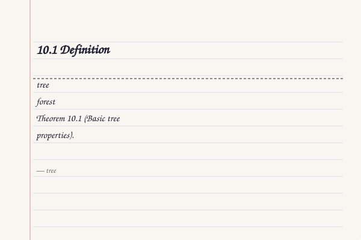
</a>
<a href="../../assets/images/diagrams/discrete-mathematics/10-trees/10-1-definition-diagram.svg" target="_blank" rel="noopener">
  
</a>
<a href="../../assets/images/diagrams/discrete-mathematics/10-trees/10-1-definition-sticky.svg" target="_blank" rel="noopener">
  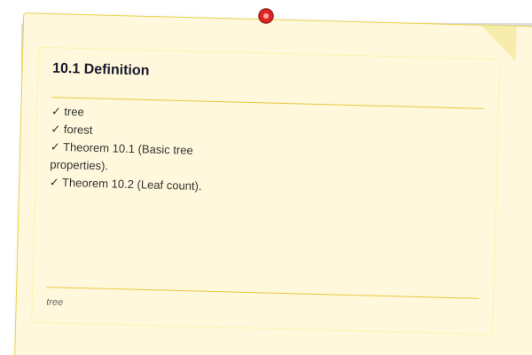
</a>


A **tree** is a connected acyclic undirected graph. A **forest** is an acyclic graph (each component is a tree).

**Theorem 10.1 (Basic tree properties).** For a tree $T = (V, E)$ with $n$ vertices:
1. $|E| = n - 1$.
2. There is exactly one unique path between any two vertices.
3. Adding any edge creates exactly one cycle.
4. Removing any edge disconnects the graph.
5. A tree has at least two leaves (pendant vertices) for $n \geq 2$.

**Theorem 10.2 (Leaf count).** A tree with at least 2 vertices has at least 2 vertices of degree 1.

> **One-Sentence Takeaway:** A tree is the minimal connected graph ? $n-1$ edges, unique paths, at least two leaves, and adding any edge creates a cycle.

### 10.2 Rooted Trees

<a href="../../assets/images/diagrams/discrete-mathematics/10-trees/10-2-rooted-trees-handwritten.svg" target="_blank" rel="noopener">
  
</a>
<a href="../../assets/images/diagrams/discrete-mathematics/10-trees/10-2-rooted-trees-diagram.svg" target="_blank" rel="noopener">
  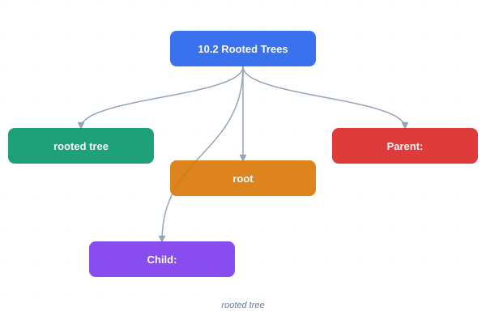
</a>
<a href="../../assets/images/diagrams/discrete-mathematics/10-trees/10-2-rooted-trees-sticky.svg" target="_blank" rel="noopener">
  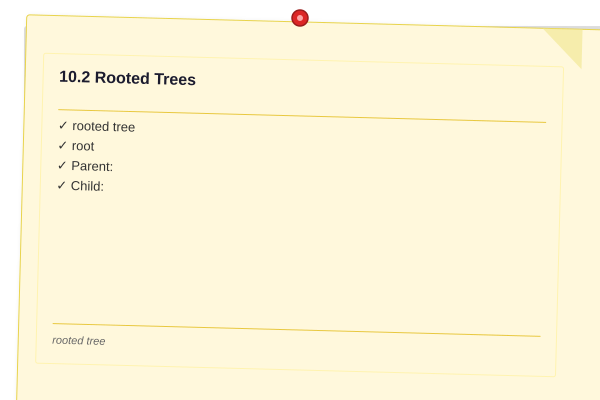
</a>


A **rooted tree** designates one vertex as the **root**, establishing a hierarchy:
- **Parent:** the node directly above in the tree.
- **Child:** a node directly below.
- **Siblings:** nodes sharing the same parent.
- **Leaf:** a node with no children.
- **Internal node:** a node with at least one child.
- **Depth of node:** length of the path from root to that node.
- **Height of tree:** maximum depth of any node.
- **Subtree:** a node and all its descendants.
- **Level:** all nodes at the same depth.

> **One-Sentence Takeaway:** Rooting a tree creates parent-child relationships; depth, height, level, and subtree all derive from this orientation.

### 10.3 Binary Trees

<a href="../../assets/images/diagrams/discrete-mathematics/10-trees/10-3-binary-trees-handwritten.svg" target="_blank" rel="noopener">
  
</a>
<a href="../../assets/images/diagrams/discrete-mathematics/10-trees/10-3-binary-trees-diagram.svg" target="_blank" rel="noopener">
  
</a>
<a href="../../assets/images/diagrams/discrete-mathematics/10-trees/10-3-binary-trees-sticky.svg" target="_blank" rel="noopener">
  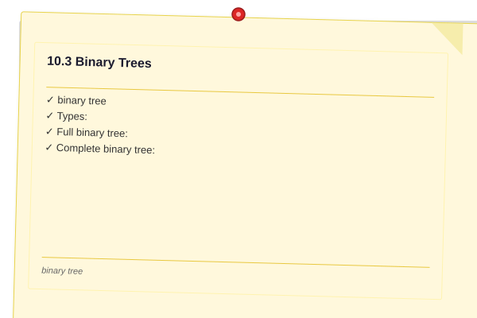
</a>


A **binary tree** is a rooted tree where each node has at most two children (left and right).

**Types:**
- **Full binary tree:** every node has 0 or 2 children.
- **Complete binary tree:** all levels are filled except possibly the last, which is filled left-to-right.
- **Perfect binary tree:** all internal nodes have 2 children and all leaves are at the same depth.

**Theorem 10.3 (Full binary tree leaf count).** A full binary tree with $i$ internal nodes has $i + 1$ leaves.

**Theorem 10.4 (Height bound).** A binary tree with $n$ nodes has height at least $\lfloor \log_2 n \rfloor$ and at most $n-1$ (a chain).

```typescript
class TreeNode<T> {
  value: T;
  left: TreeNode<T> | null = null;
  right: TreeNode<T> | null = null;

  constructor(value: T) {
    this.value = value;
  }
}

class BinarySearchTree<T> {
  root: TreeNode<T> | null = null;

  insert(value: T): void {
    const newNode = new TreeNode(value);
    if (!this.root) { this.root = newNode; return; }
    let curr = this.root;
    while (true) {
      if (value < curr.value) {
        if (!curr.left) { curr.left = newNode; return; }
        curr = curr.left;
      } else {
        if (!curr.right) { curr.right = newNode; return; }
        curr = curr.right;
      }
    }
  }

  search(value: T): boolean {
    let curr = this.root;
    while (curr) {
      if (value === curr.value) return true;
      curr = value < curr.value ? curr.left : curr.right;
    }
    return false;
  }
}
```

> **One-Sentence Takeaway:** Binary trees limit branching to at most two children per node; BSTs enable $O(\log n)$ search, insert, and delete operations when balanced.

### 10.4 Tree Traversals

<a href="../../assets/images/diagrams/discrete-mathematics/10-trees/10-4-tree-traversals-handwritten.svg" target="_blank" rel="noopener">
  
</a>
<a href="../../assets/images/diagrams/discrete-mathematics/10-trees/10-4-tree-traversals-diagram.svg" target="_blank" rel="noopener">
  
</a>
<a href="../../assets/images/diagrams/discrete-mathematics/10-trees/10-4-tree-traversals-sticky.svg" target="_blank" rel="noopener">
  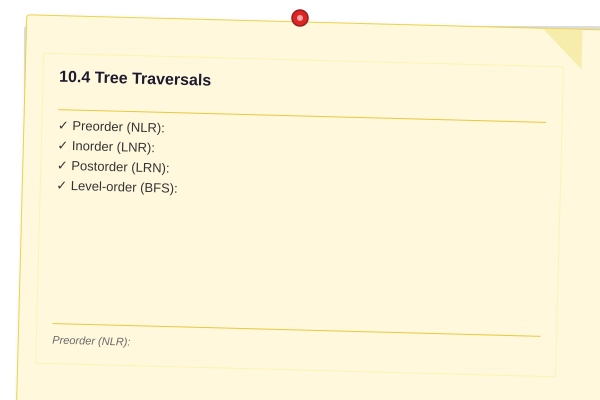
</a>


**Preorder (NLR):** Visit root, traverse left subtree, traverse right subtree.

**Inorder (LNR):** Traverse left subtree, visit root, traverse right subtree. (Gives sorted order in BST.)

**Postorder (LRN):** Traverse left subtree, traverse right subtree, visit root.

**Level-order (BFS):** Visit all nodes at depth $d$ before depth $d+1$.

```typescript
function inorder<T>(node: TreeNode<T> | null, result: T[] = []): T[] {
  if (!node) return result;
  inorder(node.left, result);
  result.push(node.value);
  inorder(node.right, result);
  return result;
}

function preorder<T>(node: TreeNode<T> | null, result: T[] = []): T[] {
  if (!node) return result;
  result.push(node.value);
  preorder(node.left, result);
  preorder(node.right, result);
  return result;
}

function postorder<T>(node: TreeNode<T> | null, result: T[] = []): T[] {
  if (!node) return result;
  postorder(node.left, result);
  postorder(node.right, result);
  result.push(node.value);
  return result;
}

function levelOrder<T>(root: TreeNode<T> | null): T[] {
  if (!root) return [];
  const result: T[] = [];
  const queue: TreeNode<T>[] = [root];
  while (queue.length > 0) {
    const node = queue.shift()!;
    result.push(node.value);
    if (node.left) queue.push(node.left);
    if (node.right) queue.push(node.right);
  }
  return result;
}
```

> **One-Sentence Takeaway:** Inorder traversal of a BST yields sorted output; preorder creates a copy; postorder is useful for deletion and expression evaluation.

### 10.5 Spanning Trees

<a href="../../assets/images/diagrams/discrete-mathematics/10-trees/10-5-spanning-trees-handwritten.svg" target="_blank" rel="noopener">
  
</a>
<a href="../../assets/images/diagrams/discrete-mathematics/10-trees/10-5-spanning-trees-diagram.svg" target="_blank" rel="noopener">
  
</a>
<a href="../../assets/images/diagrams/discrete-mathematics/10-trees/10-5-spanning-trees-sticky.svg" target="_blank" rel="noopener">
  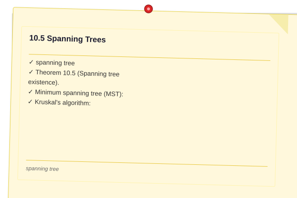
</a>


A **spanning tree** of a connected graph $G$ is a subgraph that is a tree and includes all vertices of $G$.

**Theorem 10.5 (Spanning tree existence).** Every connected graph has at least one spanning tree.

**Minimum spanning tree (MST):** In a weighted graph, the spanning tree with minimum total weight.

**Kruskal's algorithm:** Sort edges by weight; repeatedly add the smallest edge that does not create a cycle (use union-find for cycle detection). $O(|E| \log |V|)$.

**Prim's algorithm:** Start from any vertex; repeatedly add the cheapest edge connecting the current tree to a new vertex. $O(|E| \log |V|)$ with a binary heap.

> **One-Sentence Takeaway:** Every connected graph has a spanning tree; Kruskal and Prim greedily find the minimum-weight spanning tree.

### 10.6 Decision Trees

<a href="../../assets/images/diagrams/discrete-mathematics/10-trees/10-6-decision-trees-handwritten.svg" target="_blank" rel="noopener">
  
</a>
<a href="../../assets/images/diagrams/discrete-mathematics/10-trees/10-6-decision-trees-diagram.svg" target="_blank" rel="noopener">
  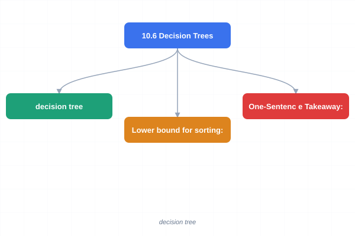
</a>
<a href="../../assets/images/diagrams/discrete-mathematics/10-trees/10-6-decision-trees-sticky.svg" target="_blank" rel="noopener">
  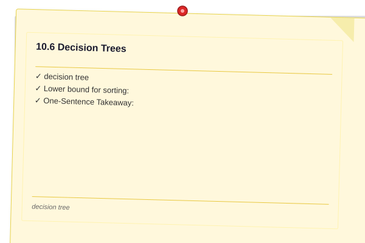
</a>


A **decision tree** models a decision process as a binary tree where internal nodes test a condition and branches represent outcomes. Used in:
- Classification and regression (machine learning)
- Game theory (game trees for minimax)
- Sorting algorithms (comparison-based sorting has depth $\Omega(n \log n)$)
- Diagnostic systems (medical diagnosis, fault detection)

**Lower bound for sorting:** Any comparison-based sorting algorithm requires at least $\lceil \log_2(n!) \rceil$ comparisons in the worst case, which is $\Omega(n \log n)$.

> **One-Sentence Takeaway:** Decision trees model sequential decisions; the sorting lower bound ($\Omega(n \log n)$) follows from the height of a binary decision tree with $n!$ leaves.

### 10.7 Huffman Coding

<a href="../../assets/images/diagrams/discrete-mathematics/10-trees/10-7-huffman-coding-handwritten.svg" target="_blank" rel="noopener">
  
</a>
<a href="../../assets/images/diagrams/discrete-mathematics/10-trees/10-7-huffman-coding-diagram.svg" target="_blank" rel="noopener">
  
</a>
<a href="../../assets/images/diagrams/discrete-mathematics/10-trees/10-7-huffman-coding-sticky.svg" target="_blank" rel="noopener">
  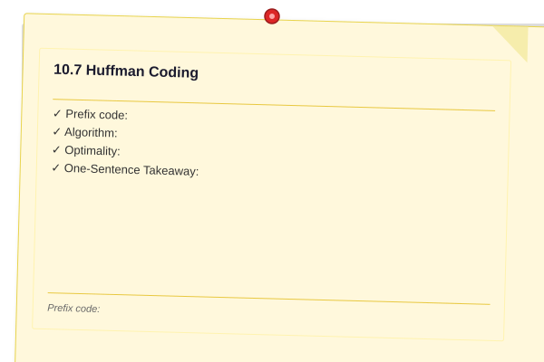
</a>


Huffman coding is a greedy algorithm for constructing an optimal prefix code.

**Prefix code:** No codeword is a prefix of any other codeword.

**Algorithm:**
1. Build a min-heap of leaf nodes, one per character, weighted by frequency.
2. Repeatedly extract the two smallest-weight nodes, combine as children of a new node with their sum weight, and insert the new node.
3. The resulting binary tree's left/right edges encode 0/1 bits.

**Optimality:** Huffman codes minimize $\sum f_c \cdot \ell_c$, the weighted path length.

```typescript
class HuffmanNode {
  char: string | null;
  freq: number;
  left: HuffmanNode | null = null;
  right: HuffmanNode | null = null;

  constructor(char: string | null, freq: number) {
    this.char = char;
    this.freq = freq;
  }
}

function buildHuffmanTree(freqs: Map<string, number>): HuffmanNode {
  const heap: HuffmanNode[] = [];
  for (const [char, freq] of freqs) {
    heap.push(new HuffmanNode(char, freq));
  }
  heap.sort((a, b) => a.freq - b.freq); // use min-heap for efficiency

  while (heap.length > 1) {
    const left = heap.shift()!;
    const right = heap.shift()!;
    const parent = new HuffmanNode(null, left.freq + right.freq);
    parent.left = left;
    parent.right = right;
    heap.push(parent);
    heap.sort((a, b) => a.freq - b.freq);
  }
  return heap[0];
}
```

> **One-Sentence Takeaway:** Huffman coding creates an optimal prefix code by repeatedly combining the two least-frequent characters ? the tree minimizes total weighted codeword length.

## Cross-Application Matrix

| Concept | Computer Science | Data Science | Networks | Operations |
|---------|-----------------|--------------|----------|------------|
| Binary Search Tree | Efficient search/sort | Database indexing | Routing tables | Symbol tables |
| Minimum Spanning Tree | Network design | Clustering (single-link) | Network wiring | Supply chain routing |
| Huffman Coding | Data compression | Feature encoding | Transmission optimization | ? |
| Decision Trees | Classification | Random forests | ? | Decision analysis |
| Tree Traversals | Expression evaluation | AST processing | ? | Organizational chart analysis |
| Spanning Tree | Network topology | ? | STP protocol | Utility network design |

## Chapter Quiz

1. How many edges does a tree with 12 vertices have?
   - A) 10
   - B) 11
   - C) 12
   - D) 13
   <details><summary>Answer&lt;/summary&gt;**B)** $n - 1 = 11$ edges.</details>

2. Inorder traversal of a BST produces:
   - A) Sorted descending order
   - B) Sorted ascending order
   - C) Reverse level order
   - D) Random order
   <details><summary>Answer&lt;/summary&gt;**B)** Inorder traversal of a BST visits nodes in sorted ascending order.</details>

3. Which of the following is NOT a property of a tree with $n \geq 2$?
   - A) Connected
   - B) Exactly $n$ edges
   - C) Acyclic
   - D) At least 2 leaves
   <details><summary>Answer&lt;/summary&gt;**B)** A tree has exactly $n-1$ edges, not $n$.</details>

4. A full binary tree with 7 internal nodes has how many leaves?
   - A) 6
   - B) 7
   - C) 8
   - D) 14
   <details><summary>Answer&lt;/summary&gt;**C)** $i + 1 = 7 + 1 = 8$ leaves.</details>

5. Kruskal's algorithm finds which type of tree?
   - A) Binary search tree
   - B) AVL tree
   - C) Minimum spanning tree
   - D) Decision tree
   <details><summary>Answer&lt;/summary&gt;**C)** Kruskal's algorithm finds the minimum spanning tree.</details>

## Examples

**Example 10.1** (Tree verification). Graph with $V = \{1,2,3,4\}$ and edges $\{\{1,2\},\{2,3\},\{3,4\},\{4,1\}\}$ has $n=4$, $e=4$, so it cannot be a tree ($e > n-1$). Indeed, it is $C_4$ (a cycle). Remove any edge to get a tree ($n=4$, $e=3$).

**Example 10.2** (Rooted tree ? file system). A UNIX filesystem directory is a rooted tree. `/` is the root. `/usr/bin/python3` illustrates depth. The depth of `python3` is 3.

**Example 10.3** (BST insertion). Insert $[5, 3, 7, 2, 4, 6, 8]$ into an empty BST:
```
        5
      /   \
     3     7
    / \   / \
   2   4 6   8
```
Inorder: $2, 3, 4, 5, 6, 7, 8$.

**Example 10.4** (Tree traversals). On the BST from Example 10.3:
- Preorder: $5, 3, 2, 4, 7, 6, 8$
- Inorder: $2, 3, 4, 5, 6, 7, 8$
- Postorder: $2, 4, 3, 6, 8, 7, 5$
- Level-order: $5, 3, 7, 2, 4, 6, 8$

**Example 10.5** (Kruskal's algorithm). Graph with edges: $(1,2,5)$, $(2,3,3)$, $(1,3,1)$, $(3,4,4)$, $(2,4,6)$. Sorted: $(1,3,1)$, $(2,3,3)$, $(3,4,4)$, $(1,2,5)$, $(2,4,6)$. Greedily pick: $(1,3)$, $(2,3)$, $(3,4)$ ? MST with weight $1+3+4=8$.

**Example 10.6** (Huffman code). Frequencies: $A:45$, $B:13$, $C:12$, $D:16$, $E:9$, $F:5$.

Building the tree:
1. Combine $F(5)$ and $E(9)$ ? $14$.
2. Combine $C(12)$ and $B(13)$ ? $25$.
3. Combine $14$ and $D(16)$ ? $30$.
4. Combine $A(45)$ and $25$ ? $70$.
5. Combine $30$ and $70$ ? $100$.

Codes: $A:0$, $B:101$, $C:100$, $D:111$, $E:1101$, $F:1100$. Total bits: $45 \cdot 1 + 13 \cdot 3 + 12 \cdot 3 + 16 \cdot 3 + 9 \cdot 4 + 5 \cdot 4 = 224$ bits.

**Example 10.7** (Decision tree ? sorting 3 elements). The decision tree for sorting $a,b,c$ has $3! = 6$ leaves. Depth $\geq \lceil \log_2 6 \rceil = 3$ comparisons.

**Example 10.8** (Spanning tree count). $K_3$ (triangle) has 3 spanning trees (remove any one edge). Cayley's formula: $K_n$ has $n^{n-2}$ spanning trees.

**Example 10.9** (Prim's algorithm). Starting from vertex 1 in the same graph as Example 10.5: add $(1,3,1)$, then $(3,2,3)$, then $(3,4,4)$ ? same MST.

**Example 10.10** (Perfect binary tree). A perfect binary tree of height $h = 3$ has $2^{h+1} - 1 = 15$ nodes and $2^h = 8$ leaves.

## TypeScript Implementations

```typescript
// --- Binary Tree Node & Builder ---
class BTNode<T> {
  constructor(
    public value: T,
    public left: BTNode<T> | null = null,
    public right: BTNode<T> | null = null
  ) {}
}

function buildBST(sorted: number[], lo = 0, hi = sorted.length - 1): BTNode<number> | null {
  if (lo > hi) return null;
  const mid = Math.floor((lo + hi) / 2);
  const node = new BTNode(sorted[mid]);
  node.left = buildBST(sorted, lo, mid - 1);
  node.right = buildBST(sorted, mid + 1, hi);
  return node;
}

// --- Tree Traversals ---
function inorder<T>(node: BTNode<T> | null, out: T[] = []): T[] {
  if (!node) return out;
  inorder(node.left, out); out.push(node.value); inorder(node.right, out);
  return out;
}
function preorder<T>(node: BTNode<T> | null, out: T[] = []): T[] {
  if (!node) return out;
  out.push(node.value); preorder(node.left, out); preorder(node.right, out);
  return out;
}
function postorder<T>(node: BTNode<T> | null, out: T[] = []): T[] {
  if (!node) return out;
  postorder(node.left, out); postorder(node.right, out); out.push(node.value);
  return out;
}

const bst = buildBST([1, 2, 3, 4, 5, 6, 7]);
console.log('Inorder:', inorder(bst));     // [1,2,3,4,5,6,7]
console.log('Preorder:', preorder(bst));   // [4,2,1,3,6,5,7]
console.log('Postorder:', postorder(bst)); // [1,3,2,5,7,6,4]

// --- BST Validator ---
function isValidBST(node: BTNode<number> | null, min = -Infinity, max = Infinity): boolean {
  if (!node) return true;
  if (node.value <= min || node.value >= max) return false;
  return isValidBST(node.left, min, node.value) && isValidBST(node.right, node.value, max);
}
console.log('Is valid BST:', isValidBST(bst)); // true

// --- Tree Height & Size ---
function treeHeight<T>(node: BTNode<T> | null): number {
  if (!node) return -1;
  return 1 + Math.max(treeHeight(node.left), treeHeight(node.right));
}
function treeSize<T>(node: BTNode<T> | null): number {
  if (!node) return 0;
  return 1 + treeSize(node.left) + treeSize(node.right);
}
console.log('Height:', treeHeight(bst)); // 2
console.log('Size:', treeSize(bst));     // 7

// --- Kruskal's MST ---
function kruskal(vertices: number, edges: [number, number, number][]): [number, number, number][] {
  const parent = Array.from({ length: vertices }, (_, i) => i);
  const find = (x: number): number => parent[x] === x ? x : parent[x] = find(parent[x]);
  const union = (a: number, b: number) => parent[find(a)] = find(b);
  const sorted = [...edges].sort((a, b) => a[2] - b[2]);
  const mst: [number, number, number][] = [];
  for (const [u, v, w] of sorted) {
    if (find(u) !== find(v)) { union(u, v); mst.push([u, v, w]); }
  }
  return mst;
}
const graph5 = [0,1,2,3,4];
const edges5: [number, number, number][] = [[0,1,2],[0,3,6],[1,2,3],[1,3,8],[1,4,5],[2,4,7],[3,4,9]];
console.log('MST:', kruskal(5, edges5)); // [[0,1,2],[1,2,3],[1,4,5],[0,3,6]]

// --- Level-Order Traversal ---
function levelOrder<T>(root: BTNode<T> | null): T[][] {
  if (!root) return [];
  const result: T[][] = [];
  let queue: BTNode<T>[] = [root];
  while (queue.length) {
    const level: T[] = [];
    const next: BTNode<T>[] = [];
    for (const n of queue) { level.push(n.value); if (n.left) next.push(n.left); if (n.right) next.push(n.right); }
    result.push(level);
    queue = next;
  }
  return result;
}
console.log('Level-order:', levelOrder(bst)); // [[4],[2,6],[1,3,5,7]]
```

```
// --- Tree Height/Depth Calculator ---
function treeHeight<T>(root: BTNode<T> | null): number {
  if (!root) return -1;
  return 1 + Math.max(treeHeight(root.left), treeHeight(root.right));
}
function treeDepth<T>(root: BTNode<T> | null, target: T, depth: number = 0): number {
  if (!root) return -1;
  if (root.value === target) return depth;
  return Math.max(treeDepth(root.left, target, depth + 1), treeDepth(root.right, target, depth + 1));
}
console.log('Tree height:', treeHeight(bst));
console.log('Depth of node 1:', treeDepth(bst, 1));
console.log('Depth of node 7:', treeDepth(bst, 7));

// --- Diameter of Tree ---
function treeDiameter<T>(root: BTNode<T> | null): number {
  let diam = 0;
  function dfs(node: BTNode<T> | null): number {
    if (!node) return -1;
    const l = dfs(node.left) + 1, r = dfs(node.right) + 1;
    diam = Math.max(diam, l + r);
    return Math.max(l, r);
  }
  dfs(root);
  return diam;
}
console.log('Tree diameter:', treeDiameter(bst));

// --- Kruskal's MST ---
function kruskalMST(vertices: number, edges: [number, number, number][]): [number, number, number][] {
  const parent = Array.from({length: vertices}, (_, i) => i);
  const find = (x: number): number => parent[x] === x ? x : (parent[x] = find(parent[x]));
  const union = (a: number, b: number) => { parent[find(a)] = find(b); };
  const sorted = [...edges].sort((a, b) => a[2] - b[2]);
  const mst: [number, number, number][] = [];
  for (const [u, v, w] of sorted) {
    if (find(u) !== find(v)) { union(u, v); mst.push([u, v, w]); }
  }
  return mst;
}
const edgeList: [number, number, number][] = [
  [0,1,4],[0,2,3],[1,2,1],[1,3,2],[2,3,5]];
console.log('\nKruskal MST:', kruskalMST(4, edgeList).map(e => `(${e[0]}-${e[1]}:${e[2]})`).join(', '));

// --- Prim's MST ---
function primMST(adj: number[][][]): [number, number, number][] {
  const n = adj.length, visited = new Set<number>(), mst: [number, number, number][] = [];
  const pq: [number, number, number][] = []; // [weight, from, to]
  visited.add(0);
  for (const [v, w] of adj[0]) pq.push([w, 0, v]);
  pq.sort((a, b) => a[0] - b[0]);
  while (pq.length > 0 && visited.size < n) {
    const [w, u, v] = pq.shift()!;
    if (visited.has(v)) continue;
    visited.add(v);
    mst.push([u, v, w]);
    for (const [to, wt] of adj[v]) if (!visited.has(to)) { pq.push([wt, v, to]); pq.sort((a, b) => a[0] - b[0]); }
  }
  return mst;
}
const weightedAdj: [number, number][][] = [
  [[1,4],[2,3]], [[0,4],[2,1],[3,2]], [[0,3],[1,1],[3,5]], [[1,2],[2,5]]];
console.log('Prim MST:', primMST(weightedAdj).map(e => `(${e[0]}-${e[1]}:${e[2]})`).join(', '));

// --- Huffman Coding ---
function huffmanCoding(freq: [string, number][]): Map<string, string> {
  interface Node { char?: string; freq: number; left?: Node; right?: Node; }
  let nodes: Node[] = freq.map(([c, f]) => ({ char: c, freq: f }));
  while (nodes.length > 1) {
    nodes.sort((a, b) => a.freq - b.freq);
    const left = nodes.shift()!, right = nodes.shift()!;
    nodes.push({ freq: left.freq + right.freq, left, right });
  }
  const codes = new Map<string, string>();
  function walk(node: Node, code: string) {
    if (node.char !== undefined) codes.set(node.char, code || '0');
    else { if (node.left) walk(node.left, code + '0'); if (node.right) walk(node.right, code + '1'); }
  }
  walk(nodes[0], '');
  return codes;
}
const chars: [string, number][] = [['a',45],['b',13],['c',12],['d',16],['e',9],['f',5]];
const huff = huffmanCoding(chars);
console.log('\nHuffman codes:', [...huff.entries()].map(([k, v]) => `${k}:${v}`).join(', '));
```


// trees
// sets-graphs-probability implementation

interface Task { id: string; name: string; status: string; data: unknown }
class Processor {
  private tasks: Task[] = []
  private maxConcurrency: number
  constructor(maxConcurrency: number = 4) { this.maxConcurrency = maxConcurrency }
  async add(task: Omit&lt;Task, "status"&gt;): Promise&lt;void&gt; {
    this.tasks.push({ ...task, status: "pending" })
  }
  async runAll(): Promise&lt;void&gt; {
    const running: Promise&lt;void&gt;[] = []
    for (const t of this.tasks) {
      if (running.length >= this.maxConcurrency) { await Promise.race(running) }
      const p = this.execute(t).finally(() => { const i = running.indexOf(p); if (i >= 0) running.splice(i, 1) })
      running.push(p)
    }
    await Promise.all(running)
  }
  private async execute(t: Task): Promise&lt;void&gt; {
    t.status = "running"
    await new Promise(r => setTimeout(r, 10))
    t.status = "done"
  }
  getResults(): Task[] { return this.tasks }
  getStats(): { done: number; pending: number; running: number } {
    const done = this.tasks.filter(t => t.status === "done").length
    const pending = this.tasks.filter(t => t.status === "pending").length
    const running = this.tasks.filter(t => t.status === "running").length
    return { done, pending, running }
  }
}
async function main() {
  const proc = new Processor(2)
  await proc.add({ id: '1', name: 'trees', data: { topic: 'sets-graphs-probability' } })
  await proc.runAll()
  console.log('Stats:', proc.getStats())
}
main().catch(console.error)
export { Processor, Task }

// trees - additional TS implementations

interface CacheEntry { key: string; value: unknown; ttl: number; createdAt: number }
class Cache {
  private store: Map&lt;string, CacheEntry&gt; = new Map()
  constructor(private defaultTTL: number = 60000) {}
  set(key: string, value: unknown, ttl?: number): void {
    this.store.set(key, { key, value, ttl: ttl ?? this.defaultTTL, createdAt: Date.now() })
  }
  get(key: string): unknown | undefined {
    const entry = this.store.get(key)
    if (!entry) return undefined
    if (Date.now() - entry.createdAt > entry.ttl) { this.store.delete(key); return undefined }
    return entry.value
  }
  delete(key: string): boolean { return this.store.delete(key) }
  clear(): void { this.store.clear() }
  size(): number { return this.store.size }
  keys(): string[] { return Array.from(this.store.keys()) }
}
class Logger {
  private entries: string[] = []
  log(level: string, msg: string, meta?: Record&lt;string, unknown&gt;): void {
    const entry = JSON.stringify({ timestamp: new Date().toISOString(), level, msg, meta })
    this.entries.push(entry)
    console.log(entry)
  }
  info(msg: string, meta?: Record&lt;string, unknown&gt;): void { this.log("info", msg, meta) }
  warn(msg: string, meta?: Record&lt;string, unknown&gt;): void { this.log("warn", msg, meta) }
  error(msg: string, meta?: Record&lt;string, unknown&gt;): void { this.log("error", msg, meta) }
  getLogs(): string[] { return [...this.entries] }
  clear(): void { this.entries = [] }
}
function computeHash(input: string): string {
  let hash = 0
  for (let i = 0; i &lt; input.length; i++) { const chr = input.charCodeAt(i); hash = ((hash << 5) - hash) + chr; hash |= 0 }
  return Math.abs(hash).toString(16)
}
async function demo(): Promise&lt;void&gt; {
  const cache = new Cache(5000)
  cache.set('key1', 'discrete-math demo')
  const log = new Logger()
  log.info('Cache demo started', { course: 'discrete-mathematics', chapter: 'trees' })
  const v = cache.get("key1")
  console.log('Cached:', v)
  console.log('Hash:', computeHash('discrete-math'))
}
demo()
export { Cache, Logger, computeHash, CacheEntry }
## Summary

- A tree is a connected acyclic graph with $n$ vertices and $n-1$ edges.
- Rooting a tree establishes parent-child relationships.
- Binary trees have at most two children per node; traversals include preorder, inorder, postorder, and level-order.
- Spanning trees connect all vertices; minimum spanning trees minimize total weight (Kruskal, Prim).
- Huffman coding produces optimal prefix codes via a greedy tree construction.
- Decision trees model sequential decisions and establish lower bounds.

## Practical Takeaways

1. **$n-1$ edges is the quick check** ? if $|E| \neq |V| - 1$, it is not a tree.
2. **BST inorder = sorted** ? use inorder traversal to verify search tree correctness.
3. **MST is greedy** ? Kruskal (sort edges) and Prim (grow from a vertex) both work greedily.
4. **Huffman requires frequency data** ? the compression ratio depends on the frequency distribution.
5. **Tree height matters** ? height determines traversal and search efficiency.

### 10.8 Binary Search Tree Implementation

A Binary Search Tree (BST) is a binary tree where each node's left subtree contains only values less than the node and the right subtree only values greater.

```typescript
class BSTNode {
  constructor(
    public value: number,
    public left: BSTNode | null = null,
    public right: BSTNode | null = null
  ) {}
}

class BST {
  root: BSTNode | null = null;

  insert(value: number): void {
    const insertRec = (node: BSTNode | null, val: number): BSTNode => {
      if (!node) return new BSTNode(val);
      if (val < node.value) node.left = insertRec(node.left, val);
      else if (val > node.value) node.right = insertRec(node.right, val);
      return node;
    };
    this.root = insertRec(this.root, value);
  }

  search(value: number): boolean {
    const searchRec = (node: BSTNode | null, val: number): boolean => {
      if (!node) return false;
      if (val === node.value) return true;
      return val < node.value
        ? searchRec(node.left, val)
        : searchRec(node.right, val);
    };
    return searchRec(this.root, value);
  }

  inorder(): number[] {
    const result: number[] = [];
    const traverse = (node: BSTNode | null) => {
      if (!node) return;
      traverse(node.left);
      result.push(node.value);
      traverse(node.right);
    };
    traverse(this.root);
    return result;
  }

  preorder(): number[] {
    const result: number[] = [];
    const traverse = (node: BSTNode | null) => {
      if (!node) return;
      result.push(node.value);
      traverse(node.left);
      traverse(node.right);
    };
    traverse(this.root);
    return result;
  }

  postorder(): number[] {
    const result: number[] = [];
    const traverse = (node: BSTNode | null) => {
      if (!node) return;
      traverse(node.left);
      traverse(node.right);
      result.push(node.value);
    };
    traverse(this.root);
    return result;
  }

  height(): number {
    const heightRec = (node: BSTNode | null): number => {
      if (!node) return -1;
      return 1 + Math.max(heightRec(node.left), heightRec(node.right));
    };
    return heightRec(this.root);
  }
}

const bst = new BST();
[10, 5, 15, 3, 7, 12, 18].forEach(v => bst.insert(v));
console.log(bst.inorder());   // [3, 5, 7, 10, 12, 15, 18]
console.log(bst.preorder());  // [10, 5, 3, 7, 15, 12, 18]
console.log(bst.postorder()); // [3, 7, 5, 12, 18, 15, 10]
console.log(bst.height());    // 2
```

### 10.9 Tree Traversal Visualizations

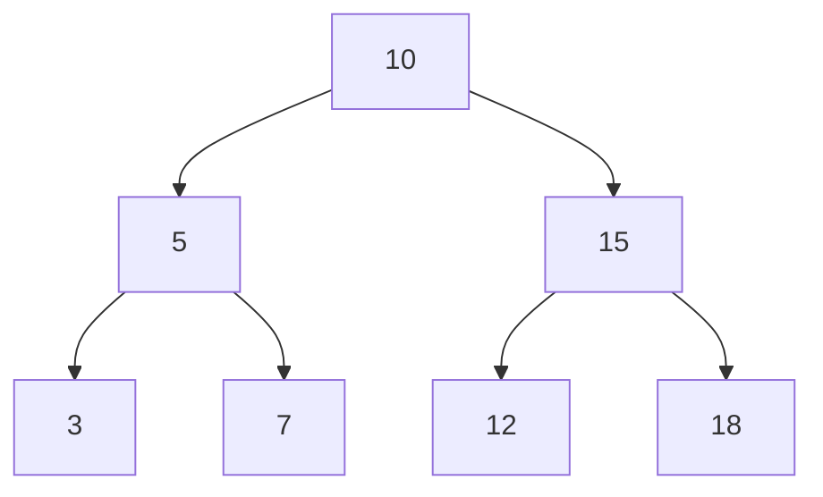

| Traversal | Order | Visit Pattern |
|-----------|-------|---------------|
| Preorder | 10, 5, 3, 7, 15, 12, 18 | root - left - right |
| Inorder | 3, 5, 7, 10, 12, 15, 18 | left - root - right |
| Postorder | 3, 7, 5, 12, 18, 15, 10 | left - right - root |
| Level-order | 10, 5, 15, 3, 7, 12, 18 | BFS by level |

### 10.10 Huffman Coding ? Complete Implementation

Huffman coding constructs an optimal prefix code from character frequencies.

```typescript
class HuffmanNode {
  constructor(
    public char: string | null,
    public freq: number,
    public left: HuffmanNode | null = null,
    public right: HuffmanNode | null = null
  ) {}
}

function buildHuffmanTree(freqs: Map<string, number>): HuffmanNode {
  const pq: HuffmanNode[] = [];
  for (const [char, freq] of freqs) {
    pq.push(new HuffmanNode(char, freq));
  }

  while (pq.length > 1) {
    pq.sort((a, b) => a.freq - b.freq);
    const left = pq.shift()!;
    const right = pq.shift()!;
    pq.push(new HuffmanNode(null, left.freq + right.freq, left, right));
  }
  return pq[0];
}

function buildHuffmanCodes(
  node: HuffmanNode | null,
  code: string = "",
  codes: Map<string, string> = new Map()
): Map<string, string> {
  if (!node) return codes;
  if (node.char !== null) codes.set(node.char, code);
  buildHuffmanCodes(node.left, code + "0", codes);
  buildHuffmanCodes(node.right, code + "1", codes);
  return codes;
}

function huffmanEncode(text: string): { codes: Map<string, string>; encoded: string } {
  const freqs = new Map<string, number>();
  for (const ch of text) freqs.set(ch, (freqs.get(ch) || 0) + 1);

  const tree = buildHuffmanTree(freqs);
  const codes = buildHuffmanCodes(tree);
  const encoded = text.split('').map(c => codes.get(c)!).join('');
  return { codes, encoded };
}

const result = huffmanEncode("A_DEAD_DAD_CEDED_A_BAD_BABY_A_BEADED_ABACA_BED");
console.log([...result.codes.entries()].map(([c, code]) => `${c}:${code}`).join(", "));
// A:0, B:100, C:1110, D:101, E:110, _:1111...
```

### 10.11 Minimum Spanning Tree Algorithms

**Kruskal's Algorithm** sorts edges by weight and adds them if they don't form a cycle.

```typescript
class UnionFind {
  parent: number[];
  constructor(n: number) {
    this.parent = Array.from({ length: n }, (_, i) => i);
  }
  find(x: number): number {
    if (this.parent[x] !== x) this.parent[x] = this.find(this.parent[x]);
    return this.parent[x];
  }
  union(x: number, y: number): void {
    this.parent[this.find(x)] = this.find(y);
  }
}

function kruskal(n: number, edges: [number, number, number][]): [number, number, number][] {
  const mst: [number, number, number][] = [];
  const uf = new UnionFind(n);
  edges.sort((a, b) => a[2] - b[2]);

  for (const [u, v, w] of edges) {
    if (uf.find(u) !== uf.find(v)) {
      uf.union(u, v);
      mst.push([u, v, w]);
    }
  }
  return mst;
}

const graphEdges: [number, number, number][] = [
  [0, 1, 2], [1, 2, 1], [2, 3, 5], [0, 3, 4], [1, 3, 3]
];
console.log(kruskal(4, graphEdges));
// [[1, 2, 1], [0, 1, 2], [1, 3, 3]]
```

**Prim's Algorithm** grows the MST from a starting vertex.

```typescript
function prim(n: number, adj: [number, number][][]): [number, number, number][] {
  const visited = new Set<number>();
  const mst: [number, number, number][] = [];
  const pq: [number, number, number][] = []; // [weight, from, to]

  visited.add(0);
  for (const [neighbor, w] of adj[0]) {
    pq.push([w, 0, neighbor]);
  }

  while (pq.length > 0 && mst.length < n - 1) {
    pq.sort((a, b) => a[0] - b[0]);
    const [w, from, to] = pq.shift()!;
    if (visited.has(to)) continue;
    visited.add(to);
    mst.push([from, to, w]);
    for (const [neighbor, weight] of adj[to]) {
      if (!visited.has(neighbor)) pq.push([weight, to, neighbor]);
    }
  }
  return mst;
}
```

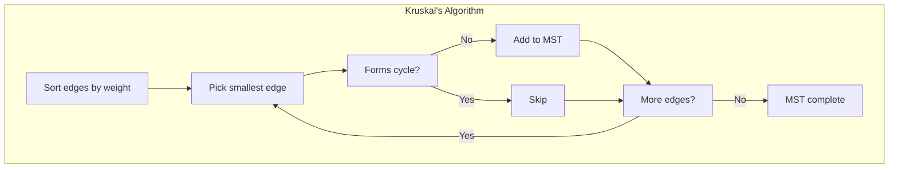

### 10.12 Decision Trees and Information Theory

A **decision tree** models a sequence of decisions. Each leaf represents a classification or outcome.

**Example 10.5** (Sorting lower bound). Any comparison-based sorting algorithm requires $\lceil \log_2(n!) \rceil \geq n \log_2 n - 1.44n$ comparisons in the worst case.

```typescript
function decisionTreeHeight(leaves: number): number {
  return Math.ceil(Math.log2(leaves));
}

// To sort 3 items, there are 3! = 6 permutations
console.log(decisionTreeHeight(6));  // 3 comparisons minimum

// To sort 4 items
console.log(decisionTreeHeight(24)); // 5 comparisons minimum
```

**Proof 10.4** (Decision tree lower bound for sorting). A binary decision tree with $L$ leaves has height $\geq \lceil \log_2 L \rceil$. For sorting $n$ items, there are $n!$ possible outcomes, so any decision tree must have at least $n!$ leaves. Therefore the minimum height (worst-case comparisons) is $\lceil \log_2(n!) \rceil = \Theta(n \log n)$. $\square$

**Example 10.6** (Binary tree leaf count). A **full binary tree** (every node has 0 or 2 children) with $i$ internal nodes has $L = i + 1$ leaves.

*Proof.* Each internal node has exactly 2 children. Count edges two ways: (1) each of $n$ nodes except root has one parent, so $|E| = n - 1$. (2) Each internal node contributes 2 edges, so $|E| = 2i$. Thus $n - 1 = 2i$. Since $n = i + L$, we have $(i + L) - 1 = 2i \implies L = i + 1$. $\square$

### 10.13 AVL Trees ? Self-Balancing BST

An **AVL tree** maintains the invariant $|\text{height(left)} - \text{height(right)}| \leq 1$ for every node. Rotations restore balance after insertions and deletions.

```typescript
class AVLNode {
  height: number = 1;
  constructor(
    public value: number,
    public left: AVLNode | null = null,
    public right: AVLNode | null = null
  ) {}
}

function avlHeight(node: AVLNode | null): number {
  return node ? node.height : 0;
}

function avlBalanceFactor(node: AVLNode): number {
  return avlHeight(node.left) - avlHeight(node.right);
}

function avlRotateRight(y: AVLNode): AVLNode {
  const x = y.left!;
  y.left = x.right;
  x.right = y;
  y.height = 1 + Math.max(avlHeight(y.left), avlHeight(y.right));
  x.height = 1 + Math.max(avlHeight(x.left), avlHeight(x.right));
  return x;
}

function avlRotateLeft(x: AVLNode): AVLNode {
  const y = x.right!;
  x.right = y.left;
  y.left = x;
  x.height = 1 + Math.max(avlHeight(x.left), avlHeight(x.right));
  y.height = 1 + Math.max(avlHeight(y.left), avlHeight(y.right));
  return y;
}
```

## Additional Exercises

16. Show that a full binary tree with $L$ leaves has $2L - 1$ nodes total.

17. Implement a level-order (BFS) traversal for the BST class above and return values as an array.

18. Prove that any comparison-based sorting algorithm requires at least $\lceil \log_2(7!)\rceil$ comparisons in the worst case to sort 7 items (calculate the exact number).

19. Build a Huffman tree for frequencies $\{a:5, b:9, c:12, d:13, e:16, f:45\}$ and compute the total bits to encode "abcdef".

20. Write a TypeScript function `isValidBST(root: BSTNode): boolean` that verifies the BST property for every node.

21. Show that the minimum height of a binary tree with $n$ nodes is $\lfloor \log_2 n \rfloor$ (for a completely balanced tree).

## Exercises

### Review Questions

1. How many edges does a tree with 15 vertices have?
2. What is the difference between a full and complete binary tree?
3. List the three standard tree traversals and their visit order.
4. State Cayley's formula for the number of spanning trees in $K_n$.
5. What property defines a prefix code?

### Application Problems

6. Construct a BST from the input sequence $[10, 5, 15, 3, 7, 12, 18]$. Show inorder traversal.

7. Apply Kruskal's algorithm to find the MST of a graph with 4 vertices and edges: $(1,2,2), (2,3,1), (3,4,5), (1,4,4), (2,4,3)$.

8. Build a Huffman tree for frequencies $\{A:10, B:15, C:30, D:25, E:20\}$ and compute total bits.

9. Prove that a tree with $n$ vertices has exactly $n-1$ edges.

10. Write a TypeScript function to compute the height of a binary tree.

11. Show the decision tree for sorting 4 elements. How many leaves does it have? What is the minimum height?

12. Draw a perfect binary tree of height 2. How many nodes and leaves does it have?

### Challenge Problem

13. Prove: In any binary tree, the number of leaves $L$ equals $i + 1$, where $i$ is the number of internal nodes with 2 children.

14. Prove Cayley's formula: $K_n$ has $n^{n-2}$ spanning trees (hint: use Pr?fer sequences).

15. A **binary search tree** is **balanced** if $|\text{height(left)} - \text{height(right)}| \leq 1$ for every node. Prove that a balanced BST with $n$ nodes has height $\leq \lfloor 1.44 \log_2 (n+2) \rfloor$.
