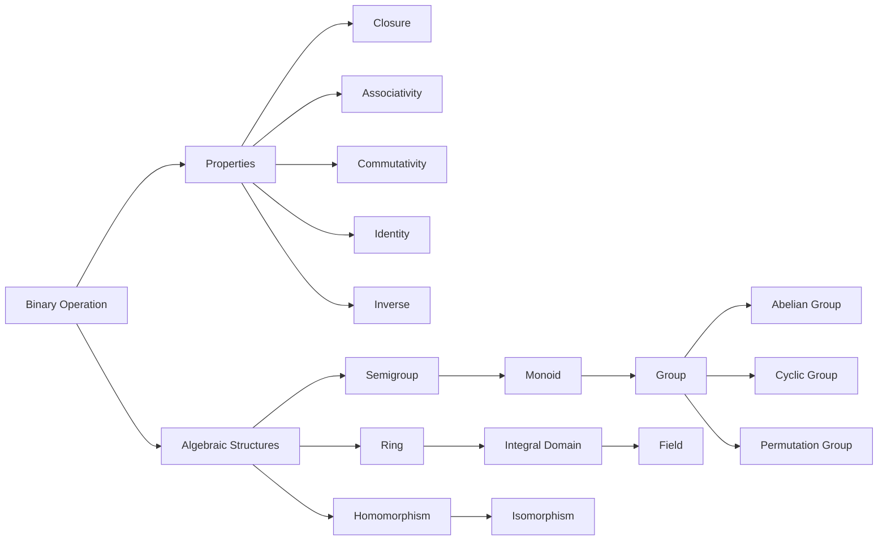

# Chapter 11: Algebraic Structures

> **Previous:** [Chapter 10: Trees](./10-trees.md) | **Next:** [Chapter 12: Boolean Algebra](./12-boolean.md)

## Learning Objectives

After completing this chapter, you will be able to:

- Define binary operations and identify their properties (closure, associativity, commutativity, identity, inverses)
- Recognize groups, semigroups, monoids, rings, and fields
- Apply group axioms and prove basic group properties
- Understand subgroups, cyclic groups, and permutation groups
- Distinguish between homomorphisms and isomorphisms
- Model cryptographic and combinatorial problems using group theory

## Chapter at a Glance

| Topic | Key Insight | Practical Takeaway |
|-------|-------------|-------------------|
| Binary Operations | Combines two elements to produce a third | Properties (closure, associative, commutative) define the structure |
| Semigroups & Monoids | Associativity (semigroup) + identity (monoid) | Strings under concatenation form a monoid |
| Groups | Associativity, identity, inverses, closure | Symmetries, rotations, permutations form groups |
| Abelian Groups | Groups where the operation is commutative | Addition mod $n$ is an abelian group |
| Cyclic Groups | Generated by a single element | $(\mathbb{Z}_n, +)$ is cyclic; generator must be coprime to $n$ |
| Rings | Two operations: addition (group) and multiplication (semigroup) | $\mathbb{Z}$, $\mathbb{Z}_n$, polynomial rings |
| Fields | Every non-zero element has a multiplicative inverse | $\mathbb{Q}$, $\mathbb{R}$, $\mathbb{C}$, $\mathbb{Z}_p$ for prime $p$ |
| Homomorphism | Preserves the operation between structures | Foundation for structure comparison and coding theory |

## Chapter Roadmap



## Theory

### 11.1 Binary Operations

A **binary operation** on a set $S$ is a function $* : S \times S \rightarrow S$. For $a, b \in S$, $a * b$ denotes the result.

**Properties:**
- **Closure:** $a * b \in S$ for all $a, b \in S$.
- **Associativity:** $(a * b) * c = a * (b * c)$ for all $a, b, c \in S$.
- **Commutativity:** $a * b = b * a$ for all $a, b \in S$.
- **Identity:** There exists $e \in S$ such that $a * e = e * a = a$ for all $a \in S$.
- **Inverse:** For each $a \in S$, there exists $b \in S$ such that $a * b = b * a = e$.

> **One-Sentence Takeaway:** A binary operation combines two elements; the properties it satisfies define the type of algebraic structure.

### 11.2 Semigroups and Monoids

**Semigroup:** A set $S$ with an associative binary operation $*$.
- Example: $(\mathbb{Z}^+, +)$ is a semigroup.
- Example: Strings under concatenation form a semigroup.

**Monoid:** A semigroup with an identity element.
- Example: Strings under concatenation with the empty string $\epsilon$ as identity.
- Example: $(\mathbb{Z}, +)$ with identity 0.
- Example: $(\mathbb{Z}, \times)$ with identity 1.

> **One-Sentence Takeaway:** A semigroup requires associativity; a monoid adds an identity element.

### 11.3 Groups

A **group** $(G, *)$ is a set $G$ with a binary operation $*$ satisfying:
1. **Closure:** $a * b \in G$ for all $a, b$.
2. **Associativity:** $(a * b) * c = a * (b * c)$.
3. **Identity:** There exists $e \in G$ with $a * e = e * a = a$.
4. **Inverse:** For each $a$, there exists $a^{-1}$ with $a * a^{-1} = a^{-1} * a = e$.

**Theorem 11.1 (Uniqueness).** The identity element is unique. Each element has a unique inverse.

**Theorem 11.2 (Cancellation laws).** In any group:
- If $a * b = a * c$, then $b = c$ (left cancellation).
- If $b * a = c * a$, then $b = c$ (right cancellation).

**Abelian group:** A group where $*$ is commutative.

**Order of a group:** $|G|$, the number of elements.

**Order of an element:** The smallest positive integer $n$ such that $a^n = e$ (where $a^n$ means $a * a * \cdots * a$, $n$ times).

**Theorem 11.3 (Subgroup criterion).** A non-empty subset $H \subseteq G$ is a **subgroup** ($H \leq G$) if and only if $a, b \in H \implies a * b^{-1} \in H$.

> **One-Sentence Takeaway:** A group is a set with an associative operation that has an identity and inverses; groups are the central objects of algebraic study.

### 11.4 Examples of Groups

**$(\mathbb{Z}, +)$:** Integers under addition. Identity 0. Inverse of $n$ is $-n$. Infinite abelian group.

**$(\mathbb{Z}_n, +)$:** Integers modulo $n$ under addition modulo $n$. Identity 0. Order $n$.

**$(\mathbb{Z}_n^\times, \cdot)$:** Units modulo $n$ under multiplication. Elements coprime to $n$. Order $\phi(n)$ (Euler's totient). Example: $\mathbb{Z}_7^\times = \{1,2,3,4,5,6\}$.

**Symmetric group $S_n$:** Permutations of $n$ elements under composition. Order $n!$. Not abelian for $n \geq 3$.

**Dihedral group $D_n$:** Symmetries of a regular $n$-gon (rotations and reflections). Order $2n$.

```typescript
// Cayley table for Z_4
const Z4: number[] = [0, 1, 2, 3];
function addMod4(a: number, b: number): number {
  return (a + b) % 4;
}

// Cayley table for permutation group S_3
type Permutation = [number, number, number];
function compose(p1: Permutation, p2: Permutation): Permutation {
  return [p1[p2[0]], p1[p2[1]], p1[p2[2]]] as Permutation;
}

const identity: Permutation = [0, 1, 2];
const swap: Permutation = [1, 0, 2];
// compose(swap, swap) = identity
```

> **One-Sentence Takeaway:** Common groups include integers under addition ($\mathbb{Z}_n$), units modulo $n$ ($\mathbb{Z}_n^\times$), permutations ($S_n$), and symmetries ($D_n$).

### 11.5 Cyclic Groups

A group $G$ is **cyclic** if there exists an element $g \in G$ (a **generator**) such that every element of $G$ equals $g^k$ for some integer $k$. In additive notation: every element equals $k \cdot g$.

**Theorem 11.4 (Structure of cyclic groups).**
- Every cyclic group is abelian.
- Every subgroup of a cyclic group is cyclic.
- A finite cyclic group of order $n$ is isomorphic to $(\mathbb{Z}_n, +)$.
- An infinite cyclic group is isomorphic to $(\mathbb{Z}, +)$.

**Theorem 11.5 (Generators of $\mathbb{Z}_n$).** An element $k \in \mathbb{Z}_n$ generates $\mathbb{Z}_n$ under addition if and only if $\gcd(k, n) = 1$.

**Theorem 11.6 (Subgroups of $\mathbb{Z}_n$).** For each positive divisor $d$ of $n$, there is exactly one subgroup of $\mathbb{Z}_n$ of order $d$, generated by $n/d$.

> **One-Sentence Takeaway:** A cyclic group is generated by a single element; all cyclic groups of order $n$ are isomorphic to $\mathbb{Z}_n$, and $\mathbb{Z}_n$ has one subgroup per divisor of $n$.

### 11.6 Permutation Groups

A **permutation** of a set $X$ is a bijection $f: X \rightarrow X$. The set of all permutations of $X$ forms the **symmetric group** $S_X$.

**Cycle notation:** $(a_1\;a_2\;\dots\;a_k)$ means $a_1 \rightarrow a_2 \rightarrow \dots \rightarrow a_k \rightarrow a_1$.

**Transposition:** A 2-cycle $(a\;b)$.

**Theorem 11.7 (Cycle decomposition).** Every permutation can be written uniquely as a product of disjoint cycles (up to order of cycles).

**Theorem 11.8 (Parity).** Every permutation is either even (product of an even number of transpositions) or odd. The alternating group $A_n$ consists of all even permutations in $S_n$, $|A_n| = n!/2$.

> **One-Sentence Takeaway:** Permutations are bijections on a set; every permutation decomposes into disjoint cycles, and the parity (even/odd) is well-defined.

### 11.7 Rings and Fields

**Ring** $(R, +, \cdot)$: A set with two operations such that:
1. $(R, +)$ is an abelian group.
2. $(R, \cdot)$ is a semigroup (associative, not necessarily commutative).
3. Distributive: $a(b+c) = ab + ac$ and $(a+b)c = ac + bc$.

**Examples of rings:** $\mathbb{Z}$ (the integers), $\mathbb{Z}_n$ (integers mod $n$), $M_n(\mathbb{R})$ ($n \times n$ matrices).

**Commutative ring:** Multiplication is commutative.

**Integral domain:** A commutative ring where $ab = 0$ implies $a = 0$ or $b = 0$ (no zero divisors).

**Field:** A commutative ring where every non-zero element has a multiplicative inverse.
- Examples: $\mathbb{Q}$, $\mathbb{R}$, $\mathbb{C}$, $\mathbb{Z}_p$ (for prime $p$).

**Theorem 11.9 (Finite fields).** A finite field exists for every prime power $p^n$. All finite fields of the same order are isomorphic. $\mathbb{Z}_p$ is a field if and only if $p$ is prime.

```typescript
// Modular arithmetic in Z_p (a field for prime p)
class Zp {
  constructor(public readonly p: number) {
    if (!isPrime(p)) throw new Error("p must be prime for Z_p to be a field");
  }

  add(a: number, b: number): number { return (a + b) % this.p; }
  multiply(a: number, b: number): number { return (a * b) % this.p; }

  inverse(a: number): number {
    // Using extended Euclidean algorithm
    let t = 0, newt = 1, r = this.p, newr = a;
    while (newr !== 0) {
      const q = Math.floor(r / newr);
      [t, newt] = [newt, t - q * newt];
      [r, newr] = [newr, r - q * newr];
    }
    return ((t % this.p) + this.p) % this.p;
  }
}

function isPrime(n: number): boolean {
  if (n < 2) return false;
  for (let i = 2; i * i <= n; i++) if (n % i === 0) return false;
  return true;
}
```

> **One-Sentence Takeaway:** A ring has addition and multiplication; a field adds multiplicative inverses (making division possible); finite fields exist exactly for prime power orders.

### 11.8 Homomorphisms and Isomorphisms

**Group homomorphism:** $\phi: G \rightarrow H$ such that $\phi(a * b) = \phi(a) \cdot \phi(b)$ for all $a, b \in G$.

**Kernel:** $\ker(\phi) = \{g \in G \mid \phi(g) = e_H\}$.

**Image:** $\text{im}(\phi) = \{h \in H \mid \exists g \in G, \phi(g) = h\}$.

**Theorem 11.10 (Properties of homomorphisms).** For any homomorphism $\phi$:
- $\phi(e_G) = e_H$.
- $\phi(a^{-1}) = \phi(a)^{-1}$.
- $\ker(\phi)$ is a subgroup of $G$.
- $\text{im}(\phi)$ is a subgroup of $H$.
- $\phi$ is injective iff $\ker(\phi) = \{e_G\}$.

**Isomorphism:** A bijective homomorphism. $G \cong H$ means $G$ and $H$ are isomorphic (structurally identical).

**Theorem 11.11 (Cayley's theorem).** Every group is isomorphic to a subgroup of a symmetric group $S_n$ for some $n$.

## Quick Reference

| Structure | Operation | Associative | Identity | Inverses | Commutative |
|-----------|-----------|-------------|----------|----------|-------------|
| Semigroup | 1 | ✓ | ✗ | ✗ | Maybe |
| Monoid | 1 | ✓ | ✓ | ✗ | Maybe |
| Group | 1 | ✓ | ✓ | ✓ | Maybe |
| Abelian Group | 1 | ✓ | ✓ | ✓ | ✓ |
| Ring | 2 | ✓ (both) | ✓ (add) | ✓ (add) | Add: ✓, Mul: maybe |
| Field | 2 | ✓ (both) | ✓ (both) | ✓ (both, except 0 in mul) | ✓ (both) |

## Cross-Application Matrix

| Concept | Cryptography | Coding Theory | Physics | Computer Science |
|---------|-------------|--------------|---------|-----------------|
| Groups | RSA, DH key exchange | Error-correcting codes | Symmetry groups | Permutation algorithms |
| Finite Fields | AES (GF(2^8)) | Reed-Solomon codes | Quantum mechanics | CRC, hash functions |
| Cyclic Groups | Diffie-Hellman, ElGamal | Cyclic codes | Rotational symmetry | Pseudorandom generation |
| Rings | Homomorphic encryption | Polynomial codes | — | Matrix operations |
| Permutation Groups | — | — | Particle physics | Sorting networks |

## Chapter Quiz

1. Which property does NOT hold for a group?
   - A) Associativity
   - B) Identity
   - C) Commutativity
   - D) Inverses
   <details><summary>Answer</summary>**C)** Groups do not require commutativity; only abelian groups do.</details>

2. What is the order of the symmetric group $S_4$?
   - A) 4
   - B) 12
   - C) 24
   - D) 120
   <details><summary>Answer</summary>**C)** $|S_n| = n! = 4! = 24$.</details>

3. The set $\mathbb{Z}_n$ under addition modulo $n$ is:
   - A) A field
   - B) A group
   - C) A ring but not a group
   - D) A semigroup but not a group
   <details><summary>Answer</summary>**B)** $(\mathbb{Z}_n, +)$ is an abelian group (and a ring, but "group" is the most fundamental correct answer).</details>

4. Which is NOT a field?
   - A) $\mathbb{Z}_5$
   - B) $\mathbb{Z}_6$
   - C) $\mathbb{R}$
   - D) $\mathbb{Q}$
   <details><summary>Answer</summary>**B)** $\mathbb{Z}_6$ is not a field because 6 is not prime — 2 and 3 have no multiplicative inverse.</details>

5. A homomorphism is injective if and only if:
   - A) Its image is the whole codomain
   - B) Its kernel is trivial
   - C) It is surjective
   - D) The groups are finite
   <details><summary>Answer</summary>**B)** $\ker(\phi) = \{e_G\}$ is equivalent to injectivity of a homomorphism.</details>

## Examples

**Example 11.1** (Group verification). $(\mathbb{Z}, -)$ under subtraction: closure holds, but $(a - b) - c \neq a - (b - c)$ in general, so not associative. Not a group.

**Example 11.2** (Semigroup vs. monoid). The set of positive integers under addition is a semigroup (associative) but not a monoid (no identity — 0 is not positive). Adding 0 makes it a monoid.

**Example 11.3** ($\mathbb{Z}_5^\times$). Units modulo 5: $\{1,2,3,4\}$. Multiplication table: $2 \cdot 3 = 6 \equiv 1 \pmod{5}$, so $2^{-1} = 3$. This is a cyclic group of order 4, generated by 2: $2^1=2, 2^2=4, 2^3=3, 2^4=1$.

**Example 11.4** (Cyclic group $\mathbb{Z}_6$). Generators: $\gcd(k,6)=1$ → $1$ and $5$ are generators. Subgroups: for each divisor of 6 (1, 2, 3, 6): $\langle 0 \rangle = \{0\}$, $\langle 3 \rangle = \{0,3\}$, $\langle 2 \rangle = \{0,2,4\}$, and the whole group.

```typescript
function findGenerators(n: number): number[] {
  const generators: number[] = [];
  for (let k = 1; k < n; k++) {
    if (gcd(k, n) === 1) generators.push(k);
  }
  return generators;
}

function gcd(a: number, b: number): number {
  return b === 0 ? a : gcd(b, a % b);
}

console.log(findGenerators(10)); // [1, 3, 7, 9]
```

**Example 11.5** (Permutation in cycle notation). Permutation $\sigma = (1\;3\;4)(2\;5)$ in $S_5$: sends $1 \rightarrow 3$, $3 \rightarrow 4$, $4 \rightarrow 1$, $2 \rightarrow 5$, $5 \rightarrow 2$.

**Example 11.6** (Ring $\mathbb{Z}_6$). $\mathbb{Z}_6$ is a commutative ring with identity 1. Zero divisors: $2 \cdot 3 = 0$ but $2 \neq 0$, $3 \neq 0$. Not an integral domain.

**Example 11.7** (Field $\mathbb{Z}_7$). Every non-zero element in $\mathbb{Z}_7$ has an inverse: $1^{-1}=1$, $2^{-1}=4$, $3^{-1}=5$, $4^{-1}=2$, $5^{-1}=3$, $6^{-1}=6$. This is a field.

**Example 11.8** (Homomorphism). $\phi: \mathbb{Z} \rightarrow \mathbb{Z}_n$ defined by $\phi(k) = k \bmod n$ is a group homomorphism: $\phi(a+b) = (a+b) \bmod n = (a \bmod n + b \bmod n) \bmod n = \phi(a) + \phi(b)$. Kernel: $\{n \cdot k \mid k \in \mathbb{Z}\}$.

**Example 11.9** (Isomorphism). $\mathbb{Z}_2$ under addition and $\{1,-1\}$ under multiplication are isomorphic via $\phi(0) = 1$, $\phi(1) = -1$.

**Example 11.10** (Cayley table for $\mathbb{Z}_4$). $+$ | 0 1 2 3
--- | ---
0 | 0 1 2 3
1 | 1 2 3 0
2 | 2 3 0 1
3 | 3 0 1 2

### 11.9 Direct Sums and Product Groups

The **direct product** of groups $G$ and $H$ is $G \times H = \{(g,h) \mid g \in G, h \in H\}$ with componentwise operation: $(g_1, h_1) * (g_2, h_2) = (g_1 * g_2, h_1 * h_2)$.

**Theorem 11.12 (Order of direct product).** $|G \times H| = |G| \cdot |H|$.

**Theorem 11.13 (Chinese Remainder Theorem for Groups).** If $\gcd(m,n) = 1$, then $\mathbb{Z}_{mn} \cong \mathbb{Z}_m \times \mathbb{Z}_n$. This is the algebraic version of the CRT from number theory.

### 11.10 The Classification of Finite Fields

**Theorem 11.14 (Existence and uniqueness of finite fields).** For every prime $p$ and positive integer $n$, there exists a finite field of order $p^n$ (denoted $\text{GF}(p^n)$ or $\mathbb{F}_{p^n}$). All finite fields of the same order are isomorphic.

**Theorem 11.15 (Subfield criterion).** $\mathbb{F}_{p^m}$ is a subfield of $\mathbb{F}_{p^n}$ if and only if $m \mid n$.

Finite fields are widely used in cryptography (AES uses $\text{GF}(2^8)$), coding theory (Reed-Solomon codes), and computer algebra.

## Summary

- Binary operations combine two elements; properties define the algebraic structure.
- Semigroup: associative. Monoid: semigroup + identity. Group: monoid + inverses.
- Important groups: $\mathbb{Z}_n$, $\mathbb{Z}_n^\times$, $S_n$, $D_n$.
- Cyclic groups are generated by one element; every cyclic group is isomorphic to $\mathbb{Z}_n$.
- Rings have two operations; fields add multiplicative inverses beyond rings.
- Homomorphisms preserve structure; isomorphisms indicate structural identity.

## Practical Takeaways

1. **Group = symmetries** — whenever you think about rotations, permutations, or reversible transformations, you are working in a group.
2. **Fields enable division** — the difference between a ring and a field is that fields let you divide.
3. **$\mathbb{Z}_p$ is a field when $p$ is prime** — this is the foundation of modern cryptography.
4. **Cyclic = one generator** — finding a generator enables efficient computation in the group.
5. **Homomorphism preserves the operation** — always check $\phi(a*b) = \phi(a) \cdot \phi(b)$.

## Exercises

### Review Questions

1. What is the difference between a semigroup and a monoid?
2. Name four properties that define a group.
3. What is the order of $S_5$?
4. Is $\mathbb{Z}_4$ a field? Explain.
5. What does it mean for a homomorphism to be an isomorphism?

### Application Problems

6. Prove that $(\mathbb{Z}, +)$ is an abelian group.

7. Determine the generators of $\mathbb{Z}_{12}$.

8. Write the Cayley table for $\mathbb{Z}_3^\times$ under multiplication.

9. Show that every subgroup of a cyclic group is cyclic.

10. Prove: If $\phi: G \rightarrow H$ is a homomorphism, then $\ker(\phi)$ is a subgroup of $G$.

11. Classify the structure of $(\mathbb{Z}_4, +, \cdot)$ — is it a ring? integral domain? field?

12. Write a TypeScript function that generates the Cayley table for $\mathbb{Z}_n$.

### Challenge Problem

13. Prove that every finite group of prime order is cyclic.

14. Prove: $(\mathbb{Z}_p, +, \cdot)$ is a field if and only if $p$ is prime.

15. Let $G$ be a group. Prove that the map $\phi: G \rightarrow G$ defined by $\phi(g) = g^{-1}$ is an automorphism (isomorphism from $G$ to $G$) if and only if $G$ is abelian.
